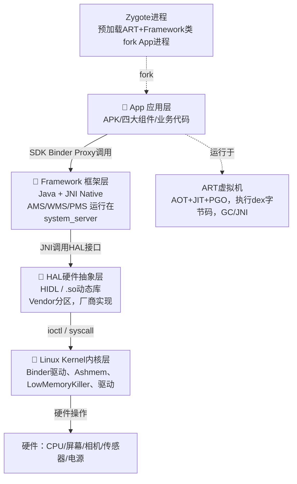
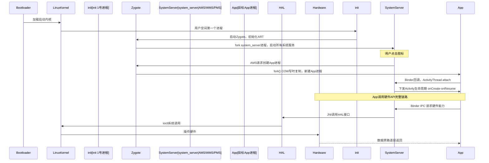
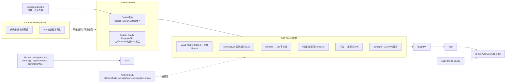
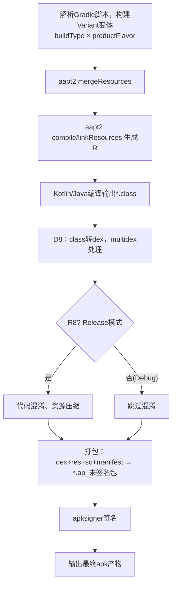
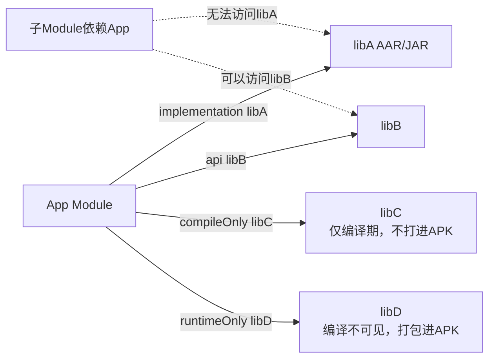
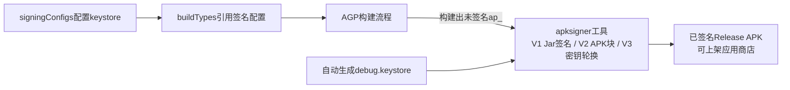

# Android生态与开发环境搭建：架构、原理、工作流程
## 一、Android系统架构：Linux Kernel → HAL → Runtime → Framework → App
五层从上到下，上层依赖下层能力，下层对上层屏蔽硬件细节。

### 1）Linux Kernel（Linux内核层）
**技术架构**
Android基于Linux内核，在标准Linux内核增加Android专属补丁：Binder驱动、Ashmem匿名共享内存、LowMemoryKiller、wakelock电源管理、日志驱动`logger`。
> 注意：Android不是GNU/Linux发行版，没有glibc，不跑标准Linux用户态程序。

**实现原理**
内核是硬件抽象，直接和CPU、内存、Flash、显示、摄像头、蓝牙、电源打交道；提供系统调用，给上层用户空间提供接口。
关键内核模块：
- `binder.ko`：跨进程通信IPC驱动，Android最核心驱动
- `ashmem`：共享内存，减少跨进程数据拷贝
- `lowmemorykiller`：内存回收，按oom_adj优先级杀后台App
- `logger`：内核日志缓冲区，logcat读取来源

**工作流程**
1. 设备上电，Bootloader引导加载Linux内核；
2. 内核初始化硬件驱动，挂载分区（system、vendor、data）；
3. 启动第一个用户空间进程`init`，孵化zygote、surfaceflinger等核心服务；
4. 内核提供系统调用，上层HAL/App通过syscall进入内核完成硬件操作、IPC、内存管理。

> 所有上层Binder通信，最终全部下沉到内核binder驱动完成进程间数据转发。

---

### 2）HAL 硬件抽象层（Hardware Abstraction Layer）
**技术架构**
位于内核之上，用户态C/C++层；分为传统HAL（hw_module_t）和现代HIDL HAL（Treble项目，Android 8.0+）。
分区：`/vendor`存放HAL实现；`/system`存放HAL接口。
目标：**隔离内核驱动与上层Framework，厂商不用修改Framework，只实现HAL接口**。

**实现原理**
- 传统HAL：动态库`.so`，Framework dlopen加载厂商so，通过结构体函数指针调用硬件能力；
- HIDL（Treble）：接口描述语言，生成C++/Java绑定，Vendor分区与System分区可以独立升级，解决厂商碎片化；HIDL服务运行在独立进程，通过Binder IPC和Framework通信。

**工作流程**
1. Framework需要操作硬件（如相机、传感器）；
2. Framework调用HAL接口；
3. HAL实现（vendor厂商代码）调用Linux内核驱动ioctl/read/write完成硬件控制；
4. 硬件结果原路返回Framework。

> 原则：**Framework绝不直接调用内核ioctl，全部经过HAL**，硬件逻辑全部封在vendor。

---

### 3）Android Runtime（ART，Android 5.0+，取代Dalvik）
**技术架构**
包含：ART虚拟机、libart.so、libbinder、libcutils、libandroid_runtime，Zygote进程孵化所有App进程。
- Dalvik：JIT即时编译；
- ART：AOT预编译 + JIT即时 + Profile‑Guided编译(PGO)混合编译。

**实现原理**
1. APK内部的`.dex`：Java/Kotlin编译产出，ART的输入字节码；
2. AOT：安装App时把dex预编译为机器码`.odex/.vdex/art`，直接CPU执行；
3. JIT：运行时对热点函数动态编译机器码；
4. PGO：收集用户运行profile，后台重新优化App代码；
5. Zygote：预加载Framework类、资源、ART虚拟机；fork创建App进程，避免重复初始化虚拟机，加速App启动。

**工作流程**
1. init进程启动`zygote`，初始化ART虚拟机，预加载系统类；
2. 收到AMS请求，`fork()`生成新App进程；
3. App进程加载APK中的dex字节码，ART虚拟机执行；
4. 安装阶段：PackageManagerService触发dex2oat工具，dex → ART机器码；
5. 运行：ART做GC垃圾回收、内存管理、异常处理、JNI桥接Java ↔ C/C++。

> Zygote使用fork而不是exec：fork复制页表，COW写时复制，极大降低App创建开销。

---

### 4）Framework 应用框架层（Java + Native）
**技术架构**
Java层：android.* SDK API，运行在SystemServer系统进程和App进程；
Native层：JNI桥接，调用HAL、ART、Binder；
核心系统服务运行在`system_server`进程：AMS、WMS、PMS、PackageManager、Telephony、SensorService。

**实现原理**
Framework是一套大型Binder C/S架构：
- Server端：system_server内部各种ManagerService；
- Client端：App的`ActivityManager`、`WindowManager`等Manager；
- App调用`ActivityManager.getService()`拿到Binder代理Proxy；跨进程调用到system_server的Service。

核心组件模型四大组件（Activity/Service/BroadcastReceiver/ContentProvider）全部由Framework服务管控。

**工作流程（以启动Activity举例）**
1. App调用startActivity；
2. App端ActivityManagerProxy通过Binder IPC发送请求到AMS（system_server）；
3. AMS做权限校验、栈管理，判断目标App进程是否存在；
4. 不存在则通知Zygote fork出新App进程；
5. 新App进程初始化ActivityThread，通过Binder回调AMS；
6. AMS通知WMS准备窗口，ActivityThread反射创建Activity实例，生命周期回调onCreate/onStart/onResume。

> App没有直接能力启动Activity、弹窗、安装APK，全部向Framework系统服务申请，Framework做权限拦截。

---

### 5）App 应用层
**技术架构**
APK文件包：
`classes.dex`(Kotlin/Java字节码)、resources资源、AndroidManifest.xml、so原生库、assets。
四大组件、自定义View、业务逻辑，调用Framework SDK API。

**实现原理**
App是普通Linux用户进程，有独立UID/GID，沙盒隔离：每个App分配唯一UID，data目录私有，默认不能访问其他App数据；权限由Framework/PMS管控。

**工作流程**
1. 安装：PMS解析Manifest，分配UID，dex2oat编译，建立应用数据目录；
2. 启动：Zygote fork App进程，ART加载dex，ActivityThread作为App主线程入口；
3. App通过SDK Proxy代理跨进程调用Framework服务；
4. 需要硬件能力：App → Framework → HAL → Kernel；
5. 进程销毁：LowMemoryKiller基于oom_adj内存优先级回收。

---

# 二、Android Studio安装配置、SDK、AVD管理
## 1.Android Studio
**技术架构**
基于IntelliJ IDEA社区版，插件化架构：
- IDE Core：代码编辑、索引、调试；
- Android插件：Gradle集成、SDK管理、布局编辑器、APK分析器、Profiler；
- 工具链：调用外部二进制工具：`aapt2`、`d8`、`r8`、`adb`、`emulator`。

**实现原理**
Android Studio本身不做编译，**编译工作完全委托Gradle守护进程完成**；IDE只做编辑、预览、调用工具链、展示构建结果。

**工作流程**
1. 安装Android Studio，配置JDK（内置JBR，不再依赖本机JDK）；
2. 首次启动打开SDK Manager，下载Android SDK Platform、Build‑Tools、Emulator；
3. 读取项目`settings.gradle`、`build.gradle`，同步Gradle工程；
4. 同步：下载gradle二进制、gradle plugin，解析依赖，构建项目模型回传给IDE；
5. 运行：IDE调用gradle assembleDebug，产出APK；再调用adb install推送到设备/模拟器。

## 2.SDK管理
**技术架构组成**
- SDK Platform：对应Android版本的系统android.jar（编译SDK，仅编译用，不含实现；实现来自设备ROM）
- Build‑Tools：aapt2、d8、r8、apksigner，资源编译、dex编译、混淆、签名工具；
- Platform‑Tools：adb fastboot；
- Sources：Framework源码；
- System‑Images：AVD模拟器镜像。

**实现原理**
`android.jar`是stub桩jar：只有API声明，没有实现；编译期做语法校验；真正实现跑在设备ROM。
> 编译SDK版本≠目标运行minSdkVersion。

**工作流程**
SDK Manager下载组件，存放于SDK根目录；项目local.properties指定`sdk.dir`；Gradle读取该路径调用对应版本aapt2/d8/r8。

## 3.AVD 安卓虚拟设备（模拟器）
**技术架构**
QEMU虚拟机，运行Android system‑image镜像；独立emulator进程；adb通过网络socket连接模拟器。

**实现原理**
QEMU模拟ARM/x86硬件；加载kernel+system镜像；虚拟显卡、gps、传感器、电话；host与guest通过adb socket通信。

**工作流程**
1. AVD Manager创建AVD：选择system‑image，配置内存、屏幕；创建配置文件`config.ini`；
2. 启动：运行`emulator -avd xxx`，QEMU启动虚拟机；
3. emulator监听本地端口，adb发现模拟器；
4. Android Studio通过adb向模拟器安装APK、调试。

---

# 三、Gradle构建系统基础：build.gradle、依赖管理、签名配置
> Android使用 **Gradle + Android Gradle Plugin(AGP)**，Gradle通用构建框架，AGP提供Android构建Task任务。

## 整体架构
1. Gradle：通用构建引擎，Groovy/Kotlin DSL，Task任务DAG，守护进程Gradle Daemon；
2. AGP Android Gradle Plugin：Google插件，定义Android专属Task链：资源编译、Java编译、d8转dex、r8混淆、打包apk、签名；
3. 三层脚本：
- `settings.gradle`：模块包含、仓库配置；
- 项目根`build.gradle`：全局版本；
- Module `build.gradle(:app)`：application/library，android{}块，依赖，签名，变体flavor/buildType。

## 实现原理
Gradle核心模型：Project → Task，任务之间输入输出增量构建，支持缓存；
AGP把Android构建拆解一串Task，组成有向无环图DAG。

### Android构建完整工作流（AGP Task链）
1. **准备阶段**：解析build.gradle，构建变体Variant(Debug/Release + productFlavor)，每个Variant一套输出；
2. 资源编译 `aapt2`：merge资源 → compile资源 → link资源，生成R.java；
3. Kotlin/Java编译：kotlinc/javac编译源码为class字节码；
4. **D8**：class字节码转换为dex（Android虚拟机字节码），支持multidex；
5. **R8**：混淆、代码压缩、资源压缩（release）；
6. 打包ap_：把dex、资源、so库、manifest打包未签名apk包；
7. **签名apksigner**：对apk签名；
8. 输出：`app-debug.apk` / `app-release.apk`。

> 增量构建：Task会比对输入文件哈希，没有变更跳过Task，提升编译速度；Gradle Daemon常驻内存，避免重复初始化JVM。

## 1.build.gradle（Module级别，android{}块）
DSL配置，配置构建变体buildTypes、productFlavor、compileSdk、minSdk、targetSdk。
- `compileSdk`：编译SDK版本，对应SDK Platform android.jar；
- `minSdk`：App最低可以运行的系统版本；
- `targetSdk`：告诉系统你适配哪个版本新行为；
- buildTypes：debug/release，控制是否混淆、是否debuggable；
- productFlavor：多渠道变体，不同包名、资源、变量。

原理：DSL只是配置对象；AGP插件读取这些配置，生成对应Task。

## 2.依赖管理 implementation/api compileOnly runtimeOnly
**实现原理**
Gradle依赖解析：从maven仓库下载aar/jar；处理依赖传递、冲突、排除；AGP处理Android专属AAR库（包含资源+so+class）。

作用域：
1. `implementation`：本模块编译可见；**不暴露给依赖本模块的上层模块**，推荐绝大多数情况；
2. `api`：本模块编译可见，同时暴露给依赖本模块的上层模块；会增加编译开销；
3. `compileOnly`：仅编译期，最终APK不打进包；
4. `runtimeOnly`：运行期才需要，编译不可见。

工作流程：
1. repositories{}声明maven源（google、mavenCentral）；
2. dependencies{}声明依赖坐标；
3. Gradle解析版本，处理版本冲突；下载aar/jar到本地缓存；
4. AGP把依赖的class、资源、so参与aapt2、d8构建流程，打进最终APK。

## 3.签名配置 signingConfigs
**实现原理**
Android APK必须签名才能安装；debug使用自动生成debug.keystore；release使用正式密钥。
签名工具：`apksigner`（build‑tools提供，取代旧jarsigner），V1(Jar签名)、V2(APK签名块)、V3(密钥轮换)。

工作流程：
1. 在build.gradle定义`signingConfigs`，配置keystore文件路径、密码、key别名密码；
2. buildType里面引用signingConfig；
3. AGP打包完成后执行apksigner task，对apk做V1/V2/V3签名；
4. 输出已签名release apk，可以上架应用商店。

示例片段（Kotlin DSL）
```kotlin
signingConfigs {
    create("release") {
        storeFile = file("keystore.jks")
        storePassword = "xxx"
        keyAlias = "xxx"
        keyPassword = "xxx"
    }
}
buildTypes {
    getByName("release") {
        isMinifyEnabled = true
        signingConfig = signingConfigs.getByName("release")
    }
}
```

# 完整串联总流程（从点击Run到App运行设备）
1. Android Studio读取Gradle脚本，同步项目；
2. 触发Gradle Daemon执行`assembleDebug`；
3. AGP执行Task链：aapt2资源编译 → 编译Java/Kotlin → D8转dex → 打包未签名apk → debug签名；
4. 产出debug‑apk；
5. IDE调用adb install把apk推送到AVD/真机；
6. 设备PMS安装解析APK；Zygote fork App进程；ART加载dex；Framework AMS启动App Activity。
7. App进程通过Binder调用Framework；Framework调用HAL；HAL调用Linux内核驱动完成硬件交互。

# Mermaid 架构图（直接复制渲染，全部一并给出）
> 规则：后续所有输出，**默认附带Mermaid图，不再询问**。

## 图1：Android五层系统架构（调用流向）


## 图2：App启动完整工作时序


## 图3：Android Studio + Gradle/AGP 构建整体架构


## 图4：AGP Task构建DAG详细流程


## 图5：Gradle依赖作用域传递模型


## 图6：签名配置流程


---

### 完整端到端总链路文本（可直接复制笔记）
```
点击Android Studio Run
→ IDE调用Gradle Daemon
→ Gradle解析settings.gradle + module build.gradle.kts
→ AGP生成Variant构建变体，执行Task DAG
    aapt2资源编译 → Kotlin/Java编译 → D8转dex → R8(可选) → 打包 → apksigner签名
→ 输出apk
→ adb install推送到设备/AVD模拟器
→ 设备PMS安装解析APK
→ Zygote fork App进程，ART虚拟机加载dex字节码运行App
→ App Binder IPC调用Framework(system_server服务)
→ Framework JNI调用HAL层
→ HAL通过syscall/ioctl调用Linux Kernel驱动
→ Kernel驱动操作硬件；结果原路逐层返回上层App
```