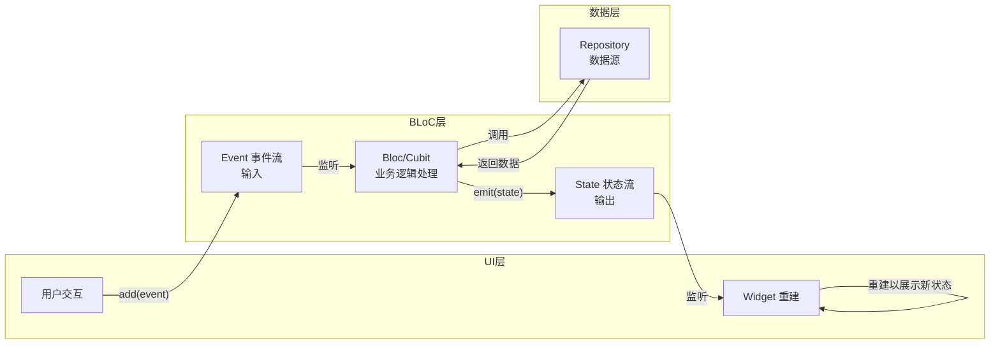
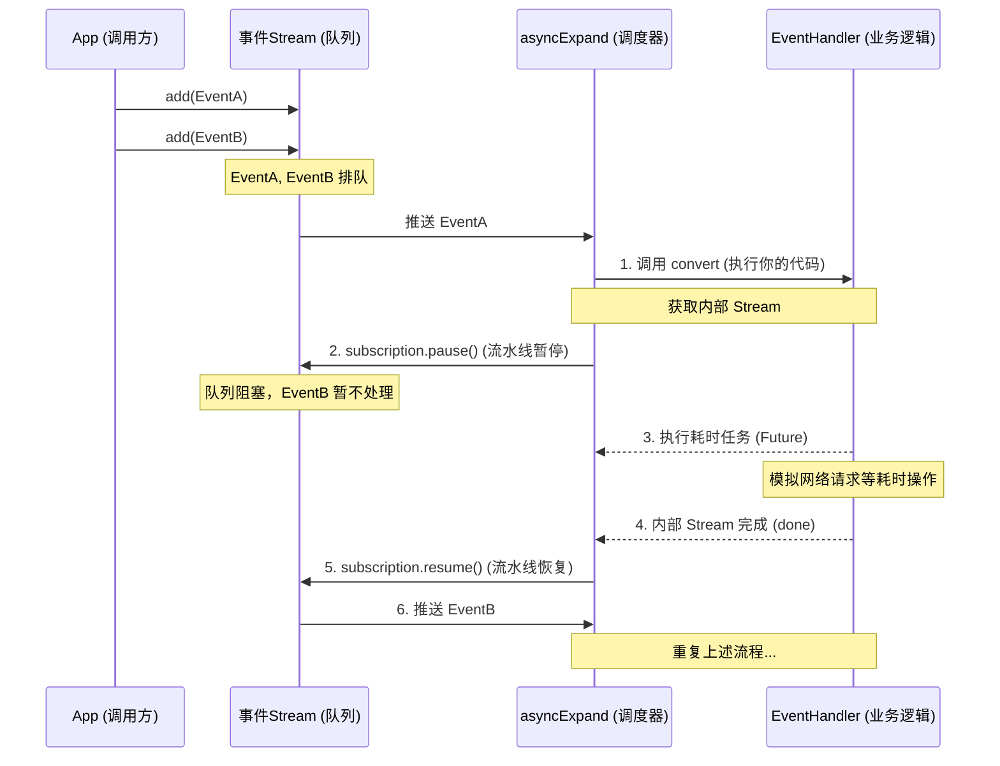

BLoC 是 Flutter 官方推荐的状态管理方案之一，它的核心思想是**将 UI 与业务逻辑彻底分离**，通过**事件驱动**和**单向数据流**来保证代码的可维护性和可预测性。

要理解它的运行机制，可以先看下面这张图，它清晰地展示了 BLoC 的完整工作流程：



接下来，我们分层剖析这张图里的每个环节。

### 🏗️ BLoC 架构的核心设计

BLoC 模式主要包含三个核心组件，它们各司其职：

- **事件**：这是 BLoC 的输入，通常是用户交互（如点击按钮）或生命周期事件（如页面加载），比如 `FetchWeatherEvent`。
- **状态**：这是 BLoC 的输出，是 UI 层需要展示的数据快照，比如 `WeatherLoaded`（包含天气数据）或 `WeatherLoadError`。
- **业务逻辑组件 (Bloc/Cubit)**：这是整个架构的大脑，负责接收事件、执行逻辑（比如调用 API）、并输出新的状态。

> 这里有个重要的区别：`Cubit` 是 BLoC 的简化版，当你只需要通过调用一个方法来改变状态时，用 `Cubit` 就足够了；而当你的逻辑比较复杂，需要用不同的事件类来区分不同操作时，完整的 `Bloc` 类会是更好的选择。

### ⚙️ 原理解析：数据如何流动？

#### 1. 核心基石：Stream 数据流

BLoC 的强大根本来自于 Dart 的 **`Stream`**。你可以把 `Stream` 想象成一条**数据管道**，一端输入数据，另一端就能监听到数据并做出反应。

-   **事件输入**：`Bloc` 内部持有一个 `StreamController`，UI 通过调用 `bloc.add(MyEvent())`，将事件对象添加到这个控制器的 `sink`（输入端）。
-   **状态输出**：`Bloc` 暴露了一个 `Stream` 作为状态输出。UI 组件（如 `BlocBuilder`）监听这个 `Stream`，每当有新的状态流入，UI 就会自动重建。

#### 2. 同步与异步的执行原理

`Bloc` 类在处理事件时，其内部有一个事件队列和一个事件处理器。

-   **并发处理 (Concurrent)**：这是**默认行为**。当新事件到来时，无论上一个事件是否处理完，它都会立即开始执行。适用于大多数互不影响的场景。
-   **按序处理 (Sequential)**：事件被排成队列，**一次只处理一个**。只有当前事件完全处理完毕（即 `emit` 执行完成），下一个事件才会开始。适用于对执行顺序有严格要求的场景，比如动画序列。
-   **可重启处理 (Restartable)**：当新事件到来时，如果上一个事件还在处理中，会**直接取消上一个事件**，并立即开始处理新事件。这非常适用于搜索框：用户快速输入时，只需处理最后一次输入，避免浪费请求。
-   **可丢弃处理 (Droppable)**：当新事件到来时，如果上一个事件还在处理中，新事件会被**直接丢弃**。适用于防止用户狂点按钮导致重复提交的场景。

### 🚀 架构优化与演进：从 `mapEventToState` 到 `on<Event>`

如果你看过一些早期的 BLoC 代码，可能会发现它们使用 `mapEventToState` 方法，而最新的代码则采用 `on<Event>` 的方式。

这种演进主要是为了解决 Dart 语言的一些限制，并带来了几个明显的好处：

1.  **类型安全更优雅**：旧版需要在方法内部写大量的 `if (event is EventA)` 来判断事件类型。新版通过 `on<EventA>` 的方式，为每个事件单独注册处理器，代码更清晰。
2.  **灵活的事件处理策略**：新版 `on` 方法支持传入 `transformer` 参数，让你能轻松配置**事件执行的并发策略**。这正是实现上面提到的 `sequential()`、`restartable()` 等高级控制的关键。
3.  **更强的可组合性**：`on` 方法让拆分和组合事件处理器变得更加容易，提升了大型项目中代码的组织性。

### 💡 最佳实践与注意事项

在使用 BLoC 时，有几个原则值得关注：

-   **状态不可变性**：**始终**通过 `emit` 或 `yield` 返回**新**的状态对象，而不是修改当前状态的属性。这能让 `BlocBuilder` 准确判断是否需要重建 UI。
-   **使用 Equatable**：让你的状态类继承 `Equatable`，这样当新旧状态内容相同时，BLoC 内部会自动跳过更新，提升性能。
-   **善用 BlocProvider**：使用 `BlocProvider` 在 Widget 树中提供 BLoC 实例，它会自动管理 BLoC 的生命周期并避免内存泄漏。
-   **选择合适的监听器**：
    -   `BlocBuilder`：用于根据状态**重建 UI 部分**。
    -   `BlocListener`：用于对状态变化进行**单次响应**，如弹 SnackBar、页面跳转。
    -   `BlocConsumer`：当需要**同时**响应 UI 重建和执行副作用时使用。

你的项目中目前使用的是 `Cubit` 还是完整的 `Bloc`？遇到了具体的状态管理难题吗？欢迎分享你的场景，我可以帮你分析更适合的架构方案。

## sequential与restartable

`sequential()` 和 `restartable()` 的底层实现，本质上都是通过**操作 Dart 的 `Stream` 管道**来改变事件的处理流程。`sequential()` 使用 `asyncExpand` 创建了一个等待队列，而 `restartable()` 则利用 `switchMap` 实现了旧任务的自动取消。

它们的核心源码实现其实非常简洁：

### 📦 源码实现解析

这两个转换器来自 `bloc_concurrency` 包，核心代码极其简短，却体现了函数式响应式编程的精妙。

#### 1.  `sequential()`：排队等待，一个接一个

`sequential` 确保事件**严格按照到达顺序，一个接一个地处理**。它的实现依赖于 Dart 的 `asyncExpand` 方法。

```dart
// sequential 的核心源码 
static EventTransformer<Event> sequential<Event>({bool distinct = false}) {
  return (events, mapper) =>
      events.applyDistinct(distinct).asyncExpand(mapper);
}
```

- **`events`**：这是一个 `Stream<Event>`，也就是源源不断进入 BLoC 的事件流。
- **`mapper`**：就是你写的业务逻辑函数 `_onEvent`，它接收一个事件，返回一个 `Stream<State>`。
- **`asyncExpand`**：这是最关键的操作符。它会将每一个新事件交给 `mapper` 处理，但**必须等前一个事件返回的 `Stream` 全部处理完后，才会开始处理下一个**。这就天然形成了一个队列，保证了顺序执行。

> 你可以把 `asyncExpand` 想象成火车站的人工检票口：一次只能有一个人通过，其他人必须排队，等前面的人完全走出去，下一个人才能开始检票。

#### 2.  `restartable()`：只认最新，旧的直接扔掉

`restartable` 确保**只有最新的事件会被处理，如果前一个事件还在处理中，会被自动取消**。它的核心是 `switchMap` 操作符。

```dart
// restartable 的核心源码 
static EventTransformer<Event> restartable<Event>({bool distinct = false}) {
  return (events, mapper) => events.applyDistinct(distinct).switchMap(mapper);
}
```

- **`switchMap`**：这是实现"可重启"行为的关键。它会始终监听最新的事件。当新事件到达时，如果旧事件对应的内部 `Stream`（即 `mapper` 返回的那个）还没执行完，`switchMap` 会自动**取消订阅**旧的 `Stream`，并立即转向处理新的事件。这就在 BLoC 层面优雅地解决了异步任务的取消问题。

> 把 `switchMap` 想象成换频道：你手里只有一个遥控器，每次换台，上一个频道的画面和声音会立刻消失，只会显示你当前选择的频道。

---

### 🎯 不同场景下的策略选择

为了帮助你更直观地理解，这里用一个具体的**用户搜索**场景来对比：

| 策略 | 处理模式 | 用户操作 | 系统行为 |
| :--- | :--- | :--- | :--- |
| **默认 (concurrent)** | 并行处理 | 快速输入 `A`, `B`, `C` | 同时发起 3 个搜索请求。`B` 和 `C` 的结果可能比 `A` 先返回，导致界面最终显示 `A` 的旧结果，出现状态错乱。 |
| **sequential** | 排队处理 | 快速输入 `A`, `B`, `C` | 严格按照 `A` -> `B` -> `C` 的顺序搜索。如果 `A` 很慢，`B` 和 `C` 必须等待，界面响应会显得迟钝，但结果一定是正确的。 |
| **restartable** | 只处理最新的 | 快速输入 `A`, `B`, `C` | 发起 `A` 请求。`A` 未完成时收到 `B`，立即取消 `A` 的请求并发起 `B`。收到 `C` 后同样取消 `B`。最终只发起并显示 `C` 的搜索结果，这是搜索场景中最优的策略。 |

### 💎 总结：BLoC 并发控制的本质

通过源码我们可以发现，`sequential` 和 `restartable` 的实现原理并不复杂，它们是建立在 Dart 强大的 `Stream` 生态之上的**高阶函数**。

- **`sequential`** 通过 `asyncExpand` 强制排队，实现**顺序**。
- **`restartable`** 通过 `switchMap` 自动取消旧任务，实现**可重启**。

需要我进一步解释 `switchMap` 是如何在 Dart 底层实现"取消旧任务"的吗？

## switchMap 

底层实现，本质上是对上游事件的监听与内部「订阅」的主动管理。当新事件到来时，它会立即取消之前的订阅，从而舍弃旧事件尚未完成的后续数据。

它的核心可以概括为一个状态机，持续跟踪一个叫做 _currentSubscription 的变量。

`switchMap` 的底层实现，本质上是**对上游事件的监听与内部「订阅」的主动管理**。当新事件到来时，它会立即取消之前的订阅，从而舍弃旧事件尚未完成的后续数据。

它的核心可以概括为一个状态机，持续跟踪一个叫做 `_currentSubscription` 的变量。

### 工作机制（一句话 + 流程图）

```text
新事件到来 -> 检查是否有活跃的内部订阅 -> 有则取消它 -> 启动新事件对应的新订阅
```

你可以通过下面的流程图，直观地看到 `switchMap` 在处理多事件时的决策过程：

```mermaid
flowchart TD
    A[上游事件流<br>发出新事件] --> B{switchMap 内部状态}
    B -->|存在活跃的<br>内部订阅| C[调用 cancel()<br>取消旧的内部订阅]
    C --> D[将新事件映射为<br>新的内部 Stream]
    B -->|无活跃订阅| D
    D --> E[订阅这个新的<br>内部 Stream]
    E --> F[将 _currentSubscription<br>指向新订阅]
    F --> G[将新 Stream 产生的事件<br>转发给下游]
```

### 核心源码剖析

虽然我们无法直接看到 Dart SDK 中 `Stream` 的 C++ 源码，但我们可以从 `Stream` 核心库中 `SwitchMapTransformer` 的 Dart 实现来理解其核心逻辑。

```dart
// 简化版 switchMap 核心逻辑 (源于 dart:async)
class _SwitchMapTransformer<S, T> extends StreamTransformerBase<S, T> {
  final FutureOr<Stream<T>> Function(S event) _mapper;

  const _SwitchMapTransformer(this._mapper);

  @override
  Stream<T> bind(Stream<S> stream) {
    // 创建一个可以手动控制的新 Stream
    return Stream.eventTransformed(stream, (sink) {
      late final StreamSubscription<S> _outerSubscription;
      // 关键变量：用于追踪当前的内部订阅
      late final StreamSubscription<T>? _currentSubscription;

      void _cancelCurrent() {
        // 1. 检查并取消当前活跃的内部订阅
        if (_currentSubscription != null) {
          // ⚠️ 核心动作：这里直接取消了对旧异步任务的监听
          _currentSubscription!.cancel(); 
          _currentSubscription = null;
        }
      }

      // 处理每个上游事件的逻辑
      void _handleData(S event) {
        // 第一步：取消旧任务
        _cancelCurrent(); 
        
        Stream<T> newStream;
        try {
          // 第二步：用 mapper 将上游事件转换为一个新的 Stream (比如新的网络请求)
          newStream = _mapper(event);
        } catch (e, s) {
          // 如果 mapper 出错，直接向下游抛错
          sink.addError(e, s);
          return;
        }

        // 第三步：订阅这个新 Stream
        _currentSubscription = newStream.listen(
          // 将新 Stream 产生的数据转发给最终的输出
          sink.add,
          onError: sink.addError,
          onDone: () {
            // 只有当当前这个订阅还是最新的时候，才通知下游完成
            if (_currentSubscription == subscription) {
              _currentSubscription = null;
            }
          },
          cancelOnError: false,
        );
      }

      // 监听上游事件流
      _outerSubscription = stream.listen(
        _handleData,
        onError: sink.addError,
        onDone: () {
          // 当上游关闭时，也要清理内部订阅
          _cancelCurrent();
          sink.close();
        },
      );
      
      // ... 省略取消回调的设置代码
    });
  }
}
```

### 关键步骤拆解

1.  **维护活跃订阅**：`switchMap` 内部有一个变量（`_currentSubscription`），专门指向当前正在处理的内部 `Stream` 的订阅。

2.  **上游事件触发**：当上游 `Stream` 发出一个新的事件时（例如用户的一次点击事件），`switchMap` 会触发 `_handleData` 逻辑。

3.  **取消并清理**：立即检查 `_currentSubscription` 是否不为空（即是否已经有正在进行的异步任务）。如果有，立刻调用该订阅的 **`cancel()`** 方法。

    - *这是最关键的一步*。`cancel()` 的作用不仅仅是停止接收事件。对于底层的网络请求、数据库查询或任何可取消的异步操作，`cancel()` 会向上传递信号，触发实际资源的释放（例如：`HttpClient` 的取消请求、`Timer` 的停止等）。
4.  **映射并订阅**：调用你传入的 `mapper` 函数（即 `(event) => myAsyncTask(event)`），将新事件转换为一个新的 `Stream`。然后，`switchMap` 立即订阅这个新的 `Stream`，并将新的 `StreamSubscription` 赋值给 `_currentSubscription`。

5.  **转发数据**：所有新的内部 `Stream` 产生的事件，都会被 `switchMap` 忠实地转发给下游的 `Bloc` 或 UI 层。

### 一个具体的例子：快速点击切换页面

假设你有一个按钮，点击后调用 `switchMap` 启动一个耗时 5 秒的 `fetchPageData()` 异步任务。

-   **第 0 秒**：用户点击按钮 1。`switchMap` 发起任务 A，`_currentSubscription` 指向 A。
-   **第 2 秒**：用户再次点击按钮 2。`switchMap` 检测到有 `_currentSubscription` (A 还在跑)，立即调用 `A.cancel()`。任务 A 的资源被释放，其后续的 3 秒结果被丢弃。然后发起任务 B，`_currentSubscription` 指向 B。
-   **第 7 秒**：只有任务 B 完成，数据被发给 UI。

### 总结

`switchMap` 底层是维护一个**可被随时取消的订阅变量**，**先取消后订阅**，从而实现了 **“只关注最后一个事件的结果”**。它在 BLoC 中解决了快速重复操作导致的资源浪费和 UI 状态覆盖问题。

>当任务足够快时，取消的窗口期非常短，你需要极高频率的事件才能触发取消；如果任务真的是完全同步的，则取消窗口期为零，永远不会触发取消
如果你感兴趣，我们还可以进一步看看 `asyncExpand` 是如何实现“排队”的。

## AsyncExpand实现

`asyncExpand` 实现事件“排队”的核心机制可以概括为：**阻塞生产者，等待消费者完成。**

它通过在内部维护一个“繁忙”标志，确保只有当上一个事件的异步任务（`EventHandler`）彻底结束后，才会从事件队列中取出并处理下一个事件。

### 🧵 源码解读：它是如何实现排队的？

`asyncExpand` 是 Dart 原生 `Stream` 的扩展方法。当你在 BLoC 的 `on<Event>` 中不指定 `transformer` 时，默认使用的就是它。

以下是你提供的源码核心逻辑：

```dart
// Stream 类的源码简化版
Stream<E> asyncExpand<E>(Stream<E>? convert(T event)) {
  // ... (创建控制器)
  controller.onListen = () {
    // 1. 订阅上游事件流 (即你 add(Event) 的入口)
    subscription.onData((T event) {
      // 2. 调用你的处理函数 (EventHandler)，获取一个返回的 Stream
      Stream<E>? newStream = convert(event);
      
      if (newStream != null) {
        // 🔑 关键步骤：立即暂停上游事件流
        subscription.pause(); 
        
        // 3. 监听并执行这个内部 Stream
        controller.addStream(newStream).whenComplete(() {
          // 🔑 关键步骤：待内部 Stream 完成，恢复上游事件流
          subscription.resume();
        });
      }
    });
  };
  return controller.stream;
}
```

---

### 🔍 步骤拆解：一次完整的处理流程

假设你连续调用了 `bloc.add(EventA)` 和 `bloc.add(EventB)`，我们来看 `asyncExpand` 的具体行为：

1.  **EventA 抵达**
    事件流接收 `EventA`，调用 `asyncExpand` 内部的逻辑。

2.  **调用 `convert` 函数**
    这会触发你写的 `on<EventA>` 里的函数体（`EventHandler`），并得到一个返回的 `Stream`（比如一个 `Future` 转换成 `Stream`）。

3.  **暂停流水线**
    在得到这个内部 `Stream` 后，`asyncExpand` 会**立即暂停上游**。这意味着 **EventB 被堵在了队列中，无法被 `convert` 函数处理**。

4.  **执行异步任务**
    你的 `EventHandler` 开始执行（例如进行网络请求 `await http.get(...)`）。

5.  **恢复流水线**
    当 `EventHandler` 执行完毕，内部 `Stream` 关闭，`whenComplete` 回调被触发，这时 `asyncExpand` 才会调用 `subscription.resume()` 恢复上游。

6.  **EventB 开始处理**
    此时，队列中的 `EventB` 才被取出，重复上述步骤。

#### 🔄 流程图解



---

### 💡 为什么需要关心它？

`asyncExpand` 是 `flutter_bloc` 默认的**并发策略**，理解它的原理能帮你避免很多潜在的 Bug：

-   **安全性**：确保你的事件处理器（如登录、数据库操作）不会同时运行，避免数据竞争。
-   **顺序性**：如果你有依赖关系的事件（如先 `LoadUser` 后 `LoadPosts`），`asyncExpand` 保证了 `LoadPosts` 一定在 `LoadUser` 完成后才执行。
-   **性能感知**：如果某个事件处理特别慢，后续的所有事件都会被卡住。对于搜索框输入这类场景，你可能希望使用 `debounce`（防抖）或 `concurrent`（并发）策略，而不是默认的排队。


> 更多参考https://github.com/felangel/bloc/tree/master/packages/bloc_concurrency,它的本质就通过`EventTransformer`来扩展Stream的实现,在绑定时对传入的流事件进行重新编排