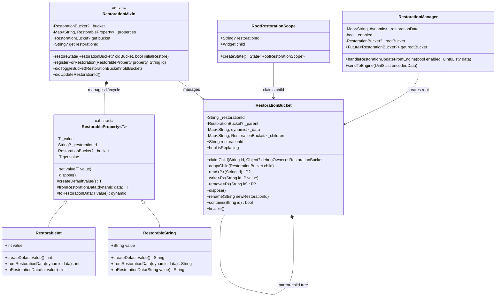
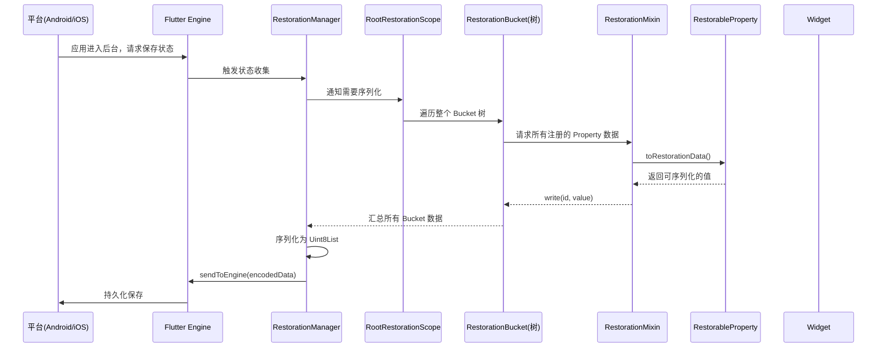
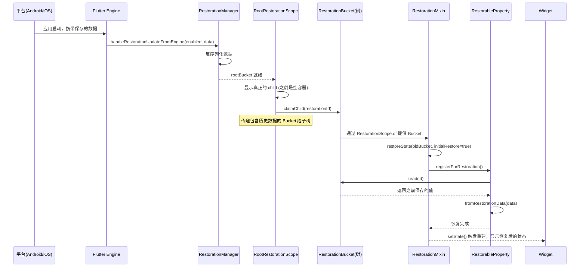
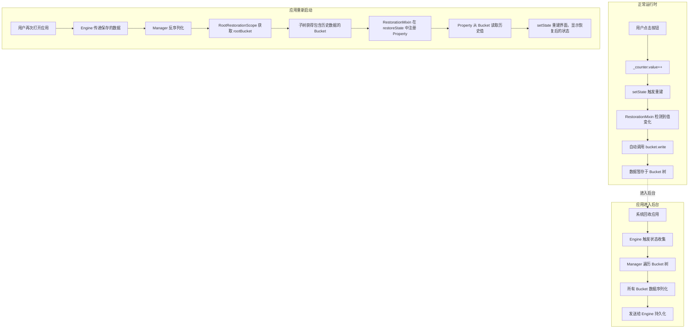
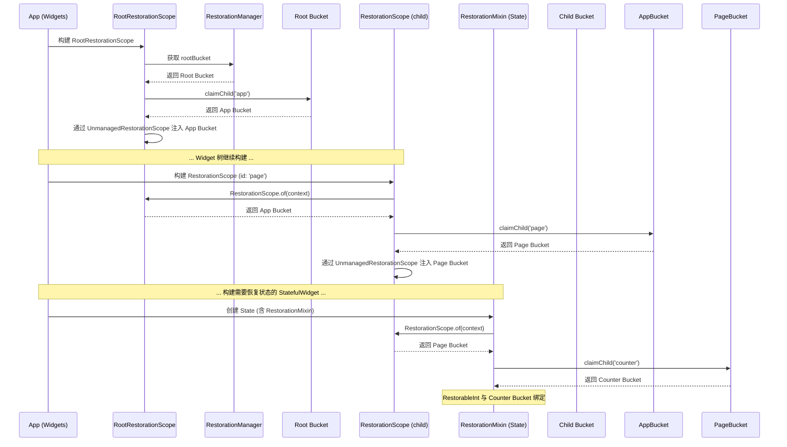

# Flutter 状态恢复机制深度讲解：RestorationManager、RestorationBucket、RootRestorationScope、RestorationMixin

当移动应用被系统从后台回收后再次打开，用户期望看到的是离开时的界面，而不是从头开始。Flutter 的状态恢复（State Restoration）机制正是为此而生。这套机制由 `RestorationManager`、`RestorationBucket`、`RootRestorationScope` 和 `RestorationMixin` 四个核心组件协作完成。

---

## 1. 架构设计

Flutter 的状态恢复机制是一个层次化、树形的数据管理体系，其设计意图是在应用被系统杀死后，能够恢复到之前的用户状态，提供无缝的用户体验。整体架构遵循了**组合模式**和**职责链模式**的设计思想。

### 核心组件定位

| 组件 | 类型 | 核心职责 | 层级定位 |
|------|------|----------|----------|
| **RestorationManager** | 全局管理器（服务） | 与 Flutter Engine 通信，管理整个应用的恢复数据的序列化和反序列化 | 顶层（应用级） |
| **RestorationBucket** | 数据容器 | 存储键值对形式的恢复数据，形成树形结构 | 中层（节点级） |
| **RootRestorationScope** | Widget | 在 Widget 树根节点注入恢复能力，异步获取根 Bucket | 上层（Widget 级入口） |
| **RestorationMixin** | Mixin | 为 State 对象提供简洁的 API，管理 RestorableProperty 的生命周期 | 下层（State 级使用接口） |

### 设计意图

- **RestorationManager**：作为整个恢复系统的中枢，负责与平台层通信，协调数据的存储和恢复时机。
- **RestorationBucket**：通过树形结构组织数据，每个节点只管理自己职责范围内的数据，实现了数据的隔离和封装。
- **RootRestorationScope**：解决根 Bucket 需要异步获取的问题，通过延迟渲染保证恢复数据就绪后才显示界面。
- **RestorationMixin**：封装了与 Bucket 交互的样板代码，开发者只需声明 `RestorableProperty` 并注册即可，大幅降低使用门槛。

---

## 2. 类关系图（Mermaid）



---

## 3. 交互流程图（Mermaid）

### 3.1 状态保存流程（应用进入后台）



### 3.2 状态恢复流程（应用重新启动）



---

## 4. 核心组件详解

### 4.1 RestorationManager

**定位**：`RestorationManager` 是状态恢复系统的核心服务，负责与 Flutter Engine 通信，管理整个应用的恢复数据的生命周期。

**关键职责**：
- **数据序列化与反序列化**：通过 `StandardMessageCodec` 将 `RestorationBucket` 树中的数据序列化为 `Uint8List`，发送给 Engine 持久化。
- **状态分发**：应用启动时，Engine 将保存的数据传递给 Manager，Manager 反序列化后构建 Bucket 树。
- **根 Bucket 管理**：提供 `rootBucket` 属性（异步 Future），作为整个 Bucket 树的根节点。

**源码示意**（基于 Flutter 框架逻辑）：

```dart
class RestorationManager {
  // 当前恢复数据
  Map<Object?, Object?>? _restorationData;
  bool _enabled = false;
  RestorationBucket? _rootBucket;
  
  /// 获取根 Bucket（异步）
  Future<RestorationBucket?> get rootBucket async {
    if (!_enabled) return null;
    if (_rootBucket != null) return _rootBucket;
    // 从 Engine 获取数据后创建根 Bucket
    // ...
  }
  
  /// 从 Engine 接收恢复数据
  void handleRestorationUpdateFromEngine(bool enabled, Uint8List? data) {
    _enabled = enabled;
    if (data != null) {
      // 反序列化数据
      _restorationData = _decodeData(data);
    }
    // 通知所有监听者重建
  }
  
  /// 发送数据到 Engine 进行持久化
  Future<void> sendToEngine(Uint8List encodedData) async {
    // 将序列化数据发送给 Engine
  }
}
```

---

### 4.2 RestorationBucket

**定位**：`RestorationBucket` 是恢复数据的基本存储单元，以**树形结构**组织，每个 Bucket 存储键值对数据并拥有子 Bucket。

**关键概念**：

- **树形结构**：每个 Bucket 有唯一的 `restorationId`，通过 `claimChild` 获取子 Bucket。同一个父 Bucket 下，相同的 `restorationId` 只能被一个所有者认领。
- **数据存储**：通过 `read`、`write`、`remove` 方法管理键值对，值必须是 `StandardMessageCodec` 可序列化的类型。
- **生命周期**：
  - **创建**：通过 `claimChild` 从父 Bucket 获取，或通过 `RootRestorationScope` 自动创建。
  - **使用**：所有者通过 `read/write` 读写数据。
  - **销毁**：调用 `dispose()` 删除 Bucket 及其所有数据，不再用于恢复。

**核心源码逻辑**：

```dart
class RestorationBucket {
  final String restorationId;
  final RestorationBucket? _parent;
  final Map<String, dynamic> _data = {};
  final Map<String, RestorationBucket> _children = {};
  
  /// 认领一个子 Bucket
  /// 如果子 Bucket 已存在且被其他所有者认领，抛出异常
  RestorationBucket claimChild(String restorationId, {required Object? debugOwner}) {
    // 如果已有子 Bucket，返回它
    if (_children.containsKey(restorationId)) {
      final bucket = _children[restorationId]!;
      // 检查是否被其他所有者占用
      if (bucket._owner != null && bucket._owner != debugOwner) {
        throw StateError('Child "$restorationId" already claimed by another owner');
      }
      return bucket;
    }
    // 创建新的子 Bucket
    final bucket = RestorationBucket.child(
      restorationId: restorationId,
      parent: this,
      debugOwner: debugOwner,
    );
    _children[restorationId] = bucket;
    return bucket;
  }
  
  /// 读取数据
  P? read<P>(String restorationId) {
    return _data[restorationId] as P?;
  }
  
  /// 写入数据
  void write<P>(String restorationId, P value) {
    _data[restorationId] = value;
  }
  
  /// 删除数据
  P? remove<P>(String restorationId) {
    return _data.remove(restorationId) as P?;
  }
  
  /// 销毁 Bucket，清理所有数据
  void dispose() {
    _data.clear();
    _children.values.forEach((child) => child.dispose());
    _children.clear();
    _parent?._removeChild(restorationId);
  }
}
```

---

### 4.3 RootRestorationScope

**定位**：`RootRestorationScope` 是一个 Widget，通常在应用根节点（`MaterialApp` 或 `WidgetsApp` 内部）注入，为整个子树启用状态恢复功能。

**核心行为**：

- **异步获取根 Bucket**：`RestorationManager.rootBucket` 是异步的，`RootRestorationScope` 在根 Bucket 就绪前会构建一个**空容器**，并延迟渲染首帧（保持启动屏），避免用户看到空白界面。
- **智能行为切换**：
  - 如果**没有**祖先 `RestorationScope`：从 `RestorationManager.rootBucket` 认领子 Bucket。
  - 如果**有**祖先 `RestorationScope`：退化为普通 `RestorationScope`，从祖先认领 Bucket。
- **强制启用恢复**：只要 `restorationId` 不为 `null`，`RootRestorationScope` 会保证子树有可用的 Bucket。

**源码示意**：

```dart
class RootRestorationScope extends StatefulWidget {
  final String? restorationId;
  final Widget child;
  
  const RootRestorationScope({required this.restorationId, required this.child});
  
  @override
  State<RootRestorationScope> createState() => _RootRestorationScopeState();
}

class _RootRestorationScopeState extends State<RootRestorationScope> {
  RestorationBucket? _bucket;
  
  @override
  void initState() {
    super.initState();
    _initBucket();
  }
  
  Future<void> _initBucket() async {
    // 获取根 Bucket
    final manager = RestorationManager.of(context);
    final rootBucket = await manager.rootBucket;
    if (rootBucket != null && widget.restorationId != null) {
      // 从根 Bucket 认领子 Bucket
      final bucket = rootBucket.claimChild(widget.restorationId!, debugOwner: this);
      setState(() {
        _bucket = bucket;
      });
    }
  }
  
  @override
  Widget build(BuildContext context) {
    if (_bucket == null) {
      // Bucket 尚未就绪，显示空容器并延迟渲染
      return const SizedBox.shrink();
    }
    // 将 Bucket 注入子树
    return RestorationScope(
      bucket: _bucket,
      child: widget.child,
    );
  }
}
```

---

### 4.4 RestorationMixin

**定位**：`RestorationMixin` 是一个为 `State` 对象提供的 Mixin，封装了与 `RestorationBucket` 交互的复杂逻辑，让开发者通过声明式的 `RestorableProperty` 即可实现状态恢复。

**核心机制**：

- **RestorableProperty**：各种数据类型的包装类（如 `RestorableInt`、`RestorableString`），内部持有值并与 Bucket 同步。
- **注册与恢复**：在 `restoreState` 方法中通过 `registerForRestoration` 注册所有 Property，Mixin 会自动完成数据恢复。
- **生命周期管理**：Property 必须在 `State.dispose` 中调用 `dispose()` 释放资源。

**完整示例**（来自 Flutter 官方文档）：

```dart
class RestorableCounter extends StatefulWidget {
  const RestorableCounter({super.key, this.restorationId});
  final String? restorationId;
  
  @override
  State<RestorableCounter> createState() => _RestorableCounterState();
}

class _RestorableCounterState extends State<RestorableCounter> with RestorationMixin {
  // 1. 声明 RestorableProperty
  final RestorableInt _counter = RestorableInt(0);
  
  // 2. 提供 restorationId（唯一标识）
  @override
  String? get restorationId => widget.restorationId;
  
  // 3. 注册所有 Property
  @override
  void restoreState(RestorationBucket? oldBucket, bool initialRestore) {
    registerForRestoration(_counter, 'count');
  }
  
  void _incrementCounter() {
    setState(() {
      _counter.value++; // 值变化自动同步到 Bucket
    });
  }
  
  @override
  void dispose() {
    _counter.dispose(); // 必须释放
    super.dispose();
  }
  
  @override
  Widget build(BuildContext context) {
    return Column(
      children: [
        Text('Count: ${_counter.value}'),
        ElevatedButton(
          onPressed: _incrementCounter,
          child: const Text('Increment'),
        ),
      ],
    );
  }
}
```

---

## 5. 完整数据流转示例

以下是一个完整的数据流转示例，展示用户操作如何触发状态保存和恢复：



---

## 6. 常见使用场景与最佳实践

### 场景 1：MaterialApp 启用全局恢复

```dart
void main() => runApp(const MyApp());

class MyApp extends StatelessWidget {
  const MyApp({super.key});

  @override
  Widget build(BuildContext context) {
    return MaterialApp(
      restorationScopeId: 'app', // ✅ 启用全局状态恢复
      home: const MyHomePage(),
    );
  }
}
```

`MaterialApp` 内部会自动包裹 `RootRestorationScope`，`restorationScopeId` 即为根节点的 `restorationId`。

### 场景 2：自定义 State 使用 RestorationMixin

```dart
class MyStatefulWidget extends StatefulWidget {
  const MyStatefulWidget({super.key, this.restorationId});
  final String? restorationId;
  
  @override
  State<MyStatefulWidget> createState() => _MyStatefulWidgetState();
}

class _MyStatefulWidgetState extends State<MyStatefulWidget> with RestorationMixin {
  final RestorableString _text = RestorableString('默认值');
  final RestorableBool _isEnabled = RestorableBool(true);
  
  @override
  String? get restorationId => widget.restorationId;
  
  @override
  void restoreState(RestorationBucket? oldBucket, bool initialRestore) {
    registerForRestoration(_text, 'text');
    registerForRestoration(_isEnabled, 'enabled');
  }
  
  @override
  void dispose() {
    _text.dispose();
    _isEnabled.dispose();
    super.dispose();
  }
}
```

### 场景 3：手动管理 RestorationScope（嵌套恢复域）

```dart
// 父级提供 Bucket
class ParentWidget extends StatefulWidget {
  const ParentWidget({super.key});
  
  @override
  State<ParentWidget> createState() => _ParentWidgetState();
}

class _ParentWidgetState extends State<ParentWidget> with RestorationMixin {
  @override
  String? get restorationId => 'parent';
  
  @override
  void restoreState(RestorationBucket? oldBucket, bool initialRestore) {
    // 注册父级属性
  }
  
  @override
  Widget build(BuildContext context) {
    // 将 bucket 传递给子树
    return RestorationScope(
      bucket: bucket!, // bucket 来自 RestorationMixin
      child: const ChildWidget(),
    );
  }
}

// 子级从 RestorationScope 获取 Bucket
class ChildWidget extends StatefulWidget {
  const ChildWidget({super.key});
  
  @override
  State<ChildWidget> createState() => _ChildWidgetState();
}

class _ChildWidgetState extends State<ChildWidget> with RestorationMixin {
  @override
  String? get restorationId => 'child';
  
  @override
  void restoreState(RestorationBucket? oldBucket, bool initialRestore) {
    // 自动从祖先 RestorationScope 获取 Bucket
    registerForRestoration(_childValue, 'value');
  }
}
```

### 场景 4：Navigator 恢复导航堆栈

```dart
// ❌ 不推荐：普通 push 无法恢复
Navigator.push(context, MaterialPageRoute(builder: (_) => const DetailPage()));

// ✅ 推荐：使用 restorablePush
Navigator.restorablePush(context, _detailRouteBuilder);

static Route _detailRouteBuilder(BuildContext context, Object? args) {
  return MaterialPageRoute(builder: (_) => const DetailPage());
}
```

---

## 7. 常见问题与注意事项

### 坑 1：忘记在 dispose 中释放 RestorableProperty ❌

```dart
class _MyState extends State<MyWidget> with RestorationMixin {
  final RestorableInt _counter = RestorableInt(0);
  
  @override
  void restoreState(...) {
    registerForRestoration(_counter, 'counter');
  }
  // ❌ 缺少 dispose，导致内存泄漏
}
```

**✅ 正确做法**：

```dart
@override
void dispose() {
  _counter.dispose(); // ✅ 必须释放
  super.dispose();
}
```

### 坑 2：restorationId 在同一个 RestorationScope 下重复 ❌

```dart
// ❌ 同一父级下使用了相同的 restorationId
RestorationScope(
  bucket: parentBucket,
  child: Column(
    children: [
      RestorableWidget(restorationId: 'same'), // 第一个
      RestorableWidget(restorationId: 'same'), // 第二个 → 抛出异常
    ],
  ),
)
```

**问题分析**：同一个父 Bucket 下，相同的 `restorationId` 只能被一个所有者认领。第二个 Widget 尝试认领已被占用的 Bucket 时会抛出异常。

**✅ 解决方案**：确保每个 `restorationId` 在兄弟节点间唯一，可以使用组合方式如 `'widget1_count'`、`'widget2_count'`。

### 坑 3：在 restoreState 中访问 Property 值时机不对 ❌

```dart
@override
void restoreState(RestorationBucket? oldBucket, bool initialRestore) {
  registerForRestoration(_counter, 'counter');
  // ❌ 此时 _counter.value 可能还未恢复完成
  final initialValue = _counter.value; 
}
```

**问题分析**：`registerForRestoration` 是异步恢复过程，在 `restoreState` 方法执行完毕之前，Property 的值可能尚未完全恢复。

**✅ 正确做法**：在 `build` 方法中访问 Property 值，此时恢复已完成。

### 坑 4：复杂对象没有实现序列化 ❌

```dart
class User {
  final String name;
  final int age;
  User(this.name, this.age);
}

// ❌ 错误：User 无法通过 StandardMessageCodec 序列化
final RestorableObject<User> _user = RestorableObject<User>(User('Alice', 25));
```

**✅ 解决方案**：存储可序列化的基础类型或使用 `RestorableValue` 自定义序列化逻辑。

### 坑 5：RootRestorationScope 在恢复前闪烁 ❌

**问题分析**：`RootRestorationScope` 在根 Bucket 异步获取完成前会显示空容器，如果恢复数据较大可能导致短暂空白。

**✅ 解决方案**：
- 使用启动屏（Splash Screen）遮盖，Flutter 会自动处理。
- 避免在根节点放置复杂的 UI，优先显示骨架屏。

---

## 8. 总结对比

| 维度 | RestorationManager | RestorationBucket | RootRestorationScope | RestorationMixin |
|------|-------------------|-------------------|---------------------|------------------|
| **抽象层级** | 服务层（与 Engine 通信） | 数据层（存储键值对） | Widget 层（注入能力） | State 层（使用接口） |
| **开发者交互** | 几乎不直接使用 | 罕见（高级定制） | 框架自动注入 | **最常用** |
| **核心方法** | `sendToEngine` | `claimChild`/`read`/`write` | `restorationId` 参数 | `registerForRestoration` |
| **生命周期** | 应用级 | 跟随 Widget 树 | 跟随 Widget 树 | 跟随 State |

**最佳实践路径**：
1. 在 `MaterialApp` 中设置 `restorationScopeId`（自动注入 `RootRestorationScope`）。
2. 需要恢复状态的 `State` 使用 `RestorationMixin`。
3. 声明 `RestorableProperty` 并在 `restoreState` 中注册。
4. 在 `dispose` 中释放所有 Property。
5. 导航使用 `restorablePush` 系列 API。

`RestorationBucket` 树的形成，是一个**自顶向下、按需认领**的动态过程。它并非一次性生成，而是随着 Widget 树的构建，通过一层层的 `claimChild` 调用逐步“生长”出来的。

这个过程的核心，依赖于三个角色：
1.  **`RestorationManager`**：作为树的根，提供了最顶层的 `rootBucket`。
2.  **`RestorationScope` / `RootRestorationScope`**：作为桥梁，将 `RestorationBucket` 注入到 Widget 树中，供后代使用。
3.  **`RestorationMixin` / `RestorationBucket.claimChild`**：作为“园丁”，通过 `claimChild` 方法从父级认领或创建子 Bucket，从而扩展树的结构。

下面我们通过详细的调用链条来解析这个过程。

### ⚙️ 核心机制：`claimChild` 的三种情况

`RestorationBucket` 树的生长，本质上是对 `claimChild` 方法的反复调用。`claimChild` 的逻辑会根据目标子节点 (`restorationId`) 的存在状态，分三种情况处理：

| 情况 | 描述 | 操作 |
| :--- | :--- | :--- |
| **情况一 (Case 1)** | 该 `restorationId` 已被**当前父节点**下的其他**所有者认领**。 | **返回一个空的 Bucket**，并等待当前帧结束时，由之前的拥有者调用 `dispose()` 放弃所有权。如果未放弃，则会抛出异常。 |
| **情况二 (Case 2)** | 该 `restorationId` 在父节点的历史数据 (`_rawChildren`) 中**不存在**。 | 创建一个**全新的、空的** `RestorationBucket` 子节点，并调用 `adoptChild` 将其加入树中。 |
| **情况三 (Case 3)** | 该 `restorationId` 在父节点的历史数据中**存在**且**未被认领**。 | **创建一个包含历史数据的** `RestorationBucket` 子节点，将其与父节点关联，并标记为已认领 (`_claimedChildren`)。 |

简单来说，`claimChild` 就像一个“认领”接口，你告诉父节点一个 `restorationId`，父节点就会把对应名字的“孩子”（可能是新生的，也可能是带着前世记忆的）交给你管理。

### 📞 详细调用链条：从根到枝叶

树的形成始于 `RestorationManager`，终于具体的业务 Widget。

1.  **初始化根节点 (`RestorationManager.rootBucket`)**
    *   **起点**：应用启动时，`RestorationManager` 会从 Flutter Engine 获取之前保存的恢复数据。
    *   **创建**：当第一次访问 `RestorationManager.rootBucket` 时，它会根据获取的数据创建一个 `RestorationBucket` 实例作为树的根。
    *   **就绪**：这个根 Bucket 准备好后，会通知所有监听者（如 `RootRestorationScope`）。

2.  **注入根上下文 (`RootRestorationScope`)**
    *   **动作**：`RootRestorationScope` 作为应用的根，在 `initState` 时获取到 `rootBucket`，并通过 `claimChild(widget.restorationId)` 从根 Bucket 认领一个属于自己的子 Bucket（例如，`MaterialApp` 中配置的 `restorationScopeId`）。
    *   **结果**：这个子 Bucket 就成为了应用恢复数据树的第一层分支。

3.  **向下传递 (`RestorationScope` 与 `UnmanagedRestorationScope`)**
    *   **动作**：`RootRestorationScope` 在 `build` 方法中，会创建一个 `UnmanagedRestorationScope` Widget，并将刚刚认领到的子 Bucket 放入其中。
    *   **注入**：`UnmanagedRestorationScope` 是一个 `InheritedWidget`，它让后代 Widget 可以通过 `RestorationScope.of(context)` 访问到这个 Bucket。
    *   **子节点复用**：当一个普通的 `RestorationScope` 被使用时，它会在 `build` 方法中，通过 `RestorationScope.of` 获取到父级 `UnmanagedRestorationScope` 中的 Bucket，然后再次调用 `claimChild`，从该 Bucket 中认领**自己**的子 Bucket，并继续通过 `UnmanagedRestorationScope` 向下传递。这是一个层层嵌套的过程。

4.  **业务层认领 (`RestorationMixin`)**
    *   **触发**：当一个带有 `RestorationMixin` 的 `State` 对象（如一个需要保存状态的 `StatefulWidget` 的 State）初始化时，它会通过 `RestorationScope.of(context)` 获取到最近的祖先 Bucket。
    *   **动作**：在 `restoreState` 生命周期方法中，它会为每个 `RestorableProperty`（如 `RestorableInt`）调用 `registerForRestoration(property, id)`。
    *   **核心调用**：`registerForRestoration` 方法的内部，实际上就是调用了从父级获取到的 Bucket 的 `claimChild(id)` 方法。这个调用会返回一个专门用于存储该 Property 数据的子 Bucket。
    *   **绑定**：该 `RestorableProperty` 对象会与这个 Bucket 绑定，后续的读写操作都通过这个 Bucket 进行。

### 📊 调用链条示意图

以下是一个简化的时序图，展示了 `RestorationBucket` 树的构建过程：



### 🎯 关键点总结

*   **树是动态生长的**：`RestorationBucket` 树的形状，完全由应用中实际调用了 `claimChild` 的 Widget 结构决定。如果一个 Widget 从未被构建，或者它的 `restorationId` 为 null，那么对应的 Bucket 分支就不会存在。
*   **ID 的稳定性至关重要**：`restorationId` 是连接过去与现在的桥梁。同一个 Widget，在不同的应用生命周期中，必须使用完全相同的 `restorationId` 来调用 `claimChild`，才能找回它之前存储的数据。
*   **所有权是独占且临时的**：一个 `restorationId` 在同一个父 Bucket 下，**只能被一个所有者认领**。当所有者 Widget 被销毁时，它**必须调用其 Bucket 的 `dispose()` 方法**来释放所有权并清理数据。否则，新的 Widget 将无法认领该 ID，或导致数据残留。

希望这个详细的调用链条能帮你理清 `RestorationBucket` 树是如何形成的。总的来说，它不是一个预先定义好的静态结构，而是由 Flutter 框架和应用代码在运行时，通过层层认领的方式，共同构建出的一个活的数据组织树。