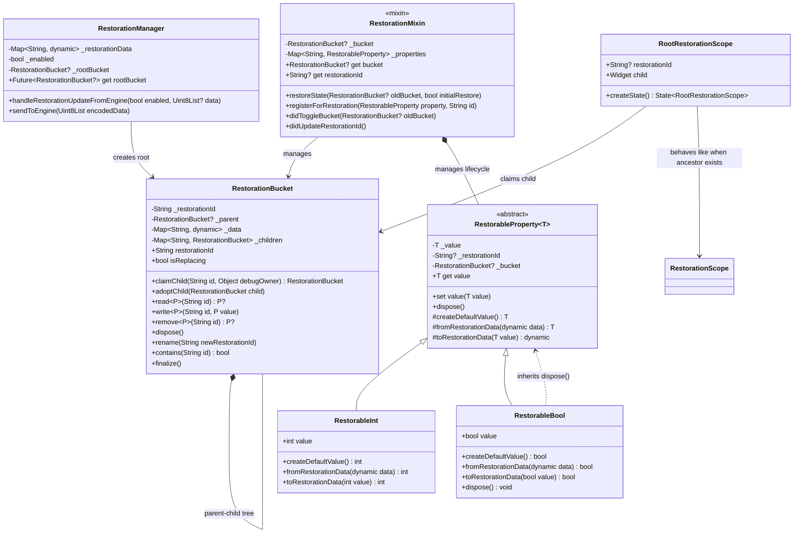
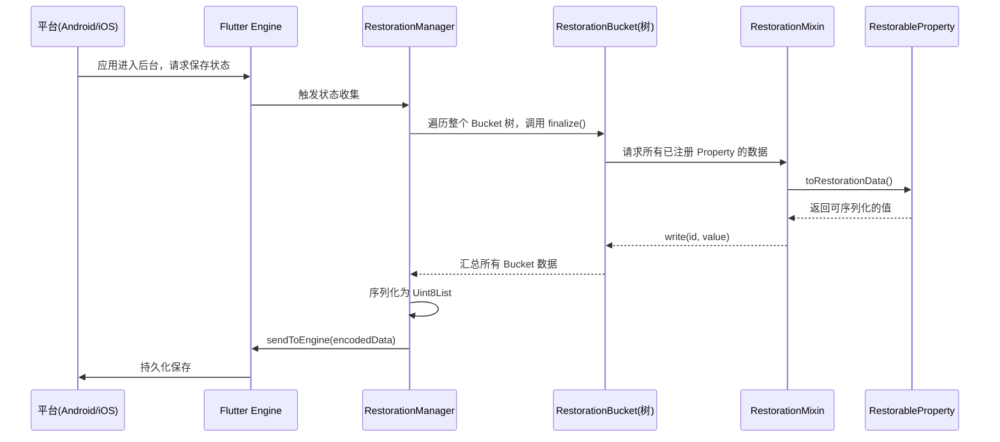
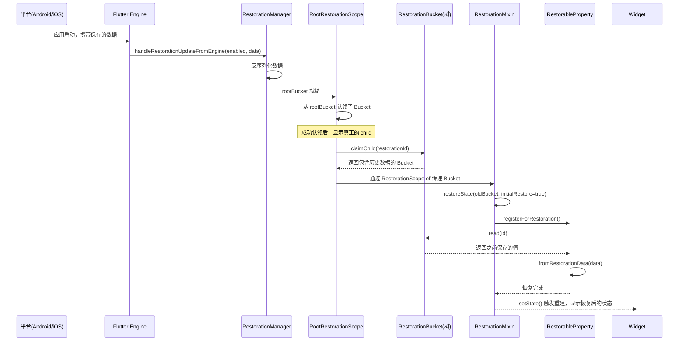

## 关于 RestorableBool 的 dispose 方法

首先，我需要更正一个重要的前提：**`RestorableBool` 确实有 `dispose` 方法**。

根据 Flutter 官方文档，`RestorableBool` 继承自 `RestorableProperty`，而 `RestorableProperty` 有一个 `dispose()` 方法，用于释放资源。调用 `dispose()` 后，该对象将不再处于可用状态，后续调用 `addListener` 会抛出异常。所以，你在使用 `RestorableBool` 时，**仍然需要在 `State.dispose` 中调用 `dispose()` 方法**，这与 `RestorableInt`、`RestorableString` 等类型的行为是一致的。

下面，我将结合 Flutter 3.36.5 版本的源码，从架构、设计模式、类图、交互流程、数据流转和生命周期等多个维度，为你详细讲解 `RestorationManager`、`RestorationBucket`、`RootRestorationScope` 和 `RestorationMixin` 这四大核心组件。

---

## 1. 架构设计

Flutter 的状态恢复机制采用了**树形数据管理**的架构，整体由四个核心组件协作完成。其设计意图是：在应用因系统回收等场景被销毁后，能够恢复到用户离开前的状态，从而提供无缝的用户体验。

| 组件                     | 类型               | 核心职责                                                                                                           | 层级定位                 |
| :----------------------- | :----------------- | :----------------------------------------------------------------------------------------------------------------- | :----------------------- |
| **RestorationManager**   | 全局管理器（服务） | 与 Flutter Engine 通信，管理整个应用恢复数据的序列化和反序列化。                                                   | 顶层（应用级）           |
| **RestorationBucket**    | 数据容器           | 以树形结构存储键值对形式的恢复数据，`restorationId` 在其父节点下必须唯一。                                         | 中层（节点级）           |
| **RootRestorationScope** | Widget             | 在 Widget 树的根节点注入恢复能力，异步获取根 Bucket，并在数据就绪前通过延迟首帧来保持启动屏。                      | 上层（Widget 级入口）    |
| **RestorationMixin**     | Mixin              | 为 `State` 对象提供简洁的 API，封装了与 `RestorationBucket` 交互的样板代码，管理 `RestorableProperty` 的生命周期。 | 下层（State 级使用接口） |

### 设计意图与设计模式

*   **组合模式 (Composite Pattern)**：`RestorationBucket` 组织成树形结构，每个节点都可以存储数据或拥有子节点，使得单个对象和组合对象的使用具有一致性。
*   **职责链模式 (Chain of Responsibility Pattern)**：`RestorationScope` 和 `RootRestorationScope` 沿着 Widget 树层层传递 `RestorationBucket`，子 Widget 通过 `RestorationScope.of` 获取最近的 Bucket 来存储或读取数据。
*   **模板方法模式 (Template Method Pattern)**：`RestorationMixin` 定义了状态恢复的算法骨架（如 `restoreState`），并将某些步骤（如 `registerForRestoration`）延迟到子类中实现。

---

## 2. 类关系图（Mermaid）

**关键类图说明**：
*   **`RestorationManager`** 是整个系统的中枢，负责创建和管理根 `RestorationBucket`。
*   **`RestorationBucket`** 通过 `claimChild` 方法组织成树形结构。每个子 Bucket 的 `restorationId` 在其父 Bucket 下必须唯一。
*   **`RootRestorationScope`** 在 Widget 树根节点工作，它会从 `RestorationManager.rootBucket` 认领子 Bucket。
*   **`RestorationMixin`** 为 `State` 对象提供了使用 `RestorationBucket` 的能力，并管理着所有 `RestorableProperty` 的生命周期。
*   **`RestorableBool`** 作为 `RestorableProperty` 的子类，自然继承了其 `dispose` 方法。

---

## 3. 交互流程图

### 3.1 状态保存流程（应用进入后台）

### 3.2 状态恢复流程（应用重新启动）

---

## 4. 核心组件详解

### 4.1 RestorationManager

`RestorationManager` 是整个恢复系统的中枢，但**开发者几乎不会直接使用它**。它负责：
*   与 Flutter Engine 通信，接收和发送恢复数据。
*   管理根 `RestorationBucket`，通过 `rootBucket` 这个 `Future` 异步提供。
*   协调整个恢复数据的序列化和反序列化过程。

### 4.2 RestorationBucket

`RestorationBucket` 是**数据存储的基本单元**，以树形结构组织。

*   **`claimChild(String restorationId, {required Object? debugOwner})`**：这是获取子 Bucket 的唯一方式。在同一个父 Bucket 下，相同的 `restorationId` 只能被一个所有者认领。如果被重复认领，会抛出异常。
*   **`read
(String restorationId)` / `write
(String restorationId, P value)`**：用于读写键值对数据。值必须是 `StandardMessageCodec` 可序列化的类型。
*   **`dispose()`**：**至关重要**。当这个 Bucket 不再需要时（例如对应的 Widget 被移除），必须调用 `dispose()` 来清理数据，否则这些数据会残留在恢复数据中，可能导致状态恢复异常。

### 4.3 RootRestorationScope

`RootRestorationScope` 通常由 `MaterialApp`、`CupertinoApp` 或 `WidgetsApp` 在根节点自动注入。

*   **异步处理**：`RestorationManager.rootBucket` 的获取是异步的。`RootRestorationScope` 在 Bucket 就绪前会构建一个**空容器**，并通过延迟首帧渲染来保持启动屏，避免用户看到空白界面。
*   **智能行为**：如果存在祖先 `RestorationScope`，`RootRestorationScope` 会退化为普通 `RestorationScope`，从祖先认领 Bucket。
*   **强制启用**：只要 `restorationId` 不为 `null`，`RootRestorationScope` 会确保子树有可用的 Bucket。

### 4.4 RestorationMixin

`RestorationMixin` 是**开发者最常用的接口**，它为 `State` 对象提供了声明式的状态恢复能力。

*   **`restorationId`**：必须重写，提供唯一的标识符。如果为 `null`，该 Widget 的状态恢复将被禁用。
*   **`restoreState(RestorationBucket? oldBucket, bool initialRestore)`**：**必须重写并在此方法中调用 `registerForRestoration` 注册所有 `RestorableProperty`**。
*   **`registerForRestoration(RestorableProperty property, String id)`**：将 `RestorableProperty` 注册到当前的 `RestorationBucket` 中。`id` 在当前 Bucket 中必须唯一。
*   **`dispose()`**：在 `State.dispose` 中，**必须手动调用所有 `RestorableProperty` 的 `dispose()` 方法**，包括 `RestorableBool`。

---

## 5. 数据流转与生命周期

### 5.1 `RestorationBucket` 的生命周期

1.  **创建**：通过父 Bucket 的 `claimChild` 方法创建。
2.  **使用**：所有者通过 `read`/`write` 读写数据，数据会实时更新到 Bucket 中。
3.  **销毁**：当不再需要时，调用 `dispose()` 方法，该 Bucket 及其所有子 Bucket 和数据都会从树中移除。

### 5.2 `RestorationMixin` 的生命周期

1.  **`initState` 之后**：`RestorationMixin` 会调用 `restoreState`，此时所有 `RestorableProperty` 会被注册并恢复历史值（如果存在）。
2.  **`build` 期间**：`RestorationMixin` 通过 `RestorationScope.of` 获取 `RestorationBucket`，并用于存储所有注册的 `RestorableProperty` 的数据。
3.  **数据更新**：当 `RestorableProperty` 的值发生变化时，数据会自动同步到 `RestorationBucket`。
4.  **`dispose`**：必须释放所有 `RestorableProperty` 和 `RestorationMixin` 本身的资源。

---

## 6. 总结

Flutter 的状态恢复机制是一个设计精良的系统：
*   **`RestorationManager`** 是中枢，处理与 Engine 的通信。
*   **`RestorationBucket`** 是数据载体，形成树形存储结构。
*   **`RootRestorationScope`** 是根入口，负责启用整个应用的恢复能力。
*   **`RestorationMixin`** 是开发者的接口，通过 `RestorableProperty` 简化了状态恢复的实现。

**关键实践提醒**：
*   **`restorationId` 必须唯一**，尤其是在同一个父级 `RestorationScope` 下。
*   **所有 `RestorableProperty`（包括 `RestorableBool`）都必须在 `dispose` 中调用 `dispose()`**。
*   在 `restoreState` 中**只注册 Property**，不要在此时访问它们的值（值在注册完成后才恢复）。