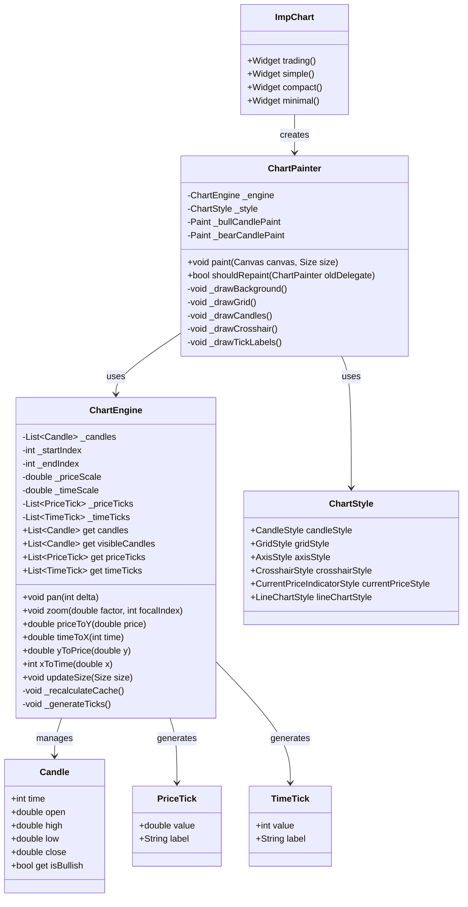
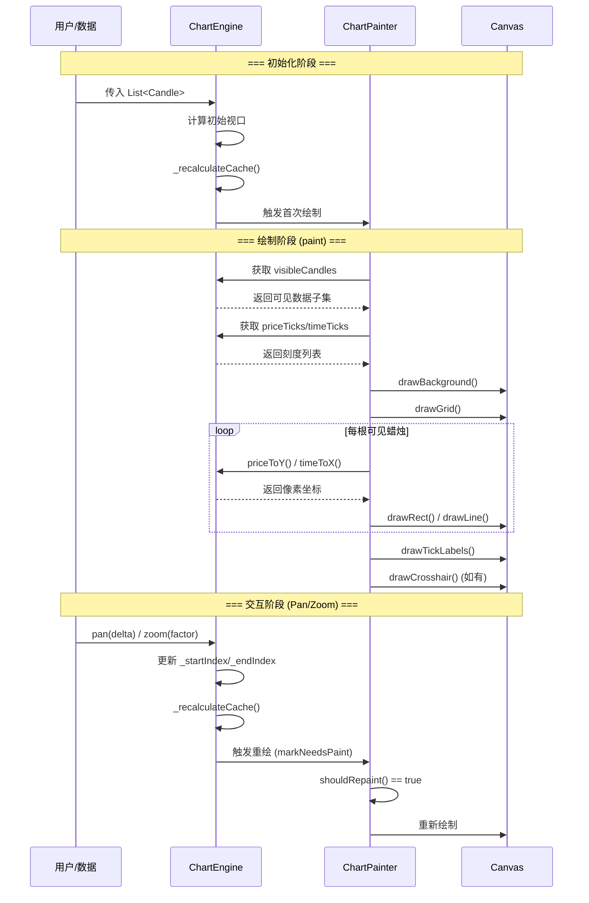

# imp_trading_chart 源码深度解析：一个高性能 Flutter 交易图表引擎的设计与实现

> 从“Widget 思维”转向“像素思维”——一个渲染优先的图表引擎是如何炼成的

## 一、引言：为什么需要 Engine-First 架构

在 Flutter 生态中，图表库并不少见。但大多数图表库遵循的是“Widget-First”思路：每根 K 线是一个 Widget，整个图表是一棵深度的 Widget 树。这种设计在数据量较小时没有问题，但当数据量达到 5000-10000 根 K 线、需要实时更新和流畅的平移缩放时，问题就暴露出来了：

- **卡顿（Jank）** 和 **掉帧（Dropped Frames）**
- 每次数据更新触发整个 Widget 树重建
- 渲染循环中进行 DateTime 计算
- 手势交互延迟严重

`imp_trading_chart` 正是为了解决这些问题而诞生的。它采用 **Engine-First** 架构，将图表视为一个 **渲染引擎** 而非 UI 组件集合。其核心设计理念可以用一句话概括：**“停止用 Widget 思考，开始用像素思考”**。

---

## 二、整体架构设计

### 2.1 三层架构

`imp_trading_chart` 采用严格的**三层分离架构**，每一层职责清晰、边界明确：

```
┌─────────────────────────────────────────────────────┐
│  Widget 层 (ImpChart)                              │
│  提供工厂构造函数 (trading/simple/compact/minimal)  │
│  接收 List<Candle> 数据和样式配置                   │
└─────────────────────┬───────────────────────────────┘
                      │
┌─────────────────────▼───────────────────────────────┐
│  Engine 层 (ChartEngine)                           │
│  视口管理、坐标映射、缩放计算、刻度生成              │
│  纯 Dart 实现，不依赖 Flutter UI 框架               │
└─────────────────────┬───────────────────────────────┘
                      │
┌─────────────────────▼───────────────────────────────┐
│  Renderer 层 (CustomPainter)                       │
│  纯 Canvas 绘制，只画可见区域内的元素               │
│  无 Widget、无 DateTime 计算                        │
└─────────────────────────────────────────────────────┘
```

**数据流向**：`Candle Data` → `ChartEngine`（视口、缩放、映射）→ `CustomPainter`（只绘制像素）。

### 2.2 设计原则

该架构遵循以下核心原则：

| 原则                     | 说明                                   |
| ------------------------ | -------------------------------------- |
| **无 Widget-per-Candle** | 所有 K 线在同一个 CustomPainter 中绘制 |
| **无 DateTime 计算**     | 使用整数时间戳，避免对象创建和复杂运算 |
| **视口驱动**             | 只处理可见数据，大数据集下性能恒定     |
| **Pan & Zoom 为 O(1)**   | 视口操作不依赖数据量                   |
| **不可变引擎设计**       | Engine 状态不可变，便于缓存和测试      |

---

## 三、核心类图

以下是 `imp_trading_chart` 核心类的 UML 类图（Mermaid 格式）：



### 3.1 关键类说明

**ImpChart**：对外唯一的公共 Widget 入口，提供四种工厂构造函数（`trading`、`simple`、`compact`、`minimal`），每种对应不同的视觉预设。

**ChartEngine**：核心引擎类，**完全不依赖 Flutter Widget 树**，是一个纯 Dart 计算引擎。负责视口管理、坐标映射、刻度生成。

**Candle**：不可变数据模型，使用 `int` 时间戳而非 `DateTime`，避免渲染循环中的对象创建。

**ChartPainter**：自定义 `CustomPainter`，从 Engine 获取计算结果，在 Canvas 上完成所有绘制。

**ChartStyle**：样式配置对象，封装所有视觉定制参数。

---

## 四、底层实现原理

### 4.1 视口驱动渲染（Viewport-Driven Rendering）

这是性能优化的核心。`ChartEngine` 通过 `_startIndex` 和 `_endIndex` 维护当前屏幕可见的数据范围：

```dart
class ChartEngine {
  final List<Candle> candles;
  int _startIndex;  // 可见区域起始索引
  int _endIndex;    // 可见区域结束索引（不包含）
  
  // 只返回可见部分，这是性能的关键！
  List<Candle> get visibleCandles => 
      candles.sublist(_startIndex, _endIndex);
  
  // 平移：O(1) 操作
  void pan(int delta) {
    _startIndex = (_startIndex + delta).clamp(0, candles.length - 1);
    _endIndex = (_endIndex + delta).clamp(0, candles.length);
    _recalculateCache();
  }
  
  // 缩放：O(1) 操作
  void zoom(double factor, int focalIndex) {
    final currentWidth = _endIndex - _startIndex;
    final newWidth = (currentWidth / factor).round().clamp(1, candles.length);
    // 以 focalIndex 为中心调整视口
    _startIndex = (focalIndex - newWidth ~/ 2).clamp(0, candles.length - newWidth);
    _endIndex = _startIndex + newWidth;
    _recalculateCache();
  }
}
```

**关键点**：平移和缩放只涉及整数索引运算，不遍历数据，因此时间复杂度恒定为 O(1)。

### 4.2 坐标映射与缓存

`ChartEngine` 维护坐标变换的缓存参数，避免每帧重复计算：

```dart
class ChartEngine {
  double _priceScale = 1.0;   // 单位价格对应的像素高度
  double _timeScale = 1.0;    // 单位时间对应的像素宽度
  double _minPrice, _maxPrice;
  int _minTime, _maxTime;
  
  void _recalculateCache() {
    // 从可见数据中计算极值
    _minPrice = visibleCandles.map((c) => c.low).reduce(min);
    _maxPrice = visibleCandles.map((c) => c.high).reduce(max);
    _minTime = visibleCandles.first.time;
    _maxTime = visibleCandles.last.time;
    
    // 计算缩放因子（需要画布尺寸）
    _priceScale = _canvasHeight / (_maxPrice - _minPrice);
    _timeScale = _canvasWidth / (_maxTime - _minTime);
    
    // 生成刻度
    _generateTicks();
  }
  
  double priceToY(double price) => (price - _minPrice) * _priceScale;
  double timeToX(int time) => (time - _minTime) * _timeScale;
}
```

**设计要点**：
- 所有映射计算都是简单的乘加运算，极快
- 缓存只有在视口变化时才失效重建
- 使用 `int` 时间戳，避免 `DateTime` 对象创建

### 4.3 刻度生成算法

刻度生成是另一个关键优化点。Engine 会根据可见范围自动计算最优步长：

```dart
void _generateTicks() {
  // 根据价格范围计算最优步长
  final range = _maxPrice - _minPrice;
  final step = _calculateOptimalStep(range);
  
  _priceTicks.clear();
  for (double price = _ceilToStep(_minPrice, step); 
       price <= _maxPrice; 
       price += step) {
    _priceTicks.add(PriceTick(price, _formatPrice(price)));
  }
  
  // 时间刻度类似...
}
```

刻度生成的结果会被缓存，直到视口变化才重新计算。

---

## 五、渲染流程（含泳道图）

整个渲染流程涉及三个角色：**用户操作**、**ChartEngine**、**ChartPainter**。以下是完整的交互流程泳道图：



### 5.1 绘制顺序（Z轴）

在 `ChartPainter.paint()` 中，绘制严格遵循从底层到上层的顺序：

```dart
@override
void paint(Canvas canvas, Size size) {
  // 1. 背景（最底层）
  _drawBackground(canvas, size);
  
  // 2. 网格线
  _drawGrid(canvas, size);
  
  // 3. K线（蜡烛实体 + 影线）
  _drawCandles(canvas);
  
  // 4. 技术指标（如均线）
  _drawIndicators(canvas);
  
  // 5. 刻度标签
  _drawTickLabels(canvas);
  
  // 6. 十字线和价格指示器（最上层）
  _drawCrosshair(canvas);
  _drawCurrentPrice(canvas);
}
```

---

## 六、关键源码解析

### 6.1 shouldRepaint 的精确控制

这是避免不必要重绘的关键。`ChartPainter` 重写 `shouldRepaint` 方法，通过比较对象引用来决定是否重绘：

```dart
class ChartPainter extends CustomPainter {
  final ChartEngine engine;
  final ChartStyle style;
  
  @override
  bool shouldRepaint(ChartPainter oldDelegate) {
    // 只有当 engine 或 style 的实例发生变化时才重绘
    // 如果父级 setState 但传入的是同一个 engine 对象，返回 false
    return oldDelegate.engine != engine || 
           oldDelegate.style != style;
  }
}
```

**这意味着**：即使外层 Widget 因 `setState` 频繁刷新，只要传入的 `candles` 数据列表没有变化（指向同一个 `List` 实例），图表就不会重绘。

### 6.2 颜色区分的实现

绘制时通过 `candle.isBullish` 选择不同的画笔：

```dart
void _drawSingleCandle(Canvas canvas, Candle candle) {
  final isBull = candle.close >= candle.open;
  final Paint bodyPaint = isBull ? _bullCandlePaint : _bearCandlePaint;
  final Paint borderPaint = isBull ? _bullBorderPaint : _bearBorderPaint;
  
  // 绘制影线
  canvas.drawLine(
    Offset(x, highY), 
    Offset(x, lowY), 
    _wickPaint
  );
  
  // 绘制实体
  final rect = Rect.fromLTRB(x - width/2, topY, x + width/2, bottomY);
  canvas.drawRect(rect, bodyPaint);
  
  if (style.candleStyle.showBorder) {
    canvas.drawRect(rect, borderPaint);
  }
}
```

### 6.3 公共 API 边界控制

源码通过严格的导出控制来保证 API 稳定性：

```dart
// imp_trading_chart.dart - 唯一的公共入口
export 'src/widgets/imp_chart.dart';
export 'src/models/candle.dart';
export 'src/styles/chart_style.dart';
// lib/src/ 下的其他文件不导出 = 内部实现
```

用户只能通过 `import 'package:imp_trading_chart/imp_trading_chart.dart'` 访问公共 API。`lib/src/` 下的所有内容被视为内部实现细节，可能在不通知的情况下变更。这种设计保证了引擎可以自由演进而不破坏用户代码。

---

## 七、设计模式分析

### 7.1 策略模式（Strategy Pattern）

**应用场景**：`ChartStyle` 系列类（`AxisStyle`、`CrosshairStyle`、`PriceLabelStyle` 等）封装了不同的视觉策略。相同的 Engine 和 Painter，通过注入不同的 `ChartStyle` 策略，可以呈现出完全不同的视觉效果（Trading / Simple / Compact / Minimal）。

### 7.2 工厂模式（Factory Pattern）

**应用场景**：`ImpChart` 提供多个工厂构造函数（`ImpChart.trading()`、`ImpChart.simple()` 等），每个工厂方法创建不同预设配置的图表实例。

### 7.3 不可变对象模式（Immutable Object）

**应用场景**：`Candle` 类的所有字段都是 `final` 的。不可变性带来了线程安全、易于缓存、可预测性等好处。

### 7.4 缓存模式（Cache Pattern）

**应用场景**：`ChartEngine` 缓存坐标缩放因子（`_priceScale`、`_timeScale`）和刻度列表（`_priceTicks`、`_timeTicks`），只有在视口变化时才重新计算。

### 7.5 单一职责原则（SRP）

**应用场景**：
- `ChartEngine`：只负责计算（视口、映射、刻度）
- `ChartPainter`：只负责绘制（Canvas 操作）
- `ChartStyle`：只负责样式配置
- `Candle`：只负责数据承载

---

## 八、常见用法

### 8.1 基础用法

```dart
import 'package:imp_trading_chart/imp_trading_chart.dart';

// 准备数据
final candles = [
  Candle(time: 1700000000, open: 100, high: 120, low: 90, close: 110),
  // ... 更多数据
];

// 使用专业交易图表
ImpChart.trading(
  candles: candles,
  currentPrice: candles.last.close,
  showCrosshair: true,
  defaultVisibleCount: 200,
);
```

### 8.2 四种预设变体

| 变体                 | 使用场景           |
| -------------------- | ------------------ |
| `ImpChart.trading()` | 全功能专业交易图表 |
| `ImpChart.simple()`  | 带标签的简洁图表   |
| `ImpChart.compact()` | 仪表盘和列表场景   |
| `ImpChart.minimal()` | Sparkline 和预览图 |

所有变体共享同一个核心引擎，只是 `ChartStyle` 配置不同。

### 8.3 自定义样式

```dart
ImpChart.trading(
  candles: candles,
  style: ChartStyle(
    candleStyle: CandleStyle(
      bullColor: Colors.green,
      bearColor: Colors.red,
      wickColor: Colors.grey,
    ),
    gridStyle: GridStyle(
      lineColor: Colors.white.withOpacity(0.1),
    ),
    crosshairStyle: CrosshairStyle(
      color: Colors.blue,
      labelBackgroundColor: Colors.black,
    ),
  ),
);
```

---

## 九、优缺点分析

### 9.1 优点

| 优点               | 说明                                          |
| ------------------ | --------------------------------------------- |
| **极致性能**       | 视口驱动 + Canvas 渲染，10k+ 蜡烛流畅运行     |
| **O(1) 交互**      | 平移和缩放不依赖数据量                        |
| **无 Widget 膨胀** | 不产生 Widget-per-Candle，Widget 树极简       |
| **API 稳定**       | 严格的公共 API 边界控制                       |
| **高度可定制**     | 丰富的样式配置类                              |
| **多平台支持**     | 支持 iOS、Android、Web、Windows、macOS、Linux |
| **MIT 许可**       | 可自由用于商业项目                            |

### 9.2 缺点

| 缺点                    | 说明                                          |
| ----------------------- | --------------------------------------------- |
| **不做数据聚合**        | Tick→K线 需要调用方自行处理                   |
| **无内置指标**          | MA、EMA、RSI 等指标需要自行实现或等待 Roadmap |
| **无 Programmatic API** | 暂无可编程控制的 Zoom/Pan API（Roadmap 中）   |
| **版本尚早**            | v0.x.x，部分功能仍在演进中                    |
| **文档待完善**          | 深度内部文档仍在完善中                        |

---

## 十、常见问题与避坑指南

### 10.1 ❌ 不要直接引用 lib/src/

```dart
// ❌ 错误：直接引用内部实现
import 'package:imp_trading_chart/src/engine/chart_engine.dart';

// ✅ 正确：只引用公共入口
import 'package:imp_trading_chart/imp_trading_chart.dart';
```

`lib/src/` 下的代码是内部实现细节，可能在不通知的情况下变更。

### 10.2 ⚠️ 时间戳必须是整数秒

```dart
// ❌ 错误：使用 DateTime
Candle(
  time: DateTime.now().millisecondsSinceEpoch,  // 毫秒！
  // ...
);

// ✅ 正确：使用整数秒
Candle(
  time: DateTime.now().millisecondsSinceEpoch ~/ 1000,  // 秒
  // ...
);
```

引擎使用整数时间戳，避免在渲染循环中进行 `DateTime` 计算。

### 10.3 ⚠️ 引擎不做数据聚合

```dart
// ❌ 错误：直接传入 Tick 数据
final ticks = [Tick(price: 100), Tick(price: 101), ...];
ImpChart.trading(candles: ticks);  // 类型不匹配！

// ✅ 正确：先聚合成 K 线
final candles = aggregateToCandles(ticks, period: Duration(minutes: 1));
ImpChart.trading(candles: candles);
```

引擎只负责渲染，不负责数据聚合。

### 10.4 ⚠️ 数据更新时保持 List 实例不变

```dart
// ❌ 错误：每次创建新列表
setState(() {
  candles = List.from(newCandles);  // 新实例 → 触发重绘
});

// ✅ 正确：修改同一个列表实例
setState(() {
  candles.add(newCandle);  // 同一个实例 → shouldRepaint 返回 false
  // 或使用 removeAt、insert 等修改原列表
});
```

`shouldRepaint` 通过比较 `engine` 对象引用来决定是否重绘。保持 `candles` 列表实例不变可以避免不必要的重绘。

### 10.5 💡 使用 RepaintBoundary 隔离图表

虽然 `ImpChart` 内部已包含 `RepaintBoundary`，但在复杂页面中，建议在外部再包一层：

```dart
RepaintBoundary(
  child: ImpChart.trading(candles: candles),
)
```

这可以进一步确保父级 Widget 的重绘不会波及图表区域。

---

## 十一、总结

`imp_trading_chart` 是一个设计精良的 Flutter 交易图表引擎，其核心价值在于 **“Engine-First”** 的架构思想。通过将计算（Engine）与渲染（Painter）分离、视口驱动的绘制策略、以及精细的 `shouldRepaint` 控制，它成功地在 Flutter 中实现了高性能的 K 线图渲染。

对于开发者而言，理解这个库的源码不仅能帮助我们更好地使用它，更能从中学习到 Flutter 高性能渲染的通用方法论——**“Think in pixels, not in widgets”**。

该库目前处于 v0.x 阶段，Roadmap 中包含 `PublicChartController`、程序化 Zoom/Pan API、以及 MA/EMA/VWAP 等指标叠加层。随着社区的参与和贡献，它有望成为 Flutter 生态中交易图表的事实标准。

---

**参考资料**：
- [imp_trading_chart 官方文档](https://pub.dev/documentation/imp_trading_chart/latest/)
- [I Built a High-Performance Trading Chart Engine in Flutter](https://dev.to/rahul-cse-25/i-built-a-high-performance-trading-chart-engine-in-flutter-and-open-sourced-it-2ehn)
- [imp_trading_chart pub.dev](https://pub.dev/packages/imp_trading_chart)