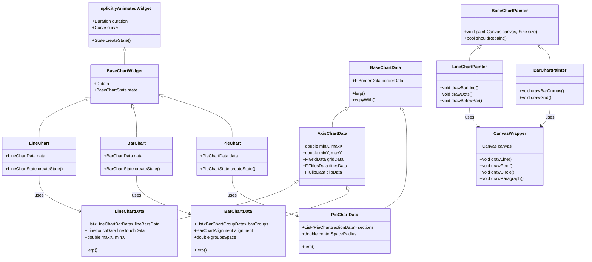
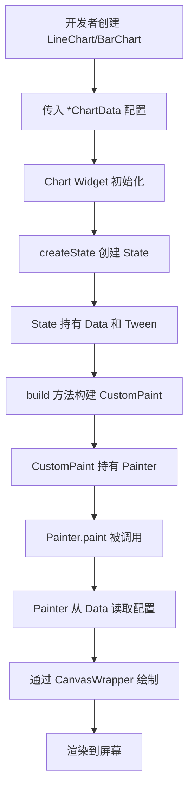
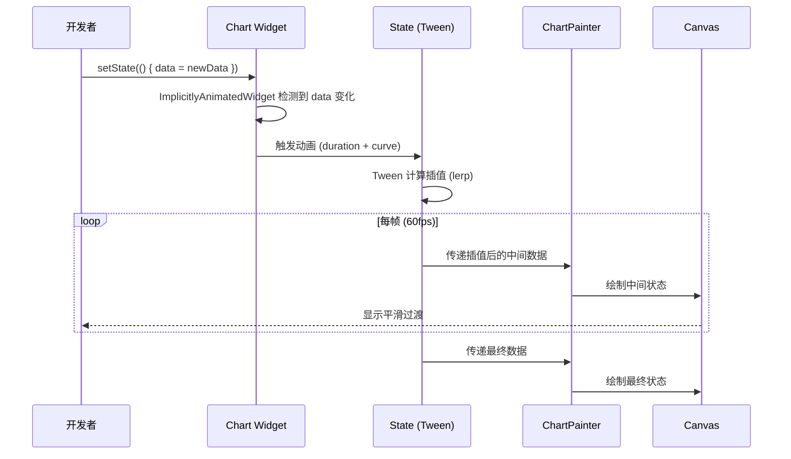
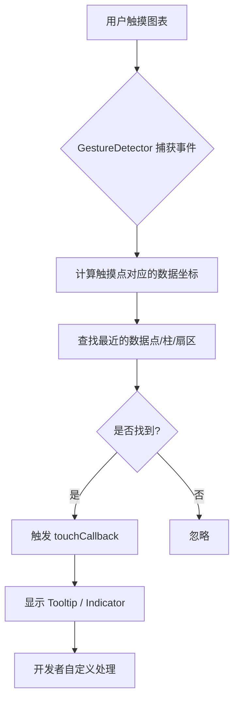

# fl_chart 源码深度解析：Flutter 最流行图表库的设计与实现

> 从 ImplicitlyAnimatedWidget 到 CustomPainter——一个功能全面的通用图表库是如何炼成的

---

## 一、引言：fl_chart 的定位与设计哲学

`fl_chart` 是目前 Flutter 生态中**最流行、社区最活跃**的通用图表库。与 `imp_trading_chart` 追求极致的 K 线渲染性能不同，`fl_chart` 的目标是**覆盖尽可能多的图表类型**（折线图、柱状图、饼图、散点图、雷达图、K线图等），并提供**开箱即用的动画和交互体验**。

其核心设计哲学可以概括为：**“数据驱动、隐式动画、声明式配置”**。开发者只需要描述图表“应该是什么样”，库会自动处理从当前状态到目标状态的平滑过渡。

---

## 二、整体架构设计

### 2.1 三层架构

`fl_chart` 采用清晰的**三层架构**，将 Widget、数据和渲染职责分离：

```
┌─────────────────────────────────────────────────────┐
│  Widget 层 (LineChart / BarChart / PieChart...)    │
│  继承 ImplicitlyAnimatedWidget，自动处理动画        │
│  管理触摸事件、状态协调                             │
└─────────────────────┬───────────────────────────────┘
                      │
┌─────────────────────▼───────────────────────────────┐
│  数据层 (LineChartData / BarChartData...)          │
│  继承 BaseChartData / AxisChartData                 │
│  包含所有样式配置、坐标范围、网格数据               │
│  实现 lerp 方法支持动画插值                        │
└─────────────────────┬───────────────────────────────┘
                      │
┌─────────────────────▼───────────────────────────────┐
│  渲染层 (LineChartPainter / BarChartPainter...)    │
│  继承 BaseChartPainter<D>                          │
│  通过 CanvasWrapper 在 Canvas 上绘制               │
└─────────────────────────────────────────────────────┘
```

**数据流向**：`ChartData`（配置对象）→ `ChartWidget`（ImplicitlyAnimatedWidget）→ `ChartPainter`（CustomPainter）→ `Canvas`。

### 2.2 设计原则

| 原则 | 说明 |
|------|------|
| **数据驱动** | 图表的所有视觉表现由 `*ChartData` 对象唯一决定 |
| **隐式动画** | 继承 `ImplicitlyAnimatedWidget`，数据变化自动触发动画 |
| **分层渲染** | 每种图表类型有独立的 Painter，职责单一 |
| **可测试性** | 通过 `CanvasWrapper` 代理所有绘制调用，便于单元测试 |

---

## 三、核心类图

以下是 `fl_chart` 核心类的 UML 类图（Mermaid 格式）：



### 3.1 关键类说明

**BaseChartWidget**：所有图表的基类，继承自 `ImplicitlyAnimatedWidget`，提供隐式动画能力。

**BaseChartData**：所有图表数据的基类，提供 `lerp` 方法用于动画插值。所有数据类都实现 `lerp` 方法以实现状态间的平滑过渡。

**AxisChartData**：轴类图表的基类，扩展了坐标系统（`minX`、`maxX`、`minY`、`maxY`）、网格系统（`FlGridData`）和标题系统（`FlTitlesData`）。

**CanvasWrapper**：对 `Canvas` 的封装代理，所有绘制调用通过它转发，目的是让绘制函数可测试。

---

## 四、设计模式分析

### 4.1 策略模式（Strategy Pattern）

**应用场景**：`*ChartData` 系列类封装了不同的渲染策略。相同的 `BaseChartWidget` 基类，通过注入不同的 `*ChartData`（`LineChartData`、`BarChartData`、`PieChartData`），可以呈现出完全不同的图表类型。每种数据类对应一种渲染策略。

### 4.2 模板方法模式（Template Method Pattern）

**应用场景**：`BaseChartPainter<D extends BaseChartData>` 定义了绘制图表的骨架流程（`paint` 方法），而具体的绘制步骤（如 `drawBarLine`、`drawDots` 等）由子类 `LineChartPainter`、`BarChartPainter` 等实现。

### 4.3 工厂模式（Factory Pattern）

**应用场景**：`LineChart`、`BarChart` 等 Widget 本身充当工厂，通过 `createState()` 方法创建对应的 State 对象（`_LineChartState`、`_BarChartState` 等）。

### 4.4 代理模式（Proxy Pattern）

**应用场景**：`CanvasWrapper` 作为 `Canvas` 的代理，拦截所有绘制调用，使绘制逻辑可测试。

### 4.5 数据驱动与不可变对象

`*ChartData` 类采用**不可变设计**，所有修改通过 `copyWith()` 方法创建新实例。这种设计使得状态管理可预测，且与 `ImplicitlyAnimatedWidget` 的动画机制完美契合——每次数据变化都会创建一个新数据对象，触发从旧状态到新状态的动画过渡。

---

## 五、工作流程（含流程图）

### 5.1 初始化与渲染流程



### 5.2 数据更新与动画流程



### 5.3 触摸交互流程



---

## 六、关键源码解析

### 6.1 隐式动画系统：ImplicitlyAnimatedWidget 的运用

`fl_chart` 所有图表 Widget 继承自 `ImplicitlyAnimatedWidget`，这是 Flutter 提供的**隐式动画**基类：

```dart
// 源码示意：LineChart 继承链
class LineChart extends ImplicitlyAnimatedWidget {
  final LineChartData data;
  final Duration duration;  // 默认 150ms
  final Curve curve;        // 默认 Curves.linear
  
  const LineChart({
    required this.data,
    this.duration = const Duration(milliseconds: 150),
    this.curve = Curves.linear,
    // ...
  });
  
  @override
  _LineChartState createState() => _LineChartState();
}
```

**核心机制**：当 `data` 发生变化时，`ImplicitlyAnimatedWidget` 会自动驱动动画。State 中的 `LineChartDataTween` 负责在旧数据和新数据之间进行插值：

```dart
// 源码示意：数据插值
class LineChartDataTween extends Tween<LineChartData> {
  @override
  LineChartData lerp(double t) {
    // 对每个属性进行线性插值
    return LineChartData(
      lineBarsData: lerpLineChartBarDataList(begin.lineBarsData, end.lineBarsData, t),
      // ... 其他属性插值
    );
  }
}
```

所有图表数据类都实现了 `lerp` 方法，确保动画过程中每个属性的平滑过渡。`lerpList` 等底层函数还支持不同长度列表之间的插值，即使数据点数量发生变化也能平滑过渡。

### 6.2 渲染层：CanvasWrapper 与可测试性

每种图表类型有独立的 Painter 类。以 `LineChartPainter` 为例，其核心职责包括：

- `drawBarLine()`：绘制折线（支持曲线）
- `drawDots()`：绘制数据点标记
- `drawBelowBar()`：绘制填充区域

`CanvasWrapper` 是架构中的亮点：

```dart
// 源码示意：CanvasWrapper
class CanvasWrapper {
  final Canvas canvas;
  
  void drawLine(Offset p1, Offset p2, Paint paint) {
    canvas.drawLine(p1, p2, paint);  // 代理给真实 Canvas
  }
  
  void drawRect(Rect rect, Paint paint) {
    canvas.drawRect(rect, paint);
  }
  // ... 其他绘制方法
}
```

**设计意图**：所有绘制调用通过 `CanvasWrapper` 转发，使得在单元测试中可以 mock `CanvasWrapper` 并验证绘制行为，而不需要真实的 `Canvas` 环境。

### 6.3 shouldRepaint 的精确控制

`BaseChartPainter` 重写 `shouldRepaint` 方法，通过比较数据引用来决定是否重绘：

```dart
// 源码示意
class BaseChartPainter<D extends BaseChartData> extends CustomPainter {
  final D data;
  final double animationProgress;
  
  @override
  bool shouldRepaint(BaseChartPainter<D> oldDelegate) {
    // 数据变化或动画进度变化时才重绘
    return oldDelegate.data != data || 
           oldDelegate.animationProgress != animationProgress;
  }
}
```

**关键点**：动画过程中，`animationProgress` 每帧都在变化，因此每帧都会触发重绘，从而实现流畅的过渡动画。

### 6.4 坐标系统与 FlSpot

`fl_chart` 使用 `FlSpot` 作为基本坐标单元：

```dart
class FlSpot {
  final double x;
  final double y;
  final double? xError;  // 可选误差范围
  final double? yError;
  
  static const FlSpot nullSpot = FlSpot(double.nan, double.nan);  // 用于折线断点
}
```

坐标系统遵循数学约定：`(0,0)` 代表左下角原点，`x` 向右递增，`y` 向上递增。轴类图表通过 `AxisChartData` 的 `minX`、`maxX`、`minY`、`maxY` 定义坐标空间。

### 6.5 触摸交互系统

每个图表类型通过 `*TouchData` 配置触摸行为：

```dart
// 触摸配置示意
LineChartData(
  lineTouchData: LineTouchData(
    enabled: true,
    touchCallback: (event, response) {
      // 处理触摸事件
    },
    tooltipConfig: ...
  ),
)
```

触摸系统提供多层交互能力：
- **内置触摸处理**：自动管理 Tooltip 和 Indicator
- **自定义回调**：通过 `touchCallback` 完全控制触摸响应
- **混合模式**：内置处理 + 自定义回调通知

---

## 七、常见用法

### 7.1 基础折线图

```dart
LineChart(
  LineChartData(
    lineBarsData: [
      LineChartBarData(
        spots: [
          FlSpot(0, 3),
          FlSpot(2, 2),
          FlSpot(4, 4),
          FlSpot(6, 3.5),
          FlSpot(8, 5),
        ],
        isCurved: true,
        color: Colors.blue,
        barWidth: 4,
        belowBarData: BarAreaData(show: true),
      ),
    ],
    titlesData: FlTitlesData(
      bottomTitles: AxisTitles(
        sideTitles: SideTitles(showTitles: true),
      ),
      leftTitles: AxisTitles(
        sideTitles: SideTitles(showTitles: true),
      ),
    ),
  ),
)
```

### 7.2 柱状图与 groupsSpace 的正确用法

```dart
BarChart(
  BarChartData(
    alignment: BarChartAlignment.center,  // ⚠️ 必须为 center 才能让 groupsSpace 生效
    groupsSpace: 24,  // 每组柱子中心点之间的水平距离
    barGroups: [
      BarChartGroupData(
        x: 0,
        barRods: [
          BarChartRodData(toY: 8, color: Colors.blue),
          BarChartRodData(toY: 6, color: Colors.green),
        ],
      ),
      // ...
    ],
  ),
)
```

**重要提示**：`groupsSpace` 只有在 `alignment` 设置为 `BarChartAlignment.center` 时才生效。当 `alignment` 为 `spaceBetween` 或 `start` 时，柱子间距由可用宽度和柱子数量动态计算，`groupsSpace` 会被忽略。

### 7.3 禁用动画（实时数据场景）

```dart
LineChart(
  LineChartData(...),
  duration: Duration.zero,  // 禁用动画
)
```

在实时数据场景中，禁用动画可以避免“抖动”现象。

---

## 八、优缺点分析

### 8.1 优点

| 优点 | 说明 |
|------|------|
| **图表类型丰富** | 支持折线图、柱状图、饼图、散点图、雷达图、K线图等 6 种图表 |
| **隐式动画开箱即用** | 基于 `ImplicitlyAnimatedWidget`，数据变化自动产生平滑动画 |
| **高度可定制** | 每个视觉元素都有对应的配置类（颜色、字体、网格、标题等） |
| **社区活跃** | 最流行的 Flutter 图表库，问题容易找到解决方案 |
| **触摸交互完善** | 内置 Tooltip、Indicator，支持自定义触摸回调 |
| **可测试性好** | `CanvasWrapper` 代理设计使绘制逻辑可单元测试 |
| **多平台支持** | 支持 Android、iOS、Web、Linux、macOS、Windows |

### 8.2 缺点

| 缺点 | 说明 |
|------|------|
| **大数据量性能受限** | 不同于 `imp_trading_chart` 的视口驱动，`fl_chart` 处理数千以上数据点时可能卡顿 |
| **配置复杂** | API 文档偏重参数罗列，初学者上手成本较高 |
| **布局参数耦合** | 部分参数（如 `groupsSpace` 与 `alignment`）存在隐藏的耦合关系 |
| **实时数据需特殊处理** | 默认动画在实时数据场景下会产生“抖动”，需要手动禁用 |
| **内存泄漏历史** | 曾有过缓存计算值导致内存泄漏的问题，虽已修复但需关注 |

---

## 九、常见问题与避坑指南

### 9.1 ❌ groupsSpace 不生效

**问题**：调整 `groupsSpace` 参数，柱子间距毫无变化。

**原因**：`groupsSpace` 只有在 `alignment` 设置为 `BarChartAlignment.center` 时才生效。

**解决方案**：
```dart
BarChartData(
  alignment: BarChartAlignment.center,  // 必须设置
  groupsSpace: 24,  // 此时生效
)
```

### 9.2 ⚠️ 实时数据图表“抖动”

**问题**：实时数据更新时，图表出现明显的抖动现象。

**原因**：FL Chart 默认启用了数据更新的过渡动画。高频更新时，动画不断触发，导致视觉不连续。

**解决方案**：
```dart
LineChart(
  data,
  duration: Duration.zero,  // 禁用动画
)
```
同时，只传递需要显示的数据点，控制数据量。

### 9.3 ⚠️ 图表不显示或尺寸异常

**问题**：图表显示空白或尺寸异常。

**原因**：图表父容器未给足空间。

**解决方案**：使用 `Expanded`、`SizedBox` 或 `Container` 指定具体尺寸。

### 9.4 💡 X 轴自定义与滚动实现

X 轴上的标签位置需要开发者自行计算。例如，时间轴场景下：

```dart
// 计算数据点在 X 轴上的位置
final xOffset = (data.minute * 60 + data.second) / 3600 + indexInHour;
```

图表滚动可通过两种方式实现：
- **方案 A**：外套 `SingleChildScrollView`，计算图表总宽度
- **方案 B**：通过 `minX` / `maxX` 控制可视范围，外套 `GestureDetector` 监听手势

方案 B 体验更好，但实现更复杂。

### 9.5 ⚠️ 颜色渐变与 stops 参数

`fl_chart` 的颜色渐变使用百分比定位，而非 1:1 数据映射。

```dart
// 错误：以为颜色与数据点 1:1 对应
colors: [Colors.grey, Colors.green, Colors.red]

// 正确：使用 stops 精确控制渐变位置
colors: [Colors.grey, Colors.green, Colors.red],
stops: [0.25, 0.75]  // 灰色在 25% 位置，绿色在 75% 位置
```

如果 `stops` 为 `null`，颜色均匀分布在渐变路径上。

### 9.6 💡 触摸与页面滑动冲突

**问题**：图表触摸提示与页面左右滑动冲突。

**解决方案**：可通过 `touchCallback` 自行控制触摸行为，或禁用内置触摸，实现自定义交互。

---

## 十、总结

`fl_chart` 是一个设计精良、功能全面的 Flutter 图表库。其核心价值在于：

1. **隐式动画系统**：基于 `ImplicitlyAnimatedWidget` 的架构让数据变化自动产生平滑过渡，开发者无需手动管理动画控制器。

2. **数据驱动设计**：所有视觉表现由 `*ChartData` 配置对象唯一决定，配合 `copyWith()` 和 `lerp()` 实现可预测的状态管理。

3. **分层架构**：Widget 层、数据层、渲染层职责清晰，`CanvasWrapper` 代理模式使绘制逻辑可测试。

4. **丰富的图表类型**：覆盖了绝大多数业务场景的可视化需求。

与 `imp_trading_chart` 的“引擎优先、极致性能”不同，`fl_chart` 选择了“功能全面、开箱即用”的路线。对于需要多种图表类型、流畅动画和完善交互的通用场景，`fl_chart` 是目前 Flutter 生态中的最佳选择。

理解其源码设计，不仅能帮助我们更好地使用这个库，更能从中学习到 Flutter 隐式动画、CustomPainter 可测试性设计、以及数据驱动 UI 架构的通用方法论。

---

**参考资料**：
- [fl_chart 官方文档](https://pub.dev/packages/fl_chart)
- [fl_chart Architecture | DeepWiki](https://deepwiki.com/imaNNeo/fl_chart/2-architecture)
- [fl_chart Data Structure | DeepWiki](https://deepwiki.com/imaNNeo/fl_chart/2.1-data-structure)
- [fl_chart Advanced Features | DeepWiki](https://deepwiki.com/imaNNeo/fl_chart/6-advanced-features)
- [fl_chart CONTRIBUTING.md](https://github.com/imaNNeo/fl_chart/blob/master/CONTRIBUTING.md)