# Flutter Painting Widgets 深度讲解

Flutter 的 Painting Widgets（绘制类组件）是用于实现自定义图形、特效和界面视觉定制的核心组件，主要用于超出基础组件能力的视觉定制场景。Flutter 的绘制体系分为两层：**基础绘制组件**（直接可用的预定义绘制组件，如 `DecoratedBox`、`Container`）和**自定义绘制组件**（基于 `CustomPaint`、`CustomPainter` 实现全自定义图形）。

Painting widgets 的核心特点是：**它们对子组件应用视觉效果，但不改变子组件的布局、大小或位置**。


## 整体架构概览

Flutter 的绘制类 Widget 主要分为以下几类：

| 类别       | 代表 Widget                                            | 核心能力                   |
| ---------- | ------------------------------------------------------ | -------------------------- |
| 装饰类     | `DecoratedBox`、`Container`                            | 背景、边框、阴影、渐变     |
| 裁剪类     | `ClipRect`、`ClipRRect`、`ClipOval`、`ClipPath`        | 按形状裁剪子组件           |
| 自定义绘制 | `CustomPaint`                                          | 基于 Canvas 自由绘制       |
| 特效类     | `Opacity`、`Transform`、`ShaderMask`、`BackdropFilter` | 透明度、变换、着色器、模糊 |

下面逐一深入讲解每个核心 Widget。


# 一、DecoratedBox

## 1. 架构设计

- **Widget 类型**：`SingleChildRenderObjectWidget`
- **类继承关系**：`Widget → RenderObjectWidget → SingleChildRenderObjectWidget → DecoratedBox`
- **设计意图**：`DecoratedBox` 是 Flutter 中最基础的装饰绘制组件，用于在子组件绘制前或绘制后添加装饰（如背景色、边框、渐变、阴影等）。它是 `Container` 的底层构建块——`Container` 内部使用 `DecoratedBox` 来实现装饰功能。设计上保持单一职责：**只负责装饰绘制，不处理 padding、margin、alignment 等布局逻辑**。

## 2. 类关系图

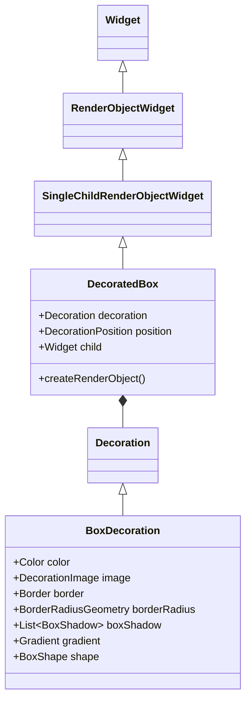

## 3. 流程图

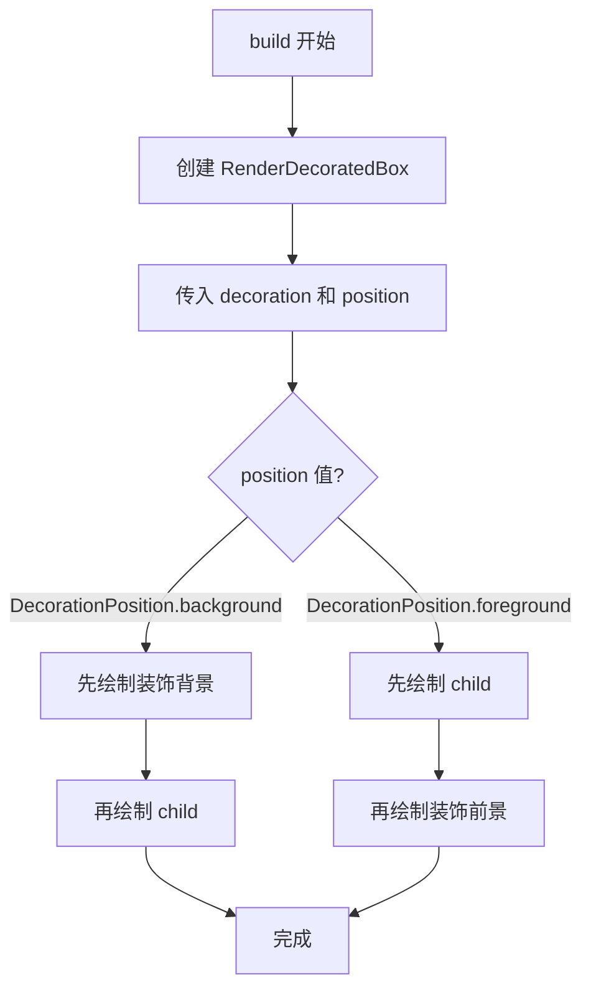

**包裹层级图**：

```
┌──────────────────────────────────────┐
│          DecoratedBox                │
│  ┌────────────────────────────────┐  │
│  │   背景装饰 (背景色/渐变/图片)   │  │
│  │  ┌──────────────────────────┐  │  │
│  │  │        Child             │  │  │
│  │  └──────────────────────────┘  │  │
│  │   前景装饰 (边框/阴影)          │  │
│  └────────────────────────────────┘  │
└──────────────────────────────────────┘
```

## 4. 源码解析

```dart
class DecoratedBox extends SingleChildRenderObjectWidget {
  /// 创建一个绘制装饰的 Widget
  const DecoratedBox({
    super.key,
    required this.decoration,  // 装饰对象，必须非空
    this.position = DecorationPosition.background,  // 背景或前景
    super.child,
  });

  final Decoration decoration;
  final DecorationPosition position;

  @override
  RenderDecoratedBox createRenderObject(BuildContext context) {
    return RenderDecoratedBox(
      decoration: decoration,
      position: position,
      configuration: createLocalImageConfiguration(context),
    );
  }

  @override
  void updateRenderObject(BuildContext context, RenderDecoratedBox renderObject) {
    renderObject
      ..decoration = decoration
      ..position = position
      ..configuration = createLocalImageConfiguration(context);
  }
}
```

关键点：
- `DecoratedBox` 直接继承 `SingleChildRenderObjectWidget`，而非 `StatelessWidget`，因为它的核心是 **绘制** 而非 **组合**。
- `decoration` 参数是 `Decoration` 抽象类，最常用的是 `BoxDecoration`。
- `position` 控制装饰绘制在子组件之前还是之后。

## 5. 使用场景

**场景一：给文本添加背景色和圆角**

```dart
DecoratedBox(
  decoration: BoxDecoration(
    color: Colors.blue[100],
    borderRadius: BorderRadius.circular(8),
  ),
  child: Padding(
    padding: EdgeInsets.symmetric(horizontal: 12, vertical: 4),
    child: Text('标签', style: TextStyle(color: Colors.blue[900])),
  ),
)
```

**场景二：添加渐变背景**

```dart
DecoratedBox(
  decoration: BoxDecoration(
    gradient: LinearGradient(
      colors: [Colors.blue, Colors.purple],
      begin: Alignment.topLeft,
      end: Alignment.bottomRight,
    ),
  ),
  child: SizedBox(
    width: 200,
    height: 100,
    child: Center(child: Text('渐变背景', style: TextStyle(color: Colors.white))),
  ),
)
```

**场景三：添加阴影（无需 child 时作为独立装饰容器）**

```dart
DecoratedBox(
  decoration: BoxDecoration(
    color: Colors.white,
    boxShadow: [
      BoxShadow(
        color: Colors.grey.withOpacity(0.3),
        blurRadius: 10,
        offset: Offset(0, 4),
      ),
    ],
    borderRadius: BorderRadius.circular(12),
  ),
  child: SizedBox(width: 100, height: 100),
)
```

**选型对比**：

| 场景                          | 推荐           | 原因                 |
| ----------------------------- | -------------- | -------------------- |
| 只需要装饰（背景/边框/阴影）  | `DecoratedBox` | 轻量，无额外布局开销 |
| 需要 padding/margin/alignment | `Container`    | 组合了多种功能       |
| 需要 Material 水波纹效果      | `Material`     | 自带交互反馈         |

## 6. 优缺点

| 优点                                                                  | 缺点                                                    |
| --------------------------------------------------------------------- | ------------------------------------------------------- |
| 轻量级，只负责装饰绘制，无额外布局开销                                | 不提供 padding/margin/alignment 等布局能力              |
| 支持丰富的 `BoxDecoration` 配置（颜色、渐变、边框、阴影、圆角、图片） | 动画需要通过 `DecoratedBoxTransition` 实现              |
| 性能优于 `Container`（当只需要装饰时）                                | 不能直接设置宽高，需配合 `SizedBox` 或 `ConstrainedBox` |
| 支持背景/前景两种绘制位置                                             | 与 Material 的 `InkWell` 配合时水波纹可能被覆盖         |

## 7. 常见坑

**坑一：color 和 gradient 同时使用会报错**

```dart
// ❌ 错误
DecoratedBox(
  decoration: BoxDecoration(
    color: Colors.blue,      // color 和 gradient 不能同时使用
    gradient: LinearGradient(colors: [Colors.red, Colors.blue]),
  ),
  child: ...,
)

// ✅ 正确：只使用其中一个
DecoratedBox(
  decoration: BoxDecoration(
    gradient: LinearGradient(colors: [Colors.red, Colors.blue]),
  ),
  child: ...,
)
```

**坑二：阴影被裁剪**

```dart
// ❌ 错误：阴影溢出被父组件裁剪
DecoratedBox(
  decoration: BoxDecoration(
    boxShadow: [BoxShadow(blurRadius: 20, color: Colors.black)],
  ),
  child: SizedBox(width: 50, height: 50),
)

// ✅ 正确：添加 padding 或使用 ClipPath 的 clipBehavior
DecoratedBox(
  decoration: BoxDecoration(
    boxShadow: [BoxShadow(blurRadius: 20, color: Colors.black)],
  ),
  child: Padding(
    padding: EdgeInsets.all(20),
    child: SizedBox(width: 50, height: 50),
  ),
)
```

**坑三：image 装饰时未设置 fit**

```dart
// ❌ 错误：图片可能变形或显示不全
DecoratedBox(
  decoration: BoxDecoration(
    image: DecorationImage(
      image: AssetImage('assets/bg.png'),
      // 缺少 fit 和 alignment
    ),
  ),
  child: ...,
)

// ✅ 正确：设置 fit 和 alignment
DecoratedBox(
  decoration: BoxDecoration(
    image: DecorationImage(
      image: AssetImage('assets/bg.png'),
      fit: BoxFit.cover,
      alignment: Alignment.center,
    ),
  ),
  child: ...,
)
```

## 8. 性能优化

- **优先使用 `DecoratedBox` 而非 `Container`**：当只需要装饰效果而不需要 padding/margin/alignment 时，`DecoratedBox` 更轻量。
- **`BoxDecoration` 使用 `color` 而非 `gradient`**：纯色背景比渐变性能更好。
- **避免频繁重建 `decoration` 对象**：将 `BoxDecoration` 提取为常量。


# 二、Container

## 1. 架构设计

- **Widget 类型**：`StatelessWidget`（组合类）
- **类继承关系**：`Widget → StatelessWidget → Container`
- **设计意图**：`Container` 是一个**便利性组合 Widget**，它将 `Padding`、`ConstrainedBox`、`DecoratedBox`、`Transform`、`Align` 等多个底层 Widget 组合在一起，提供一站式的大小、位置、装饰配置能力。设计上遵循**组合优于继承**原则。

## 2. 类关系图

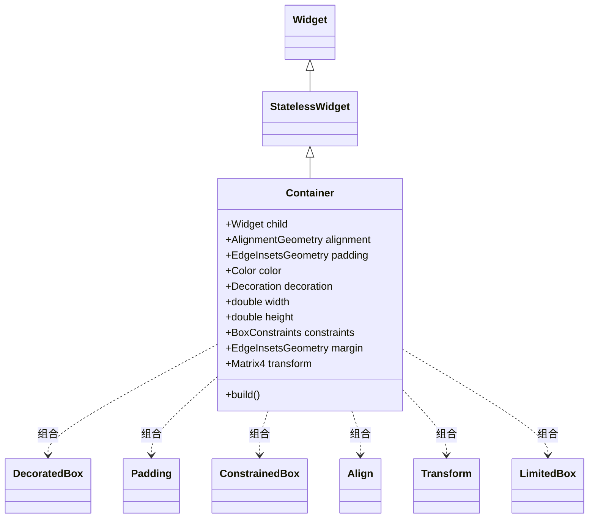

## 3. 流程图

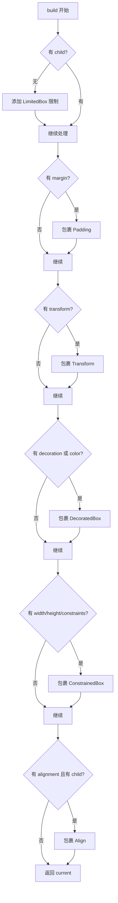

**包裹层级图**（从外到内）：

```
┌──────────────────────────────────────────────┐
│              Padding (margin)                 │
│  ┌────────────────────────────────────────┐  │
│  │         Transform (可选)               │  │
│  │  ┌──────────────────────────────────┐  │  │
│  │  │      DecoratedBox (装饰)         │  │  │
│  │  │  ┌────────────────────────────┐  │  │
│  │  │  │    ConstrainedBox (尺寸)   │  │  │
│  │  │  │  ┌──────────────────────┐  │  │  │
│  │  │  │  │  Padding (padding)   │  │  │  │
│  │  │  │  │  ┌────────────────┐  │  │  │  │
│  │  │  │  │  │  Align (对齐)  │  │  │  │  │
│  │  │  │  │  │  ┌──────────┐  │  │  │  │  │
│  │  │  │  │  │  │  child   │  │  │  │  │  │
│  │  │  │  │  │  └──────────┘  │  │  │  │  │
│  │  │  │  │  └────────────────┘  │  │  │  │
│  │  │  │  └──────────────────────┘  │  │  │
│  │  │  └────────────────────────────┘  │  │
│  │  └──────────────────────────────────┘  │
│  └────────────────────────────────────────┘
└──────────────────────────────────────────────┘
```

## 4. 源码解析

```dart
class Container extends StatelessWidget {
  const Container({
    super.key,
    this.child,
    this.alignment,
    this.padding,
    this.color,
    this.decoration,
    this.foregroundDecoration,
    this.width,
    this.height,
    this.constraints,
    this.margin,
    this.transform,
    this.transformAlignment,
    this.clipBehavior = Clip.none,
  });

  @override
  Widget build(BuildContext context) {
    Widget? current = child;

    // 没有 child 时添加 LimitedBox
    if (child == null && (constraints == null || !constraints!.isTight)) {
      current = LimitedBox(
        maxWidth: 0.0,
        maxHeight: 0.0,
        child: ConstrainedBox(constraints: const BoxConstraints.expand()),
      );
    }

    // 从外到内逐层包裹
    if (alignment != null)
      current = Align(alignment: alignment!, child: current);

    // padding 在 decoration 内部
    final EdgeInsetsGeometry? effectivePadding = padding;
    if (effectivePadding != null)
      current = Padding(padding: effectivePadding, child: current);

    if (color != null)
      current = ColoredBox(color: color!, child: current);

    if (decoration != null)
      current = DecoratedBox(decoration: decoration!, child: current);

    if (foregroundDecoration != null)
      current = DecoratedBox(
        decoration: foregroundDecoration!,
        position: DecorationPosition.foreground,
        child: current,
      );

    if (constraints != null)
      current = ConstrainedBox(constraints: constraints!, child: current);

    if (margin != null)
      current = Padding(padding: margin!, child: current);

    if (transform != null)
      current = Transform(transform: transform!, child: current);

    return current!;
  }
}
```

关键逻辑：
- `Container` 按以下顺序尝试：先处理 `alignment`，再处理 `padding`，然后处理 `color`/`decoration`，再处理 `constraints`，最后处理 `margin` 和 `transform`。
- `color` 参数会被转换为 `BoxDecoration(color: color)`，本质上仍是 `DecoratedBox`。
- `width` 和 `height` 参数会转换为 `BoxConstraints.tightFor(width: width, height: height)`。

## 5. 使用场景

**场景一：最常用的布局容器**

```dart
Container(
  width: 200,
  height: 100,
  padding: EdgeInsets.all(16),
  margin: EdgeInsets.all(8),
  decoration: BoxDecoration(
    color: Colors.blue,
    borderRadius: BorderRadius.circular(12),
    boxShadow: [BoxShadow(blurRadius: 8, color: Colors.grey)],
  ),
  child: Text('Hello'),
)
```

**场景二：仅设置尺寸**

```dart
Container(
  width: 50,
  height: 50,
  color: Colors.red,  // 快捷设置背景色
)
```

**场景三：作为占位符**

```dart
Container(
  width: double.infinity,
  height: 200,
  color: Colors.grey[200],
  child: Center(child: Text('Placeholder')),
)
```

**选型对比**：

| 需求                      | 推荐                           | 原因       |
| ------------------------- | ------------------------------ | ---------- |
| 需要装饰 + 尺寸 + padding | `Container`                    | 一站式解决 |
| 仅需要装饰                | `DecoratedBox`                 | 更轻量     |
| 仅需要背景色              | `ColoredBox`                   | 最轻量     |
| 仅需要尺寸约束            | `SizedBox` 或 `ConstrainedBox` | 职责单一   |

## 6. 优缺点

| 优点                               | 缺点                                 |
| ---------------------------------- | ------------------------------------ |
| 功能全面，一个 Widget 覆盖多种需求 | 组合了多个 Widget，有一定性能开销    |
| API 直观易用，学习成本低           | 包裹层级深，调试时 Widget 树复杂     |
| 支持几乎所有装饰和布局场景         | 颜色和装饰不能同时设置（内部会断言） |
| 代码简洁，减少嵌套                 | 不透明，内部做了很多自动判断         |

## 7. 常见坑

**坑一：color 和 decoration 同时使用**

```dart
// ❌ 错误：会触发 assert
Container(
  color: Colors.blue,
  decoration: BoxDecoration(
    borderRadius: BorderRadius.circular(8),
  ),
  child: ...,
)

// ✅ 正确：将 color 放入 decoration
Container(
  decoration: BoxDecoration(
    color: Colors.blue,
    borderRadius: BorderRadius.circular(8),
  ),
  child: ...,
)
```

**坑二：width/height 与 constraints 冲突**

```dart
// ❌ 错误：width 会被 constraints 覆盖
Container(
  width: 100,
  constraints: BoxConstraints.expand(),
  child: ...,
)

// ✅ 正确：只使用一种尺寸约束方式
Container(
  width: 100,
  child: ...,
)
// 或
Container(
  constraints: BoxConstraints.tightFor(width: 100),
  child: ...,
)
```

**坑三：Container 不能无限宽高**

```dart
// ❌ 错误：在无约束环境下设置无限宽高会报错
Container(
  width: double.infinity,
  height: double.infinity,
  child: ...,
)

// ✅ 正确：确保父组件提供约束，或使用 Expanded
Expanded(
  child: Container(
    width: double.infinity,
    child: ...,
  ),
)
```

## 8. 性能优化

- **使用 `const Container`**：如果内容不变，使用 `const` 减少重建。
- **优先使用 `ColoredBox` 替代 `Container` 设置背景色**：`ColoredBox` 是 `RenderObjectWidget`，比 `Container` 轻量得多。
- **避免在 `build` 中创建新的 `BoxDecoration`**：提取为常量。


# 三、Clip 系列（ClipRRect / ClipOval / ClipPath）

## 1. 架构设计

- **Widget 类型**：`SingleChildRenderObjectWidget`
- **类继承关系**：`Widget → RenderObjectWidget → SingleChildRenderObjectWidget → ClipRRect/ClipOval/ClipPath`
- **设计意图**：Clip 系列 Widget 用于按特定形状裁剪子组件。Flutter 提供了三种常用裁剪方式：
  - `ClipRRect`：圆角矩形裁剪
  - `ClipOval`：椭圆/圆形裁剪
  - `ClipPath`：自定义路径裁剪
  
  设计上采用**策略模式**，不同的裁剪形状通过不同的 RenderObject 实现。

## 2. 类关系图

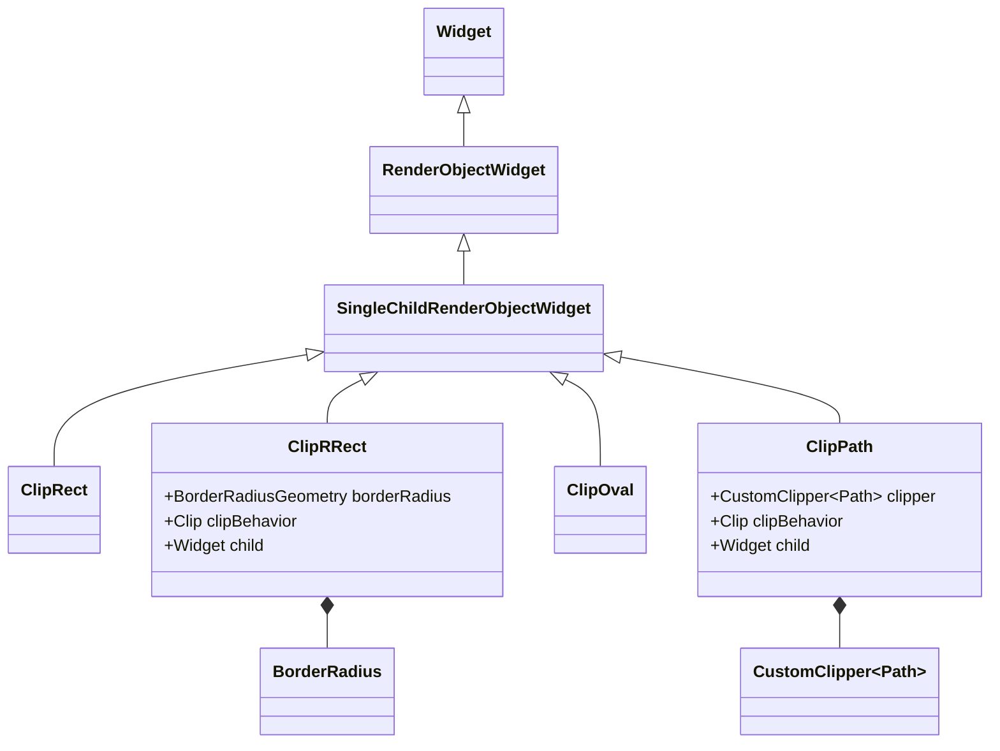

## 3. 流程图

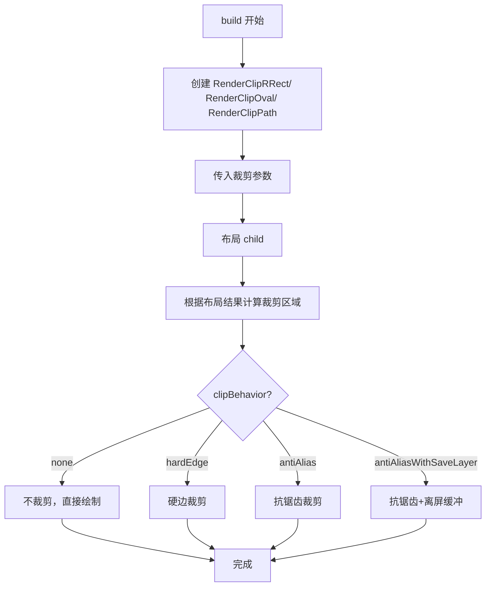

## 4. 源码解析

```dart
class ClipRRect extends SingleChildRenderObjectWidget {
  const ClipRRect({
    super.key,
    this.clipper,
    this.clipBehavior = Clip.antiAlias,
    super.child,
  });

  final CustomClipper<RRect>? clipper;
  final Clip clipBehavior;

  @override
  RenderClipRRect createRenderObject(BuildContext context) {
    return RenderClipRRect(
      clipper: clipper,
      clipBehavior: clipBehavior,
    );
  }
}
```

关键点：
- `borderRadius` 默认为 `BorderRadius.zero`，即矩形。
- `clipBehavior` 控制裁剪质量，`Clip.antiAlias` 是默认值，平衡性能与质量。
- `Clip.antiAliasWithSaveLayer` 质量最高但性能开销大。

## 5. 使用场景

**场景一：圆角头像**

```dart
ClipRRect(
  borderRadius: BorderRadius.circular(50),
  child: Image.network(
    'https://picsum.photos/100/100',
    width: 100,
    height: 100,
    fit: BoxFit.cover,
  ),
)
```

**场景二：圆形头像（使用 ClipOval）**

```dart
ClipOval(
  child: Image.network(
    'https://picsum.photos/100/100',
    width: 100,
    height: 100,
    fit: BoxFit.cover,
  ),
)
```

**场景三：自定义形状裁剪**

```dart
ClipPath(
  clipper: StarClipper(),
  child: Container(
    width: 200,
    height: 200,
    color: Colors.amber,
  ),
)

class StarClipper extends CustomClipper<Path> {
  @override
  Path getClip(Size size) {
    // 绘制五角星路径
    final path = Path();
    // ... 路径计算
    return path;
  }

  @override
  bool shouldReclip(StarClipper oldClipper) => false;
}
```

**选型对比**：

| 需求               | 推荐        | 原因             |
| ------------------ | ----------- | ---------------- |
| 圆角矩形           | `ClipRRect` | 专门优化，性能好 |
| 圆形/椭圆          | `ClipOval`  | 专门优化         |
| 任意形状           | `ClipPath`  | 最灵活           |
| 仅裁剪溢出（矩形） | `ClipRect`  | 最轻量           |

## 6. 优缺点

| 优点                              | 缺点                                 |
| --------------------------------- | ------------------------------------ |
| 使用简单，API 直观                | 裁剪会阻止 hitTest，点击区域也被裁剪 |
| 支持抗锯齿，边缘平滑              | `antiAliasWithSaveLayer` 性能开销大  |
| `ClipPath` 支持任意自定义形状     | 嵌套多层 Clip 可能影响性能           |
| 与 `Image` 配合可实现各种形状图片 | 对文本裁剪可能导致渲染模糊           |

## 7. 常见坑

**坑一：clipBehavior 选择不当导致性能问题**

```dart
// ❌ 性能差
ClipRRect(
  clipBehavior: Clip.antiAliasWithSaveLayer,  // 每个帧都创建离屏缓冲
  borderRadius: BorderRadius.circular(8),
  child: ...,
)

// ✅ 大多数情况使用 antiAlias
ClipRRect(
  clipBehavior: Clip.antiAlias,  // 默认值，性能更好
  borderRadius: BorderRadius.circular(8),
  child: ...,
)
```

**坑二：裁剪后阴影被裁掉**

```dart
// ❌ 阴影被裁剪
ClipRRect(
  borderRadius: BorderRadius.circular(12),
  child: Container(
    decoration: BoxDecoration(
      boxShadow: [BoxShadow(blurRadius: 10)],
    ),
    child: ...,
  ),
)

// ✅ 阴影在裁剪层外部
Container(
  decoration: BoxDecoration(
    borderRadius: BorderRadius.circular(12),
    boxShadow: [BoxShadow(blurRadius: 10)],
  ),
  child: ClipRRect(
    borderRadius: BorderRadius.circular(12),
    child: ...,
  ),
)
```

## 8. 性能优化

- **优先使用 `ClipRRect` 而非 `ClipPath`**：圆角矩形裁剪有硬件加速支持。
- **避免 `antiAliasWithSaveLayer`**：除非必要，使用 `antiAlias` 即可。
- **静态裁剪使用 `shouldReclip` 返回 `false`**：避免不必要的重新裁剪。


# 四、CustomPaint

## 1. 架构设计

- **Widget 类型**：`SingleChildRenderObjectWidget`
- **类继承关系**：`Widget → RenderObjectWidget → SingleChildRenderObjectWidget → CustomPaint`
- **设计意图**：`CustomPaint` 是 Flutter 自定义绘制的**核心入口**，它提供一个 Canvas 画布，允许开发者通过 `CustomPainter` 在绘制阶段自由绘制任意图形。它解决了预定义组件无法覆盖的**无限视觉定制需求**。

## 2. 类关系图

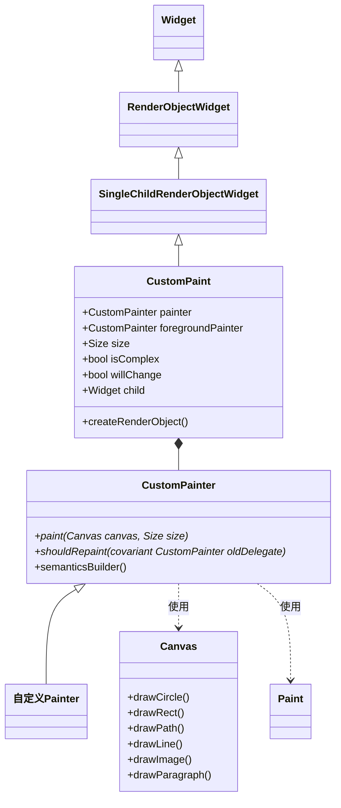

## 3. 流程图

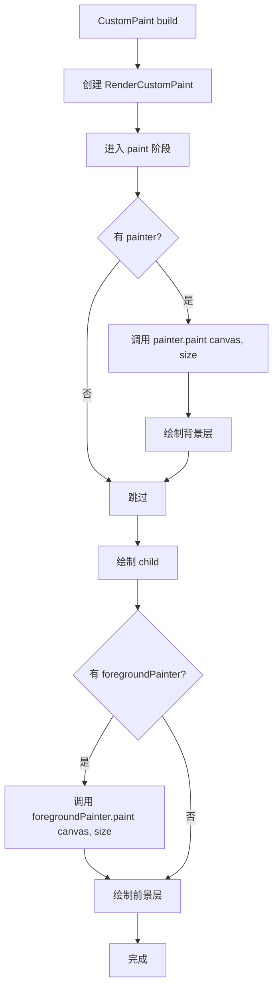

**绘制顺序**：`painter`（背景） → `child` → `foregroundPainter`（前景）

## 4. 源码解析

```dart
class CustomPaint extends SingleChildRenderObjectWidget {
  const CustomPaint({
    super.key,
    this.painter,
    this.foregroundPainter,
    this.size = Size.zero,
    this.isComplex = false,
    this.willChange = false,
    super.child,
  });

  final CustomPainter? painter;
  final CustomPainter? foregroundPainter;
  final Size size;
  final bool isComplex;
  final bool willChange;

  @override
  RenderCustomPaint createRenderObject(BuildContext context) {
    return RenderCustomPaint(
      painter: painter,
      foregroundPainter: foregroundPainter,
      preferredSize: size,
      isComplex: isComplex,
      willChange: willChange,
    );
  }
}
```

关键点：
- `painter` 在 child **之前**绘制（背景层）
- `foregroundPainter` 在 child **之后**绘制（前景层）
- `size` 指定绘制区域大小，默认为 `Size.zero`，实际大小由 parent 约束决定
- `isComplex` 和 `willChange` 用于提示引擎进行缓存优化

自定义 Painter 示例：

```dart
class MyCustomPainter extends CustomPainter {
  @override
  void paint(Canvas canvas, Size size) {
    final paint = Paint()
      ..color = Colors.blue
      ..style = PaintingStyle.fill
      ..strokeWidth = 2;
    
    final center = Offset(size.width / 2, size.height / 2);
    canvas.drawCircle(center, size.width / 2 - 10, paint);
  }

  @override
  bool shouldRepaint(MyCustomPainter oldDelegate) {
    return false;  // 不需要重绘
  }
}
```

## 5. 使用场景

**场景一：绘制自定义图形（圆形+文字）**

```dart
CustomPaint(
  size: Size(200, 200),
  painter: CircleTextPainter(),
)

class CircleTextPainter extends CustomPainter {
  @override
  void paint(Canvas canvas, Size size) {
    final paint = Paint()..color = Colors.blue..style = PaintingStyle.fill;
    final center = Offset(size.width / 2, size.height / 2);
    canvas.drawCircle(center, size.width / 2 - 10, paint);
    
    final textPainter = TextPainter(
      text: TextSpan(text: '自定义绘制', style: TextStyle(color: Colors.white, fontSize: 20)),
      textDirection: TextDirection.ltr,
    );
    textPainter.layout();
    textPainter.paint(canvas, Offset(
      center.dx - textPainter.width / 2,
      center.dy - textPainter.height / 2,
    ));
  }

  @override
  bool shouldRepaint(CircleTextPainter oldDelegate) => false;
}
```

**场景二：绘制折线图/曲线图**

```dart
CustomPaint(
  size: Size(double.infinity, 200),
  painter: LineChartPainter(data: chartData),
)
```

**场景三：签名板/画板**（结合手势）

```dart
class SignaturePainter extends CustomPainter {
  final List<Offset> points;
  
  @override
  void paint(Canvas canvas, Size size) {
    final paint = Paint()
      ..color = Colors.black
      ..strokeWidth = 3
      ..strokeCap = StrokeCap.round;
      
    for (int i = 0; i < points.length - 1; i++) {
      canvas.drawLine(points[i], points[i + 1], paint);
    }
  }
  
  @override
  bool shouldRepaint(SignaturePainter oldDelegate) => true;
}
```

**选型对比**：

| 需求           | 推荐                                  | 原因               |
| -------------- | ------------------------------------- | ------------------ |
| 标准 UI 组件   | 使用现有 Widget                       | 性能更好，代码更少 |
| 复杂自定义图形 | `CustomPaint`                         | 完全控制绘制       |
| 数据可视化     | `CustomPaint`                         | 灵活绘制图表       |
| 游戏/动画      | `CustomPaint` + `AnimationController` | 每帧重绘           |

## 6. 优缺点

| 优点                          | 缺点                                   |
| ----------------------------- | -------------------------------------- |
| 无限灵活性，可绘制任意图形    | 需要手动处理绘制逻辑，代码量大         |
| 直接使用 Canvas API，性能可控 | 需要理解 Canvas 坐标系和绘制 API       |
| 支持背景层和前景层分离绘制    | 复杂绘制需要优化，否则可能掉帧         |
| 可与动画结合实现动态效果      | 调试困难，无法像 Widget 树一样 inspect |

## 7. 常见坑

**坑一：CustomPaint 没有尺寸**

```dart
// ❌ 错误：CustomPaint 没有尺寸
CustomPaint(
  painter: MyPainter(),
  // 没有设置 size，也没有父约束
)

// ✅ 正确：设置 size 或放在有约束的父组件中
CustomPaint(
  size: Size(200, 200),  // 方式一：指定尺寸
  painter: MyPainter(),
)

// 或
SizedBox(
  width: 200,
  height: 200,
  child: CustomPaint(  // 方式二：父组件提供约束
    painter: MyPainter(),
  ),
)
```

**坑二：shouldRepaint 总是返回 true**

```dart
// ❌ 性能差：每帧都重绘
class MyPainter extends CustomPainter {
  @override
  bool shouldRepaint(MyPainter oldDelegate) => true;  // 总是重绘
}

// ✅ 正确：根据实际变化判断
class MyPainter extends CustomPainter {
  final List<double> data;
  
  MyPainter(this.data);
  
  @override
  bool shouldRepaint(MyPainter oldDelegate) {
    return data != oldDelegate.data;  // 数据变化时才重绘
  }
}
```

**坑三：在 paint 中创建对象导致 GC 压力**

```dart
// ❌ 错误：每次 paint 都创建新对象
@override
void paint(Canvas canvas, Size size) {
  final paint = Paint()..color = Colors.blue;  // 每次都创建
  final path = Path();  // 每次都创建
  // ...
}

// ✅ 正确：将不变对象提取为成员变量
class MyPainter extends CustomPainter {
  final Paint _paint = Paint()..color = Colors.blue;
  final Path _path = Path();
  
  @override
  void paint(Canvas canvas, Size size) {
    // 复用 _paint 和 _path
  }
}
```

## 8. 性能优化

- **合理实现 `shouldRepaint`**：仅在必要时返回 `true`。
- **设置 `isComplex: true` 和 `willChange: true`**：提示引擎缓存绘制结果。
- **避免在 `paint` 中分配对象**：将 `Paint`、`Path` 等对象复用。
- **使用 `RepaintBoundary`**：隔离 CustomPaint 的重绘区域，避免影响父组件。
- **使用 `const CustomPaint`**：如果 painter 不变。


# 五、Opacity

## 1. 架构设计

- **Widget 类型**：`SingleChildRenderObjectWidget`
- **类继承关系**：`Widget → RenderObjectWidget → SingleChildRenderObjectWidget → Opacity`
- **设计意图**：`Opacity` 用于让子组件部分透明。它将子组件绘制到中间缓冲区，然后以指定的透明度混合到场景中。

## 2. 类关系图

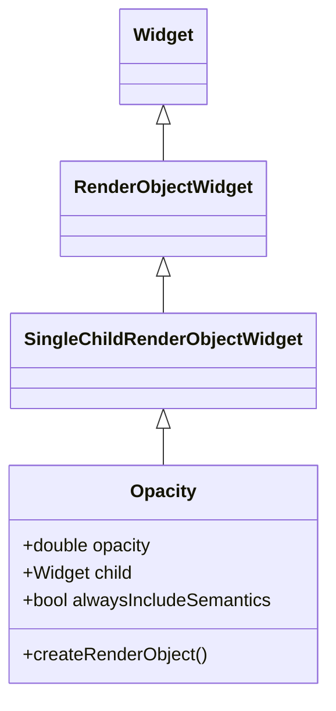

## 3. 源码解析

```dart
class Opacity extends SingleChildRenderObjectWidget {
  const Opacity({
    super.key,
    required this.opacity,  // 0.0 ~ 1.0
    super.child,
    this.alwaysIncludeSemantics = false,
  });

  final double opacity;
  final bool alwaysIncludeSemantics;

  @override
  RenderOpacity createRenderObject(BuildContext context) {
    return RenderOpacity(
      opacity: opacity,
      alwaysIncludeSemantics: alwaysIncludeSemantics,
    );
  }
}
```

关键点：
- `opacity` 必须在 `0.0` 到 `1.0` 之间
- 当 `opacity == 0.0` 时，child 完全不可见但仍参与布局
- 当 `opacity == 1.0` 时，无额外性能开销

## 4. 使用场景

**场景一：淡入淡出动画**

```dart
AnimatedOpacity(
  opacity: _visible ? 1.0 : 0.0,
  duration: Duration(milliseconds: 500),
  child: Text('Hello'),
)
```

**场景二：禁用状态视觉反馈**

```dart
Opacity(
  opacity: _isEnabled ? 1.0 : 0.5,
  child: ElevatedButton(
    onPressed: _isEnabled ? () {} : null,
    child: Text('Submit'),
  ),
)
```

**选型对比**：

| 需求       | 推荐                                           | 原因           |
| ---------- | ---------------------------------------------- | -------------- |
| 静态透明度 | `Opacity`                                      | 简单直接       |
| 透明度动画 | `AnimatedOpacity`                              | 自动处理动画   |
| 图片透明度 | 直接设置 `Image` 的 `color` + `colorBlendMode` | 性能更好       |
| 完全隐藏   | `Visibility` 或条件渲染                        | 不占用布局空间 |

## 5. 优缺点

| 优点                | 缺点                                      |
| ------------------- | ----------------------------------------- |
| API 简单，使用方便  | 需要将 child 绘制到中间缓冲区，性能开销大 |
| 支持 0-1 任意透明度 | 动画时每帧都需要重新绘制                  |
| 语义支持可配置      | 对大量 child 使用会影响性能               |

## 6. 常见坑

**坑一：Opacity 动画性能差**

```dart
// ❌ 性能差：每帧重建 Opacity
AnimatedBuilder(
  animation: _controller,
  builder: (context, child) {
    return Opacity(
      opacity: _controller.value,
      child: ComplexWidget(),  // 复杂子组件
    );
  },
)

// ✅ 优化：使用 AnimatedOpacity
AnimatedOpacity(
  opacity: _controller.value,
  duration: Duration(milliseconds: 300),
  child: ComplexWidget(),
)
```

**坑二：opacity 为 0 时 child 仍参与布局**

```dart
// Opacity 为 0 时 child 不可见但仍在布局中
Opacity(
  opacity: 0.0,
  child: LargeWidget(),  // 仍然占用布局空间
)

// 如需完全移除，使用 Visibility 或条件渲染
Visibility(
  visible: false,
  child: LargeWidget(),
)
// 或
if (_visible) LargeWidget()
```

## 7. 性能优化

- **使用 `AnimatedOpacity` 而非手动 `Opacity` + 动画**：框架会优化动画过程。
- **透明度为 0 或 1 时无性能开销**：引擎会跳过中间缓冲区。
- **图片透明度使用 `ColorFiltered` 或 `Image.color`**：避免 `Opacity` 的离屏渲染开销。
- **使用 `RepaintBoundary`**：隔离 Opacity 的重绘区域。


# 六、Transform

## 1. 架构设计

- **Widget 类型**：`SingleChildRenderObjectWidget`
- **类继承关系**：`Widget → RenderObjectWidget → SingleChildRenderObjectWidget → Transform`
- **设计意图**：`Transform` 在绘制阶段对子组件应用矩阵变换（旋转、缩放、平移、斜切等）。变换发生在绘制阶段，**不触发重新布局和重建**，因此性能很好。

## 2. 类关系图

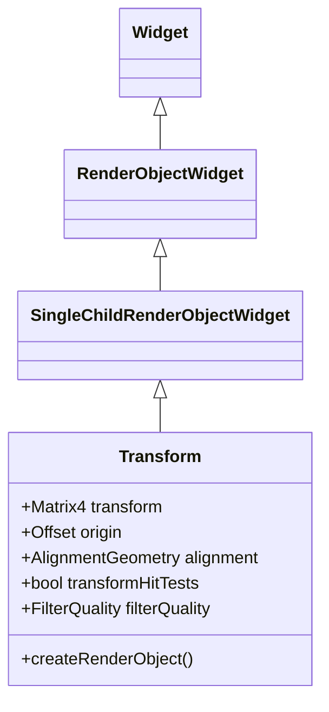

## 3. 源码解析

```dart
class Transform extends SingleChildRenderObjectWidget {
  const Transform({
    super.key,
    required this.transform,
    this.origin,
    this.alignment,
    this.transformHitTests = true,
    this.filterQuality,
    super.child,
  });

  final Matrix4 transform;
  final Offset? origin;
  final AlignmentGeometry? alignment;
  final bool transformHitTests;
  final FilterQuality? filterQuality;

  @override
  RenderTransform createRenderObject(BuildContext context) {
    return RenderTransform(
      transform: transform,
      origin: origin,
      alignment: alignment,
      transformHitTests: transformHitTests,
      filterQuality: filterQuality,
    );
  }
}
```

便捷构造函数：
- `Transform.rotate({ required double angle, ... })`：旋转
- `Transform.translate({ required Offset offset, ... })`：平移
- `Transform.scale({ double scale = 1.0, ... })`：缩放

## 4. 使用场景

**场景一：旋转**

```dart
Transform.rotate(
  angle: 45 * pi / 180,  // 45度
  child: FlutterLogo(size: 100),
)
```

**场景二：缩放**

```dart
Transform.scale(
  scale: 1.5,
  child: Text('放大'),
)
```

**场景三：平移**

```dart
Transform.translate(
  offset: Offset(50, 30),
  child: Text('平移'),
)
```

**场景四：复杂变换（斜切/透视）**

```dart
Transform(
  transform: Matrix4.skewX(0.5),
  child: Text('斜切'),
)
```

**选型对比**：

| 需求               | 推荐                                             | 原因         |
| ------------------ | ------------------------------------------------ | ------------ |
| 简单旋转/缩放/平移 | 便捷构造函数                                     | 代码简洁     |
| 复杂矩阵变换       | `Transform` + `Matrix4`                          | 最灵活       |
| 动画变换           | `AnimatedTransform` 或 `Transform` + `Animation` | 根据需求选择 |
| 不影响 hitTest     | `transformHitTests: false`                       | 点击区域不变 |

## 5. 优缺点

| 优点                               | 缺点                              |
| ---------------------------------- | --------------------------------- |
| 变换在绘制阶段完成，不触发 rebuild | 变换后 child 的布局约束不变       |
| 性能开销小                         | 变换可能导致 child 超出边界被裁剪 |
| 支持任意 4D 矩阵变换               | hitTest 默认随变换变化            |
| 提供便捷构造函数                   | 透视变换可能影响渲染质量          |

## 6. 常见坑

**坑一：变换后 child 被父组件裁剪**

```dart
// ❌ 旋转后超出边界被裁剪
SizedBox(
  width: 100,
  height: 100,
  child: Transform.rotate(
    angle: 45 * pi / 180,
    child: FlutterLogo(size: 100),
  ),
)

// ✅ 增加容器尺寸或使用 OverflowBox
SizedBox(
  width: 150,
  height: 150,
  child: Transform.rotate(
    angle: 45 * pi / 180,
    child: FlutterLogo(size: 100),
  ),
)
```

**坑二：transformHitTests 默认行为不符合预期**

```dart
// 点击区域随变换变化，可能难以点击
Transform.rotate(
  angle: 45 * pi / 180,
  child: GestureDetector(
    onTap: () => print(' tapped'),
    child: Text('点击'),
  ),
)

// 设置 transformHitTests: false 保持点击区域不变
Transform.rotate(
  angle: 45 * pi / 180,
  transformHitTests: false,
  child: GestureDetector(
    onTap: () => print('tapped'),
    child: Text('点击'),
  ),
)
```

## 7. 性能优化

- **变换不触发 rebuild**：`Transform` 是高性能的变换方式。
- **使用 `RepaintBoundary`**：隔离变换区域的重绘。
- **`filterQuality` 使用 `FilterQuality.low`**：在不需要高质量时提升性能。


# 七、ShaderMask

## 1. 架构设计

- **Widget 类型**：`SingleChildRenderObjectWidget`
- **类继承关系**：`Widget → RenderObjectWidget → SingleChildRenderObjectWidget → ShaderMask`
- **设计意图**：`ShaderMask` 使用着色器（Shader）生成的遮罩来渲染子组件。常用于渐变淡出、图片着色、纹理映射等特效。

## 2. 类关系图

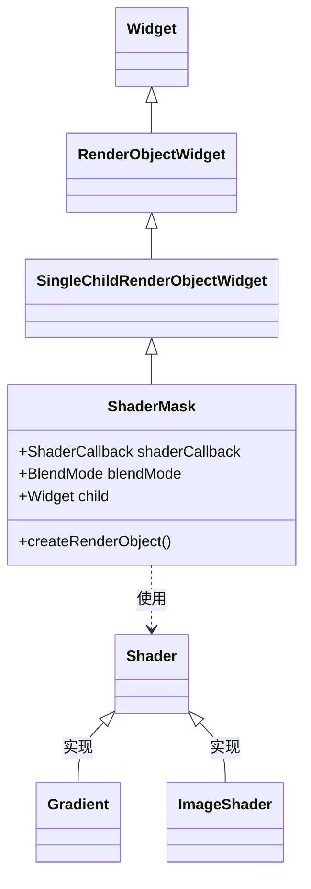

## 3. 源码解析

```dart
class ShaderMask extends SingleChildRenderObjectWidget {
  const ShaderMask({
    super.key,
    required this.shaderCallback,
    this.blendMode = BlendMode.modulate,
    super.child,
  });

  final ShaderCallback shaderCallback;
  final BlendMode blendMode;

  @override
  RenderShaderMask createRenderObject(BuildContext context) {
    return RenderShaderMask(
      shaderCallback: shaderCallback,
      blendMode: blendMode,
    );
  }
}
```

关键点：
- `shaderCallback` 接收 `Rect` 边界，返回 `Shader` 对象
- `blendMode` 控制遮罩与子组件的混合方式，默认为 `BlendMode.modulate`

## 4. 使用场景

**场景一：渐变淡出边缘**

```dart
ShaderMask(
  shaderCallback: (Rect bounds) {
    return LinearGradient(
      begin: Alignment.topCenter,
      end: Alignment.bottomCenter,
      colors: [Colors.white, Colors.transparent],
    ).createShader(bounds);
  },
  blendMode: BlendMode.dstIn,
  child: Image.network('https://picsum.photos/400/400'),
)
```

**场景二：图片着色**

```dart
ShaderMask(
  shaderCallback: (Rect bounds) {
    return LinearGradient(
      colors: [Colors.blue, Colors.purple],
    ).createShader(bounds);
  },
  blendMode: BlendMode.color,
  child: Image.network('https://picsum.photos/200/200'),
)
```

**场景三：纹理映射**

```dart
ShaderMask(
  shaderCallback: (Rect bounds) {
    return ImageShader(
      image,  // 纹理图片
      TileMode.clamp,
      TileMode.clamp,
      Matrix4.identity().storage,
    );
  },
  child: Text('纹理文字', style: TextStyle(fontSize: 40)),
)
```

## 5. 优缺点

| 优点                              | 缺点                 |
| --------------------------------- | -------------------- |
| 实现复杂的遮罩和着色效果          | 性能开销较大         |
| 与 BlendMode 配合实现丰富混合效果 | 需要理解 Shader 概念 |
| 支持渐变、图片等多种 Shader       | 调试困难             |

## 6. 常见坑

**坑一：bounds 为 empty 导致 Shader 创建失败**

```dart
// ❌ 如果 child 没有尺寸，bounds 可能为空
ShaderMask(
  shaderCallback: (Rect bounds) {
    return LinearGradient(...).createShader(bounds);  // bounds 可能为空
  },
  child: Container(),  // 没有尺寸
)

// ✅ 确保 child 有尺寸
ShaderMask(
  shaderCallback: (Rect bounds) {
    return LinearGradient(...).createShader(bounds);
  },
  child: Container(width: 200, height: 200),
)
```

**坑二：blendMode 选择错误导致效果异常**

```dart
// 不同 blendMode 效果不同
// BlendMode.modulate: 颜色相乘
// BlendMode.dstIn: 只保留遮罩区域
// BlendMode.color: 着色
```

## 7. 性能优化

- **缓存 Shader**：如果 shader 不变，在外部创建并缓存。
- **使用 `RepaintBoundary`**：隔离 ShaderMask 的重绘区域。
- **避免在动画中频繁使用 ShaderMask**：性能开销大。


# 八、总结：Painting Widgets 选型决策树

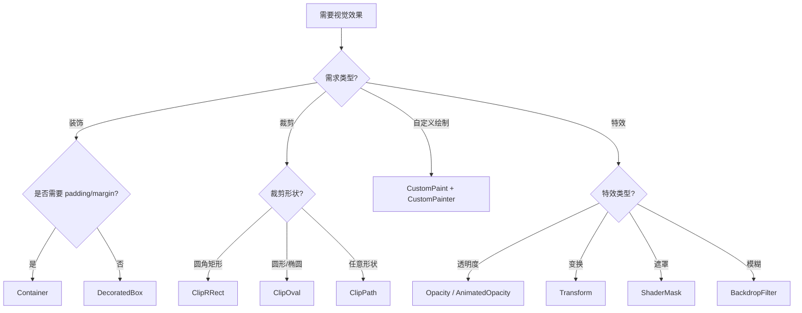

**核心选型原则**：

1. **优先使用基础组件**：能用 `DecoratedBox` 就不用 `Container`，能用 `ColoredBox` 就不用 `DecoratedBox`。
2. **裁剪优先用 `ClipRRect`**：比 `ClipPath` 性能更好。
3. **自定义绘制用 `CustomPaint`**：注意实现 `shouldRepaint` 优化性能。
4. **变换用 `Transform`**：不触发 rebuild，性能好。
5. **透明度动画用 `AnimatedOpacity`**：比手动 `Opacity` + 动画更优。