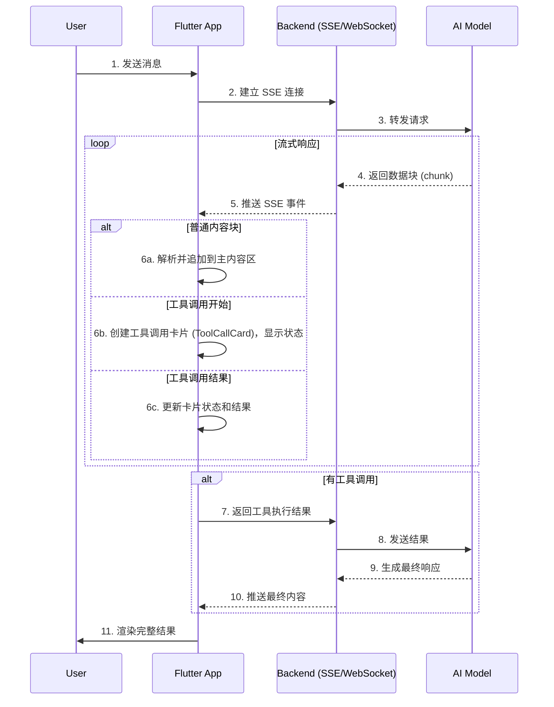
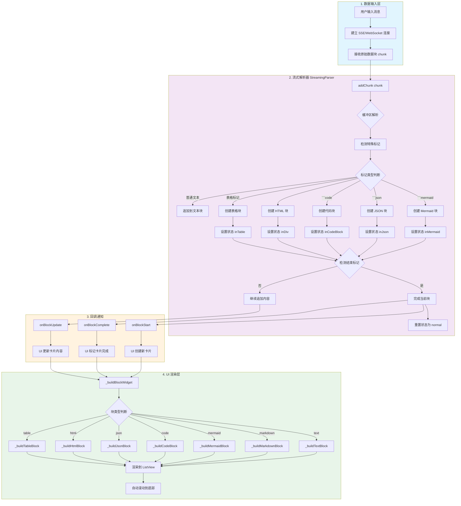
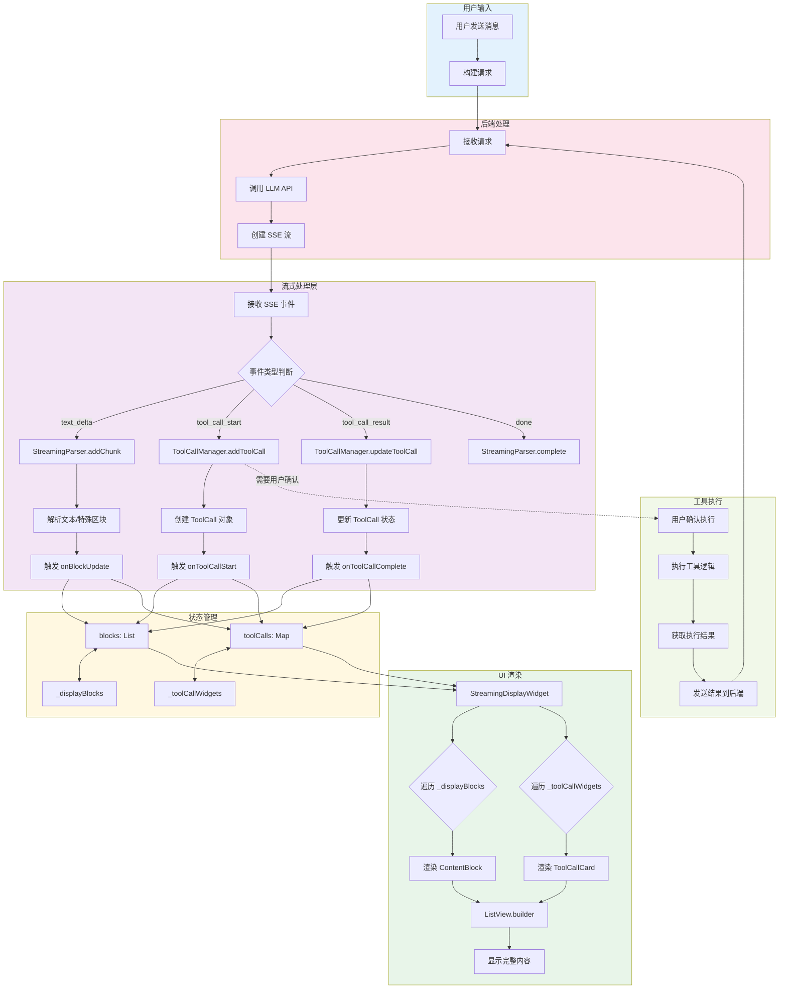
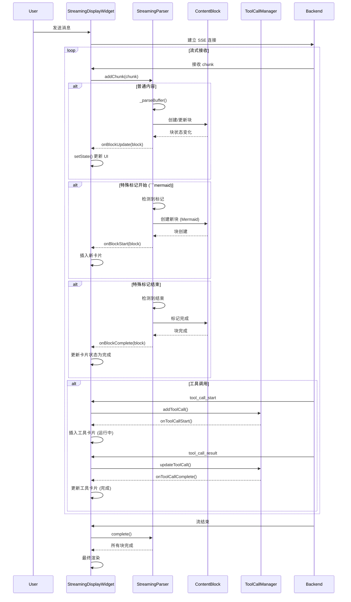
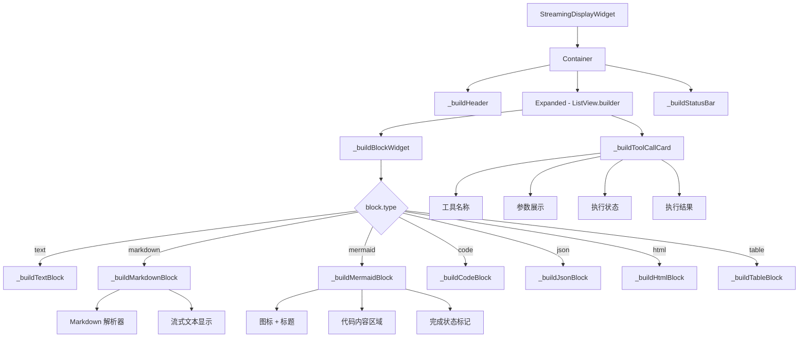
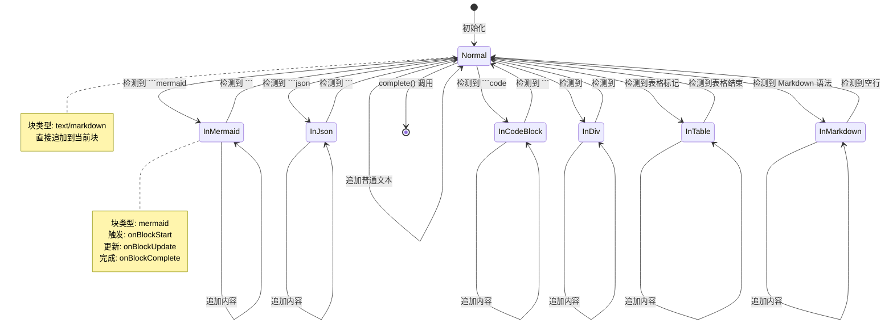

# 流式解析渲染思路

从用户输入,经过后段处理,最终在前端完成解析和渲染,主要可以分为以下流程

基于你之前的流式解析逻辑和搜索结果，我来为你拆解一个完整的、包含普通内容流式输出和工具调用（Tool Call）全过程的 Flutter 实现。

整个过程可以看作是一条数据流，从用户输入开始，经过后端处理，最终在 Flutter 前端完成解析和渲染。




### 1. 后端到前端的数据传输：SSE 协议

在 Flutter 中，最推荐用于接收这种流式数据的方式是 **Server-Sent Events (SSE)**。它允许服务器通过一个 HTTP 连接持续向客户端推送数据，非常适合大语言模型（LLM）流式输出的场景。

在 Flutter 中，你可以使用 `sse_parser` 这个轻量级、无依赖的解析库，它能帮助你轻松地将服务器传来的原始文本块解析成标准的事件。一个典型的 LLM 流式事件可能长这样：

```dart
// 示例：一个文本增量的 SSE 事件
event: response.output_text.delta
data: {"delta": "Hello, "}

event: response.output_text.delta
data: {"delta": "world!"}

// 示例：一个工具调用开始的 SSE 事件
event: tool_call.started
data: {"toolCallId": "tc-123", "toolName": "search_web", "args": {"query": "Flutter SDK"}}
```

### 2. Flutter 端的数据流处理架构

你的 Flutter 应用收到这些事件后，需要像处理你之前设想的流式文本一样，但处理逻辑需要更加丰富。根据搜索结果，我们可以参考 `agent_kit` 和 `agentivity_ag_ui` 这类库的设计思想，将数据流导向不同的处理管道：

1.  **`StreamingParser` (你的核心控制器)**：
    *   **输入**：原始 SSE 事件流（`Stream<SseEvent>`）。
    *   **职责**：
        *   根据 `event` 类型（如 `response.output_text.delta`, `tool_call.started`）进行分发。
        *   维护一个状态机，区分当前是在处理普通文本、Markdown 还是工具调用。
        *   为每个工具调用生成一个唯一的标识符（如 `toolCallId`），并创建对应的数据模型。

2.  **主内容渲染器 (Text/Markdown Renderer)**：
    *   **输入**：从 `StreamingParser` 传来的普通文本和 Markdown 数据块。
    *   **职责**：按照你上一轮设计的逻辑，将这部分内容流式渲染在主区域。

3.  **工具调用管理器 (Tool Call Manager)**：
    *   **输入**：从 `StreamingParser` 传来的工具调用事件（开始、参数、结果）。
    *   **职责**：管理所有工具调用的状态。你可以维护一个 `Map<String, ToolCall>`，键是 `toolCallId`，值是包含所有状态和数据的 `ToolCall` 对象。
    *   **UI 渲染**：当收到一个 `tool_call.started` 事件时，创建一个新的 `ToolCallCard` 并插入到 UI 中（可以放在主内容区的下方或侧边）。这个卡片会展示工具名称、参数，并根据状态显示“运行中...”的动画。当收到 `tool_call.result` 事件时，更新对应的卡片，展示执行结果，状态变为“完成”。

### 3. 前端工具调用（Frontend Tools）

对于某些操作（如打开一个对话框、展示一个图表、或调用设备 API），你甚至不需要把工具调用发往后台。`agentivity_ag_ui` 提到了 **Frontend Tools** 的概念。你可以直接在前端注册一个工具处理器：

```dart
// 注册一个前端工具
frontendToolRegistry.register('show_alert', (args) {
  // 直接执行 Flutter 代码
  showDialog(context: context, ...);
  // 返回结果给代理流
  return {'status': 'success'};
});
```

这样，AI 模型可以“调用”一个前端工具，而你的 Flutter 应用会直接执行相应的 UI 操作，实现更丰富的交互。

### 4. 处理 Tool Call 的循环

完整的 AI 交互往往不是一次请求就结束的。当 AI 调用了工具，你需要将工具的执行结果返回给它，它才能生成最终的答案。这个“请求-工具调用-返回结果-最终响应”的过程可能会循环多次。

在你的 `StreamingParser` 或一个更高级的 `AgentController` 中，你需要管理这个循环：
1.  收集所有工具调用的结果。
2.  将所有结果打包成一个新消息，再次通过 SSE 连接发送回后端。
3.  后端将结果传给 LLM，LLM 会根据这些结果生成新的响应流。
4.  重复步骤 1 到 3，直到 LLM 的响应中不再包含工具调用，流程结束。

### 总结：你需要做的架构整合

结合你之前的流式解析逻辑和现在的工具调用需求，你的 Flutter 应用需要这样一个核心类：

```dart
class AgentStreamProcessor {
  // 1. 核心解析器：处理文本和特殊区块
  final StreamingParser _contentParser; 
  // 2. 工具调用管理器：管理所有 Tool Call 的状态
  final ToolCallManager _toolCallManager; 
  
  // 3. 接收原始 SSE 事件
  void processEvent(SseEvent event) {
    if (event.isToolCallStart) {
      // 创建新的工具调用卡片
      final toolCall = ToolCall.fromEvent(event);
      _toolCallManager.addToolCall(toolCall);
      // 通知 UI 插入一张新卡片
    } else if (event.isToolCallResult) {
      // 更新已有的工具调用卡片
      _toolCallManager.updateToolCall(event.toolCallId, event.result);
    } else if (event.isTextDelta) {
      // 将文本增量交给现有的流式解析器处理
      _contentParser.addChunk(event.delta);
    }
  }
}
```

通过这种方式，你的应用就能优雅地同时处理流式文本和复杂的工具调用交互，构建出一个类似 Cursor 或 Perplexity 那样具有“代理感”（Agentic）的 AI 应用界面。

## 流式数据解析架构

以常见的数据块为例子

```dart
enum ContentType {
  text,
  markdown,
  mermaid,
  code,
  json,
  html,
  table,
  latex,      // 新增
  flowchart,  // 新增
  unknown,
}
```

基于之前定义的 `StreamingParser`、`ContentBlock` 等类，我来画一个完整的数据流处理流程图。

## 完整的流式数据处理流程



## 带工具调用的完整流程



## 核心类交互时序图



## UI 组件树结构



## 状态转换图



上图展示一个简易的 `StreamingParser`、`ContentBlock` 等类在整个流程中的角色和交互。

## 本地调试示例

我来模拟一个完整的 SSE 数据流，包含文字内容和工具调用（Tool Call）的完整交互过程。

## 完整的 SSE 数据流模拟

### 场景描述
用户问："帮我查一下明天北京的天气，然后告诉我适合穿什么衣服"

### 1. 服务器原始 SSE 数据流

```text
// ============================================
// 第一轮：AI 开始响应，决定调用工具
// ============================================

event: response.created
data: {"id": "resp_001", "model": "gpt-4", "object": "response"}

event: response.output_text.delta
data: {"delta": "好的，我先查询一下北京的天气情况。"}

event: response.output_text.delta
data: {"delta": "\n\n"}

// ============================================
// 工具调用：开始
// ============================================

event: tool_call.started
data: {
  "toolCallId": "tc_001",
  "toolName": "get_weather",
  "args": {
    "city": "北京",
    "date": "2026-06-30"
  },
  "status": "pending"
}

event: response.output_text.delta
data: {"delta": "正在调用天气查询工具..."}

event: response.output_text.delta
data: {"delta": "\n\n"}

// ============================================
// 工具调用：执行中
// ============================================

event: tool_call.executing
data: {
  "toolCallId": "tc_001",
  "status": "executing",
  "message": "正在查询天气数据..."
}

// ============================================
// 工具调用：返回结果
// ============================================

event: tool_call.result
data: {
  "toolCallId": "tc_001",
  "result": {
    "city": "北京",
    "date": "2026-06-30",
    "temperature": {
      "min": 22,
      "max": 31,
      "unit": "℃"
    },
    "weather": "晴转多云",
    "humidity": "65%",
    "wind": "3-4级",
    "airQuality": "良",
    "sunrise": "04:52",
    "sunset": "19:42",
    "suggestion": {
      "outdoor": "适宜户外活动",
      "clothing": "短袖+薄外套"
    }
  },
  "status": "completed",
  "duration": 1234
}

// ============================================
// 工具调用：完成通知
// ============================================

event: tool_call.completed
data: {
  "toolCallId": "tc_001",
  "status": "completed"
}

// ============================================
// 第二轮：AI 根据工具结果生成最终答案
// ============================================

event: response.output_text.delta
data: {"delta": "根据查询结果，明天北京天气情况如下：\n\n"}

event: response.output_text.delta
data: {"delta": "**天气概况**：晴转多云，气温 22-31℃\n"}

event: response.output_text.delta
data: {"delta": "**湿度**：65%，**风力**：3-4级\n"}

event: response.output_text.delta
data: {"delta": "**空气质量**：良，**日出**：04:52，**日落**：19:42\n\n"}

event: response.output_text.delta
data: {"delta": "**穿衣建议**：\n"}

event: response.output_text.delta
data: {"delta": "- 白天较热，建议穿短袖、T恤\n"}

event: response.output_text.delta
data: {"delta": "- 早晚温差较大，建议携带一件薄外套\n"}

event: response.output_text.delta
data: {"delta": "- 天气晴好，适合户外活动，注意防晒\n\n"}

event: response.output_text.delta
data: {"delta": "需要我帮你查询其他信息吗？ 😊"}

// ============================================
// 流结束
// ============================================

event: response.completed
data: {
  "id": "resp_001",
  "status": "completed",
  "usage": {
    "input_tokens": 156,
    "output_tokens": 342,
    "total_tokens": 498
  }
}

event: done
data: [DONE]
```

### 2. 包含多个工具调用的复杂场景

```text
// ============================================
// 场景：用户问"帮我规划明天去北京的行程"
// ============================================

event: response.created
data: {"id": "resp_002", "model": "gpt-4"}

event: response.output_text.delta
data: {"delta": "好的，我来帮你规划明天北京的一日游行程。"}

// ============================================
// 工具调用 1：查询天气
// ============================================

event: tool_call.started
data: {
  "toolCallId": "tc_002",
  "toolName": "get_weather",
  "args": {"city": "北京", "date": "2026-06-30"},
  "status": "pending"
}

event: tool_call.result
data: {
  "toolCallId": "tc_002",
  "result": {
    "weather": "晴",
    "temperature": "25-32℃",
    "uv": "强"
  },
  "status": "completed"
}

event: tool_call.completed
data: {
  "toolCallId": "tc_002",
  "status": "completed"
}

// ============================================
// 工具调用 2：查询景点信息
// ============================================

event: tool_call.started
data: {
  "toolCallId": "tc_003",
  "toolName": "get_attractions",
  "args": {
    "city": "北京",
    "category": ["历史", "文化", "公园"],
    "limit": 3
  },
  "status": "pending"
}

event: tool_call.executing
data: {
  "toolCallId": "tc_003",
  "status": "executing",
  "message": "正在搜索热门景点..."
}

event: tool_call.result
data: {
  "toolCallId": "tc_003",
  "result": {
    "attractions": [
      {
        "name": "故宫博物院",
        "rating": 4.8,
        "openTime": "08:30-17:00",
        "price": "60元",
        "address": "北京市东城区景山前街4号"
      },
      {
        "name": "天安门广场",
        "rating": 4.7,
        "openTime": "05:00-22:00",
        "price": "免费",
        "address": "北京市东城区东长安街"
      },
      {
        "name": "颐和园",
        "rating": 4.6,
        "openTime": "06:30-20:00",
        "price": "30元",
        "address": "北京市海淀区新建宫门路19号"
      }
    ]
  },
  "status": "completed",
  "duration": 2345
}

// ============================================
// 工具调用 3：查询交通信息
// ============================================

event: tool_call.started
data: {
  "toolCallId": "tc_004",
  "toolName": "get_transportation",
  "args": {
    "city": "北京",
    "type": ["subway", "bus"],
    "route": "故宫到颐和园"
  },
  "status": "pending"
}

event: tool_call.result
data: {
  "toolCallId": "tc_004",
  "result": {
    "routes": [
      {
        "mode": "地铁",
        "duration": "45分钟",
        "route": "1号线 → 4号线",
        "stops": 12,
        "cost": "5元"
      },
      {
        "mode": "公交",
        "duration": "60分钟",
        "route": "特2路 → 604路",
        "stops": 8,
        "cost": "4元"
      }
    ]
  },
  "status": "completed"
}

// ============================================
// 所有工具调用完成后，生成最终建议
// ============================================

event: response.output_text.delta
data: {"delta": "\n## 📅 北京一日游行程规划\n\n"}

event: response.output_text.delta
data: {"delta": "根据查询结果，我为你规划了以下行程：\n\n"}

event: response.output_text.delta
data: {"delta": "### 🏛️ 上午：故宫博物院\n"}

event: response.output_text.delta
data: {"delta": "- **时间**：08:30-12:00\n"}

event: response.output_text.delta
data: {"delta": "- **亮点**：参观太和殿、乾清宫、珍宝馆\n"}

event: response.output_text.delta
data: {"delta": "- **建议**：提前网上购票，周一闭馆\n\n"}

event: response.output_text.delta
data: {"delta": "### 🍜 中午：午餐\n"}

event: response.output_text.delta
data: {"delta": "推荐故宫附近的北京烤鸭店\n\n"}

event: response.output_text.delta
data: {"delta": "### 🌿 下午：颐和园\n"}

event: response.output_text.delta
data: {"delta": "- **时间**：14:00-17:00\n"}

event: response.output_text.delta
data: {"delta": "- **亮点**：昆明湖游船、佛香阁、长廊\n"}

event: response.output_text.delta
data: {"delta": "- **交通**：从故宫乘地铁4号线直达\n\n"}

event: response.output_text.delta
data: {"delta": "### 🌇 傍晚：天安门广场\n"}

event: response.output_text.delta
data: {"delta": "- **时间**：17:30-19:00\n"}

event: response.output_text.delta
data: {"delta": "- **亮点**：看降旗仪式、欣赏夜景\n\n"}

event: response.output_text.delta
data: {"delta": "---\n\n"}

event: response.output_text.delta
data: {"delta": "**温馨提示**：\n"}

event: response.output_text.delta
data: {"delta": "- 明天天气炎热，注意防晒补水\n"}

event: response.output_text.delta
data: {"delta": "- 建议穿轻便舒适的鞋子\n"}

event: response.output_text.delta
data: {"delta": "- 提前准备好身份证和健康码\n"}

event: response.output_text.delta
data: {"delta": "\n祝你游玩愉快！🎉"}

// ============================================
// 流结束
// ============================================

event: response.completed
data: {
  "id": "resp_002",
  "status": "completed",
  "usage": {
    "input_tokens": 234,
    "output_tokens": 567,
    "total_tokens": 801
  }
}

event: done
data: [DONE]
```

### 3. 包含流式 Markdown 和 Mermaid 的完整数据流

```text
// ============================================
// 场景：用户说"帮我设计一个用户登录的流程图"
// ============================================

event: response.created
data: {"id": "resp_003"}

// 普通文本开始
event: response.output_text.delta
data: {"delta": "好的，我为你设计一个用户登录的系统流程图：\n\n"}

event: response.output_text.delta
data: {"delta": "## 用户登录流程\n\n"}

event: response.output_text.delta
data: {"delta": "这个流程包含以下主要步骤：\n"}

event: response.output_text.delta
data: {"delta": "- 用户输入凭证\n"}

event: response.output_text.delta
data: {"delta": "- 系统验证\n"}

event: response.output_text.delta
data: {"delta": "- 返回结果\n\n"}

// Mermaid 开始
event: response.output_text.delta
data: {"delta": "```mermaid\n"}

event: response.output_text.delta
data: {"delta": "graph TD\n"}

event: response.output_text.delta
data: {"delta": "    A[用户打开登录页面] --> B[输入用户名和密码]\n"}

event: response.output_text.delta
data: {"delta": "    B --> C{验证输入}\n"}

event: response.output_text.delta
data: {"delta": "    C -->|输入为空| D[提示：请输入完整信息]\n"}

event: response.output_text.delta
data: {"delta": "    D --> B\n"}

event: response.output_text.delta
data: {"delta": "    C -->|格式正确| E[查询数据库验证用户]\n"}

event: response.output_text.delta
data: {"delta": "    E --> F{用户存在且密码正确}\n"}

event: response.output_text.delta
data: {"delta": "    F -->|是| G[生成 JWT Token]\n"}

event: response.output_text.delta
data: {"delta": "    G --> H[跳转到主页面]\n"}

event: response.output_text.delta
data: {"delta": "    H --> I[显示用户信息]\n"}

event: response.output_text.delta
data: {"delta": "    F -->|否| J[提示：用户名或密码错误]\n"}

event: response.output_text.delta
data: {"delta": "    J --> B\n"}

event: response.output_text.delta
data: {"delta": "    I --> K[用户开始使用系统]\n"}

event: response.output_text.delta
data: {"delta": "```\n\n"}

// Mermaid 结束，继续普通文本
event: response.output_text.delta
data: {"delta": "以上流程图展示了完整的登录验证过程。\n\n"}

event: response.output_text.delta
data: {"delta": "### 关键安全措施：\n"}

event: response.output_text.delta
data: {"delta": "1. **密码加密**：使用 bcrypt 存储密码哈希\n"}

event: response.output_text.delta
data: {"delta": "2. **JWT 过期**：Token 有效期 2 小时\n"}

event: response.output_text.delta
data: {"delta": "3. **登录失败限制**：连续 5 次失败锁定 30 分钟\n"}

event: response.output_text.delta
data: {"delta": "\n需要我生成对应的代码实现吗？"}

event: response.completed
data: {"id": "resp_003", "status": "completed"}

event: done
data: [DONE]
```

### 4. JSON 格式的完整数据（一次返回）

如果你希望收到一个完整的 JSON 响应（一次性返回），格式如下：

```json
{
  "id": "resp_001",
  "model": "gpt-4",
  "object": "response",
  "created": 1700000000,
  "choices": [
    {
      "index": 0,
      "message": {
        "role": "assistant",
        "content": "根据查询结果，明天北京天气晴转多云，气温 22-31℃，建议穿短袖加薄外套。",
        "tool_calls": [
          {
            "id": "tc_001",
            "type": "function",
            "function": {
              "name": "get_weather",
              "arguments": "{\"city\":\"北京\",\"date\":\"2026-06-30\"}"
            }
          }
        ]
      },
      "finish_reason": "stop"
    }
  ],
  "usage": {
    "prompt_tokens": 156,
    "completion_tokens": 342,
    "total_tokens": 498
  },
  "tool_results": [
    {
      "toolCallId": "tc_001",
      "result": {
        "city": "北京",
        "temperature": "22-31℃",
        "weather": "晴转多云"
      },
      "status": "completed"
    }
  ]
}
```

### 5. Flutter 端接收和处理这些数据的流程

```dart
// 在 Flutter 中处理 SSE 数据流
class StreamProcessor {
  final StreamingParser _parser = StreamingParser();
  final ToolCallManager _toolManager = ToolCallManager();
  
  void processSSEEvent(String eventData) {
    // 解析 SSE 事件
    final event = SseEvent.fromRaw(eventData);
    
    switch (event.type) {
      case 'response.output_text.delta':
        // 交给流式解析器处理文本
        _parser.addChunk(event.data['delta']);
        break;
        
      case 'tool_call.started':
        // 创建工具调用卡片
        _toolManager.addToolCall(
          id: event.data['toolCallId'],
          name: event.data['toolName'],
          args: event.data['args'],
        );
        // 通知 UI 更新
        onToolCallStarted?.call(event.data['toolCallId']);
        break;
        
      case 'tool_call.result':
        // 更新工具调用结果
        _toolManager.updateToolCallResult(
          id: event.data['toolCallId'],
          result: event.data['result'],
        );
        onToolCallCompleted?.call(event.data['toolCallId']);
        break;
        
      case 'response.completed':
        // 流结束
        _parser.complete();
        onStreamComplete?.call();
        break;
    }
  }
}
```

这个完整的数据流演示了从用户请求到最终响应的全过程，包含了文本流式输出、工具调用、以及 Mermaid 等特殊格式的完整交互。

## 注意事项

一个面向通用商业场景的 Agent 聊天对话框，要完整支持流式打印，需要解析的数据种类可以分为 四大核心类别。以下是根据成熟的 AI 交互协议（AG-UI）和 Flutter 相关实现整理的建议方案

一个面向通用商业场景的 Agent 聊天对话框，要完整支持流式打印，需要解析的数据种类可以分为 **四大核心类别**。以下是根据成熟的 AI 交互协议（AG-UI）和 Flutter 相关实现整理的建议方案 。

### 1. 生命周期事件 (Lifecycle Events)
这是掌控对话“骨架”的数据，用来管理一次 Agent 调用从开始到结束的完整状态。前端可以用它来显示加载状态、进度条或处理错误 。

*   **`RUN_STARTED` / `RUN_FINISHED` / `RUN_ERROR`**: 标记一次完整对话请求的开始、成功结束和出错。例如，收到 `RUN_STARTED` 时，可以展示一个“思考中”的指示器。
*   **`STEP_STARTED` / `STEP_FINISHED`**: 对于复杂任务，Agent 可能分步骤执行。这些事件可以驱动一个任务进度条或步骤列表，让用户了解当前执行到哪一步了 。

### 2. 文本消息事件 (Text Message Events)
这是实现“逐字打印”打字机效果的核心数据，负责处理 Agent 生成的主要文本内容。

*   **`TEXT_MESSAGE_START`**: 标记一条新文本消息的开始，此时可以创建一个新的气泡或内容区域 。
*   **`TEXT_MESSAGE_CONTENT`**: 流式传输文本的“增量”（Delta），也就是一个个的文本片段。前端收到后不断追加到当前消息的末尾，产生流式打印的效果 。
*   **`TEXT_MESSAGE_END`**: 标记消息结束，此时可以认为该条消息的文本内容已经完全接收，可以进行后续处理（如关闭输入状态）。

> **特殊内容处理**：你提到的 Mermaid、`<div>`、JSON 等格式，通常在 `TEXT_MESSAGE_CONTENT` 的文本流中作为 Markdown 代码块或 HTML 内容出现。因此，除了支持通用 Markdown 的流式渲染 ，还需要能识别这些特殊标记，并像你设想的那样，将其“另起一块”进行独立渲染。

### 3. 工具调用事件 (Tool Call Events)
这是 Agent 区别于普通聊天机器人的关键。当 Agent 需要执行一个函数（如查询天气、访问数据库）时，会通过这类事件通知前端。需要展示一个从“准备执行”到“执行完成”的完整过程 。

*   **`TOOL_CALL_START`**: Agent 决定调用一个工具。前端可以立即创建一个“工具调用卡片”，并显示工具名称 。
*   **`TOOL_CALL_ARGS`**: 工具所需的参数可能是流式生成的，这个事件负责传输这些参数。前端可以实时更新卡片上显示的参数 。
*   **`TOOL_CALL_END` / `TOOL_RESULT`**: 工具执行完成，并返回结果。卡片状态应更新为“完成”，并展示结果摘要或详情 。

### 4. 状态与特殊事件 (State & Special Events)
这部分数据用于实现更高级的交互，如实时同步 UI 状态，或实现“人在环中”（Human-in-the-Loop）的审批流程。

*   **状态同步事件 (`STATE_SNAPSHOT` / `STATE_DELTA`)**: Agent 可以发送完整的快照或增量补丁（JSON Patch）来更新前端的 UI 状态 。例如，当 Agent 正在修改一个复杂的表格或文档时，这些事件可以驱动界面实时刷新，而不需要重新渲染整个页面。
*   **中断与交互事件 (`INTERRUPT`)**: 当 Agent 在敏感操作前（如“确认删除”或“填写表单”）需要用户介入时，会发送中断事件。前端需要渲染一个对应的交互组件（如确认对话框或表单），收集用户输入后再返回给 Agent 。

### 推荐方案：利用现成的 Flutter 库

要实现上述所有功能，工作量不小。可以考虑使用专门为这类场景设计的 Flutter 库，例如 **`agentivity_ag_ui`**，它基于 AG-UI 协议实现，能很好地处理从流式文本到工具调用、状态同步和交互表单的全套流程 。或者，如果你只需要处理工具调用、计划（Plan）和引用（Citation）等非文本部分的 UI，可以使用 **`agent_kit`**，它提供了一系列即插即用的组件，能大大加快开发速度 。