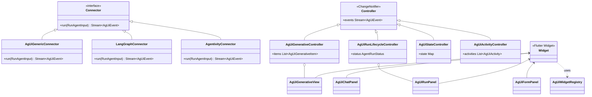

`agentivity_ag_ui` 是一个 Flutter SDK，用于构建 AI Agent 交互界面。它实现了开源的 AG-UI 协议，帮你把复杂的 Agent 功能（如实时流式对话、工具调用、人机交互审批等）快速集成到 Flutter 应用中。

### 🎯 用途与使用场景

**核心用途**：作为 AI 后端（如 LangGraph、CrewAI）和 Flutter 前端之间的“标准桥梁”，通过事件流（SSE）驱动 UI 更新。

**典型使用场景**：
*   **AI 聊天面板**：快速集成带打字机效果的流式对话界面。
*   **人机协同（HIL）**：处理需要人工审批或填写的敏感操作，如确认订单、填表。
*   **Agent 运行监控**：展示长任务执行的步骤和工具调用状态。
*   **生成式 UI (Generative UI)**：让 Agent 动态决定渲染哪些自定义组件，例如根据航班数据生成一个 `FlightCard`。

### 🏗️ 架构设计与实现原理

**架构设计**：基于 **事件驱动** 和 **控制器（Controller）** 模式。后端发送 AG-UI 标准事件，前端控制器解析并驱动 UI 更新。

**工作流程**：`Connector` 连接后端 SSE 事件流 → `Controller` 处理事件并管理状态 → `Widget` 渲染 UI。

**实现原理**：它基于标准协议实现，包括 **AG-UI 协议**（定义事件格式）、**RFC 8895**（SSE 帧格式）和 **RFC 6902**（JSON Patch 状态同步）。

### 📊 类图结构 (Mermaid)

### 🎨 设计模式

*   **策略模式 (Strategy)**：通过 `IChatProvider`, `IAssistantProvider` 等接口，允许灵活替换不同的后端实现。
*   **观察者模式 (Observer)**：所有 Controller 都是 `ChangeNotifier`，与 Flutter 的响应式编程模型自然结合。
*   **工厂模式 (Factory)**：`AgUiWidgetRegistry` 作为工厂，根据 Agent 指定的组件名（如 `"WeatherCard"`）动态构建对应的 Flutter Widget。

### ⚙️ 常用方法与核心组件

*   **`AgUiGenerativeController`**：核心控制器，处理流式文本和工具调用事件，维护 `items` 列表用于渲染。
*   **`AgUiWidgetRegistry`**：注册自定义 Widget，供 Agent 通过 `CUSTOM ag-ui:render` 事件动态调用。
*   **`AgUiStateController`**：通过 JSON Patch 实时同步 Agent 后端的状态，保持 UI 一致性。
*   **`AgUiFormPanel`**：自动渲染基于中断协议生成的人机交互表单。
*   **Connectors**：开箱即用的连接器，支持通用 AG-UI 后端、LangGraph 和 Agentivity 平台。

### ⚠️ 优缺点与“坑”

**优点**：
*   **协议标准化**：基于 AG-UI 协议，避免自研通信协议的麻烦。
*   **组件丰富**：开箱即用，提供聊天、表单、监控等完整 UI 组件。
*   **生成式 UI**：让 Agent 动态控制 UI 渲染，极具想象空间。
*   **良好的生态整合**：与 `agentivity_artifacts` 配合，可快速渲染图表、代码块等复杂内容。

**缺点**：
*   **依赖较重**：引入了 `dio`、`flutter_markdown_plus` 等依赖，可能增加应用体积。
*   **Web 平台兼容性提示**：当前版本在 Web 平台上可能存在兼容性问题。
*   **成熟度**：作为一个相对较新的库（版本 0.3.x），在大型生产项目中的案例可能不如 `flutter_markdown` 等老牌库丰富。

**可能的“坑”与应对建议**：
1.  **事件流与 Widget 生命周期**：处理事件流的 Controller 生命周期需与 Widget 对齐，防止内存泄漏。可使用 `StatefulWidget` 并在 `dispose` 中关闭流。
2.  **JSON Patch 状态同步**：确保 Agent 后端严格按照 RFC 6902 标准生成 Patch 操作，否则 `AgUiStateController` 可能无法正确应用更新。
3.  **自定义组件解析失败**：如果 Agent 尝试渲染一个未在 `AgUiWidgetRegistry` 中注册的组件，会导致 UI 空白或报错。需实现备选渲染逻辑（如显示占位符）。
4.  **SSE 连接稳定性**：在网络不稳定环境下，`AgUiSseChannel` 的重连逻辑需要配合业务场景仔细测试和调整。

关于你之前关心的“流式打印中特殊区块解析”的问题，`agentivity_ag_ui` 的**生成式 UI（Generative UI）**能力是实现这个需求的强大方案：你可以注册一个 `MermaidWidget`，让 Agent 在流式响应中通过 `CUSTOM` 事件直接调用它，并传入图表数据。这比在文本流中手动解析标记要更清晰、可控。