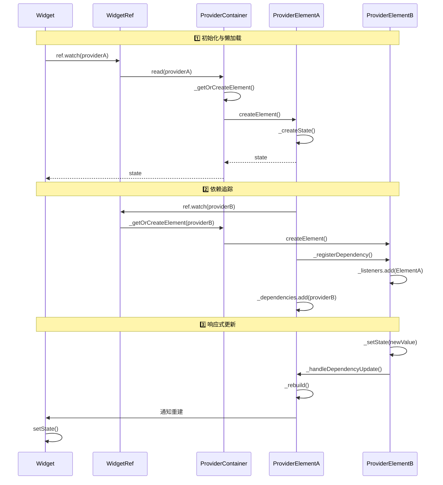

# Riverpod

Riverpod 是一个专门为 Flutter 和 Dart 设计的**反应式状态管理**和**依赖注入**库。它由 **Remi Rousselet** 打造，可以看作是 Provider 的继任者，其核心目标是解决 Provider 在多实例、编译安全、测试性等方面的根本限制 。

下面从**设计哲学**到**核心机制**，对 Riverpod 进行解析。

---

### 🧱 1. 架构设计的三大基石

#### A. Provider：唯一的“状态定义”
- **本质**：Provider 是一个全局的、不可变的对象。它不存储状态，而是存储了 **“如何创建状态”的工厂函数** 。
- **差异**：它与 Provider 最大的不同在于，Riverpod 不依赖 Widget 树来查找 Provider。你可以在任何 Dart 代码（非 Flutter 层）中使用它。

#### B. ProviderContainer：状态的“存储容器”
- **解耦**：这是 Riverpod 架构的核心。状态实例并不挂在 Provider 上，而是挂在 `ProviderContainer` 上 。
- **作用**：Container 就像一个 Map，负责创建、缓存和分发 Provider 的状态。当 Provider 被重建时，旧的 Container 会被释放。

#### C. Ref (引用)：通信的“桥梁”
- **机制**：每个 Provider 都有自己独立的 `Ref` 对象。通过它，Provider 可以读取其他 Provider（`watch`/`read`）、监听生命周期（`onDispose`）或处理副作用（`listen`） 。

---

### ⚙️ 2. 核心原理与工作流

#### A. 状态生命周期
Riverpod 对状态的生命周期有非常精细的控制，分为四个状态 ：

1.  **未初始化**
    -   仅定义了工厂函数，未占用内存。
    -   👉 **触发**：定义 Provider，但未使用。

2.  **活动中**
    -   状态被创建，监听依赖项变更，响应式更新。
    -   👉 **触发**：UI 或另一 Provider 调用了 `ref.watch`。

3.  **暂停**
    -   **优化机制**：当没有监听者时，Riverpod 默认会“暂停”计算资源的消耗，但保留内存中的值以便快速恢复。
    -   👉 **触发**：不再被任何监听器监听。

4.  **已销毁**
    -   **防内存泄漏**：彻底删除状态。只有被标记为 `.autoDispose` 的 Provider 在“暂停”后会进入此状态 。你可以在此时执行 `onDispose` 清理资源（如关闭 WebSocket）。

#### B. 响应式依赖 (ref.watch)
这是 Riverpod 最核心的“魔法”。当一个 Provider 使用 `ref.watch(otherProvider)` 时：

1.  **依赖图建立**：Riverpod 会自动构建一个有向无环图。
2.  **自动重建**：当 `otherProvider` 状态改变，依赖它的 Provider 会**自动使自身缓存失效**，并在下次被读取时重新计算 。
3.  **数据保持**：在异步请求中，当依赖变化导致重建时，旧数据会保留直到新数据加载完成（避免 UI 闪屏）。

#### C. 作用域与覆盖
- **全局 vs 局部**：虽然 Provider 定义是全局的，但你可以通过嵌套 `ProviderScope` 来“覆盖”特定子树下的状态 。
- **Overrides 机制**：这使得测试变得极其简单——你可以注入一个 Mock 对象覆盖原 Provider，而不需要修改业务逻辑代码 。

---

### 🧩 3. 关键进阶模式

| 模式 | 原理与场景 | 解决的问题 |
| :--- | :--- | :--- |
| **Family** | 允许 Provider 接收外部参数（如 ID）。相当于创建了一个 **“Provider 工厂”**，为每个参数生成独立的状态实例 。 | 解决列表详情页缓存混乱问题。 |
| **.autoDispose** | 监听引用计数。当计数归零（不再被任何地方监听），状态被销毁并调用 `onDispose`。 | 解决网络请求、流订阅的内存泄漏。 |
| **AsyncValue** | 异步数据的内置封装类，强制处理 `data`、`loading`、`error` 三种 UI 状态。 | 解决异步状态的标准化处理。 |

---

### 💡 4. 为什么选择 Riverpod？

- **编译安全**：官方提供了代码生成工具（`riverpod_generator`），减少手写样板代码并提升类型安全。
- **摆脱 BuildContext**：你可以在任何地方（如 Repository 层、ViewModel）读取 Provider，非常适合 **Clean Architecture**。
- **测试友好**：由于不依赖 Widget 树，只需创建 `ProviderContainer` 即可隔离测试 。

简单来说，Riverpod 的设计哲学是：**“全局定义如何创建，局部/容器内存储状态”**。它摆脱了对 Widget 树的依赖，通过 `Ref` 驱动响应式更新。

## 一、源码架构概览

Riverpod 的源码设计借鉴了 Flutter 的 **Widget-Element 树**架构。核心思想是：**Provider 只是配置，实际工作由 ProviderElement 完成**。

```
┌─────────────────────────────────────────────────────────────┐
│                      架构分层                                │
├─────────────────────────────────────────────────────────────┤
│  Provider (配置层)    →    ProviderElement (状态层)         │
│  - 定义创建函数        - 存储实际状态                         │
│  - 不可变、可覆写       - 管理生命周期                        │
│  - 全局定义            - 响应依赖变化                        │
└─────────────────────────────────────────────────────────────┘
```

---

## 二、Provider 源码分析：配置层

### 2.1 ProviderBase 抽象类

所有 Provider 都继承自 `ProviderBase<StateT>`：

```dart
// 源码位置: riverpod/lib/src/provider.dart
@immutable
abstract class ProviderBase<StateT> extends ProviderOrFamily
    with ProviderListenable<StateT>
    implements ProviderOverride, Refreshable<StateT> {

  const ProviderBase({
    required super.name,
    required this.from,           // 来自哪个 ProviderFamily
    required this.argument,       // Family 传入的参数
    required this.debugGetCreateSourceHash,
    required super.dependencies,
    required super.allTransitiveDependencies,
  });

  // 用作 key，ProviderScope 通过它找到对应的 ProviderElement
  @override
  ProviderBase<Object?> get _origin => this;

  // 子类实现：创建对应的 Element
  ProviderElementBase<StateT> createElement();

  // 读取逻辑，实际委托给 Element
  StateT read(ProviderContainer container) {
    return container.read(this);
  }
}
```

**核心要点**：Provider 本身不存储状态，它只存储"如何创建状态"的工厂方法。

### 2.2 Provider 的具体实现

以最简单的 `Provider` 为例：

```dart
// 源码简化版
class Provider<T> extends ProviderBase<T> {
  final T Function(ProviderRef<T>) _createFn;

  const Provider(this._createFn);

  @override
  ProviderElement<T> createElement() {
    return ProviderElement<T>(this);
  }
}
```

---

## 三、ProviderElement 源码分析：状态层

### 3.1 Element 的生命周期状态

根据官方文档，Element 经历四个状态：

```dart
// 状态枚举（源码中通过内部变量体现）
enum _ElementState {
  uninitialized,  // 未初始化
  alive,          // 活动中
  paused,         // 暂停
  disposed,       // 已销毁
}
```

### 3.2 ProviderElementBase 核心逻辑

```dart
// 源码简化版: riverpod/lib/src/element.dart
abstract class ProviderElementBase<StateT> {
  
  StateT? _state;                    // 缓存的状态
  _ElementState _elementState = _ElementState.uninitialized;
  final Set<ProviderListenable> _listeners = {};  // 依赖此 provider 的监听者
  final Set<ProviderListenable> _dependencies = {}; // 此 provider 依赖的 providers
  
  // 获取状态（核心方法）
  StateT get state {
    switch (_elementState) {
      case _ElementState.uninitialized:
        _createState();  // 懒加载：首次访问时创建
        break;
      case _ElementState.disposed:
        throw StateError('Provider was disposed');
      default:
        break;
    }
    return _state!;
  }
  
  // 创建状态
  void _createState() {
    _elementState = _ElementState.alive;
    
    // 1. 创建 Ref 对象，用于依赖追踪
    final ref = _RefImpl(this);
    
    // 2. 执行 Provider 的 build 函数
    _state = _createBuild(ref);
    
    // 3. 建立依赖关系图
    _registerDependencies();
  }
  
  // 依赖变更时重建
  void _handleDependencyUpdate() {
    final oldState = _state;
    _state = _rebuild();  // 重新执行 build
    _notifyListeners(oldState, _state);  // 通知下游
  }
}
```

---

## 四、核心工作流源码调用链

### 4.1 工作流一：Provider 初始化与懒加载

**场景**：UI 中第一次调用 `ref.watch(myProvider)`

```
【调用链】
1. Widget.build() 
   → ref.watch(myProvider)
   
2. WidgetRef 实现类（ConsumerStatefulElement 或 ConsumerStatelessElement）
   → _container.read(myProvider)
   
3. ProviderContainer.read()
   → _getOrCreateElement(myProvider)    // 获取或创建 Element
   
4. ProviderContainer._getOrCreateElement()
   → if (!_elements.containsKey(provider)) {
       _elements[provider] = provider.createElement()  // 创建 Element
     }
   → return _elements[provider]
   
5. ProviderElement.state (getter)
   → if (_elementState == uninitialized) _createState()
   
6. ProviderElement._createState()
   → 执行 provider 的 _createFn(ref)     // 你的业务逻辑执行
   → 缓存结果到 _state
   → 标记为 alive 状态
```

**源码关键位置**：

```dart
// ProviderContainer 源码简化
class ProviderContainer {
  final Map<ProviderBase, ProviderElementBase> _elements = {};
  
  StateT read<StateT>(ProviderBase<StateT> provider) {
    final element = _getOrCreateElement(provider);
    return element.state;  // 触发懒加载
  }
  
  ProviderElementBase _getOrCreateElement(ProviderBase provider) {
    var element = _elements[provider];
    if (element == null) {
      element = provider.createElement();  // Element 在此创建
      _elements[provider] = element;
    }
    return element;
  }
}
```

### 4.2 工作流二：依赖追踪 (ref.watch)

**场景**：Provider A watch Provider B

```
【调用链】
1. Provider A 的 build 函数中执行
   → ref.watch(providerB)
   
2. _RefImpl.watch()
   → 记录依赖关系：A 监听 B
   → _container._getOrCreateElement(providerB).addListener(this)
   
3. ProviderElementB.addListener()
   → _listeners.add(listener)   // 将 A 的 Element 加入 B 的监听者集合
   
4. ProviderElementA._dependencies.add(providerB)  // A 记录依赖了 B
```

**源码关键位置**：

```dart
// _RefImpl 源码简化
class _RefImpl<StateT> implements Ref<StateT> {
  final ProviderElementBase<StateT> _element;
  
  @override
  T watch<T>(ProviderBase<T> provider) {
    // 1. 获取或创建目标 provider 的 element
    final targetElement = _element._container._getOrCreateElement(provider);
    
    // 2. 建立依赖关系（关键！）
    _element._registerDependency(targetElement);
    
    // 3. 返回当前状态
    return targetElement.state;
  }
}

// ProviderElement 中的依赖注册
void _registerDependency(ProviderElementBase target) {
  _dependencies.add(target._origin);
  target._listeners.add(this);  // 反向注册：目标记录我依赖它
}
```

依赖追踪的本质是**在 Ref.watch 调用时动态采集依赖边**，构建有向图：

```
执行 createFn 时 → ref.watch(apiProvider) → 采集边：userRepo → apiProvider
```

### 4.3 工作流三：响应式更新（依赖变更传播）

**场景**：Provider B 的状态发生变化

```
【调用链】
1. Provider B 状态变更
   → 例如 StateNotifier 调用 state = newValue
   
2. ProviderElementB._setState(newValue)
   → _state = newValue
   → _notifyListeners()
   
3. ProviderElementB._notifyListeners()
   → for (final listener in _listeners) {
       listener._handleDependencyUpdate()  // 通知所有依赖者
     }
   
4. ProviderElementA._handleDependencyUpdate()
   → _elementState = _ElementState.alive
   → _state = _rebuild()   // 重新执行 A 的 build 函数
   → _notifyListeners()    // 继续向下传播
   
5. 最终传播到 Widget Element
   → Widget 的 ConsumerState 收到通知
   → 调用 setState() 触发 UI 重建
```

**依赖传播示意图**：

```
依赖图：Widget → viewModel → repository → api
            ↑         ↑           ↑
            │         │           │
api 变化 ───┼─────────┼───────────┘
            │         │
repository 重建 ──────┘
            │
viewModel 重建
            │
Widget 重建
```

### 4.4 工作流四：autoDispose 自动销毁

**场景**：Provider 标记了 `.autoDispose` 且不再被监听

```
【触发时机】
1. Flutter 每一帧结束后，Riverpod 检查监听者计数
   → ProviderContainer._runAutoDisposeCheck()
   
2. 判断条件：
   → element._listeners.isEmpty           // 无监听者
   → provider 是 AutoDisposeProvider      // 标记了 autoDispose
   → 距离上次检查超过一帧
   
3. 满足条件时执行销毁
   → element._elementState = _ElementState.disposed
   → element._onDisposeCallbacks.forEach((cb) => cb())  // 执行清理回调
   → _elements.remove(provider)            // 从容器中移除
```

**源码位置**（官方文档说明）：

```dart
// 使用示例
final myProvider = Provider.autoDispose((ref) {
  final controller = StreamController();
  
  // 注册销毁回调
  ref.onDispose(() {
    controller.close();  // 清理资源
  });
  
  return controller.stream;
});
```

### 4.5 工作流五：ProviderFamily（参数化 Provider）

**场景**：根据参数创建不同的 Provider 实例

Family 不是 Provider，而是一个 **工厂**，根据参数生成对应的 Provider：

```dart
// 源码: FamilyBase
class FamilyBase<RefT, R, Arg, ProviderT> extends Family<R> {
  final ProviderT Function(Arg arg) _providerFactory;
  
  // 调用 family(argument) 时执行
  @override
  ProviderT call(Arg argument) {
    return _providerFactory(argument);
  }
}
```

**内部实现**：Family 将参数作为 key，为每个参数组合创建独立的 Provider 和 Element：

```dart
// 内部缓存结构（概念示意）
final _cache = Expando<Map<Object, ProviderElementBase>>();

// 不同参数 → 不同 Element
userProvider('123') → Element_A (缓存 key: '123')
userProvider('456') → Element_B (缓存 key: '456')
```

**重要**：因为每个参数组合都会创建独立的状态实例，官方强烈建议配合 `.autoDispose` 使用，避免内存泄漏。

---

## 五、ProviderContainer：状态管理中心

`ProviderContainer` 是整个架构的心脏：

```dart
// ProviderContainer 源码核心结构
class ProviderContainer {
  // 核心数据结构：Element 缓存
  final Map<ProviderBase, ProviderElementBase> _elements = {};
  
  // 读取 provider
  StateT read<StateT>(ProviderBase<StateT> provider) {
    return _getOrCreateElement(provider).state;
  }
  
  // 监听 provider（用于 UI）
  T listen<T>(ProviderListenable<T> provider, void Function(T?, T) listener,
      {void Function(Object, StackTrace)? onError}) {
    final element = _getOrCreateElement(provider);
    return element.addListener(listener, fireImmediately: true, onError: onError);
  }
  
  // 刷新 provider（强制重建）
  void refresh<StateT>(ProviderBase<StateT> provider) {
    final element = _elements[provider];
    if (element != null) {
      element._refresh();
    }
  }
  
  // 销毁 provider
  void invalidate<StateT>(ProviderBase<StateT> provider) {
    final element = _elements.remove(provider);
    element?.dispose();
  }
  
  // 整体销毁
  void dispose() {
    for (final element in _elements.values) {
      element.dispose();
    }
    _elements.clear();
  }
}
```

---

## 六、完整调用时序图



---

## 七、核心源码文件索引

| 组件 | 源码路径 | 核心职责 |
|------|----------|----------|
| `ProviderBase` | `lib/src/provider.dart` | Provider 基类，定义配置 |
| `ProviderElementBase` | `lib/src/element.dart` | Element 基类，管理状态 |
| `ProviderContainer` | `lib/src/container.dart` | 状态存储容器 |
| `Ref` 实现 | `lib/src/ref.dart` | 依赖追踪接口 |
| `FamilyBase` | `lib/src/family.dart` | 参数化 Provider 工厂 |

---

## 八、总结

Riverpod 的设计精髓在于 **Widget-Element 模式的借鉴**：

1. **Provider = 配置**：不可变、可覆写、全局定义
2. **Element = 状态**：存储实际值、管理生命周期、维护依赖图
3. **Container = 缓存**：`Map<Provider, Element>` 的核心数据结构
4. **Ref = 桥接**：在 build 函数中采集依赖边，构建响应式网络

这种设计实现了真正的**懒加载 + 依赖注入 + 响应式更新**，同时摆脱了对 Flutter Widget 树的依赖。

## 一、refresh 的核心本质：语法糖

在深入调用链之前，首先要理解 `refresh` 的本质。根据官方文档，`ref.refresh(provider)` 仅仅是 `invalidate(provider) + read(provider)` 的语法糖：

```dart
// refresh 的本质实现（概念代码）
T refresh<T>(provider) {
  invalidate(provider);   // 1. 标记失效，立即销毁状态
  return read(provider);  // 2. 立即读取，触发重建
}
```

这个定义揭示了 `refresh` 的两个核心行为：
1. **同步销毁**：立即将 Provider 状态标记为已销毁
2. **立即重建**：同步触发重新创建，并返回新值

而单纯调用 `invalidate` 则不同——它只标记失效，实际重建会延迟到下一帧或下次被监听时。

---

## 二、refresh 的源码调用链

下面从 `ref.refresh(provider)` 调用开始，完整追踪源码执行链路。

### 第 1 步：入口 — `WidgetRef.refresh`

当你在 UI 或 Provider 中调用 `ref.refresh(provider)` 时：

```dart
// 入口：ref.refresh(someProvider)
// 源码位置：riverpod/lib/src/ref.dart (概念示意)
class _RefImpl<StateT> implements Ref<StateT> {
  @override
  T refresh<T>(ProviderBase<T> provider) {
    // 步骤 1: 使 provider 失效
    invalidate(provider);
    // 步骤 2: 立即读取（触发重建）
    return read(provider);
  }
}
```

### 第 2 步：invalidate — 标记失效并销毁

```dart
// 源码位置：riverpod/lib/src/ref.dart
class _RefImpl<StateT> implements Ref<StateT> {
  @override
  void invalidate<T>(ProviderBase<T> provider) {
    // 获取容器，调用容器的 invalidate 方法
    _container.invalidate(provider);
  }
}
```

进入 `ProviderContainer`：

```dart
// 源码位置：riverpod/lib/src/container.dart
class ProviderContainer {
  void invalidate<T>(ProviderBase<T> provider) {
    // 1. 从缓存中获取 Element
    final element = _elements[provider];
    if (element == null) return;  // 未初始化，无需操作
    
    // 2. 调用 Element 的失效方法
    element.invalidate();
  }
}
```

进入 `ProviderElementBase`：

```dart
// 源码位置：riverpod/lib/src/element.dart
abstract class ProviderElementBase<StateT> {
  void invalidate({bool asReload = false}) {
    // 1. 如果已经销毁，直接返回
    if (_elementState == _ElementState.disposed) return;
    
    // 2. 执行所有 onDispose 回调
    for (final callback in _onDisposeCallbacks) {
      callback();
    }
    
    // 3. 标记状态为已销毁
    _elementState = _ElementState.disposed;
    
    // 4. 从容器中移除自身
    _container._elements.remove(_origin);
    
    // 5. 🔥 关键：通知所有依赖者，告诉他们我失效了
    _notifyDependentsAboutInvalidation();
  }
}
```

**关键机制**：`invalidate` 不仅销毁当前 Provider，还会触发依赖传播。

### 第 3 步：依赖失效通知 — 传播机制

```dart
// 源码位置：riverpod/lib/src/element.dart
void _notifyDependentsAboutInvalidation() {
  // 遍历所有依赖此 Provider 的监听者（其他 Provider 或 Widget）
  for (final dependent in _listeners) {
    // 通知每个依赖者：你所依赖的 Provider 失效了
    dependent._handleDependencyInvalidation(this);
  }
}
```

当依赖方（Provider B）收到通知时：

```dart
void _handleDependencyInvalidation(ProviderElementBase source) {
  // 1. 标记自己为"脏"状态（需要重建）
  _isDirty = true;
  
  // 2. 如果自己当前有监听者，则通知它们
  if (_listeners.isNotEmpty) {
    _scheduleRebuild();  // 安排重建
  }
  // 如果没有监听者，则只是标记为脏，等下次被读取时重建
}
```

### 第 4 步：read — 触发重建

`invalidate` 之后，`refresh` 会立即调用 `read`：

```dart
// 源码位置：riverpod/lib/src/container.dart
class ProviderContainer {
  T read<T>(ProviderBase<T> provider) {
    // 获取或创建 Element
    final element = _getOrCreateElement(provider);
    // 获取 state（触发懒加载/重建）
    return element.state;
  }
}
```

进入 Element 的 state getter：

```dart
StateT get state {
  // 🔥 关键：如果已被销毁，则重新创建
  if (_elementState == _ElementState.disposed) {
    _createState();  // 重新执行 build 函数
  }
  return _state!;
}

void _createState() {
  _elementState = _ElementState.alive;
  
  // 1. 创建新的 Ref 对象
  final ref = _RefImpl(this);
  
  // 2. 重新执行 Provider 的 build 函数
  _state = _createBuild(ref);
  
  // 3. 重新建立依赖关系（ref.watch 调用会重新采集）
  _registerDependencies();
  
  // 4. 通知监听者状态已更新
  _notifyListeners(oldState, _state);
}
```

### 第 5 步：UI 层重建（最终效果）

对于 UI 层的监听，重建通知最终会传递到 Widget：

```dart
// 简化示意：ConsumerStatefulElement 中的监听处理
class ConsumerStatefulElement extends StatefulElement {
  void _handleProviderUpdate() {
    // 触发 Widget 重建
    markNeedsBuild();
  }
}
```

---

## 三、refresh vs invalidate 的完整对比

| 维度 | `refresh` | `invalidate` |
|------|-----------|--------------|
| **本质** | `invalidate()` + `read()` | 仅失效 |
| **执行时机** | 同步立即执行 | 下一帧或被读取时 |
| **返回值** | 返回重建后的新值 | 无返回值 |
| **适用场景** | 需要立即获得新值（如下拉刷新） | 只需清除状态，不关心立即结果 |

官方文档明确指出：如果你不关心 Provider 重建后的新值，用 `invalidate`；如果关心新值，用 `refresh`。

---

## 四、依赖调用的完整示意图

```
┌─────────────────────────────────────────────────────────────────┐
│                     refresh 完整调用链                           │
├─────────────────────────────────────────────────────────────────┤
│                                                                 │
│  ref.refresh(providerA)                                        │
│       │                                                         │
│       ▼                                                         │
│  ┌─────────────────────────────────────────────────────────┐   │
│  │ Phase 1: invalidate                                      │   │
│  │                                                          │   │
│  │  container.invalidate(providerA)                        │   │
│  │       │                                                  │   │
│  │       ▼                                                  │   │
│  │  element.invalidate()                                   │   │
│  │       │                                                  │   │
│  │       ├── 执行 onDispose 回调                            │   │
│  │       ├── 标记状态为 disposed                            │   │
│  │       └── 从容器移除                                     │   │
│  └─────────────────────────────────────────────────────────┘   │
│       │                                                         │
│       ▼                                                         │
│  ┌─────────────────────────────────────────────────────────┐   │
│  │ Phase 1.5: 依赖失效传播                                   │   │
│  │                                                          │   │
│  │  _notifyDependentsAboutInvalidation()                   │   │
│  │       │                                                  │   │
│  │       ├── ProviderB._handleDependencyInvalidation()     │   │
│  │       │       └── 标记 ProviderB 为"脏"                  │   │
│  │       │                                                  │   │
│  │       └── ProviderC (UI) 收到通知 → 标记需要重建          │   │
│  └─────────────────────────────────────────────────────────┘   │
│       │                                                         │
│       ▼                                                         │
│  ┌─────────────────────────────────────────────────────────┐   │
│  │ Phase 2: read                                             │   │
│  │                                                          │   │
│  │  container.read(providerA)                              │   │
│  │       │                                                  │   │
│  │       ▼                                                  │   │
│  │  element.state (getter)                                 │   │
│  │       │                                                  │   │
│  │       └── 状态为 disposed → 执行 _createState()         │   │
│  │               │                                          │   │
│  │               ├── 重新执行 build 函数                    │   │
│  │               ├── 重新建立依赖 (ref.watch)               │   │
│  │               └── 通知监听者状态更新                     │   │
│  └─────────────────────────────────────────────────────────┘   │
│       │                                                         │
│       ▼                                                         │
│  返回重建后的新值 + UI 自动更新                                   │
└─────────────────────────────────────────────────────────────────┘
```

---

## 五、关键场景分析

### 场景 1：下拉刷新 (Pull-to-Refresh)

这是 `refresh` 最典型的应用场景：

```dart
RefreshIndicator(
  onRefresh: () => ref.refresh(activityProvider.future),
  child: ...
)
```

当用户下拉时：
1. `refresh` 被调用
2. Provider 立即被销毁并重建
3. `AsyncValue` 在重建期间**保留旧数据**，避免 UI 闪白
4. 新数据加载完成后，UI 平滑更新

### 场景 2：级联失效

如果 Provider A 依赖 Provider B，调用 `ref.refresh(B)` 会发生什么？

```
refresh(B)
    │
    ├── B 被销毁并重建
    │
    └── 依赖 B 的 A 收到失效通知
            │
            └── A 被标记为脏
                    │
                    └── 下次读取 A 时自动重建
```

这意味着你不需要手动刷新所有依赖——Riverpod 会自动传播失效。

### 场景 3：未被监听的 Provider

如果对一个当前没有被任何地方监听的 Provider 调用 `invalidate`（而不是 `refresh`）：

```dart
ref.invalidate(unusedProvider);  // 没有被监听
```

此时状态会被立即销毁，但**不会立即重建**。只有当某处再次读取这个 Provider 时，才会重新创建。这是一种优化——不浪费资源重建暂时不需要的状态。

---

## 六、小结

| 要点 | 说明 |
|------|------|
| **refresh = invalidate + read** | 这是理解 refresh 行为的第一原则 |
| **依赖传播是自动的** | 不需要手动刷新依赖树，Riverpod 会处理 |
| **旧数据保护** | `AsyncValue` 在 refresh 期间保留旧数据，避免闪屏 |
| **生命周期回调** | `onDispose` 在 invalidate 时被调用，用于清理资源 |

## 一、AsyncValue 的设计目标

AsyncValue 是 Riverpod 用于**安全处理异步状态**的核心类型。其设计目标是：

> **强制要求开发者处理异步操作的三种状态（loading/data/error），避免遗忘导致的运行时问题**

在 Dart 3.0+ 中，AsyncValue 是一个 **sealed class**（密封类），这意味着编译器可以检查 `switch` 语句是否穷举了所有情况。

---

## 二、核心类型层次结构

```dart
// sealed 类 - 外部无法创建子类
sealed class AsyncValue<T> {
  // 三个核心工厂构造函数
  const factory AsyncValue.data(T value) = AsyncData<T>;
  const factory AsyncValue.error(Object error, StackTrace stackTrace) = AsyncError<T>;
  const factory AsyncValue.loading({num? progress}) = AsyncLoading<T>;
  
  // 核心属性
  T? get value;
  Object? get error;
  StackTrace? get stackTrace;
  bool get hasValue;
  bool get hasError;
  bool get isLoading;
  
  // 核心方法
  T get requireValue;
  R when<R>({...});
}
```

### 2.1 三个子类的具体实现

| 子类 | 属性 | 存储内容 |
|------|------|----------|
| `AsyncData<T>` | `value: T` | 成功的数据 |
| `AsyncError<T>` | `error: Object`, `stackTrace: StackTrace` | 异常对象和堆栈 |
| `AsyncLoading<T>` | `progress: num?` | 可选的进度（0-1） |

---

## 三、核心实现源码解析

### 3.1 requireValue 的实现

这是 AsyncValue 最关键的同步访问方法，用于在确信数据存在时直接取值：

```dart
// 源码：riverpod/lib/src/async_value.dart (简化版)
T get requireValue {
  // 1. 如果有数据，直接返回
  if (hasValue) return value as T;
  
  // 2. 如果有错误，重新抛出异常
  if (hasError) {
    throw ProviderException(error!, stackTrace!);
  }
  
  // 3. 如果是 Loading 状态，抛出自定义异常
  throw AsyncValueIsLoadingException._(this);
}
```

**使用场景**：

```dart
// 在 Provider 中同步组合多个异步 Provider
final sumProvider = FutureProvider<int>((ref) {
  // ref.watch 返回 AsyncValue<int>
  AsyncValue<int> a = ref.watch(futureProviderA);
  AsyncValue<int> b = ref.watch(futureProviderB);
  
  // requireValue 在 Loading 时会抛出 AsyncValueIsLoadingException
  // Riverpod 会捕获这个异常并等待数据就绪后重建
  return a.requireValue + b.requireValue;  // 同步写法！
});
```

**机制原理**：Riverpod 在执行 Provider 的 build 函数时，会**自动捕获** `AsyncValueIsLoadingException`，静默处理而不上报错误。当依赖的数据就绪后，自动重新执行 build 函数。

### 3.2 AsyncValue.guard 的实现

`AsyncValue.guard` 是一个工具函数，用于将异步操作优雅地包装成 AsyncValue：

```dart
// 源码：riverpod/lib/src/async_value.dart
static Future<AsyncValue<T>> guard<T>(
  Future<T> Function() callback,
) async {
  try {
    final value = await callback();
    return AsyncValue.data(value);
  } catch (error, stackTrace) {
    return AsyncValue.error(error, stackTrace);
  }
}
```

**使用示例**：

```dart
// 在 AsyncNotifier 中手动控制状态
@riverpod
class MyNotifier extends _$MyNotifier {
  @override
  FutureOr<String> build() => 'initial';
  
  Future<void> fetchData() async {
    // 显式设置为 Loading
    state = const AsyncValue.loading();
    // 执行异步操作并自动捕获错误
    state = await AsyncValue.guard(() => _doNetworkCall());
  }
}
```

### 3.3 when 方法的实现

`when` 是处理三种状态的核心方法，提供了丰富的控制选项：

```dart
// 源码简化版
R when<R>({
  required R Function(T data) data,
  required R Function(Object error, StackTrace stackTrace) error,
  required R Function() loading,
  
  // 重要控制参数
  bool skipLoadingOnReload = false,   // reload 时跳过 loading 状态
  bool skipLoadingOnRefresh = true,   // refresh 时跳过 loading 状态
  bool skipError = false,              // 错误时是否仍然展示旧数据
}) {
  // 复杂的状态判断逻辑...
}
```

**参数语义说明**：

| 参数 | 作用 | 默认值 |
|------|------|--------|
| `skipLoadingOnReload` | 依赖变化导致的重建是否跳过 loading 并保留旧数据 | `false` |
| `skipLoadingOnRefresh` | 手动 refresh/invalidate 是否跳过 loading 并保留旧数据 | `true` |
| `skipError` | 错误发生时是否仍然展示之前的数据而不是错误 UI | `false` |

**实际效果**：配合 `copyWithPrevious` 机制，AsyncLoading 可以"携带"之前的数据/错误。

---

## 四、核心工作机制详解

### 4.1 状态保留机制（copyWithPrevious）

这是 Riverpod 3.0 引入的关键特性：**AsyncLoading 可以携带旧数据**。

**源码示意**：

```dart
// AsyncLoading 类的 copyWithPrevious 实现
class AsyncLoading<T> extends AsyncValue<T> {
  final T? _previousValue;     // 可能携带旧数据
  final Object? _previousError; // 可能携带旧错误
  
  AsyncLoading({this._previousValue, this._previousError, num? progress});
  
  @override
  T? get value => _previousValue;  // Loading 期间仍可访问旧值
}
```

**实际使用效果**：

```dart
final userProvider = FutureProvider<User>((ref) async {
  return await fetchUser();
});

// UI 层
switch (ref.watch(userProvider)) {
  case AsyncValue(:final value?):
    return Text('User: ${value.name}');
  case AsyncValue(error: != null):
    return Text('Error');  // 只有在无旧数据时才显示错误
  case AsyncValue():
    // loading 状态：如果有旧数据，仍然显示旧数据
    return OldDataWidget();  // 避免 UI 闪白
}
```

### 4.2 UI 层处理

AsyncValue 在 Widget 中的标准用法：

```dart
@override
Widget build(BuildContext context, WidgetRef ref) {
  final AsyncValue<User> user = ref.watch(userProvider);
  
  // 使用 switch 进行穷举处理
  return switch (user) {
    // 1. 优先匹配有数据的情况
    AsyncValue(:final value?) => Text('Hello ${value.name}'),
    // 2. 再匹配错误情况
    AsyncValue(error: != null) => Text('Error: ${user.error}'),
    // 3. 最后处理 loading
    AsyncValue() => const CircularProgressIndicator(),
  };
}
```

> ⚠️ **重要**：顺序很重要！必须先检查 value 再检查 error，最后才是 loading。

---

## 五、AsyncValue 在 Provider 内部的流转

### 5.1 自动错误捕获

使用 `FutureProvider` 或 `AsyncNotifier` 时，Riverpod **自动**捕获错误并转换为 AsyncError：

```dart
// 定义
final userProvider = FutureProvider<User>((ref) async {
  // 如果这里抛出异常，Riverpod 自动包装为 AsyncError
  return await dio.get('/user');
});

// 等价于手动实现
final userProviderManual = FutureProvider<User>((ref) async {
  try {
    return await dio.get('/user');
  } catch (e, st) {
    return AsyncValue.error(e, st);  // 自动完成
  }
});
```

### 5.2 状态流转示例

```
┌─────────────────────────────────────────────────────────────────┐
│                  AsyncValue 状态流转                             │
├─────────────────────────────────────────────────────────────────┤
│                                                                 │
│  1. 初始状态                                                    │
│     AsyncLoading<T>()  ──────────────────────────────────┐      │
│       │ value = null, error = null                       │      │
│       │                                                   │      │
│  2. 请求成功               3. 请求失败                      │      │
│     ▼                          ▼                          │      │
│  AsyncData<T>(value)      AsyncError<T>(error)           │      │
│       │                          │                        │      │
│  4. 刷新/重建                  4. 重试                     │      │
│     ▼                          ▼                          │      │
│  AsyncLoading<T>(           AsyncLoading<T>(             │      │
│    previousValue: oldData   previousError: oldError      │      │
│  )                           )                            │      │
│       │                          │                        │      │
│       └──────────┬───────────────┘                        │      │
│                  │                                        │      │
│  5. 再次成功/失败：携带旧数据继续流转                         │      │
│                                                                 │
└─────────────────────────────────────────────────────────────────┘
```

---

## 六、关键 API 总结

| API | 类型 | 用途 |
|-----|------|------|
| `AsyncValue.data()` | 构造函数 | 创建成功状态 |
| `AsyncValue.error()` | 构造函数 | 创建错误状态 |
| `AsyncValue.loading()` | 构造函数 | 创建加载状态 |
| `AsyncValue.guard()` | 静态方法 | 自动捕获异常并包装 |
| `requireValue` | 属性 | 同步获取值，否则抛异常 |
| `when()` | 方法 | 处理三种状态 |
| `hasValue/hasError/isLoading` | 属性 | 快速状态判断 |
| `skipLoadingOnReload` | 参数 | 控制重建时是否显示 loading |
| `skipLoadingOnRefresh` | 参数 | 控制刷新时是否显示 loading |

---

## 七、小结

AsyncValue 的核心价值在于：

1. **类型安全**：sealed class + switch 穷举检查，编译时防止遗漏状态处理
2. **用户体验**：`copyWithPrevious` 机制让 loading/error 状态可以保留旧数据，避免 UI 闪烁
3. **代码简洁**：`requireValue` 让异步 Provider 的链式组合变成同步写法
4. **自动容错**：FutureProvider/AsyncNotifier 自动捕获异常并包装

# Questions

provider的颗粒度太细。比如我又一个service类管理车辆相关的逻辑，我怎么封装到一个provider里