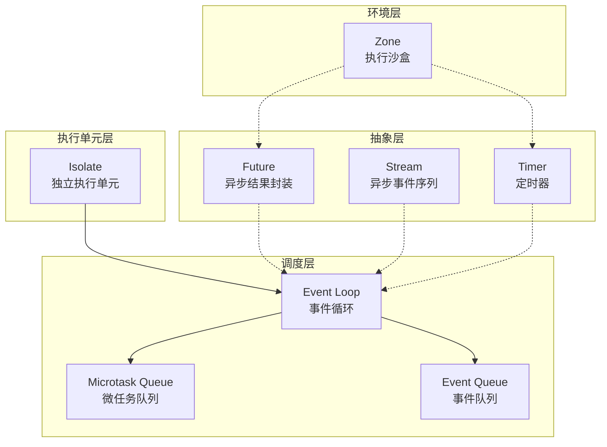
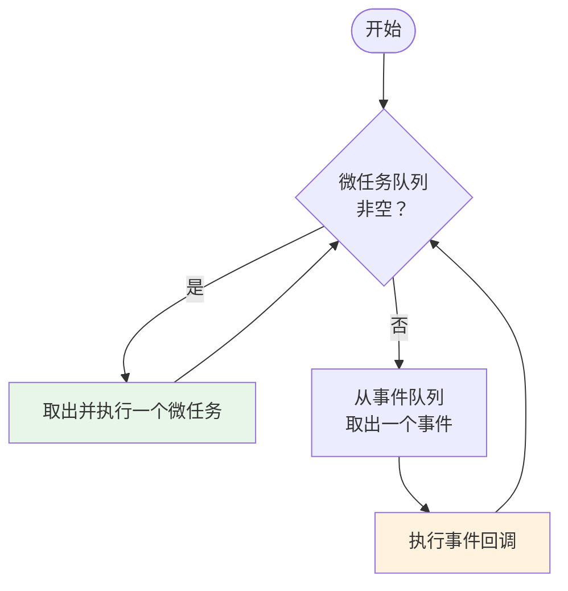
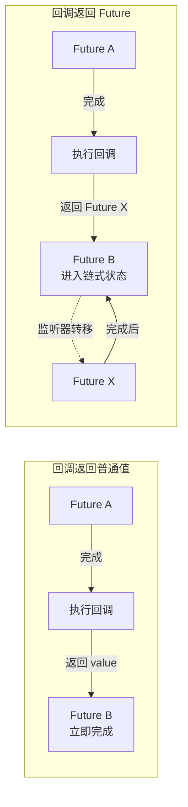
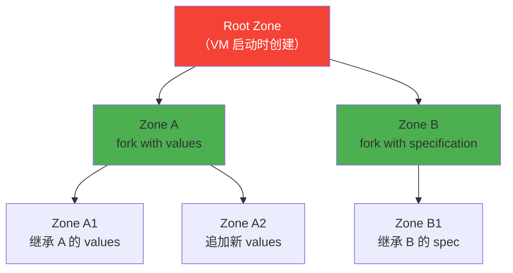
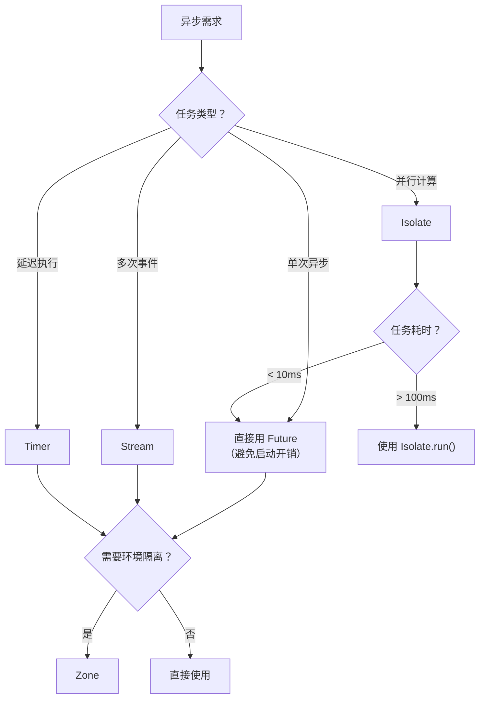
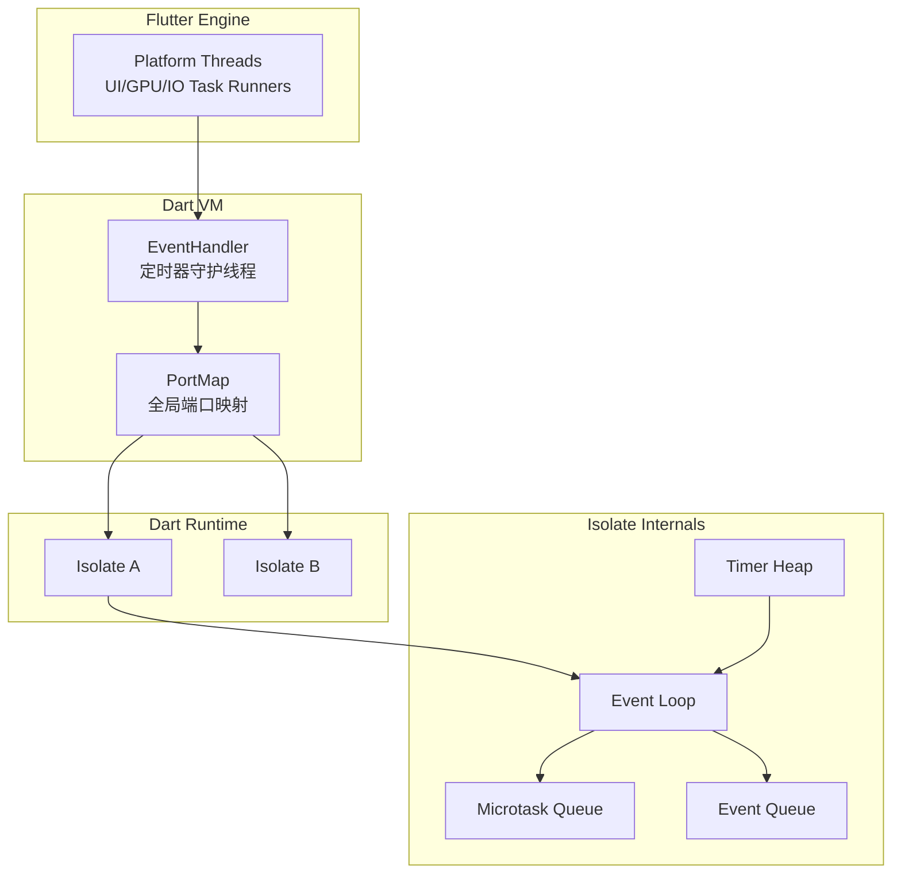
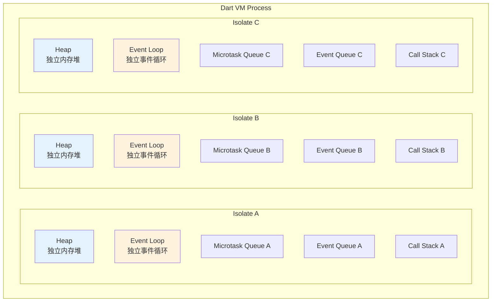
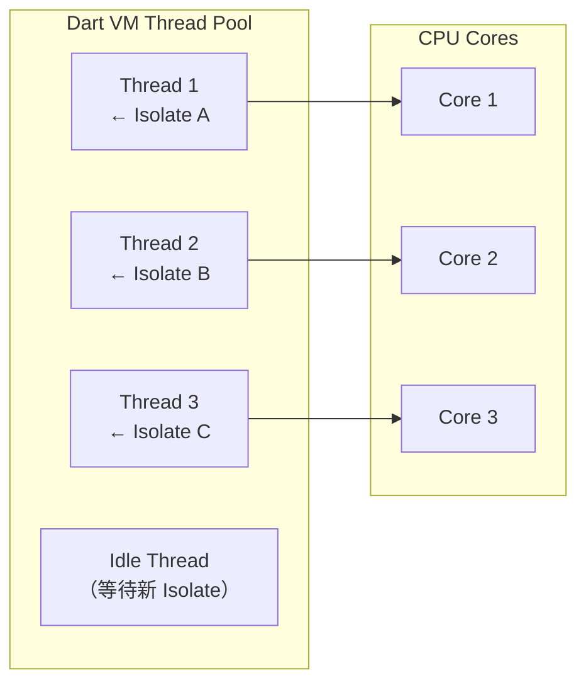
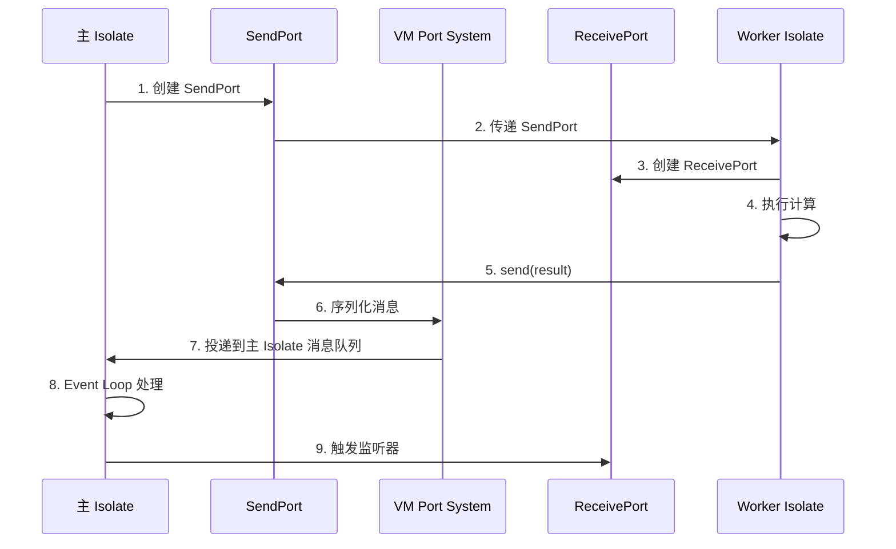
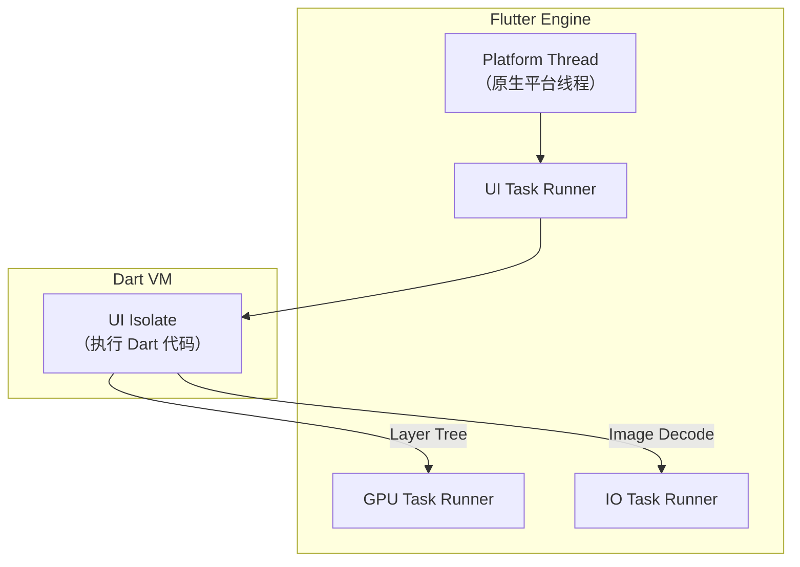

# Flutter 异步机制底层完全解析

## 一、整体架构概览

Flutter/Dart 的异步体系由六个核心概念构成，它们的关系如下：



---

## 二、Isolate：并发的最小单元

### 2.1 概念与设计模式

Isolate 是 Dart 并发模型的基石，采用了 **Actor 模型** 的设计思想。

**核心特性**：
- 每个 Isolate 有独立的内存堆，不共享状态
- Isolate 之间只能通过 **Port（端口）** 传递消息
- 消息传递时，可变对象会被**拷贝**，不可变对象传递引用

```dart
// Isolate 底层核心结构
class Isolate {
  // 创建新 Isolate
  external static Future<Isolate> spawn<T>(
    void entryPoint(T message),  // 入口函数（必须是顶层或静态）
    T message,                    // 传递给入口函数的参数
    {bool paused = false}
  );
  
  // 主动退出并发送消息（零拷贝，传递所有权）
  external static void exit(Object? result);
}
```

### 2.2 底层实现原理

Isolate 的底层通过 **PortMap** 实现跨 Isolate 通信：

```
┌─────────────────────────────────────────────────────────┐
│                    Dart VM Process                       │
│  ┌─────────────┐  PortMap  ┌─────────────┐             │
│  │  Isolate A  │◄─────────►│  Isolate B  │             │
│  │  Heap A     │  消息拷贝   │  Heap B     │             │
│  │  EventLoopA │           │  EventLoopB │             │
│  └─────────────┘           └─────────────┘             │
│         ▲                           ▲                   │
│         │ SendPort.send()           │ SendPort.send()   │
│         ▼                           ▼                   │
│  ┌─────────────┐           ┌─────────────┐             │
│  │ ReceivePort │           │ ReceivePort │             │
│  └─────────────┘           └─────────────┘             │
└─────────────────────────────────────────────────────────┘
```

**关键源码分析**：

```dart
// 底层 Port 管理（简化示意）
class _RawReceivePortImpl {
  // 全局端口映射表：portId -> {handler, ...}
  static final _portMap = <int, Map<String, dynamic>>{};
  
  // 接收消息的入口（由 VM 调用）
  static _handleMessage(int id, var message) {
    final handler = _portMap[id]?['handler'];
    if (handler != null) {
      handler(message);  // 触发回调
      _runPendingImmediateCallback();  // 刷新微任务
    }
  }
}
```

### 2.3 使用场景与代码示例

| 场景 | 推荐方案 | 原因 |
|------|---------|------|
| 几毫秒的轻量任务 | `Future` | Isolate 启动开销太大（~2MB 内存） |
| 几百毫秒以上的密集计算 | `Isolate.run()` | 避免阻塞 UI 线程 |
| 重复性后台任务 | 长生命周期 Isolate | 复用端口，减少创建开销 |

```dart
// 短生命周期 Isolate（推荐）
void main() async {
  // Isolate.run 自动管理生命周期
  final result = await Isolate.run(() => heavyComputation(10000000));
  print(result);
}

// 长生命周期 Isolate（双向通信）
Future<void> setupLongLivedIsolate() async {
  final receivePort = ReceivePort();
  final isolate = await Isolate.spawn(workerEntry, receivePort.sendPort);
  
  // 监听来自 worker 的消息
  receivePort.listen((message) {
    print('Received: $message');
  });
}

static void workerEntry(SendPort mainPort) {
  final myPort = ReceivePort();
  mainPort.send(myPort.sendPort);  // 回传自己的端口
  
  myPort.listen((task) {
    // 执行重复性任务
    final result = process(task);
    mainPort.send(result);
  });
}
```

### 2.4 Flutter 中的限制

| 限制 | 说明 |
|------|------|
| Web 平台不支持 | `Isolate.run()` 在 Web 上降级为主线程执行 |
| 无法访问 `rootBundle` | 新 Isolate 不能直接读取 Flutter 资源 |
| 无法操作 UI | UI 相关 API 只能在主 Isolate 调用 |
| 插件消息受限 | 只能发送请求，不能接收宿主平台的主动推送 |

---

## 三、Event Loop：事件循环的核心

### 3.1 两个队列的设计

每个 Isolate 内部都有一个 **Event Loop**，维护两个队列：

| 队列 | 优先级 | 常见来源 |
|------|--------|---------|
| **Microtask Queue** | 最高 | `scheduleMicrotask()`、`Future.then()` 的部分场景 |
| **Event Queue** | 普通 | `Future()`、`Timer`、I/O、用户交互 |

### 3.2 工作流程



**核心伪代码**：

```dart
while (true) {
  // 1. 清空整个微任务队列
  while (microtaskQueue.isNotEmpty) {
    final task = microtaskQueue.removeFirst();
    task();
  }
  
  // 2. 执行一个事件任务
  if (eventQueue.isNotEmpty) {
    final event = eventQueue.removeFirst();
    event();
  }
}
```

### 3.3 典型执行顺序验证

```dart
void testExecutionOrder() {
  print('A');  // 同步
  
  Future(() => print('B - event'));  // 事件队列
  
  scheduleMicrotask(() => print('C - microtask #1'));  // 微任务
  
  Future(() => print('D - event'));  // 事件队列
  
  scheduleMicrotask(() => print('E - microtask #2'));  // 微任务
  
  print('F');  // 同步
}

// 输出: A, F, C, E, B, D
```

**为什么是这个顺序**：
1. 同步代码（A、F）立即执行
2. 主栈清空后，执行**所有**微任务（C、E）
3. 最后执行事件队列中的任务（B、D）

---

## 四、Future：异步结果的状态机

### 4.1 核心设计：状态机模式

`_Future` 是 Future 的真正实现，采用了**状态机模式**：

```dart
class _Future<T> implements Future<T> {
  // 状态标志位
  int _state;
  
  // 状态内容容器（多态复用）
  var _resultOrListeners;
  
  // 绑定的 Zone
  _Zone _zone;
}
```

**状态标志位定义**：

| 状态 | 含义 |
|------|------|
| `_stateIncomplete` | 未完成 |
| `_stateValue` | 已完成（有值） |
| `_stateError` | 已完成（有错误） |
| `_stateChained` | 链式依赖另一个 Future |

### 4.2 `_resultOrListeners` 的多态复用

这是 Future 实现中最精妙的设计 —— **一个字段在不同状态下存储不同的内容**：

| 状态 | `_resultOrListeners` 存储内容 |
|------|------------------------------|
| 未完成 | 监听器链表 `_FutureListener` |
| 已完成（值） | 成功的结果值 |
| 已完成（错误） | `AsyncError` 对象 |
| 链式状态 | 被依赖的源 `_Future` |

```dart
// 添加监听器（未完成状态）
void _addListener(_FutureListener listener) {
  if (_resultOrListeners is _FutureListener) {
    // 已有监听器，头插法
    listener._nextListener = _resultOrListeners;
    _resultOrListeners = listener;
  } else if (_resultOrListeners == null) {
    _resultOrListeners = listener;
  }
  // 已完成状态不会执行到这里
}

// 完成时：将结果存入，并触发所有监听器
void _setValue(T value) {
  _state |= _stateValue;
  _resultOrListeners = value;  // 覆盖监听器链表
}
```

### 4.3 链式调用（Chain）的实现

`then()` 的核心逻辑：

```dart
Future<R> then<R>(FutureOr<R> f(T value), {Function? onError}) {
  _Future<R> result = _Future<R>();
  _addListener(_FutureListener<T, R>.then(result, f, onError));
  return result;
}
```

**链式关系的建立**：



**监听器转移的关键代码**：

```dart
void _chainCoreFutureSync(_Future source, _Future target) {
  // 将 target 的所有监听器转移到 source
  _FutureListener? listeners = target._resultOrListeners;
  target._setChained(source);  // target 进入链式状态
  source._prependListeners(listeners);  // 监听器转移到 source
}
```

### 4.4 同步与异步完成

| 创建方式 | 底层类 | 完成方式 |
|---------|--------|---------|
| `Completer()` | `_AsyncCompleter` | 微任务异步完成 |
| `Completer.sync()` | `_SyncCompleter` | 同步立即完成 |

```dart
// 同步完成：不进入队列，立即分发
void _complete(FutureOr<T> value) {
  _setValue(value);
  _propagateToListeners();  // 同步触发
}

// 异步完成：放入微任务队列
void _asyncComplete(FutureOr<T> value) {
  scheduleMicrotask(() => _complete(value));
}
```

---

## 五、Timer：定时器的底层机制

### 5.1 零延时 vs 正延时

Timer 对两种延时采用了不同策略：

| 类型 | 数据结构 | 唤醒机制 |
|------|---------|---------|
| 零延时 | 链表 `_firstZeroTimer` | 立即发送 `_ZERO_EVENT` |
| 正延时 | 二叉堆 `_TimerHeap` | 通过 EventHandler 线程唤醒 |

### 5.2 底层唤醒机制

```
┌──────────────────────────────────────────────────────────────┐
│                        Dart 主线程                            │
│  ┌─────────────┐                    ┌─────────────────────┐  │
│  │  _Timer     │                    │  Event Loop         │  │
│  │  二叉堆管理  │                    │  等待消息           │  │
│  └──────┬──────┘                    └──────────▲──────────┘  │
│         │                                       │             │
│         │ 1. 设置定时器                         │ 3. 消息到达  │
│         ▼                                       │             │
│  ┌──────────────────────────────────────────────┴──────────┐  │
│  │              EventHandler 线程（独立线程）                │  │
│  │  • 监听系统 epoll（Linux）/ kqueue（macOS）               │  │
│  │  • 超时后通过 RawReceivePort 发送消息给主线程             │  │
│  └─────────────────────────────────────────────────────────┘  │
└──────────────────────────────────────────────────────────────┘
```

### 5.3 回调的"流浪"路径

Timer 回调从创建到触发的完整路径：

```dart
// 第1站：Timer 工厂
factory Timer(Duration duration, void Function() callback) {
  return Zone.current.createTimer(duration, callback);
}

// 第2站：_RootZone
Timer createTimer(Duration duration, void f()) {
  return Timer._createTimer(duration, f);
}

// 第3站：_Timer 工厂
static _Timer _createTimer(callback, milliSeconds, repeating) {
  _Timer timer = _Timer._internal(callback, wakeupTime, milliSeconds, repeating);
  timer._enqueue();  // 入队列
  return timer;
}

// 第4站：回调被存储
_Timer._internal(this._callback, this._wakeupTime, ...);

// 第5站：消息到达时触发
void _handleMessage(msg) {
  // 从堆/链表中取出到期的 Timer
  // 执行 this._callback(this)
}
```

### 5.4 Timer 的时间不精确性

Timer **不是高精度计时器**：

```dart
void main() {
  Timer(Duration(milliseconds: 200), () {
    print('Timer triggered');  // 实际在 200ms + 同步任务耗时 后触发
  });
  
  // 耗时 444ms 的同步任务
  loopAdd(1000000000);
}
```

**原因**：Timer 的回调必须等待**当前栈清空**且**所有微任务执行完**才能被执行。

---

## 六、Zone：异步执行的环境沙盒

### 6.1 概念与设计模式

Zone 是一个**执行环境沙盒**，采用了类似 Linux **fork** 的设计模式：

```dart
// Zone 的核心能力
abstract class Zone {
  // 从当前 Zone fork 子 Zone
  Zone fork({ZoneSpecification? specification, Map<Object?, Object?>? values});
  
  // 在当前 Zone 执行代码
  R run<R>(R Function() action);
  
  // 获取 Zone 本地变量
  Object? operator [](Object? key);
  
  // 当前活跃 Zone
  static Zone get current;
}
```

### 6.2 ZoneSpecification：行为拦截器

通过 `ZoneSpecification` 可以拦截 Zone 内的特定行为：

```dart
final spec = ZoneSpecification(
  // 拦截 print 调用
  print: (Zone self, ZoneDelegate parent, Zone zone, String line) {
    parent.print(zone, "[HOOKED] $line");  // 必须委托给父 Zone
  },
  
  // 拦截代码执行
  run: <R>(self, parent, zone, f) {
    print('before run');
    final result = parent.run(zone, f);  // ⚠️ 必须委托
    print('after run');
    return result;
  },
  
  // 拦截微任务调度
  scheduleMicrotask: (self, parent, zone, task) {
    parent.scheduleMicrotask(zone, () {
      print('microtask executed in zone');
      task();
    });
  },
);
```

**关键约束**：重写的方法**必须委托给父 Zone**，否则 `Zone.current` 会错乱。

```dart
// ❌ 错误做法：不委托
run: (self, parent, zone, f) => f()

// ✅ 正确做法：委托给父 Zone
run: (self, parent, zone, f) => parent.run(zone, f)
```

### 6.3 Zone 的树形结构



### 6.4 Zone 捕获异步异常

**为什么 try-catch 无法捕获异步异常**：

```dart
try {
  Future(() {
    throw Exception('异步错误');
  });
} catch (e) {
  // ❌ 永远不会执行！
}
// 原因：Future 回调执行时，try-catch 的栈帧已经消失
```

**Zone 的解决方案**：

```dart
runZonedGuarded(() {
  Timer.run(() {
    throw '异步错误';  // ✅ 会被 Zone 捕获
  });
}, (error, stackTrace) {
  print('Zone 捕获: $error');
});
```

**Flutter 全局异常捕获的最佳实践**：

```dart
void main() {
  // 1. 捕获 Flutter 框架异常
  FlutterError.onError = (FlutterErrorDetails details) {
    Zone.current.handleUncaughtError(details.exception, details.stack);
  };
  
  // 2. 捕获 Isolate 异常
  Isolate.current.addErrorListener(
    RawReceivePort((dynamic pair) async {
      // 上报异常
    }).sendPort,
  );
  
  // 3. 运行在 Zone 中
  runZonedGuarded(
    () => runApp(MyApp()),
    (error, stack) => reportError(error, stack),
  );
}
```

---

## 七、Stream：事件序列的响应式抽象

### 7.1 核心设计模式

Stream 采用了**观察者模式**和**装饰器模式**：转换操作符（如 `map`）通过包装原 Stream 实现。

### 7.2 map 转换的源码分析

```dart
// map 方法返回装饰器 Stream
Stream<S> map<S>(S convert(T event)) {
  return _MapStream<T, S>(this, convert);
}

class _MapStream<S, T> extends _ForwardingStream<S, T> {
  final _Transformation<S, T> _transform;
  
  void _handleData(S inputEvent, _EventSink<T> sink) {
    T outputEvent = _transform(inputEvent);  // 执行转换
    sink._add(outputEvent);  // 输出到新流
  }
}

abstract class _ForwardingStream<S, T> extends Stream<T> {
  StreamSubscription<T> listen(...) {
    // 监听原流，当数据到达时调用 _handleData
    return _ForwardingStreamSubscription(this, ...);
  }
  
  void _handleData(S data, _EventSink<T> sink);  // 子类实现
}
```

### 7.3 take 的中断机制

```dart
class _TakeStream<T> extends _ForwardingStream<T, T> {
  final int _count;
  
  void _handleData(T event, _EventSink<T> sink) {
    var subscription = sink as _StateStreamSubscription;
    int remaining = subscription._remaining;
    
    if (remaining > 0) {
      sink._add(event);
      remaining--;
      subscription._remaining = remaining;
      
      if (remaining == 0) {
        sink._close();  // 关闭流，停止监听
      }
    }
  }
}
```

---

## 八、综合对比与总结

### 8.1 核心概念速查表

| 概念 | 本质 | 层级 | 主要用途 |
|------|------|------|---------|
| **Isolate** | 独立进程单元 | VM 层 | CPU 密集计算并行 |
| **Event Loop** | 事件调度循环 | Isolate 内部 | 任务排队调度 |
| **Microtask Queue** | 微任务队列 | Event Loop 子队列 | 需尽快执行的轻量任务 |
| **Event Queue** | 事件队列 | Event Loop 子队列 | I/O、Timer、Future |
| **Future** | 异步结果封装 | 语言层 | 单次异步任务 |
| **Stream** | 异步事件序列 | 语言层 | 多次异步事件 |
| **Timer** | 定时器 | 语言层 + VM | 延时/周期任务 |
| **Zone** | 执行环境沙盒 | 语言层 | 异常捕获、日志拦截 |

### 8.2 执行优先级

```text
同步代码 > Microtask Queue > Event Queue
    ↑              ↑               ↑
  立即执行      每次清空全部     每次取一个
```

### 8.3 选择决策树



### 8.4 底层依赖关系图



这个架构的核心思想是：**单线程异步 + 消息驱动 + 状态机 + 环境隔离**，每一层都为上层提供了清晰的抽象。理解这个体系是写出高性能 Flutter 应用的关键。

## Isolate与EventLoop之间的关系

**是的，每个 Isolate 都拥有自己独立的事件循环**，它们之间的关系是**完全隔离、并行运行**的。Isolate 之间不共享任何状态（包括事件循环、内存堆、执行栈），这是 Dart 并发模型的核心设计。

## 一、Isolate 与 Event Loop 的关系

### 1.1 一对一的从属关系



**关键特征**：
- 每个 Isolate 的 Event Loop **完全独立运行**，互不干扰
- 一个 Isolate 的 Event Loop 阻塞**不会影响**其他 Isolate
- 没有"主 Isolate"和"子 Isolate"的概念——它们是对等的（但 Flutter UI Isolate 有特殊作用）

### 1.2 内存与调度的彻底隔离

| 资源 | Isolate A | Isolate B | 是否共享 |
|------|-----------|-----------|---------|
| 内存堆 | 独立 | 独立 | ❌ 不共享 |
| Event Loop | 独立线程 | 独立线程 | ❌ 不共享 |
| 微任务队列 | 独立 | 独立 | ❌ 不共享 |
| 事件队列 | 独立 | 独立 | ❌ 不共享 |
| 调用栈 | 独立 | 独立 | ❌ 不共享 |
| 全局变量 | 独立副本 | 独立副本 | ❌ 不共享 |

---

## 二、底层实现：线程模型

### 2.1 Isolate 与操作系统线程的关系

```c++
// Dart VM 底层（简化示意）
class Isolate {
  // 每个 Isolate 绑定到一个 OS 线程（或线程池中的线程）
  Thread* _thread;
  
  // 线程局部存储，保证 Thread-Local 数据隔离
  ThreadLocal<Isolate*> _currentIsolate;
  
  // 消息队列（Port 系统）
  MessageQueue _messageQueue;
  
  // 事件循环状态
  bool _eventLoopRunning;
  
  void RunLoop() {
    while (_eventLoopRunning) {
      // 处理微任务
      ProcessMicrotasks();
      
      // 处理消息队列中的消息
      ProcessMessages();
      
      // 等待新消息（使用条件变量或 epoll）
      _messageQueue.WaitForMessage();
    }
  }
};
```

**线程模型**：
- Dart VM 维护一个**线程池**
- 每个 Isolate **绑定到一个线程**（但线程可以被复用）
- 线程之间通过**消息传递**通信，而非共享内存

### 2.2 调度器的实际策略



**关键实现细节**：
1. **不是 1:1 绑定**：Isolate 创建时从线程池获取一个线程
2. **可以迁移**：一个 Isolate 可以在不同线程间迁移（但一次只在一个线程上运行）
3. **并行执行**：多个 Isolate 真正并发运行（如果是多核 CPU）

---

## 三、Isolate 之间的通信：Port 系统

### 3.1 通信机制概览

由于 Event Loop 是隔离的，Isolate 之间必须通过 **Port（端口）** 传递消息：



### 3.2 Port 的底层数据结构

```dart
// 底层 Port 映射表（全局单例）
class PortMap {
  // 全局映射：portId -> Isolate
  static final Map<int, Isolate> _ports = {};
  
  // 投递消息
  static bool postMessage(int portId, byte[] message) {
    final isolate = _ports[portId];
    if (isolate == null) return false;
    
    // 将消息序列化后放入目标 Isolate 的队列
    return isolate._messageQueue.add(message);
  }
  
  // Isolate 注册自己的端口
  static int register(Isolate isolate) {
    final portId = _nextPortId++;
    _ports[portId] = isolate;
    return portId;
  }
}
```

**消息传递的关键特点**：
1. **序列化**：消息必须能被序列化为字节（支持 JSON、List、Map 等）
2. **拷贝**：默认情况下，消息会被**深度拷贝**
3. **零拷贝优化**：对于 `Uint8List` 等 TypedData，可以传递所有权而非拷贝

---

## 四、Flutter 中的特殊场景

### 4.1 UI Isolate 的特殊性

在 Flutter 中，存在一个**特殊的 Isolate**——UI Isolate：



**UI Isolate 的特征**：
- **只有它**可以访问 Flutter 的 Widget、Element、RenderObject
- 它的 Event Loop 与屏幕的 **Vsync 信号**绑定
- 其他 Isolate 无法直接操作 UI

### 4.2 UI Isolate 的事件循环与帧绘制

```dart
// Flutter 引擎层的帧调度简化
void handleBeginFrame(Duration timestamp) {
  // 这个方法通过 Vsync 信号触发
  
  // 执行 animate、build、layout、paint
  runAppCallback();
  
  // 执行延迟的 Timer 和 Future
  Timer.runCallbacks();
  
  // 执行 microtasks
  scheduleMicrotask(...);
}
```

**关键点**：UI Isolate 的 Event Loop 仍然存在，但每帧的开始和结束与 Flutter 的渲染管线紧密结合。

---

## 五、实战验证：多 Isolate 事件循环独立运行

### 5.1 代码示例

```dart
import 'dart:isolate';

void main() async {
  print('Main Isolate started');
  
  // 创建 Worker Isolate
  final receivePort = ReceivePort();
  final isolate = await Isolate.spawn(workerEntry, receivePort.sendPort);
  
  // 监听 Worker Isolate 的消息
  receivePort.listen((message) {
    print('Main received: $message');
  });
  
  // 在主 Isolate 运行一个阻塞任务（只阻塞主 Isolate）
  print('Main: Starting blocking task...');
  await Future.delayed(Duration(milliseconds: 100), () {
    for (int i = 0; i < 5; i++) {
      print('Main: Blocking tick $i');
      // 这里是异步代码，不会真正阻塞事件循环
    }
  });
  
  // 真正的同步阻塞任务
  print('Main: Starting heavy computation (blocking)...');
  final stopwatch = Stopwatch()..start();
  while (stopwatch.elapsedMilliseconds < 2000) {
    // 模拟 CPU 密集任务，阻塞当前 Isolate 的事件循环
    // （不要在生产代码中这样做！）
    int j = 0;
    for (int i = 0; i < 10000000; i++) {
      j += i;
    }
  }
  print('Main: Heavy computation done');
  
  await Future.delayed(Duration(seconds: 1));
  isolate.kill();
}

static void workerEntry(SendPort sendPort) {
  print('Worker: Isolate started');
  
  // Worker Isolate 的事件循环独立运行，不受主 Isolate 阻塞的影响
  int counter = 0;
  Timer.periodic(Duration(milliseconds: 100), (timer) {
    counter++;
    print('Worker: tick $counter');
    sendPort.send('Tick $counter');
    
    if (counter == 5) {
      timer.cancel();
    }
  });
}
```

### 5.2 执行结果分析

```
Main Isolate started
Worker: Isolate started
Main: Starting blocking task...
Main: Blocking tick 0
Main: Blocking tick 1
Worker: tick 1
Main received: Tick 1
Main: Blocking tick 2
Worker: tick 2
Main received: Tick 2
Main: Blocking tick 3
Worker: tick 3
Main received: Tick 3
Main: Blocking tick 4
Worker: tick 4
Main received: Tick 4
Main: Starting heavy computation (blocking)...
Worker: tick 5        ← Worker 仍在运行，不受主 Isolate 阻塞影响
Main received: Tick 5
Main: Heavy computation done
```

**关键观察**：
- 主 Isolate 的同步阻塞**只影响自己的事件循环**
- Worker Isolate 的事件循环**完全独立运行**
- Worker 的 Timer 回调**按时执行**，即使主 Isolate 在忙

---

## 六、性能与限制

### 6.1 创建开销对比

| 操作 | 耗时 | 内存占用 |
|------|------|---------|
| 创建 Future | ~0.001ms | ~100 bytes |
| 创建 Isolate | ~1-5ms | ~1-2 MB |
| 创建 Flutter 页面 | ~16ms | 取决于复杂度 |

### 6.2 消息传递性能

```dart
// 测试消息传递开销
final stopwatch = Stopwatch();
final receivePort = ReceivePort();
final isolate = await Isolate.spawn(worker, receivePort.sendPort);

stopwatch.start();
for (int i = 0; i < 1000; i++) {
  sendPort.send(i);
}
stopwatch.stop();
print('1000 messages took: ${stopwatch.elapsedMilliseconds}ms');
// 典型输出：~5-10ms（取决于消息大小）
```

### 6.3 最佳实践

| 场景 | 推荐方案 | 原因 |
|------|---------|------|
| 轻量异步任务 | `Future` | Isolate 创建开销太大 |
| JSON 解析（<1MB） | 主 Isolate | 不足以抵消通信开销 |
| JSON 解析（>10MB） | `Isolate.run()` | 避免 UI 卡顿 |
| 复杂图像处理 | 专用 Isolate 池 | 复用 Isolate，减少创建 |
| 需要共享大量数据 | 重新设计架构 | Isolate 之间不能共享状态 |

---

## 七、总结

### 核心结论

1. **每个 Isolate 确实拥有独立的事件循环**，这是一个核心设计决策
2. **Isolate 之间是平等的**，没有父子、主从关系（Flutter UI Isolate 有特殊职责，但本质也是对等的）
3. **事件循环完全隔离**，一个 Isolate 的阻塞不会影响其他 Isolate
4. **通信必须通过消息传递**，消息被序列化、拷贝后投递到目标 Isolate 的队列
5. **底层实现是 "N Isolates : M OS Threads"**，而不是严格的 1:1

### 与其他语言的对比

| 语言 | 并发模型 | 事件循环模型 |
|------|---------|-------------|
| Dart | Actor 模型（Isolate） | 每个 Actor 独立事件循环 |
| JavaScript | 单线程 | 全局唯一事件循环 |
| Go | Goroutine | M:N 调度器，多个 goroutine 共享事件循环 |
| Rust | 所有权 + 线程 | 标准库提供线程，tokio 提供事件循环 |

**最重要的理解**：Isolate 的事件循环独立运行，让 Dart 能够在单线程异步模型的基础上，实现真正的并行计算，同时避免共享状态带来的并发问题。