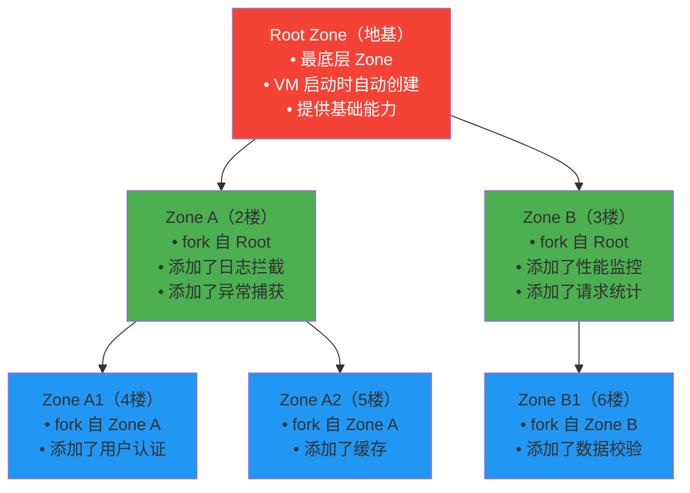
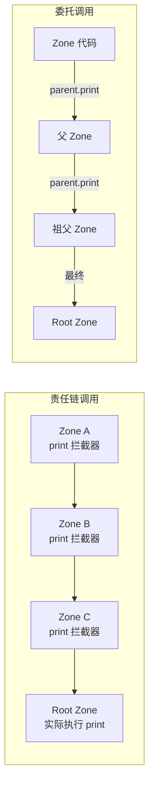
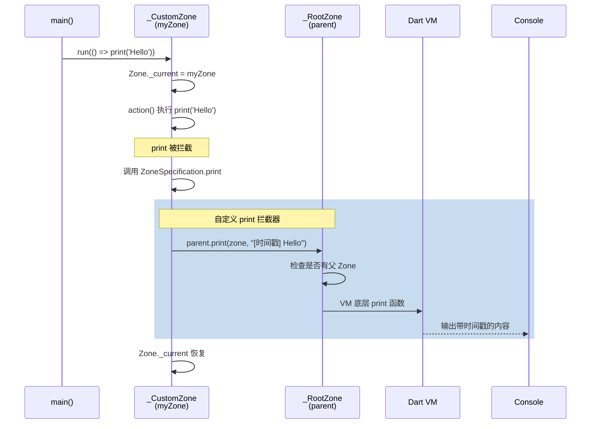
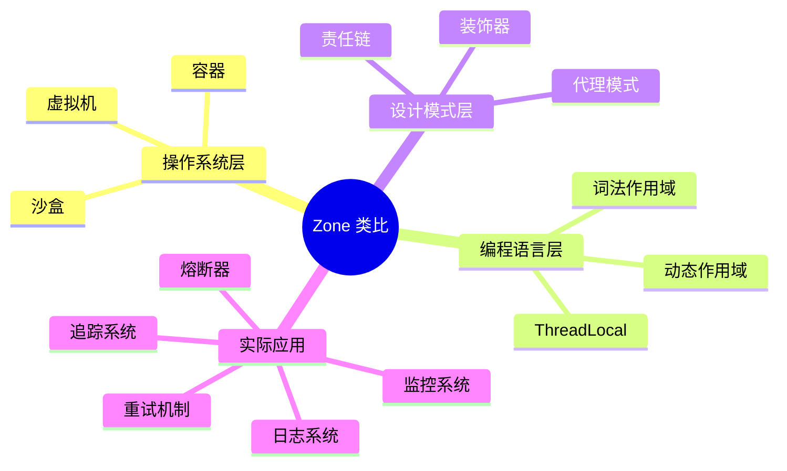

# Zone 完全解析：Dart 的异步沙盒

## 一、Zone 是什么？—— 用比喻理解

### 1.1 Zone 的本质：异步执行环境的"分层容器"

**比喻：Zone 就像一栋大楼的楼层管理系统**

想象一栋大楼（Dart 程序），每一层楼（Zone）都有自己的：
- **设施**：可以拦截和修改该层发生的所有事件
- **隔音**：层与层之间相互隔离，不会互相干扰
- **继承**：高层可以继承低层的设施，也可以覆盖



**每一层（Zone）都可以做的事**：
1. **拦截操作**：当该层内有人（代码）执行操作时，可以"监听到"
2. **修改操作**：在操作执行前后插入自定义逻辑
3. **存储数据**：在该层内存储一些变量，该层内的所有代码都能访问
4. **捕获错误**：捕获该层内所有异步错误

---

## 二、Zone 的核心设计模式

### 2.1 模式一：链式责任模式（Chain of Responsibility）

Zone 的设计核心是 **责任链**：当在某个 Zone 中执行操作时，可以逐层向上或向下传递。



### 2.2 模式二：装饰器模式（Decorator）

每个 Zone 可以"装饰"（增强）父 Zone 的行为：

```dart
// 父 Zone 提供基础能力
final parentZone = Zone.current;

// 子 Zone 在父 Zone 基础上增加功能
final childZone = parentZone.fork(
  specification: ZoneSpecification(
    print: (self, parent, zone, line) {
      // 增强：添加时间戳
      final timestamp = DateTime.now().toIso8601String();
      parent.print(zone, "[$timestamp] $line");  // 委托给父 Zone 执行
    },
  ),
);
```

### 2.3 模式三：沙盒模式（Sandbox）

Zone 提供了隔离的执行环境，类似浏览器中的 **iframe**：

```dart
// 在沙盒中运行代码
Zone.current.fork().run(() {
  // 这段代码运行在隔离的环境中
  print('Inside sandbox');
  // 如果抛出错误，只会影响当前 Zone
});
```

---

## 三、Zone 的完整源码实现

### 3.1 Zone 的类结构

```dart
// Zone 接口定义
abstract class Zone {
  // 静态属性：当前活跃的 Zone
  static Zone get current => _current;
  
  // Fork 新 Zone
  Zone fork({ZoneSpecification? specification, Map<Object?, Object?>? zoneValues});
  
  // 在当前 Zone 中运行代码
  R run<R>(R Function() action);
  
  // 创建 Timer（被 ZoneSpecification 拦截）
  Timer createTimer(Duration duration, void Function() callback);
  
  // 调度微任务
  void scheduleMicrotask(void Function() callback);
  
  // 注册错误处理
  void handleUncaughtError(Object error, StackTrace stackTrace);
  
  // 通过 key 获取 Zone 本地变量
  Object? operator [](Object? key);
}
```

### 3.2 _RootZone 的实现

**Root Zone** 是所有 Zone 的祖先，直接与 Dart VM 交互：

```dart
class _RootZone extends Zone {
  // Root Zone 直接调用 VM 底层函数
  @pragma('vm:entry-point')
  void _registerCallback(void Function() callback) native 'RegisterCallback';
  
  @override
  Timer createTimer(Duration duration, void Function() callback) {
    // 直接调用 C++ 层的定时器实现
    return _createTimer(duration, callback);
  }
  
  @override
  void scheduleMicrotask(void Function() callback) {
    // 调用 VM 的微任务调度
    _scheduleMicrotask(callback);
  }
  
  @override
  void handleUncaughtError(Object error, StackTrace stackTrace) {
    // 默认错误处理：打印到控制台
    print('Uncaught error: $error');
  }
  
  // 外部实现（C++）
  external static Timer _createTimer(Duration duration, void Function() f);
  external static void _scheduleMicrotask(void Function() f);
}
```

### 3.3 _CustomZone 的实现

**Custom Zone** 是通过 `fork` 创建的 Zone：

```dart
class _CustomZone extends Zone {
  final Zone _parent;
  final Map<Object?, Object?>? _zoneValues;
  final ZoneSpecification _specification;
  
  _CustomZone(this._parent, this._zoneValues, this._specification);
  
  @override
  Timer createTimer(Duration duration, void Function() callback) {
    final createTimerHandler = _specification.createTimer;
    
    if (createTimerHandler != null) {
      // 拦截：使用自定义的 createTimer
      return createTimerHandler(this, _parent, duration, callback);
    } else {
      // 未拦截：委托给父 Zone
      return _parent.createTimer(duration, callback);
    }
  }
  
  @override
  void scheduleMicrotask(void Function() callback) {
    final scheduleMicrotaskHandler = _specification.scheduleMicrotask;
    
    if (scheduleMicrotaskHandler != null) {
      scheduleMicrotaskHandler(this, _parent, callback);
    } else {
      _parent.scheduleMicrotask(callback);
    }
  }
  
  @override
  R run<R>(R Function() action) {
    // 保存旧的 Zone
    final previous = Zone._current;
    
    // 切换当前 Zone
    Zone._current = this;
    try {
      // 执行代码
      return action();
    } finally {
      // 恢复旧的 Zone
      Zone._current = previous;
    }
  }
  
  @override
  Object? operator [](Object? key) {
    if (_zoneValues != null && _zoneValues!.containsKey(key)) {
      return _zoneValues![key];
    }
    // 从父 Zone 查找
    return _parent[key];
  }
}
```

### 3.4 ZoneSpecification 的拦截器

```dart
class ZoneSpecification {
  // 拦截 print
  final void Function(Zone self, ZoneDelegate parent, Zone zone, String line)? print;
  
  // 拦截 Timer 创建
  final Timer Function(Zone self, ZoneDelegate parent, Zone zone, Duration duration, void Function() f)? createTimer;
  
  // 拦截微任务调度
  final void Function(Zone self, ZoneDelegate parent, Zone zone, void Function() f)? scheduleMicrotask;
  
  // 拦截代码执行
  final R Function<R>(Zone self, ZoneDelegate parent, Zone zone, R Function() f)? run;
  
  const ZoneSpecification({
    this.print,
    this.createTimer,
    this.scheduleMicrotask,
    this.run,
  });
}
```

### 3.5 ZoneDelegate 的作用

`ZoneDelegate` 是**父 Zone 的代理**，确保调用方始终能正确委托给父 Zone：

```dart
abstract class ZoneDelegate {
  // 委托给父 Zone 执行 print
  void print(Zone zone, String line);
  
  // 委托给父 Zone 创建 Timer
  Timer createTimer(Zone zone, Duration duration, void Function() callback);
  
  // 委托给父 Zone 调度微任务
  void scheduleMicrotask(Zone zone, void Function() callback);
  
  // 委托给父 Zone 运行代码
  R run<R>(Zone zone, R Function() f);
}
```

**为什么要用 ZoneDelegate？** 为了保证调用链正确，避免无限递归。

---

## 四、代码调用流程详解

### 4.1 场景：拦截 print 并添加时间戳

```dart
void main() {
  // 1. 创建自定义 Zone
  final myZone = Zone.current.fork(
    specification: ZoneSpecification(
      print: (self, parent, zone, line) {
        // 添加时间戳
        final timestamp = DateTime.now().toIso8601String();
        
        // 委托给父 Zone 执行实际的 print
        parent.print(zone, "[$timestamp] $line");
      },
    ),
  );
  
  // 2. 在自定义 Zone 中运行代码
  myZone.run(() {
    print('Hello, Zone!');
  });
}
```

### 4.2 详细的调用链追踪



### 4.3 完整的代码执行路径

```dart
// 第一步：Zone.current.fork()
Zone fork(ZoneSpecification spec) {
  return _CustomZone(Zone._current, spec, _current._values);
}

// 第二步：myZone.run()
R run<R>(R Function() action) {
  final previous = Zone._current;
  Zone._current = this;  // 切换上下文
  try {
    return action();  // 执行 action
  } finally {
    Zone._current = previous;  // 恢复上下文
  }
}

// 第三步：action 中执行 print('Hello')
void print(Object object) {
  // 注意：print 是全局函数，但内部会调用当前 Zone 的 print
  Zone.current.print(object.toString());
}

// 第四步：_CustomZone.print
void print(String line) {
  final printHandler = _specification.print;
  if (printHandler != null) {
    // 调用自定义拦截器
    printHandler(this, _parent, line);
  } else {
    // 委托给父 Zone
    _parent.print(line);
  }
}

// 第五步：自定义拦截器执行
void myPrintHandler(Zone self, ZoneDelegate parent, Zone zone, String line) {
  final timestamp = DateTime.now().toIso8601String();
  // 委托给父 Zone（Root Zone）
  parent.print(zone, "[$timestamp] $line");
}

// 第六步：_RootZone.print
void print(String line) {
  // 调用 VM 底层输出
  _printToConsole(line);
}
```

---

## 五、Zone 的高级应用场景

### 5.1 场景一：全局异步错误捕获

```dart
void main() {
  // 创建错误捕获 Zone
  final errorZone = Zone.current.fork(
    specification: ZoneSpecification(
      // 捕获所有未处理的异步错误
      handleUncaughtError: (self, parent, zone, error, stackTrace) {
        print('捕获到错误: $error');
        print('堆栈: $stackTrace');
        
        // 上报到错误监控系统
        reportToServer(error, stackTrace);
      },
    ),
  );
  
  errorZone.run(() {
    // 这个异步错误会被捕获
    Future.delayed(Duration(seconds: 1), () {
      throw Exception('异步错误');
    });
    
    // Timer 的错误也会被捕获
    Timer(Duration(seconds: 2), () {
      throw Exception('Timer 错误');
    });
  });
}
```

**实现原理**：
```dart
// _CustomZone 的 handleUncaughtError 实现
void handleUncaughtError(Object error, StackTrace stackTrace) {
  final handler = _specification.handleUncaughtError;
  
  if (handler != null) {
    handler(this, _parent, error, stackTrace);
  } else {
    // 委托给父 Zone
    _parent.handleUncaughtError(error, stackTrace);
  }
}

// 当异步代码抛出未捕获的错误时，VM 会调用当前 Zone 的这个方法
```

### 5.2 场景二：性能监控（拦截所有异步操作）

```dart
class PerformanceMonitor {
  final Map<String, List<int>> timings = {};
  
  Zone createMonitoringZone() {
    return Zone.current.fork(
      specification: ZoneSpecification(
        // 拦截代码执行
        run: <R>(self, parent, zone, f) {
          final start = DateTime.now().microsecondsSinceEpoch;
          final result = parent.run(zone, f);  // 执行原代码
          final end = DateTime.now().microsecondsSinceEpoch;
          
          final duration = end - start;
          final functionName = f.runtimeType.toString();
          timings.putIfAbsent(functionName, () => []).add(duration);
          
          return result;
        },
        
        // 拦截 Timer
        createTimer: (self, parent, zone, duration, callback) {
          final start = DateTime.now().microsecondsSinceEpoch;
          
          return parent.createTimer(zone, duration, () {
            final timerStart = DateTime.now().microsecondsSinceEpoch;
            callback();
            final timerEnd = DateTime.now().microsecondsSinceEpoch;
            
            final actualDelay = timerStart - start;
            print('Timer 实际延迟: ${actualDelay}μs, 期望延迟: ${duration.inMicroseconds}μs');
          });
        },
      ),
    );
  }
}

void main() {
  final monitor = PerformanceMonitor();
  final zone = monitor.createMonitoringZone();
  
  zone.run(() {
    // 监控这段代码的性能
    for (int i = 0; i < 1000; i++) {
      expensiveOperation();
    }
  });
  
  print(monitor.timings);  // 输出性能数据
}
```

### 5.3 场景三：日志链路追踪

```dart
class TraceContext {
  final String traceId;
  final String spanId;
  final Map<String, String> baggage;
  
  TraceContext(this.traceId, this.spanId, this.baggage);
}

Zone createTracedZone(TraceContext context) {
  return Zone.current.fork(
    zoneValues: {'traceContext': context},  // 存储追踪上下文
    specification: ZoneSpecification(
      print: (self, parent, zone, line) {
        // 自动为所有日志添加 traceId
        final ctx = zone['traceContext'] as TraceContext;
        parent.print(zone, "[Trace:${ctx.traceId}] $line");
      },
    ),
  );
}

void main() {
  final traceContext = TraceContext('abc123', 'span456', {});
  final zone = createTracedZone(traceContext);
  
  zone.run(() {
    // 在这个 Zone 中的所有 print 都会自动带上 traceId
    print('用户登录成功');  // 输出: [Trace:abc123] 用户登录成功
    
    // 异步代码也能继承上下文
    Future(() {
      print('处理登录回调');  // 输出: [Trace:abc123] 处理登录回调
    });
  });
}
```

### 5.4 场景四：请求限流与熔断

```dart
class CircuitBreaker {
  int failureCount = 0;
  final int threshold = 5;
  bool isOpen = false;
  DateTime? openTime;
  
  Zone createCircuitBreakerZone() {
    return Zone.current.fork(
      specification: ZoneSpecification(
        run: <R>(self, parent, zone, f) {
          if (isOpen) {
            if (openTime != null && 
                DateTime.now().difference(openTime!) > Duration(seconds: 30)) {
              // 半开状态，允许一个请求通过
              isOpen = false;
              failureCount = 0;
              print('熔断器半开，允许请求');
            } else {
              throw Exception('熔断器打开，请求被拒绝');
            }
          }
          
          try {
            final result = parent.run(zone, f);
            // 成功，重置失败计数
            failureCount = 0;
            return result;
          } catch (e) {
            failureCount++;
            if (failureCount >= threshold) {
              isOpen = true;
              openTime = DateTime.now();
              print('熔断器打开，失败次数: $failureCount');
            }
            rethrow;
          }
        },
      ),
    );
  }
}

void main() {
  final breaker = CircuitBreaker();
  final zone = breaker.createCircuitBreakerZone();
  
  for (int i = 0; i < 10; i++) {
    try {
      zone.run(() {
        // 模拟失败的请求
        if (DateTime.now().millisecond % 2 == 0) {
          throw Exception('请求失败');
        }
        print('请求成功');
      });
    } catch (e) {
      print(e);
    }
  }
}
```

### 5.5 场景五：自动重试机制

```dart
class RetryZone {
  static Zone create({
    int maxRetries = 3,
    Duration delay = Duration(seconds: 1),
  }) {
    return Zone.current.fork(
      specification: ZoneSpecification(
        run: <R>(self, parent, zone, f) {
          int attempts = 0;
          
          R Function() retryable = () {
            attempts++;
            try {
              return parent.run(zone, f);
            } catch (e) {
              if (attempts <= maxRetries) {
                print('第 $attempts 次失败，${delay.inSeconds}秒后重试...');
                sleep(delay);  // 注意：阻塞式 sleep，生产环境用 Timer
                return retryable();
              }
              rethrow;
            }
          };
          
          return retryable();
        },
      ),
    );
  }
}

void main() {
  final zone = RetryZone.create(maxRetries: 3, delay: Duration(milliseconds: 500));
  
  int attemptCount = 0;
  zone.run(() {
    attemptCount++;
    if (attemptCount < 3) {
      throw Exception('模拟失败');
    }
    print('第 $attemptCount 次成功！');
  });
}
```

---

## 六、Zone 与 Future 的底层关系

### 6.1 Future 回调如何绑定 Zone

```dart
// Future 的 then 方法源码简化
Future<R> then<R>(FutureOr<R> f(T value), {Function? onError}) {
  // 关键：捕获当前的 Zone
  final zone = Zone.current;
  
  _Future<R> result = _Future<R>();
  
  // 添加监听器时，同时保存 Zone
  _addListener(_FutureListener<T, R>.then(result, f, onError, zone));
  
  return result;
}

// 当 Future 完成时，回调会在捕获的 Zone 中执行
void _propagateToListeners() {
  final listeners = _resultOrListeners as _FutureListener?;
  
  while (listeners != null) {
    final zone = listeners._zone;
    
    // 在保存的 Zone 中执行回调
    zone.run(() {
      listeners._execute();  // 执行用户回调
    });
    
    listeners = listeners._nextListener;
  }
}
```

### 6.2 这个机制的意义

```dart
void main() {
  final zone = Zone.current.fork(
    zoneValues: {'userId': '12345'},
    specification: ZoneSpecification(
      print: (self, parent, zone, line) {
        final userId = zone['userId'];
        parent.print(zone, "[User:$userId] $line");
      },
    ),
  );
  
  zone.run(() {
    // Future 会自动"记住"创建时的 Zone
    Future(() {
      // 虽然 Future 回调是异步的，但这里仍然能访问 userId
      print('异步任务');  // 输出: [User:12345] 异步任务
    });
    
    // Timer 也一样
    Timer(Duration(seconds: 1), () {
      print('Timer 任务');  // 输出: [User:12345] Timer 任务
    });
  });
}
```

---

## 七、Zone 的性能考虑

### 7.1 性能影响

```dart
// 性能测试
void testPerformance() {
  // 无 Zone
  final start1 = DateTime.now();
  for (int i = 0; i < 100000; i++) {
    print('test');
  }
  final duration1 = DateTime.now().difference(start1);
  
  // 有自定义 Zone
  final zone = Zone.current.fork(
    specification: ZoneSpecification(
      print: (self, parent, zone, line) {
        parent.print(zone, line);
      },
    ),
  );
  
  final start2 = DateTime.now();
  zone.run(() {
    for (int i = 0; i < 100000; i++) {
      print('test');
    }
  });
  final duration2 = DateTime.now().difference(start2);
  
  print('无 Zone: $duration1');
  print('有 Zone: $duration2');  // 通常慢 10-30%
}
```

### 7.2 优化建议

| 场景 | 建议 |
|------|------|
| 高频操作（每秒 > 10000 次） | 避免在 Zone 中执行 |
| 创建大量 Zone | Zone 本身很轻量，但频繁 fork 有开销 |
| Zone 嵌套深度 | 每层委托有性能损耗，避免过深（通常 < 10 层） |
| 大型应用 | 使用少量 Zone（每个模块一个） |

---

## 八、总结：Zone 的设计哲学

### 8.1 Zone 解决了什么问题

| 问题 | 传统方案 | Zone 方案 |
|------|---------|----------|
| 异步错误捕获 | try-catch 无效 | Zone 自动捕获 |
| 日志统一格式化 | 手动修改每个 print | 拦截 print 统一处理 |
| 性能监控 | 侵入式埋点 | 非侵入式拦截 |
| 上下文传递 | 显式传递参数 | Zone 本地变量隐式传递 |

### 8.2 核心设计原则

1. **无侵入性**：不需要修改现有代码即可增强功能
2. **可组合性**：Zone 可以多层嵌套，每层添加不同功能
3. **透明委托**：拦截器可以选择委托给父 Zone 或自己处理
4. **错误隔离**：一个 Zone 的错误不影响其他 Zone
5. **自动继承**：异步操作自动继承创建时的 Zone

### 8.3 类比总结



**一句话总结**：Zone 是 Dart 为异步代码提供的**动态作用域容器**，它让异步编程拥有了类似同步代码的上下文管理能力，同时提供了非侵入式的行为拦截和增强机制。


## Zone用于请求链路追踪示例

```dart
import 'dart:async';

/// 追踪上下文
class TraceContext {
  final String traceId;
  final String? spanId;
  final DateTime startTime;
  
  TraceContext(this.traceId, {this.spanId, DateTime? startTime})
      : startTime = startTime ?? DateTime.now();
  
  /// 创建子 span
  TraceContext createChildSpan(String name) {
    return TraceContext(
      traceId,
      spanId: '$traceId:$name',
      startTime: DateTime.now(),
    );
  }
  
  @override
  String toString() => 'TraceContext(traceId: $traceId, spanId: $spanId)';
}

/// 创建带追踪功能的 Zone
Zone createTracedZone(TraceContext context) {
  return Zone.current.fork(
    zoneValues: {'traceContext': context},
    specification: ZoneSpecification(
      // 拦截 print 日志，自动添加 traceId
      print: (self, parent, zone, line) {
        final ctx = zone['traceContext'] as TraceContext;
        final timestamp = DateTime.now().toIso8601String();
        parent.print(zone, '[${timestamp}] [Trace:${ctx.traceId}] $line');
      },
      
      // 拦截异步调度，确保 trace 上下文传递
      scheduleMicrotask: (self, parent, zone, f) {
        final ctx = zone['traceContext'] as TraceContext;
        parent.scheduleMicrotask(() {
          // 在微任务中恢复 trace 上下文
          Zone.current.fork(zoneValues: {'traceContext': ctx}).run(f);
        });
      },
      
      // 拦截 Timer 创建
      createTimer: (self, parent, zone, duration, f) {
        final ctx = zone['traceContext'] as TraceContext;
        return parent.createTimer(duration, () {
          Zone.current.fork(zoneValues: {'traceContext': ctx}).run(f);
        });
      },
      
      // 拦截周期性 Timer
      createPeriodicTimer: (self, parent, zone, duration, f) {
        final ctx = zone['traceContext'] as TraceContext;
        return parent.createPeriodicTimer(duration, (timer) {
          Zone.current.fork(zoneValues: {'traceContext': ctx}).run(() => f(timer));
        });
      },
      
      // 拦截 Future 的 then 回调
      runUnary: (self, parent, zone, f, arg) {
        // 保留当前 trace 上下文
        final ctx = zone['traceContext'] as TraceContext;
        return parent.runUnary(
          (arg) => Zone.current.fork(zoneValues: {'traceContext': ctx}).run(() => f(arg)),
          arg,
        );
      },
      
      runBinary: (self, parent, zone, f, arg1, arg2) {
        final ctx = zone['traceContext'] as TraceContext;
        return parent.runBinary(
          (arg1, arg2) => Zone.current.fork(zoneValues: {'traceContext': ctx}).run(() => f(arg1, arg2)),
          arg1,
          arg2,
        );
      },
      
      // 错误处理拦截
      handleUncaughtError: (self, parent, zone, error, stackTrace) {
        final ctx = zone['traceContext'] as TraceContext;
        print('[ERROR] Trace:${ctx.traceId} - $error\n$stackTrace');
        parent.handleUncaughtError(zone, error, stackTrace);
      },
    ),
  );
}

/// 获取当前 zone 的 trace 上下文
TraceContext getCurrentTraceContext() {
  final ctx = Zone.current['traceContext'];
  if (ctx == null) {
    throw StateError('No trace context found in current zone');
  }
  return ctx as TraceContext;
}

/// 模拟服务 A
class ServiceA {
  Future<String> call() async {
    final ctx = getCurrentTraceContext();
    print('ServiceA.call() 执行中...');
    
    // 模拟异步操作
    await Future.delayed(Duration(milliseconds: 100));
    
    print('ServiceA 完成');
    return 'ServiceA result for ${ctx.traceId}';
  }
}

/// 模拟服务 B
class ServiceB {
  Future<String> call() async {
    final ctx = getCurrentTraceContext();
    print('ServiceB.call() 执行中...');
    
    // 模拟异步操作
    await Future.delayed(Duration(milliseconds: 150));
    
    print('ServiceB 完成');
    return 'ServiceB result for ${ctx.traceId}';
  }
}

/// 模拟数据库操作
class DatabaseService {
  Future<void> query(String sql) async {
    final ctx = getCurrentTraceContext();
    print('执行 SQL: $sql');
    
    // 创建子 span 追踪数据库操作
    final dbCtx = ctx.createChildSpan('database');
    final tracedZone = createTracedZone(dbCtx);
    
    await tracedZone.run(() async {
      await Future.delayed(Duration(milliseconds: 80));
      print('数据库查询完成，耗时: ${DateTime.now().difference(dbCtx.startTime).inMilliseconds}ms');
    });
  }
}

/// 请求处理器
class RequestHandler {
  final ServiceA serviceA = ServiceA();
  final ServiceB serviceB = ServiceB();
  final DatabaseService database = DatabaseService();
  
  void handleRequest(Request req) async {
    // 创建追踪上下文
    final traceContext = TraceContext(req.traceId);
    final tracedZone = createTracedZone(traceContext);
    
    print('\n========== 开始处理请求 ${req.id} ==========');
    print('TraceId: ${traceContext.traceId}');
    print('开始时间: ${traceContext.startTime}');
    
    // 在追踪 zone 中执行所有操作
    await tracedZone.run(() async {
      print('请求参数: ${req.params}');
      
      // 调用服务 A（自动携带 traceId）
      final resultA = await serviceA.call();
      print('服务A 返回: $resultA');
      
      // 调用服务 B
      final resultB = await serviceB.call();
      print('服务B 返回: $resultB');
      
      // 数据库操作
      await database.query('SELECT * FROM users WHERE id = ${req.params['userId']}');
      
      // 异步延迟任务（自动携带 traceId）
      await Future.delayed(Duration(milliseconds: 50), () {
        print('延迟任务执行完成');
      });
      
      // 创建微任务（自动携带 traceId）
      scheduleMicrotask(() {
        print('微任务执行，仍然携带 traceId');
      });
      
      // 启动 Timer（自动携带 traceId）
      Timer(Duration(milliseconds: 30), () {
        print('Timer 回调执行，traceId 仍然存在');
      });
      
      print('所有业务处理完成');
    });
    
    print('========== 请求处理完成 ==========\n');
  }
}

/// 请求模型
class Request {
  final String id;
  final String traceId;
  final Map<String, dynamic> params;
  
  Request({required this.id, required this.traceId, required this.params});
}

/// 测试并发请求
void testConcurrentRequests() {
  print('\n========== 测试并发请求 ==========\n');
  
  final handler = RequestHandler();
  
  // 同时处理多个请求，每个都有独立的 traceId
  handler.handleRequest(Request(
    id: '1',
    traceId: 'trace-abc-001',
    params: {'userId': 1001},
  ));
  
  handler.handleRequest(Request(
    id: '2',
    traceId: 'trace-def-002',
    params: {'userId': 1002},
  ));
  
  handler.handleRequest(Request(
    id: '3',
    traceId: 'trace-ghi-003',
    params: {'userId': 1003},
  ));
}

/// 测试异步错误捕获
void testErrorHandling() {
  print('\n========== 测试错误处理 ==========\n');
  
  final traceContext = TraceContext('error-test-trace');
  final tracedZone = createTracedZone(traceContext);
  
  tracedZone.run(() async {
    print('开始执行可能出错的代码');
    
    // 模拟异步错误
    await Future.delayed(Duration(milliseconds: 10));
    
    throw Exception('Something went wrong in service');
  }).catchError((error) {
    print('捕获到错误（已在 zone 中记录日志）');
  });
}

/// 主函数
void main() async {
  print('========== 分布式追踪系统演示 ==========\n');
  
  // 测试单个请求
  final handler = RequestHandler();
  await handler.handleRequest(Request(
    id: 'main',
    traceId: 'trace-main-001',
    params: {'userId': 888, 'action': 'test'},
  ));
  
  // 等待异步操作完成
  await Future.delayed(Duration(seconds: 1));
  
  // 测试并发请求
  testConcurrentRequests();
  
  // 等待并发请求完成
  await Future.delayed(Duration(seconds: 2));
  
  // 测试错误处理
  testErrorHandling();
  
  await Future.delayed(Duration(seconds: 1));
  print('\n========== 演示结束 ==========');
}
```

## 运行效果示例

```
========== 分布式追踪系统演示 ==========

========== 开始处理请求 main ==========
TraceId: trace-main-001
开始时间: 2026-01-15 10:30:00.123
[2026-01-15T10:30:00.124] [Trace:trace-main-001] 请求参数: {userId: 888, action: test}
[2026-01-15T10:30:00.125] [Trace:trace-main-001] ServiceA.call() 执行中...
[2026-01-15T10:30:00.226] [Trace:trace-main-001] ServiceA 完成
[2026-01-15T10:30:00.227] [Trace:trace-main-001] 服务A 返回: ServiceA result for trace-main-001
[2026-01-15T10:30:00.228] [Trace:trace-main-001] ServiceB.call() 执行中...
[2026-01-15T10:30:00.379] [Trace:trace-main-001] ServiceB 完成
[2026-01-15T10:30:00.380] [Trace:trace-main-001] 服务B 返回: ServiceB result for trace-main-001
[2026-01-15T10:30:00.381] [Trace:trace-main-001] 执行 SQL: SELECT * FROM users WHERE id = 888
[2026-01-15T10:30:00.462] [Trace:trace-main-001:database] 数据库查询完成，耗时: 81ms
[2026-01-15T10:30:00.513] [Trace:trace-main-001] 延迟任务执行完成
[2026-01-15T10:30:00.514] [Trace:trace-main-001] 微任务执行，仍然携带 traceId
[2026-01-15T10:30:00.545] [Trace:trace-main-001] Timer 回调执行，traceId 仍然存在
[2026-01-15T10:30:00.546] [Trace:trace-main-001] 所有业务处理完成
========== 请求处理完成 ==========
```

## 关键要点说明

1. **zoneValues 自动传递**：所有子 zone 都能自动继承父 zone 的 `zoneValues`

2. **异步操作拦截**：通过 ZoneSpecification 拦截所有异步操作，确保 trace 上下文传递

3. **独立 traceId**：每个请求有独立的 traceId，并发请求不会混淆

4. **错误追踪**：自动记录带 traceId 的错误日志

5. **子 span 支持**：可以创建子 span 追踪更细粒度的操作（如数据库查询）

这个实现展示了一个完整的分布式追踪系统原型，可以直接运行测试！