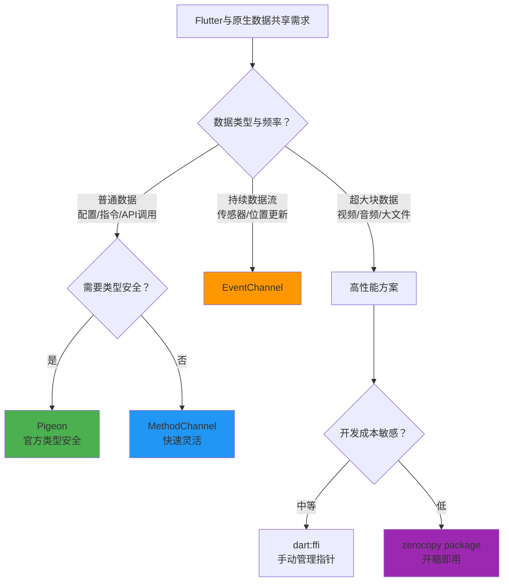
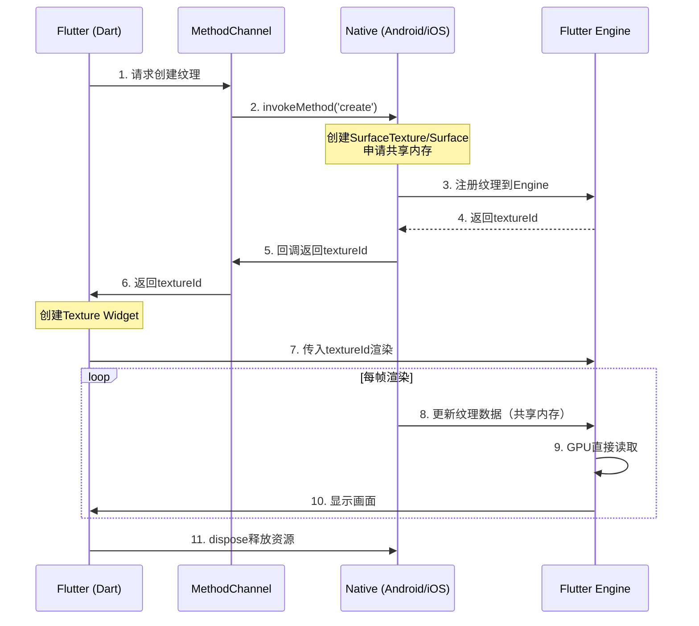
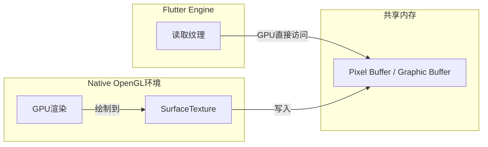
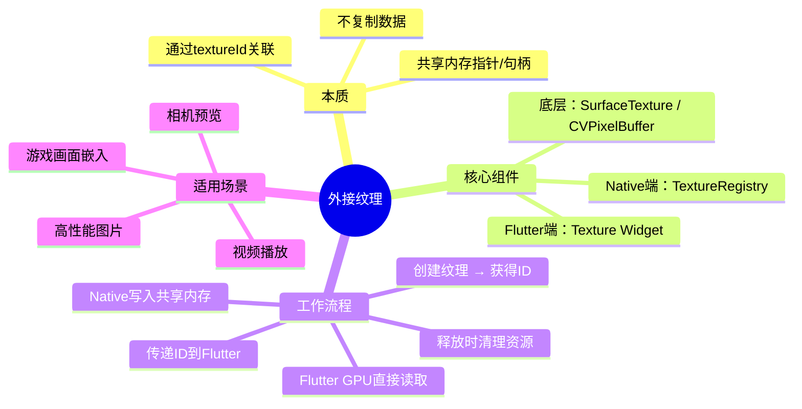

既然 Isolate 之间无法共享内存，那 Flutter 和原生（Native）之间的数据共享，走的完全是另一套思路：**基于消息传递的通道机制**。

简单来说，Dart 侧和 Native 侧有各自独立的内存空间，它们不共享内存，而是通过复制数据来进行通信。Flutter 官方为此提供了一套非常成熟的解决方案——**Platform Channels**。

### 💡 核心方案：Platform Channels (官方标准)

这是 Flutter 与原生通信的基石，可以把它想象成一个"跨语言的异步 RPC 管道"。Flutter 提供了三种不同类型的 Channel，以满足不同的通信需求：

| 类型 | 通信模式 | 适用场景 | 特点 |
| :--- | :--- | :--- | :--- |
| **MethodChannel** | 请求-响应 (单次) | 调用原生方法获取结果，如获取电池电量、打开相机等。 | 最常用，一次性调用，返回结果或错误。 |
| **BasicMessageChannel** | 消息传递 (单次) | 传递字符串或自定义数据结构。 | 用于更灵活的消息传递，编码器可自定义。 |
| **EventChannel** | 数据流 (持续) | 接收原生端的持续事件流，如传感器数据、位置更新等。 | Native 作为生产者，Flutter 作为消费者，单向数据流。 |

这个机制的核心工作流程是这样的：
1.  **Flutter 发起调用**：Dart 端通过一个约定的 Channel 名称和调用方法，向 Native 发送请求，得到一个 `Future` 对象。
2.  **Native 接收并处理**：原生端（Android/Kotlin 或 iOS/Swift）通过监听同一个 Channel，收到请求后执行具体逻辑（比如调用系统 API）。
3.  **Native 返回结果**：原生端将处理结果通过 `Result` 回调返回。
4.  **Flutter 接收结果**：Dart 端的 `Future` 变为完成状态，获得返回的数据并更新 UI。

---

### 🚀 方案演进：从原始通道到类型安全

直接使用 `MethodChannel` 虽然灵活，但需要手动处理字符串类型的方法名和参数，容易出错且不利于维护。为了解决这个问题，官方和社区推动了进一步的演进：

#### 1. Pigeon (官方推荐)
Pigeon 是一个代码生成器。你只需定义一套 Dart 形式的接口声明，它会自动为你生成 Dart、Java、Kotlin 或 Objective-C 的**类型安全**的代码。

*   **优势**：编译时即可发现接口不匹配的问题，告别手写字符串和方法名，开发体验和代码健壮性都大大提升。

#### 2. package:platform_bridge / bridge_native
这是社区基于 Pigeon 和 Platform Channel 封装的高级工具，提供了更便捷的 API。

*   `platform_bridge` 提供了一套简洁的 `sendToNative` / `listenFromNative` API，让双向通信写起来更简单。
*   `bridge_native` 则更进一步，它集成了 Pigeon 生成的类型安全代码，并封装了 `Native` Widget 来方便接收原生事件，大大简化了集成流程。

---

### ⚡️ 高性能场景：如何实现"零拷贝"？

在多 Isolate 的讨论下，你可能会想到：如果必须传输大量数据（比如相机流），Platform Channel 的"复制"行为岂不会导致性能问题？

确实，Platform Channel 默认的 `StandardMessageCodec` 会对数据进行序列化和拷贝。但这不代表 Flutter 没有优化的办法。对于极致性能的场景，正确的思路不是共享内存，而是直接共享内存的**引用**：

#### **方案一：使用 `dart:ffi` (Foreign Function Interface)**
FFI 允许 Dart 代码直接调用 C 风格的 Native API，并且可以在 Dart 中直接操作 Native 内存的指针（Pointer）。

*   **实现方式**：Native 端分配一块内存，将内存地址（作为整数）传递给 Dart。Dart 端接收到地址后，可以使用 `Pointer.asTypedList` 方法直接操作这块内存，**全程无拷贝**。

#### **方案二：使用 `package:zerocopy`**
这是基于 FFI 思想的一个高级封装库。它通过 C++ 分配一块 SIMD 对齐的共享内存，并用一个原子自旋锁来处理并发访问问题，将 FFI 的能力封装成了更易用的 Flutter API。

**性能数据**：根据其官方基准测试，对于 10MB 的数据传输：
*   `MethodChannel` 方式总延迟约 4200ms，且会导致严重卡顿。
*   `ZeroCopy` 方式总延迟**低于 10ms**，且完全没有 GC 压力。

---

### 📝 如何选择：方案决策树

你可以根据具体场景，参考下面的决策树来选择最合适的方案：



### 💎 总结

总的来说，Flutter 与原生之间的数据共享遵循着一个清晰的思路：

1.  **首选官方通道**：对于绝大多数业务需求，使用 `MethodChannel` 或 `Pigeon` 是最佳实践。它们稳定、成熟，能满足 90% 以上的场景。
2.  **流式数据用 EventChannel**：对于持续产生的数据，使用 `EventChannel` 让 Native 作为生产者。
3.  **极致性能走 FFI**：当遇到高频、大块的数据传输时，跳出通道的"复制"模型，通过 FFI 直接操作 Native 内存才是正道。

你目前在开发中需要共享的是哪一类数据？如果是图片、视频流这类高频数据，告诉我具体场景，我可以帮你分析实现"零拷贝"的最佳路径。

## 一、内存共享之外接纹理

想象一下：你有一个**巨大的动态画面**（比如一段4K视频），如果每次都要把这个画面"复制"一份从原生端送到Flutter端，内存和性能都会崩掉。

**外接纹理的解决思路**：不复制，而是"开一扇窗"。原生端把画面渲染到一块GPU共享内存上，Flutter端通过一个ID找到这扇"窗户"，直接看到画面。

这个"窗户"，就是Flutter的 **Texture Widget**；而那个用来找窗户的ID，就是 **textureId**。

---

## 二、核心工作流程

整个流程可以概括为：**原生创建 → ID传递 → Flutter渲染 → 资源释放**。




---

## 三、两端实现详解

### 3.1 Flutter端实现

Flutter端代码**极其简单**，核心就是一个Widget：

```dart
// 1. 创建纹理（通过Channel调用原生）
Future<int> _createTexture() async {
  final result = await _channel.invokeMethod('create');
  return result['textureId'];  // 拿到原生返回的ID
}

// 2. 构建UI时使用Texture Widget
@override
Widget build(BuildContext context) {
  return _textureId != null
      ? Texture(textureId: _textureId!)  // 🔑 核心：就这一行
      : Container(color: Colors.black);
}

// 3. 释放纹理
void dispose() {
  _channel.invokeMethod('dispose', {'textureId': _textureId});
  super.dispose();
}
```

`Texture` 是一个 `LeafRenderObjectWidget`，它不包含任何子Widget，只负责渲染一个来自外部的纹理。

### 3.2 Android端实现

Android端通过 `TextureRegistry` 来创建和管理纹理：

```kotlin
class TexturePlugin : FlutterPlugin, MethodCallHandler {
    private lateinit var textureRegistry: TextureRegistry
    private val textureEntries = mutableMapOf<Long, TextureRegistry.SurfaceTextureEntry>()
    
    override fun onAttachedToEngine(binding: FlutterPlugin.FlutterPluginBinding) {
        textureRegistry = binding.textureRegistry  // 获取纹理注册器
        // ... 注册MethodChannel
    }
    
    override fun onMethodCall(call: MethodCall, result: Result) {
        when (call.method) {
            "create" -> {
                // 1. 创建SurfaceTextureEntry（同时分配共享内存）
                val entry = textureRegistry.createSurfaceTexture()
                val textureId = entry.id()
                
                // 2. 保存引用，防止被GC
                textureEntries[textureId] = entry
                
                // 3. 返回textureId给Flutter
                result.success(mapOf("textureId" to textureId))
            }
            
            "render" -> {
                val textureId = call.argument<Long>("textureId")!!
                val url = call.argument<String>("url")!!
                val entry = textureEntries[textureId]
                
                // 使用Glide等库加载图片/视频帧
                Glide.with(context).load(url).into(object : CustomTarget<Bitmap>() {
                    override fun onResourceReady(bitmap: Bitmap, transition: Transition<in Bitmap>?) {
                        // 获取Surface并绘制
                        val surface = Surface(entry.surfaceTexture())
                        val canvas = surface.lockCanvas(null)
                        canvas.drawBitmap(bitmap, 0f, 0f, null)
                        surface.unlockCanvasAndPost(canvas)
                        // 通知Flutter端刷新
                    }
                })
            }
        }
    }
}
```

**关键点**：
- `textureRegistry.createSurfaceTexture()` 是官方提供的API，内部会创建 `SurfaceTexture` 并注册到Flutter Engine
- 返回的 `SurfaceTextureEntry` 持有 `surfaceTexture()` 方法，可以得到一个 `SurfaceTexture`，进而创建 `Surface` 和 `Canvas` 进行绘制

---

## 四、底层原理：共享内存的两种实现

外接纹理的底层有两条技术路线，取决于你的需求和平台：

### 4.1 Android：SurfaceTexture + 共享内存

Android平台的标准方案是使用 `SurfaceTexture`：



**关键机制**：
- `SurfaceTexture` 内部关联了一块 **Graphic Buffer**，这是GPU和CPU可以共享访问的内存
- Native侧的OpenGL渲染直接写入这块Buffer
- Flutter Engine通过 `textureId` 找到这块Buffer，GPU直接读取进行渲染
- **整个过程没有内存拷贝**，只是传递了一个"句柄"

### 4.2 iOS/macOS：CVPixelBuffer + IOSurface

iOS平台对应的机制是 `CVPixelBuffer` 配合 `IOSurface`：

```objective-c
// 创建支持共享内存的CVPixelBuffer
CVPixelBufferCreate(kCFAllocatorDefault, 
    width, height,
    kCVPixelFormatType_32BGRA,
    (__bridge CFDictionaryRef)@{
        (__bridge NSString*)kCVPixelBufferIOSurfacePropertiesKey: @{}
    },
    &pixelBuffer
);

// 映射为OpenGL纹理
CVOpenGLESTextureCacheCreateTextureFromImage(..., pixelBuffer, ..., &texture);

// Flutter Engine通过copyPixelBuffer获取
- (CVPixelBufferRef)copyPixelBuffer {
    return _pixelBuffer;  // 返回同一个buffer，不拷贝
}
```

**iOS上的核心API**：
- `CVPixelBufferCreate` 设置 `kCVPixelBufferIOSurfacePropertiesKey` 时，底层会创建 `IOSurface`，这是iOS/iPadOS/macOS上跨进程共享内存的标准机制
- Flutter Engine的 `copyPixelBuffer` 方法返回的是同一个 `CVPixelBuffer` 的引用，而不是拷贝

> **性能关键**：闲鱼团队实测，如果不用共享内存，每帧需要经历 `GPU → CPU → GPU` 的转换，对60fps的实时渲染是不可接受的；而使用共享内存方案，帧率可以达到满帧。

---

## 五、应用场景

### 5.1 视频播放（最经典）

```dart
// 使用video_player插件
VideoPlayerController controller = VideoPlayerController.network(url);
await controller.initialize();
// 内部就是通过Texture实现的
Texture(textureId: controller.textureId)
```


### 5.2 相机预览

相机采集的每一帧（30-60fps）都直接写入共享内存，Flutter Texture直接渲染，无需经过Channel传递。

### 5.3 高性能图片加载

闲鱼团队将图片加载从 `Image.network` 改为外接纹理方案后，内存占用显著降低：

| 方案 | 内存占用（20张图） | 特点 |
|------|-------------------|------|
| 原生Image.network | 高（每个图片独立解码） | 图片数据在Dart堆中 |
| 外接纹理方案 | 低（共享同一块内存） | 图片数据在共享内存中 |


### 5.4 游戏画面嵌入

可以将Unity、Cocos2d等游戏引擎的画面作为纹理嵌入Flutter页面。

---

## 六、两种技术路线对比

根据你对接的第三方渲染框架，有两种底层实现选择：

| 方案 | 原理 | 适用场景 | 优缺点 |
|------|------|---------|--------|
| **共享EGLContext** | 让Flutter和Native共享同一个OpenGL上下文 | 双方有大量交互，需要频繁互相调用 | 性能好，但对第三方框架侵入大，Flutter升级时需修改Engine源码 |
| **共享内存（推荐）** | 通过SurfaceTexture/CVPixelBuffer共享Buffer | Native独立渲染，只需输出画面给Flutter | 无侵入，不暴露Flutter内部，官方推荐方式 |

闲鱼团队早期尝试了方案一（修改Engine源码实现ShareContext），但后来认为这是"错误的姿势"，因为：
- 每次Flutter升级都要痛苦的merge代码
- 可能误操作Flutter渲染环境，增加Bug风险
- 性能上与共享内存方案基本一致

**正确的做法**：使用官方的 `TextureRegistry` + `SurfaceTexture`（Android）或 `CVPixelBuffer`（iOS）方案。

---

## 七、总结



**一句话总结**：外接纹理是Flutter为高性能音视频渲染设计的机制，通过共享内存实现原生与Flutter之间的零拷贝数据传输，核心只需一个 `Texture` Widget 和一个 `textureId`。

---

你是准备在项目中接入视频播放、相机预览，还是想做高性能图片加载？告诉我具体场景，我可以给出更针对性的代码示例。