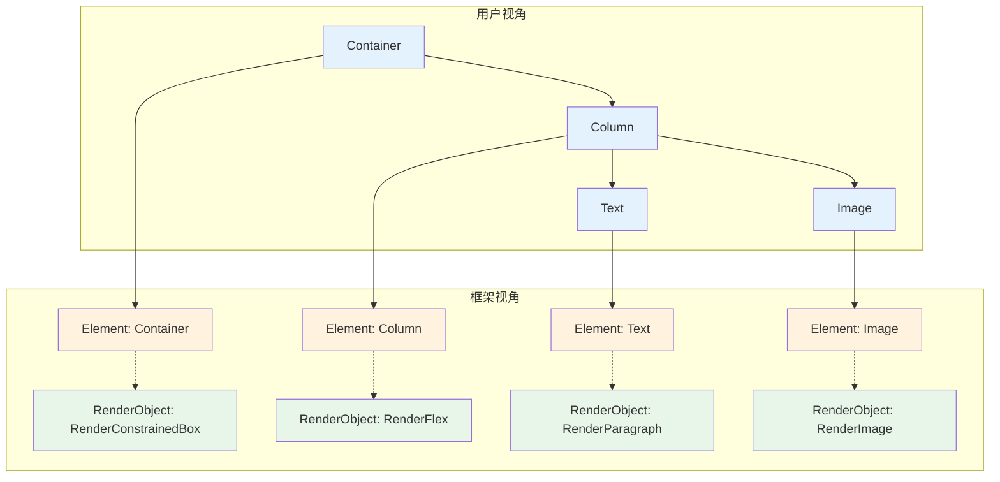
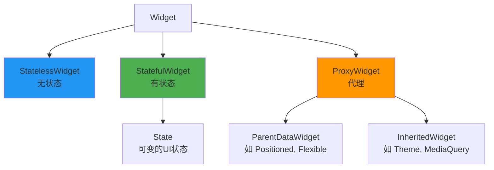
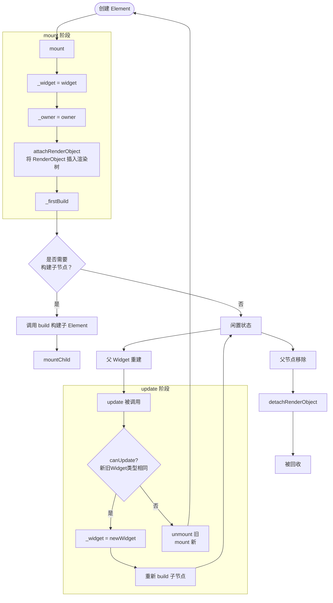
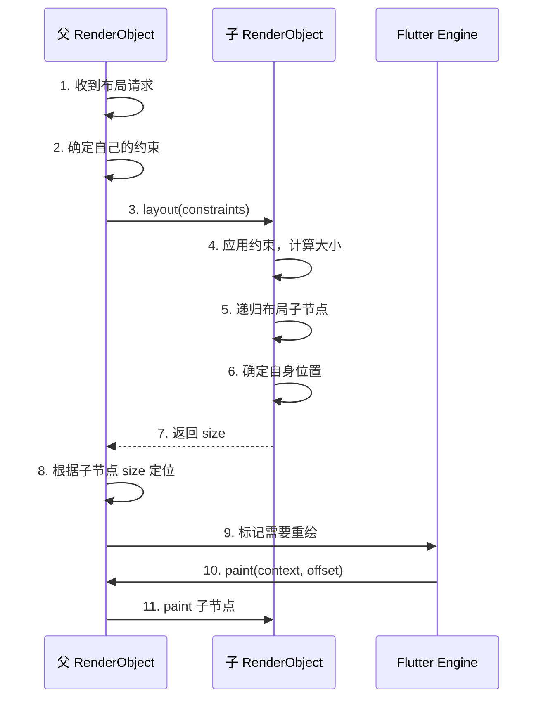
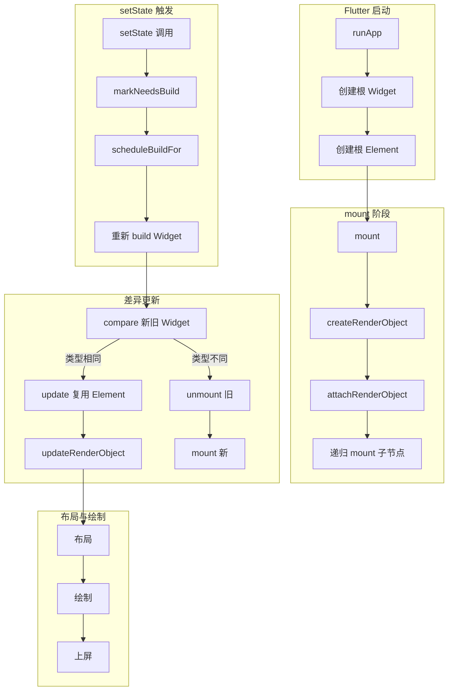
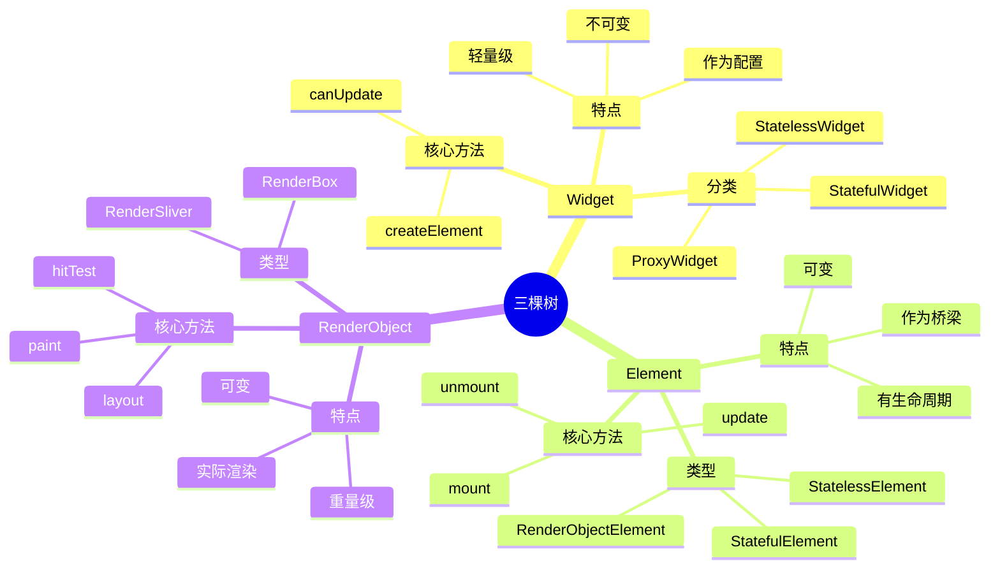

## Flutter 三棵树核心机制完全解析

Flutter 的三棵树是其渲染性能的核心，也是理解 Flutter 工作原理的关键。这三棵树分别是：**Widget 树**、**Element 树** 和 **RenderObject 树**。

---

## 一、三棵树概述与比喻

### 1.1 形象的比喻

把 Flutter 的 UI 构建想象成**盖房子**：

| 角色             | 对应概念 | 比喻                                                 |
| ---------------- | -------- | ---------------------------------------------------- |
| **Widget**       | 建筑图纸 | 描述房子长什么样，轻量、可丢弃、可随时重新生成       |
| **Element**      | 施工队伍 | 拿着图纸去施工，负责协调，有状态、可复用             |
| **RenderObject** | 实际建材 | 真正的墙体、地板，负责布局和绘制，重成本、尽量少改动 |

### 1.2 核心关系图



**关键理解**：
- Widget 是**配置信息**，非常轻量，重建成本极低
- Element 是**粘合剂**，连接 Widget 和 RenderObject，有生命周期
- RenderObject 是**实际渲染单元**，负责布局和绘制，重建成本高

---

## 二、Widget：不可变的配置蓝图

### 2.1 Widget 的本质

Widget 的核心就是四个字：**配置描述**。它是一个 `@immutable` 的类，意味着创建后就不能改变。

```dart
@immutable
abstract class Widget {
  // 核心方法：创建 Element
  Element createElement();
  
  // 调试信息
  static bool canUpdate(Widget oldWidget, Widget newWidget) {
    return oldWidget.runtimeType == newWidget.runtimeType 
        && oldWidget.key == newWidget.key;
  }
}
```

### 2.2 Widget 的分类

Flutter 的 Widget 分为三大类，每一类有明确的职责：



### 2.3 为什么 Widget 要设计为不可变？

这是 Flutter 性能优化的关键设计。**不可变 + 声明式 = 高效的差异算法**：

```dart
// 每次 setState 都会重新执行 build()
@override
Widget build(BuildContext context) {
  // 每次都是全新的 Widget 对象
  return Container(
    color: Colors.blue,
    child: Text('Counter: $_counter'),
  );
}

// Flutter 内部会对比新旧 Widget 树：
// - 如果 Widget 类型相同且 key 相同 → 复用 Element 和 RenderObject
// - 否则 → 销毁旧的，创建新的
```

**性能优势**：
- 创建 1000 个 Widget 对象只需要几毫秒（因为只是轻量配置）
- 不需要手动管理 Widget 的生命周期和更新
- 差异算法（`canUpdate`）只需要比较 `runtimeType` 和 `key`

---

## 三、Element：可变且持久的粘合剂

### 3.1 Element 的核心职责

Element 是连接 Widget（配置）和 RenderObject（渲染）的桥梁，它有三大核心职责：

1. **管理生命周期**：mount、update、unmount
2. **维护 RenderObject**：持有并管理 RenderObject
3. **处理差异更新**：比较新旧 Widget 决定如何更新

```dart
abstract class Element {
  Widget? _widget;           // 当前对应的 Widget
  BuildOwner? _owner;        // 管理所有 Element 的调度器
  Element? _parent;          // 父节点
  List<Element>? _children;  // 子节点列表
  
  RenderObject? get renderObject => _renderObject;
  
  // 核心方法
  void mount(Element? parent, Object? newSlot);
  void update(covariant Widget newWidget);
  void unmount();
}
```

### 3.2 Element 的类型

| Element 类型          | 对应 Widget          | 特点                                 |
| --------------------- | -------------------- | ------------------------------------ |
| `StatelessElement`    | `StatelessWidget`    | 直接持有 Widget，build 时调用        |
| `StatefulElement`     | `StatefulWidget`     | 持有 State 对象，管理 State 生命周期 |
| `ComponentElement`    | 组合类 Widget        | 不直接产生 RenderObject，有子节点    |
| `RenderObjectElement` | `RenderObjectWidget` | 直接创建 RenderObject                |

### 3.3 Element 的生命周期详解



### 3.4 StatefulElement 的特殊之处

```dart
class StatefulElement extends ComponentElement {
  State<StatefulWidget> get state => _state!;
  State<StatefulWidget>? _state;
  
  @override
  void mount(Element? parent, Object? newSlot) {
    // 1. 创建 State 对象
    _state = widget.createState();
    
    // 2. 绑定 context（就是 Element 自身）
    _state._element = this;
    
    // 3. 调用 initState
    _state.initState();
    
    super.mount(parent, newSlot);
  }
  
  @override
  void unmount() {
    // 调用 dispose
    _state.dispose();
    super.unmount();
  }
  
  // setState 的底层实现
  void markNeedsBuild() {
    _owner!.scheduleBuildFor(this);  // 加入待重建队列
  }
}
```

---

## 四、RenderObject：实际的布局绘制引擎

### 4.1 RenderObject 的核心职责

RenderObject 是真正的**渲染单元**，负责：
1. **布局**：计算自身大小和子节点位置
2. **绘制**：将内容绘制到 Canvas 上
3. **命中测试**：处理点击事件

```dart
abstract class RenderObject {
  // 布局约束（父节点给的约束）
  Constraints get constraints => _constraints!;
  Constraints? _constraints;
  
  // 自身大小
  Size get size => _size;
  Size _size = Size.zero;
  
  // 父节点
  RenderObject? get parent => _parent;
  
  // 核心方法
  void layout(Constraints constraints, {bool parentUsesSize = false});
  void paint(PaintingContext context, Offset offset);
  bool hitTest(BoxHitTestResult result, {required Offset position});
}
```

### 4.2 常用的 RenderObject 子类

| RenderObject           | 对应 Widget        | 职责                 |
| ---------------------- | ------------------ | -------------------- |
| `RenderBox`            | 所有布局 Widget    | 笛卡尔坐标系下的渲染 |
| `RenderSliver`         | `CustomScrollView` | 滚动视口下的渲染     |
| `RenderParagraph`      | `Text`             | 文本渲染             |
| `RenderImage`          | `Image`            | 图片渲染             |
| `RenderFlex`           | `Row`/`Column`     | Flex 布局            |
| `RenderConstrainedBox` | `ConstrainedBox`   | 约束控制             |

### 4.3 布局流程详解



### 4.4 一个完整的 RenderBox 实现示例

```dart
class RenderCustomBox extends RenderBox {
  Color _color;
  
  RenderCustomBox(this._color);
  
  @override
  void performLayout() {
    // 简单布局：自身大小为父约束的最大值
    size = constraints.biggest;
  }
  
  @override
  void paint(PaintingContext context, Offset offset) {
    // 绘制背景色
    final paint = Paint()..color = _color;
    context.canvas.drawRect(offset & size, paint);
  }
  
  @override
  bool hitTestSelf(Offset position) => true;
}
```

---

## 五、三棵树的协同工作流程

### 5.1 完整的 UI 构建流程



### 5.2 setState 到底发生了什么？

```dart
// 用户代码
setState(() {
  _counter++;
});

// 底层流程
1. State.setState()
   ↓
2. State._element.markNeedsBuild()
   ↓
3. BuildOwner.scheduleBuildFor(this)
   ↓
4. 下一帧动画开始前，BuildOwner.buildScope()
   ↓
5. StatefulElement.performRebuild()
   ↓
6. state.build() → 生成新的 Widget 树
   ↓
7. Element.update() → 执行差异更新
   ↓
8. 更新 RenderObject → 重新布局/绘制
```

### 5.3 差异算法核心：canUpdate 与 key

```dart
// 当一个 Element 需要更新时
void update(Widget newWidget) {
  if (widget.runtimeType != newWidget.runtimeType 
      || widget.key != newWidget.key) {
    // 类型或 key 不同，无法复用
    unmount();
    mount(newWidget, ...);
  } else {
    // 可以复用，只更新配置
    _widget = newWidget;
    updateRenderObject(newWidget);  // 只更新 RenderObject 的属性
  }
}
```

**key 的作用**：在不改变 Widget 类型的情况下，强制区分 Element。

```dart
// 没有 key 时：Widget 类型相同，会复用 Element
child: Column(children: [
  Text('A'),  // Element 1
  Text('B'),  // Element 2
])
// 交换顺序后：Flutter 会复用 Element，但内容错位

// 有 key 时：可以正确区分
child: Column(children: [
  Text('A', key: ValueKey(1)),  // Element 1
  Text('B', key: ValueKey(2)),  // Element 2
])
```

---

## 六、常见误区与最佳实践

### 6.1 误区一：Widget 就是 UI

**❌ 错误**：认为 Widget 就是屏幕上显示的组件。
**✅ 正确**：Widget 只是配置，真正显示的是 RenderObject。

### 6.2 误区二：Widget 重建代价高

**❌ 错误**：担心频繁重建 Widget 会影响性能。
**✅ 正确**：Widget 重建是轻量级的，关键是 Element 和 RenderObject 的复用。

```dart
// 这样写是 OK 的，Widget 重建很快
@override
Widget build(BuildContext context) {
  return Container(  // 每次都创建新对象，没关系
    color: Colors.blue,
    child: Text('Hello'),
  );
}
```

### 6.3 误区三：const Widget 没有意义

**❌ 错误**：认为 const 只是语法糖。
**✅ 正确**：const Widget 在编译期就确定，Flutter 可以跳过完整的 build 过程。

```dart
// const 的威力
const Text('Hello');  // 整个 build 过程中只创建一次

// 普通写法
Text('Hello');  // 每次 build 都创建新对象
```

### 6.4 最佳实践总结

| 实践                          | 原因                          |
| ----------------------------- | ----------------------------- |
| 尽量使用 `const` Widget       | 编译期常量，完全跳过 build    |
| 合理使用 `key`                | 帮助 Flutter 正确区分 Element |
| 避免在 build 中创建复杂对象   | 每次 rebuild 都会重新创建     |
| 将不变的 Widget 提取为变量    | 减少不必要的重建              |
| 使用 `builder` 模式接收子节点 | 让子节点独立 rebuild          |

---

## 七、调试技巧

### 7.1 查看三棵树

```dart
import 'package:flutter/rendering.dart';

class DebugWidget extends StatelessWidget {
  @override
  Widget build(BuildContext context) {
    // 打印 Element 树
    debugDumpApp();
    
    // 打印 RenderObject 树
    debugDumpRenderTree();
    
    // 打印 Layer 树（更底层）
    debugDumpLayerTree();
    
    return Container();
  }
}
```

### 7.2 常见调试工具

| 工具          | 命令                    | 作用                   |
| ------------- | ----------------------- | ---------------------- |
| 性能图层      | `flutter run --profile` | 查看渲染性能           |
| Widget 检查器 | Flutter DevTools        | 查看 Widget/Element 树 |
| 时间线        | Flutter DevTools        | 查看帧构建详情         |

---

## 八、总结



**一句话总结**：Widget 是不可变的蓝图，Element 是可复用的粘合剂，RenderObject 是真正的渲染引擎。理解三棵树的关系，是深入掌握 Flutter 性能优化的必经之路。