# Flutter 完整渲染管线：从 Widget 到屏幕像素

## 一、整体架构概览

Flutter 的渲染管线是一条从用户代码到最终像素的完整流水线，横跨 Dart Framework、C++ Engine、Embedder 和 GPU 四个层级。

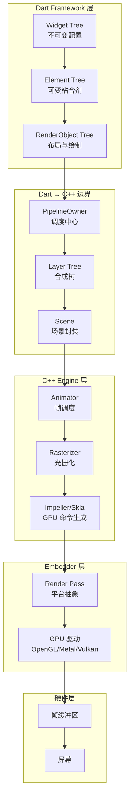


## 二、分层架构详解

Flutter 的渲染管线采用严格的分层设计，每层都有明确的职责边界。这张图可以帮你理解各层之间的调用关系：

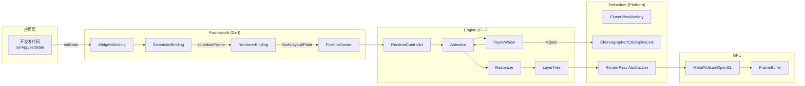

---

## 三、各层深度解析

### 3.1 Framework 层：三棵树的构建与更新

Framework 层的核心是管理三棵树的协同工作。下面这张时序图展示了从 `runApp` 到三棵树构建完成的完整流程：

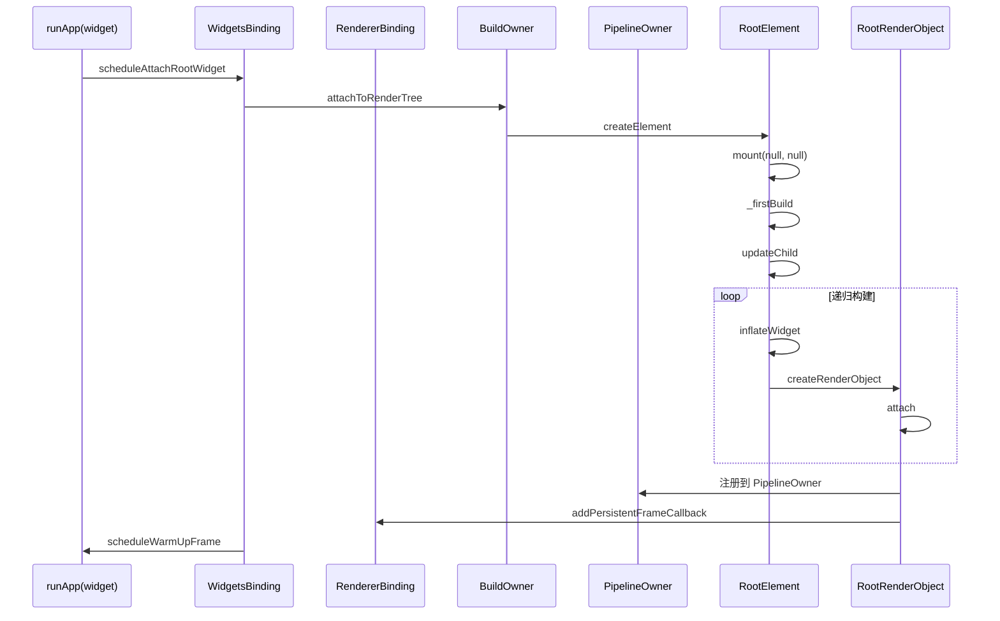

#### Widget：不可变配置

Widget 是 Flutter 中最轻量的对象，只描述 UI 的配置信息。

```dart
@immutable
abstract class Widget {
  const Widget({this.key});
  final Key? key;
  
  @protected
  Element createElement();
  
  static bool canUpdate(Widget oldWidget, Widget newWidget) {
    return oldWidget.runtimeType == newWidget.runtimeType 
        && oldWidget.key == newWidget.key;
  }
}
```

#### Element：可变的粘合剂

Element 是可变的，负责管理 Widget 的生命周期和持有 RenderObject。

```dart
abstract class Element {
  Widget? _widget;           // 当前对应的 Widget
  BuildOwner? _owner;        // 管理脏 Element 列表
  Element? _parent;          // 父节点
  List<Element>? _children;  // 子节点列表
  
  void mount(Element? parent, Object? newSlot) {
    _parent = parent;
    _owner = parent?._owner;
    _updateDepth(parent);
    _active = true;
    
    if (widget is StatefulWidget) {
      _state = (widget as StatefulWidget).createState();
      _state._element = this;
      _state.initState();
    }
  }
  
  void update(covariant Widget newWidget) {
    _widget = newWidget;
    _rebuild();
  }
  
  void markNeedsBuild() {
    if (!_dirty) {
      _dirty = true;
      _owner!.scheduleBuildFor(this);
    }
  }
}
```

#### Element 复用机制（Reconciliation）

Flutter 采用 **线性子列表比对算法**（而非树 diff），复杂度为 O(N)：

```dart
Element? updateChild(Element? child, Widget? newWidget, Object? newSlot) {
  if (newWidget == null) {
    child?.deactivate();
    return null;
  }
  
  if (child == null) {
    return inflateWidget(newWidget, newSlot);  // 新建
  }
  
  if (child.widget == newWidget) {
    child.updateSlot(newSlot);
    return child;  // 完全复用
  }
  
  if (Widget.canUpdate(child.widget, newWidget)) {
    child.update(newWidget);
    child.updateSlot(newSlot);
    return child;  // 更新后复用
  }
  
  child.deactivate();
  return inflateWidget(newWidget, newSlot);  // 无法复用，重建
}
```

**关键优化**：
- 通过 `GlobalKey` 实现非局部子树复用（如 Hero 动画）
- 父 Element 重建时，子 Element 若类型和 key 不变则完全复用
- 使用 `const` Widget 时，Flutter 可跳过子树构建

---

### 3.2 RenderObject：布局与绘制的执行者

RenderObject 是渲染管线的**执行层**，负责实际的布局计算和绘制命令生成。

```dart
abstract class RenderObject {
  PipelineOwner? _owner;       // 调度所有者
  RenderObject? _parent;       // 父节点
  
  // 布局相关
  Constraints _constraints;
  void layout(Constraints constraints, {bool parentUsesSize = false}) {
    if (_needsLayout && !isLayoutDirty) {
      _layoutWithoutResize();   // 调用子类实现
    }
  }
  
  // 绘制相关
  void paint(PaintingContext context, Offset offset);
  
  // 脏标记
  void markNeedsLayout() {
    _needsLayout = true;
    _owner?._nodesNeedingLayout.add(this);
  }
  
  void markNeedsPaint() {
    _needsPaint = true;
    _owner?._nodesNeedingPaint.add(this);
  }
}
```

#### 布局算法：单次遍历 + 亚线性优化

Flutter 的布局采用 **单次约束传递** 模型，在常见更新场景中实现亚线性复杂度：

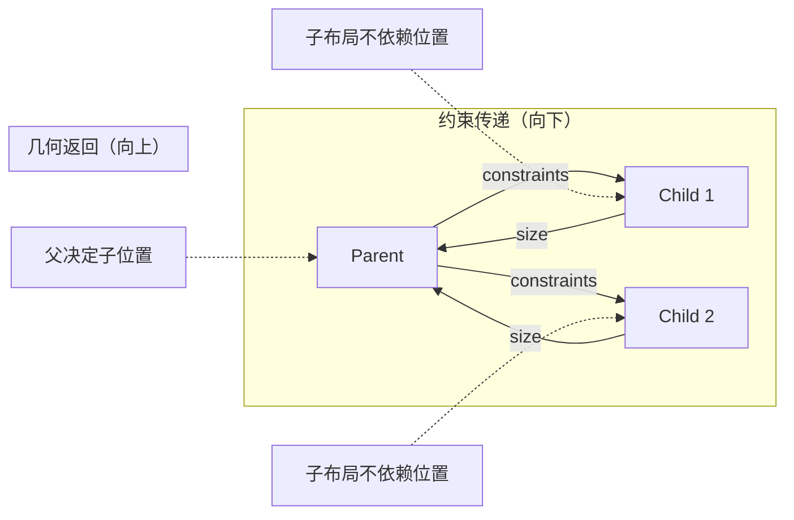

**核心不变量**：
1. **只向一个方向流动**：约束从父到子，几何从子到父
2. **布局不依赖位置**：位置在子布局完成后才确定
3. **relayout boundary 优化**：若父节点不依赖子节点尺寸，子节点布局变化不会触发父节点重排

**三种优化场景**：
| 场景 | 条件 | 效果 |
|------|------|------|
| 紧约束 | min=width=max, minHeight=maxHeight | 子节点尺寸固定，父节点可跳过重排 |
| 父不依赖子尺寸 | parentUsesSize=false | 子节点尺寸变化不影响父节点 |
| layout boundary | 子节点标记 | 子树内布局变化不会上溯 |

---

### 3.3 PipelineOwner：渲染管道的调度中枢

PipelineOwner 是连接 Framework 和 Engine 的关键桥梁，管理着所有渲染阶段。

```dart
class PipelineOwner {
  List<RenderObject> _nodesNeedingLayout = [];
  List<RenderObject> _nodesNeedingCompositingBitsUpdate = [];
  List<RenderObject> _nodesNeedingPaint = [];
  
  // 布局阶段
  void flushLayout() {
    while (_nodesNeedingLayout.isNotEmpty) {
      final node = _nodesNeedingLayout.removeAt(0);
      if (node._needsLayout) node._layoutWithoutResize();
    }
  }
  
  // 合成位更新阶段
  void flushCompositingBits() {
    for (final node in _nodesNeedingCompositingBitsUpdate) {
      node._updateCompositingBits();
    }
  }
  
  // 绘制阶段（生成 Layer Tree）
  void flushPaint() {
    while (_nodesNeedingPaint.isNotEmpty) {
      final node = _nodesNeedingPaint.removeAt(0);
      if (node._needsPaint) PaintingContext.repaintCompositedChild(node);
    }
  }
}
```

Flutter 测试框架中定义了完整的渲染阶段枚举，清晰地展示了管线执行的顺序：

```dart
enum EnginePhase {
  layout,          // 布局阶段
  compositingBits, // 合成位更新
  paint,           // 绘制阶段
  composite,       // 合成阶段
  flushSemantics,  // 语义树更新（无障碍）
  sendSemanticsTree
}
```

---

### 3.4 帧调度与 VSync：从 setState 到 GPU

帧调度是渲染管线的**驱动引擎**，核心是通过 VSync 信号同步帧率和渲染。

#### setState 的完整调用链

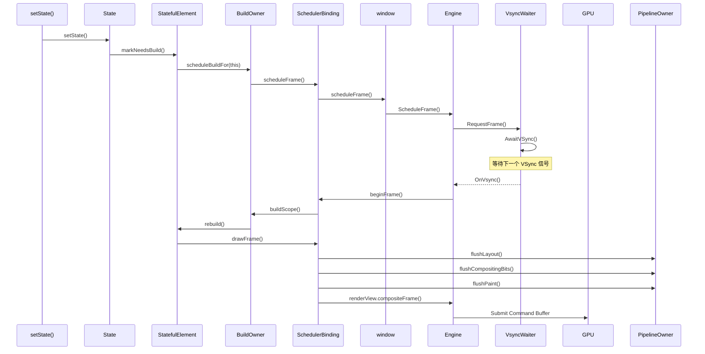

#### VSync 底层注册机制

Flutter Engine 通过 **Animator** 和 **VsyncWaiter** 实现 VSync 注册：

```cpp
// Animator::RequestFrame - 请求一帧
void Animator::RequestFrame(bool regenerate_layer_trees) {
  if (!pending_frame_semaphore_.TryWait()) return;
  
  task_runners_.GetUITaskRunner()->PostTask([weak = weak_factory_.GetWeakPtr()]() {
    if (weak) weak->AwaitVSync();
  });
}

// Animator::AwaitVSync - 注册 VSync 回调
void Animator::AwaitVSync() {
  waiter_->AsyncWaitForVsync([weak = weak_factory_.GetWeakPtr()](
      std::unique_ptr<FrameTimingsRecorder> recorder) {
    if (weak) weak->BeginFrame(std::move(recorder));
  });
}
```

**Android 实现**：使用 `Choreographer` 监听硬件 VSync 信号

```java
// Embedder 层
Choreographer.getInstance().postFrameCallback(new Choreographer.FrameCallback() {
  @Override
  public void doFrame(long frameTimeNanos) {
    flutterJNI.onVsync(delay, refreshPeriodNanos, cookie);
  }
});
```

**iOS 实现**：使用 `CADisplayLink` 实现类似的帧回调机制。

---

### 3.5 Engine 层：Impeller 与 Skia

Flutter Engine 的渲染部分由 **Impeller**（现代引擎）或 **Skia**（传统引擎）实现。以下是 Impeller 的架构：

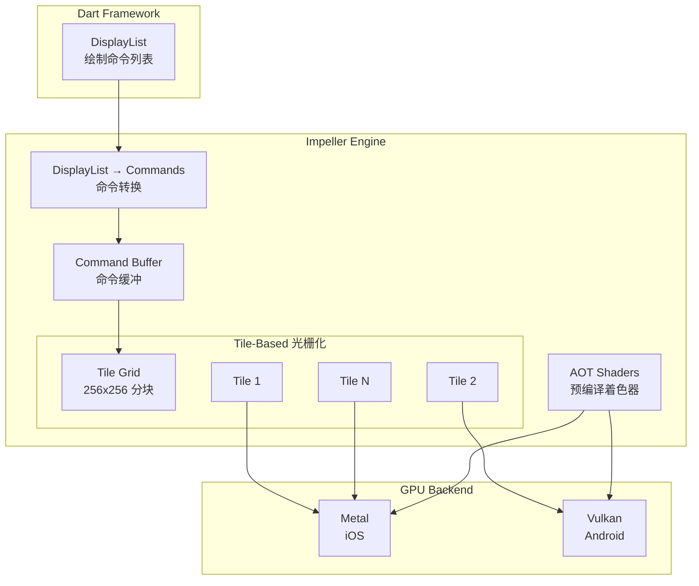

#### Impeller 的核心特性

**1. AOT 着色器编译**：消除运行时着色器编译卡顿。
- Shader 在应用构建时预编译为 SPIR-V（Vulkan）或 Metal Shader
- 帧率稳定性显著提升，首帧无卡顿

**2. Tile-Based 延迟渲染**：
- 将画面分割为 256×256 的 Tile
- 只重新渲染内容发生变化的 Tile
- 大幅减少 GPU 绘制负载

**3. 保留模式命令缓冲**：
- 命令可跨帧复用，避免重复记录
- 降低 CPU-GPU 同步开销

---

### 3.6 Render Pass 抽象：跨平台 GPU 命令封装

Render Pass 是 Impeller 的核心抽象，为不同 GPU API 提供统一接口。

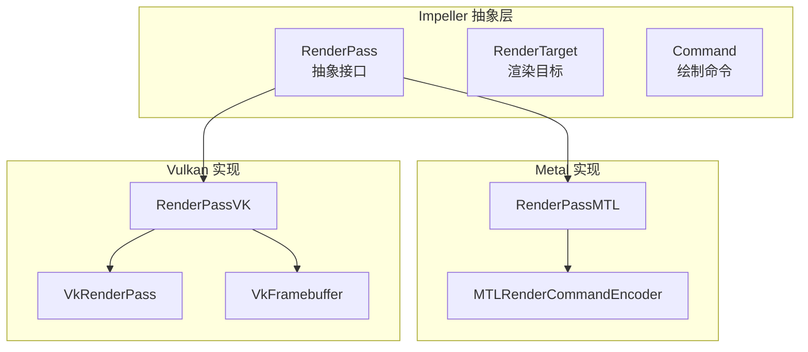

**核心抽象**：

```cpp
class RenderPass {
  virtual void SetPipeline(Pipeline* pipeline) = 0;
  virtual void SetVertexBuffer(VertexBuffer* buffer) = 0;
  virtual void SetIndexBuffer(IndexBuffer* buffer) = 0;
  virtual void BindResource(int slot, Resource* resource) = 0;
  virtual void Draw(uint32_t vertex_count) = 0;
  virtual void EncodeCommands() = 0;  // 编码为平台特定命令
};

struct RenderTarget {
  Texture color_attachment;      // 颜色附件
  Texture depth_attachment;      // 深度附件（可选）
  Texture stencil_attachment;    // 模板附件（可选）
  LoadAction load_action;        // clear/load/dontCare
  StoreAction store_action;      // store/resolve/dontCare
};
```

---

### 3.7 绘制命令流程：从 paint 到 GPU

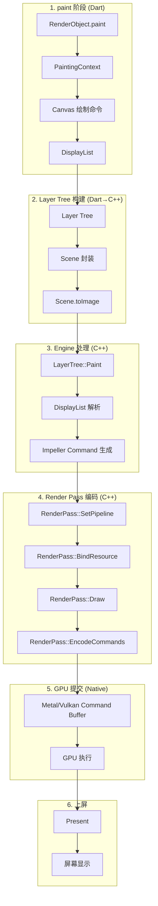

---

## 四、完整渲染管线时序图

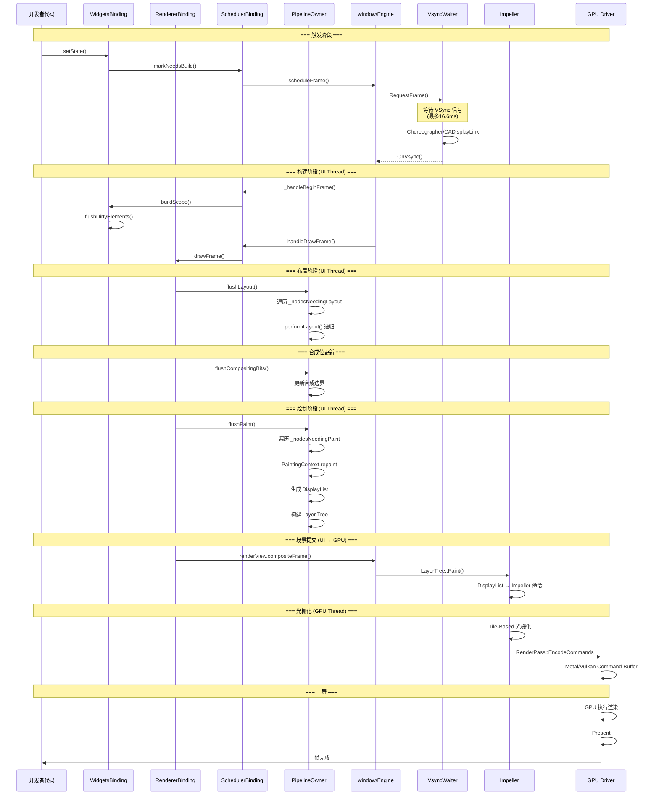


## 五、与原生渲染管线的对比

### 5.1 Android 原生渲染管线

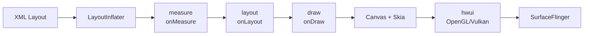

| 阶段 | Android 原生 | Flutter |
|------|-------------|---------|
| 布局定义 | XML / Jetpack Compose | Widget (Dart) |
| 布局算法 | measure → layout 两阶段 | 单次约束传递 |
| 视图系统 | View Hierarchy | RenderObject Tree |
| 绘制 API | Canvas (Skia) | Canvas → DisplayList |
| 合成方式 | View 系统 + SurfaceFlinger | Layer Tree → Impeller |
| 更新机制 | 脏矩形（invalidate） | 脏子树 + relayout boundary |
| 线程模型 | UI Thread + RenderThread | UI Thread + GPU Thread |

**核心差异**：
- **无宿主视图**：Flutter 不依赖平台 View 系统，完全自绘
- **无 measure 阶段**：约束直接传递，无二次测量
- **统一的渲染引擎**：跨平台一致性保证

---

### 5.2 Impeller vs Skia 性能对比

| 特性 | Skia | Impeller |
|------|------|----------|
| 着色器编译 | JIT（运行时卡顿） | AOT（预编译） |
| 渲染模式 | 立即模式 | 保留模式 + Tile-Based |
| 命令复用 | 每帧重新记录 | 可跨帧复用 |
| 首帧性能 | 有卡顿风险 | 稳定流畅 |
| 性能提升 | 基准 | iOS +35%，Android +28% |
| 支持平台 | 全平台 | iOS/Android（逐步全平台） |

---

## 六、设计模式总结

| 设计模式 | 应用位置 | 说明 |
|---------|---------|------|
| **组合模式** | Widget 树 | Widget 通过组合构建 UI |
| **责任链模式** | Element.updateChild | 子节点复用的决策链 |
| **模板方法模式** | RenderObject.layout | 定义算法骨架，子类实现 performLayout |
| **观察者模式** | PipelineOwner | 脏节点列表的观察与调度 |
| **命令模式** | DisplayList → Impeller | 绘制命令的记录与执行 |
| **适配器模式** | RenderPass | 统一 Metal/Vulkan 接口 |
| **策略模式** | Impeller/Skia | 可切换的渲染后端 |

---

## 七、性能优化要点

### 7.1 Framework 层优化
- 使用 `const` Widget 避免重建
- 使用 `RepaintBoundary` 隔离重绘区域
- 合理使用 `GlobalKey`（有代价）
- 避免在 build 中创建复杂对象

### 7.2 布局层优化
- 利用 `relayout boundary` 自动优化
- 使用 `LayoutBuilder` 时注意性能
- 避免深层嵌套（虽然已优化）

### 7.3 绘制层优化
- 使用 `RepaintBoundary` 隔离复杂绘制
- 避免在 paint 中创建新对象
- 使用 `PictureRecorder` 缓存静态内容

### 7.4 Impeller 特定优化
- 启用 Impeller：`--enable-impeller`
- 使用纹理图集减少 bind 调用
- 监控 Tile 重建计数（DevTools）

---

## 八、总结

Flutter 的渲染管线是一个**高度工程化、分层清晰、算法优化**的系统：

1. **Framework 层**：三棵树 + 线性子列表比对，实现亚线性更新
2. **Engine 层**：Impeller + Tile-Based 光栅化 + AOT 着色器
3. **Embedder 层**：Render Pass 抽象统一跨平台 GPU 接口
4. **驱动层**：Metal/Vulkan/OpenGL 利用现代 GPU 特性

整个管线通过 VSync 驱动，UI 线程负责布局和命令记录，GPU 线程负责光栅化和合成，实现了 60/120fps 的流畅体验。


# Flutter 渲染管线三大核心阶段深度解析

## 一、整体定位与数据流

在 Flutter 的渲染管线中，`compositingBits`、`paint`、`composite` 是三个紧密相连但又职责分明的阶段。它们处理的数据逐级转换，从逻辑属性最终变为 GPU 指令。

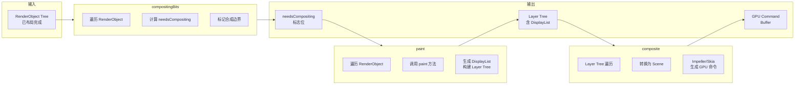

---

## 二、compositingBits：合成位更新阶段

### 2.1 核心概念：什么是合成位？

`needsCompositing` 是一个布尔标志位，表示**当前 RenderObject 是否需要提升为自己的图层（Layer）**。

```dart
abstract class RenderObject {
  bool _needsCompositing = false;
  bool get needsCompositing => _needsCompositing;
  
  void _updateCompositingBits() {
    if (!_needsCompositingBitsUpdate) return;
    
    bool oldNeedsCompositing = _needsCompositing;
    _needsCompositing = false;
    
    // 遍历子节点，递归更新
    visitChildren((child) {
      child._updateCompositingBits();
      _needsCompositing = _needsCompositing || child.needsCompositing;
    });
    
    // 当前节点自己是否强制需要单独图层？
    if (isRepaintBoundary || alwaysNeedsCompositing) {
      _needsCompositing = true;
    }
    
    _needsCompositingBitsUpdate = false;
  }
}
```

### 2.2 触发合成位的条件

| 条件 | 说明 | 示例 |
|------|------|------|
| `isRepaintBoundary = true` | 显式设置的重绘边界 | `RepaintBoundary` Widget |
| `alwaysNeedsCompositing = true` | 节点类型强制需要图层 | `Opacity`、`Transform`、`ClipPath` |
| 子节点需要合成 | 向下传递，父节点也变为需要 | 任何有特效子节点的父节点 |

**为什么需要这个标志位？**
- **性能优化**：如果整个子树都不需要单独图层，就可以在同一个 Layer 中绘制，减少 Layer 数量和合成开销
- **缓存策略**：`RepaintBoundary` 可以缓存绘制结果，子节点变化时只重绘该图层

### 2.3 输入与输出

| 项目 | 内容 |
|------|------|
| **输入** | 已完成布局的 RenderObject Tree，每个节点的 `_needsCompositingBitsUpdate = true` |
| **处理逻辑** | 深度优先遍历（DFS），自底向上计算每个节点的 `needsCompositing` |
| **输出** | 每个 RenderObject 的 `needsCompositing` 标志位被正确设置，用于 paint 阶段决策 |

### 2.4 代码调用链

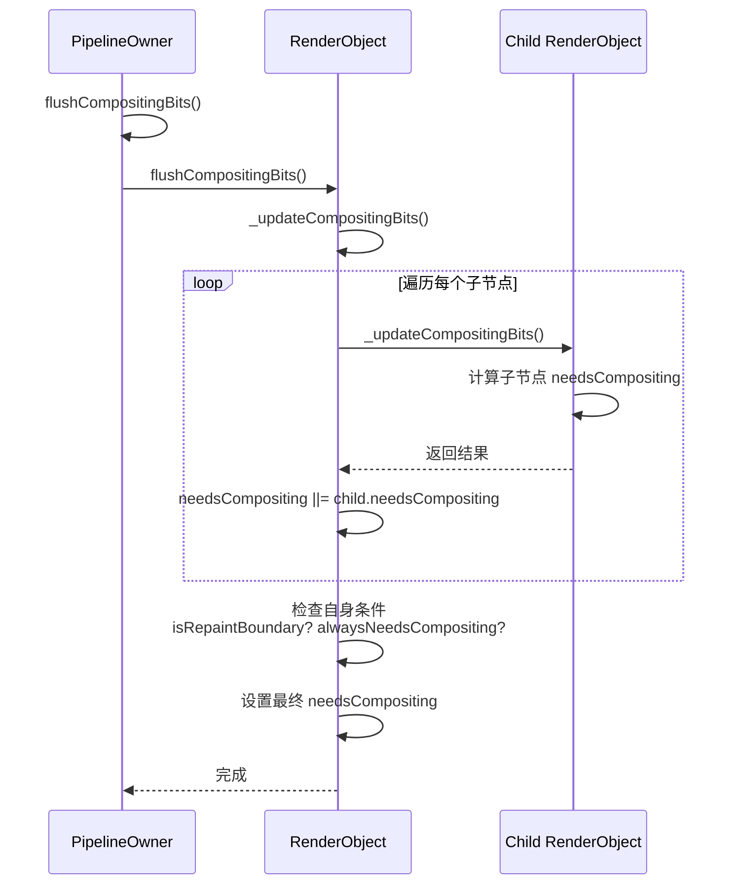

---

## 三、paint：绘制阶段

### 3.1 核心职责：生成 Layer Tree

paint 阶段的核心任务是将 RenderObject Tree 转换为 **Layer Tree**，每个节点的绘制命令被记录为 `DisplayList`。

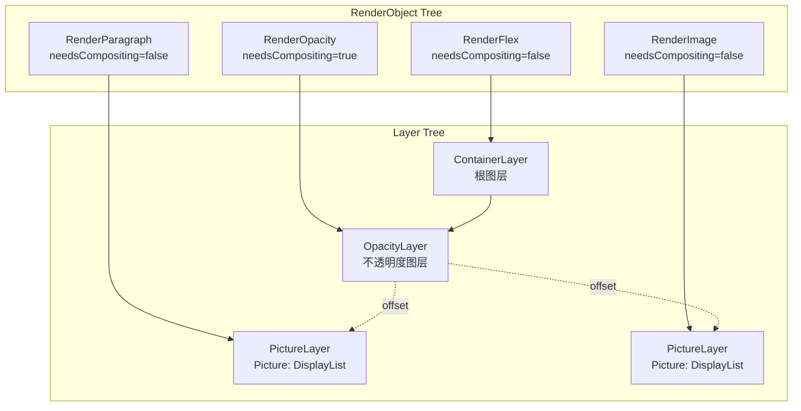

### 3.2 核心实现：PaintingContext 与 Layer 构建

```dart
class PaintingContext {
  // 当前正在构建的 Layer
  ContainerLayer _containerLayer;
  
  // 当前使用的 PictureRecorder
  ui.PictureRecorder _recorder;
  Canvas _canvas;
  
  void paintChild(RenderObject child, Offset offset) {
    if (child.needsCompositing) {
      // 需要单独图层：创建新 Layer
      final layer = child._layer ??= OffsetLayer();
      layer.offset = offset;
      
      // 在新 Layer 上绘制子节点
      final childContext = PaintingContext(layer, layer.paintBounds);
      child._paintWithContext(childContext, offset);
      childContext._finalize();
      
      // 将 Layer 添加到父容器
      _containerLayer.append(layer);
    } else {
      // 不需要单独图层：在当前 Canvas 上直接绘制
      final bounds = offset & child.paintBounds;
      _canvas.save();
      _canvas.translate(offset.dx, offset.dy);
      child.paint(this, offset);
      _canvas.restore();
    }
  }
  
  void _finalize() {
    // 将当前 PictureRecorder 的记录转换为 Picture
    final picture = _recorder.endRecording();
    if (picture != null) {
      _containerLayer.append(PictureLayer(picture));
    }
  }
}
```

### 3.3 典型 RenderObject 的 paint 实现

```dart
// 1. RenderParagraph (文本)
void paint(PaintingContext context, Offset offset) {
  context.canvas.drawParagraph(_paragraph, offset);
}

// 2. RenderOpacity (透明度)
void paint(PaintingContext context, Offset offset) {
  if (needsCompositing) {
    // 单独图层：在 OpacityLayer 中绘制
    final layer = _layer ??= OpacityLayer();
    layer.alpha = _alpha;
    context.pushLayer(layer, super.paint, offset);
  } else {
    // 无单独图层：使用 Canvas 的 saveLayer（开销大）
    context.canvas.saveLayer(offset & size, Paint()..alpha = _alpha);
    super.paint(context, offset);
    context.canvas.restore();
  }
}
```

### 3.4 DisplayList：绘制命令的序列化格式

`DisplayList` 是 Flutter 的**中间表示层**，记录了一串绘制命令：

```dart
// DisplayList 的结构（简化）
class DisplayList {
  List<DrawCommand> commands;
  
  // 典型命令：
  // - drawRect(rect, paint)
  // - drawPath(path, paint)
  // - drawImage(image, offset)
  // - drawParagraph(paragraph, offset)
  // - save()
  // - restore()
  // - translate(dx, dy)
  // - clipRect(rect)
}
```

**优势**：
- 可跨帧缓存（`RepaintBoundary` 场景）
- 可被 Impeller/Skia 优化（命令合并、重排序）
- 可被序列化用于截图（`toImage`）

### 3.5 输入与输出

| 项目 | 内容 |
|------|------|
| **输入** | RenderObject Tree + `needsCompositing` 标志位 |
| **处理逻辑** | 深度优先遍历，根据 `needsCompositing` 决定是否创建新 Layer |
| **输出** | **Layer Tree**：每个节点是 `Layer` 对象，叶子节点是 `PictureLayer`（内含 `DisplayList`） |

---

## 四、composite：合成阶段

### 4.1 核心职责：Layer Tree → GPU 命令

composite 阶段将 Layer Tree 转换为平台相关的 GPU 命令（Metal/Vulkan/OpenGL）。

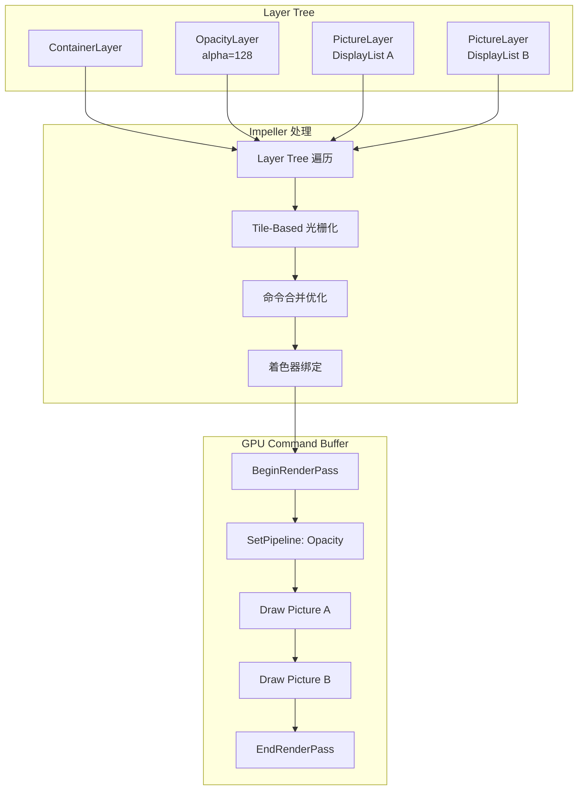

### 4.2 核心实现：Scene 与 Rasterizer

```cpp
// C++ Engine 层 (简化)
class Scene {
 public:
  std::shared_ptr<Layer> root_layer;
  SkRect frame_boundary;
};

class Rasterizer {
 public:
  void Draw(const Scene& scene) {
    // 1. 创建 RenderTarget（绑定帧缓冲区）
    auto target = CreateRenderTarget();
    
    // 2. 创建 Impeller RenderPass
    auto render_pass = target->CreateRenderPass();
    
    // 3. 遍历 Layer Tree，记录渲染命令
    scene.root_layer->Paint(render_pass);
    
    // 4. 提交 GPU 命令
    render_pass->EncodeCommands();
    render_pass->Commit();
    
    // 5. 等待 GPU 完成（或异步回调）
    render_pass->WaitForCompletion();
  }
};
```

### 4.3 Impeller 层的 RenderPass 抽象

```cpp
// Impeller RenderPass 接口
class RenderPass {
 public:
  // 设置渲染管线（着色器+混合模式）
  virtual void SetPipeline(Pipeline* pipeline) = 0;
  
  // 绑定顶点/索引缓冲区
  virtual void SetVertexBuffer(VertexBuffer* buffer) = 0;
  virtual void SetIndexBuffer(IndexBuffer* buffer) = 0;
  
  // 绑定纹理/Uniform
  virtual void BindTexture(int slot, Texture* texture) = 0;
  virtual void BindUniform(int slot, Uniform* uniform) = 0;
  
  // 绘制调用
  virtual void Draw(uint32_t vertex_count, uint32_t start_vertex) = 0;
  virtual void DrawIndexed(uint32_t index_count, uint32_t start_index) = 0;
  
  // 编码并提交
  virtual void EncodeCommands() = 0;
  virtual void Commit() = 0;
};

// Metal 实现
class RenderPassMTL : public RenderPass {
  id<MTLRenderCommandEncoder> encoder_;
  
  void SetPipeline(Pipeline* pipeline) override {
    [encoder_ setRenderPipelineState: pipeline->GetMTLHandle()];
  }
  
  void EncodeCommands() override {
    [encoder_ endEncoding];
  }
};
```

### 4.4 Tile-Based 延迟渲染（Impeller 特有）

Impeller 的 composite 阶段会将画面分割为 Tile，只重新渲染变化的区域：

```cpp
class TileBasedRasterizer {
  const int kTileSize = 256;
  
  void Draw(Scene& scene, RenderTarget& target) {
    auto bounds = scene.GetFrameBoundary();
    int cols = ceil(bounds.width() / kTileSize);
    int rows = ceil(bounds.height() / kTileSize);
    
    for (int y = 0; y < rows; y++) {
      for (int x = 0; x < cols; x++) {
        Rect tile_rect(x * kTileSize, y * kTileSize, 
                       kTileSize, kTileSize);
        
        if (!tile_rect.intersects(scene.dirty_region)) {
          continue;  // 脏区域不重叠，跳过渲染
        }
        
        // 只渲染脏 Tile
        RenderTile(tile_rect, scene);
      }
    }
  }
};
```

### 4.5 输入与输出

| 项目 | 内容 |
|------|------|
| **输入** | Layer Tree（含 PictureLayer 的 DisplayList） |
| **处理逻辑** | C++ Engine 遍历 Layer Tree，解析 DisplayList，生成 GPU 命令 |
| **输出** | **GPU Command Buffer**（Metal/Vulkan/OpenGL 格式）→ 帧缓冲区 → 屏幕 |

---

## 五、三阶段对比总结

| 维度 | compositingBits | paint | composite |
|------|----------------|-------|-----------|
| **执行语言** | Dart | Dart | C++ (Engine) |
| **执行线程** | UI Thread | UI Thread | GPU Thread |
| **输入** | RenderObject Tree | RenderObject Tree + compositing 标志位 | Layer Tree |
| **输出** | needsCompositing 标志位 | Layer Tree（含 DisplayList） | GPU Command Buffer |
| **核心操作** | 遍历设置标志位 | 创建 Layer，记录 DisplayList | 解析 DisplayList，调用 GPU API |
| **开销来源** | 轻量（只有遍历） | 中等（可能包含复杂绘制） | 较重（GPU 命令编码） |
| **缓存能力** | 无缓存 | RepaintBoundary 可缓存 Layer | GPU Command Buffer 可复用 |
| **优化目标** | 减少无效 Layer | 减少重绘区域 | 减少 GPU 命令冗余 |

---

## 六、一个完整的例子

假设有如下 Widget 树：

```dart
Column(
  children: [
    RepaintBoundary(  // 重绘边界
      child: Opacity(
        opacity: 0.5,
        child: Text('Hello'),
      ),
    ),
    Image.network('https://...'),  // 网络图片
  ],
)
```

### 6.1 compositingBits 阶段输出

```
RenderFlex (Column)
├── needsCompositing = true  (因为子节点有 RepaintBoundary)
│
├── RenderRepaintBoundary
│   ├── isRepaintBoundary = true
│   ├── needsCompositing = true (自身条件)
│   │
│   └── RenderOpacity
│       ├── alwaysNeedsCompositing = true (Opacity 节点)
│       └── needsCompositing = true (强制)
│           │
│           └── RenderParagraph
│               └── needsCompositing = false (普通文本)
│
└── RenderImage
    └── needsCompositing = false (普通图片，无特效)
```

### 6.2 paint 阶段输出

```
Layer Tree:
├── ContainerLayer (根)
│   ├── OffsetLayer (RepaintBoundary 的图层)
│   │   ├── OpacityLayer (alpha=128)
│   │   │   └── PictureLayer
│   │   │       └── DisplayList: [drawParagraph('Hello')]
│   │
│   └── PictureLayer (直接绘制)
│       └── DisplayList: [drawImage(networkImage)]
```

### 6.3 composite 阶段输出

GPU Command Buffer (Metal 伪代码):
```metal
// 1. OpacityLayer 的渲染
renderEncoder.setFragmentTexture(opacityTexture, 0);
renderEncoder.drawPrimitives(TriangleStrip, 0, 6);

// 2. PictureLayer A 的渲染
renderEncoder.setFragmentTexture(textureA, 0);
renderEncoder.drawIndexed(...);

// 3. PictureLayer B 的渲染
renderEncoder.setFragmentTexture(textureB, 0);
renderEncoder.drawIndexed(...);

// 4. 提交并上屏
commandBuffer.present(drawable);
commandBuffer.commit();
```

---

## 七、总结

这三个阶段构成了 Flutter 从高层次的 Widget 描述到底层 GPU 命令的完整转换链路：

1. **compositingBits**：为 paint 阶段提供决策依据，决定哪些子树需要隔离为独立图层
2. **paint**：根据决策结果，构建分层的 Layer Tree，并将绘制命令记录为 DisplayList
3. **composite**：消费 Layer Tree，翻译为 GPU 原生命令，最终驱动硬件渲染

**关键优化点**：
- `RepaintBoundary` 在 `compositingBits` 阶段被标记，使其子树变化时，`paint` 阶段只需重绘该边界内的图层，不影响其他部分
- `composite` 阶段的 Impeller 引擎通过 Tile-Based 和命令复用，进一步减少 GPU 负载