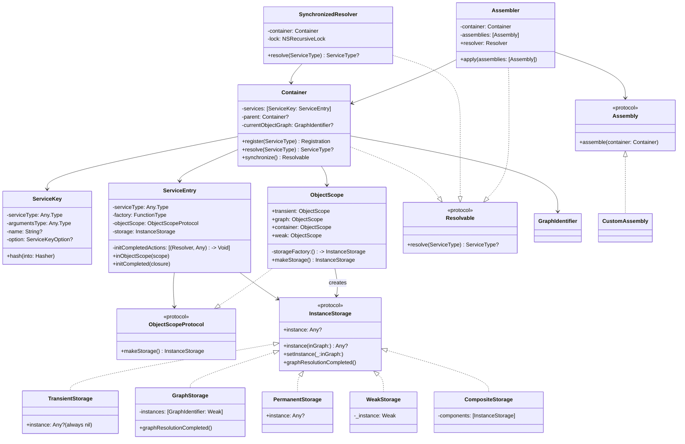

# Swinject 深度解析：从源码到实践的依赖注入框架完全指南

## 一、引言：什么是 Swinject？

Swinject 是 Swift 生态中最成熟、最流行的依赖注入（Dependency Injection）框架。它通过实现**控制反转（Inversion of Control, IoC）** 模式，帮助开发者构建松耦合、易测试、可维护的 Swift 应用程序。

Swinject 充分利用了 Swift 的**泛型系统**和**一等函数（First-class Functions）**，提供了简洁流畅的 API 来定义和管理依赖关系。其核心思想可以概括为一句话：**你告诉容器“当需要 A 类型时，就创建 B 类的实例”，然后当你需要 A 时，容器会自动为你创建并组装好所有依赖**。

### 核心特性一览

| 特性              | 说明                                                     |
| ----------------- | -------------------------------------------------------- |
| 纯 Swift 类型支持 | 支持协议、类、结构体等                                   |
| 多种注入模式      | 构造器注入、属性注入、方法注入                           |
| 四种对象作用域    | transient、graph、container、weak                        |
| 线程安全解析      | 通过 `synchronize()` 提供线程安全视图                    |
| 模块化组织        | 通过 Assembly 和 Assembler 组织注册                      |
| 循环依赖支持      | 通过属性注入 + `initCompleted` 解决                      |
| Storyboard 集成   | 官方扩展 SwinjectStoryboard                              |
| 平台支持          | iOS 11.0+、macOS 10.13+、tvOS 11.0+、watchOS 4.0+、Linux |

## 二、设计意图：为什么需要 DI 容器？

Swinject 的设计背后有着清晰的软件工程考量。

### 2.1 解决的核心问题

在传统的 Swift 开发中，对象之间的依赖关系通常是硬编码的：

```swift
class PetOwner {
    let pet: Animal
    init() {
        self.pet = Cat(name: "Mimi")  // 硬编码依赖
    }
}
```

这种写法的问题在于：
- **紧耦合**：`PetOwner` 与 `Cat` 的具体实现绑死
- **难以测试**：无法注入 Mock 对象进行单元测试
- **难以扩展**：更换宠物实现需要修改 `PetOwner` 源码
- **违反开闭原则**：对修改开放，对扩展封闭

**依赖注入（DI）** 通过将依赖的创建权从对象内部转移到外部（容器），解决了上述所有问题。

### 2.2 Swinject 的设计哲学

Swinject 的设计遵循以下核心原则：

1. **类型安全优先**：充分利用 Swift 的泛型，确保注册和解析的类型匹配在编译期就被检查
2. **非侵入式设计**：不需要修改已有类的代码即可实现注入
3. **灵活性与可扩展性**：支持多种注入模式、作用域和扩展机制
4. **轻量级**：核心库保持简洁，扩展功能通过独立模块提供

## 三、核心架构与类图

### 3.1 整体架构概览

Swinject 的架构围绕几个核心组件构建：

```
┌─────────────────────────────────────────────────────────────┐
│                      Assembler + Assembly                    │
│                    (模块化注册组织)                           │
└─────────────────────────┬───────────────────────────────────┘
                          │
┌─────────────────────────▼───────────────────────────────────┐
│                        Container                             │
│              (核心DI容器：注册 + 解析)                        │
├─────────────┬───────────────────────────┬───────────────────┤
│             │                           │                   │
│  ServiceKey │      ServiceEntry         │   ObjectScope     │
│  (唯一标识) │   (注册条目：工厂+作用域)  │   (生命周期定义)   │
│             │                           │                   │
│             ├─────► InstanceStorage     │                   │
│             │     (实例存储策略)         │                   │
│             │                           │                   │
│             │     GraphIdentifier       │                   │
│             │     (对象图标识)           │                   │
└─────────────┴───────────────────────────┴───────────────────┘
```

### 3.2 核心类图



### 3.3 关键设计模式

Swinject 在实现中运用了多种设计模式：

**1. 策略模式（Strategy Pattern）**
- `ObjectScopeProtocol` 定义作用域策略接口
- `TransientStorage`、`GraphStorage`、`PermanentStorage`、`WeakStorage` 是具体策略实现
- 容器在解析时根据策略选择不同的缓存行为

**2. 工厂模式（Factory Pattern）**
- `ServiceEntry` 持有工厂闭包，负责创建实例
- `ObjectScope` 通过 `storageFactory` 创建对应的存储实例

**3. 组合模式（Composite Pattern）**
- `CompositeStorage` 组合多个 `InstanceStorage`，实现 `.weak` 作用域（WeakStorage + GraphStorage）的组合行为

**4. 装饰器模式（Decorator Pattern）**
- `SynchronizedResolver` 装饰 `Container`，在不修改原类的情况下添加线程安全能力

**5. 建造者模式（Builder Pattern）**
- 注册方法链式调用：`container.register(...).inObjectScope(...).initCompleted(...)`

### 3.4 执行流程

以 A(.graph对象图内共享)->B(单例注册)-C(weak弱引用注册) 对象解析流程分析,被依赖对象（B）的实例创建策略，完全由 B 自身注册时的作用域决定，与调用方（A）的作用域无关。整个resolve流程如下图所示. 本质上就是根据 根据封装的ServiceKey去查找对应注册的工厂函数,内部自动管理不同的scope作用于,控制对象的生命周期。

```
sequenceDiagram
    participant User
    participant Container as Swinject容器
    participant EntryA as A的ServiceEntry<br/>(.graph)
    participant EntryB as B的ServiceEntry<br/>(.container)
    participant EntryC as C的ServiceEntry<br/>(.weak)
    participant StorageA as GraphStorage(A)
    participant StorageB as PermanentStorage(B)
    participant StorageC as WeakStorage(C)
    
    Note over User,StorageC: 第一次解析 A (创建 GraphID = G1)
    
    User->>Container: resolve(AType.self)
    Container->>Container: 生成 GraphIdentifier = G1<br/>currentObjectGraph = G1
    Container->>EntryA: 查找 A 的 ServiceEntry
    Container->>StorageA: instance(inGraph: G1)
    StorageA-->>Container: nil (首次)
    Container->>EntryA: 执行工厂闭包<br/>(需要 B)
    
    Note over Container,EntryB: 递归解析 B (B 是 .container)
    Container->>EntryB: resolve(BType.self)
    Container->>StorageB: instance (检查单例缓存)
    StorageB-->>Container: nil (首次)
    Container->>EntryB: 执行 B 的工厂闭包<br/>(需要 C)
    
    Note over Container,EntryC: 递归解析 C (C 是 .weak)
    Container->>EntryC: resolve(CType.self)
    Container->>StorageC: instance (检查弱引用缓存)
    StorageC-->>Container: nil (首次)
    Container->>EntryC: 执行 C 的工厂闭包<br/>创建 C1
    Container->>StorageC: 弱引用存储 C1
    StorageC-->>Container: C1 返回
    
    Container-->>EntryB: C1 作为参数传入
    EntryB->>EntryB: init(c: C1) 创建 B1
    Container->>StorageB: 强引用存储 B1 (单例)
    StorageB-->>Container: B1 返回
    
    Container-->>EntryA: B1 作为参数传入
    EntryA->>EntryA: init(b: B1) 创建 A1
    Container->>StorageA: 存入 A1 (inGraph: G1)
    StorageA-->>Container: A1 返回
    Container-->>User: 返回 A1
    
    Note over User,StorageC: 第一次解析完成 (触发清理)
    Container->>Container: graphResolutionCompleted()
    Container->>StorageA: 清空 G1 缓存 (A1 被释放，若外部无强引用)
    Container->>Container: currentObjectGraph = nil
    
    Note over User,StorageC: 第二次解析 A (创建 GraphID = G2)
    
    User->>Container: resolve(AType.self)
    Container->>Container: 生成 GraphIdentifier = G2
    Container->>EntryA: 执行 A 的工厂闭包 (需要 B)
    
    Note over Container,StorageB: 再次解析 B (检查单例缓存)
    Container->>EntryB: resolve(BType.self)
    Container->>StorageB: instance
    StorageB-->>Container: 直接返回 B1 (单例复用 !)
    
    Note over Container,StorageC: 注意：这里不会重新解析 C<br/>因为 B1 内部已经持有 C1
    
    Container-->>EntryA: B1 传入
    EntryA->>EntryA: init(b: B1) 创建 A2
    Container-->>User: 返回 A2
    
    Note over User,StorageC: 最终内存状态
    Note over StorageB: 容器强持有 B1 (常驻)
    Note over StorageC: 弱引用持有 C1，但因 B1 强持有，C1 存活
```

## 四、实现原理深度解析

### 4.1 注册机制：ServiceKey 与 ServiceEntry

Swinject 内部使用 `services` 字典存储所有注册信息：

```swift
// Container 内部核心数据结构
internal var services = [ServiceKey: ServiceEntry]()
```

**ServiceKey** 是注册的唯一标识符，由四部分组成：

```swift
extension ServiceKey: Hashable {
    public func hash(into hasher: inout Hasher) {
        ObjectIdentifier(serviceType).hash(into: &hasher)
        ObjectIdentifier(argumentsType).hash(into: &hasher)
        name?.hash(into: &hasher)
        option?.hash(into: &hasher)  // 用于扩展，如 SwinjectStoryboard
    }
}
```

| ServiceKey 组成 | 作用                                   |
| --------------- | -------------------------------------- |
| `serviceType`   | 服务类型（通常是协议）                 |
| `argumentsType` | 工厂参数类型（支持最多9个参数）        |
| `name`          | 可选的命名，用于区分同一类型的多个实现 |
| `option`        | 扩展选项，如 Storyboard 集成           |

**ServiceEntry** 存储了创建实例所需的所有信息：

```swift
public final class ServiceEntry {
    public let serviceType: Any.Type
    internal let factory: FunctionType
    internal var objectScope: ObjectScopeProtocol
    internal lazy var storage: InstanceStorage = { ... }()
    fileprivate var initCompletedActions: [(Resolver, Any) -> Void]
}
```

### 4.2 解析机制：递归依赖解析

当调用 `resolve` 时，Swinject 执行以下流程：

**步骤一：查找 ServiceEntry**
根据 `ServiceKey` 从 `services` 字典中查找对应的 `ServiceEntry`。

**步骤二：检查存储缓存**
调用 `storage.instance(inGraph: currentGraphIdentifier)` 检查是否已有缓存实例。

**步骤三：创建实例**
如果没有缓存，执行 `ServiceEntry.factory` 闭包创建实例。工厂闭包接收一个 `Resolver` 参数，可以递归解析依赖：

```swift
container.register(Person.self) { r in
    PetOwner(name: "Stephen", pet: r.resolve(Animal.self)!)
}
```

**步骤四：保存实例**
将新创建的实例存入 `storage`。

**步骤五：执行 initCompleted 回调**
实例创建完成后，执行所有 `initCompleted` 回调。

### 4.3 对象图管理：GraphIdentifier

Swinject 使用 `GraphIdentifier` 来追踪**单次顶层解析过程**中的所有依赖：

- 每次顶层 `resolve` 创建一个新的 `GraphIdentifier`
- 嵌套解析共享相同的 `GraphIdentifier`
- 解析完成后调用 `graphResolutionCompleted()` 清理缓存

```swift
fileprivate func graphResolutionCompleted() {
    graphInstancesInFlight.forEach { $0.storage.graphResolutionCompleted() }
    graphInstancesInFlight.removeAll(keepingCapacity: true)
    currentObjectGraph = nil
}
```

这个机制是 `.graph` 作用域实现“对象图内共享”的核心。

## 五、对象生命周期（作用域）深度解析

Swinject 提供了四种对象作用域，控制实例的创建和共享方式。

### 5.1 `.transient` —— 瞬态

**行为**：每次 `resolve` 都创建全新实例，容器不缓存。

**源码实现**：
```swift
public static let transient = ObjectScope(
    storageFactory: TransientStorage.init,
    description: "transient"
)

public final class TransientStorage: InstanceStorage {
    public var instance: Any? {
        get { return nil }   // 永远返回 nil
        set {}               // 忽略任何设置
    }
}
```

**适用场景**：无状态服务、值类型、每次使用需要全新实例的对象。

**⚠️ 限制**：不支持循环依赖。

### 5.2 `.graph` —— 对象图内共享（默认）

**行为**：在单次顶层 `resolve` 过程中，所有依赖该类型的对象共享同一个实例；不同次 `resolve` 之间互不影响。

**源码实现**：
```swift
public static let graph = ObjectScope(
    storageFactory: GraphStorage.init,
    description: "graph"
)

public final class GraphStorage: InstanceStorage {
    private var instances = [GraphIdentifier: Weak]()
    public var instance: Any?
    
    public func instance(inGraph graph: GraphIdentifier) -> Any? {
        return instances[graph]?.value
    }
    
    public func setInstance(_ instance: Any?, inGraph graph: GraphIdentifier) {
        self.instance = instance
        instances[graph]?.value = instance
    }
    
    public func graphResolutionCompleted() {
        instance = nil  // 主动释放强引用
    }
}
```

**工作原理**：
1. 每次顶层 `resolve` 生成唯一的 `GraphIdentifier`
2. `GraphStorage` 使用 `[GraphIdentifier: Weak]` 为每个对象图独立缓存
3. 解析完成后，`graphResolutionCompleted()` 清理缓存

**适用场景**：**大多数业务服务**的默认选择，特别是需要避免循环依赖的场景。

### 5.3 `.container` —— 容器级单例

**行为**：在容器及其子容器范围内全局共享一个实例。

**源码实现**：
```swift
public static let container = ObjectScope(
    storageFactory: PermanentStorage.init,
    description: "container"
)

public final class PermanentStorage: InstanceStorage {
    public var instance: Any?
    public init() {}
}
```

**适用场景**：全局基础设施服务——网络客户端、日志记录器、数据库连接池、配置管理器。

**⚠️ 注意**：过度使用会导致内存常驻，测试时需注意单例污染。

### 5.4 `.weak` —— 弱引用共享

**行为**：容器弱引用持有实例，外部强引用消失后自动释放。

**源码实现**：
```swift
public static let weak = ObjectScope(
    storageFactory: WeakStorage.init,
    description: "weak",
    parent: .graph  // 组合了 graph 作用域
)

public final class WeakStorage: InstanceStorage {
    private var _instance = Weak()
    public var instance: Any? {
        get { _instance.value }
        set { _instance.value = newValue }
    }
}
```

`parent: .graph` 使得 `WeakStorage` 与 `GraphStorage` 组合成 `CompositeStorage`，在弱引用失效时仍能在同一对象图内提供实例。

**适用场景**：缓存管理器、可重建的大对象、观察者模式中的被观察者。

### 5.5 作用域选择指南

| 作用域       | 实例创建       | 实例共享       | 支持循环依赖 | 典型用途               |
| ------------ | -------------- | -------------- | ------------ | ---------------------- |
| `.transient` | 每次新建       | 不共享         | ❌            | 无状态服务             |
| `.graph`     | 首次解析时创建 | 同对象图内共享 | ✅            | 大多数业务服务（默认） |
| `.container` | 首次解析时创建 | 容器内全局共享 | ✅            | 基础设施服务           |
| `.weak`      | 首次解析时创建 | 有强引用时共享 | ✅            | 缓存、可重建对象       |

## 六、线程安全设计

### 6.1 设计原则

Swinject 的线程安全设计遵循**明确分离**的原则：

- **`Container` 本身不是线程安全的**
- **注册必须在单一线程上完成**（通常是应用启动时）
- **解析可以通过线程安全视图进行**

### 6.2 `synchronize()` 机制

```swift
let container = Container()
container.register(SomeType.self) { _ in SomeImplementation() }

// 获取线程安全视图
let threadSafeContainer: Resolvable = container.synchronize()

// 在多个线程中安全解析
DispatchQueue.global().async {
    let instance = threadSafeContainer.resolve(SomeType.self)
}
```

`SynchronizedResolver` 内部使用锁（`NSRecursiveLock`）保护 `resolve` 操作。

### 6.3 容器层次结构的线程安全

在父子容器场景中，所有容器的解析都应通过线程安全视图进行：

```swift
let parentContainer = Container()
let parentResolver = parentContainer.synchronize()
let childResolver = Container(parent: parentContainer).synchronize()

// 并发解析
DispatchQueue.global().async {
    let instance = parentResolver.resolve(SomeType.self)
}
```

### 6.4 注意事项

- **`synchronize()` 返回的是 `Resolvable` 类型，只包含 `resolve` 方法，不包含注册方法**
- **注册操作仍需要确保线程安全**，建议在启动时单线程完成
- **SwinjectStoryboard** 通常在主线程使用，一般不需要同步视图

## 七、循环依赖解决方案

### 7.1 问题本质

循环依赖是指两个或多个对象相互依赖。如果用构造器注入同时依赖对方，会导致无限递归。

### 7.2 标准解决方案：构造器/属性混合注入

Swinject 的解决思路是：**一个对象通过构造器注入，另一个通过属性注入**。

**示例**：`Parent` 依赖 `Child`，`Child` 也依赖 `Parent`

```swift
protocol ParentProtocol: AnyObject { }
protocol ChildProtocol: AnyObject { }

class Parent: ParentProtocol {
    let child: ChildProtocol?
    init(child: ChildProtocol?) {
        self.child = child
    }
}

class Child: ChildProtocol {
    weak var parent: ParentProtocol?  // ⚠️ weak 打破循环引用
}
```

**注册方式**：

```swift
let container = Container()

// Parent 通过构造器注入 Child
container.register(ParentProtocol.self) { r in
    Parent(child: r.resolve(ChildProtocol.self)!)
}

// Child 通过属性注入 Parent
container.register(ChildProtocol.self) { _ in Child() }
    .initCompleted { r, c in
        let child = c as! Child
        child.parent = r.resolve(ParentProtocol.self)
    }
```

### 7.3 重要注意事项

1. **属性必须使用 `weak` 修饰**，否则会造成内存泄漏
2. **构造器/构造器循环不被支持**
3. **工厂方法可能被调用两次**——当存在循环依赖时，部分工厂闭包可能被执行两次。如果工厂闭包有副作用（耗时操作、IO等），需要注意。可以通过将双方依赖都放在 `initCompleted` 中解决

## 八、模块化组织：Assembly 与 Assembler

### 8.1 设计动机

将所有注册代码集中在一个地方会导致代码难以维护。Swinject 通过 `Assembly` 和 `Assembler` 提供了模块化组织方案。

### 8.2 Assembly 协议

`Assembly` 协议要求实现 `assemble(container:)` 方法，将相关依赖的注册逻辑组织在一起：

```swift
class NetworkAssembly: Assembly {
    func assemble(container: Container) {
        container.register(NetworkServicing.self) { _ in NetworkService() }
            .inObjectScope(.container)
    }
}

class ViewModelAssembly: Assembly {
    func assemble(container: Container) {
        container.register(ProductDetailViewModel.self) { r in
            ProductDetailViewModel(
                networkService: r.resolve(NetworkServicing.self)!
            )
        }
    }
}
```

### 8.3 Assembler：组装器

`Assembler` 负责将多个 `Assembly` 组装到一个 `Container` 中：

```swift
let assembler = Assembler([
    NetworkAssembly(),
    ViewModelAssembly()
])
let container = assembler.resolver
```

## 九、运行时安全与限制

### 9.1 类型安全

Swinject 充分利用 Swift 泛型系统，确保：
- 注册时的类型与解析时的类型匹配
- 工厂参数类型与 `resolve` 传入参数类型匹配

### 9.2 解析失败处理

`resolve` 方法返回可选类型（`Service?`），当服务未注册时返回 `nil`。建议在组合根（Composition Root）进行解析，使用 `!` 强制解包或提供默认值。

### 9.3 resolve 参数限制

Swinject 支持最多 **9 个** 运行时参数：

```swift
container.register(Animal.self) { _, name in
    Cat(name: name)
}
let cat = container.resolve(Animal.self, argument: "Mimi")
```

**设计意图**：
- 支持传入**运行时动态数据**（如 `userID`、`orderID`）
- 与 `name`（静态标签）形成互补
- 9 个参数是函数重载的工程上限，超过 3 个参数建议封装为参数对象

### 9.4 容器层次结构

Swinject 支持父子容器，子容器可以解析父容器中注册的服务：

```swift
let parent = Container()
let child = Container(parent: parent)
```

这在模块化架构中非常有用：根容器持有全局服务，子容器持有模块特定服务。

## 十、常见问题与解决方案

### 10.1 循环依赖导致崩溃

**问题**：两个类都通过构造器注入对方。

**解决**：将其中一个改为属性注入，使用 `initCompleted` 回调。

### 10.2 多线程解析崩溃

**问题**：在后台线程直接调用 `container.resolve()`。

**解决**：使用 `container.synchronize()` 获取线程安全视图。

### 10.3 内存泄漏

**问题**：对象被容器强持有无法释放。

**解决**：
- 检查是否错误地将 ViewModel 等短生命周期对象注册为 `.container`
- 循环依赖中使用 `weak` 修饰属性
- 使用 `resetObjectScope` 手动清理缓存

### 10.4 工厂闭包被调用两次

**问题**：循环依赖场景下，工厂闭包可能被执行两次。

**解决**：将双方的依赖注入都放到 `initCompleted` 回调中。

### 10.5 Storyboard 中的 ViewController 无法注入

**解决**：使用官方扩展 `SwinjectStoryboard`。

## 十一、最佳实践设计

### 11.1 组合根（Composition Root）模式

在应用启动时（如 `AppDelegate`）集中完成所有注册：

```swift
@main
class AppDelegate: UIResponder, UIApplicationDelegate {
    let assembler = Assembler([
        NetworkAssembly(),
        RepositoryAssembly(),
        ViewModelAssembly()
    ])
    
    func application(...) -> Bool {
        // 应用启动时完成所有注册
        return true
    }
}
```

### 11.2 作用域黄金法则

| 对象类型                                    | 推荐作用域               | 原因                         |
| ------------------------------------------- | ------------------------ | ---------------------------- |
| 全局基础设施（APIService、DatabaseService） | `.container`             | 全局共享，生命周期与应用一致 |
| 业务服务（UserService、OrderService）       | `.graph`（默认）         | 一次请求内共享，不同请求隔离 |
| ViewModel / Presenter                       | `.graph` 或 `.transient` | 与 UI 场景绑定，不应全局常驻 |
| 无状态工具类                                | `.transient`             | 每次使用新建，无状态污染     |

### 11.3 依赖注入的三种模式

| 注入模式       | 适用场景                                 | 示例                                 |
| -------------- | ---------------------------------------- | ------------------------------------ |
| **构造器注入** | 必需依赖，对象无法正常工作时应使用       | `init(dependency: Dependency)`       |
| **属性注入**   | 可选依赖，或依赖可能在对象生命周期内变化 | `var dependency: Dependency?`        |
| **方法注入**   | 依赖仅在特定方法中需要                   | `func doSomething(with: Dependency)` |

### 11.4 测试友好的设计

```swift
// 生产环境
let container = Assembler([ProductionAssembly()]).resolver
let service = container.resolve(MyService.self)!

// 测试环境
let testContainer = Container()
testContainer.register(MyService.self) { _ in MockMyService() }
let mockService = testContainer.resolve(MyService.self)!
```

## 十二、横向对比与技术选型

### 12.1 主流 Swift DI 框架对比

| 框架              | 类型安全 | 代码生成 | 学习曲线 | 活跃度 | 适用场景       |
| ----------------- | -------- | -------- | -------- | ------ | -------------- |
| **Swinject**      | 运行时   | ❌        | 中等     | ⭐⭐⭐⭐⭐  | 通用，大型项目 |
| **Needle (Uber)** | 编译时   | ✅        | 较高     | ⭐⭐⭐⭐   | 超大规模项目   |
| **Factory**       | 编译时   | ❌ (宏)   | 低       | ⭐⭐⭐⭐   | 现代化新项目   |
| **Resolver**      | 运行时   | ❌        | 低       | ⭐⭐⭐    | 小型项目       |
| **WeaveDI**       | 编译时   | ✅ (宏)   | 中等     | ⭐⭐⭐    | 追求自动化     |

### 12.2 Swinject 的优势

- **生态成熟**：6,000+ Stars，丰富的文档和社区支持
- **功能全面**：四种作用域、循环依赖、模块化组织
- **扩展丰富**：SwinjectStoryboard、SwinjectAutoregistration、Swinject-CodeGen
- **平台支持广**：iOS、macOS、tvOS、watchOS、Linux

### 12.3 技术选型建议

| 项目类型          | 推荐框架     | 理由                      |
| ----------------- | ------------ | ------------------------- |
| 中型以上 iOS 项目 | **Swinject** | 功能成熟，社区支持好      |
| 超大型模块化项目  | **Needle**   | 编译时安全，层级化结构    |
| 全新 SwiftUI 项目 | **Factory**  | 宏驱动，与现代 Swift 契合 |
| 小型/快速原型     | **Resolver** | 轻量，上手快              |

### 12.4 Swinject 的局限性

1. **运行时类型安全**：依赖缺失在运行时才发现（返回 `nil`）
2. **性能开销**：运行时查找和反射有一定性能成本
3. **线程安全需手动处理**：需要调用 `synchronize()`
4. **循环依赖处理繁琐**：需要 `initCompleted` + `weak` 属性
5. **维护活跃度下降**：最新版本更新频率降低

## 十三、总结

Swinject 作为 Swift 生态中最成熟的依赖注入框架，通过**容器（Container）**、**注册条目（ServiceEntry）**、**作用域（ObjectScope）** 和**存储（InstanceStorage）** 等核心组件，构建了一套完整、灵活的依赖管理解决方案。

其设计精髓在于：
- **策略模式**实现灵活的作用域管理
- **组合模式**支持复杂的作用域组合（如 `.weak`）
- **装饰器模式**提供线程安全的解析视图
- **建造者模式**提供流畅的注册 API

对于大多数 iOS 项目，Swinject 依然是依赖注入的首选方案。它功能全面、生态成熟，能够有效解决对象创建、生命周期管理和模块解耦等核心问题。

---

## 参考资料

1. [Swinject GitHub Repository](https://github.com/Swinject/Swinject)