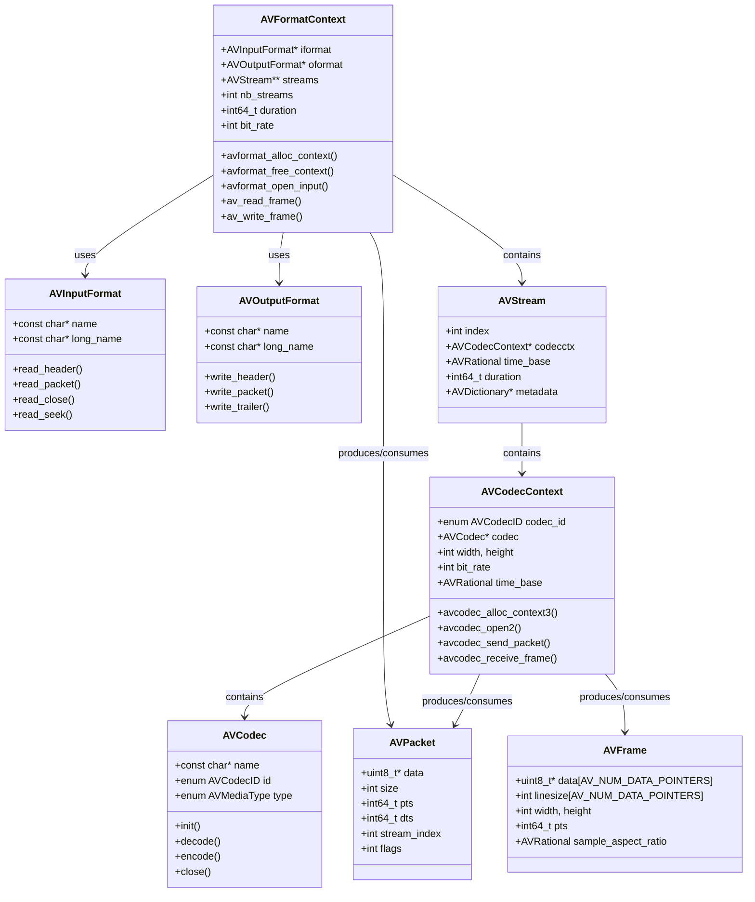
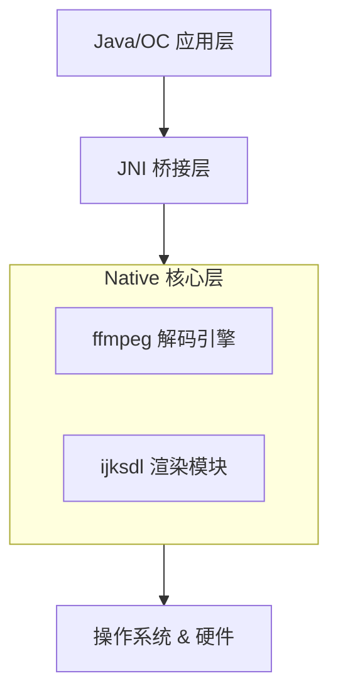
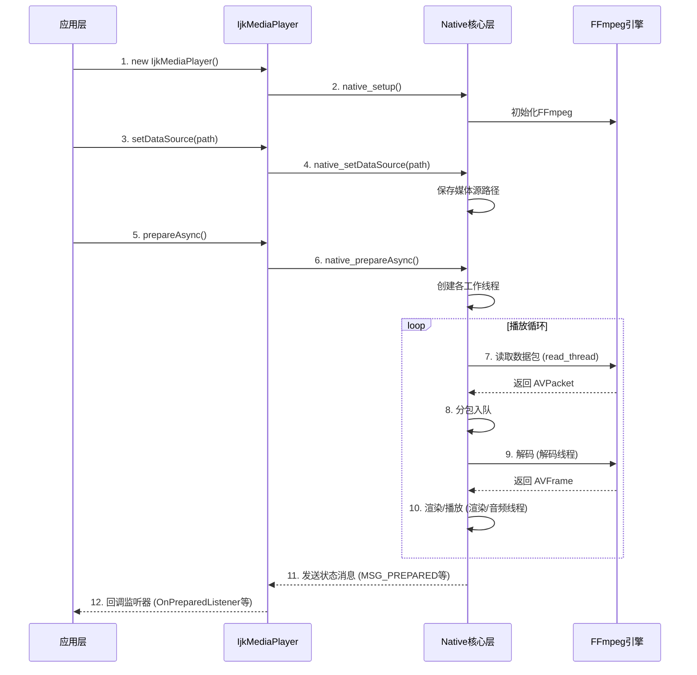

## 一、FFmpeg 简介

FFmpeg 是一套开源的、跨平台的音视频处理解决方案，可用于录制、转换和流化音视频。它采用 LGPL 或 GPL 许可证，以 C 语言实现，核心目标是通过抽象化设计实现跨格式、跨平台的音视频流处理能力。

FFmpeg 主要由以下核心工具构成：
- **ffmpeg**：命令行转码工具
- **ffplay**：基于 SDL 的简易播放器
- **ffprobe**：媒体文件信息分析工具


## 二、架构设计

### 2.1 模块化架构

FFmpeg 采用模块化设计，由一系列 `libavxxx` 库组成：

| 模块              | 功能                           |
| ----------------- | ------------------------------ |
| **libavformat**   | 封装/解封装（格式处理）        |
| **libavcodec**    | 编码/解码                      |
| **libavutil**     | 通用工具（像素、IO、时间等）   |
| **libavfilter**   | 滤镜处理（音视频特效）         |
| **libavdevice**   | 设备输入输出（摄像头、麦克风） |
| **libswscale**    | 图像缩放与像素格式转换         |
| **libswresample** | 音频重采样                     |
| **libpostproc**   | 后期处理                       |

对于入门开发者，最重要的是 `libavformat`、`libavcodec` 和 `libavutil` 三个核心库。

### 2.2 分层架构

FFmpeg 采用分层架构设计：

1. **协议处理层**：通过 `URLContext` 抽象结构，支持 HTTP、RTMP、本地文件等 200+ 种协议
2. **复用/解复用层**：`AVFormatContext` 作为核心容器，管理多个 `AVStream` 对象
3. **编解码层**：`AVCodecContext` 封装编码/解码参数，通过 `codec_id` 关联具体编解码器
4. **滤镜处理层**：基于 `AVFilterGraph` 构建处理链，支持动态插拔滤镜节点

### 2.3 面向对象设计思想

FFmpeg 虽然是 C 语言实现，但大量运用了面向对象的设计思想。C 语言没有类的语法特性，但可以用结构体 `struct` 模拟类，用函数第一个参数传递 `Context` 指针模拟 `this` 指针。

代码中大量出现的 `XxxxContext` 结构体（如 `AVFormatContext`、`AVCodecContext`），本质上就是 C 语言“类”的实现。


## 三、核心数据结构与类图

### 3.1 核心数据结构

FFmpeg 中最重要的几个数据结构及其关系如下：

- **AVFormatContext**：封装/解封装操作的核心数据结构，包含文件的比特率、时长、流数量等通用信息
- **AVInputFormat / AVOutputFormat**：定义输入/输出格式的具体操作（方法），每种封装格式对应一个实现
- **AVStream**：描述一个媒体流（音频/视频/字幕），包含编码参数、时间基准等信息
- **AVCodecContext**：编解码器上下文，存储编解码过程中使用的参数和数据
- **AVCodec**：具体的编解码器实现
- **AVPacket**：编码后的压缩数据单元
- **AVFrame**：解码后的原始数据（YUV 视频帧或 PCM 音频帧）

### 3.2 核心类图（Mermaid）



> **注意**：Mermaid 渲染时，类名中的 `*` 和 `<>` 等特殊字符可能导致渲染失败，上述图表已规避此类字符。


## 四、设计模式

FFmpeg 源码中运用了多种设计模式：

### 4.1 工厂模式（Factory Pattern）

通过 `avcodec_register_all()` 注册所有编解码器，`avformat_register_all()` 注册所有封装/解封装器。框架根据 `codec_id` 或文件扩展名自动匹配并创建对应的编解码器实例。

### 4.2 责任链模式（Chain of Responsibility）

滤镜处理中，多个滤镜可以串联成滤镜链（filterchain），数据依次流经每个滤镜节点进行处理。每个滤镜只负责自己的处理逻辑，处理完成后将数据传递给下一个滤镜。

### 4.3 发布-订阅模式（Publisher-Subscriber Pattern）

在 `ffserver` 的实现中，`PublisherContext` 结构体包含读取的媒体数据缓冲区和客户端列表，遵循发布-订阅模式。

### 4.4 策略模式（Strategy Pattern）

`AVInputFormat` 和 `AVOutputFormat` 定义了一组接口（策略），每种具体的封装格式（如 MP4、FLV、MKV）提供自己的实现。调用方通过统一的接口操作，无需关心具体实现细节。

### 4.5 模板方法模式（Template Method Pattern）

编解码流程中，`avcodec_send_packet()` 和 `avcodec_receive_frame()` 定义了固定的处理框架，具体的编解码算法由各个 `AVCodec` 实现类完成。


## 五、工作流程

### 5.1 转码完整流程

FFmpeg 处理音视频的标准流程为：**解复用 → 解码 → 滤镜处理 → 编码 → 复用**。


### 5.2 各步骤详解

**步骤一：解复用（Demuxing）**

通过 `avformat_open_input()` 打开媒体文件，`av_read_frame()` 读取编码帧。解复用器将输入文件中的音频流、视频流、字幕流分离开来。

**步骤二：解码（Decoding）**

调用 `avcodec_send_packet()` 将 `AVPacket`（压缩数据）送入解码器，调用 `avcodec_receive_frame()` 获取解码后的 `AVFrame`（原始数据）。

**步骤三：滤镜处理（Filtering）**

对解码后的原始帧进行各种处理，如缩放、裁剪、旋转、添加水印等。多个滤镜可组成滤镜图（filtergraph）。

**步骤四：编码（Encoding）**

调用 `avcodec_send_frame()` 将 `AVFrame` 送入编码器，调用 `avcodec_receive_packet()` 获取编码后的 `AVPacket`。

**步骤五：复用（Muxing）**

通过 `av_interleaved_write_frame()` 将编码后的数据包按流类型交织写入输出文件。


## 六、具体应用场景

### 6.1 媒体格式转换
将视频从一种格式转换为另一种格式，如 MP4 转 AVI、FLV 转 MP4 等。

### 6.2 直播推流与拉流
作为推流客户端核心组件，将采集的原始数据编码后通过 RTMP 协议推送至流媒体服务器。

### 6.3 音视频播放器
基于 FFmpeg 实现支持多种格式的音视频播放器，如 IJKPlayer、ExoPlayer 等。

### 6.4 视频编辑
实现视频剪辑、拼接、合并、添加滤镜特效等。

### 6.5 安防监控
监控视频的录制、回放和格式转换。

### 6.6 屏幕录制
支持屏幕录制和摄像头采集。


## 七、实现代码示例

### 7.1 最简单的解码示例

```c
#include <libavformat/avformat.h>
#include <libavcodec/avcodec.h>

int main(int argc, char *argv[]) {
    AVFormatContext *fmt_ctx = NULL;
    AVCodecContext *codec_ctx = NULL;
    AVCodec *codec = NULL;
    AVPacket *pkt = av_packet_alloc();
    AVFrame *frame = av_frame_alloc();
    int stream_index;

    // 1. 打开输入文件
    avformat_open_input(&fmt_ctx, argv[1], NULL, NULL);
    avformat_find_stream_info(fmt_ctx, NULL);

    // 2. 查找视频流
    stream_index = av_find_best_stream(fmt_ctx, AVMEDIA_TYPE_VIDEO, -1, -1, NULL, 0);
    
    // 3. 获取编解码器
    codec_ctx = fmt_ctx->streams[stream_index]->codec;
    codec = avcodec_find_decoder(codec_ctx->codec_id);
    avcodec_open2(codec_ctx, codec, NULL);

    // 4. 读取并解码
    while (av_read_frame(fmt_ctx, pkt) >= 0) {
        if (pkt->stream_index == stream_index) {
            avcodec_send_packet(codec_ctx, pkt);
            while (avcodec_receive_frame(codec_ctx, frame) >= 0) {
                // 处理解码后的帧
                printf("解码成功: %dx%d\n", frame->width, frame->height);
            }
        }
        av_packet_unref(pkt);
    }

    // 5. 清理资源
    av_frame_free(&frame);
    av_packet_free(&pkt);
    avcodec_free_context(&codec_ctx);
    avformat_close_input(&fmt_ctx);
    return 0;
}
```

### 7.2 编译命令

```bash
gcc -o demo demo.c -lavformat -lavcodec -lavutil -lm
```


## 八、优缺点

### 8.1 优点

| 优点             | 说明                                        |
| ---------------- | ------------------------------------------- |
| **格式支持广泛** | 支持几乎所有音视频格式和编解码器            |
| **跨平台**       | 支持 Windows、Linux、macOS、Android、iOS 等 |
| **开源免费**     | 采用 LGPL/GPL 许可证                        |
| **模块化设计**   | 各库独立，可按需编译                        |
| **硬件加速**     | 支持 VideoToolbox、MediaCodec、VAAPI 等     |
| **活跃的社区**   | 持续更新，问题响应快                        |

### 8.2 缺点

| 缺点         | 说明                                      |
| ------------ | ----------------------------------------- |
| **API 复杂** | 学习曲线陡峭，数据结构繁多                |
| **文档不足** | 官方文档不够详尽，依赖社区资料            |
| **内存占用** | 某些场景下内存消耗大，如 AV1 编码可达 8GB |
| **错误处理** | 错误码较多，排查困难                      |
| **线程安全** | 部分 API 非线程安全，需谨慎使用           |


## 九、常见的坑

### 9.1 分辨率奇偶问题
某些编码器要求视频宽高为偶数，使用 `scale` 滤镜时宽高为奇数会导致报错。解决方案：使用 `-2` 参数自动计算偶数尺寸。

### 9.2 视频拼接时长不对
拼接多个视频时，如果编码参数不一致（如帧率、码率），可能导致拼接后时长异常。解决方案：确保所有待拼接视频使用相同的编码格式和参数。

### 9.3 内存泄漏
未正确释放解码资源（如 `AVFrame`、`AVPacket`），长时间运行后内存占用飙升。解决方案：每次使用后调用 `av_frame_unref()` 或 `av_packet_unref()`。

### 9.4 音视频不同步
音视频帧的时间戳（PTS/DTS）处理不当导致音画不同步。解决方案：正确处理时间戳，使用 `av_rescale_q()` 进行时间基转换。

### 9.5 特殊字符文件名
文件名包含特殊字符可能导致命令执行失败。解决方案：避免使用特殊字符，或对文件名进行转义。

### 9.6 缓冲区大小不当
过小的缓冲区导致频繁 IO 操作，过大则增加延迟和内存占用。解决方案：网络流场景可将 AVIO 缓冲区从默认 32KB 适当增大至 256KB。


## 十、集成步骤

### 10.1 Linux / macOS 集成

```bash
# 1. 下载源码
git clone https://git.ffmpeg.org/ffmpeg.git ffmpeg
cd ffmpeg

# 2. 配置（可按需启用/禁用模块）
./configure --enable-shared --disable-static \
            --enable-libx264 --enable-gpl \
            --prefix=/usr/local/ffmpeg

# 3. 编译安装
make -j$(nproc)
make install

# 4. 设置环境变量
export PKG_CONFIG_PATH=/usr/local/ffmpeg/lib/pkgconfig:$PKG_CONFIG_PATH
export LD_LIBRARY_PATH=/usr/local/ffmpeg/lib:$LD_LIBRARY_PATH
```

### 10.2 Android 集成

推荐使用 **FFmpeg Kit**，它提供了预编译的 Android AAR 包：

```gradle
// build.gradle
dependencies {
    implementation 'com.arthenica:ffmpeg-kit-full:6.0-2'
}
```

或自行编译：
1. 配置 NDK 环境
2. 运行编译脚本生成 `.so` 文件
3. 将 `libffmpeg.so` 和头文件放入项目的 `libs` 目录
4. 配置 `build.gradle` 依赖

### 10.3 iOS 集成

推荐使用 **FFmpeg Kit** 的 XCFramework：

1. 下载 FFmpeg Kit iOS 预编译包
2. 将 `FFmpegKit.xcframework` 拖入 Xcode 项目
3. 在 `General → Frameworks, Libraries, and Embedded Content` 中添加
4. 在 Bridging Header 中导入：`#import <FFmpegKit/FFmpegKit.h>`

### 10.4 Windows 集成

1. 下载预编译的 DLL 文件（可从 gyu.dev 或 BtbN 获取）
2. 将 DLL 放入可执行文件同目录
3. 在项目中包含头文件并链接对应的 `.lib` 文件
4. 确保运行时 DLL 可被找到

### 10.5 通用集成要点

- **头文件包含**：`#include <libavformat/avformat.h>` 等
- **链接库**：`-lavformat -lavcodec -lavutil -lswscale -lswresample -lm`
- **初始化**：调用 `av_register_all()`（旧版）或无需显式注册（新版 4.0+）
- **版本兼容**：注意 API 在不同版本间的变化，查阅对应版本的文档

好的，我将我们之前关于FFmpeg核心流程与MP4文件结构的讨论，结合文字与图表，为你整理成一篇既有深度又易于理解的技术博客。

---

## 深入浅出FFmpeg与MP4：从“拆包/打包”到容器结构的完全指南

> 弄懂“复用”的含义，看透MP4的骨架，音视频处理不再神秘

在音视频开发的漫漫长路上，我们最初接触FFmpeg时，总会碰到两个绕不开的概念：**复用（Muxing）**与**解复用（Demuxing）**。同时，当我们打开一个最常见的`.mp4`文件，它内部究竟长什么样？

本文将带你一次性厘清这两个核心命题。我们会从FFmpeg的经典命令行流程出发，深入到底层库的实现原理，再解剖MP4文件的物理存储与内存逻辑结构，让你真正“看透”音视频文件。

---

## 一、FFmpeg的核心管线：“拆包”与“打包”的艺术

### 1.1 为什么叫“复用”？
在FFmpeg的标准处理流程中：
**解复用 → 解码 → 滤镜处理 → 编码 → 复用**

这里的“复用”（Multiplexing，简称Muxing）往往让人费解。其实，它源于通信领域的“多路复用”概念。

在音视频领域，我们可以这样理解：

- **解复用（Demuxing） = 拆包**：把一个完整的音视频文件（如`.mp4`）拆开，分离出独立的、编码过的**视频流**和**音频流**。
- **复用（Muxing） = 打包**：把独立处理好的视频流和音频流，按照特定容器的规则（如MP4、MKV），**合并、封装**成一个单一的输出文件。

> **一句话总结**：复用就是“将多路数据（音视频）合为一路（文件）”的过程，它是整个转码管线的最后一道工序，负责收尾封装。

### 1.2 五步流程详解
我们平时使用的FFmpeg命令，底层正是严格遵循这五步走的：

1. **解复用 (Demuxing)**：通过`libavformat`读取输入文件，分离出带有时间戳的编码数据包（`AVPacket`）。
2. **解码 (Decoding)**：通过`libavcodec`将编码包解码成未压缩的原始帧（`AVFrame`，如YUV像素数据）。
3. **滤镜处理 (Filtering)**：通过`libavfilter`对原始帧进行缩放、水印、裁剪等操作。
4. **编码 (Encoding)**：通过`libavcodec`将处理后的原始帧重新压缩成新的编码格式（如H.264）。
5. **复用 (Muxing)**：通过`libavformat`将新生成的编码流重新打包，写入输出文件。

### 1.3 底层实现原理
在FFmpeg的C语言API层，几个核心结构体各司其职：

- **`AVFormatContext`**：掌管输入/输出文件的“上下文”，它连接着复用器或解复用器。
- **`AVStream`**：代表文件中的一路流（视频或音频）。
- **`AVPacket`**：这是“拆包”与“打包”的核心数据单元。解复用时，它由Demuxer产生；复用时，编码器输出的`AVPacket`被送入Muxer。

**特殊操作：流拷贝（Stream Copy）**
当我们在命令行使用 `-c copy` 时，FFmpeg会**跳过**中间的解码、滤镜、编码三步，只进行“解复用”和“复用”：
```bash
ffmpeg -i input.mp4 -c copy output.mkv
```
这相当于只进行“拆旧盒，装新盒”的操作，速度极快，且画质无损。

---

## 二、走进MP4容器：揭开`.mp4`的内部结构

理解了“复用”是打包，那么“打包”的具体规则是什么？这取决于容器格式。我们以最常见的MP4为例。

MP4文件遵循 **ISO/IEC 14496-12** 标准（ISOBMFF），其基本组成单位是 **Box（或称Atom）**。每个Box都有**头部（Header）**和**数据（Data）**。头部标明了自己的`size`（大小）和`type`（类型）。

### 2.1 顶层物理存储结构（磁盘顺序布局）
这是`.mp4`文件在硬盘上的实际字节排列。注意，`moov`（索引）可以在`mdat`（数据）前面（Fast Start模式，利于在线点播），也可以在后面。

```text
磁盘偏移量 (Offset)  →  字节流顺序
============================================================

+------------------------------------------------------+  ← 文件开头
|                     ftyp Box                          |
|  (文件头/品牌标识，如 "mp42")                         |
+------------------------------------------------------+
|                     moov Box                          |  ← 关键索引区
|  (Movie Box - 存放全部元数据/索引)                  |
|  +------------------------------------------------+  |
|  | mvhd  (电影全局头)                              |  |
|  +------------------------------------------------+  |
|  | trak #1 (视频轨道)                              |  |
|  |   └── ... → stbl (样本表)                      |  |
|  |       └── stco (偏移量表)  -------------------+--|--┐
|  +------------------------------------------------+  |  |
|  | trak #2 (音频轨道)                              |  |  |
|  |   └── ... (类似结构)                          |  |  |
|  +------------------------------------------------+  |  |
+------------------------------------------------------+  |  |
                                                          |  |
+------------------------------------------------------+  |  |
|                    mdat Box                          |  |  |
|  (Media Data - 存放实际的音视频裸流数据)            |  |  |
|  +------------------------------------------------+  |  |
|  | Chunk 1 (数据块)                                |  |  |
|  |  +--------------------------------------------+ |  |  |
|  |  | 视频帧 1  | 音频帧 1  | 视频帧 2 (P帧)  | |  |  |
|  |  +--------------------------------------------+ |  |  |
|  +------------------------------------------------+  |  |
|  | Chunk 2 ...                                    |  |  |
|  +------------------------------------------------+  |  |
+------------------------------------------------------+  |  |
                                                          |  |
└──────────────────────────────────────────────────────────┘  |
                                                             |
  实际数据寻址：播放器通过 moov/stbl/stco 中的偏移量 ──────┘
  精确跳转到 mdat 的指定位置读取数据
```

- **`ftyp`**：文件的“身份证”，声明兼容性。
- **`moov`**：**文件的“详细索引目录”**。它不存放实际的音视频画面，只存放“第几秒的第几帧在`mdat`的哪个位置”。
- **`mdat`**：**文件的“大仓库”**。这里交错（Interleaving）存放着实际的H.264/H.265视频帧和AAC/MP3音频帧。

### 2.2 内存逻辑解析树（Box层级结构）
当FFmpeg将文件读入内存时，会将扁平的字节流解析为一棵**嵌套的Box树**。`moov`下的`stbl`（样本表）是整个MP4解析的心脏。

```text
Root (MP4 File)
│
├── [L] ftyp  (品牌标识)
│
├── [C] moov  (电影元数据容器)  ← 内存中的核心索引树
│   │
│   ├── [L] mvhd  (总体头信息)
│   │
│   ├── [C] trak  (轨道容器 #1 - 视频流)
│   │   │
│   │   ├── [L] tkhd  (轨道头：宽高、ID)
│   │   │
│   │   └── [C] mdia  → ... → [C] stbl (样本表)
│   │               │
│   │               ├── [L] stsd  (解码器SPS/PPS)
│   │               ├── [L] stts  (解码时间映射表)
│   │               ├── [L] ctts  (显示时间偏移表，用于B帧)
│   │               ├── [L] stsc  (样本与Chunk映射)
│   │               ├── [L] stsz  (每个样本的字节大小)
│   │               └── [L] stco  (Chunk在文件中的偏移量) ────┐
│   │                                                           │
│   └── [C] trak  (轨道容器 #2 - 音频流)                       │
│       └── ... (类似结构)                                     │
│                                                               │
└── [C] mdat  (媒体数据容器 - 纯二进制仓库)  <─────────────────┘
    └── (原始音视频交织帧数据)
```

### 2.3 两张图的关系（寻址原理）
结合磁盘布局图和内存树结构图，我们可以清晰看到解复用器（Demuxer）的工作逻辑：

1. **读入内存**：FFmpeg读取MP4文件，将`moov`和`mdat`的指针载入内存，构建出层级Box树。
2. **解析索引**：程序遍历`stbl`下的子Box。它从`stco`拿到Chunk偏移量 `[0x1000, 0x2000]`，从`stsz`拿到样本大小 `[1024, 2048]`。
3. **精准寻址**：当需要解码第N帧时，播放器**不依赖`mdat`内部顺序**，而是直接在内存树的`stco`表中查到物理偏移量，通过`lseek`跳转到磁盘文件的对应位置，拷贝出原始编码数据（`AVPacket`），送去解码。

> **核心思想**：MP4的设计哲学是 **“元数据与媒体数据分离”** 。`mdat`里的数据是“死”的二进制块，而`moov`里的索引表（`stbl`）赋予了这些二进制块“时间”和“位置”的意义。

---

## 三、总结

我们将FFmpeg流程与MP4结构结合起来，可以看到一条完美的技术闭环：

| FFmpeg流程阶段 | 对应MP4部件                          | 底层数据操作                                          |
| :------------- | :----------------------------------- | :---------------------------------------------------- |
| **解复用**     | 读取 `moov` 索引 + `mdat` 数据       | 解析Box树，从`stbl`计算偏移，提取`AVPacket`           |
| **解码**       | 取出`mdat`中的编码帧（如H.264 NALU） | 送入`libavcodec`解码为原始帧                          |
| **滤镜**       | 处理原始帧（不涉及文件结构）         | 内存中的像素级计算                                    |
| **编码**       | 生成新的编码帧（不涉及文件结构）     | 原始帧压缩为新的`AVPacket`                            |
| **复用**       | 写入新的 `moov` + `mdat`             | 计算新索引，将`AVPacket`交错写入磁盘，生成标准MP4 Box |

**最后，回到最初的问题：**

- **“复用”的本质**，就是充当一名**打包工人**。它不管音视频具体是什么内容，只负责将编码器吐出的“视频货柜”和“音频货柜”，按照MP4或MKV等“装箱规则”整齐码放进一个文件盒里，并贴好索引标签（`moov`）。
- **MP4文件的本质**，就是一个**带有详细目录（`moov`）的大型仓库（`mdat`）**。没有目录，播放器将无法在仓库中找到它想要的那一帧数据。

理解了这些，无论是使用FFmpeg命令行进行快速转封装，还是调用API编写复杂的播放器，你都将拥有清晰的全局视野。希望这篇博客能成为你音视频进阶之路上的垫脚石！

## 基于ffmpeg封装的ijkplayer

ijkplayer 是 Bilibili（B站）基于 FFmpeg 的 ffplay.c 开发并开源的轻量级跨平台播放器。它的核心设计思想是**解耦与适配**，将 FFmpeg 强大的解码能力与各个平台的渲染特性通过一个精巧的架构结合起来。

下面从架构、原理、工作流程和示例四个方面来详细拆解。

### 🏛️ 架构设计：分层与模块化

ijkplayer 采用清晰的分层架构，从上到下主要分为三层：



*   **Java/OC 应用层**：Android 和 iOS 平台各自的上层封装，提供简洁的 API。Android 主要是 `IjkMediaPlayer.java`，iOS 主要是 `IJKFFMoviePlayerController`。开发者通过这层接口控制播放器。
*   **JNI 桥接层**：在 Android 中，通过 JNI 连接 Java 层和 Native 层。Java 层的方法调用（如 `start`, `pause`）最终会映射到 C/C++ 层的函数。
*   **Native 核心层**：基于 FFmpeg 和 SDL 实现，是所有平台共享的核心逻辑，也是架构的关键。
    *   **FFmpeg 解码引擎**：负责数据的读取、解复用、解码等核心工作。
    *   **ijksdl 渲染模块**：一个轻量级的 SDL 移植，屏蔽了不同平台在音频输出和视频渲染上的差异。

### ⚙️ 实现原理与工作流程

ijkplayer 的本质是一个**多线程**、**队列驱动**的流水线系统。

#### 1. 核心组件与线程模型

播放器启动后，会创建多个线程各司其职，通过队列（Queue）传递数据。

*   **网络/读取线程 (read_thread)**：不停读取数据包 (`AVPacket`)，根据流类型（音频/视频）放入对应的 `PacketQueue`。
*   **音频解码线程**：从 `Audio PacketQueue` 取出数据包，解码成原始音频帧 (`AVFrame`)，放入 `Audio FrameQueue`，等待音频输出。
*   **视频解码线程**：从 `Video PacketQueue` 取出数据包，解码成原始视频帧 (`AVFrame`)，放入 `Video FrameQueue`，等待渲染。
*   **音频输出线程**：从 `Audio FrameQueue` 取出音频帧，通过 `AudioTrack` (Android) 或 `AudioQueue` (iOS) 等 API 播放。
*   **视频渲染线程 (video_refresh_thread)**：从 `Video FrameQueue` 取出视频帧，通过 `SurfaceView`/`TextureView` (Android) 或 `SDLView` (iOS) 等渲染到屏幕。

#### 2. 播放主流程

整个播放流程可以分为以下几个阶段：



主要步骤说明如下：

*   **初始化与准备**：创建 `IjkMediaPlayer` 对象，通过 `native_setup` 在 Native 层创建核心播放器实例。
*   **设置数据源**：调用 `setDataSource` 将媒体文件路径或网络 URL 传递给 Native 层。
*   **异步准备**：调用 `prepareAsync()`，Native 层会创建 `read_thread` 等核心线程并开始工作。准备完成后，会通过消息机制回调 Java 层的 `OnPreparedListener`。
*   **播放循环**：`read_thread` 读取数据包并放入队列；解码线程从队列取包，调用 FFmpeg API 解码；渲染和音频线程获取解码后的帧进行输出。整个过程由一个消息循环驱动。
*   **状态上报**：播放器内部状态变化通过消息机制上报给 Java 层，方便应用更新 UI。

### 📝 具体使用示例 (Android)

以 Android 平台为例，演示如何集成并使用 ijkplayer 播放一个网络视频。

**第一步：添加依赖**

在项目的 `build.gradle` 文件中添加 ijkplayer 的依赖。建议使用 `ijkplayer-java` 核心包和 `ijkplayer-exo` 等扩展包。

```groovy
dependencies {
    // 核心库，必须引入
    implementation 'tv.danmaku.ijk.media:ijkplayer-java:0.8.8'
    // 根据需求引入，例如支持更多格式的包
    implementation 'tv.danmaku.ijk.media:ijkplayer-exo:0.8.8'
}
```

**第二步：布局文件**

在 Activity 的布局文件中添加一个 `SurfaceView` 或 `TextureView` 用于视频渲染。

```xml
<!-- activity_main.xml -->
<SurfaceView
    android:id="@+id/surface_view"
    android:layout_width="match_parent"
    android:layout_height="wrap_content" />
```

**第三步：初始化播放器**

在 Activity 中创建 `IjkMediaPlayer` 实例，并进行初始化。

```java
import tv.danmaku.ijk.media.player.IjkMediaPlayer;

public class VideoActivity extends AppCompatActivity {
    private IjkMediaPlayer ijkMediaPlayer;
    private SurfaceView surfaceView;

    @Override
    protected void onCreate(Bundle savedInstanceState) {
        super.onCreate(savedInstanceState);
        setContentView(R.layout.activity_video);

        // 1. 加载 ijkplayer 的 native 库
        IjkMediaPlayer.loadLibrariesOnce(null);
        // 2. 创建播放器实例
        ijkMediaPlayer = new IjkMediaPlayer();

        surfaceView = findViewById(R.id.surface_view);
        // 3. 设置渲染 surface
        ijkMediaPlayer.setSurface(surfaceView.getHolder().getSurface());
    }
}
```

**第四步：设置监听器与数据源并开始播放**

在 `onCreate` 中接着进行设置。

```java
// 4. 设置准备完成监听器
ijkMediaPlayer.setOnPreparedListener(mp -> {
    // 准备完成，开始播放
    ijkMediaPlayer.start();
});

// 5. 设置错误监听器
ijkMediaPlayer.setOnErrorListener((mp, what, extra) -> {
    // 处理播放错误
    return true;
});

try {
    // 6. 设置数据源（网络视频或本地文件）
    ijkMediaPlayer.setDataSource("https://your-video-url.com/example.mp4");
    // 7. 异步准备播放器
    ijkMediaPlayer.prepareAsync();
} catch (IOException e) {
    e.printStackTrace();
}
```

**第五步：生命周期管理**

在 Activity 的生命周期方法中，相应控制播放器状态以节省资源。

```java
@Override
protected void onPause() {
    super.onPause();
    if (ijkMediaPlayer != null) {
        ijkMediaPlayer.pause();
    }
}

@Override
protected void onDestroy() {
    super.onDestroy();
    if (ijkMediaPlayer != null) {
        // 停止并释放资源
        ijkMediaPlayer.stop();
        ijkMediaPlayer.release();
        ijkMediaPlayer = null;
    }
}
```

### ⚠️ 常见问题与注意事项

*   **硬解码兼容性**：硬解码虽性能好，但兼容性问题较多。建议对特定格式或芯片平台做兼容性测试，必要时降级为软解。
*   **音视频同步**：ijkplayer 默认以音频时钟为主时钟进行同步。在网络不好时，可适当调整同步策略或缓冲大小。
*   **线程安全**：ijkplayer 的 API 并非全部线程安全，多数操作应在 UI 线程执行，避免多线程并发调用导致状态错乱。
*   **内存泄漏**：注意在 `onDestroy()` 中调用 `release()` 释放资源。同时，`SurfaceView` 的持有也可能导致泄漏，需正确管理其生命周期。
*   **SO 库裁剪**：ijkplayer 支持通过配置文件裁剪 FFmpeg 模块，以控制包体积。可根据业务需求，在编译时仅保留必要的协议和编解码器。

### 💎 总结

ijkplayer 是一个设计精良的播放器框架。它通过**分层架构**实现跨平台，依靠**多线程与队列模型**构建高性能流水线，并用**异步消息机制**保证 UI 响应流畅。理解这些核心设计，是熟练使用和二次开发 ijkplayer 的基础。

以下是对这几个播放器方案维护状态与社区活跃度的梳理：

| 方案                     | 维护状态                                                                                                                     | 社区活跃度                                                                                       |
| :----------------------- | :--------------------------------------------------------------------------------------------------------------------------- | :----------------------------------------------------------------------------------------------- |
| **AVPlayer (原生)**      | ✅ **系统级维护**：由 Apple 随 iOS 系统更新而维护，非常稳定可靠。                                                             | **N/A**：属于系统框架，无独立社区，但 Apple 官方文档详尽。                                       |
| **ijkplayer (社区维护)** | ✅ **积极维护中**：B站已放弃，但由 `debugly` 个人接手并持续维护，发布节奏稳定。2025年已发布 `k0.11.9`和 `k0.12.0`等多个版本。 | ⭐⭐⭐⭐⭐ **非常活跃**：开源社区活跃，资料丰富。`debugly` 持续更新，并提供预编译包，降低了使用门槛。 |
| **SGPlayer**             | ⚠️ **维护状态不明**：代码仓库仍有活动（如2026年3月有更新），但近期的明确维护公告较少。                                        | ⭐⭐ **较低**：GitHub星星数约 2.2k，关注度尚可，但社区讨论和贡献者数量相对有限。                   |
| **RedPlayer (小红书)**   | ⚠️ **疑似停滞**：2024年1月发布后，被指“半年多没有更新了”，给人已停更的感觉。                                                  | ⭐ **极低**：社区热度不高，且存在一些集成问题，可能影响采用积极性。                               |
| **腾讯云视立方**         | ✅ **商业级维护**：腾讯云官方产品，有明确的公告和更新。注意：**该 SDK 已转为收费模式**。                                      | **N/A**：商业产品，主要通过官方渠道提供技术支持，而非开源社区。                                  |

### 💎 总结与建议

综合来看，选择哪个方案取决于你的具体需求：

*   **追求稳定与标准化**：**`AVPlayer`** 是最稳妥的选择。作为系统原生框架，它由 Apple 持续维护，无需担心维护中断的问题。
*   **需要兼容多种格式，且希望有活跃的社区支持**：**`ijkplayer`** 依然是首选。它目前由个人开发者积极维护，更新频繁，社区活跃，资料丰富，是一个可靠的开源方案。
*   **需要商业级服务与技术支持**：可以考虑**`腾讯云视立方`**。它功能强大，由腾讯云提供专业维护，但需要留意其**商业化（收费）** 的属性。
*   **对新兴方案持观望态度**：对于 **`SGPlayer`** 和 **`RedPlayer`**，建议谨慎评估。`SGPlayer` 的维护状态不够明确；而 `RedPlayer` 则存在维护不积极的风险，在生产环境中使用前需做充分的技术调研和稳定性测试。
*   

FFmpeg 支持的解码格式非常广泛，涵盖了几乎所有主流的音视频编码标准和封装格式。你可以通过 `ffmpeg -formats` 命令查看完整的支持列表。

在移动端音视频编辑中，最核心的格式组合可以概括为：**H.264/AAC + MP4 容器**。下面针对移动端最常见的几种格式进行逐个说明。

---

### 端常见视频编码格式

#### 1. H.264 (AVC - Advanced Video Coding)

*   **格式简介**：由ITU-T和ISO/IEC联合制定的视频压缩标准。凭借出色的压缩率和广泛的硬件支持，它是目前**移动端最普及**的视频编码格式。
*   **编码原理**：基于**混合编码框架**，主要去除三类冗余：
    1.  **时间冗余**：利用**帧间预测**（运动估计与补偿），只编码当前帧与参考帧的差异。
    2.  **空间冗余**：利用**帧内预测**，在单帧图像内通过已编码块预测当前块。
    3.  **统计冗余**：通过**熵编码**（如CAVLC、CABAC）进一步压缩数据。
*   **压缩算法**：有损压缩。核心是**DCT变换**和**量化**。相比于MPEG-2，压缩比可提高2-3倍。
*   **主要字段与结构**：分为两层：
    *   **VCL (Video Coding Layer)**：视频编码层，包含压缩后的视频数据。
    *   **NAL (Network Abstraction Layer)**：网络提取层，将VCL数据封装成NAL单元（NAL Unit），便于传输和存储。
*   **封装方式**：本身是编码格式，需封装在容器中，如MP4、MOV、FLV、MKV等。
*   **内存布局图 (码流结构)**：
    ```
    +--------------------------------------------------+
    |                  H.264 码流 (Bitstream)             |
    +--------------------------------------------------+
    | NAL Unit 1 | NAL Unit 2 | ... | NAL Unit N |
    +--------------------------------------------------+
    | 每个 NAL Unit:                                     |
    | +--------+-------------------------------------+ |
    | | Header |          RBSP (原始字节序列载荷)      | |
    | +--------+-------------------------------------+ |
    |  1 byte    (视频编码数据)                         |
    ```
*   **应用场景**：几乎所有场景，包括短视频、直播、视频通话、本地视频播放等。
*   **使用度**：**极高**，移动端事实标准。
*   **处理注意事项**：移动端通常有硬件编解码支持，应优先使用（如 MediaCodec、VideoToolbox）以降低功耗和提升性能。注意关键帧间隔（GOP）设置，会影响seek和编辑的精度。

---

#### 2. H.265 (HEVC - High Efficiency Video Coding)

*   **格式简介**：H.264的下一代标准，目标是在同等画质下将码率降低约50%。
*   **编码原理**：与H.264类似，但编码单元更灵活。引入了**四叉树**划分结构，可将编码块（CTU）最大划分至**64x64**像素，远大于H.264的16x16。
*   **压缩算法**：有损压缩。在更灵活的块划分基础上，采用更先进的帧内/帧间预测、变换和熵编码技术。
*   **主要字段与结构**：同样分为**VCL**和**NAL**两层，但NAL单元类型和参数集（VPS/SPS/PPS）比H.264更丰富。
*   **封装方式**：常见于MP4、MOV、TS等容器。
*   **内存布局图 (码流结构)**：与H.264类似，但NAL单元头稍有不同，且包含更多类型的参数集。
*   **应用场景**：4K/8K超高清视频、高质量视频存储、部分新兴直播应用。
*   **使用度**：**逐渐增高**，旗舰芯片已广泛支持硬件编解码。
*   **处理注意事项**：编码复杂度较高。在低端设备上，软件解码可能卡顿，需做好降级方案（如解码失败时切换至H.264）。

---

#### 3. VP9

*   **格式简介**：Google开发的**开源、免专利费**的视频编码格式，是WebM项目的核心部分。
*   **编码原理**：同样基于块的混合编码架构。支持**超块**（Superblock，最大64x64）划分。
*   **压缩算法**：有损压缩。旨在提供与HEVC相当的压缩效率。相比VP8，比特率可降低50%。
*   **主要字段与结构**：码流结构包含帧头、分割、预测、变换、熵编码等多个层次。
*   **封装方式**：主要封装在**WebM**容器中，也可在MKV、MP4中使用。
*   **内存布局图**：码流结构较为复杂，包含帧头、分割信息、预测模式、残差数据等。
*   **应用场景**：主要用于**Web视频流媒体**（如YouTube）、部分Android应用。
*   **使用度**：**中等**，在Android生态和Web端有一定份额，iOS端支持相对有限。
*   **处理注意事项**：在Android上可通过`MediaCodec`利用硬件解码；在iOS上通常依赖软件解码，需注意性能开销。

---

### 常见音频编码格式

#### 4. AAC (Advanced Audio Coding)

*   **格式简介**：MPEG-2和MPEG-4标准定义的高级音频编码。**移动端最主流的音频编码格式**，通常与H.264/H.265搭配。
*   **编码原理**：基于**心理声学模型**，去除人耳不敏感的声音信号。使用**MDCT**（改进型离散余弦变换）将时域信号转换到频域。
*   **压缩算法**：有损压缩。压缩比可达**18:1至20:1**，音质优于同码率的MP3。
*   **主要字段与结构**：原始AAC数据帧（Raw AAC Frame）前需添加**ADTS (Audio Data Transport Stream)** 头。
    *   **ADTS头 (7或9字节)**包含：同步字、帧长度、采样率索引、声道数等。
*   **封装方式**：可在MP4、MOV、FLV、3GP等容器中作为音频轨；也可独立为`.aac`文件（带ADTS头）。
*   **内存布局图 (ADTS帧结构)**：
    ```
    +------------------------------------------------------+
    |                    AAC 文件 (.aac)                      |
    +------------------------------------------------------+
    | ADTS Frame 1 | ADTS Frame 2 | ... | ADTS Frame N |
    +------------------------------------------------------+
    | 每个 ADTS Frame:                                       |
    | +------------+-------------------------------------+ |
    | | ADTS Header |         Raw AAC Frame              | |
    | +------------+-------------------------------------+ |
    |  7 or 9 bytes   (音频压缩数据)                       |
    ```
*   **应用场景**：几乎所有音视频文件、流媒体。
*   **使用度**：**极高**，音频事实标准。
*   **处理注意事项**：AAC有多个Profile（如LC、HE-AAC等），需确保编码器和解码器支持相同的Profile。处理原始AAC流时，需正确解析ADTS头以获取帧长度等信息。

---

#### 5. MP3 (MPEG-1 Audio Layer 3)

*   **格式简介**：最经典的音频格式，曾统治数字音频领域。
*   **编码原理**：基于心理声学模型，将音频信号分割成多个频带，根据人耳听觉特性对不同频带进行不同精度的量化编码。
*   **压缩算法**：有损压缩。压缩比约**10:1至12:1**。
*   **主要字段与结构**：由一系列**MP3帧**组成，每帧包含帧头（同步字、比特率、采样率等）和音频数据。
*   **封装方式**：可独立为`.mp3`文件，也可封装在MP4等容器中。
*   **内存布局图**：由连续的帧组成，每帧以`0xFFF`同步字开头。
*   **应用场景**：纯音频文件、部分老旧设备。
*   **使用度**：**高**（存量巨大），但**新项目中正逐渐被AAC取代**。
*   **处理注意事项**：编码器（如LAME）参数对质量影响大。VBR（可变比特率）MP3在部分场景下seek可能不精确。

---

### 移动端常见封装格式

#### 6. MP4 (MPEG-4 Part 14)

*   **格式简介**：基于**ISO基本媒体文件格式 (ISOBMFF)** 的容器。**移动端和Web端最通用的视频封装格式**。
*   **封装原理**：将视频（如H.264）和音频（如AAC）轨，以及字幕、元数据等，组织在一个文件中。
*   **主要字段与结构**：由许多**Box**（或称为Atom）组成，以树状结构嵌套。
    *   **核心Box**：
        *   `ftyp`：文件类型和兼容性。
        *   `moov` (Movie Box)：**元数据**，包含所有轨道的描述和时间信息。
        *   `mdat` (Media Data Box)：实际的音视频数据。
*   **内存布局图 (简化)**：
    ```
    +------------------------------------------------------+
    |                      MP4 文件                          |
    +------------------------------------------------------+
    | ftyp Box | moov Box | ... | mdat Box |
    +------------------------------------------------------+
    | moov Box (元数据):                                     |
    |  +------+------+------+------+-----+                 |
    |  | mvhd | trak | trak | udta | ... |                 |
    |  +------+------+------+------+-----+                 |
    |           |      |                                    |
    |           |      +-- 音频轨信息 (Audio Track)          |
    |           +--------- 视频轨信息 (Video Track)          |
    +------------------------------------------------------+
    | mdat Box (媒体数据):  H.264 视频帧 + AAC 音频帧        |
    +------------------------------------------------------+
    ```
*   **应用场景**：**通用容器**，适用于存储、播放、网络传输几乎所有场景。
*   **使用度**：**极高**，无可争议的第一。
*   **处理注意事项**：`moov` Box 的位置很重要。**前置**（fast-start）有利于流式播放和快速启播；**后置**则文件头太大，影响加载速度。编辑时频繁修改`moov`可能导致文件损坏，建议使用专业库操作。

---

#### 7. MOV (QuickTime File Format)

*   **格式简介**：Apple公司开发的QuickTime封装格式。与MP4同根同源，也是基于**ISO基本媒体文件格式**。
*   **封装原理**：以**轨道（Track）** 的形式组织，一个MOV文件可包含视频、音频、文本等多种轨道。
*   **主要字段与结构**：同样由**Atom**（Apple对Box的称呼）组成。顶级Atom包括`ftyp`（子类型为`qt`）、`moov`、`mdat`等。
*   **内存布局图**：与MP4极其相似，结构几乎一致。
*   **应用场景**：主要用于**苹果生态**（macOS、iOS）的视频编辑和存储。
*   **使用度**：**中等**，在Apple设备间流通性高，跨平台兼容性不如MP4。
*   **处理注意事项**：与MP4格式高度兼容，很多情况下可以直接修改文件扩展名互换，但不建议。处理时注意字节序（MOV/MP4通常使用大端序）。

---

#### 8. 3GP

*   **格式简介**：由3GPP制定的多媒体容器，专为**3G网络**和移动设备设计。是MP4的简化版本。
*   **封装原理**：同样基于**ISO基本媒体文件格式**。
*   **主要字段与结构**：结构与MP4类似，但为适应早期移动设备，做了简化。会定义特定的编解码器引用Box。
*   **内存布局图**：与MP4结构基本一致，但支持的Box类型和编解码器范围更窄。
*   **应用场景**：早期功能手机的录像和彩信。
*   **使用度**：**低**，已成为历史格式，但在部分老旧设备和特定地区仍有存量。
*   **处理注意事项**：该格式通常包含**H.263**视频和**AMR**音频。这些编解码器在现代移动端硬件上可能缺乏支持，处理时可能需要转码。

---

### 总结

| 格式      | 类型     | 压缩率 | 使用度   | 核心场景             |
| :-------- | :------- | :----- | :------- | :------------------- |
| **H.264** | 视频编码 | 高     | **极高** | 通用，所有场景       |
| **H.265** | 视频编码 | 更高   | 中高     | 4K视频，高质量存储   |
| **VP9**   | 视频编码 | 高     | 中       | Web视频（如YouTube） |
| **AAC**   | 音频编码 | 很高   | **极高** | 通用，配合视频       |
| **MP3**   | 音频编码 | 中高   | 中高     | 纯音频，存量兼容     |
| **MP4**   | 封装容器 | -      | **极高** | 通用，所有场景       |
| **MOV**   | 封装容器 | -      | 中       | Apple生态            |
| **3GP**   | 封装容器 | -      | 低       | 老旧移动设备         |

针对你提出的MP4文件`moov` Box内部结构问题，以下是其关键子Box的详细字段与内存布局说明。

MP4文件由称为“Box”的数据单元组成，采用**大端序**（Big-Endian）存储。`moov` Box本身是一个**容器（Container Box）**，不存储具体数据，而是通过其子Box来描述文件的“元数据”。每个Box都有标准头部，`FullBox`则在此基础上增加了`version`和`flags`字段。

---

### 📦 moov (Movie Box) - 整体布局

`moov` Box是文件的全局信息容器，在MP4文件中有且只有一个。其内部结构通常如下：

```text
moov (Movie Box)
├── mvhd (Movie Header Box)       ← 必须，且通常为第一个子Box
├── trak (Track Box)              ← 至少一个，音视频各一个
│   ├── tkhd (Track Header Box)
│   └── mdia (Media Box)
│       ├── mdhd (Media Header Box)
│       ├── hdlr (Handler Reference Box)
│       └── minf (Media Information Box)
│           ├── vmhd / smhd        (视频/音频头)
│           ├── dinf (Data Information Box)
│           └── stbl (Sample Table Box) ← 核心，包含帧索引
│               ├── stsd (Sample Description Box)
│               ├── stts (Time-to-Sample Box)
│               ├── stss (Sync Sample Box)
│               ├── stsc (Sample-to-Chunk Box)
│               ├── stsz (Sample Size Box)
│               └── stco / co64 (Chunk Offset Box)
└── udta (User Data Box)          ← 可选
```

---

### 1. mvhd (Movie Header Box) - 文件头

`mvhd`是`moov`的第一个、也是必须的子Box，描述整个电影的全局信息。

*   **Box类型**：`FullBox`
*   **内存布局**：

| 字段                | 字节数              | 说明                                                    |
| :------------------ | :------------------ | :------------------------------------------------------ |
| **Box Header**      |                     |                                                         |
| `size`              | 4                   | 整个`mvhd` Box的大小                                    |
| `type`              | 4                   | Box类型，固定为 `'mvhd'`                                |
| **FullBox Header**  |                     |                                                         |
| `version`           | 1                   | Box版本，0或1，通常为0                                  |
| `flags`             | 3                   | 24位标志位，通常为0                                     |
| **Data Body**       |                     |                                                         |
| `creation_time`     | 4 (ver0) / 8 (ver1) | 创建时间，相对于1904-01-01的秒数                        |
| `modification_time` | 4 / 8               | 修改时间                                                |
| `timescale`         | 4                   | **时间刻度**，一秒内的刻度数。如1000表示1秒=1000个刻度  |
| `duration`          | 4 / 8               | 时长（刻度数）。`duration / timescale` = 文件总时长(秒) |
| `rate`              | 4                   | 播放速率，[16.16]定点数，通常为`0x00010000`即1.0        |
| `volume`            | 2                   | 音量，[8.8]定点数，`0x0100`为最大音量                   |
| `reserved`          | 10                  | 保留字段                                                |
| `matrix`            | 36                  | 视频变换矩阵，用于几何变换，通常为单位矩阵              |
| `pre_defined`       | 24                  | 预定义字段                                              |
| `next_track_id`     | 4                   | 下一个可用的Track ID                                    |

---

### 2. trak (Track Box) - 轨道容器

`trak` Box定义了一个独立的媒体轨道（如视频、音频或字幕）。每个`moov`至少包含一个`trak`。

*   **Box类型**：Container Box
*   **子Box**：必须包含一个`tkhd`和一个`mdia`。

---

### 3. tkhd (Track Header Box) - 轨道头

`tkhd`是每个`trak`的第一个子Box，描述该轨道的全局属性。

*   **Box类型**：`FullBox`
*   **内存布局**：

| 字段                     | 字节数 | 说明                          |
| :----------------------- | :----- | :---------------------------- |
| **Box & FullBox Header** | 12     | 同`mvhd`，`type`为`'tkhd'`    |
| `creation_time`          | 4 / 8  | 创建时间                      |
| `modification_time`      | 4 / 8  | 修改时间                      |
| `track_id`               | 4      | 唯一标识该轨道的ID，不能为0   |
| `reserved`               | 4      | 保留字段                      |
| `duration`               | 4 / 8  | 该轨道的时长（刻度数）        |
| `reserved`               | 8      | 保留字段                      |
| `layer`                  | 2      | 视频层，值小的在上层          |
| `alternate_group`        | 2      | 轨道分组，0表示独立           |
| `volume`                 | 2      | 音量，音频为`0x0100`，视频为0 |
| `reserved`               | 2      | 保留字段                      |
| `matrix`                 | 36     | 变换矩阵                      |
| `width`                  | 4      | 视频宽度，[16.16]定点数       |
| `height`                 | 4      | 视频高度，[16.16]定点数       |

**`flags` 字段常见值**：
*   `0x000001`: 启用轨道 (`track_enabled`)
*   `0x000002`: 轨道在播放中被引用 (`track_in_movie`)
*   `0x000004`: 轨道在预览中被引用 (`track_in_preview`)
*   通常设为 `0x00000007`（三项全选）

---

### 4. mdia (Media Box) - 媒体信息容器

`mdia` Box包含描述轨道中媒体数据的所有信息。

*   **Box类型**：Container Box
*   **子Box**：必须包含`mdhd`, `hdlr`, `minf`。

---

### 5. mdhd (Media Header Box) - 媒体头

`mdhd`描述轨道中媒体的基本信息。

*   **Box类型**：`FullBox`
*   **内存布局**：

| 字段                     | 字节数 | 说明                      |
| :----------------------- | :----- | :------------------------ |
| **Box & FullBox Header** | 12     | 同前，`type`为`'mdhd'`    |
| `creation_time`          | 4 / 8  | 创建时间                  |
| `modification_time`      | 4 / 8  | 修改时间                  |
| `timescale`              | 4      | 该媒体的时间刻度          |
| `duration`               | 4 / 8  | 该媒体的时长（刻度数）    |
| `language`               | 2      | 语言码，3字符，如 `'eng'` |
| `pre_defined`            | 2      | 预定义字段                |

---

### 6. hdlr (Handler Reference Box) - 处理器信息

`hdlr`声明轨道的媒体类型和“处理器”。

*   **Box类型**：`FullBox`
*   **内存布局**：

| 字段                     | 字节数 | 说明                                                                     |
| :----------------------- | :----- | :----------------------------------------------------------------------- |
| **Box & FullBox Header** | 12     | 同前，`type`为`'hdlr'`                                                   |
| `pre_defined`            | 4      | 预定义字段，为0                                                          |
| `handler_type`           | 4      | **媒体类型**，四字符码：`'vide'`(视频), `'soun'`(音频), `'hint'`(提示)等 |
| `reserved`               | 12     | 保留字段                                                                 |
| `name`                   | 不定   | 以'\0'结尾的名称（可选）                                                 |

---

### 7. minf (Media Information Box) - 媒体信息容器

`minf`包含特定媒体类型的信息。

*   **Box类型**：Container Box
*   **子Box**：包含媒体头（如`vmhd`/`smhd`）、`dinf`和`stbl`。

---

### 8. stbl (Sample Table Box) - 样本表（核心索引）

`stbl`是`moov`中**最核心、最复杂**的部分，它包含了所有音视频帧（Sample）在`mdat`中的位置、大小和时间信息。

*   **Box类型**：Container Box
*   **核心概念**：
    *   **Sample（样本）**：媒体数据的基本单元，如一帧视频。
    *   **Chunk（块）**：一个或多个Sample的集合，是存储的基本单位。
*   **子Box**：
    *   `stsd` (**S**ample **D**escription)：解码所需信息，如H.264的`avcC` box（包含SPS/PPS）。
    *   `stts` (**T**ime-**T**o-**S**ample)：每个Sample的时长，用于计算PTS。
    *   `stss` (**S**ync **S**ample)：关键帧（Sync Sample）列表，用于随机访问。
    *   `stsc` (**S**ample-**T**o-**C**hunk)：描述每个Chunk包含多少个Sample。
    *   `stsz` (**S**ample **S**ize)：每个Sample的大小。
    *   `stco` / `co64` (**C**hunk **O**ffset)：每个Chunk在文件中的偏移量。

---

### 9. udta (User Data Box) - 用户数据（可选）

`udta`用于存储用户自定义或附加信息，如版权、标题、评论等。

*   **Box类型**：Container Box
*   **常见子Box**：`meta` (Metadata) 等。例如，3GPP文件可能将标题存在 `moov/udta/meta/ilst` 路径下。

### 💎 总结

`moov` Box是MP4文件的“地图”，它通过`mvhd`描述全局信息，通过一个或多个`trak`描述每个媒体轨道。而每个`trak`的核心是其`stbl`子Box，它提供了从时间到文件位置的完整索引，使得播放器无需加载整个`mdat`即可实现视频的seek、播放等操作。

由于`moov`至关重要，播放器通常需要先读取并解析它才能开始播放。因此，将`moov` Box放在文件开头（**Fast Start**）能显著优化视频的“秒开”体验。