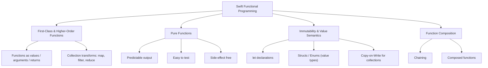
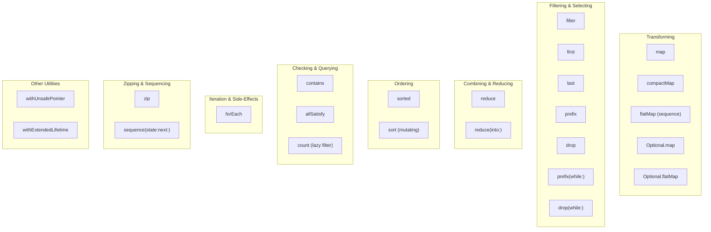
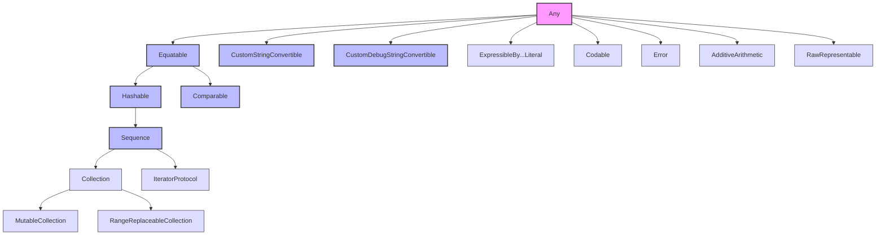

# Swift

Swift 是一门支持多范式的现代编程语言，**函数式编程（Functional Programming）** 是其中重要的编程范式之一。下图展示了 Swift 函数式编程的核心概念及其关系。

## Operators map

下表以分类视图整理了 Swift 标准库中常用的高阶函数与集合操作符,主要从数据源的 转换,过滤,合并,排列,检查,迭代以及其它基础工具用法等方面进行了汇总

# Protocol-Oriented Programming

以下是 Swift 基础语法中面向协议编程（Protocol-Oriented Programming）所涉及的各种“协议类”（Protocols）的详细整理。

Swift 标准库本身就是面向协议编程的典范。根据功能，这些协议可以划分为几个核心层次。

### 🗺️ Swift 面向协议编程全景图

下图展示了 Swift 标准库中主要的协议层次结构及其关系：

---
Swift 的面向协议编程通过定义清晰的“协议类”和利用协议扩展等特性，构建了一个灵活、可组合的类型系统。其核心思想是**专注于类型“能做什么”（能力），而不是它们“是什么”（类型）**。以上是上述图表中各类协议的详细说明，它们共同构成了 Swift 面向协议编程的基础：

#### 1. 基础能力协议 (Basic Behavior Protocols)
这类协议为类型提供了最基础的、通用的能力。

*   **`Equatable`**：**相等性比较**。允许使用 `==` 和 `!=` 运算符比较两个实例是否相等。Swift 的许多基础类型（如 `String`, `Int`）都遵循此协议。
*   **`Hashable`**：**哈希值计算**。用于在 `Set` 或作为 `Dictionary` 的 `Key` 时，能快速查找值。遵循 `Hashable` 的类型必须同时遵循 `Equatable`。
*   **`Comparable`**：**可比较性**。允许使用 `<`, `>`, `<=`, `>=` 等运算符对实例进行排序和比较。
*   **`Identifiable`**：**唯一标识**。为类的实例提供一个稳定的标识概念，常用于 SwiftUI 的列表渲染。
*   **`CustomStringConvertible` & `CustomDebugStringConvertible`**：**自定义文本表示**。分别自定义实例在 `print()` 和调试器中的文本输出。

#### 2. 集合与序列协议 (Collection & Sequence Protocols)
这是 Swift 标准库中设计最精巧的协议族之一，展示了 POP 的强大能力。

*   **`Sequence`**：**序列**。定义了可以**多次迭代**的元素集合，是 `for-in` 循环的基础。它要求一个关联的 `IteratorProtocol` 来提供迭代逻辑。
*   **`Collection`**：**集合**。在 `Sequence` 的基础上，增加了**通过索引多次、非破坏性地访问**元素的能力。`Array` 和 `Dictionary` 等都是其具体实现。
*   **`MutableCollection`**：**可变集合**。允许通过索引修改集合中的元素。
*   **`RangeReplaceableCollection`**：**可替换范围的集合**。支持替换、插入或删除集合中的任意子范围。
*   **`IteratorProtocol`**：**迭代器协议**。为 `Sequence` 提供遍历元素的逻辑，通过其 `next()` 方法逐个返回元素。

#### 3. 数据持久化与转换协议 (Persistence & Conversion Protocols)

*   **`Codable`**：**可编码与可解码**。一个类型别名，组合了 `Encodable` 和 `Decodable` 两个协议，用于在外部表示（如 JSON）和内部模型之间进行转换。
*   **`RawRepresentable`**：**原始值表示**。允许在自定义类型和其原始值（如 `String` 或 `Int`）之间进行转换，常用于枚举。
*   **`ExpressibleBy...Literal`**：**字面量协议**。这是一组协议，允许类型通过字面量进行初始化，例如 `ExpressibleByStringLiteral` 允许用 `"Hello"` 直接创建实例。

#### 4. 错误处理与运算协议 (Error Handling & Arithmetic Protocols)

*   **`Error`**：**错误**。用于 Swift 错误处理机制中表示错误的类型。
*   **`AdditiveArithmetic`**：**加法算术**。为支持加法和减法的数值类型提供基础，如 `Int` 和 `Double`。

#### 5. 核心设计模式与概念 (Core POP Concepts)
除了具体的协议，POP 还包含以下几个核心概念，它们是组织和使用协议的关键。

*   **协议（Protocols）**：定义了一组**属性、方法**和其他要求的蓝图。类、结构体、枚举都可以遵循协议。
*   **协议扩展（Protocol Extensions）**：可以为协议提供**默认实现**，所有遵循该协议的类型都能自动获得这些实现。
*   **协议组合（Protocol Composition）**：一个类型可以同时遵循**多个协议**，从而组合多种能力，这是 POP 中实现代码复用的核心方式。
*   **关联类型（Associated Types）**：在协议中定义一个**占位类型名**，具体的类型由遵循协议的类型来指定，使协议具备泛型的能力。
*   **类型消除（Type Erasure）**：一种设计模式，用于**包装**具有关联类型的协议，使其可以作为具体类型使用，从而解决编译器限制。