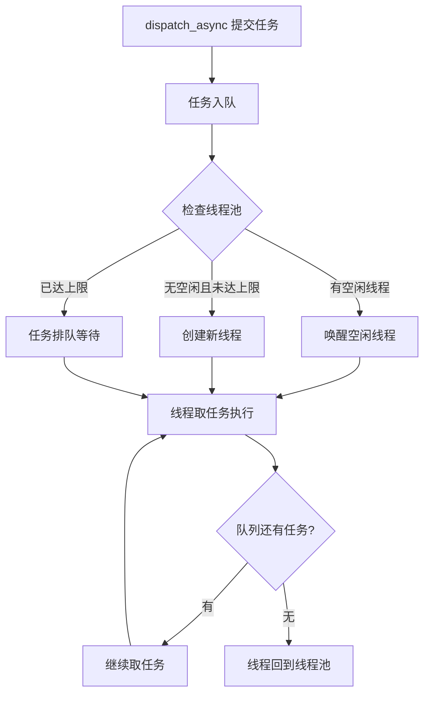

# 并发队列（Concurrent Queue）完全解析

---

## 一、并发队列的核心原理

### 1.1 什么是并发队列？

**并发队列允许同时执行多个任务，任务开始的顺序按 FIFO，但可以并行执行。**

```objc
dispatch_queue_t concurrentQueue = dispatch_queue_create("com.test.concurrent", 
                                                          DISPATCH_QUEUE_CONCURRENT);
```

```
串行队列：
任务1 ████████
             任务2 ████████
                         任务3 ████████
时间 ──────────────────────────────────────►

并发队列：
任务1 ████████
任务2 ████████
任务3 ████████
时间 ──────────────────────────────────────►
```

### 1.2 底层数据结构

```c
// 并发队列的结构（简化）
struct dispatch_queue_concurrent_s {
    struct dispatch_queue_s base;           // 基础队列结构
    
    // 并发队列特有的字段
    int dq_max_concurrent;                  // 最大并发数（动态调整）
    int dq_active_threads;                  // 当前活跃线程数
    
    // 线程池相关
    struct dispatch_thread_pool_s *dq_thread_pool;
    
    // 任务队列（多个线程可以同时取任务）
    struct dispatch_continuation_s *dq_items_head;
    struct dispatch_continuation_s *dq_items_tail;
    dispatch_lock_t dq_lock;
};
```

### 1.3 并发队列与串行队列的关键区别

| 特性 | 串行队列 | 并发队列 |
|------|----------|----------|
| **线程绑定** | 固定绑定一个线程 | 从线程池获取线程，不固定 |
| **线程数量** | 1 个 | 多个（动态） |
| **任务执行** | 上一个执行完才执行下一个 | 多个任务同时执行 |
| **底层循环** | 单线程 while 循环 | 多线程共享任务队列 |
| **线程回收** | 空闲 5 秒后销毁 | 线程复用，回收到线程池 |

---

## 二、并发队列的工作流程

### 2.1 整体流程图



### 2.2 多线程取任务的竞争机制

```c
// 多个线程同时从并发队列取任务
void* _dispatch_concurrent_worker_thread(void* context) {
    dispatch_queue_t dq = (dispatch_queue_t)context;
    
    while (1) {
        // 1. 等待信号量（全局队列的信号量）
        semaphore_wait(dq->dq_semaphore);
        
        // 2. 加锁，取任务
        _dispatch_queue_lock(dq);
        struct dispatch_continuation_s *dc = dq->dq_items_head;
        if (dc) {
            dq->dq_items_head = dc->dc_next;
        }
        _dispatch_queue_unlock(dq);
        
        // 3. 执行任务
        if (dc) {
            dc->dc_func(dc->dc_ctxt);
            _dispatch_continuation_free(dc);
        }
        
        // 4. 继续循环
    }
}

// dispatch_async 唤醒线程
void dispatch_async(dispatch_queue_t dq, dispatch_block_t block) {
    _dispatch_queue_lock(dq);
    
    // 任务入队
    _dispatch_queue_add_item(dq, block);
    
    // 关键：发送信号量，唤醒一个工作线程
    // 线程池中有多个线程在等待这个信号量
    semaphore_signal(dq->dq_semaphore);  // ← 每次唤醒一个
    
    _dispatch_queue_unlock(dq);
}
```

### 2.3 线程池管理

```c
// 全局并发队列共享一个线程池
struct dispatch_thread_pool_s {
    int max_threads;                    // 最大线程数（通常 64）
    int current_threads;               // 当前线程数
    int idle_threads;                  // 空闲线程数
    semaphore_t pool_semaphore;        // 线程池信号量
    pthread_t *threads;                // 线程数组
};

// 获取线程的逻辑
pthread_t _dispatch_thread_pool_get_thread(dispatch_queue_t dq) {
    struct dispatch_thread_pool_s *pool = dq->dq_thread_pool;
    
    // 1. 尝试获取空闲线程
    if (pool->idle_threads > 0) {
        pool->idle_threads--;
        return _dispatch_thread_pool_get_idle(pool);
    }
    
    // 2. 未达上限，创建新线程
    if (pool->current_threads < pool->max_threads) {
        pthread_t thread;
        pthread_create(&thread, NULL, _dispatch_concurrent_worker_thread, dq);
        pool->current_threads++;
        return thread;
    }
    
    // 3. 已达上限，返回 NULL，任务将排队等待
    return NULL;
}
```

---

## 三、sync vs async 在并发队列中的行为

### 3.1 async：异步提交

```objc
dispatch_queue_t concurrentQueue = dispatch_queue_create("test", DISPATCH_QUEUE_CONCURRENT);

for (int i = 0; i < 5; i++) {
    dispatch_async(concurrentQueue, ^{
        NSLog(@"Task %d start on thread: %@", i, [NSThread currentThread]);
        [NSThread sleepForTimeInterval:1];
        NSLog(@"Task %d end", i);
    });
}
NSLog(@"async 立即返回，不等待任务完成");
```

**输出示例**：
```
async 立即返回，不等待任务完成
Task 0 start on thread: <NSThread: 0x600000123456>
Task 1 start on thread: <NSThread: 0x600000123457>
Task 2 start on thread: <NSThread: 0x600000123458>
Task 3 start on thread: <NSThread: 0x600000123459>
Task 4 start on thread: <NSThread: 0x60000012345a>
// 所有任务几乎同时开始，在不同线程上
Task 0 end
Task 1 end
// ...
```

### 3.2 sync：同步提交

```objc
dispatch_queue_t concurrentQueue = dispatch_queue_create("test", DISPATCH_QUEUE_CONCURRENT);

for (int i = 0; i < 3; i++) {
    dispatch_sync(concurrentQueue, ^{
        NSLog(@"Task %d on thread: %@", i, [NSThread currentThread]);
        [NSThread sleepForTimeInterval:1];
    });
    NSLog(@"sync 返回，任务 %d 完成", i);
}
```

**输出示例**：
```
Task 0 on thread: <NSThread: 0x600000123456>  // 可能在当前线程执行
sync 返回，任务 0 完成
Task 1 on thread: <NSThread: 0x600000123456>  // 串行执行！不是并发！
sync 返回，任务 1 完成
Task 2 on thread: <NSThread: 0x600000123456>
sync 返回，任务 2 完成
```

### 3.3 关键发现：sync 在并发队列上会变成串行

```objc
// 验证：sync 会阻塞调用线程，且任务不会并发
dispatch_queue_t concurrentQueue = dispatch_queue_create("test", DISPATCH_QUEUE_CONCURRENT);

dispatch_async(concurrentQueue, ^{
    NSLog(@"Async task on thread: %@", [NSThread currentThread]);
});

dispatch_sync(concurrentQueue, ^{
    NSLog(@"Sync task 1 on thread: %@", [NSThread currentThread]);
});

dispatch_sync(concurrentQueue, ^{
    NSLog(@"Sync task 2 on thread: %@", [NSThread currentThread]);
});

// 输出：所有 sync 任务在同一个线程上串行执行
```

**原因分析**：

```c
// dispatch_sync 的实现逻辑
void dispatch_sync(dispatch_queue_t dq, dispatch_block_t block) {
    if (dq == dispatch_get_current_queue()) {
        // 死锁检测
        _dispatch_sync_f_slow(dq, block);
        return;
    }
    
    // 关键：dispatch_sync 会等待任务完成
    // 同时，为了避免死锁，GCD 会尝试在当前线程执行
    // 如果可能，会在当前线程直接执行
    // 因此不会创建新线程，导致串行化
}
```

---

## 四、barrier 的完整解析

### 4.1 barrier 的作用

**barrier 任务会等待之前提交的所有任务完成，然后执行自己，最后阻塞之后的任务直到它完成。**

```objc
dispatch_queue_t concurrentQueue = dispatch_queue_create("test", DISPATCH_QUEUE_CONCURRENT);

// 普通异步任务（可并发）
for (int i = 0; i < 5; i++) {
    dispatch_async(concurrentQueue, ^{
        NSLog(@"Read task %d", i);
    });
}

// barrier 任务（会等待前面的任务完成，并阻塞后面的任务）
dispatch_barrier_async(concurrentQueue, ^{
    NSLog(@"WRITE task - barrier");
});

// barrier 完成后的任务
for (int i = 0; i < 5; i++) {
    dispatch_async(concurrentQueue, ^{
        NSLog(@"Read task after barrier %d", i);
    });
}
```

**输出顺序**：
```
Read task 0
Read task 2
Read task 1
Read task 4
Read task 3
WRITE task - barrier          // ← 等待所有读完成，单独执行
Read task after barrier 0
Read task after barrier 1
Read task after barrier 2
Read task after barrier 3
Read task after barrier 4
```

### 4.2 barrier 的可视化

```
时间轴 ─────────────────────────────────────────────────────►

普通并发任务：
Task A ████
Task B ████
Task C ████

barrier 任务：
Task A ████
Task B ████
Task C ████
        WRITE ████  ← 等待前面的完成，后面的等待它
                 Task D ████
                 Task E ████
```

### 4.3 barrier 的底层原理

```c
// barrier 的实现逻辑（简化）
void dispatch_barrier_async(dispatch_queue_t dq, dispatch_block_t block) {
    struct dispatch_continuation_s *dc = _dispatch_continuation_alloc();
    dc->dc_func = block;
    
    // 设置 barrier 标志
    dc->dc_flags |= DC_FLAG_BARRIER;
    
    _dispatch_queue_lock(dq);
    
    // 将 barrier 任务入队，并特殊标记
    _dispatch_queue_add_item(dq, dc);
    
    // 关键：不会立即唤醒新线程执行 barrier
    // 而是等待当前正在执行的任务完成
    // 当所有正在执行的任务完成后，才会开始执行 barrier
    
    _dispatch_queue_unlock(dq);
}

// 线程取任务时的 barrier 逻辑
struct dispatch_continuation_s* _dispatch_queue_dequeue(dispatch_queue_t dq) {
    struct dispatch_continuation_s *dc = dq->dq_items_head;
    
    if (dc && (dc->dc_flags & DC_FLAG_BARRIER)) {
        // 检查是否有正在执行的任务
        if (dq->dq_active_threads > 0) {
            // 还有任务在执行，暂不返回 barrier 任务
            return NULL;
        }
    }
    
    // 返回任务
    return dc;
}
```

### 4.4 barrier 的使用限制

```objc
// ❌ barrier 只在自定义并发队列上有效
dispatch_queue_t serialQueue = dispatch_queue_create("serial", DISPATCH_QUEUE_SERIAL);
dispatch_barrier_async(serialQueue, ^{
    // 串行队列上使用 barrier 没有意义，行为等同于普通 async
});

// ❌ 全局队列上 barrier 无效
dispatch_barrier_async(dispatch_get_global_queue(0, 0), ^{
    // 会被当作普通 async 处理
});

// ✅ 只在自定义并发队列上有效
dispatch_queue_t concurrentQueue = dispatch_queue_create("test", DISPATCH_QUEUE_CONCURRENT);
dispatch_barrier_async(concurrentQueue, ^{
    // 真正的 barrier 行为
});
```

---

## 五、完整用法示例

### 5.1 读写锁模式（最经典的 barrier 用法）

```objc
@interface ThreadSafeData : NSObject
- (void)writeData:(id)data;
- (id)readData;
@end

@implementation ThreadSafeData {
    NSMutableArray *_data;
    dispatch_queue_t _concurrentQueue;
}

- (instancetype)init {
    if (self = [super init]) {
        _data = [NSMutableArray array];
        // 创建并发队列用于读写分离
        _concurrentQueue = dispatch_queue_create("com.data.concurrent", 
                                                  DISPATCH_QUEUE_CONCURRENT);
    }
    return self;
}

// 读：可以并发执行
- (id)readData {
    __block id result = nil;
    dispatch_sync(_concurrentQueue, ^{
        // 普通 sync，多个读可以并发
        result = [_data copy];
    });
    return result;
}

// 写：必须独占（使用 barrier）
- (void)writeData:(id)data {
    dispatch_barrier_async(_concurrentQueue, ^{
        // barrier 确保只有一个写操作，且与所有读操作互斥
        [self->_data addObject:data];
    });
}

// 批量写：更高效的写法
- (void)batchWrite:(NSArray *)items {
    dispatch_barrier_async(_concurrentQueue, ^{
        for (id item in items) {
            [self->_data addObject:item];
        }
    });
}

@end
```

### 5.2 多任务协调

```c
// 场景：需要等待多个并发任务完成，然后执行一个汇总任务
dispatch_queue_t concurrentQueue = dispatch_queue_create("test", DISPATCH_QUEUE_CONCURRENT);

__block NSMutableArray *results = [NSMutableArray array];
dispatch_group_t group = dispatch_group_create();

// 并发读取多个数据源
for (int i = 0; i < 10; i++) {
    dispatch_group_async(group, concurrentQueue, ^{
        id result = [self fetchDataFromSource:i];
        @synchronized(results) {
            [results addObject:result];
        }
    });
}

// 等待所有读取完成，然后执行 barrier 写入
dispatch_group_notify(group, concurrentQueue, ^{
    dispatch_barrier_async(concurrentQueue, ^{
        // 所有读取完成后，统一处理
        [self processAllData:results];
        
        dispatch_async(dispatch_get_main_queue(), ^{
            // 更新 UI
            [self reloadUI];
        });
    });
});
```

### 5.3 性能对比：barrier vs 锁

```c
// 方案1：使用 @synchronized
- (void)writeWithLock:(id)data {
    @synchronized(self) {
        [self.data addObject:data];
    }
}
// 性能：较差，所有读写互斥

// 方案2：使用 NSLock
- (void)writeWithNSLock:(id)data {
    [self.lock lock];
    [self.data addObject:data];
    [self.lock unlock];
}
// 性能：中等，仍然所有读写互斥

// 方案3：使用 barrier（推荐）
- (void)writeWithBarrier:(id)data {
    dispatch_barrier_async(self.concurrentQueue, ^{
        [self.data addObject:data];
    });
}
// 性能：最优，读并发、写互斥
```

---

## 六、常见陷阱与最佳实践

### ❌ 陷阱1：在并发队列上使用 sync 导致意外串行

```objc
// 错误理解：以为 sync 也能并发
dispatch_queue_t queue = dispatch_queue_create("test", DISPATCH_QUEUE_CONCURRENT);

for (int i = 0; i < 10; i++) {
    dispatch_sync(queue, ^{
        // 这些任务会串行执行！不是并发！
        NSLog(@"Task %d", i);
    });
}
// 正确：sync 会阻塞当前线程，且 GCD 会优化为在当前线程串行执行
```

### ❌ 陷阱2：barrier 使用不当造成死锁

```objc
// 死锁示例
dispatch_queue_t queue = dispatch_queue_create("test", DISPATCH_QUEUE_CONCURRENT);

dispatch_sync(queue, ^{
    // 当前线程在等待这个任务完成
    dispatch_barrier_sync(queue, ^{
        // barrier 等待前面的任务（包括上面的 sync）完成
        // 形成循环等待 → 死锁
    });
});
```

### ✅ 最佳实践

```c
// 1. 读操作用 sync + 普通 async，写操作用 barrier_async
- (id)read {
    __block id result;
    dispatch_sync(self.concurrentQueue, ^{
        result = [self.data copy];
    });
    return result;
}

- (void)write:(id)data {
    dispatch_barrier_async(self.concurrentQueue, ^{
        [self.data addObject:data];
    });
}

// 2. 避免在 barrier 中调用 sync
dispatch_barrier_async(queue, ^{
    // ❌ 不要这样做
    dispatch_sync(queue, ^{
        // 可能死锁
    });
});

// 3. 合理设置队列标签便于调试
dispatch_queue_t queue = dispatch_queue_create("com.myapp.imageProcessing", 
                                                DISPATCH_QUEUE_CONCURRENT);
```

---

## 七、总结对比表

| 操作 | 队列类型 | 并发行为 | 阻塞调用线程 | 适用场景 |
|------|----------|----------|--------------|----------|
| `async` | 串行 | 串行 | 不阻塞 | 顺序执行 |
| `async` | 并发 | **并发** | 不阻塞 | 多任务并发 |
| `sync` | 串行 | 串行 | 阻塞 | 等待结果 |
| `sync` | 并发 | **串行** | 阻塞 | 等待结果（注意不会并发！）|
| `barrier_async` | 串行 | 同 async | 不阻塞 | 无意义 |
| `barrier_async` | 并发 | **等待前驱，独占执行** | 不阻塞 | 读写锁、同步点 |
| `barrier_sync` | 并发 | **等待前驱，独占执行** | 阻塞 | 需要立即完成的写操作 |

**核心记忆**：
1. **并发队列 + async = 真正并发**
2. **并发队列 + sync = 串行执行**（因为阻塞当前线程）
3. **barrier 只在自定义并发队列有效**
4. **barrier 是实现读写锁的最佳方案**