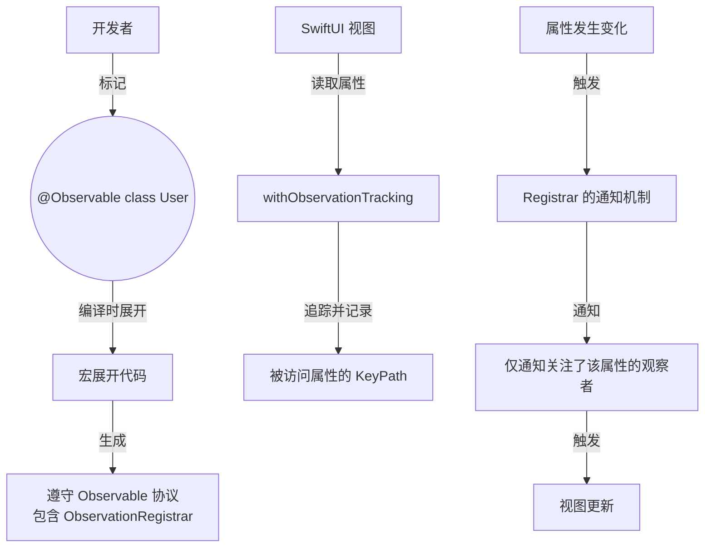
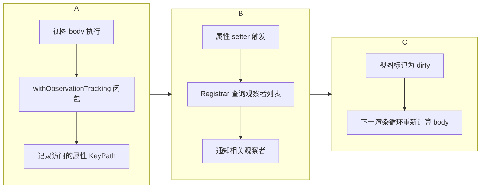

# Combine 框架完全指南

## 一、Combine 核心概念与 API 接口

### 1. 三大核心组件

Combine 的核心可以概括为：**Publisher（发布者）**、**Operator（操作符）**、**Subscriber（订阅者）**。

```swift
// 经典的数据流比喻
// Publisher = 水厂（生产数据）
// Operator = 净水厂（处理数据）  
// Subscriber = 水龙头（消费数据）

// 一个完整的 Combine 链
URLSession.shared.dataTaskPublisher(for: url)
    .map { $0.data }                          // Operator
    .decode(type: User.self, decoder: JSONDecoder()) // Operator
    .replaceError(with: fallbackUser)        // Operator
    .receive(on: DispatchQueue.main)         // 调度器切换
    .sink { user in                          // Subscriber
        self.user = user
    }
    .store(in: &cancellables)                // 内存管理
```

### 2. Publisher 协议

**Publisher** 是数据的生产者，定义了三种可能的状态：
- 发送值（Output）
- 成功完成（Finished）
- 失败终止（Failure）

```swift
protocol Publisher {
    associatedtype Output
    associatedtype Failure: Error
    
    func receive<S>(subscriber: S) where S: Subscriber, 
        S.Input == Output, S.Failure == Failure
}
```

**常用 Publisher 类型**：

```swift
// 1. Just - 发送单个值后立即完成
let justPublisher = Just("Hello")
justPublisher.sink { value in
    print(value)  // 输出: Hello
}

// 2. Future - 异步产生单个结果
func fetchUser() -> Future<User, Error> {
    return Future { promise in
        // 异步操作
        APIClient.fetchUser { result in
            promise(result)
        }
    }
}

// 3. PassthroughSubject - 手动发送值的订阅者
let subject = PassthroughSubject<String, Never>()
subject.send("First")
subject.send("Second")
subject.send(completion: .finished)

// 4. CurrentValueSubject - 带初始值
let currentValue = CurrentValueSubject<Int, Never>(0)
currentValue.send(1)
print(currentValue.value)  // 输出: 1
```

### 3. Operator 操作符

操作符是 Combine 的灵魂，它将 Publisher 进行转换、组合、过滤。

**转换类操作符**：
```swift
// map - 转换值
publisher.map { $0 * 2 }

// flatMap - 将 Publisher 展平
publisher.flatMap { value in
    return fetchData(with: value)  // 返回另一个 Publisher
}

// scan - 累积计算
publisher.scan(0) { $0 + $1 }  // 计算累加和
```

**过滤类操作符**：
```swift
// filter - 条件过滤
publisher.filter { $0 > 10 }

// debounce - 防抖（实时搜索必备）
searchTextField.textPublisher
    .debounce(for: .seconds(0.5), scheduler: RunLoop.main)
    .sink { text in
        // 用户停止输入 0.5 秒后才执行搜索
    }

// removeDuplicates - 去重
publisher.removeDuplicates()  // 连续重复的值只发一次

// throttle - 节流
publisher.throttle(for: .seconds(1), scheduler: RunLoop.main, latest: true)
```

**组合类操作符**：
```swift
// merge - 合并多个 Publisher
let pub1 = Just(1)
let pub2 = Just(2)
let merged = pub1.merge(with: pub2)  // 输出: 1, 2

// combineLatest - 组合最新值
let textPublisher = NotificationCenter.default.publisher(for: UITextField.textDidChangeNotification)
let selectionPublisher = pickerView.selectedPublisher
textPublisher.combineLatest(selectionPublisher)
    .sink { text, selection in
        // 任一变化都触发
    }

// zip - 等待所有 Publisher 都发出值
let request1 = fetchUser()
let request2 = fetchOrders()
request1.zip(request2)
    .sink { user, orders in
        // 两个请求都完成后才触发
    }
```

**错误处理操作符**：
```swift
// catch - 捕获错误并提供备用 Publisher
publisher.catch { error in
    Just(fallbackValue)
}

// retry - 失败重试
publisher.retry(3)  // 最多重试 3 次

// replaceError - 替换错误为默认值
publisher.replaceError(with: defaultValue)
```

### 4. Subscriber 订阅者

```swift
// sink - 最常用的订阅者
publisher.sink(
    receiveCompletion: { completion in
        switch completion {
        case .finished: print("完成")
        case .failure(let error): print("错误: \(error)")
        }
    },
    receiveValue: { value in
        print("收到: \(value)")
    }
)

// assign - 直接赋值给属性
publisher.assign(to: \.isLoading, on: viewModel)
```

**内存管理的关键**：必须持有 `AnyCancellable` 引用。

```swift
class MyViewModel {
    var cancellables = Set<AnyCancellable>()
    
    func setup() {
        publisher
            .sink { ... }
            .store(in: &cancellables)  // ← 关键！
    }
}
```


## 二、底层原理

### 1. 订阅机制

Combine 的订阅机制基于**拉取模式**（pull model），与 RxSwift 的推送模式形成对比：

```swift
// 1. 订阅建立时
publisher.subscribe(subscriber)

// 2. Publisher 创建 Subscription
func receive<S>(subscriber: S) {
    let subscription = MySubscription(subscriber: subscriber)
    subscriber.receive(subscription: subscription)
}

// 3. Subscriber 请求数据
func receive(subscription: Subscription) {
    subscription.request(.unlimited)  // 请求无限数量
}

// 4. Publisher 按需发送
func request(_ demand: Subscribers.Demand) {
    // 根据 demand 生产并发送数据
}

// 5. Subscriber 可动态调整需求
func receive(_ input: Input) -> Subscribers.Demand {
    process(input)
    return .max(1)  // 请求下一个
}
```

### 2. Backpressure 处理

Combine 通过 **Demand** 机制实现背压控制：

```swift
// Subscriber 可以控制接收速度
class MySubscriber: Subscriber {
    typealias Input = Int
    
    func receive(_ input: Int) -> Subscribers.Demand {
        // 处理当前值
        process(input)
        // 请求下一个值（控制速度）
        return .max(1)  // 每次只请求 1 个
    }
}
```

### 3. 冷信号 vs 热信号

```swift
// 冷信号 (Cold)：每次订阅独立执行
let coldPublisher = URLSession.shared.dataTaskPublisher(for: url)
// 每次订阅都会发起新的网络请求

// 热信号 (Hot)：共享执行，新订阅者只收到后续值
let hotSubject = PassthroughSubject<Int, Never>()
let sharedPublisher = hotSubject.share()  // 转换为热信号
```

**关键区别**：
- **冷信号**：无状态，每次订阅独立
- **热信号**：有状态，新订阅者不接收历史值


## 三、线程调度

### 1. Scheduler 协议

Scheduler 是 Combine 的调度抽象，定义了"何时"和"何地"执行闭包。

**重要概念**：Scheduler ≠ Thread。具体在哪条线程执行，取决于你选择的实现。

```swift
protocol Scheduler {
    associatedtype SchedulerTimeType
    associatedtype SchedulerOptions
    
    func schedule(_ action: @escaping () -> Void)
    func schedule(after date: SchedulerTimeType, 
                  tolerance: SchedulerTimeType.Stride, 
                  options: SchedulerOptions?, 
                  _ action: @escaping () -> Void)
}
```

### 2. subscribe(on:) vs receive(on:)

这是 Combine 调度中最容易混淆的两个操作符：

| 操作符           | 影响范围                 | 典型用途                 |
| ---------------- | ------------------------ | ------------------------ |
| `subscribe(on:)` | 订阅、取消订阅、请求数据 | 将昂贵的订阅操作放到后台 |
| `receive(on:)'   | 值传递、完成事件         | 切换到主线程更新 UI      |

```swift
// 实验代码：观察线程变化
let expensivePublisher = Publishers.ExpensiveComputation(duration: 3)

// 1. 不指定调度器 - 全部在当前线程
let sub1 = expensivePublisher
    .sink { value in
        print("收到: \(value)")  // 当前线程
    }
// 输出: Start on thread 1, Received on thread 1

// 2. 使用 subscribe(on:) - 订阅和计算在后台
let queue = DispatchQueue(label: "background")
let sub2 = expensivePublisher
    .subscribe(on: queue)
    .sink { value in
        print("收到: \(value)")  // 后台线程
    }
// 输出: Start on thread 4, Received on thread 4

// 3. 使用 receive(on:) - 计算结果回到主线程
let sub3 = expensivePublisher
    .subscribe(on: queue)
    .receive(on: DispatchQueue.main)
    .sink { value in
        self.updateUI(value)  // 主线程，安全！
    }
// 输出: Start on thread 5, Received on thread 1
```

### 3. 四种 Scheduler 实现

**ImmediateScheduler**：
```swift
// 立即同步执行，不切换线程
.receive(on: ImmediateScheduler.shared)
// ⚠️ 不能用于延迟调度
```

**RunLoop**：
```swift
// 主要用于主线程 RunLoop
.receive(on: RunLoop.main)

// 支持延迟调度
RunLoop.main.schedule(after: .init(Date(timeIntervalSinceNow: 2))) {
    print("2秒后执行")
}
```

**DispatchQueue**：
```swift
// 最常用，支持 QoS
.receive(on: DispatchQueue.main)  // 主队列
.subscribe(on: DispatchQueue.global(qos: .userInitiated))  // 全局队列

// 带 QoS 参数
.receive(on: DispatchQueue.main, 
         options: DispatchQueue.SchedulerOptions(qos: .userInteractive))

// 自定义串行队列
let serialQueue = DispatchQueue(label: "serial")
.receive(on: serialQueue)
```

**OperationQueue**：
```swift
// 注意：OperationQueue 默认并发
let queue = OperationQueue()
queue.maxConcurrentOperationCount = 2

(1...10).publisher
    .receive(on: queue)
    .sink { value in
        print("收到 \(value)")  // 顺序不保证！
    }
```

### 4. SwiftUI 中的主线程保证

```swift
class ViewModel: ObservableObject {
    @Published var data: String = ""
    private var cancellables = Set<AnyCancellable>()
    
    func loadData() {
        fetchFromNetwork()
            .receive(on: DispatchQueue.main)  // 确保在主线程
            .sink { [weak self] value in
                self?.data = value  // 安全更新 UI
            }
            .store(in: &cancellables)
    }
}
```

使用 `@MainActor` 标记确保主线程执行：

```swift
@MainActor
class MainActorViewModel: ObservableObject {
    @Published var data: String = ""
    
    func loadData() {
        Task {
            let result = await fetchData()
            self.data = result  // 自动在主线程
        }
    }
}
```


## 四、Combine vs RxSwift

### 1. 核心差异对比

| 维度                | Combine                  | RxSwift                    |
| ------------------- | ------------------------ | -------------------------- |
| **发布者/可观测物** | `Publisher`              | `Observable`               |
| **订阅者**          | `Subscriber`             | `Observer`                 |
| **订阅令牌**        | `AnyCancellable`         | `Disposable`               |
| **持有策略**        | 必须持有（否则立即取消） | 可选持有（不持有也能收到） |
| **线程安全**        | Subject 线程安全         | Subject 非线程安全         |
| **背压**            | 内置 Demand 机制         | 无内置背压                 |
| **UI 绑定**         | 原生 SwiftUI 支持        | 需 RxCocoa                 |
| **平台支持**        | iOS 13+, 仅 Apple 平台   | 跨平台（iOS, Android, JS） |

### 2. 关键代码对比

```swift
// RxSwift 风格
let disposeBag = DisposeBag()
let observable = Observable.of(1, 2, 3)
observable
    .map { $0 * 2 }
    .subscribe(onNext: { value in
        print(value)
    })
    .disposed(by: disposeBag)  // 自动管理

// Combine 风格
var cancellables = Set<AnyCancellable>()
let publisher = [1, 2, 3].publisher
publisher
    .map { $0 * 2 }
    .sink { value in
        print(value)
    }
    .store(in: &cancellables)  // 必须存储
```

### 3. 性能对比

哈佛大学的研究表明：
- **Combine 在加载时间上优于 RxSwift**
- 代理模式在简单场景下性能最佳
- Combine 的内存消耗略高于 RxSwift

### 4. Combine 的缺点

根据社区反馈：

```swift
// 1. 类型复杂
publisher
    .map { ... }        // 返回 Map<...>
    .filter { ... }     // 返回 Filter<Map<...>>
    .eraseToAnyPublisher()  // 必须频繁擦除

// 2. 缺乏 UIKit 扩展
// RxSwift + RxCocoa: textField.rx.text
// Combine: 需要 NotificationCenter 或自定义

// 3. 没有共享连接的 .whileConnected 概念
// RxSwift: share(replay: 1, scope: .whileConnected)
// Combine: share() 默认 .forever
```


## 五、与 SwiftUI 结合

### 1. ObservableObject + @Published

最简单的状态管理模式：

```swift
class JokeFetcher: ObservableObject {
    @Published var joke: String = ""
    @Published var isLoading: Bool = false
    private var cancellables = Set<AnyCancellable>()
    
    func fetchJoke() {
        isLoading = true
        APIService.fetchRandomJoke()
            .receive(on: DispatchQueue.main)
            .sink(
                receiveCompletion: { [weak self] _ in
                    self?.isLoading = false
                },
                receiveValue: { [weak self] joke in
                    self?.joke = joke
                }
            )
            .store(in: &cancellables)
    }
}

// SwiftUI View
struct ContentView: View {
    @StateObject private var fetcher = JokeFetcher()
    
    var body: some View {
        VStack {
            Text(fetcher.joke)
                .padding()
            if fetcher.isLoading {
                ProgressView()
            }
            Button("Fetch Joke") {
                fetcher.fetchJoke()
            }
        }
    }
}
```

### 2. @Published 的 Combine 能力

```swift
class SearchViewModel: ObservableObject {
    @Published var searchText = ""
    @Published var results: [String] = []
    private var cancellables = Set<AnyCancellable>()
    
    init() {
        $searchText
            .debounce(for: .seconds(0.5), scheduler: RunLoop.main)
            .removeDuplicates()
            .filter { $0.count >= 2 }
            .flatMap { text in
                self.performSearch(query: text)
                    .replaceError(with: [])
            }
            .receive(on: DispatchQueue.main)
            .assign(to: &$results)  // iOS 17+ 新语法
    }
}
```

### 3. 使用 @StateObject 管理生命周期

```swift
// 使用 @StateObject 确保 ViewModel 生命周期与 View 一致
// 使用 @ObservedObject 当 ViewModel 由父视图传入
// 使用 @EnvironmentObject 当 ViewModel 被多个视图共享

struct ParentView: View {
    @StateObject private var viewModel = MyViewModel()  // 创建
    
    var body: some View {
        ChildView(viewModel: viewModel)
    }
}

struct ChildView: View {
    @ObservedObject var viewModel: MyViewModel  // 接收
}
```

### 4. 性能优化技巧

```swift
// 1. 使用 .share() 避免重复订阅
let sharedPublisher = expensivePublisher.share()

// 2. 使用 .buffer 控制背压
publisher
    .buffer(size: 100, prefetch: .keepFull, whenFull: .dropOldest)

// 3. 合理使用 .throttle 和 .debounce
// 实时搜索：使用 debounce
// UI 事件节流：使用 throttle

// 4. 及时取消无用订阅
cancellables.forEach { $0.cancel() }
cancellables.removeAll()
```


## 六、业务场景实战

### 1. 表单验证

```swift
class FormViewModel: ObservableObject {
    @Published var username = ""
    @Published var password = ""
    @Published var isValid = false
    @Published var usernameError: String?
    
    private var cancellables = Set<AnyCancellable>()
    
    init() {
        // 用户名验证
        let usernameValidation = $username
            .map { $0.count >= 3 ? nil : "至少 3 个字符" }
            .share()
        
        usernameValidation
            .assign(to: &$usernameError)
        
        // 整体表单验证
        Publishers.CombineLatest($username, $password)
            .map { username, password in
                username.count >= 3 && password.count >= 6
            }
            .assign(to: &$isValid)
    }
}
```

### 2. 网络请求 + 缓存

```swift
func fetchNews() -> AnyPublisher<[NewsItem], Error> {
    let cachePublisher = loadFromCache()
        .replaceError(with: [])
        .handleEvents(receiveOutput: { print("从缓存加载: \($0.count)条") })
    
    let remotePublisher = fetchFromRemote()
        .handleEvents(receiveOutput: { self.saveToCache($0) })
        .catch { _ in Empty() }
    
    // 优先返回缓存，然后返回网络数据
    return cachePublisher
        .merge(with: remotePublisher)
        .eraseToAnyPublisher()
}
```

### 3. 实时搜索

```swift
class SearchViewModel: ObservableObject {
    @Published var query = ""
    @Published var results: [SearchResult] = []
    @Published var isSearching = false
    
    private var cancellables = Set<AnyCancellable>()
    
    init() {
        $query
            .debounce(for: .seconds(0.5), scheduler: RunLoop.main)
            .removeDuplicates()
            .handleEvents(receiveOutput: { _ in
                self.isSearching = true
            })
            .flatMap { query in
                self.performSearch(query: query)
                    .catch { _ in Just([]) }
                    .replaceError(with: [])
            }
            .receive(on: DispatchQueue.main)
            .handleEvents(receiveOutput: { _ in
                self.isSearching = false
            })
            .assign(to: &$results)
    }
}
```

### 4. 多请求合并

```swift
class DashboardViewModel: ObservableObject {
    @Published var user: User?
    @Published var orders: [Order] = []
    @Published var isLoading = true
    
    func loadDashboard() {
        Publishers.Zip(
            fetchUser(),
            fetchOrders()
        )
        .receive(on: DispatchQueue.main)
        .sink(
            receiveCompletion: { [weak self] _ in
                self?.isLoading = false
            },
            receiveValue: { [weak self] user, orders in
                self?.user = user
                self?.orders = orders
            }
        )
        .store(in: &cancellables)
    }
}
```


## 七、架构演进：从 Combine 到 async/await

### 1. Combine 时代的 MVVM

KINTO Unlimited App 的架构演进展示了 Combine 的局限性：

**第一代架构**：
- UIKit + VIPER + Combine
- 问题：开发成本高，维护困难

**第二代架构**：
- SwiftUI + Combine + UIKit 导航
- 问题：状态管理分散（ViewModel + ScreenModel）

**第三代架构**：
- 放弃 Combine，转向 ViewStore + async/await
- 优势：集中状态管理，代码可读性提升

### 2. 何时使用 Combine vs async/await

| 场景            | 推荐方案                 | 原因                   |
| --------------- | ------------------------ | ---------------------- |
| 复杂数据流组合  | Combine                  | 操作符丰富             |
| 实时 UI 事件    | Combine                  | debounce/throttle 方便 |
| 单一异步任务    | async/await              | 代码更直观             |
| 多任务并发      | async/await              | Task Group 更简单      |
| UIKit 遗留代码  | Combine                  | 已有生态               |
| 纯 SwiftUI 项目 | async/await + @MainActor | 更现代的方案           |

### 3. 混合使用策略

```swift
// async/await 封装 Combine
func fetchData() async throws -> Data {
    return try await withCheckedThrowingContinuation { continuation in
        var cancellable: AnyCancellable?
        cancellable = URLSession.shared.dataTaskPublisher(for: url)
            .map(\.data)
            .sink(
                receiveCompletion: { completion in
                    if case .failure(let error) = completion {
                        continuation.resume(throwing: error)
                    }
                    cancellable?.cancel()
                },
                receiveValue: { data in
                    continuation.resume(returning: data)
                }
            )
    }
}

// Combine 中使用 async/await
publisher
    .flatMap { value in
        Future { promise in
            Task {
                let result = await someAsyncFunction(value)
                promise(.success(result))
            }
        }
    }
```

### 4. 最佳实践建议

**团队协作规范**：

```swift
// 1. 统一使用 cancellables 集合
class BaseViewModel {
    var cancellables = Set<AnyCancellable>()
    deinit { cancellables.removeAll() }
}

// 2. 使用 weak self 避免循环引用
publisher
    .sink { [weak self] value in
        self?.process(value)
    }
    .store(in: &cancellables)

// 3. 为长时间运行的操作添加 .share()
let shared = expensivePublisher.share()

// 4. 网络请求统一使用 .retry()
fetchAPI()
    .retry(3)
    .catch { error -> Just<Fallback> in
        return Just(fallbackValue)
    }
```


## 八、总结

### Combine 的核心优势
- **原生支持**：Apple 官方框架，与 SwiftUI 无缝集成
- **类型安全**：编译时检查，减少运行时错误
- **操作符丰富**：覆盖绝大部分异步场景
- **性能优异**：比 RxSwift 更快的加载时间

### Combine 的局限性
- **学习曲线陡峭**：操作符多，类型复杂
- **调试困难**：类型信息复杂，错误信息不直观
- **UIKit 支持弱**：缺少官方扩展
- **维护成本高**：复杂的数据流难以理解

### 选择建议

```swift
// 推荐使用 Combine：
// ✅ SwiftUI 项目（原生集成）
// ✅ 复杂的数据流转换
// ✅ 实时 UI 事件处理（搜索、表单验证）
// ✅ 多数据源合并

// 考虑 async/await：
// ✅ 简单的网络请求
// ✅ 顺序异步操作
// ✅ 团队对响应式编程不熟悉
// ✅ 新项目（async/await 是未来趋势）
```

Combine 是强大的响应式编程框架，但不应滥用。根据业务复杂度、团队能力和项目阶段选择合适的方案，才能在性能和可维护性之间找到最佳平衡。

# Swift Observation 框架完全指南：从 ObservableObject 到 @Observable 的演进

> `Observation` 框架是 Swift 5.9 引入的一套全新的、性能更优的观察者模式实现。它通过 `@Observable` 宏，将对属性的观察粒度从**对象级**细化到了**属性级**，从根本上解决了 `ObservableObject` 存在的“过度刷新”问题。本文将从基本概念、架构设计、底层原理到实际应用，全面剖析这两个框架的异同与演进。

---

## 1. 引言：为什么需要 Observation 框架？

在 `Observation` 框架出现前，观察引用类型属性变化主要依赖两种方式：

| 方案                           | 限制                                                                                         |
| :----------------------------- | :------------------------------------------------------------------------------------------- |
| **KVO**                        | 仅限于 `NSObject` 子类使用，API 繁琐                                                         |
| **ObservableObject (Combine)** | 观察粒度是**对象级**，对象上任何 `@Published` 属性变化都会导致所有观察该对象的视图被重新计算 |

`ObservableObject` 最大的问题是：它无法区分视图到底依赖了对象的哪个属性。只要对象上任何一个 `@Published` 属性发生变化，所有 `@ObservedObject` 该对象的视图都会被触发刷新——哪怕视图只读取了一个完全无关的属性。

`Observation` 框架正是为解决这一痛点而生。

---

## 2. 核心对比：ObservableObject vs @Observable

### 2.1 快速对比表

| 特性             | ObservableObject (Combine)                                           | @Observable (Observation)                                  |
| :--------------- | :------------------------------------------------------------------- | :--------------------------------------------------------- |
| **观察粒度**     | **对象级**：任何 `@Published` 属性变化，通知所有观察者               | **属性级**：只有视图实际访问的属性变化，才触发该视图更新   |
| **声明方式**     | 需声明 `ObservableObject` 协议，并用 `@Published` 标记每个可观察属性 | 仅需 `@Observable` 宏标记类，所有存储属性默认可观察        |
| **依赖追踪**     | 无自动追踪，观察者会收到对象所有属性的变更通知                       | 自动追踪视图 `body` 中访问的属性，建立精确的依赖关系       |
| **适用类型**     | 仅限 `class`，需继承/遵循特定协议                                    | 所有 Swift 引用类型（`class`），不局限于 `NSObject`        |
| **性能影响**     | 容易产生**大量无效的视图刷新**                                       | **精准刷新**，只更新受影响的部分                           |
| **计算属性支持** | 仅 `@Published` 存储属性触发更新                                     | 计算属性同样可以被追踪                                     |
| **代码量**       | 需手动标记 `@Published`                                              | 宏自动处理，仅需标记不想观察的属性用 `@ObservationIgnored` |

---

## 3. 架构设计：@Observable 的幕后结构

`Observation` 框架围绕 `@Observable` 宏构建，其简化架构如下：



### 3.1 三大核心组件

| 组件                          | 职责                                                                          |
| :---------------------------- | :---------------------------------------------------------------------------- |
| **`@Observable` 宏**          | 编译时展开，为类自动添加 `Observable` 协议遵循，并注入 `ObservationRegistrar` |
| **`ObservationRegistrar`**    | 存储和管理观察者列表，追踪属性访问，负责在属性变化时通知对应观察者            |
| **`withObservationTracking`** | 底层函数，在执行闭包时追踪其中所有被访问的 `@Observable` 对象的属性           |

---

## 4. 底层实现原理与工作流程

### 4.1 三步工作流程



**详细步骤**：

1. **追踪 (Tracking)**：
   - SwiftUI 在渲染视图 `body` 时，在 `withObservationTracking` 闭包中执行 `body` 代码
   - 闭包执行期间，所有被访问的 `@Observable` 对象属性的 **KeyPath** 被自动记录
   - 记录与具体对象实例和视图关联

2. **通知 (Notification)**：
   - 当 `@Observable` 对象存储属性即将改变时，其 `setter` 中的钩子触发
   - 钩子向 `ObservationRegistrar` 发出通知，告知哪个属性发生了变化
   - `ObservationRegistrar` 查询记录，找出关注该特定属性的观察者（视图）

3. **更新 (Update)**：
   - 收到通知的视图被标记为“脏”（dirty）
   - 下一渲染循环中重新计算 `body`
   - 未访问该属性的视图**不会被重新计算**

### 4.2 源码级概念剖析（宏展开伪代码）

虽然无法直接查看 Apple 宏展开后的完整源码，但可以理解其工作方式：

**原始代码**：
```swift
@Observable
class User {
    var name = "John"
    var age = 25
}
```

**宏展开后（概念伪代码）**：
```swift
class User {
    // 原始存储属性（被重写）
    private var _name: String = "John" {
        didSet { 
            registrar.access(self, keyPath: \.name, change: .didChange)
        }
    }
    private var _age: Int = 25 {
        didSet { 
            registrar.access(self, keyPath: \.age, change: .didChange)
        }
    }

    // 计算属性（对外暴露，内部嵌入追踪逻辑）
    var name: String {
        get {
            registrar.access(self, keyPath: \.name, change: .didAccess)
            return _name
        }
        set { _name = newValue }
    }

    var age: Int {
        get {
            registrar.access(self, keyPath: \.age, change: .didAccess)
            return _age
        }
        set { _age = newValue }
    }

    private let registrar = ObservationRegistrar<User>()
}
```

**关键点**：
- `getter` 中插入**追踪代码**，报告“此属性被访问”
- `setter` 中插入**通知代码**，报告“此属性发生变化”
- 整个过程在**编译时**通过宏完成，对开发者透明

---

## 5. 性能对比：为什么 @Observable 更高效？

### 5.1 问题场景：ObservableObject 的无效刷新

```swift
// ❌ ObservableObject 方案
class User: ObservableObject {
    @Published var name = ""
    let age = 20  // 不会触发更新
}

struct ChildView: View {
    @ObservedObject var user: User
    var body: some View {
        Text("Age is \(user.age)")  // 只读取了常量 age
    }
}
```

**问题**：当 `name` 改变时，`ChildView` 也会被重新计算，尽管它只使用了不变的 `age`。这就是 **“对象级”观察** 导致的性能浪费。

### 5.2 解决方案：@Observable 的精准刷新

```swift
// ✅ @Observable 方案
@Observable
class User {
    var name = ""
    var age = 20
}

struct ChildView: View {
    var user: User
    var body: some View {
        Text("Age is \(user.age)")  // 只依赖 age
    }
}
```

**优势**：当 `name` 改变时，`ChildView` **不会被重新计算**，因为 SwiftUI 知道 `ChildView` 的 `body` 只访问了 `age` 属性。

### 5.3 性能对比总结

| 场景                            | ObservableObject                    | @Observable                    |
| :------------------------------ | :---------------------------------- | :----------------------------- |
| 对象有 10 个属性，视图只用 1 个 | 10 个属性任意变化 → 视图刷新        | 只有该 1 个属性变化 → 视图刷新 |
| 复杂数据模型（嵌套对象）        | 任何深层属性变化 → 整个视图层级重算 | 仅依赖链上的视图被重算         |
| 高频更新（如动画、打字）        | 极易产生性能瓶颈                    | 精准响应，性能优异             |

---

## 6. 迁移指南：从 ObservableObject 到 @Observable

### 6.1 基本迁移步骤

| 原 ObservableObject               | 新 @Observable                         |
| :-------------------------------- | :------------------------------------- |
| `class MyModel: ObservableObject` | `@Observable class MyModel`            |
| `@Published var prop`             | `var prop`（默认即可观察）             |
| `@ObservedObject var model`       | `var model`（无需包装器）              |
| `@StateObject var model`          | `@State var model`（如果视图拥有）     |
| `@EnvironmentObject var model`    | `@Environment(MyModel.self) var model` |

### 6.2 迁移示例

**迁移前（ObservableObject）**：
```swift
class Settings: ObservableObject {
    @Published var username = ""
    @Published var isDarkMode = false
}

struct ProfileView: View {
    @ObservedObject var settings: Settings
    var body: some View {
        Text(settings.username)
    }
}
```

**迁移后（@Observable）**：
```swift
@Observable
class Settings {
    var username = ""
    var isDarkMode = false
}

struct ProfileView: View {
    var settings: Settings
    var body: some View {
        Text(settings.username)  // 仅当 username 变化时才刷新
    }
}
```

---

## 7. 关键 API 速查

| API                       | 用途                      | 使用场景             |
| :------------------------ | :------------------------ | :------------------- |
| `@Observable`             | 标记类为可观察            | 数据模型类           |
| `@ObservationIgnored`     | 标记属性不被观察          | 不参与 UI 绑定的属性 |
| `@ObservationTracked`     | 显式标记可观察（默认）    | 一般无需手动使用     |
| `@Bindable`               | 为 @Observable 类生成绑定 | 需要双向绑定时       |
| `withObservationTracking` | 手动追踪属性访问          | 自定义观察逻辑       |
| `@Environment`            | 在视图中注入可观察对象    | 跨视图共享数据       |

---

## 8. 总结

| 维度             | ObservableObject                   | @Observable          |
| :--------------- | :--------------------------------- | :------------------- |
| **观察粒度**     | 对象级                             | **属性级**（精准）   |
| **性能**         | 可能过度刷新                       | **高效**，仅必要刷新 |
| **代码简洁度**   | 需大量标注                         | 宏自动处理           |
| **适用类型**     | 仅 class                           | 所有引用类型         |
| **SwiftUI 集成** | 需要包装器（`@ObservedObject` 等） | 直接使用，无需包装器 |
| **计算属性**     | 不支持追踪                         | **支持追踪**         |
| **引入版本**     | iOS 13+                            | iOS 17+ / macOS 14+  |

> **一句话总结**：`@Observable` 通过**编译时宏展开**和**属性级依赖追踪**，将观察粒度从对象级精准到属性级，让 SwiftUI 视图只在真正依赖的数据变化时才刷新，大幅提升了大型应用的渲染性能。对于新项目，应优先使用 `@Observable`；对于现有项目，Apple 也提供了平滑的迁移路径。