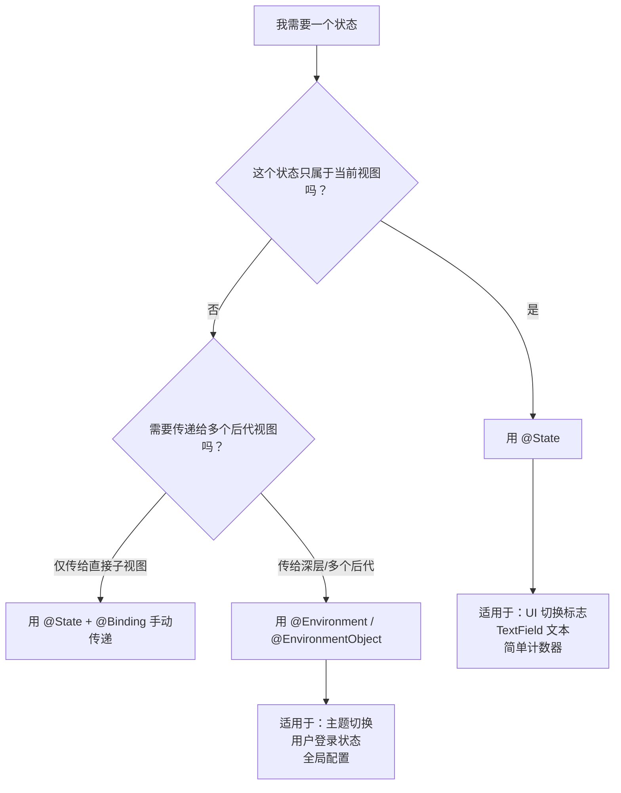

# Swift UI

## SwiftUI 是什么？

SwiftUI 是苹果在 2019 年（WWDC19）推出的**声明式 UI 框架**，用于在 Apple 平台（iOS、macOS、watchOS、tvOS、visionOS）上构建用户界面。它完全基于 Swift 语言特性，用简洁、可读性高的代码描述界面“应该长什么样”和“如何响应状态变化”。

## 与 UIKit 的主要区别

| 维度 | UIKit | SwiftUI |
|------|-------|---------|
| **编程范式** | **命令式**：手动创建/更新视图、管理生命周期 | **声明式**：描述目标状态，框架自动处理变化 |
| **界面构建** | Storyboard / XIB / 纯代码（繁琐） | 纯 Swift 代码（DSL），实时预览 |
| **状态管理** | 需手动监听、更新各 UI 组件 | `@State`、`@ObservedObject` 等属性包装器自动驱动 UI 刷新 |
| **自动布局** | 用约束或 frame 手动管理，易出错 | 默认使用弹性/堆栈布局，自动处理大部分布局逻辑 |
| **跨平台** | 各平台 API 差异大，需单独适配 | 一套代码可适配多平台（条件编译或抽象） |
| **动画** | 需要显式 `UIView.animate` | 动画隐式或显式跟随状态变化，易实现 |
| **成熟度** | 2007 年起，极其成熟、生态丰富 | 相对年轻（5+ 年），部分复杂场景仍需 UIKit |
| **性能控制** | 细粒度控制渲染、runloop、图层 | 框架内部优化，通常足够但黑盒较多 |

## 为什么要创建 SwiftUI？

1. **简化开发**：减少 UI 代码量 50%~70%，降低入门门槛。
2. **提高生产力**：实时预览、热重载（动态替换代码立即看到效果）。
3. **统一多平台**：一次学习，多平台使用，减少重复工作。
4. **适应现代 Swift 语言**：利用枚举、结构体、协议、泛型、属性包装器。
5. **减少错误**：消除大量因状态与 UI 不同步引起的 bug。
6. **面向未来**：配合 Combine 响应式编程、Swift 并发模型，构建更安全的 app。

## SwiftUI 的工作流程

1. **视图声明**：开发者用 `View` 协议和 `@ViewBuilder` 构建视图树（描述结构，不是实例）。
2. **状态驱动**：使用 `@State`、`@Binding`、`@ObservedObject` 等标记可变数据。
3. **依赖记录**：SwiftUI 渲染系统自动记录每个视图依赖哪些状态。
4. **状态变化触发**：当一个状态值改变，系统标记对应的视图为“需要更新”。
5. **重新生成 Body**：SwiftUI 重新执行该视图的 `body` 计算属性，生成新的视图描述。
6. **差异比较（Diffing）**：新老视图树对比，找出最小变化集。
7. **更新底层渲染**：将变化应用到 UIKit/AppKit/CoreAnimation 等底层框架。

## 实现原理（简化）

SwiftUI 是**高度抽象化的响应式系统**，其核心设计：

- **视图是值类型**：`View` 是临时值，每次状态变化都会重新创建，不是一直持有。
- **属性包装器**：`@State` 将值存储到外部存储区，`@Binding` 传递引用。
- **视图类型擦除**：`some View` 让具体类型隐藏在协议后，方便组合。
- **运行时依赖图**：SwiftUI 内部维护一个“依赖图”，确保仅更新受影响视图。
- **双树结构**：
  - **声明树**（View 树）：开发者看到的，轻量级。
  - **渲染树**（属性树）：实际用于布局和绘制的数据结构。
- **与 UIKit 桥接**：`UIViewRepresentable` 将 UIKit 控件包装进 SwiftUI；`UIHostingController` 将 SwiftUI 视图放入 UIKit 层级。

### 底层机制浅览

- **布局系统**：`_VariadicView` 处理多种子视图，`Layout` 协议支持自定义布局。
- **事务（Transaction）**：动画和状态更新打包成事务，保证一致性。
- **渲染循环**：结合 Core Animation，但由 SwiftUI 驱动帧更新。

## 简单代码对比

**UIKit 命令式（添加一个标签并更新）：**
```swift
let label = UILabel()
label.text = "初始值"
view.addSubview(label)
// 后来更新
label.text = "新值"
```

**SwiftUI 声明式：**
```swift
@State var text = "初始值"
var body: some View {
    Text(text)
}
// 修改状态即自动刷新
text = "新值"
```

>SwiftUI 是苹果下一代 UI 框架，通过声明式语法和响应式状态管理大幅提高开发效率和代码安全性，但短期内不会完全替代 UIKit（尤其是复杂、性能敏感或需要深度定制布局的场景）。在实际项目中，SwiftUI + UIKit 混编是常见且成熟的做法。

## SwiftUI 与 Flutter 的核心区别

两者都是现代声明式 UI 框架，但底层哲学、生态和定位差异巨大。

| 维度 | SwiftUI | Flutter |
|------|---------|---------|
| **开发公司** | Apple | Google |
| **编程语言** | Swift | Dart |
| **目标平台** | Apple 生态（iOS, macOS, watchOS, tvOS, visionOS） | 全平台（iOS, Android, Web, Windows, macOS, Linux, Fuchsia） |
| **渲染机制** | 直接使用平台原生控件（UIKit/AppKit 包装） | **自绘引擎**（Skia/Impeller），不依赖平台控件 |
| **性能特性** | 接近原生，因为就是原生控件 | 60/120fps 流畅，但首帧稍慢，包体积较大（至少 ~5MB 引擎） |
| **与原生交互** | 无缝互调用 UIKit/AppKit，无需桥接开销 | 通过 Platform Channel（异步消息传递，有序列化成本） |
| **热重载** | ✅ 支持（但依赖 Xcode，稳定性一般） | ✅ 成熟、快速（毫秒级，保留状态） |
| **跨平台一致** | ❌ 各平台外观与行为遵循原生规范（Human Interface Guidelines 与 Material You 差异明显） | ✅ 外观高度一致（除非刻意使用 Cupertino 组件模仿 iOS） |
| **学习曲线** | 需要先懂 Swift + 部分 UIKit 概念（对于复杂功能） | 需要学习 Dart 语言 + Flutter 整套体系（包括 Widget、状态管理、异步等） |
| **成熟度（2026）** | 5+ 年，稳定，但复杂场景仍需 UIKit 兜底 | 7+ 年，非常成熟，大厂广泛使用（如字节、阿里、腾讯） |
| **包大小增量** | 几乎无额外开销（依赖系统框架） | 增加约 5–10 MB（引擎 + 资源） |
| **状态管理** | `@State`, `@ObservedObject`, `@Environment`（原生属性包装器） | 需要额外库（Provider, Riverpod, BLoC）或框架自带 `setState` |
| **布局系统** | 类似 Flexbox 的 `HStack`/`VStack`/`ZStack` + 修饰符 | 基于 `Widget` 组合，使用 `Row`/`Column`/`Stack`（概念相似但更细粒度） |
| **动画** | 隐式/显式跟随状态，轻量级 | `AnimatedWidget`、`AnimationController`（更强大但更复杂） |
| **开发者体验** | Xcode（较重，实时预览有时不稳定） | VS Code / Android Studio + 命令行（轻量、热重载非常成熟） |
| **就业市场** | 以 iOS 原生岗位为主，需掌握 UIKit + SwiftUI | 跨平台岗位专门招 Flutter 开发，需求量大 |
| **适合场景** | Apple 平台独占应用、与原生深度集成（HealthKit, ARKit 等） | 快速多平台交付（尤其 Android + iOS），团队规模小，UI 不需严格原生感 |

---

## 深层次原理差异

### 1. 渲染管线
- **SwiftUI**：最终转换为 `UIView` / `NSView` 树，由系统控件渲染。这意味着布局、绘制、触摸事件都由原生框架处理。
- **Flutter**：从底层接管绘图，Dart 代码构建 `Widget` → 生成 `Element` → 生成 `RenderObject` → 调用 Skia/Impeller 绘制到 `Surface`（通常是 OpenGL/Vulkan/Metal）。不经过系统 UI 控件。

### 2. 跨平台策略
- **SwiftUI**：非真正的跨平台——虽然代码可部分复用，但内部会用 `#if os(iOS)` 区分平台行为。最终编译成平台原生应用。
- **Flutter**：真正的跨平台——同一套 Dart 代码，编译为 ARM/ x86 二进制，通过嵌入层（Flutter Engine）在 Android/iOS 等上运行。

### 3. 与原生通信
- **SwiftUI**：直接调用 Swift APIs，同步、无序列化开销。例如直接访问相机、Core Data、Metal。
- **Flutter**：通过 `MethodChannel` 进行异步、序列化（JSON/二进制）通信。高频或低延迟场景（如传感器、视频流）需要优化。

### 4. 语言与生态
- **Swift**：强类型、协议导向、内存安全、性能优异（接近 C++）。但只在 Apple 平台通用。
- **Dart**：JIT 支持热重载，AOT 编译成高效机器码。学习曲线平坦（类似 Java/JS）。但第三方库丰富度不及原生双端。

---

## 何时选择谁？

### 选 SwiftUI 的情况
- 只需要做 Apple 生态应用（尤其 iOS + watchOS 组合）。
- 需要深度使用苹果独有框架（SiriKit, Core Haptics, Metal, RealityKit 等）。
- 团队已经是 Swift/iOS 方向，不想引入新语言。
- 对包大小极度敏感（如 App Clip 或下载限制类应用）。
- 希望 UI 完美符合 Apple 设计规范（且不要求与 Android 完全一致）。

### 选 Flutter 的情况
- 需要同时覆盖 iOS + Android（+ Web/Desktop 未来扩展）。
- 希望两个平台 UI 体验高度一致（如品牌定制设计，不追求原生感）。
- 快速 MVP 或创业公司，单个团队即可输出多平台。
- 已有 Dart 基础或考虑 Google 生态（Firebase, Fuchsia 等）。
- 不介意增加几 MB 包体积，且对性能（除首帧外）要求主流应用级别。

---

## 客观评价

- **性能**：Flutter 复杂动画有时比 SwiftUI 更稳定（SwiftUI 早期存在布局循环、列表滑动卡顿问题，后续版本持续改善）。Flutter 无桥接层，密集计算场景更有优势。
- **成熟度**：SwiftUI 适合 80% 的 Apple 原生场景，但边缘复杂需求仍需用 `UIViewRepresentable` 兜底。Flutter 整套工具链（调试、性能分析、国际化、热重载）更成熟。
- **趋势**：Apple 持续加码 SwiftUI，未来将是 iOS 开发主流。Google 对 Flutter 投入也很大（尤其 Fuchsia OS），但在移动端增长遇到一些瓶颈（KMP、React Native 竞争）。

> 一句话总结：**SwiftUI 是 Apple 原生开发者的未来，Flutter 是跨平台性价比的优选。** 两者不是直接替代关系，而是解决不同层面的问题。

在 SwiftUI 和 Swift 中，“属性包装器 (Property Wrapper)”是一种代码复用机制，允许你定义一套逻辑（如数据存储、读取、验证、监听）来封装属性的 `getter` 和 `setter`。所有官方的此类特性在声明时都以 `@` 符号作为标识。

我将这些内置包装器分为五大类，按实际使用频率排序，方便你系统掌握。

---

### 一、状态与数据流 (核心·必须掌握)

这是 SwiftUI 响应式编程的基石，负责管理数据变化和 UI 更新。

| 包装器 | 核心用途 | 生命周期/所有权 | 使用场景 | 示例 |
| :--- | :--- | :--- | :--- | :--- |
| **`@State`** | 管理**当前视图内部**的、属于**值类型**的私有数据。 | **SwiftUI 管理**：在视图被销毁时，`@State` 存储的数据也会被销毁。 | 简单的 UI 状态，如一个 `Bool` 控制弹窗显示、一个 `String` 存储输入框内容、一个 `Int` 作为计数器。 | `@State private var isPresented = false` |
| **`@Binding`** | 建立一个对其他数据源的读写连接，**不持有**数据。 | **外部管理**：它只是现有数据（如 `@State`）的一个“引用”。 | 子视图需要修改父视图传递过来的 `@State` 数据时，接收父视图传来的 `$isPresented`。 | `@Binding var isOn: Bool` |
| **`@StateObject`** | 管理**当前视图内部**的、符合 `ObservableObject` 协议的**引用类型**实例。 | **SwiftUI 管理**：保证在整个视图生命周期中，该对象是**唯一且不会重新创建**的。 | 当你的数据模型是一个 `class`，包含复杂的业务逻辑或多个属性，且这个数据只被当前视图及子视图使用时。 | `@StateObject private var model = MyViewModel()` |
| **`@ObservedObject`** | 持有**从外部传入**的、符合 `ObservableObject` 协议的引用类型实例。 | **外部管理**：它不负责创建对象，只是“观察”外部传入的对象。 | 接收父视图通过 `@StateObject` 创建并传递过来的 `MyViewModel`。 | `@ObservedObject var model: MyViewModel` |
| **`@EnvironmentObject`** | 从 SwiftUI 的**全局环境**中读取共享的、符合 `ObservableObject` 协议的实例。 | **外部管理**：通过在 App 入口或父视图使用 `.environmentObject()` 注入。 | 深层级的、跨越多层视图的全局共享数据，如用户登录信息、应用设置、主题等。 | `@EnvironmentObject var userSettings: UserSettings` |
| **`@Environment`** | 读取系统或自定义的**环境值**（`struct` 类型）。 | **SwiftUI 管理**：由 SwiftUI 框架或父视图通过 `.environment()` 提供。 | 获取系统的 `\.colorScheme` (深色/浅色模式)、`\.locale` (语言地区)、`\.dismiss` (关闭当前视图) 等。 | `@Environment(\.colorScheme) var colorScheme` |
| **`@Bindable`** | 为 `@Observable` 宏标记的 `class` 提供**创建 `$` 绑定的能力**。 | 与 `@State` 或 `@Environment` 配合。 | **iOS 17+**，当你的 `class` 使用 `@Observable` 宏替代 `ObservableObject` 时，子视图需要用 `@Bindable var` 来接收并修改其属性。 | `@Bindable var book: Book` |

### 二、应用与场景委托 (生命周期)

用于在 SwiftUI 应用生命周期中集成 UIKit/AppKit 的委托回调。

| 包装器 | 核心用途 | 使用场景 |
| :--- | :--- | :--- |
| **`@UIApplicationDelegateAdaptor`** | 将 `UIApplicationDelegate` 适配到 SwiftUI 应用中。 | 需要在应用启动、进入后台或接收远程推送时执行代码，例如配置 Firebase、注册推送通知。 |
| **`@NSApplicationDelegateAdaptor`** | 将 `NSApplicationDelegate` 适配到 SwiftUI 应用中 (macOS)。 | macOS 应用的类似委托处理。 |
| **`@WKExtensionDelegateAdaptor`** | 将 `WKExtensionDelegate` 适配到 SwiftUI 应用中 (watchOS)。 | Apple Watch 应用的委托处理。 |

### 三、交互与焦点 (UI细节)

处理用户交互时的特定状态，如焦点、手势、动画。

| 包装器 | 核心用途 | 使用场景 |
| :--- | :--- | :--- |
| **`@FocusState`** | 管理键盘焦点，控制哪个输入框当前为第一响应者。 | 在表单中，点击“下一步”按钮时自动让下一个 TextField 获取焦点；收起键盘。 |
| **`@GestureState`** | 临时存储手势动作**期间**的动态状态。 | 实现长按震动、拖拽时实时记录偏移量。手势结束时，其值会自动重置为初始值。 |
| **`@Namespace`** | 创建一个命名空间，用于视图间的几何匹配（Hero 动画）。 | 实现列表头像点击后平滑放大到详情页顶部的效果 (`matchedGeometryEffect`)。 |

### 四、数据持久化 (本地存储)

简化用户默认设置和场景恢复的存储与读取。

| 包装器 | 核心用途 | 存储位置 | 使用场景 |
| :--- | :--- | :--- | :--- |
| **`@AppStorage`** | 读写 `UserDefaults`，自动持久化设置。 | `UserDefaults` | 存储用户偏好，如“是否开启消息通知”、“上次登录的用户名”、“音量大小”等。 |
| **`@SceneStorage`** | 读写当前 Scene（场景）的临时状态，用于状态恢复。 | SwiftUI 私有存储（非 `UserDefaults`） | 恢复用户在 Split View 中选择的 Tab 标签、NavigationView 的导航栈深度（当应用从后台恢复时）。 |

### 五、辅助与适配 (UI优化)

帮助视图更好地适配系统变化，如动态字体、辅助功能。

| 包装器 | 核心用途 | 使用场景 |
| :--- | :--- | :--- |
| **`@ScaledMetric`** | 根据用户的**动态字体大小设置**自动缩放数值（如宽度、高度、间距）。 | 图标大小随文字放大而放大，确保在辅助功能大字体模式下布局不错乱。 |
| **`@Published`** | **不是 SwiftUI 的 UI 包装器**，它是 Combine 框架中的，用于标记 `ObservableObject` 类中的属性，当属性变化时通知观察者。 | 在 `class MyViewModel: ObservableObject` 内部，标记 `@Published var name: String`。 |

---

### 关于 `@propertyWrapper` 宏

你需要知道，所有这些 `@` 开头的能力，都是基于 Swift 语言底层的 `@propertyWrapper` 特性构建的。如果你想了解如何创建自己的属性包装器，只需定义一个结构体或类，并实现一个 `wrappedValue` 属性即可。

```swift
// 自定义一个截断文本的属性包装器示例
@propertyWrapper
struct Truncated {
    private var value: String = ""
    private let limit: Int
    
    var wrappedValue: String {
        get { value }
        set { 
            if newValue.count > limit {
                value = String(newValue.prefix(limit)) + "..."
            } else {
                value = newValue
            }
        }
    }
    
    init(limit: Int) {
        self.limit = limit
    }
}
```

### 总结：iOS 版本选择建议

- **iOS 13 - 16**：掌握 `@State`, `@Binding`, `@StateObject`, `@ObservedObject`, `@EnvironmentObject` (即 **1** 和 **2**)。
- **iOS 17+**：优先学习 **`@Observable` 宏**配合 **`@State`**、**`@Environment`** 和 **`@Bindable`**。这会简化很多旧版本中 `ObservableObject` 的繁琐代码。

如果想深入了解某个特定包装器（比如 `@State` 的底层原理或 `@Bindable` 的具体用法），可以随时告诉我。

在 SwiftUI 和 Swift 中，“属性包装器 (Property Wrapper)”是一种代码复用机制，允许你定义一套逻辑（如数据存储、读取、验证、监听）来封装属性的 `getter` 和 `setter`。所有官方的此类特性在声明时都以 `@` 符号作为标识。

我将这些内置包装器分为五大类，按实际使用频率排序，方便你系统掌握。

---

### 一、状态与数据流 (核心·必须掌握)

这是 SwiftUI 响应式编程的基石，负责管理数据变化和 UI 更新。

| 包装器 | 核心用途 | 生命周期/所有权 | 使用场景 | 示例 |
| :--- | :--- | :--- | :--- | :--- |
| **`@State`** | 管理**当前视图内部**的、属于**值类型**的私有数据。 | **SwiftUI 管理**：在视图被销毁时，`@State` 存储的数据也会被销毁。 | 简单的 UI 状态，如一个 `Bool` 控制弹窗显示、一个 `String` 存储输入框内容、一个 `Int` 作为计数器。 | `@State private var isPresented = false` |
| **`@Binding`** | 建立一个对其他数据源的读写连接，**不持有**数据。 | **外部管理**：它只是现有数据（如 `@State`）的一个“引用”。 | 子视图需要修改父视图传递过来的 `@State` 数据时，接收父视图传来的 `$isPresented`。 | `@Binding var isOn: Bool` |
| **`@StateObject`** | 管理**当前视图内部**的、符合 `ObservableObject` 协议的**引用类型**实例。 | **SwiftUI 管理**：保证在整个视图生命周期中，该对象是**唯一且不会重新创建**的。 | 当你的数据模型是一个 `class`，包含复杂的业务逻辑或多个属性，且这个数据只被当前视图及子视图使用时。 | `@StateObject private var model = MyViewModel()` |
| **`@ObservedObject`** | 持有**从外部传入**的、符合 `ObservableObject` 协议的引用类型实例。 | **外部管理**：它不负责创建对象，只是“观察”外部传入的对象。 | 接收父视图通过 `@StateObject` 创建并传递过来的 `MyViewModel`。 | `@ObservedObject var model: MyViewModel` |
| **`@EnvironmentObject`** | 从 SwiftUI 的**全局环境**中读取共享的、符合 `ObservableObject` 协议的实例。 | **外部管理**：通过在 App 入口或父视图使用 `.environmentObject()` 注入。 | 深层级的、跨越多层视图的全局共享数据，如用户登录信息、应用设置、主题等。 | `@EnvironmentObject var userSettings: UserSettings` |
| **`@Environment`** | 读取系统或自定义的**环境值**（`struct` 类型）。 | **SwiftUI 管理**：由 SwiftUI 框架或父视图通过 `.environment()` 提供。 | 获取系统的 `\.colorScheme` (深色/浅色模式)、`\.locale` (语言地区)、`\.dismiss` (关闭当前视图) 等。 | `@Environment(\.colorScheme) var colorScheme` |
| **`@Bindable`** | 为 `@Observable` 宏标记的 `class` 提供**创建 `$` 绑定的能力**。 | 与 `@State` 或 `@Environment` 配合。 | **iOS 17+**，当你的 `class` 使用 `@Observable` 宏替代 `ObservableObject` 时，子视图需要用 `@Bindable var` 来接收并修改其属性。 | `@Bindable var book: Book` |

### 二、应用与场景委托 (生命周期)

用于在 SwiftUI 应用生命周期中集成 UIKit/AppKit 的委托回调。

| 包装器 | 核心用途 | 使用场景 |
| :--- | :--- | :--- |
| **`@UIApplicationDelegateAdaptor`** | 将 `UIApplicationDelegate` 适配到 SwiftUI 应用中。 | 需要在应用启动、进入后台或接收远程推送时执行代码，例如配置 Firebase、注册推送通知。 |
| **`@NSApplicationDelegateAdaptor`** | 将 `NSApplicationDelegate` 适配到 SwiftUI 应用中 (macOS)。 | macOS 应用的类似委托处理。 |
| **`@WKExtensionDelegateAdaptor`** | 将 `WKExtensionDelegate` 适配到 SwiftUI 应用中 (watchOS)。 | Apple Watch 应用的委托处理。 |

### 三、交互与焦点 (UI细节)

处理用户交互时的特定状态，如焦点、手势、动画。

| 包装器 | 核心用途 | 使用场景 |
| :--- | :--- | :--- |
| **`@FocusState`** | 管理键盘焦点，控制哪个输入框当前为第一响应者。 | 在表单中，点击“下一步”按钮时自动让下一个 TextField 获取焦点；收起键盘。 |
| **`@GestureState`** | 临时存储手势动作**期间**的动态状态。 | 实现长按震动、拖拽时实时记录偏移量。手势结束时，其值会自动重置为初始值。 |
| **`@Namespace`** | 创建一个命名空间，用于视图间的几何匹配（Hero 动画）。 | 实现列表头像点击后平滑放大到详情页顶部的效果 (`matchedGeometryEffect`)。 |

### 四、数据持久化 (本地存储)

简化用户默认设置和场景恢复的存储与读取。

| 包装器 | 核心用途 | 存储位置 | 使用场景 |
| :--- | :--- | :--- | :--- |
| **`@AppStorage`** | 读写 `UserDefaults`，自动持久化设置。 | `UserDefaults` | 存储用户偏好，如“是否开启消息通知”、“上次登录的用户名”、“音量大小”等。 |
| **`@SceneStorage`** | 读写当前 Scene（场景）的临时状态，用于状态恢复。 | SwiftUI 私有存储（非 `UserDefaults`） | 恢复用户在 Split View 中选择的 Tab 标签、NavigationView 的导航栈深度（当应用从后台恢复时）。 |

### 五、辅助与适配 (UI优化)

帮助视图更好地适配系统变化，如动态字体、辅助功能。

| 包装器 | 核心用途 | 使用场景 |
| :--- | :--- | :--- |
| **`@ScaledMetric`** | 根据用户的**动态字体大小设置**自动缩放数值（如宽度、高度、间距）。 | 图标大小随文字放大而放大，确保在辅助功能大字体模式下布局不错乱。 |
| **`@Published`** | **不是 SwiftUI 的 UI 包装器**，它是 Combine 框架中的，用于标记 `ObservableObject` 类中的属性，当属性变化时通知观察者。 | 在 `class MyViewModel: ObservableObject` 内部，标记 `@Published var name: String`。 |

---

### 关于 `@propertyWrapper` 宏

你需要知道，所有这些 `@` 开头的能力，都是基于 Swift 语言底层的 `@propertyWrapper` 特性构建的。如果你想了解如何创建自己的属性包装器，只需定义一个结构体或类，并实现一个 `wrappedValue` 属性即可。

```swift
// 自定义一个截断文本的属性包装器示例
@propertyWrapper
struct Truncated {
    private var value: String = ""
    private let limit: Int
    
    var wrappedValue: String {
        get { value }
        set { 
            if newValue.count > limit {
                value = String(newValue.prefix(limit)) + "..."
            } else {
                value = newValue
            }
        }
    }
    
    init(limit: Int) {
        self.limit = limit
    }
}
```
## SwiftUI属性包装器相关类图

```mermaid
classDiagram
    direction TB
    
    class DynamicProperty {
        <<protocol>>
    }
    
    class ObservableObject {
        <<protocol>>
        +objectWillChange: ObservableObjectPublisher
    }
    
    class State~Value~ {
        <<@propertyWrapper>>
        +wrappedValue: Value
        +projectedValue: Binding~Value~
        +init(wrappedValue: Value)
    }
    State ..|> DynamicProperty
    
    class StateObject~ObjectType~ {
        <<@propertyWrapper>>
        <<@MainActor>> <<@preconcurrency>>
        +wrappedValue: ObjectType
        +projectedValue: ObservedObject~ObjectType~.Wrapper
        +init(wrappedValue: ObjectType)
    }
    StateObject ..|> DynamicProperty
    StateObject ..> ObservableObject : ObjectType conforms
    
    class Binding~Value~ {
        <<@propertyWrapper>>
        <<@dynamicMemberLookup>>
        +wrappedValue: Value
        +projectedValue: Binding~Value~
        +init(get: () -> Value, set: (Value) -> Void)
        +subscript(dynamicMember keyPath: WritableKeyPath~Value, Subject~) : Binding~Subject~
    }
    
    class Bindable~Value~ {
        <<@propertyWrapper>>
        <<@dynamicMemberLookup>>
        +wrappedValue: Value
        +projectedValue: Binding~Value~
        +subscript(dynamicMember keyPath: ReferenceWritableKeyPath~Value, Subject~) : Binding~Subject~
    }
    
    class Environment~Value~ {
        <<@propertyWrapper>>
        +wrappedValue: Value
        +projectedValue: Binding~Value~
        +init()
    }
    Environment ..|> DynamicProperty
    
    class EnvironmentObject~ObjectType~ {
        <<@propertyWrapper>>
        <<@MainActor>> <<@preconcurrency>>
        +wrappedValue: ObjectType
        +projectedValue: ObservedObject~ObjectType~.Wrapper
        +init()
    }
    EnvironmentObject ..|> DynamicProperty
    EnvironmentObject ..> ObservableObject : ObjectType conforms
    
    class ObservedObject~ObjectType~ {
        <<@propertyWrapper>>
        <<@MainActor>> <<@preconcurrency>>
        +wrappedValue: ObjectType
        +projectedValue: Binding~ObjectType~?  "实际是ObservedObject<ObjectType>.Wrapper"
        +init(wrappedValue: ObjectType)
        +init(initialValue: ObjectType)
    }
    ObservedObject ..|> DynamicProperty
    ObservedObject ..> ObservableObject : ObjectType conforms
    
    class Published~Value~ {
        <<@propertyWrapper>>
        +wrappedValue: Value
        +projectedValue: Published~Value~.Publisher
    }
    
    note for State "存储值类型状态，视图私有\n存储由 SwiftUI 管理"
    note for StateObject "生命周期由 SwiftUI 保证唯一性\n强引用 ObservableObject"
    note for ObservedObject "不拥有生命周期\n接收外部传入的 ObservableObject"
    note for EnvironmentObject "从环境隐式获取\n需要上游 .environmentObject()"
    note for Environment "读取系统/自定义环境值"
    note for Binding "值和写操作的间接引用\n用于子视图修改父视图状态"
    note for Bindable "iOS 17+\n为 @Observable 宏的类提供 $ 绑定"
    
    State --> Binding : projectedValue 类型为\nBinding<Value>
    Bindable --> Binding : projectedValue 类型为\nBinding<Value>
    Binding --> Binding : subscript 返回\nBinding<Subject>
    Bindable --> Binding : subscript 返回\nBinding<Subject>
    
    Environment --> Binding : projectedValue 类型为\nBinding<Value>
    
    StateObject --> ObservedObject : projectedValue 类型为\nObservedObject<ObjectType>.Wrapper
    EnvironmentObject --> ObservedObject : projectedValue 类型为\nObservedObject<ObjectType>.Wrapper
```



```swift
     @State;
        //@frozen @propertyWrapper public struct State<Value> : DynamicProperty {
        @StateObject;
        //@MainActor @frozen @propertyWrapper @preconcurrency public struct StateObject<ObjectType> : DynamicProperty where ObjectType : ObservableObject {
        @Binding;
        //@frozen @propertyWrapper @dynamicMemberLookup public struct Binding<Value>
        //public subscript<Subject>(dynamicMember keyPath: WritableKeyPath<Value, Subject>) -> Binding<Subject>
        @Bindable;
        //@dynamicMemberLookup @propertyWrapper public struct Bindable<Value>
        //public subscript<Subject>(dynamicMember keyPath: ReferenceWritableKeyPath<Value, Subject>) -> Binding<Subject> { get }
        @Environment;
        //@frozen @propertyWrapper public struct Environment<Value> : DynamicProperty
        @EnvironmentObject;
        //@MainActor @frozen @propertyWrapper @preconcurrency public struct EnvironmentObject<ObjectType> : DynamicProperty where ObjectType : ObservableObject
        ObservableObject;
        //public protocol ObservableObject : AnyObject
        @ObservedObject;
        //@MainActor @propertyWrapper @preconcurrency @frozen public struct ObservedObject<ObjectType> : DynamicProperty where ObjectType : ObservableObject
```

## `@State` 与 `@Environment` 的区别

这两个属性包装器虽然都用于在 SwiftUI 中管理状态，但它们的**职责范围**和**数据流向**完全不同。

### 核心区别一句话

| | **`@State`** | **`@Environment`** |
|--|-------------|-------------------|
| **作用范围** | **视图局部** | **视图层级全局** |
| **数据所有权** | 当前视图**私有拥有** | 被**祖先视图共享** |
| **传递方式** | 隐式，不需要手动传递 | 通过环境隐式传递给后代 |
| **适用数据** | 简单的值类型（Bool, Int, String, struct） | 需要在多个视图中共享的数据（主题、设置、ViewModel 等） |
| **数据持久化** | 视图销毁时释放 | 视图销毁时释放（除非用更外层存储） |

---

## 详细对比

| 维度 | `@State` | `@Environment` |
|------|---------|---------------|
| **存储位置** | SwiftUI 为每个视图单独维护的内部存储 | SwiftUI 维护的“环境值”字典，从视图树根部向下传递 |
| **访问方式** | `$stateValue` 获得 Binding | 通过 `\.keyPath` 访问预定义或自定义的环境值 |
| **能否被后代修改** | 可以通过 `$binding` 传递给子视图 | 可以通过修改 `@Environment` 值或 `EnvironmentObject` 触发更新 |
| **典型用法** | TextField 的文本、Sheet 的呈现标志、本地 UI 状态 | `colorScheme`、`locale`、`dismiss`、`openURL`、共享数据模型 |
| **跨视图传递** | 需要手动用 `@Binding` 一层层传递 | **自动**沿视图树向下传递，无需手动 |

---

## 代码示例对比

### `@State` 示例：视图私有状态

```swift
struct CounterView: View {
    @State private var count = 0  // 只有这个视图关心
    
    var body: some View {
        VStack {
            Text("Count: \(count)")
            Button("Increment") {
                count += 1  // 直接修改
            }
            // 如果需要传给子视图，要用 $ 创建 Binding
            CounterDisplay(count: $count)
        }
    }
}

// 子视图接收 Binding
struct CounterDisplay: View {
    @Binding var count: Int  // 注意是 @Binding，不是 @State
    
    var body: some View {
        Text("Display: \(count)")
    }
}
```

### `@Environment` 示例：视图层级共享

```swift
// 1. 在祖先视图中注入环境值
struct ParentView: View {
    @State private var isDarkMode = false
    
    var body: some View {
        ChildView()
            .environment(\.colorScheme, isDarkMode ? .dark : .light)
            .environment(\.dismiss)  // 使用系统提供的环境值
    }
}

// 2. 在任何后代视图中读取环境值
struct ChildView: View {
    @Environment(\.colorScheme) var colorScheme  // 读取系统或自定义环境值
    @Environment(\.dismiss) var dismiss          // 调用 dismiss 方法
    
    var body: some View {
        VStack {
            Text("当前主题: \(colorScheme == .dark ? "深色" : "浅色")")
            Button("关闭") {
                dismiss()  // 调用环境中的方法
            }
        }
    }
}
```

### 传递复杂数据模型 - 两种方式对比

```swift
// 方式一：用 @State + @Binding 手动传递（适合浅层嵌套）
struct GrandparentView: View {
    @State private var user = User(name: "张三")  // 源头
    
    var body: some View {
        ParentView(user: $user)  // 必须手动传
    }
}

struct ParentView: View {
    @Binding var user: User  // 接收并继续传
    var body: some View {
        ChildView(user: $user)  // 继续手动传
    }
}

struct ChildView: View {
    @Binding var user: User  // 终于用上了
    var body: some View {
        Text(user.name)
    }
}

// 方式二：用 @EnvironmentObject（适合深层嵌套）
// 先在祖先视图注入
GrandparentView()
    .environmentObject(userManager)

// 任何后代视图直接取用，无需手动传递
struct DeepNestedView: View {
    @EnvironmentObject var userManager: UserManager  // 自动获取
    // 或使用 @Environment(\.userManager) 自定义环境值
}
```

---

## 系统提供的一些常用环境值

```swift
struct SomeView: View {
    @Environment(\.colorScheme) var colorScheme      // 深色/浅色模式
    @Environment(\.locale) var locale               // 语言区域
    @Environment(\.sizeCategory) var sizeCategory   // 字体大小设置
    @Environment(\.dismiss) var dismiss             // 关闭当前视图
    @Environment(\.openURL) var openURL             // 打开链接
    @Environment(\.isPresented) var isPresented     // 是否被呈现
    @Environment(\.horizontalSizeClass) var horizontalSizeClass  // 水平尺寸类别
}
```

---

## 底层原理简述

### `@State` 的原理

1. SwiftUI 将 `@State` 变量的实际存储**移出视图结构体本身**
2. 存储在 SwiftUI 框架维护的持久化存储区中
3. 视图结构体只存储一个**指针**指向该存储位置
4. 当 `@State` 值改变时，SwiftUI 重新调用 `body` 重建视图

```swift
// 编译后概念上类似：
struct CounterView {
    var _count: State<Int>  // 存储的是指针，不是实际值
}
```

### `@Environment` 的原理

1. 每个 SwiftUI 视图都有一个隐式的 `EnvironmentValues` 字典
2. 通过 `.environment(keyPath:value)` 修饰符修改该字典
3. 环境值**沿着视图树向下传递**（子视图自动继承）
4. 当环境值改变时，所有依赖该值的视图都会刷新

```swift
// 概念类似：
struct MyView {
    @Environment(\.colorScheme) var colorScheme
    // 等价于：从 EnvironmentValues 字典中读取 .colorScheme 键的值
}
```

---

## 选择指南



---

## 常见误区

### 误区 1：用 `@State` 存储复杂共享数据
```swift
// ❌ 错误：App 级别数据不应该用 @State
struct ContentView: View {
    @State var appSettings = AppSettings()  // 其他视图无法访问
}
```

### 误区 2：认为 `@Environment` 可以任意修改
```swift
@Environment(\.colorScheme) var colorScheme

// ❌ 错误：不能直接修改
Button("切换主题") {
    colorScheme = .dark  // 编译错误！
}

// ✅ 正确：通过注入不同的环境值来改变
ParentView()
    .environment(\.colorScheme, .dark)
```

### 误区 3：忘记注入就用 `@Environment`
```swift
struct DetailView: View {
    @EnvironmentObject var user: UserManager  // 如果祖先没注入，崩溃！
}
// 必须在祖先调用 .environmentObject(UserManager())
```

---

## 总结表格

| 场景 | 推荐方案 |
|------|---------|
| 按钮的 pressed 状态 | `@State` |
| TextField 的输入文本 | `@State` |
| Sheet 的展示标志 | `@State` |
| 子视图需要修改父视图的 `@State` | 父视图用 `@State` + 子视图用 `@Binding` |
| 深色模式适配 | `@Environment(\.colorScheme)` |
| 多语言/本地化 | `@Environment(\.locale)` |
| 深层嵌套视图都需要的用户数据 | `@EnvironmentObject` 或 `@Environment` |
| 自定义全局主题 | 定义 `ThemeKey` + `@Environment(\.theme)` |

**记住：`@State` 是你自己的小秘密，`@Environment` 是大家都知道的公共信息。**