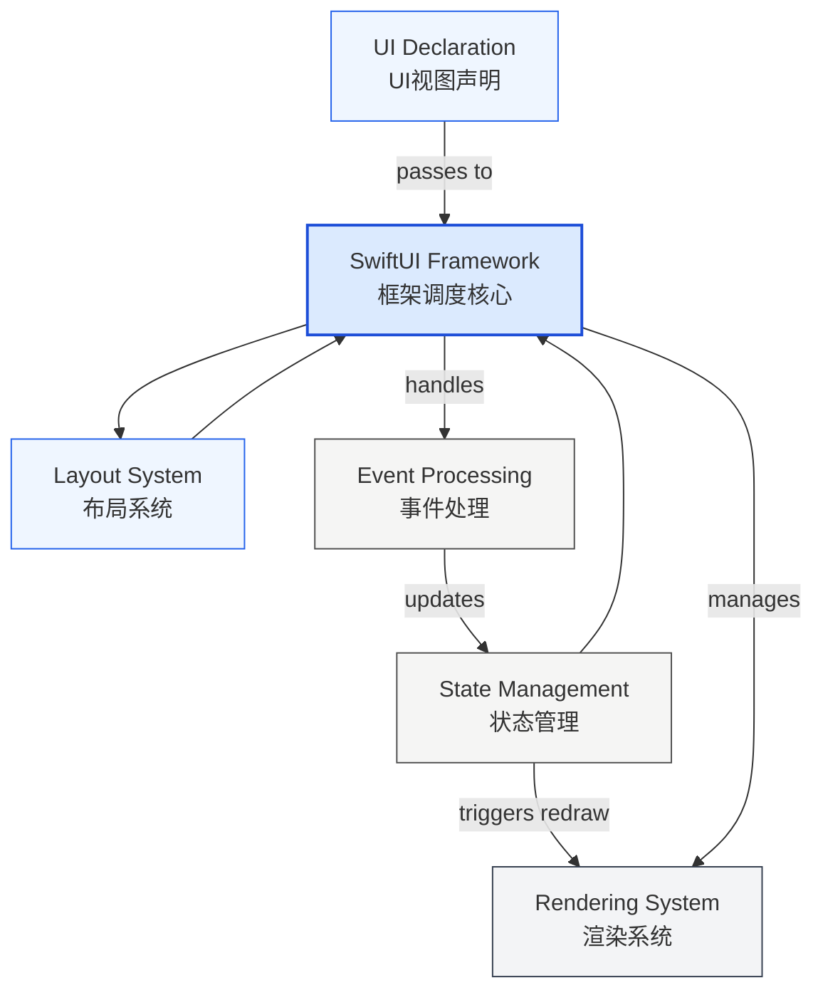
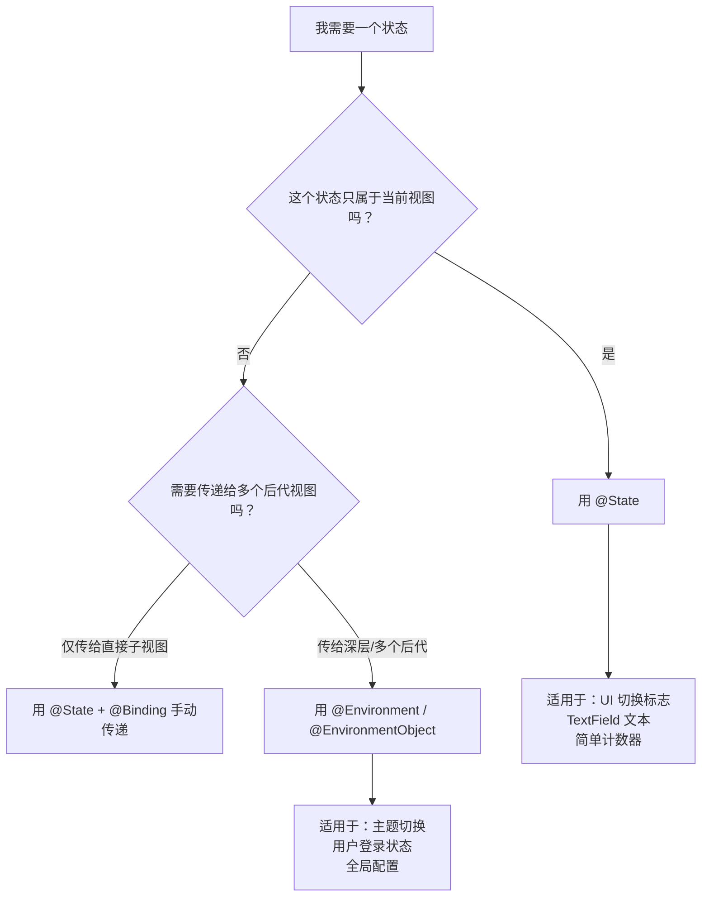

# Swift UI

## SwiftUI 是什么？

SwiftUI 是苹果在 2019 年（WWDC19）推出的**声明式 UI 框架**，用于在 Apple 平台（iOS、macOS、watchOS、tvOS、visionOS）上构建用户界面。它完全基于 Swift 语言特性，用简洁、可读性高的代码描述界面“应该长什么样”和“如何响应状态变化”。

## SwiftUI的核心架构

SwiftUI 采用声明式语法，您只需描述 UI 应该做什么，它的状态更新完全由SwiftUI框架管理和更新,它是典型的MVVM+申明式UI架构。

数据传递到UI: 通过属性包装器以及视图与属性包装起关联,在底层实现数据流的model数据流的监听。如果之前使用RxSwift写过UI,那它的功能就相当于在ViewController中绑定了viewModel提供的各种Rx数据流。

UI事件传递到ViewModel: 支持持久viewModel执行对应的方法,然后ViewModel再执行对应的方法


```mermaid
flowchart TD
    %% 样式美化：圆角、分层配色、柔和边框
    classDef ui fill:#EFF6FF,stroke:#2563EB,stroke-width:1px,rounded:8
    classDef core fill:#DBEAFE,stroke:#1D4ED8,stroke-width:2px,rounded:10
    classDef logic fill:#F5F5F4,stroke:#525252,stroke-width:1px,rounded:8
    classDef render fill:#F3F4F6,stroke:#374151,stroke-width:1px,rounded:8

    %% 所有节点，无subgraph，纵向从上至下排布
    A["UI Declaration<br/>UI视图声明"]:::ui
    B["Layout System<br/>布局系统"]:::ui
    C["SwiftUI Framework<br/>框架调度核心"]:::core
    D["Event Processing<br/>事件处理"]:::logic
    E["State Management<br/>状态管理"]:::logic
    F["Rendering System<br/>渲染系统"]:::render

    %% 完全还原原图箭头与文字标注
    A -- passes to --> C
    C --> B
    B --> C

    C -- handles --> D
    D -- updates --> E
    E -- triggers redraw --> F
    C -- manages --> F
    E --> C
```

以下是SwiftUI的核心组成部分,基于协议范式设计,定义了各种不同功能的协议来约束对应UI组件的模型数据


```mermaid
classDiagram
    direction LR
    %% 核心协议
    class View {
        <<protocol>>
        +body: some View
    }
    class App {
        <<protocol>>
        +body: some Scene
    }
    class Scene {
        <<protocol>>
    }
    class ViewModifier {
        <<protocol>>
        +body: some View
    }
    class Animatable {
        <<protocol>>
        +animatableData: T
    }
    class AnimatableModifier {
        <<protocol>>
    }
    class Shape {
        <<protocol>>
        +path(in: CGRect) -> Path
    }
    class ObservableObject {
        <<protocol>>
        +objectWillChange: ObservableObjectPublisher
    }
    class Identifiable {
        <<protocol>>
        +id: ID
    }
    class Equatable {
        <<protocol>>
        +==
    }
    class Hashable {
        <<protocol>>
    }
    class DynamicProperty {
        <<protocol>>
    }
    class PreferenceKey {
        <<protocol>>
        +defaultValue: Value
        +reduce(value:nextValue:)
    }

    %% 样式协议
    class ButtonStyle {
        <<protocol>>
        +makeBody(configuration: Configuration) -> some View
    }
    class ToggleStyle {
        <<protocol>>
        +makeBody(configuration: Configuration) -> some View
    }
    class LabelStyle {
        <<protocol>>
        +makeBody(configuration: Configuration) -> some View
    }
    class TextFieldStyle {
        <<protocol>>
        +_body(configuration: TextField<Label>) -> some View
    }
    class ListStyle {
        <<protocol>>
    }
    class GroupBoxStyle {
        <<protocol>>
        +makeBody(configuration: Configuration) -> some View
    }
    class ProgressViewStyle {
        <<protocol>>
        +makeBody(configuration: Configuration) -> some View
    }

    %% 桥接协议
    class UIViewRepresentable {
        <<protocol>>
        +makeUIView(context:) -> UIView
        +updateUIView(_:context:)
    }
    class UIViewControllerRepresentable {
        <<protocol>>
        +makeUIViewController(context:) -> UIViewController
        +updateUIViewController(_:context:)
    }

    %% 常用视图结构体（都遵循 View）
    class Text {
        +font: Font
        +foregroundColor: Color
    }
    class Image {
        +resizable()
    }
    class Button {
        +action: () -> Void
        +label: () -> Label
    }
    class List {
        +data: Collection
        +rowContent: (Element) -> Row
    }
    class NavigationView {
        +content: () -> Content
    }
    class TabView {
        +selection: Binding<SelectionValue>?
    }
    class HStack {
        +alignment: VerticalAlignment
        +spacing: CGFloat?
    }
    class VStack {
        +alignment: HorizontalAlignment
        +spacing: CGFloat?
    }
    class ZStack {
        +alignment: Alignment
    }
    class Spacer {
        +minLength: CGFloat?
    }
    class Divider {
    }

    %% 继承/遵循关系
    View <|-- Shape
    View <|-- UIViewRepresentable
    View <|-- UIViewControllerRepresentable
    View <|-- Text
    View <|-- Image
    View <|-- Button
    View <|-- List
    View <|-- NavigationView
    View <|-- TabView
    View <|-- HStack
    View <|-- VStack
    View <|-- ZStack
    View <|-- Spacer
    View <|-- Divider

    ViewModifier <|-- AnimatableModifier
    Animatable <|-- AnimatableModifier

    Equatable <|-- Hashable

    %% 关联（可选）
    Button --o ButtonStyle
    List --o ListStyle
    TextFieldStyle --o TextField
    Toggle --o ToggleStyle
    Label --o LabelStyle
    GroupBox --o GroupBoxStyle
    ProgressView --o ProgressViewStyle
```

### 📘 组件与协议简要描述

#### 1. 核心构建协议（App, Scene, View）
- **`App`**  
  所有 SwiftUI 应用的入口协议。遵循该协议，定义应用的 `body` 属性，返回一个或多个 `Scene`。

- **`Scene`**  
  应用界面容器的抽象，包括窗口、菜单栏等。常见的实现有 `WindowGroup`、`DocumentGroup` 和 `Settings`。

- **`View`**  
  SwiftUI 一切界面的根基。它要求实现一个 `body` 属性，该属性描述了视图的内容和布局。所有内置视图（如 `Text`、`Button`）和自定义视图都遵循此协议。

#### 2. 视图修饰器（ViewModifier, AnimatableModifier）
- **`ViewModifier`**  
  用于封装可复用的视图修改逻辑。通过 `.modifier()` 应用各种修饰到视图上,有点类似俄罗斯套娃,每加一次就生成一个新的`ModifiedContent`,把当前的对象作为新对象的内层content,和flutter视图模型配置恰好相反

- **`Animatable`**  
  使自定义类型可以驱动动画。提供 `animatableData` 属性，用于逐帧插值。

- **`AnimatableModifier`**  
  结合了 `ViewModifier` 和 `Animatable`，使修饰器能够响应动画变化。

#### 3. 图形与形状（Shape）
- **`Shape`**  
  遵循 `View` 的协议，用于绘制矢量图形。需要实现 `path(in:)` 方法，返回一个 `Path` 对象。常见的实现有 `Rectangle`、`Circle` 和 `Capsule`。

#### 4. 数据流与状态管理
- **`ObservableObject`**  
  用于声明可观察的数据模型对象。配合 `@Published` 属性包装器，当属性变化时自动通知视图刷新。

- **`Identifiable`**  
  为数据模型提供唯一标识符，常用于 `ForEach` 等需要高效识别元素的场景。

- **`Equatable` / `Hashable`**  
  `Equatable` 用于比较两个值是否相等；`Hashable` 则允许自定义类型在集合（如 `Set`）或作为字典的键值使用。

- **`DynamicProperty`**  
  实现自定义属性包装器的基础协议，允许包装器响应依赖的状态变化。

- **`PreferenceKey`**  
  用于在视图层次结构中向上传递数据（如子视图向父视图传递尺寸信息）。需要定义默认值和合并方法。

#### 5. 样式协议（Style Protocols）
这些协议将视图的“外观”与“内容”解耦，允许全局或局部定制样式：

- **`ButtonStyle`**：自定义按钮外观。
- **`ToggleStyle`**：自定义开关控件样式。
- **`LabelStyle`**：自定义标签（图标+文字）样式。
- **`TextFieldStyle`**：自定义文本输入框样式。
- **`ListStyle`**：自定义列表样式（如 `PlainListStyle`、`GroupedListStyle`）。
- **`GroupBoxStyle`**：自定义分组框外观。
- **`ProgressViewStyle`**：自定义进度指示器样式。

#### 6. 桥接协议（UIKit Interoperability）
- **`UIViewRepresentable`**  
  用于将 `UIView`（UIKit 视图）封装成 SwiftUI 视图。需要实现创建和更新的方法。

- **`UIViewControllerRepresentable`**  
  用于将 `UIViewController`（UIKit 控制器）封装成 SwiftUI 视图。

#### 7. 常用内置视图（均遵循 `View`）
- **`Text`**：显示静态或动态文本。
- **`Image`**：显示系统或自定义图片。
- **`Button`**：响应用户点击的交互控件。
- **`List`**：滚动列表，支持动态数据和行选择。
- **`NavigationView`**：导航容器，支持页面推入/弹出。
- **`TabView`**：标签页容器，用于切换不同子视图。
- **`HStack` / `VStack` / `ZStack`**：水平、垂直或层叠布局容器。
- **`Spacer`**：填充空白空间，用于弹性布局。
- **`Divider`**：分割线，用于视觉分隔内容。

---

> 以上仅列出了最核心的协议和视图类型，SwiftUI 标准库还包括许多其他协议（如 `DynamicViewContent`、`ActionProtocol` 等），但上述已覆盖 90% 以上的开发场景。
- 图中的关联线（如 `Button --o ButtonStyle`）表示可应用样式的关系，并非严格的类型继承，但有助于理解它们如何协同工作。

## SwiftUI组件对照表

以下是 SwiftUI 主要 UI 组件的分类汇总表格，涵盖了常用组件及其核心用途。

### 🧱 基础视图 (Basic Views)

| 组件 (Component) | 用途 (Purpose)                                   | UIKit 对照                     |
| :--------------- | :----------------------------------------------- | :----------------------------- |
| **Text**         | 显示静态或动态的文本内容。                       | `UILabel`                      |
| **Image**        | 显示图片，支持 SF Symbols 和网络图片。           | `UIImageView`                  |
| **Label**        | 同时显示文本和图标，常用于带图标的标题或按钮。   | `UILabel` + `UIImageView` 组合 |
| **Button**       | 响应用户点击事件的交互控件。                     | `UIButton`                     |
| **Link**         | 创建一个超链接，点击后可在浏览器中打开指定 URL。 | -                              |

### 📐 布局容器 (Layout Containers)

| 组件 (Component)   | 用途 (Purpose)                                   | UIKit 对照                      |
| :----------------- | :----------------------------------------------- | :------------------------------ |
| **HStack**         | 水平排列子视图。                                 | `UIStackView` (horizontal)      |
| **VStack**         | 垂直排列子视图。                                 | `UIStackView` (vertical)        |
| **ZStack**         | 层叠（覆盖）排列子视图。                         | `UIView` 手动添加子视图         |
| **LazyHStack**     | 水平排列子视图，但子视图会在滚动时按需加载。     | `UICollectionView`              |
| **LazyVStack**     | 垂直排列子视图，但子视图会在滚动时按需加载。     | `UICollectionView`              |
| **LazyHGrid**      | 水平滚动的网格布局，网格项按需加载。             | `UICollectionView`              |
| **LazyVGrid**      | 垂直滚动的网格布局（如瀑布流），网格项按需加载。 | `UICollectionView`              |
| **Spacer**         | 填充父视图中的剩余空间，用于弹性布局。           | `UILayoutGuide` / `UIView`      |
| **Divider**        | 绘制一条视觉分割线。                             | `UIView` (frame 设为 1pt)       |
| **Group**          | 逻辑分组视图，不产生视觉影响，常用于组织代码。   | -                               |
| **GeometryReader** | 读取父视图的尺寸和位置，实现自适应布局。         | `UIView` 的 `frame` 和 `bounds` |

### 📋 列表与表单 (Lists & Forms)

| 组件 (Component) | 用途 (Purpose)                                       | UIKit 对照                    |
| :--------------- | :--------------------------------------------------- | :---------------------------- |
| **List**         | 显示可滚动、可选的垂直项目列表。                     | `UITableView`                 |
| **Section**      | 在 `List` 或 `Form` 中对行进行逻辑分组。             | `UITableView` 的 section      |
| **Form**         | 创建用于数据输入的表单界面，自带分组样式。           | `UITableView` (Grouped Style) |
| **Table**        | 创建多列表格（主要用于 macOS，从 iOS 16 开始支持）。 | -                             |

### 🧭 导航 (Navigation)

| 组件 (Component)    | 用途 (Purpose)                                          | UIKit 对照                        |
| :------------------ | :------------------------------------------------------ | :-------------------------------- |
| **NavigationView**  | 提供视图层级导航的容器（已被 `NavigationStack` 取代）。 | `UINavigationController`          |
| **NavigationStack** | iOS 16+ 引入的层级导航容器，管理视图的压栈与弹栈。      | `UINavigationController`          |
| **NavigationLink**  | 在导航容器内创建可点击的跳转链接。                      | `UIViewController` 的 `push` 操作 |
| **TabView**         | 创建底部标签栏，用于切换不同视图。                      | `UITabBarController`              |
| **Toolbar**         | 在屏幕顶部或底部添加工具栏。                            | `UIToolbar`                       |
| **ToolbarItem**     | 定义 `Toolbar` 中的一个具体按钮或元素。                 | `UIBarButtonItem`                 |

### 🎛️ 交互控件与输入 (Controls & Input)

| 组件 (Component) | 用途 (Purpose)                               | UIKit 对照             |
| :--------------- | :------------------------------------------- | :--------------------- |
| **TextField**    | 单行文本输入框。                             | `UITextField`          |
| **SecureField**  | 安全的文本输入框，用于密码等敏感信息。       | `UITextField` (secure) |
| **TextEditor**   | 多行、可滚动的文本输入区域。                 | `UITextView`           |
| **Toggle**       | 开关控件，用于打开或关闭某个选项。           | `UISwitch`             |
| **Slider**       | 滑块，用于在一定范围内选择一个值。           | `UISlider`             |
| **Stepper**      | 步进器，用于按固定步长增减数值。             | `UIStepper`            |
| **Picker**       | 选择器，提供多种样式（如轮盘、菜单、分段）。 | `UIPickerView`         |
| **DatePicker**   | 日期和时间选择器。                           | `UIDatePicker`         |
| **ColorPicker**  | 颜色选择器。                                 | -                      |

### 📊 指示器与进度 (Indicators & Progress)

| 组件 (Component) | 用途 (Purpose)                                            | UIKit 对照       |
| :--------------- | :-------------------------------------------------------- | :--------------- |
| **ProgressView** | 显示任务进度（可表示确定或不确定进度）。                  | `UIProgressView` |
| **Gauge**        | 仪表盘视图，用于显示一个范围内的值（主要在 watchOS 上）。 | -                |

### 🔔 弹窗与菜单 (Alerts, Sheets & Menus)

| 组件 (Component) | 用途 (Purpose)                     | UIKit 对照                        |
| :--------------- | :--------------------------------- | :-------------------------------- |
| **Alert**        | 显示一个简单的弹窗警告。           | `UIAlertController` (Alert)       |
| **ActionSheet**  | 显示一个从底部弹出的操作菜单。     | `UIAlertController` (ActionSheet) |
| **Sheet**        | 模态弹出一个新的视图。             | `UIModalPresentationStyle`        |
| **Menu**         | 显示一个下拉或弹出式菜单。         | `UIMenuController`                |
| **ContextMenu**  | 长按或右键点击时显示的上下文菜单。 | `UIContextMenuInteraction`        |

### 🖱️ 手势 (Gestures)

SwiftUI 通过修饰符（Modifier）提供手势支持。

*   **`.onTapGesture`**：点击手势。
*   **`.onLongPressGesture`**：长按手势。
*   **`.dragGesture()`**：拖动手势。
*   **`.magnificationGesture()`**：缩放手势。
*   **`.rotationGesture()`**：旋转手势。

### ✨ 动画与过渡 (Animation & Transition)

| 功能 (Feature)      | 用途 (Purpose)                   | UIKit 对照          |
| :------------------ | :------------------------------- | :------------------ |
| **`.animation()`**  | 为视图状态变化添加动画。         | `UIView.animate()`  |
| **`.transition()`** | 定义视图出现或消失时的过渡效果。 | `UIView` 的过渡效果 |

### 🧠 状态管理 (State Management)

| 功能 (Feature)           | 用途 (Purpose)                           |
| :----------------------- | :--------------------------------------- |
| **`@State`**             | 管理视图内部的私有状态。                 |
| **`@Binding`**           | 创建对 `@State` 或其他数据源的双向引用。 |
| **`@ObservedObject`**    | 观察外部 `ObservableObject` 对象的状态。 |
| **`@StateObject`**       | 创建并持有 `ObservableObject` 实例。     |
| **`@EnvironmentObject`** | 通过环境传递 `ObservableObject` 对象。   |
| **`@Environment`**       | 读取系统或自定义的环境值。               |

### 🧩 其他常用组件

| 组件 (Component)     | 用途 (Purpose)                                         | UIKit 对照                              |
| :------------------- | :----------------------------------------------------- | :-------------------------------------- |
| **ScrollView**       | 创建可滚动的内容区域。                                 | `UIScrollView`                          |
| **ScrollViewReader** | 在 `ScrollView` 中，通过代码滚动到特定位置。           | `UIScrollView` 的 `scrollRectToVisible` |
| **Color**            | 表示一个颜色值，可充当视图使用。                       | `UIColor` / `CGColor`                   |
| **Shape**            | 绘制几何形状，如 `Circle`、`Rectangle`、`Capsule` 等。 | `CAShapeLayer` / `UIView`               |
| **ForEach**          | 根据集合数据，循环创建多个视图。                       | 循环创建 `UIView`                       |
| **Map**              | 显示地图视图（需导入 `MapKit`）。                      | `MKMapView`                             |

它的功能用途甚至命名全部大部分基于UIKit演变而来

## 与 UIKit 的主要区别

| 维度         | UIKit                                       | SwiftUI                                                  |
| ------------ | ------------------------------------------- | -------------------------------------------------------- |
| **编程范式** | **命令式**：手动创建/更新视图、管理生命周期 | **声明式**：描述目标状态，框架自动处理变化               |
| **界面构建** | Storyboard / XIB / 纯代码（繁琐）           | 纯 Swift 代码（DSL），实时预览                           |
| **状态管理** | 需手动监听、更新各 UI 组件                  | `@State`、`@ObservedObject` 等属性包装器自动驱动 UI 刷新 |
| **自动布局** | 用约束或 frame 手动管理，易出错             | 默认使用弹性/堆栈布局，自动处理大部分布局逻辑            |
| **跨平台**   | 各平台 API 差异大，需单独适配               | 一套代码可适配多平台（条件编译或抽象）                   |
| **动画**     | 需要显式 `UIView.animate`                   | 动画隐式或显式跟随状态变化，易实现                       |
| **成熟度**   | 2007 年起，极其成熟、生态丰富               | 经过 7 年的发展，生态已高度成熟                          |
| **性能控制** | 细粒度控制渲染、runloop、图层               | 框架内部优化，默认使用Metal渲染，通常足够但黑盒较多      |

## 为什么要创建 SwiftUI？

1. **简化开发**：减少 UI 代码量 50%~70%，降低入门门槛。
2. **提高生产力**：实时预览、热重载（动态替换代码立即看到效果）。
3. **统一多平台**：一次学习，多平台使用，减少重复工作。
4. **适应现代 Swift 语言**：利用枚举、结构体、协议、泛型、属性包装器。
5. **减少错误**：消除大量因状态与 UI 不同步引起的 bug。
6. **面向未来**：配合 Combine 响应式编程、Swift 并发模型，构建更安全的 app。

## SwiftUI 的工作流程

1. **视图声明**：开发者用 `View` 协议和 `@ViewBuilder` 构建视图树（描述结构，不是实例）。
2. **状态驱动**：使用 `@State`、`@Binding`、`@ObservedObject` 等标记可变数据。
3. **依赖记录**：SwiftUI 渲染系统自动记录每个视图依赖哪些状态。
4. **状态变化触发**：当一个状态值改变，系统标记对应的视图为“需要更新”。
5. **重新生成 Body**：SwiftUI 重新执行该视图的 `body` 计算属性，生成新的视图描述。
6. **差异比较（Diffing）**：新老视图树对比，找出最小变化集。
7. **更新底层渲染**：将变化应用到 UIKit/AppKit/CoreAnimation 等底层框架。

- 结合vsync信号SwiftUI的渲染流程

```
┌─────────────────────────────────────────────────────────────────────────────┐
│                        用户/网络/传感器 触发                                │
│              @State / @ObservedObject / @Environment 值变化                │
│                           (异步、非主线程安全)                              │
└──────────────────────────────┬──────────────────────────────────────────────┘
                               ▼
┌─────────────────────────────────────────────────────────────────────────────┐
│                ① 状态标记 & 事务合并 (Invalidation Coalescing)              │
│  - 同一个 RunLoop 中的多次状态变化被合并为一次更新                          │
│  - 立即标记依赖该状态的视图为 "脏 (Dirty)"，但 绝不立即执行 Body 重算        │
│  - 向主线程 RunLoop 注册 "Update Cycle" 回调（等待下一个 VSync 信号）       │
└──────────────────────────────┬──────────────────────────────────────────────┘
                               │
                               ▼ (等待硬件信号)
┌─────────────────────────────────────────────────────────────────────────────┐
│                   ② VSync 信号到来 (硬件时钟脉冲)                           │
│   - 60Hz 设备：每 16.67ms 触发一次；120Hz ProMotion：每 8.33ms 触发一次     │
│   - 由 CADisplayLink 驱动，唤醒主线程 RunLoop                               │
│   - 🎯 帧预算 (Frame Budget) 倒计时开始！                                  │
└──────────────────────────────┬──────────────────────────────────────────────┘
                               ▼ (必须在帧预算内完成)
┌─────────────────────────────────────────────────────────────────────────────┐
│              ③ CPU 阶段：Body 重算 & 布局 & Diffing (Pre-Processing)       │
│  a) 只重算被标记的 "脏" 视图的 body（生成新视图值树）[Reference:2]          │
│  b) 父视图提议尺寸 → 子视图选择尺寸 → 父视图放置（布局计算）[Reference:3]    │
│  c) 新旧视图树差分，找出最小变化集 (Diffing)[Reference:4]                   │
│  ⚠️ 若该阶段耗时 > 帧预算（如 16ms），立即掉帧 -> 界面卡顿                 │
└──────────────────────────────┬──────────────────────────────────────────────┘
                               ▼
┌─────────────────────────────────────────────────────────────────────────────┐
│           ④ GPU 阶段：编码渲染命令 & 提交 (Commit & GPU Encode)            │
│  - 将 Diffing 结果转换为 Core Animation 事务（CATransaction）              │
│  - 生成 Metal/OpenGL 渲染命令，提交给 GPU 命令缓冲区                       │
│  - 此阶段由 CPU 驱动，但 GPU 开始异步并行工作                              │
└──────────────────────────────┬──────────────────────────────────────────────┘
                               ▼ (GPU 渲染中...)
┌─────────────────────────────────────────────────────────────────────────────┐
│                    ⑤ GPU 渲染 & 帧缓冲区写入 (Rendering)                   │
│  - GPU 执行着色、纹理采样、合成[Reference:5]                               │
│  - 将渲染结果写入后备缓冲区 (Back Buffer)                                  │
│  ⚠️ 若 GPU 负载过重，同样会错过下一个 VSync 窗口 -> 掉帧                   │
└──────────────────────────────┬──────────────────────────────────────────────┘
                               ▼
┌─────────────────────────────────────────────────────────────────────────────┐
│                   ⑥ VSync 信号再次到来：屏幕扫描 (Display Scanout)         │
│  - 硬件在下一个 VSync 脉冲时交换前后缓冲区 (Buffer Flip)                   │
│  - 真正将像素显示到物理屏幕                                                │
└─────────────────────────────────────────────────────────────────────────────┘
```

## 实现原理（简化）

SwiftUI 是**高度抽象化的响应式系统**，其核心设计：

- **视图是值类型**：`View` 是临时值，每次状态变化都会重新创建，不是一直持有。
- **属性包装器**：`@State` 将值存储到外部存储区，`@Binding` 传递引用。
- **视图类型擦除**：`some View` 让具体类型隐藏在协议后，方便组合。
- **运行时依赖图**：SwiftUI 内部维护一个“依赖图”，确保仅更新受影响视图。
- **双树结构**：
  - **声明树**（View 树）：开发者看到的，轻量级。
  - **渲染树**（属性树）：实际用于布局和绘制的数据结构。
- **与 UIKit 桥接**：`UIViewRepresentable` 将 UIKit 控件包装进 SwiftUI；`UIHostingController` 将 SwiftUI 视图放入 UIKit 层级。

### 底层机制浅览

- **布局系统**：`_VariadicView` 处理多种子视图，`Layout` 协议支持自定义布局。
- **事务（Transaction）**：动画和状态更新打包成事务，保证一致性。
- **渲染循环**：结合 Core Animation，但由 SwiftUI 驱动帧更新。

## 简单代码对比

**UIKit 命令式（添加一个标签并更新）：**
```swift
let label = UILabel()
label.text = "初始值"
view.addSubview(label)
// 后来更新
label.text = "新值"
```

**SwiftUI 声明式：**
```swift
@State var text = "初始值"
var body: some View {
    Text(text)
}
// 修改状态即自动刷新
text = "新值"
```

>SwiftUI 是苹果下一代 UI 框架，通过声明式语法和响应式状态管理大幅提高开发效率和代码安全性，但短期内不会完全替代 UIKit（尤其是复杂、性能敏感或需要深度定制布局的场景）。在实际项目中，SwiftUI + UIKit 混编是常见且成熟的做法。

## SwiftUI 与 Flutter 的核心区别

两者都是现代声明式 UI 框架，但底层哲学、生态和定位差异巨大。

| 维度               | SwiftUI                                                                               | Flutter                                                                |
| ------------------ | ------------------------------------------------------------------------------------- | ---------------------------------------------------------------------- |
| **开发公司**       | Apple                                                                                 | Google                                                                 |
| **编程语言**       | Swift                                                                                 | Dart                                                                   |
| **目标平台**       | Apple 生态（iOS, macOS, watchOS, tvOS, visionOS）                                     | 全平台（iOS, Android, Web, Windows, macOS, Linux, Fuchsia）            |
| **渲染机制**       | 直接使用平台原生控件（UIKit/AppKit 包装）                                             | **自绘引擎**（Skia/Impeller），不依赖平台控件                          |
| **性能特性**       | 接近原生，因为就是原生控件                                                            | 60/120fps 流畅，但首帧稍慢，包体积较大（至少 ~5MB 引擎）               |
| **与原生交互**     | 无缝互调用 UIKit/AppKit，无需桥接开销                                                 | 通过 Platform Channel（异步消息传递，有序列化成本）                    |
| **热重载**         | ✅ 支持（但依赖 Xcode，稳定性一般）                                                    | ✅ 成熟、快速（毫秒级，保留状态）                                       |
| **跨平台一致**     | ❌ 各平台外观与行为遵循原生规范（Human Interface Guidelines 与 Material You 差异明显） | ✅ 外观高度一致（除非刻意使用 Cupertino 组件模仿 iOS）                  |
| **学习曲线**       | 需要先懂 Swift + 部分 UIKit 概念（对于复杂功能）                                      | 需要学习 Dart 语言 + Flutter 整套体系（包括 Widget、状态管理、异步等） |
| **成熟度（2026）** | 5+ 年，稳定，但复杂场景仍需 UIKit 兜底                                                | 7+ 年，非常成熟，大厂广泛使用（如字节、阿里、腾讯）                    |
| **包大小增量**     | 几乎无额外开销（依赖系统框架）                                                        | 增加约 5–10 MB（引擎 + 资源）                                          |
| **状态管理**       | `@State`, `@ObservedObject`, `@Environment`（原生属性包装器）                         | 需要额外库（Provider, Riverpod, BLoC）或框架自带 `setState`            |
| **布局系统**       | 类似 Flexbox 的 `HStack`/`VStack`/`ZStack` + 修饰符                                   | 基于 `Widget` 组合，使用 `Row`/`Column`/`Stack`（概念相似但更细粒度）  |
| **动画**           | 隐式/显式跟随状态，轻量级                                                             | `AnimatedWidget`、`AnimationController`（更强大但更复杂）              |
| **开发者体验**     | Xcode（较重，实时预览有时不稳定）                                                     | VS Code / Android Studio + 命令行（轻量、热重载非常成熟）              |
| **就业市场**       | 以 iOS 原生岗位为主，需掌握 UIKit + SwiftUI                                           | 跨平台岗位专门招 Flutter 开发，需求量大                                |
| **适合场景**       | Apple 平台独占应用、与原生深度集成（HealthKit, ARKit 等）                             | 快速多平台交付（尤其 Android + iOS），团队规模小，UI 不需严格原生感    |

---

## 深层次原理差异

### 1. 渲染管线
- **SwiftUI**：最终转换为 `UIView` / `NSView` 树，由系统控件渲染。这意味着布局、绘制、触摸事件都由原生框架处理。
- **Flutter**：从底层接管绘图，Dart 代码构建 `Widget` → 生成 `Element` → 生成 `RenderObject` → 调用 Skia/Impeller 绘制到 `Surface`（通常是 OpenGL/Vulkan/Metal）。不经过系统 UI 控件。

### 2. 跨平台策略
- **SwiftUI**：非真正的跨平台——虽然代码可部分复用，但内部会用 `#if os(iOS)` 区分平台行为。最终编译成平台原生应用。
- **Flutter**：真正的跨平台——同一套 Dart 代码，编译为 ARM/ x86 二进制，通过嵌入层（Flutter Engine）在 Android/iOS 等上运行。

### 3. 与原生通信
- **SwiftUI**：直接调用 Swift APIs，同步、无序列化开销。例如直接访问相机、Core Data、Metal。
- **Flutter**：通过 `MethodChannel` 进行异步、序列化（JSON/二进制）通信。高频或低延迟场景（如传感器、视频流）需要优化。

### 4. 语言与生态
- **Swift**：强类型、协议导向、内存安全、性能优异（接近 C++）。但只在 Apple 平台通用。
- **Dart**：JIT 支持热重载，AOT 编译成高效机器码。学习曲线平坦（类似 Java/JS）。但第三方库丰富度不及原生双端。

---

## 何时选择谁？

### 选 SwiftUI 的情况
- 只需要做 Apple 生态应用（尤其 iOS + watchOS 组合）。
- 需要深度使用苹果独有框架（SiriKit, Core Haptics, Metal, RealityKit 等）。
- 团队已经是 Swift/iOS 方向，不想引入新语言。
- 对包大小极度敏感（如 App Clip 或下载限制类应用）。
- 希望 UI 完美符合 Apple 设计规范（且不要求与 Android 完全一致）。

### 选 Flutter 的情况
- 需要同时覆盖 iOS + Android（+ Web/Desktop 未来扩展）。
- 希望两个平台 UI 体验高度一致（如品牌定制设计，不追求原生感）。
- 快速 MVP 或创业公司，单个团队即可输出多平台。
- 已有 Dart 基础或考虑 Google 生态（Firebase, Fuchsia 等）。
- 不介意增加几 MB 包体积，且对性能（除首帧外）要求主流应用级别。

---

## 客观评价

- **性能**：Flutter 复杂动画有时比 SwiftUI 更稳定（SwiftUI 早期存在布局循环、列表滑动卡顿问题，后续版本持续改善）。Flutter 无桥接层，密集计算场景更有优势。
- **成熟度**：SwiftUI 适合 80% 的 Apple 原生场景，但边缘复杂需求仍需用 `UIViewRepresentable` 兜底。Flutter 整套工具链（调试、性能分析、国际化、热重载）更成熟。
- **趋势**：Apple 持续加码 SwiftUI，未来将是 iOS 开发主流。Google 对 Flutter 投入也很大（尤其 Fuchsia OS），但在移动端增长遇到一些瓶颈（KMP、React Native 竞争）。

> 一句话总结：**SwiftUI 是 Apple 原生开发者的未来，Flutter 是跨平台性价比的优选。** 两者不是直接替代关系，而是解决不同层面的问题。

在 SwiftUI 和 Swift 中，“属性包装器 (Property Wrapper)”是一种代码复用机制，允许你定义一套逻辑（如数据存储、读取、验证、监听）来封装属性的 `getter` 和 `setter`。所有官方的此类特性在声明时都以 `@` 符号作为标识。

我将这些内置包装器分为五大类，按实际使用频率排序，方便你系统掌握。

---

### 状态与数据流

这是 SwiftUI 响应式编程的基石，负责管理数据变化和 UI 更新。

| 包装器                   | 核心用途                                                                    | 生命周期/所有权                                                                | 使用场景                                                                                                                       | 示例                                                |
| :----------------------- | :-------------------------------------------------------------------------- | :----------------------------------------------------------------------------- | :----------------------------------------------------------------------------------------------------------------------------- | :-------------------------------------------------- |
| **`@State`**             | 管理**当前视图内部**的、属于**值类型**的私有数据。                          | **SwiftUI 管理**：在视图被销毁时，`@State` 存储的数据也会被销毁。              | 简单的 UI 状态，如一个 `Bool` 控制弹窗显示、一个 `String` 存储输入框内容、一个 `Int` 作为计数器。                              | `@State private var isPresented = false`            |
| **`@Binding`**           | 建立一个对其他数据源的读写连接，**不持有**数据。                            | **外部管理**：它只是现有数据（如 `@State`）的一个“引用”。                      | 子视图需要修改父视图传递过来的 `@State` 数据时，接收父视图传来的 `$isPresented`。                                              | `@Binding var isOn: Bool`                           |
| **`@StateObject`**       | 管理**当前视图内部**的、符合 `ObservableObject` 协议的**引用类型**实例。    | **SwiftUI 管理**：保证在整个视图生命周期中，该对象是**唯一且不会重新创建**的。 | 当你的数据模型是一个 `class`，包含复杂的业务逻辑或多个属性，且这个数据只被当前视图及子视图使用时。                             | `@StateObject private var model = MyViewModel()`    |
| **`@ObservedObject`**    | 持有**从外部传入**的、符合 `ObservableObject` 协议的引用类型实例。          | **外部管理**：它不负责创建对象，只是“观察”外部传入的对象。                     | 接收父视图通过 `@StateObject` 创建并传递过来的 `MyViewModel`。                                                                 | `@ObservedObject var model: MyViewModel`            |
| **`@EnvironmentObject`** | 从 SwiftUI 的**全局环境**中读取共享的、符合 `ObservableObject` 协议的实例。 | **外部管理**：通过在 App 入口或父视图使用 `.environmentObject()` 注入。        | 深层级的、跨越多层视图的全局共享数据，如用户登录信息、应用设置、主题等。                                                       | `@EnvironmentObject var userSettings: UserSettings` |
| **`@Environment`**       | 读取系统或自定义的**环境值**（`struct` 类型）。                             | **SwiftUI 管理**：由 SwiftUI 框架或父视图通过 `.environment()` 提供。          | 获取系统的 `\.colorScheme` (深色/浅色模式)、`\.locale` (语言地区)、`\.dismiss` (关闭当前视图) 等。                             | `@Environment(\.colorScheme) var colorScheme`       |
| **`@Bindable`**          | 为 `@Observable` 宏标记的 `class` 提供**创建 `$` 绑定的能力**。             | 与 `@State` 或 `@Environment` 配合。                                           | **iOS 17+**，当你的 `class` 使用 `@Observable` 宏替代 `ObservableObject` 时，子视图需要用 `@Bindable var` 来接收并修改其属性。 | `@Bindable var book: Book`                          |

### 二、应用与场景委托 (生命周期)

用于在 SwiftUI 应用生命周期中集成 UIKit/AppKit 的委托回调。

| 包装器                              | 核心用途                                                   | 使用场景                                                                            |
| :---------------------------------- | :--------------------------------------------------------- | :---------------------------------------------------------------------------------- |
| **`@UIApplicationDelegateAdaptor`** | 将 `UIApplicationDelegate` 适配到 SwiftUI 应用中。         | 需要在应用启动、进入后台或接收远程推送时执行代码，例如配置 Firebase、注册推送通知。 |
| **`@NSApplicationDelegateAdaptor`** | 将 `NSApplicationDelegate` 适配到 SwiftUI 应用中 (macOS)。 | macOS 应用的类似委托处理。                                                          |
| **`@WKExtensionDelegateAdaptor`**   | 将 `WKExtensionDelegate` 适配到 SwiftUI 应用中 (watchOS)。 | Apple Watch 应用的委托处理。                                                        |

### 三、交互与焦点 (UI细节)

处理用户交互时的特定状态，如焦点、手势、动画。

| 包装器              | 核心用途                                              | 使用场景                                                                 |
| :------------------ | :---------------------------------------------------- | :----------------------------------------------------------------------- |
| **`@FocusState`**   | 管理键盘焦点，控制哪个输入框当前为第一响应者。        | 在表单中，点击“下一步”按钮时自动让下一个 TextField 获取焦点；收起键盘。  |
| **`@GestureState`** | 临时存储手势动作**期间**的动态状态。                  | 实现长按震动、拖拽时实时记录偏移量。手势结束时，其值会自动重置为初始值。 |
| **`@Namespace`**    | 创建一个命名空间，用于视图间的几何匹配（Hero 动画）。 | 实现列表头像点击后平滑放大到详情页顶部的效果 (`matchedGeometryEffect`)。 |

### 四、数据持久化 (本地存储)

简化用户默认设置和场景恢复的存储与读取。

| 包装器              | 核心用途                                         | 存储位置                              | 使用场景                                                                                     |
| :------------------ | :----------------------------------------------- | :------------------------------------ | :------------------------------------------------------------------------------------------- |
| **`@AppStorage`**   | 读写 `UserDefaults`，自动持久化设置。            | `UserDefaults`                        | 存储用户偏好，如“是否开启消息通知”、“上次登录的用户名”、“音量大小”等。                       |
| **`@SceneStorage`** | 读写当前 Scene（场景）的临时状态，用于状态恢复。 | SwiftUI 私有存储（非 `UserDefaults`） | 恢复用户在 Split View 中选择的 Tab 标签、NavigationView 的导航栈深度（当应用从后台恢复时）。 |

### 五、辅助与适配 (UI优化)

帮助视图更好地适配系统变化，如动态字体、辅助功能。

| 包装器              | 核心用途                                                                                                               | 使用场景                                                                            |
| :------------------ | :--------------------------------------------------------------------------------------------------------------------- | :---------------------------------------------------------------------------------- |
| **`@ScaledMetric`** | 根据用户的**动态字体大小设置**自动缩放数值（如宽度、高度、间距）。                                                     | 图标大小随文字放大而放大，确保在辅助功能大字体模式下布局不错乱。                    |
| **`@Published`**    | **不是 SwiftUI 的 UI 包装器**，它是 Combine 框架中的，用于标记 `ObservableObject` 类中的属性，当属性变化时通知观察者。 | 在 `class MyViewModel: ObservableObject` 内部，标记 `@Published var name: String`。 |

---

### 关于 `@propertyWrapper` 宏

你需要知道，所有这些 `@` 开头的能力，都是基于 Swift 语言底层的 `@propertyWrapper` 特性构建的。如果你想了解如何创建自己的属性包装器，只需定义一个结构体或类，并实现一个 `wrappedValue` 属性即可。

```swift
// 自定义一个截断文本的属性包装器示例
@propertyWrapper
struct Truncated {
    private var value: String = ""
    private let limit: Int
    
    var wrappedValue: String {
        get { value }
        set { 
            if newValue.count > limit {
                value = String(newValue.prefix(limit)) + "..."
            } else {
                value = newValue
            }
        }
    }
    
    init(limit: Int) {
        self.limit = limit
    }
}
```

### 总结：iOS 版本选择建议

- **iOS 13 - 16**：掌握 `@State`, `@Binding`, `@StateObject`, `@ObservedObject`, `@EnvironmentObject` (即 **1** 和 **2**)。
- **iOS 17+**：优先学习 **`@Observable` 宏**配合 **`@State`**、**`@Environment`** 和 **`@Bindable`**。这会简化很多旧版本中 `ObservableObject` 的繁琐代码。

如果想深入了解某个特定包装器（比如 `@State` 的底层原理或 `@Bindable` 的具体用法），可以随时告诉我。

在 SwiftUI 和 Swift 中，“属性包装器 (Property Wrapper)”是一种代码复用机制，允许你定义一套逻辑（如数据存储、读取、验证、监听）来封装属性的 `getter` 和 `setter`。所有官方的此类特性在声明时都以 `@` 符号作为标识。

我将这些内置包装器分为五大类，按实际使用频率排序，方便你系统掌握。

---

### 一、状态与数据流 (核心·必须掌握)

这是 SwiftUI 响应式编程的基石，负责管理数据变化和 UI 更新。

| 包装器                   | 核心用途                                                                    | 生命周期/所有权                                                                | 使用场景                                                                                                                       | 示例                                                |
| :----------------------- | :-------------------------------------------------------------------------- | :----------------------------------------------------------------------------- | :----------------------------------------------------------------------------------------------------------------------------- | :-------------------------------------------------- |
| **`@State`**             | 管理**当前视图内部**的、属于**值类型**的私有数据。                          | **SwiftUI 管理**：在视图被销毁时，`@State` 存储的数据也会被销毁。              | 简单的 UI 状态，如一个 `Bool` 控制弹窗显示、一个 `String` 存储输入框内容、一个 `Int` 作为计数器。                              | `@State private var isPresented = false`            |
| **`@Binding`**           | 建立一个对其他数据源的读写连接，**不持有**数据。                            | **外部管理**：它只是现有数据（如 `@State`）的一个“引用”。                      | 子视图需要修改父视图传递过来的 `@State` 数据时，接收父视图传来的 `$isPresented`。                                              | `@Binding var isOn: Bool`                           |
| **`@StateObject`**       | 管理**当前视图内部**的、符合 `ObservableObject` 协议的**引用类型**实例。    | **SwiftUI 管理**：保证在整个视图生命周期中，该对象是**唯一且不会重新创建**的。 | 当你的数据模型是一个 `class`，包含复杂的业务逻辑或多个属性，且这个数据只被当前视图及子视图使用时。                             | `@StateObject private var model = MyViewModel()`    |
| **`@ObservedObject`**    | 持有**从外部传入**的、符合 `ObservableObject` 协议的引用类型实例。          | **外部管理**：它不负责创建对象，只是“观察”外部传入的对象。                     | 接收父视图通过 `@StateObject` 创建并传递过来的 `MyViewModel`。                                                                 | `@ObservedObject var model: MyViewModel`            |
| **`@EnvironmentObject`** | 从 SwiftUI 的**全局环境**中读取共享的、符合 `ObservableObject` 协议的实例。 | **外部管理**：通过在 App 入口或父视图使用 `.environmentObject()` 注入。        | 深层级的、跨越多层视图的全局共享数据，如用户登录信息、应用设置、主题等。                                                       | `@EnvironmentObject var userSettings: UserSettings` |
| **`@Environment`**       | 读取系统或自定义的**环境值**（`struct` 类型）。                             | **SwiftUI 管理**：由 SwiftUI 框架或父视图通过 `.environment()` 提供。          | 获取系统的 `\.colorScheme` (深色/浅色模式)、`\.locale` (语言地区)、`\.dismiss` (关闭当前视图) 等。                             | `@Environment(\.colorScheme) var colorScheme`       |
| **`@Bindable`**          | 为 `@Observable` 宏标记的 `class` 提供**创建 `$` 绑定的能力**。             | 与 `@State` 或 `@Environment` 配合。                                           | **iOS 17+**，当你的 `class` 使用 `@Observable` 宏替代 `ObservableObject` 时，子视图需要用 `@Bindable var` 来接收并修改其属性。 | `@Bindable var book: Book`                          |

### 二、应用与场景委托 (生命周期)

用于在 SwiftUI 应用生命周期中集成 UIKit/AppKit 的委托回调。

| 包装器                              | 核心用途                                                   | 使用场景                                                                            |
| :---------------------------------- | :--------------------------------------------------------- | :---------------------------------------------------------------------------------- |
| **`@UIApplicationDelegateAdaptor`** | 将 `UIApplicationDelegate` 适配到 SwiftUI 应用中。         | 需要在应用启动、进入后台或接收远程推送时执行代码，例如配置 Firebase、注册推送通知。 |
| **`@NSApplicationDelegateAdaptor`** | 将 `NSApplicationDelegate` 适配到 SwiftUI 应用中 (macOS)。 | macOS 应用的类似委托处理。                                                          |
| **`@WKExtensionDelegateAdaptor`**   | 将 `WKExtensionDelegate` 适配到 SwiftUI 应用中 (watchOS)。 | Apple Watch 应用的委托处理。                                                        |

### 三、交互与焦点 (UI细节)

处理用户交互时的特定状态，如焦点、手势、动画。

| 包装器              | 核心用途                                              | 使用场景                                                                 |
| :------------------ | :---------------------------------------------------- | :----------------------------------------------------------------------- |
| **`@FocusState`**   | 管理键盘焦点，控制哪个输入框当前为第一响应者。        | 在表单中，点击“下一步”按钮时自动让下一个 TextField 获取焦点；收起键盘。  |
| **`@GestureState`** | 临时存储手势动作**期间**的动态状态。                  | 实现长按震动、拖拽时实时记录偏移量。手势结束时，其值会自动重置为初始值。 |
| **`@Namespace`**    | 创建一个命名空间，用于视图间的几何匹配（Hero 动画）。 | 实现列表头像点击后平滑放大到详情页顶部的效果 (`matchedGeometryEffect`)。 |

### 四、数据持久化 (本地存储)

简化用户默认设置和场景恢复的存储与读取。

| 包装器              | 核心用途                                         | 存储位置                              | 使用场景                                                                                     |
| :------------------ | :----------------------------------------------- | :------------------------------------ | :------------------------------------------------------------------------------------------- |
| **`@AppStorage`**   | 读写 `UserDefaults`，自动持久化设置。            | `UserDefaults`                        | 存储用户偏好，如“是否开启消息通知”、“上次登录的用户名”、“音量大小”等。                       |
| **`@SceneStorage`** | 读写当前 Scene（场景）的临时状态，用于状态恢复。 | SwiftUI 私有存储（非 `UserDefaults`） | 恢复用户在 Split View 中选择的 Tab 标签、NavigationView 的导航栈深度（当应用从后台恢复时）。 |

### 五、辅助与适配 (UI优化)

帮助视图更好地适配系统变化，如动态字体、辅助功能。

| 包装器              | 核心用途                                                                                                               | 使用场景                                                                            |
| :------------------ | :--------------------------------------------------------------------------------------------------------------------- | :---------------------------------------------------------------------------------- |
| **`@ScaledMetric`** | 根据用户的**动态字体大小设置**自动缩放数值（如宽度、高度、间距）。                                                     | 图标大小随文字放大而放大，确保在辅助功能大字体模式下布局不错乱。                    |
| **`@Published`**    | **不是 SwiftUI 的 UI 包装器**，它是 Combine 框架中的，用于标记 `ObservableObject` 类中的属性，当属性变化时通知观察者。 | 在 `class MyViewModel: ObservableObject` 内部，标记 `@Published var name: String`。 |

---

### 关于 `@propertyWrapper` 宏

你需要知道，所有这些 `@` 开头的能力，都是基于 Swift 语言底层的 `@propertyWrapper` 特性构建的。如果你想了解如何创建自己的属性包装器，只需定义一个结构体或类，并实现一个 `wrappedValue` 属性即可。

```swift
// 自定义一个截断文本的属性包装器示例
@propertyWrapper
struct Truncated {
    private var value: String = ""
    private let limit: Int
    
    var wrappedValue: String {
        get { value }
        set { 
            if newValue.count > limit {
                value = String(newValue.prefix(limit)) + "..."
            } else {
                value = newValue
            }
        }
    }
    
    init(limit: Int) {
        self.limit = limit
    }
}
```
## SwiftUI属性包装器相关类图


```mermaid
classDiagram
    direction TB
    
    class DynamicProperty {
        <<protocol>>
    }
    
    class ObservableObject {
        <<protocol>>
        +objectWillChange: ObservableObjectPublisher
    }
    
    class State~Value~ {
        <<@propertyWrapper>>
        +wrappedValue: Value
        +projectedValue: Binding~Value~
        +init(wrappedValue: Value)
    }
    State ..|> DynamicProperty
    
    class StateObject~ObjectType~ {
        <<@propertyWrapper>>
        <<@MainActor>> <<@preconcurrency>>
        +wrappedValue: ObjectType
        +projectedValue: ObservedObject~ObjectType~.Wrapper
        +init(wrappedValue: ObjectType)
    }
    StateObject ..|> DynamicProperty
    StateObject ..> ObservableObject : ObjectType conforms
    
    class Binding~Value~ {
        <<@propertyWrapper>>
        <<@dynamicMemberLookup>>
        +wrappedValue: Value
        +projectedValue: Binding~Value~
        +init(get: () -> Value, set: (Value) -> Void)
        +subscript(dynamicMember keyPath: WritableKeyPath~Value, Subject~) : Binding~Subject~
    }
    
    class Bindable~Value~ {
        <<@propertyWrapper>>
        <<@dynamicMemberLookup>>
        +wrappedValue: Value
        +projectedValue: Binding~Value~
        +subscript(dynamicMember keyPath: ReferenceWritableKeyPath~Value, Subject~) : Binding~Subject~
    }
    
    class Environment~Value~ {
        <<@propertyWrapper>>
        +wrappedValue: Value
        +projectedValue: Binding~Value~
        +init()
    }
    Environment ..|> DynamicProperty
    
    class EnvironmentObject~ObjectType~ {
        <<@propertyWrapper>>
        <<@MainActor>> <<@preconcurrency>>
        +wrappedValue: ObjectType
        +projectedValue: ObservedObject~ObjectType~.Wrapper
        +init()
    }
    EnvironmentObject ..|> DynamicProperty
    EnvironmentObject ..> ObservableObject : ObjectType conforms
    
    class ObservedObject~ObjectType~ {
        <<@propertyWrapper>>
        <<@MainActor>> <<@preconcurrency>>
        +wrappedValue: ObjectType
        +projectedValue: Binding~ObjectType~?  "实际是ObservedObject<ObjectType>.Wrapper"
        +init(wrappedValue: ObjectType)
        +init(initialValue: ObjectType)
    }
    ObservedObject ..|> DynamicProperty
    ObservedObject ..> ObservableObject : ObjectType conforms
    
    class Published~Value~ {
        <<@propertyWrapper>>
        +wrappedValue: Value
        +projectedValue: Published~Value~.Publisher
    }
    
    note for State "存储值类型状态，视图私有\n存储由 SwiftUI 管理"
    note for StateObject "生命周期由 SwiftUI 保证唯一性\n强引用 ObservableObject"
    note for ObservedObject "不拥有生命周期\n接收外部传入的 ObservableObject"
    note for EnvironmentObject "从环境隐式获取\n需要上游 .environmentObject()"
    note for Environment "读取系统/自定义环境值"
    note for Binding "值和写操作的间接引用\n用于子视图修改父视图状态"
    note for Bindable "iOS 17+\n为 @Observable 宏的类提供 $ 绑定"
    
    State --> Binding : projectedValue 类型为\nBinding<Value>
    Bindable --> Binding : projectedValue 类型为\nBinding<Value>
    Binding --> Binding : subscript 返回\nBinding<Subject>
    Bindable --> Binding : subscript 返回\nBinding<Subject>
    
    Environment --> Binding : projectedValue 类型为\nBinding<Value>
    
    StateObject --> ObservedObject : projectedValue 类型为\nObservedObject<ObjectType>.Wrapper
    EnvironmentObject --> ObservedObject : projectedValue 类型为\nObservedObject<ObjectType>.Wrapper
```

```swift
     @State;
        //@frozen @propertyWrapper public struct State<Value> : DynamicProperty {
        @StateObject;
        //@MainActor @frozen @propertyWrapper @preconcurrency public struct StateObject<ObjectType> : DynamicProperty where ObjectType : ObservableObject {
        @Binding;
        //@frozen @propertyWrapper @dynamicMemberLookup public struct Binding<Value>
        //public subscript<Subject>(dynamicMember keyPath: WritableKeyPath<Value, Subject>) -> Binding<Subject>
        @Bindable;
        //@dynamicMemberLookup @propertyWrapper public struct Bindable<Value>
        //public subscript<Subject>(dynamicMember keyPath: ReferenceWritableKeyPath<Value, Subject>) -> Binding<Subject> { get }
        @Environment;
        //@frozen @propertyWrapper public struct Environment<Value> : DynamicProperty
        @EnvironmentObject;
        //@MainActor @frozen @propertyWrapper @preconcurrency public struct EnvironmentObject<ObjectType> : DynamicProperty where ObjectType : ObservableObject
        ObservableObject;
        //public protocol ObservableObject : AnyObject
        @ObservedObject;
        //@MainActor @propertyWrapper @preconcurrency @frozen public struct ObservedObject<ObjectType> : DynamicProperty where ObjectType : ObservableObject
```

## `@State` 与 `@Environment` 的区别

这两个属性包装器虽然都用于在 SwiftUI 中管理状态，但它们的**职责范围**和**数据流向**完全不同。

### 核心区别一句话

|                | **`@State`**                              | **`@Environment`**                                     |
| -------------- | ----------------------------------------- | ------------------------------------------------------ |
| **作用范围**   | **视图局部**                              | **视图层级全局**                                       |
| **数据所有权** | 当前视图**私有拥有**                      | 被**祖先视图共享**                                     |
| **传递方式**   | 隐式，不需要手动传递                      | 通过环境隐式传递给后代                                 |
| **适用数据**   | 简单的值类型（Bool, Int, String, struct） | 需要在多个视图中共享的数据（主题、设置、ViewModel 等） |
| **数据持久化** | 视图销毁时释放                            | 视图销毁时释放（除非用更外层存储）                     |

---

## 详细对比

| 维度               | `@State`                                         | `@Environment`                                                |
| ------------------ | ------------------------------------------------ | ------------------------------------------------------------- |
| **存储位置**       | SwiftUI 为每个视图单独维护的内部存储             | SwiftUI 维护的“环境值”字典，从视图树根部向下传递              |
| **访问方式**       | `$stateValue` 获得 Binding                       | 通过 `\.keyPath` 访问预定义或自定义的环境值                   |
| **能否被后代修改** | 可以通过 `$binding` 传递给子视图                 | 可以通过修改 `@Environment` 值或 `EnvironmentObject` 触发更新 |
| **典型用法**       | TextField 的文本、Sheet 的呈现标志、本地 UI 状态 | `colorScheme`、`locale`、`dismiss`、`openURL`、共享数据模型   |
| **跨视图传递**     | 需要手动用 `@Binding` 一层层传递                 | **自动**沿视图树向下传递，无需手动                            |

---

## 代码示例对比

### `@State` 示例：视图私有状态

```swift
struct CounterView: View {
    @State private var count = 0  // 只有这个视图关心
    
    var body: some View {
        VStack {
            Text("Count: \(count)")
            Button("Increment") {
                count += 1  // 直接修改
            }
            // 如果需要传给子视图，要用 $ 创建 Binding
            CounterDisplay(count: $count)
        }
    }
}

// 子视图接收 Binding
struct CounterDisplay: View {
    @Binding var count: Int  // 注意是 @Binding，不是 @State
    
    var body: some View {
        Text("Display: \(count)")
    }
}
```

### `@Environment` 示例：视图层级共享

```swift
// 1. 在祖先视图中注入环境值
struct ParentView: View {
    @State private var isDarkMode = false
    
    var body: some View {
        ChildView()
            .environment(\.colorScheme, isDarkMode ? .dark : .light)
            .environment(\.dismiss)  // 使用系统提供的环境值
    }
}

// 2. 在任何后代视图中读取环境值
struct ChildView: View {
    @Environment(\.colorScheme) var colorScheme  // 读取系统或自定义环境值
    @Environment(\.dismiss) var dismiss          // 调用 dismiss 方法
    
    var body: some View {
        VStack {
            Text("当前主题: \(colorScheme == .dark ? "深色" : "浅色")")
            Button("关闭") {
                dismiss()  // 调用环境中的方法
            }
        }
    }
}
```

### 传递复杂数据模型 - 两种方式对比

```swift
// 方式一：用 @State + @Binding 手动传递（适合浅层嵌套）
struct GrandparentView: View {
    @State private var user = User(name: "张三")  // 源头
    
    var body: some View {
        ParentView(user: $user)  // 必须手动传
    }
}

struct ParentView: View {
    @Binding var user: User  // 接收并继续传
    var body: some View {
        ChildView(user: $user)  // 继续手动传
    }
}

struct ChildView: View {
    @Binding var user: User  // 终于用上了
    var body: some View {
        Text(user.name)
    }
}

// 方式二：用 @EnvironmentObject（适合深层嵌套）
// 先在祖先视图注入
GrandparentView()
    .environmentObject(userManager)

// 任何后代视图直接取用，无需手动传递
struct DeepNestedView: View {
    @EnvironmentObject var userManager: UserManager  // 自动获取
    // 或使用 @Environment(\.userManager) 自定义环境值
}
```

---

## 系统提供的一些常用环境值

```swift
struct SomeView: View {
    @Environment(\.colorScheme) var colorScheme      // 深色/浅色模式
    @Environment(\.locale) var locale               // 语言区域
    @Environment(\.sizeCategory) var sizeCategory   // 字体大小设置
    @Environment(\.dismiss) var dismiss             // 关闭当前视图
    @Environment(\.openURL) var openURL             // 打开链接
    @Environment(\.isPresented) var isPresented     // 是否被呈现
    @Environment(\.horizontalSizeClass) var horizontalSizeClass  // 水平尺寸类别
}
```

---

## 底层原理简述

### `@State` 的原理

1. SwiftUI 将 `@State` 变量的实际存储**移出视图结构体本身**
2. 存储在 SwiftUI 框架维护的持久化存储区中
3. 视图结构体只存储一个**指针**指向该存储位置
4. 当 `@State` 值改变时，SwiftUI 重新调用 `body` 重建视图

```swift
// 编译后概念上类似：
struct CounterView {
    var _count: State<Int>  // 存储的是指针，不是实际值
}
```

### `@Environment` 的原理

1. 每个 SwiftUI 视图都有一个隐式的 `EnvironmentValues` 字典
2. 通过 `.environment(keyPath:value)` 修饰符修改该字典
3. 环境值**沿着视图树向下传递**（子视图自动继承）
4. 当环境值改变时，所有依赖该值的视图都会刷新

```swift
// 概念类似：
struct MyView {
    @Environment(\.colorScheme) var colorScheme
    // 等价于：从 EnvironmentValues 字典中读取 .colorScheme 键的值
}
```

---

## 选择指南


```mermaid
flowchart TD
    A[我需要一个状态] --> B{这个状态只属于当前视图吗？}
    B -->|是| C[用 @State]
    B -->|否| D{需要传递给多个后代视图吗？}
    D -->|仅传给直接子视图| E[用 @State + @Binding 手动传递]
    D -->|传给深层/多个后代| F[用 @Environment / @EnvironmentObject]
    
    C --> G[适用于：UI 切换标志<br>TextField 文本<br>简单计数器]
    F --> H[适用于：主题切换<br>用户登录状态<br>全局配置]
```

---

## 常见误区

### 误区 1：用 `@State` 存储复杂共享数据
```swift
// ❌ 错误：App 级别数据不应该用 @State
struct ContentView: View {
    @State var appSettings = AppSettings()  // 其他视图无法访问
}
```

### 误区 2：认为 `@Environment` 可以任意修改
```swift
@Environment(\.colorScheme) var colorScheme

// ❌ 错误：不能直接修改
Button("切换主题") {
    colorScheme = .dark  // 编译错误！
}

// ✅ 正确：通过注入不同的环境值来改变
ParentView()
    .environment(\.colorScheme, .dark)
```

### 误区 3：忘记注入就用 `@Environment`
```swift
struct DetailView: View {
    @EnvironmentObject var user: UserManager  // 如果祖先没注入，崩溃！
}
// 必须在祖先调用 .environmentObject(UserManager())
```

---

## 总结表格

| 场景                            | 推荐方案                                  |
| ------------------------------- | ----------------------------------------- |
| 按钮的 pressed 状态             | `@State`                                  |
| TextField 的输入文本            | `@State`                                  |
| Sheet 的展示标志                | `@State`                                  |
| 子视图需要修改父视图的 `@State` | 父视图用 `@State` + 子视图用 `@Binding`   |
| 深色模式适配                    | `@Environment(\.colorScheme)`             |
| 多语言/本地化                   | `@Environment(\.locale)`                  |
| 深层嵌套视图都需要的用户数据    | `@EnvironmentObject` 或 `@Environment`    |
| 自定义全局主题                  | 定义 `ThemeKey` + `@Environment(\.theme)` |

**记住：`@State` 是你自己的小秘密，`@Environment` 是大家都知道的公共信息。**

要理解 SwiftUI 的渲染机制，关键在于认识到它的核心是一个**声明式的树形差异引擎 (Tree Diff Engine)**。它不直接操作 UI 对象，而是通过**状态 (State)** 驱动，反复执行一套从**失效**到**渲染**的标准流水线。

整个过程可以概括为以下六个核心阶段：

### 🚀 SwiftUI 渲染流水线：六步见真章

1.  **状态变化 (State Change)**：这是整个流程的起点。当 `@State`、`@ObservedObject`、`@Environment` 等可观察对象的值发生变化时，会触发更新。
2.  **视图失效 (View Invalidation)**：SwiftUI 的依赖跟踪系统会精准地**标记 (Mark as Dirty)** 所有依赖于该状态的视图子树。这是一个高效的**按需更新**机制，只有“变脏”的视图才会进入下一阶段。
3.  **`body` 重新计算 (Body Recomposition)**：SwiftUI 会重新执行被标记视图的 `body` 计算属性，生成一个**全新的、临时的视图值树 (View Value Tree)**。
    > **关键认知**：`body` 的重计算是非常**轻量和频繁**的操作，它本身并不是性能瓶颈。SwiftUI 正是为这种高频的重新计算而设计的。
4.  **布局计算 (Layout Pass)**：在得到新的视图树后，SwiftUI 的布局系统开始工作。这是一个**从父到子**的递归过程：
    *   **步骤 1：父视图提出建议**：父视图根据自身大小，向子视图**提议 (Propose)** 一个可用尺寸。
    *   **步骤 2：子视图选择尺寸**：子视图根据这个建议和自己的内容，**选择 (Choose)** 自己需要的尺寸。
    *   **步骤 3：父视图放置子视图**：所有子视图确定尺寸后，父视图根据布局规则（如对齐方式）将它们**放置 (Position)** 在最终位置。
5.  **差异比较 (Diffing)**：这是 SwiftUI 性能优化的核心。SwiftUI 会**比较 (Diff)** 新、旧两棵视图树，找出**实际发生变化的最小节点集合**。比较时主要依据**视图类型 (Type)**、**在层级中的位置 (Position)** 以及**视图标识 (Identity)**。
    > 如果 SwiftUI 无法正确匹配新旧视图（通常是因为标识不稳定），它可能会销毁并重建整个视图子树，这是性能问题的常见来源。
6.  **渲染 (Rendering)**：Diffing 完成后，SwiftUI 将**最小变更集 (Minimal Change Set)** 转换为高效的渲染命令提交给 GPU。

### 🎯 关键概念与工具详解

为了让这套流水线高效运转，SwiftUI 提供了一系列的关键概念和工具。

#### 1. 视图标识 (Identity)：Diffing 的基石

`Identity` 是 SwiftUI 区分视图的“身份证”，决定了 Diffing 的成败。

*   **隐式身份 (Implicit Identity)**：对于结构稳定的视图（如 `VStack` 中的固定子视图），SwiftUI 会根据其在视图层级中的**位置 (Position)** 和**类型 (Type)** 来推断其身份。
*   **显式身份 (Explicit Identity)**：在**动态视图列表**（如 `ForEach`）中，必须使用 `id` 参数提供**稳定且唯一**的标识符。
    ```swift
    // ✅ 正确：使用稳定且唯一的 ID
    ForEach(items, id: \.id) { item in
        RowView(item: item)
    }
    
    // ❌ 错误：使用索引或不稳定的 ID
    ForEach(items, id: \.self) { item in ... } // 仅当 item 本身是唯一且不可变时可用
    ```

*   **`.id()` 修饰符**：这是一个强制覆盖视图身份的“核武器”。当它的值变化时，SwiftUI 会认为这是一个**全新的视图**，从而销毁旧视图、重建新视图并重置所有状态。
    ```swift
    // 当 title 变化时，整个 Text 视图会被销毁并重建，而不是简单更新文本
    Text("Hello")
        .id(title) 
    ```
    滥用 `.id()` 是导致性能问题和意外状态重置的常见原因。它通常只在需要强制刷新复杂视图时使用。

#### 2. 关键属性包装器 (Property Wrappers)

*   **`@State`**：用于管理**视图内部**的私有可变状态。当 `@State` 变量变化时，其所在的视图会被标记为失效并重新计算 `body`。
*   **`@ObservedObject` / `@StateObject`**：用于管理**外部**的、遵循 `ObservableObject` 协议的引用类型状态。
    *   `@StateObject`：由**当前视图创建并拥有**，生命周期与视图一致。
    *   `@ObservedObject`：由**父视图或其他地方创建并传入**，当前视图只观察其变化。
    > **关键区别**：`@StateObject` 确保了视图在重新计算 `body` 时，不会重新创建 ViewModel 实例，从而保证了身份的稳定。
*   **`@Environment`**：用于从环境中读取值，如系统设置（`\.colorScheme`）或自定义的依赖注入。环境值的变化会触发依赖它的视图更新。

#### 3. 布局与渲染优化工具

*   **`Equatable` 视图**：让自定义视图遵循 `Equatable` 协议，并实现 `==` 方法。当 SwiftUI 准备更新时，会先调用 `==` 进行比较。如果新旧实例相等，SwiftUI 会**跳过整个 Diffing 和布局过程**，直接复用旧视图，从而极大提升性能。
    ```swift
    struct MyRow: View, Equatable {
        let id: Int
        let title: String
        static func == (lhs: MyRow, rhs: MyRow) -> Bool {
            lhs.id == rhs.id && lhs.title == rhs.title
        }
    }
    ```
*   **`@ViewBuilder`**：这不是一个运行时工具，而是一个**编译时宏 (Result Builder)**。它允许我们在 `body` 中使用 `if-else`、`ForEach` 等逻辑来构建视图，而无需手动处理类型不匹配的问题。
    > 注意，用 `@ViewBuilder` 包装的计算属性会被内联到父视图中，其失效边界与父视图相同，因此并不能减少重计算的范围。
*   **`Layout` 协议**：WWDC 2022 引入，用于创建**自定义布局容器**。它允许开发者精细控制布局过程，是理解和优化布局的强大工具。

### ⚡️ 性能影响与最佳实践

理解原理是为了指导实践，以下是一些关键的性能优化准则：

*   **稳定身份是首要原则**：为 `ForEach` 提供**稳定、唯一且不变化**的标识符。避免使用数组索引、随机 UUID 或不稳定的属性作为 ID。
*   **管理好视图模型的生命周期**：使用 `@StateObject` 创建由视图拥有的 ViewModel，避免在 `body` 中直接初始化 ViewModel。
*   **善用 `Equatable` 视图**：为复杂的、渲染成本高的列表行或自定义视图添加 `Equatable` 一致性，让 SwiftUI 能够跳过不必要的更新。
*   **保持 `body` 轻量**：不要在 `body` 中执行昂贵的计算、网络请求或复杂的数值处理。这些逻辑应该放在 ViewModel 或 Service 层。
*   **警惕昂贵的布局操作**：避免在列表行中过度使用 `GeometryReader`，因为它的布局计算成本较高。同时，应减少深层级的视图嵌套。
*   **理解 `AnyView` 的代价**：`AnyView` 会擦除视图的具体类型。这会迫使 SwiftUI 在 Diffing 时可能无法进行高效的、基于类型的比较，从而退化为完全重建整个子树。应优先使用泛型或 `@ViewBuilder` 来替代。
*   **必要时使用 `id()` 重置状态**：将 `.id()` 视为“**重置按钮 (Reset Button)**”。仅在需要强制重置视图状态时使用，切勿滥用。

* **隔离 Environment 属性**: 只在真正需要它们的视图中使用 @Environment 属性。如果父视图使用了环境值，而子视图不需要，考虑将子视图提取出来以避免不必要的重新求值。

* **使用 drawingGroup() 优化复杂渲染**: 对于包含大量图形元素的视图，drawingGroup() 可以将视图内容渲染到离屏图像中，然后作为单个渲染输出放回屏幕，这通常显著更快。

* **长列表优化** 长列表的性能问题通常源于三个原因：
不稳定的身份：行没有一致的 ID
每行工作量太大：日期格式化、图片缩放、网络/磁盘操作在行视图中执行
更新风暴：频繁的状态更新导致列表反复刷新
解决方案：稳定 ID、将工作移出行视图、减少状态变更频率。

### 💎 总结

SwiftUI 的渲染机制是一个精妙的、由状态驱动的闭环系统。其高效运转的核心在于**稳定的视图身份 (Identity)**。理解并善用 `id`、`Equatable`、`@StateObject` 等工具，是写出高性能、可预测的 SwiftUI 应用的关键。

## 参考

https://developer.apple.com/documentation/swiftui
https://developer.apple.com/videos/play/wwdc2023/10149/

## 附: Swift UI速查表

根据 Apple 官方文档，SwiftUI 的 `View` 协议提供了大量的修饰符（modifiers）——即带有默认实现的协议方法，用于配置视图的布局、外观、行为等各方面。以下是按功能分类整理的完整修饰符清单。

---

## 一、布局修饰符（Layout Modifiers）

控制视图的尺寸、位置、对齐、间距等布局属性。

| 修饰符                                                     | 说明                                   |
| ---------------------------------------------------------- | -------------------------------------- |
| `.frame(width:height:alignment:)`                          | 在指定尺寸的不可见框架内定位视图       |
| `.frame(depth:alignment:)`                                 | 在指定深度的不可见框架内定位视图（3D） |
| `.frame(minDepth:idealDepth:maxDepth:alignment:)`          | 带深度约束的框架                       |
| `.containerRelativeFrame(_:alignment:)`                    | 在相对于最近容器的不可见框架内定位视图 |
| `.containerRelativeFrame(_:alignment:transform:)`          | 带转换函数的相对容器框架               |
| `.containerRelativeFrame(_:count:span:spacing:alignment:)` | 基于网格的相对容器框架                 |
| `.fixedSize()`                                             | 将视图固定在其理想尺寸                 |
| `.fixedSize(horizontal:vertical:)`                         | 在指定维度固定为理想尺寸               |
| `.layoutPriority(_:)`                                      | 设置父布局分配空间给此子视图的优先级   |
| `.containerCornerOffset(_:sizeToFit:)`                     | 调整视图布局以避开容器角部内边距       |
| `.position(_:)`                                            | 在父视图坐标空间中定位视图中心         |
| `.position(x:y:)`                                          | 在父视图坐标空间中定位到指定坐标       |
| `.offset(_:)`                                              | 按指定偏移量偏移视图                   |
| `.offset(x:y:)`                                            | 按指定水平和垂直距离偏移               |
| `.offset(z:)`                                              | 在 Z 轴方向向前推进视图                |
| `.coordinateSpace(name:)`                                  | 为视图的坐标空间命名                   |
| `.alignmentGuide(_:computeValue:)`                         | 设置视图的水平对齐指南                 |
| `.padding(_:)`                                             | 为每条边添加不同的内边距               |
| `.padding(_:amount:)`                                      | 为特定边添加相等内边距                 |
| `.padding3D(_:)`                                           | 使用指定的 3D 内边距填充视图           |
| `.padding3D(_:amount:)`                                    | 为特定 3D 边添加内边距                 |
| `.listRowInsets(_:)`                                       | 设置列表行的内边距                     |
| `.listRowSeparator(_:edges:)`                              | 控制列表行分隔线                       |
| `.listRowSeparatorTint(_:edges:)`                          | 设置列表行分隔线颜色                   |
| `.listRowBackground(_:)`                                   | 设置列表行的背景视图                   |
| `.safeAreaInset(edge:alignment:spacing:content:)`          | 在安全区域添加固定内容                 |

---

## 二、外观与样式修饰符（Appearance & Style Modifiers）

控制视图的颜色、字体、透明度、背景、圆角、阴影等视觉属性。

| 修饰符                                                  | 说明                               |
| ------------------------------------------------------- | ---------------------------------- |
| `.opacity(_:)`                                          | 设置视图透明度                     |
| `.hidden()`                                             | 无条件隐藏视图                     |
| `.labelsHidden()`                                       | 隐藏包含控件内的标签               |
| `.labelsVisibility(_:)`                                 | 控制包含控件内标签的可见性         |
| `.menuIndicator(_:)`                                    | 设置控件内菜单指示器的可见性       |
| `.statusBarHidden(_:)`                                  | 设置状态栏的可见性                 |
| `.persistentSystemOverlays(_:)`                         | 设置非瞬态系统视图覆盖的可见性     |
| `.disabled(_:)`                                         | 添加条件控制用户是否可以交互       |
| `.selectionDisabled(_:)`                                | 添加条件控制用户是否可以选中       |
| `.interactionActivityTrackingTag(_:)`                   | 设置用于跟踪交互活动的标签         |
| `.invalidatableContent(_:)`                             | 标记接收者的内容可能无效           |
| `.help(_:)`                                             | 为视图添加帮助文本                 |
| `.preferredColorScheme(_:)`                             | 设置此呈现的首选颜色方案           |
| `.privacySensitive(_:)`                                 | 标记视图包含敏感隐私数据           |
| `.redacted(reason:)`                                    | 为视图层次添加编辑原因             |
| `.unredacted()`                                         | 移除视图层次上的编辑原因           |
| `.background(_:ignoresSafeAreaEdges:)`                  | 设置视图背景                       |
| `.background(alignment:content:)`                       | 在视图底层叠加内容                 |
| `.foregroundStyle(_:)`                                  | 设置视图的前景样式（颜色、渐变等） |
| `.foregroundColor(_:)`                                  | 设置视图的前景色                   |
| `.font(_:)`                                             | 设置字体                           |
| `.fontWeight(_:)`                                       | 设置字体粗细                       |
| `.bold()`                                               | 加粗字体                           |
| `.italic()`                                             | 斜体字体                           |
| `.underline(_:color:)`                                  | 添加下划线                         |
| `.strikethrough(_:color:)`                              | 添加删除线                         |
| `.kerning(_:)`                                          | 设置字符间距                       |
| `.tracking(_:)`                                         | 设置字符跟踪间距                   |
| `.baselineOffset(_:)`                                   | 设置基线偏移                       |
| `.flipsForRightToLeftLayoutDirection(_:)`               | 是否在 RTL 布局中翻转              |
| `.cornerRadius(_:antialiased:)`                         | 设置圆角                           |
| `.clipShape(_:style:)`                                  | 按指定形状裁剪视图                 |
| `.clipEffect(_:style:)`                                 | 按指定效果裁剪视图                 |
| `.shadow(color:radius:x:y:)`                            | 添加阴影                           |
| `.border(_:width:)`                                     | 添加边框                           |
| `.tint(_:)`                                             | 设置控件的强调色                   |
| `.tint(_:usesGradient:)`                                | 设置带渐变选项的强调色             |
| `.blur(radius:opaque:)`                                 | 添加模糊效果                       |
| `.brightness(_:)`                                       | 调整亮度                           |
| `.contrast(_:)`                                         | 调整对比度                         |
| `.colorInvert()`                                        | 反转颜色                           |
| `.colorMultiply(_:)`                                    | 颜色乘法混合                       |
| `.saturation(_:)`                                       | 调整饱和度                         |
| `.grayscale(_:)`                                        | 转换为灰度                         |
| `.hueRotation(_:)`                                      | 色相旋转                           |
| `.luminanceToAlpha()`                                   | 将亮度转换为透明度                 |
| `.blendMode(_:)`                                        | 设置混合模式                       |
| `.compositingGroup()`                                   | 将视图组合为合成组                 |
| `.drawingGroup(opaque:colorMode:)`                      | 将视图渲染到离屏位图               |
| `.allowsHitTesting(_:)`                                 | 控制是否允许命中测试               |
| `.userInteractionEnabled(_:)`                           | 控制用户交互是否启用               |
| `.transformEffect(_:)`                                  | 应用仿射变换                       |
| `.scaleEffect(_:anchor:)`                               | 缩放效果                           |
| `.scaleEffect(x:y:anchor:)`                             | 按 x/y 轴缩放                      |
| `.scaleEffect(z:anchor:)`                               | 3D 缩放                            |
| `.rotationEffect(_:anchor:)`                            | 旋转效果                           |
| `.rotation3DEffect(_:axis:anchor:anchorZ:perspective:)` | 3D 旋转效果                        |
| `.projectionEffect(_:)`                                 | 投影变换效果                       |
| `.perspectiveEffect(_:anchor:anchorZ:)`                 | 透视效果                           |

---

## 三、样式修饰符（Style Modifiers）

为特定类型的视图应用内置或自定义样式。

| 修饰符                                | 说明                   |
| ------------------------------------- | ---------------------- |
| `.buttonStyle(_:)`                    | 设置按钮样式           |
| `.buttonSizing(_:)`                   | 设置按钮的首选尺寸行为 |
| `.datePickerStyle(_:)`                | 设置日期选择器样式     |
| `.menuStyle(_:)`                      | 设置菜单样式           |
| `.pickerStyle(_:)`                    | 设置选择器样式         |
| `.toggleStyle(_:)`                    | 设置开关样式           |
| `.gaugeStyle(_:)`                     | 设置仪表样式           |
| `.progressViewStyle(_:)`              | 设置进度视图样式       |
| `.labelStyle(_:)`                     | 设置标签样式           |
| `.labeledContentStyle(_:)`            | 设置带标签内容的样式   |
| `.textFieldStyle(_:)`                 | 设置文本字段样式       |
| `.textEditorStyle(_:)`                | 设置文本编辑器样式     |
| `.listStyle(_:)`                      | 设置列表样式           |
| `.tableStyle(_:)`                     | 设置表格样式           |
| `.disclosureGroupStyle(_:)`           | 设置展开组样式         |
| `.navigationSplitViewStyle(_:)`       | 设置导航分栏视图样式   |
| `.tabViewStyle(_:)`                   | 设置标签视图样式       |
| `.presentedWindowStyle(_:)`           | 设置呈现窗口样式       |
| `.presentedWindowToolbarStyle(_:)`    | 设置呈现窗口工具栏样式 |
| `.indexViewStyle(_:)`                 | 设置索引视图样式       |
| `.searchable(text:placement:prompt:)` | 添加搜索框             |
| `.searchSuggestions(_:)`              | 添加搜索建议           |
| `.autocorrectionDisabled(_:)`         | 禁用自动更正           |
| `.autocapitalization(_:)`             | 设置自动大写           |
| `.keyboardType(_:)`                   | 设置键盘类型           |
| `.submitLabel(_:)`                    | 设置提交按钮标签       |
| `.onSubmit(of:_:)`                    | 处理提交事件           |
| `.textInputAutocapitalization(_:)`    | 设置文本输入自动大写   |

---

## 四、呈现修饰符（Presentation Modifiers）

在指定条件下呈现弹窗、工作表、对话框等模态视图。

| 修饰符                                                                           | 说明                         |
| -------------------------------------------------------------------------------- | ---------------------------- |
| `.alert(_:isPresented:actions:)`                                                 | 当条件为真时呈现警告框       |
| `.alert(_:isPresented:presenting:actions:)`                                      | 使用数据呈现警告框           |
| `.alert(_:item:actions:)`                                                        | 使用数据呈现警告框           |
| `.alert(error:actions:)`                                                         | 当存在错误时呈现警告框       |
| `.alert(_:isPresented:actions:message:)`                                         | 带消息的警告框               |
| `.alert(_:isPresented:presenting:actions:message:)`                              | 带消息和使用数据的警告框     |
| `.alert(_:item:actions:message:)`                                                | 带消息和使用数据的警告框     |
| `.alert(error:actions:message:)`                                                 | 带消息的错误警告框           |
| `.confirmationDialog(_:isPresented:titleVisibility:actions:)`                    | 确认对话框                   |
| `.confirmationDialog(_:isPresented:titleVisibility:presenting:actions:)`         | 使用数据的确认对话框         |
| `.confirmationDialog(_:item:titleVisibility:actions:)`                           | 使用数据的确认对话框         |
| `.confirmationDialog(_:isPresented:titleVisibility:actions:message:)`            | 带消息的确认对话框           |
| `.confirmationDialog(_:isPresented:titleVisibility:presenting:actions:message:)` | 带消息和使用数据的确认对话框 |
| `.confirmationDialog(_:item:titleVisibility:actions:message:)`                   | 带消息和使用数据的确认对话框 |
| `.dismissalConfirmationDialog(_:shouldPresent:actions:)`                         | 关闭时的确认对话框           |
| `.dismissalConfirmationDialog(_:shouldPresent:actions:message:)`                 | 带消息的关闭确认对话框       |
| `.sheet(isPresented:onDismiss:content:)`                                         | 呈现工作表                   |
| `.sheet(item:onDismiss:content:)`                                                | 使用数据呈现工作表           |
| `.fullScreenCover(isPresented:onDismiss:content:)`                               | 呈现全屏覆盖                 |
| `.fullScreenCover(item:onDismiss:content:)`                                      | 使用数据呈现全屏覆盖         |
| `.popover(isPresented:attachmentAnchor:arrowEdge:content:)`                      | 呈现弹出气泡                 |
| `.popover(item:attachmentAnchor:arrowEdge:content:)`                             | 使用数据呈现弹出气泡         |
| `.popover(attachmentAnchor:arrowEdge:content:)`                                  | 使用可选项呈现弹出气泡       |
| `.presentationDetents(_:)`                                                       | 设置工作表高度挡位           |
| `.presentationDragIndicator(_:)`                                                 | 设置工作表拖拽指示器         |
| `.presentationCornerRadius(_:)`                                                  | 设置工作表圆角               |
| `.presentationBackground(_:)`                                                    | 设置工作表背景               |
| `.presentationBackgroundInteraction(_:)`                                         | 设置工作表背景交互           |
| `.presentationCompactAdaptation(_:)`                                             | 设置紧凑环境下的工作表适配   |
| `.interactiveDismissDisabled(_:)`                                                | 禁止交互式关闭               |

---

## 五、输入与事件修饰符（Input & Event Modifiers）

响应触摸、键盘、焦点、生命周期等用户输入和系统事件。

| 修饰符                                                                            | 说明                   |
| --------------------------------------------------------------------------------- | ---------------------- |
| `.onAppear(perform:)`                                                             | 视图出现时执行         |
| `.onDisappear(perform:)`                                                          | 视图消失时执行         |
| `.onChange(of:perform:)`                                                          | 监听值变化             |
| `.onChange(of:initial:perform:)`                                                  | 监听值变化（含初始值） |
| `.onReceive(_:perform:)`                                                          | 监听 Publisher         |
| `.onTapGesture(count:perform:)`                                                   | 点击手势               |
| `.onLongPressGesture(minimumDuration:maximumDistance:perform:onPressingChanged:)` | 长按手势               |
| `.gesture(_:including:)`                                                          | 添加手势识别器         |
| `.simultaneousGesture(_:including:)`                                              | 同时识别手势           |
| `.highPriorityGesture(_:including:)`                                              | 高优先级手势           |
| `.onHover(perform:)`                                                              | 悬停事件               |
| `.onContinuousHover(coordinateSpace:perform:)`                                    | 连续悬停事件           |
| `.focusable(_:onFocusChange:)`                                                    | 设置可聚焦             |
| `.focused(_:equals:)`                                                             | 绑定焦点状态           |
| `.focusedSceneObject(_:)`                                                         | 场景级别焦点对象       |
| `.defaultFocus(_:equals:)`                                                        | 设置默认焦点           |
| `.keyboardShortcut(_:modifiers:)`                                                 | 键盘快捷键             |
| `.commandMenu(_:content:)`                                                        | 添加命令菜单           |
| `.commandGroup(after:before:content:)`                                            | 命令组                 |
| `.commands(removing:adding:)`                                                     | 自定义命令             |
| `.onCommand(perform:)`                                                            | 响应命令               |
| `.onCopyCommand(perform:)`                                                        | 响应复制命令           |
| `.onPasteCommand(of:perform:)`                                                    | 响应粘贴命令           |
| `.onDrop(of:isTargeted:perform:)`                                                 | 拖放目标               |
| `.onDrag(_:)`                                                                     | 拖拽源                 |
| `.onInsert(of:perform:)`                                                          | 插入操作               |
| `.onMove(perform:)`                                                               | 移动操作               |
| `.onDelete(perform:)`                                                             | 删除操作               |
| `.refreshable(action:)`                                                           | 下拉刷新处理           |
| `.swipeActions(edge:allowsFullSwipe:content:onPresentationChanged:)`              | 滑动操作（Beta）       |
| `.swipeActionsContainer()`                                                        | 滑动操作容器（Beta）   |
| `.scrollPosition(_:anchor:)`                                                      | 绑定滚动位置           |
| `.scrollPosition(id:anchor:)`                                                     | 绑定滚动位置的 ID      |
| `.defaultScrollAnchor(_:)`                                                        | 设置默认滚动锚点       |
| `.defaultScrollAnchor(_:for:)`                                                    | 特定场景的默认滚动锚点 |
| `.scrollTargetBehavior(_:)`                                                       | 设置滚动目标行为       |
| `.scrollTargetLayout(isEnabled:)`                                                 | 配置滚动目标布局       |
| `.scrollInputBehavior(_:for:)`                                                    | 设置滚动输入行为       |
| `.scrollTransition(_:axis:transition:)`                                           | 滚动过渡动画           |
| `.scrollTransition(topLeading:bottomTrailing:axis:transition:)`                   | 双向滚动过渡           |
| `.onScrollGeometryChange(for:of:action:)`                                         | 滚动几何变化时执行     |
| `.onScrollTargetVisibilityChange(idType:threshold:action:)`                       | 滚动目标可见性变化     |

---

## 六、辅助功能修饰符（Accessibility Modifiers）

使应用对残障人士（如 VoiceOver 用户）可用。

| 修饰符                                     | 说明                     |
| ------------------------------------------ | ------------------------ |
| `.accessibilityLabel(_:)`                  | 添加描述视图内容的标签   |
| `.accessibilityLabel(_:isEnabled:)`        | 带启用条件的标签         |
| `.accessibilityInputLabels(_:)`            | 设置备用输入标签         |
| `.accessibilityInputLabels(_:isEnabled:)`  | 带启用条件的备用输入标签 |
| `.accessibilityLabeledPair(role:id:in:)`   | 配对标签元素与内容元素   |
| `.accessibilityValue(_:)`                  | 添加视图包含值的文本描述 |
| `.accessibilityValue(_:isEnabled:)`        | 带启用条件的值描述       |
| `.accessibilityHint(_:)`                   | 说明执行操作后的结果     |
| `.accessibilityHint(_:isEnabled:)`         | 带启用条件的提示         |
| `.accessibilityAction(_:action:)`          | 添加辅助功能操作         |
| `.accessibilityActions(content:)`          | 添加多个辅助功能操作     |
| `.accessibilityActions(category:content:)` | 带类别的多个操作         |
| `.accessibilityAction(named:action:)`      | 命名辅助功能操作         |
| `.accessibilityAction(action:label:)`      | 带标签的辅助功能操作     |
| `.accessibilityAction(intent:label:)`      | 带意图的辅助功能操作     |
| `.accessibilityAction(_:intent:)`          | 带操作类型的辅助功能操作 |
| `.accessibilityElement(children:)`         | 设置辅助功能元素         |
| `.accessibilityAddTraits(_:)`              | 添加辅助功能特质         |
| `.accessibilityRemoveTraits(_:)`           | 移除辅助功能特质         |
| `.accessibilitySortPriority(_:)`           | 设置辅助功能排序优先级   |
| `.accessibilityHidden(_:)`                 | 隐藏辅助功能元素         |
| `.accessibilityIdentifier(_:)`             | 设置辅助功能标识符       |
| `.accessibilityRepresentation(content:)`   | 自定义辅助功能表示       |
| `.accessibilityRotor(_:content:)`          | 添加辅助功能转子         |
| `.accessibilityRotor(entries:content:)`    | 带条目的辅助功能转子     |
| `.accessibilityShowsLargeContentViewer()`  | 显示大内容查看器         |
| `.accessibilityActivationPoint(_:)`        | 设置激活点               |
| `.accessibilityFocused(_:equals:)`         | 绑定焦点状态             |
| `.accessibilityHeading(_:)`                | 设置标题级别             |
| `.accessibilityTextContentType(_:)`        | 设置文本内容类型         |

---

## 七、动画与转场修饰符（Animation & Transition Modifiers）

控制视图的动画和插入/移除过渡效果。

| 修饰符                                                         | 说明                             |
| -------------------------------------------------------------- | -------------------------------- |
| `.animation(_:value:)`                                         | 当指定值变化时附加隐式动画       |
| `.transaction(_:)`                                             | 设置事务（transaction）          |
| `.transition(_:)`                                              | 定义插入/移除时的过渡效果        |
| `.matchedGeometryEffect(id:in:properties:anchor:isSource:)`    | 几何匹配转场（共享元素动画）     |
| `.contentTransition(_:)`                                       | 设置内容过渡效果                 |
| `.symbolEffect(_:options:value:)`                              | 符号动画效果                     |
| `.symbolRenderingMode(_:)`                                     | 符号渲染模式                     |
| `.symbolVariant(_:)`                                           | 符号变体                         |
| `.phaseAnimator(trigger:content:animation:)`                   | 阶段动画器                       |
| `.keyframeAnimator(initialValue:repeating:content:animation:)` | 关键帧动画器                     |
| `.withAnimation(_:_:)`                                         | 显式动画（非修饰符，属核心 API） |

---

## 八、环境与依赖注入修饰符（Environment & Injection）

传递深层级数据，无需逐层传参。

| 修饰符                                | 说明                  |
| ------------------------------------- | --------------------- |
| `.environment(_:_:)`                  | 注入自定义环境键值    |
| `.environmentObject(_:)`              | 注入 ObservableObject |
| `.transformEnvironment(_:transform:)` | 转换现有环境值        |
| `.dynamicTypeSize(_:)`                | 设置动态字体大小      |
| `.dynamicTypeSize(_:range:)`          | 设置动态字体大小范围  |
| `.locale(_:)`                         | 设置区域设置          |
| `.layoutDirection(_:)`                | 设置布局方向          |
| `.lineLimit(_:reservesSpace:)`        | 设置行数限制          |
| `.lineSpacing(_:)`                    | 设置行间距            |
| `.multilineTextAlignment(_:)`         | 设置多行文本对齐      |
| `.truncationMode(_:)`                 | 设置截断模式          |
| `.minimumScaleFactor(_:)`             | 设置最小缩放因子      |
| `.allowsTightening(_:)`               | 允许紧缩              |
| `.textCase(_:)`                       | 设置文本大小写        |

---

## 九、导航修饰符（Navigation Modifiers）

配合 `NavigationStack` / `NavigationSplitView` 使用。

| 修饰符                                             | 说明               |
| -------------------------------------------------- | ------------------ |
| `.navigationTitle(_:)`                             | 设置导航标题       |
| `.navigationBarTitleDisplayMode(_:)`               | 设置标题显示模式   |
| `.navigationBarHidden(_:)`                         | 隐藏导航栏         |
| `.navigationBarBackButtonHidden(_:)`               | 隐藏返回按钮       |
| `.navigationDestination(for:destination:)`         | 导航目标           |
| `.navigationDestination(item:destination:)`        | 基于数据的导航目标 |
| `.navigationDestination(isPresented:destination:)` | 基于条件的导航目标 |
| `.toolbar(id:content:)`                            | 添加工具栏         |
| `.toolbar(removing:content:)`                      | 自定义工具栏       |
| `.toolbarBackground(_:for:)`                       | 工具栏背景         |
| `.toolbarBackgroundVisibility(_:for:)`             | 工具栏背景可见性   |
| `.toolbarRole(_:)`                                 | 设置工具栏角色     |
| `.navigationSplitViewColumnWidth(_:)`              | 设置分栏宽度       |
| `.navigationSplitViewColumnWidth(min:ideal:max:)`  | 设置分栏宽度范围   |
| `.inspector(isPresented:content:)`                 | 检查器面板         |
| `.inspector(scrollable:content:)`                  | 可滚动检查器       |
| `.inspector(isPresented:scrollable:content:)`      | 带条件的检查器     |

---

## 十、滚动与列表修饰符（Scroll & List Modifiers）

针对 `ScrollView`、`List` 等容器的特殊修饰。

| 修饰符                                  | 说明               |
| --------------------------------------- | ------------------ |
| `.scrollBounceBehavior(_:axes:)`        | 设置滚动回弹行为   |
| `.scrollClipDisabled(_:)`               | 禁用滚动裁剪       |
| `.scrollDismissesKeyboard(_:)`          | 滚动时关闭键盘     |
| `.scrollIndicators(_:axes:)`            | 设置滚动指示器     |
| `.scrollIndicatorsFlash(trigger:)`      | 闪烁滚动指示器     |
| `.scrollPosition(_:)`                   | 绑定滚动位置       |
| `.scrollTargetBehavior(_:)`             | 滚动目标行为       |
| `.scrollTransition(_:axis:transition:)` | 滚动过渡           |
| `.listItemTint(_:isUniform:)`           | 设置列表项色调     |
| `.listItemTint(_:)`                     | 设置列表项色调     |
| `.listSectionSeparator(_:edges:)`       | 列表章节分隔线     |
| `.listSectionSeparatorTint(_:edges:)`   | 列表章节分隔线颜色 |
| `.listRowHoverEffect(_:)`               | 列表行悬停效果     |
| `.listRowHoverEffectDisabled(_:)`       | 禁用列表行悬停效果 |
| `.listRowSpacing(_:)`                   | 列表行间距         |
| `.tableColumnAlignment(_:)`             | 表格列对齐         |
| `.tableColumnHeaders(_:)`               | 表格列标题         |

---

## 十一、自定义修饰符（Custom Modifiers）

SwiftUI 允许开发者创建自定义修饰符。

| 方式                | 说明                                                           |
| ------------------- | -------------------------------------------------------------- |
| `ViewModifier` 协议 | 创建结构体遵守 `ViewModifier` 协议，实现 `body(content:)` 方法 |
| `.modifier(_:)`     | 应用自定义修饰符                                               |
| `View` 扩展         | 通过扩展 `View` 封装常用修饰符组合                             |

---

## 十二、预览修饰符（Preview Modifiers）

用于 Xcode 预览画布。

| 修饰符                             | 说明             |
| ---------------------------------- | ---------------- |
| `.previewDisplayName(_:)`          | 设置预览显示名称 |
| `.previewDevice(_:)`               | 设置预览设备     |
| `.previewLayout(_:)`               | 设置预览布局     |
| `.previewInterfaceOrientation(_:)` | 设置预览方向     |
| `.previewColorScheme(_:)`          | 设置预览颜色方案 |
| `.previewDynamicType(_:)`          | 设置预览动态字体 |
| `.previewInjection(_:)`            | 预览注入         |

---

> **说明**：以上清单基于 Apple 官方 SwiftUI 文档整理。SwiftUI 每个新版本都会增加新的修饰符，建议在 Xcode 中通过 `View` 的自动补全或查阅最新版 Apple Developer Documentation 获取最完整的列表。