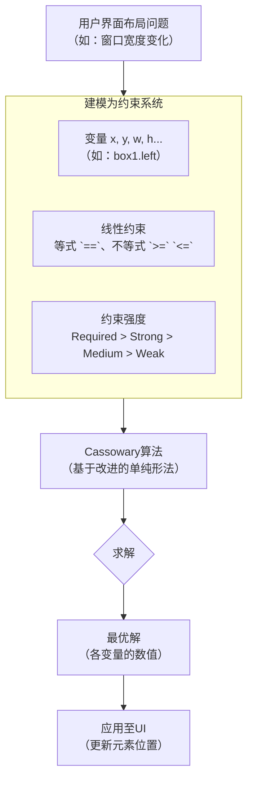
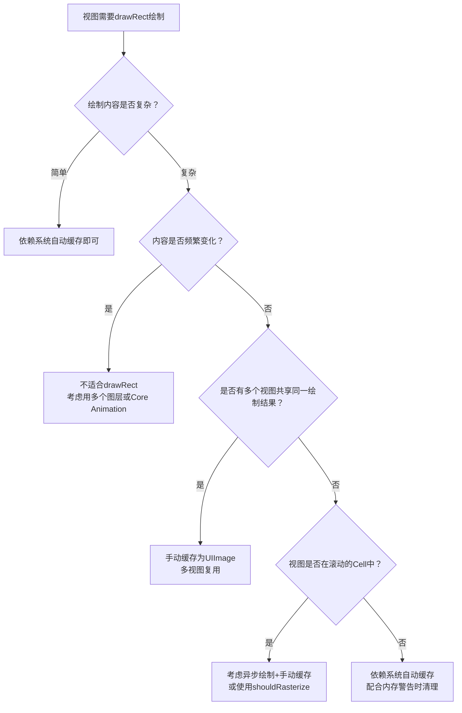
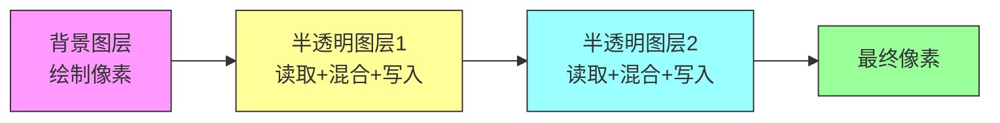

# iOS渲染管线

iOS的渲染管线是一个精心设计的、多层级协作的体系，它将你的代码与屏幕上的像素连接起来。理解它的工作方式，是写出高性能、流畅App的关键。

## 渲染管线全貌：从代码到屏幕

简单来说，iOS的渲染流程就像一条流水线，CPU和GPU各司其职，协同完成每一帧画面的生产。整个过程可以概括为下面的架构图：

```mermaid
flowchart TD
    A[App 层<br>UIKit 与 Core Animation 事务管理] --> B[Core Animation<br>提交事务 (打包图层树)]
    
    B --> C[Render Server 进程<br>接收并解析图层树]
    C --> D[GPU<br>接收指令并执行渲染]
    D --> E[帧缓冲区<br>存储渲染完成的位图]
    E --> F[屏幕显示]
    
    subgraph A [在 App 进程内（CPU 主要负责）]
        A1[布局 Layout] --> A2[显示 Display<br>（Core Graphics 绘制）] --> A3[准备 Prepare<br>（如图片解码）] --> A4[提交 Commit<br>（打包并发送）]
    end
    
    subgraph D [在 GPU 中]
        D1[顶点/片段着色器<br>（Metal/OpenGL ES）]
    end

    F --> |垂直同步信号 VSync| A
```

## 关键阶段详解

### 1. App 内部：布局与提交（CPU 负责）

这是渲染流程的起点，完全在你的App进程内，由CPU主导。Core Animation 在 RunLoop 中注册了一个 Observer，在 RunLoop 即将休眠时，会打包所有待处理的视图变化并提交。

这个阶段可以细分为四个步骤：

*   **布局 (Layout)**：处理视图的创建、层级调整，计算 `frame` 和约束（Auto Layout）。
*   **显示 (Display)**：`UIView` 的 `drawRect:` 方法在此被调用。Core Graphics 会在此处进行绘制，将内容渲染成**位图 (Bitmap)**，这会消耗CPU资源。如果系统通过 `setContents:` 直接设置了图片，则此步骤会轻量很多。
*   **准备 (Prepare)**：对即将渲染的资源进行预处理，最典型的就是**图片解码**。图片数据（如PNG/JPG）只有解码成位图格式后，才能被GPU使用。
*   **提交 (Commit)**：这是最后一步，Core Animation 会将所有图层信息打包，并通过进程间通信（IPC）发送给一个独立的系统进程——**Render Server**。

> **性能关键点**：App内部阶段是性能优化的主战场。复杂的视图层级、`drawRect`中的繁重绘制、以及未及时解码的图片，都会消耗CPU时间。如果这些任务在一个VSync周期（约16.7ms）内无法完成，就会导致掉帧。

### 2. Render Server 与 GPU 渲染

*   **Render Server**：这是一个系统级的常驻进程（在iOS 6之前叫`SpringBoard`，之后叫`BackBoard`）。它接收到App提交的图层数据后，会将其反序列化并构建成**渲染树 (Render Tree)**，随后将其转换为GPU能理解的绘制指令（如OpenGL ES或Metal命令）发送给GPU。

*   **GPU 渲染**：GPU接收指令后，开始执行真正的图形渲染工作。其核心流水线大致如下：
    1.  **顶点/片段着色器**：处理几何图形和像素颜色。
    2.  **光栅化**：将几何图形（如三角形）转换为屏幕上的像素点。
    3.  **测试与混合**：处理像素的深度、模板，并进行透明度混合，生成最终的**位图（Bitmap）**。

    这个最终位图会被存放在**帧缓冲区 (Framebuffer)** 中。

## 核心框架与设计模式

*   **UIKit**：最上层的框架，负责管理界面、响应用户事件。`UIView` 本身不直接负责渲染，它是 `CALayer` 的代理，提供内容和管理交互。
*   **Core Animation**：它是iOS渲染的**“心脏”**，位于UIKit之下。它并非只是做动画，而是管理所有图层的组合、打包和提交。每个 `UIView` 背后都有一个 `CALayer` 负责管理其显示内容。
*   **Core Graphics / Core Image**：提供绘图和图像处理能力。`Core Graphics` 主要负责**CPU**上的运行时绘制，而 `Core Image` 则擅长在**GPU**上对已存在的图像进行高效的滤镜处理。

这种分层设计的核心模式是**职责分离**：`UIView` 负责交互和布局，`CALayer` 负责管理位图数据，而 `Core Animation` 则作为“调度中心”协调CPU和GPU的工作。这种设计让动画可以独立于视图生命周期运行，并且也使得Core Animation的核心逻辑可以被复用到macOS上。

## 屏幕显示与卡顿原理

最终，显示系统会以固定的频率（如60Hz或120Hz）发出**垂直同步信号（VSync）**。视频控制器在收到VSync信号后，会从帧缓冲区中取出最新的一帧画面并显示在屏幕上。

*   **双缓冲机制**：iOS系统通常使用**双缓冲（Double Buffering）**，一个缓冲区用于当前显示（前缓冲），另一个用于GPU渲染下一帧（后缓冲）。当渲染完成且VSync信号到来时，两个缓冲区会瞬间交换，保证了画面完整性，避免了**屏幕撕裂**问题。
*   **掉帧**：如果在VSync信号到来时，GPU还未完成后一帧的渲染，缓冲区就不会发生交换，屏幕会重复显示上一帧的画面。这就是**掉帧（Jank）**，也是卡顿的直接原因。

你是正准备优化App的列表滑动性能，还是主要想深入理解Metal等渲染框架的底层原理？如果你有具体的优化场景，我可以展开讲讲这部分技术细节。

基于你之前提供的iOS渲染管线整体架构，我来为你逐层深入，详细拆解每个阶段的**流程**、**原理**、**代码示例**和**常见坑**。这将帮助你从理论到实践，全面掌握iOS渲染机制。

---

## 第1阶段：布局（Layout）—— 构建视图层级树

### 流程
1. 用户操作或代码触发视图变化（如`addSubview`、`setFrame`）
2. 系统标记视图需要重新布局（`setNeedsLayout`）
3. RunLoop即将休眠时，触发`layoutSubviews`调用链
4. 递归计算所有子视图的frame

### 实现原理
- **Auto Layout**：基于约束的线性方程组求解（Cassowary算法）
- **Frame布局**：直接设置坐标，性能更好但灵活性差
- **约束优先级**：允许冲突时按优先级降级处理

### 代码示例
```objective-c
// 触发布局
- (void)viewDidLoad {
    [super viewDidLoad];
    // 1. 标记需要布局
    [self.view setNeedsLayout];
    // 2. 立即强制布局（通常不推荐频繁使用）
    [self.view layoutIfNeeded];
}

// 自定义布局
- (void)layoutSubviews {
    [super layoutSubviews];
    // 手动布局子视图（比Auto Layout性能好）
    CGRect bounds = self.bounds;
    self.titleLabel.frame = CGRectMake(0, 0, bounds.size.width, 44);
    self.contentView.frame = CGRectMake(0, 44, bounds.size.width, bounds.size.height - 44);
}

// Auto Layout示例
- (void)setupConstraints {
    [NSLayoutConstraint activateConstraints:@[
        [self.titleLabel.topAnchor constraintEqualToAnchor:self.topAnchor constant:10],
        [self.titleLabel.leadingAnchor constraintEqualToAnchor:self.leadingAnchor constant:10],
        [self.titleLabel.trailingAnchor constraintEqualToAnchor:self.trailingAnchor constant:-10],
        [self.titleLabel.heightAnchor constraintEqualToConstant:44]
    ]];
}
```

### 注意事项与常见坑
| 问题 | 现象 | 解决方案 |
|------|------|----------|
| **约束冲突** | 控制台输出大量Auto Layout警告 | 检查约束完整性，使用`contentCompressionResistancePriority`控制抗压缩 |
| **过度约束** | 性能下降，布局计算耗时增加 | 减少不必要的约束，复杂布局改用代码frame |
| **主线程阻塞** | 滚动卡顿（如UITableView复杂约束） | 使用`estimatedRowHeight`或预计算高度缓存 |
| **错误用法** | `layoutIfNeeded`在滚动中频繁调用 | 只在必要时（如动画中）使用，避免循环触发 |

### 性能优化建议
```objective-c
// ✅ 好的做法：缓存高度
- (CGFloat)tableView:(UITableView *)tableView heightForRowAtIndexPath:(NSIndexPath *)indexPath {
    if (!self.cellHeights[indexPath]) {
        self.cellHeights[indexPath] = @([self calculateHeightForIndexPath:indexPath]);
    }
    return [self.cellHeights[indexPath] floatValue];
}

// ❌ 坏的做法：每次都重新计算
- (CGFloat)tableView:(UITableView *)tableView heightForRowAtIndexPath:(NSIndexPath *)indexPath {
    return [self calculateHeightForIndexPath:indexPath]; // 每次滚动都计算
}
```

---

## 第2阶段：显示（Display）—— 绘制内容

### 流程
1. `UIView`的`drawRect:`被调用（触发条件：`setNeedsDisplay`）
2. 系统创建图形上下文（Graphics Context）
3. Core Graphics执行绘制命令
4. 生成位图数据（Bitmap）
5. 位图被设置到`CALayer`的`contents`属性

### 实现原理
- **Core Graphics**：基于Quartz 2D的向量绘制引擎，运行在CPU上
- **图形上下文**：包含当前绘图状态（颜色、线宽、变换矩阵等）
- **坐标系统**：iOS使用翻转的Y轴（原点在左上角）
- **离屏渲染**：当使用`UIGraphicsBeginImageContextWithOptions`时，在内存中创建上下文

### 代码示例
```objective-c
// 自定义绘制
- (void)drawRect:(CGRect)rect {
    // 1. 获取上下文
    CGContextRef context = UIGraphicsGetCurrentContext();
    
    // 2. 设置颜色
    CGContextSetFillColorWithColor(context, [UIColor blueColor].CGColor);
    CGContextSetStrokeColorWithColor(context, [UIColor redColor].CGColor);
    CGContextSetLineWidth(context, 2.0);
    
    // 3. 绘制矩形
    CGContextFillRect(context, CGRectMake(10, 10, 100, 100));
    
    // 4. 绘制圆形
    CGContextAddArc(context, 200, 200, 50, 0, M_PI * 2, 1);
    CGContextFillPath(context);
    
    // 5. 绘制文字
    NSString *text = @"Hello iOS";
    [text drawAtPoint:CGPointMake(50, 150) 
       withAttributes:@{NSFontAttributeName: [UIFont systemFontOfSize:20]}];
}

// 离屏绘制（生成图片）
- (UIImage *)createImage {
    UIGraphicsBeginImageContextWithOptions(CGSizeMake(200, 200), NO, 0);
    // 绘制内容
    [[UIColor redColor] setFill];
    UIRectFill(CGRectMake(0, 0, 200, 200));
    UIImage *image = UIGraphicsGetImageFromCurrentImageContext();
    UIGraphicsEndImageContext();
    return image;
}

// 优化：使用CALayer的contents避免重绘
- (void)viewDidLoad {
    [super viewDidLoad];
    // 直接设置图片，不触发drawRect
    self.view.layer.contents = (__bridge id)[UIImage imageNamed:@"background"].CGImage;
}
```

### 注意事项与常见坑
| 问题 | 现象 | 解决方案 |
|------|------|----------|
| **CPU过载** | 滚动卡顿，电池消耗高 | 避免在`drawRect`中执行复杂绘制，使用图片替代 |
| **内存激增** | 突然的内存峰值 | `drawRect`会生成位图，限制绘制面积 |
| **无用绘制** | `drawRect`被频繁调用 | 只在内容变化时调用`setNeedsDisplay`，系统优化合并 |
| **Context错误** | 在非主线程绘制崩溃 | 必须在主线程操作`drawRect`，离屏绘制可在子线程 |
| **像素对齐** | 文字模糊、线条锯齿 | 使用`UIScreen.mainScreen.scale`对齐像素 |

### 性能优化
```objective-c
// ✅ 异步绘制（YYText、AsyncDisplayKit方案）
- (void)displayLayer:(CALayer *)layer {
    dispatch_async(dispatch_get_global_queue(0, 0), ^{
        UIGraphicsBeginImageContextWithOptions(layer.bounds.size, NO, 0);
        // 在子线程绘制
        CGContextRef ctx = UIGraphicsGetCurrentContext();
        // ... 绘制代码
        UIImage *image = UIGraphicsGetImageFromCurrentImageContext();
        UIGraphicsEndImageContext();
        // 回到主线程设置
        dispatch_async(dispatch_get_main_queue(), ^{
            layer.contents = (__bridge id)image.CGImage;
        });
    });
}

// ❌ 坏的做法：频繁创建图形上下文
- (void)drawRect:(CGRect)rect {
    for (int i = 0; i < 100; i++) {
        // 每次循环都创建上下文，性能差
        [self drawSubElementAtIndex:i];
    }
}
```

---

## 第3阶段：准备（Prepare）—— 资源优化与解码

### 流程
1. 收集所有需要渲染的资源（图片、文字、特效）
2. 图片解码（PNG/JPEG → 位图）
3. 文字渲染成位图（Core Text）
4. 特效预处理（Core Image滤镜链）

### 实现原理
- **图片解码**：压缩格式无法直接GPU使用，必须解码为位图（RGBA）
- **解码时机**：默认在`imageNamed:`时立即解码（同步），或在`imageWithContentsOfFile:`时懒加载
- **内存缓存**：解码后的位图占用内存较大（例如：1000x1000的图片约4MB）
- **Core Image**：使用GPU或CPU处理滤镜，延迟计算（Lazy Evaluation）

### 代码示例
```objective-c
// 1. 图片解码优化
- (UIImage *)decodedImageWithImage:(UIImage *)image {
    if (image.images) return image; // 动图不处理
    
    CGImageRef imageRef = image.CGImage;
    CGSize size = CGSizeMake(CGImageGetWidth(imageRef), CGImageGetHeight(imageRef));
    CGColorSpaceRef colorSpace = CGColorSpaceCreateDeviceRGB();
    CGContextRef context = CGBitmapContextCreate(NULL, size.width, size.height,
        8, 0, colorSpace, kCGImageAlphaPremultipliedFirst);
    CGColorSpaceRelease(colorSpace);
    
    if (!context) return image;
    
    CGContextDrawImage(context, CGRectMake(0, 0, size.width, size.height), imageRef);
    CGImageRef newImageRef = CGBitmapContextCreateImage(context);
    UIImage *newImage = [UIImage imageWithCGImage:newImageRef];
    CGImageRelease(newImageRef);
    CGContextRelease(context);
    
    return newImage;
}

// 2. 异步解码
- (void)loadImageAsync:(NSString *)url {
    dispatch_async(dispatch_get_global_queue(0, 0), ^{
        UIImage *image = [UIImage imageWithContentsOfFile:url];
        // 强制解码
        UIGraphicsBeginImageContextWithOptions(image.size, YES, image.scale);
        [image drawInRect:CGRectMake(0, 0, image.size.width, image.size.height)];
        UIImage *decodedImage = UIGraphicsGetImageFromCurrentImageContext();
        UIGraphicsEndImageContext();
        
        dispatch_async(dispatch_get_main_queue(), ^{
            self.imageView.image = decodedImage;
        });
    });
}

// 3. Core Image滤镜优化
- (UIImage *)applyFilter:(UIImage *)image {
    CIContext *context = [CIContext contextWithOptions:@{kCIContextUseSoftwareRenderer: @NO}]; // 使用GPU
    CIImage *ciImage = [[CIImage alloc] initWithImage:image];
    CIFilter *filter = [CIFilter filterWithName:@"CIGaussianBlur"];
    [filter setValue:ciImage forKey:kCIInputImageKey];
    [filter setValue:@10 forKey:kCIInputRadiusKey];
    
    CIImage *outputImage = [filter outputImage];
    CGImageRef cgImage = [context createCGImage:outputImage fromRect:outputImage.extent];
    UIImage *result = [UIImage imageWithCGImage:cgImage];
    CGImageRelease(cgImage);
    return result;
}
```

### 注意事项与常见坑
| 问题 | 现象 | 解决方案 |
|------|------|----------|
| **解码延迟** | 滚动时突然卡顿 | 提前异步解码（如SDWebImage方式） |
| **内存爆炸** | 解码大图导致内存警告 | 使用`imageWithContentsOfFile:`替代`imageNamed:`（不缓存） |
| **重复解码** | 同一张图片多次解码 | 使用NSCache缓存解码后的图片 |
| **Core Image内存** | 滤镜链导致内存激增 | 使用`CIContext`缓存，复用渲染对象 |
| **Color Space不匹配** | 颜色失真 | 确保图片和屏幕色彩空间一致 |

### 性能优化建议
```objective-c
// ✅ 好的实践：缓存池
@interface ImageCache : NSObject
+ (instancetype)shared;
- (UIImage *)cachedImageForKey:(NSString *)key;
- (void)cacheImage:(UIImage *)image forKey:(NSString *)key;
@end

// 实现使用NSCache + 异步解码

// ❌ 坏的做法：反复解码
- (void)tableView:(UITableView *)tableView cellForRowAtIndexPath:(NSIndexPath *)indexPath {
    // 每次都从磁盘读取并解码，性能极差
    UIImage *image = [UIImage imageWithContentsOfFile:imagePaths[indexPath.row]];
    cell.imageView.image = image;
}
```

---

## 第4阶段：提交（Commit）—— 打包与发送

### 流程
1. Core Animation收集所有脏的`CALayer`
2. 序列化图层树为`CATransaction`
3. 通过XPC服务（进程间通信）发送到`Render Server`
4. `Render Server`反序列化并构建渲染树

### 实现原理
- **CATransaction**：事务机制，批处理所有图层更新
- **隐式动画**：默认事务在RunLoop结束时自动提交
- **显式事务**：手动控制`[CATransaction begin]`和`[CATransaction commit]`
- **渲染树**：与App的图层树类似，但属于`Render Server`进程

### 代码示例
```objective-c
// 1. 显式事务控制
- (void)updateLayers {
    [CATransaction begin];
    [CATransaction setDisableActions:YES]; // 禁用隐式动画
    [CATransaction setAnimationDuration:0.3];
    [CATransaction setCompletionBlock:^{
        NSLog(@"动画完成");
    }];
    
    self.layer.backgroundColor = [UIColor redColor].CGColor;
    self.layer.opacity = 0.5;
    self.layer.transform = CATransform3DMakeScale(1.2, 1.2, 1);
    
    [CATransaction commit];
}

// 2. 自定义事务提交时机
- (void)preCommit {
    // RunLoop即将休眠时自动提交
    // 也可强制提交
    [CATransaction flush];
}

// 3. 监测渲染性能
- (void)monitorFPS {
    static CADisplayLink *displayLink = nil;
    displayLink = [CADisplayLink displayLinkWithTarget:self selector:@selector(displayLinkTick:)];
    [displayLink addToRunLoop:[NSRunLoop mainRunLoop] forMode:NSRunLoopCommonModes];
}

- (void)displayLinkTick:(CADisplayLink *)link {
    static CFTimeInterval lastTimestamp = 0;
    CFTimeInterval current = CACurrentMediaTime();
    if (lastTimestamp > 0) {
        CFTimeInterval delta = current - lastTimestamp;
        if (delta > 1.0/60.0) {
            NSLog(@"⚠️ 掉帧：实际时间 %.2f ms", delta * 1000);
        }
    }
    lastTimestamp = current;
}
```

### 注意事项与常见坑
| 问题 | 现象 | 解决方案 |
|------|------|----------|
| **事务堆积** | 大量图层更新导致卡顿 | 合并更新，减少事务提交次数 |
| **跨进程开销** | 频繁提交导致CPU升高 | 使用`setNeedsDisplay`标记，系统自动合并 |
| **动画冲突** | 动画意外中断或叠加 | 明确设置`fillMode`和`removedOnCompletion` |
| **重复设置** | 相同属性多次修改 | 在`[CATransaction begin]`和`commit`之间批量修改 |

---

## 第5阶段：Render Server —— 合成与准备发送

### 流程
1. 接收App提交的图层树数据
2. 反序列化为`Render Tree`
3. 执行图层合成（Compositing）
4. 生成GPU可执行的命令缓冲区

### 实现原理
- **进程隔离**：Render Server独立进程，保证系统稳定性
- **图层合成**：将多个图层按照层级和混合模式组合
- **Shadow Path**：复杂阴影会触发离屏渲染
- **Group Opacity**：`layer.shouldRasterize`可缓存组合结果

### 代码示例
```objective-c
// 1. 优化图层合成
- (void)optimizeCompositing {
    // ✅ 避免不必要的透明图层
    self.view.backgroundColor = [UIColor whiteColor]; // 不透明
    self.view.opaque = YES;
    
    // ✅ 减少图层数量
    // 使用drawRect合并多个视图
    
    // ✅ 启用光栅化（适合静态内容）
    self.layer.shouldRasterize = YES;
    self.layer.rasterizationScale = [UIScreen mainScreen].scale;
}

// 2. 调试合成性能
- (void)debugCompositing {
    // Xcode -> Debug -> View Debugging -> Color Blended Layers
    // 显示透明混合区域（红色=混合，绿色=不透明）
    
    // 设置边缘标记
    self.layer.borderWidth = 1;
    self.layer.borderColor = [UIColor redColor].CGColor;
}
```

### 注意事项与常见坑
| 问题 | 现象 | 解决方案 |
|------|------|----------|
| **离屏渲染** | 性能下降，滚动卡顿 | 避免圆角+masksToBounds、阴影+shadowPath |
| **透明图层过多** | GPU填充率（Overdraw）增加 | 设置`opaque=YES`，背景色不透明 |
| **光栅化滥用** | 内存激增 | 仅对静态内容使用，动态内容禁用 |
| **图层过多** | 合成耗时增加 | 尽量合并图层，使用`drawRect`替代多个子视图 |
| **异步提交** | 图层更新延迟 | 使用`CATransaction`的`commit`控制时机 |

---

## 第6阶段：GPU渲染 —— 执行命令与合成

### 流程
1. 接收Render Server的命令缓冲区
2. 顶点处理 → 图元处理 → 光栅化
3. 片段着色器执行 → 片段测试 → 混合
4. 写入帧缓冲区（Frame Buffer）

### 实现原理
- **OpenGL ES / Metal**：底层图形API
- **Tile-Based Deferred Rendering**（基于图块的延迟渲染）：PowerVR GPU架构
- **分块渲染**：屏幕分成小块（如32x32像素），减少带宽消耗
- **渲染管线**：顶点着色器 → 片段着色器 → 输出合并

### 代码示例
```objective-c
// 1. 使用Metal直接渲染（高性能）
#import <Metal/Metal.h>
#import <MetalKit/MetalKit.h>

@interface MetalRenderer : NSObject <MTKViewDelegate>
@property (nonatomic, strong) id<MTLDevice> device;
@property (nonatomic, strong) id<MTLCommandQueue> commandQueue;
@property (nonatomic, strong) id<MTLRenderPipelineState> pipelineState;
@end

@implementation MetalRenderer
- (instancetype)init {
    self = [super init];
    if (self) {
        self.device = MTLCreateSystemDefaultDevice();
        self.commandQueue = [self.device newCommandQueue];
        [self buildPipeline];
    }
    return self;
}

- (void)buildPipeline {
    id<MTLLibrary> library = [self.device newDefaultLibrary];
    id<MTLFunction> vertexFunc = [library newFunctionWithName:@"vertexShader"];
    id<MTLFunction> fragmentFunc = [library newFunctionWithName:@"fragmentShader"];
    
    MTLRenderPipelineDescriptor *desc = [MTLRenderPipelineDescriptor new];
    desc.vertexFunction = vertexFunc;
    desc.fragmentFunction = fragmentFunc;
    desc.colorAttachments[0].pixelFormat = MTLPixelFormatBGRA8Unorm;
    
    self.pipelineState = [self.device newRenderPipelineStateWithDescriptor:desc error:nil];
}

- (void)drawInMTKView:(MTKView *)view {
    id<MTLCommandBuffer> commandBuffer = [self.commandQueue commandBuffer];
    MTLRenderPassDescriptor *desc = view.currentRenderPassDescriptor;
    
    id<MTLRenderCommandEncoder> encoder = [commandBuffer renderCommandEncoderWithDescriptor:desc];
    [encoder setRenderPipelineState:self.pipelineState];
    [encoder drawPrimitives:MTLPrimitiveTypeTriangle vertexStart:0 vertexCount:3];
    [encoder endEncoding];
    
    [commandBuffer presentDrawable:view.currentDrawable];
    [commandBuffer commit];
}
@end

// 2. OpenGL ES基础示例
- (void)setupOpenGL {
    EAGLContext *context = [[EAGLContext alloc] initWithAPI:kEAGLRenderingAPIOpenGLES3];
    [EAGLContext setCurrentContext:context];
    
    GLuint vertexBuffer;
    glGenBuffers(1, &vertexBuffer);
    glBindBuffer(GL_ARRAY_BUFFER, vertexBuffer);
    
    // 顶点数据
    GLfloat vertices[] = {
        -0.5, -0.5, 0,
         0.5, -0.5, 0,
         0,    0.5, 0
    };
    glBufferData(GL_ARRAY_BUFFER, sizeof(vertices), vertices, GL_STATIC_DRAW);
    
    // 编译着色器...
}
```

### 注意事项与常见坑
| 问题 | 现象 | 解决方案 |
|------|------|----------|
| **GPU过载** | 帧率下降，发热 | 降低分辨率，减少透明图层 |
| **填充率限制** | 像素处理能力不足 | 使用`opaque`和`shouldRasterize`优化 |
| **带宽瓶颈** | GPU等待内存 | 使用压缩纹理（PVRTC） |
| **Shader复杂** | 片段着色器执行慢 | 简化像素处理逻辑 |
| **Tile Buffer溢出** | 屏幕闪烁 | 优化渲染Pass数量 |

---

## 第7阶段：屏幕显示 —— VSync与帧缓冲交换

### 流程
1. 等待VSync信号（60Hz或120Hz）
2. 帧缓冲区交换（前缓冲 ↔ 后缓冲）
3. 显示控制器读取帧缓冲数据
4. 显示在屏幕上

### 实现原理
- **双缓冲**：一个显示，一个渲染
- **VSync**：避免屏幕撕裂（Tearing）
- **ProMotion**：120Hz动态刷新率（iPhone 13 Pro+）
- **背光控制**：OLED屏幕的自发光像素

### 代码示例
```objective-c
// 1. CADisplayLink精确控制帧率
- (void)setupDisplayLink {
    CADisplayLink *displayLink = [CADisplayLink displayLinkWithTarget:self selector:@selector(renderFrame:)];
    if (@available(iOS 15.0, *)) {
        // 选择刷新率（120Hz或60Hz）
        displayLink.preferredFrameRateRange = CAFrameRateRangeMake(60, 120, 60);
    } else {
        displayLink.preferredFramesPerSecond = 60;
    }
    [displayLink addToRunLoop:[NSRunLoop mainRunLoop] forMode:NSRunLoopCommonModes];
}

- (void)renderFrame:(CADisplayLink *)displayLink {
    // 每帧渲染
    if (displayLink.targetTimestamp - displayLink.timestamp > 0.016) {
        // 掉帧检测
        NSLog(@"⚠️ 渲染超时");
    }
}

// 2. 自适应刷新率
- (void)adjustFrameRate {
    CGFloat batteryLevel = [[UIDevice currentDevice] batteryLevel];
    if (batteryLevel < 0.2) {
        // 低电量模式降低帧率
        self.displayLink.preferredFramesPerSecond = 30;
    }
}
```

---

## 常见性能问题总结与排查工具

### 性能问题的三大根源

1. **CPU瓶颈**（布局、绘制、解码、提交）
   - 表现：主线程耗时超过16.7ms
   - 排查：Xcode Time Profiler

2. **GPU瓶颈**（光栅化、合成、像素处理）
   - 表现：CPU空闲但帧率下降
   - 排查：Xcode Metal System Trace

3. **内存瓶颈**（缓存、纹理、离屏渲染）
   - 表现：内存警告、突然卡顿
   - 排查：Allocations、Memory Graph

### 调试工具速查

| 工具 | 用途 | 使用场景 |
|------|------|----------|
| **Time Profiler** | CPU耗时分析 | 查找主线程耗时函数 |
| **Core Animation** | 图层调试 | 检测离屏渲染、混合图层 |
| **Metal System Trace** | GPU性能分析 | 查看帧绘制时间、GPU利用率 |
| **Instruments** | 综合性能分析 | 内存泄漏、CPU/GPU综合监控 |
| **Xcode View Debugging** | 视图层级检查 | 查看图层嵌套、透明度 |

### 性能优化快速检查表

```objective-c
// ✅ 优化清单
1. 使用不透明背景: view.opaque = YES
2. 避免离屏渲染: 圆角+阴影使用shadowPath
3. 减少图层数量: 使用drawRect合并绘制
4. 异步解码图片: 子线程解码+缓存
5. 复用视图: UITableView/UICollectionView复用机制
6. 使用轻量级视图: 避免过度封装
7. 预计算布局: 缓存高度、约束
8. 减少Auto Layout: 复杂界面使用Frame布局
9. 使用Texture/AsyncDisplayKit: 异步渲染
10. 监控帧率: CADisplayLink实时监控
```

---

## 实战：优化一个卡顿的列表

### 问题场景
一个包含图片、文字的自定义TableViewCell，滚动时卡顿。

### 优化步骤

```objective-c
// Step 1: 检测问题
// 使用CADisplayLink监控FPS

// Step 2: 优化布局
- (void)layoutSubviews {
    [super layoutSubviews];
    // 从Auto Layout改为Frame布局
    self.avatarImageView.frame = CGRectMake(10, 10, 50, 50);
    self.titleLabel.frame = CGRectMake(70, 10, self.bounds.size.width - 80, 30);
    self.contentLabel.frame = CGRectMake(70, 45, self.bounds.size.width - 80, 50);
}

// Step 3: 异步解码图片
- (void)setImageURL:(NSString *)url {
    dispatch_async(dispatch_get_global_queue(0, 0), ^{
        UIImage *image = [UIImage imageWithContentsOfFile:url];
        // 强制解码
        UIGraphicsBeginImageContextWithOptions(image.size, YES, image.scale);
        [image drawInRect:CGRectMake(0, 0, image.size.width, image.size.height)];
        UIImage *decodedImage = UIGraphicsGetImageFromCurrentImageContext();
        UIGraphicsEndImageContext();
        
        dispatch_async(dispatch_get_main_queue(), ^{
            self.avatarImageView.image = decodedImage;
        });
    });
}

// Step 4: 预计算高度
- (CGFloat)cellHeightForContent:(NSString *)content {
    static NSCache *heightCache = [NSCache new];
    if ([heightCache objectForKey:content]) {
        return [[heightCache objectForKey:content] floatValue];
    }
    CGFloat height = [self calculateHeight:content];
    [heightCache setObject:@(height) forKey:content];
    return height;
}

// Step 5: 离屏渲染优化
- (void)setupCell {
    // 圆角使用图片剪切
    self.avatarImageView.layer.cornerRadius = 25;
    self.avatarImageView.layer.masksToBounds = YES;
    // 或者直接使用圆形图片
}

// Step 6: 光栅化静态内容
- (void)awakeFromNib {
    [super awakeFromNib];
    self.layer.shouldRasterize = YES;
    self.layer.rasterizationScale = [UIScreen mainScreen].scale;
}
```

---

## 总结

iOS渲染管线的每个阶段都是一个可能的性能瓶颈点：

| 阶段 | 主要瓶颈 | 优化方向 |
|------|----------|----------|
| **布局** | Auto Layout计算 | 使用Frame布局、缓存高度 |
| **显示** | drawRect重绘 | 异步绘制、减少绘制区域 |
| **准备** | 图片解码 | 异步解码、图片缓存 |
| **提交** | 事务频繁 | 批量更新、减少图层数 |
| **合成** | 离屏渲染 | 使用shadowPath、opaque |
| **GPU** | 像素填充率 | 减少透明图层、压缩纹理 |
| **显示** | VSync | 保持60/120FPS |

最终目标：让每一帧在 **16.7ms**（60Hz）或 **8.3ms**（120Hz）内完成所有阶段。

如果你需要针对某个特定场景（如复杂动画、视频渲染、游戏开发）的深度优化指南，我可以进一步展开。

## Q: Cassowary算法

**Cassowary算法**是一个专为**用户界面布局**设计的**增量式线性约束求解器**。它能够高效地解决由线性等式和不等式组成的约束系统，其核心优势在于**交互式、实时响应**的场景，比如窗口大小变化时，界面元素能自动、平滑地调整位置与尺寸。

它的核心思想可以用下面这个流程图来概括：



### 核心特性与优势

Cassowary算法之所以在界面布局领域备受欢迎，主要得益于以下几个关键设计：

*   **增量式求解 (Incremental)**：这是其最突出的特点。当约束系统发生变化（如添加、删除一个约束，或修改一个变量的值）时，它不会从头开始重新计算，而是基于上一次的解进行微调，以最小的工作量快速得到新解。这对于需要每帧都更新画面的交互式应用至关重要。
*   **分级约束 (Hierarchical Constraints)**：它允许为每个约束设置不同的**强度 (Strength)**，如 `REQUIRED`（必须满足）、`STRONG`、`MEDIUM`、`WEAK` 等。当约束之间发生冲突时，算法会优先满足强度更高的约束，允许牺牲较弱的约束来实现“最优妥协”，即**优雅降级**。这让界面布局既有确定性，又有灵活性。
*   **高效的底层算法**：其核心基于**改进的单纯形法 (Dual Simplex Method)**，专门为处理大规模、动态变化的约束而优化。

### 工作流程概览

使用Cassowary算法的典型流程如下：

1.  **建模**：将界面中的属性定义为**变量 (Variable)**，如控件的宽度、高度、位置等。
2.  **定义约束**：用这些变量构建**线性约束**（等式或不等式）。例如，`box1.left >= 0`（左边缘在父容器内），或 `box1.width |EQ(WEAK)| 100`（宽度尽可能为100）。
3.  **设置编辑变量**：对于需要用户或外部事件（如窗口拖拽）驱动的变量，将其设为**编辑变量 (Edit Variable)**。
4.  **求解与更新**：当编辑变量的值变化时，调用 `suggest_value` 方法，算法会自动计算出所有其他变量的新值，并返回变化列表，供界面进行刷新。

### 实际应用

Cassowary算法最著名的应用是**Apple的自动布局（Auto Layout）系统**，被广泛用于iOS和macOS开发中。此外，它也以各种库的形式存在于多个编程语言生态中，方便开发者直接使用：

*   **Rust**: [`cassowary`](https://crates.io/crates/cassowary) 库
*   **JavaScript/Node.js**: [`cassowary`](https://www.npmjs.com/package/cassowary) 包
*   **Dart/Flutter**: [`cassowary`](https://pub.dev/packages/cassowary) 包

> Cassowary算法的实现细节较为复杂，涉及线性规划和单纯形法的专业知识。不过，将其看作一个能理解并优化“布局规则”的黑盒，对于日常应用开发来说已经足够。
>
> ## Q: 图层序列化
>
> 你提到的“序列化CALayer为图层树”，实际上是在说**将应用程序进程（App Process）中的图层对象，转换成一种可以在进程间传输的数据格式**，发送给独立的渲染进程（Render Server）。这和你发送一张图片或一段JSON给朋友在本质上是一样的。

我们可以分三步来理解这个过程：

### 1. 什么是序列化（Serialization）？

序列化就是把一个**内存中的复杂对象**（比如一个包含图片、颜色、子图层、动画属性的CALayer），变成**一串字节流（二进制数据）** 的过程。

-   **序列化前**：CALayer是一个位于App内存中的Objective-C/Swift对象，有很多指针、引用和方法，这些在另一个进程（Render Server）里毫无意义，因为指针指向的是App自己的内存地址。
-   **序列化后**：CALayer被“拍平”成一段连续的、结构化的数据，类似`{ "bounds": {0,0,100,100}, "backgroundColor": "红色", "contents": <图片二进制数据> ... }`。这段数据可以被写入文件、网络传输，或发送给其他进程。

### 2. 为什么必须序列化？

因为iOS/macOS采用**进程隔离**的安全机制，App进程和Render Server进程拥有各自独立的内存空间，不能直接访问对方的内存。因此，App必须把CALayer“打包”成Renderer能看懂的数据，通过XPC（进程间通信）这个“快递通道”发送过去。接收端（Render Server）收到后，再进行**反序列化**，在自己的内存中重建一个属于自己的图层对象（即渲染树节点）。

### 3. 序列化了什么，又忽略了什么？

你可能会想：“图层树结构那么复杂，全发过去会不会很慢？” 实际上，Apple为了性能，做了大量优化。序列化发送的**主要内容**包括：

-   **图层属性**：几何信息（bounds、position、transform）、视觉属性（backgroundColor、opacity、cornerRadius、borderWidth）、内容图片（contents，通常是图片的纹理ID或数据）、掩码（mask）等所有与**绘制**相关的静态或动态属性。
-   **层级结构**：父子图层的关系，决定了渲染的顺序和层级。

**关键优化：不是每次都全量发送**。Core Animation的序列化是**增量式**的。在第一次提交时，它会发送完整图层树。但在后续的每一帧，它只会序列化那些**属性发生了变化（被标记为“脏”）** 的图层及其发生变化的属性，这极大减少了传输数据量。

### 一个便于理解的类比

-   **你（App进程）** 写了一份带有精美排版的Word文档（CALayer树）。
-   **打印机驱动（Render Server）** 需要这份文档才能打印，但它运行在另一个系统上，不能直接打开你的Word内存文件。
-   **序列化**就是你把Word文档**另存为**一个通用的PDF文件（字节流）。
-   然后你通过邮件（XPC）把PDF发送给打印机驱动，它收到后解析PDF，在自己的系统里重建出可打印的页面（渲染树）。

所以，这个过程的本质是：**App将自身内存中的CALayer对象“翻译”成进程间通用的二进制数据，并在渲染服务端“还原”成可渲染的对象**。这整个打包和发送的动作，就是通过你提到的**CATransaction（事务）**来触发和管理的。当一个事务提交时，系统就会自动执行这个序列化和发送的流程。

## Q: 图层合成

**图层合成（Compositing）**，是iOS渲染管线中**最后、也是至关重要的一步**。它发生在Render Server进程内，核心任务可以简单概括为一句话：

**把App发来的所有图层（Layer），按照正确的层级、透明度、滤镜等属性，一张一张地“叠”在一起，最终生成一个完整的像素缓冲（Frame Buffer），交给GPU去显示。**

这个过程，本质上就像Photoshop里的“图层混合”操作。

为了让你更直观地理解，我们把这个过程拆解为三个步骤：

### 1. 准备工作：解析“烘焙配方”
Render Server收到序列化数据并重建出**渲染树**后，并不会立刻绘制。它首先会进行一次**全局遍历**，解析每个图层的属性，生成一个高效的**绘制指令列表（Display Lists）**。

-   **生成指令**：例如，对于`contents`是图片的图层，指令是“在矩形A处绘制纹理X”；对于带`cornerRadius`的图层，指令是“先裁剪圆角，再绘制背景色”。
-   **确定层级**：根据图层的`zPosition`和层级树父子关系，计算出每个图层在三维空间中的**最终绘制顺序**。

### 2. 核心操作：离屏合成（Offscreen Rendering）与屏幕合成（Onscreen Rendering）
这是合成中最复杂、最消耗性能的部分。它需要处理各种视觉效果，主要分为两类：

-   **普通图层合成（Onscreen）**：如果图层只是简单的矩形、纯色或普通图片，且不重叠复杂，GPU会直接用**OpenGL/Metal**以**按顺序绘制（Painter's Algorithm）** 的方式，从后往前画到帧缓冲里。这个过程通常很快。

-   **复杂图层合成（Offscreen）**：如果图层包含**圆角+裁剪（masksToBounds）、阴影（shadow）、遮罩（mask）、组透明度（group opacity）或滤镜（filter）**，情况就复杂了。
    -   为了在“父图层”这个容器内正确应用这些效果，Render Server不能直接把子图层画在最终屏幕上。
    -   它必须先**新建一个离屏缓冲（Offscreen Buffer）**，在“后台画板”上把该父图层及其所有子图层画好，并把它们**合成为一张新的临时图片**，然后才把这张临时图片作为整体画到最终的帧缓冲中。
    -   *这也是为什么离屏渲染（Offscreen Rendering）容易成为性能瓶颈，因为它增加了上下文切换和额外的内存开销。*

### 3. 最终输出：Vsync信号与展示
当所有图层都按正确顺序绘制到帧缓冲（Frame Buffer）中后，合成工作就完成了。此时，Render Server会等待硬件的**垂直同步信号（Vsync）**，一旦信号到来，就通过**Display Port（显示端口）** 将帧缓冲中的数据发送给屏幕硬件进行显示。

### 一个形象的类比

想象你在制作一张层次丰富的海报：

-   **你（App进程）** 提供了所有素材：背景层（`CALayer`）、人物照片（带阴影）、标题文字（带圆角背景）等。
-   **印刷厂排版师（Render Server - 合成阶段）** 拿到素材后：
    1.  先建一个透明底图（**帧缓冲**）。
    2.  把普通素材直接按顺序贴上去（**屏幕合成**）。
    3.  对于“人物照片带阴影”这种复杂组合，排版师会先在一块单独的透明板上把照片和阴影贴好，合成一张“人物卡”（**离屏渲染**），再把这张“人物卡”贴到底图上。
    4.  最后，把贴好的完整海报（**最终像素**）送去打印（**显示**）。

### 关键性能指标：Offscreen Pass 次数
在合成过程中，**离屏缓冲（Offscreen Buffer）被创建的次数（即Offscreen Pass）** 是衡量性能的核心指标。苹果官方建议，理想情况下**每帧离屏Pass次数不超过2-3次**。如果图层嵌套了过多的圆角、阴影和遮罩，就会导致大量Offscreen Pass，让GPU过载，这就是造成界面掉帧的常见原因之一。

所以，当你在Xcode的Instruments工具中看到`Core Animation`的`Offscreen Render`计数很高时，就知道是图层合成环节太复杂了。

理解了这个过程，你就能明白为什么Xcode的“Color Offscreen-Rendered Yellow”调试选项能帮助优化界面性能了。

## Q: drawRect与图层合成

这个问题问到了点子上！`drawRect:`合并视图，本质上是一个**“空间换时间”**的经典优化策略。它的核心原理可以一句话概括：

**把多个独立视图（Layer）的绘制工作，全部集中在一个自定义视图的 `drawRect:` 方法里，用一次性的CPU位图绘制，替代多次GPU图层合成操作。**

我们把这个过程拆解来看：

### 1. 默认情况（多个独立视图）的问题

假设你要显示一个带圆角、边框、背景渐变的头像，如果用多个视图叠加：

-   **视图A**：外层容器，负责圆角裁剪（`cornerRadius` + `masksToBounds`）
-   **视图B**：内层`UIImageView`，显示图片
-   **视图C**：`UIView`，覆盖一层半透明渐变蒙层
-   **视图D**：`UIView`，绘制一圈边框

在渲染时，Render Server会对这**4个独立的CALayer**分别进行合成。如果A还触发了**离屏渲染**（圆角+裁剪），那么GPU需要多次`Offscreen Pass`来合成这些图层，这既消耗内存带宽，也增加了GPU的渲染压力。

### 2. `drawRect:` 合并的原理

当你创建一个自定义视图，重写它的`drawRect:`方法时，系统会为你提供一个**图形上下文（Graphics Context）**，这本质上是一块**位图内存缓冲区（Bitmap Buffer）**。在这个方法里：

-   **你完全控制绘制**：使用Core Graphics（Quartz 2D）API，把所有元素——图片、圆角路径、渐变、边框——**一次性绘制**到这块位图上。
-   **结果只有一个图层**：绘制完成后，这块位图会作为这个视图的`contents`属性，成为一个**单一的CALayer**。

```objective-c
- (void)drawRect:(CGRect)rect {
    CGContextRef ctx = UIGraphicsGetCurrentContext();
    
    // 1. 绘制圆角路径（作为裁剪区）
    UIBezierPath *path = [UIBezierPath bezierPathWithRoundedRect:rect cornerRadius:20];
    CGContextAddPath(ctx, path.CGPath);
    CGContextClip(ctx);
    
    // 2. 绘制图片（直接绘制，不用UIImageView）
    [self.image drawInRect:rect];
    
    // 3. 绘制渐变蒙层
    // ... Core Graphics 渐变代码
    
    // 4. 绘制边框
    // ... 描边代码
}
```

### 3. 为什么它能提升性能？

-   **从多次合成 → 一次绘制**：Render Server处理这个视图时，只需将这一张位图合成到最终帧缓冲里，**消除了多次离屏渲染和图层混合的开销**。GPU工作量从“处理4个图层”降低到“处理1个纹理”。
-   **利用CPU强项**：`drawRect:`的绘制由**CPU**执行，而Core Graphics的操作经过高度优化。对于复杂的矢量图形（渐变、阴影、路径），用CPU绘制一次，比用GPU反复合成多个半透明图层效率更高（尤其是在图层数量很多时）。

### 4. 代价与权衡（小心这个坑！）

这个方法并非万能灵药，它有一个明显的代价：

-   **内存开销增加**：合并后的大位图可能占用更多内存。例如，一个`300x300`点的视图，在`@2x`屏幕下，位图缓冲区的大小是`600x600x4字节 ≈ 1.44MB`。如果有多个这样的视图，内存压力会迅速上升。
-   **CPU负担加重**：所有绘制工作都压在CPU上。如果`drawRect:`里的逻辑复杂，或频繁触发重绘（如滚动画廊），CPU可能会成为新瓶颈，导致**掉帧**。

### 5. 最佳实践建议

-   **适用场景**：适合**静态内容**或**变化不频繁**的复杂视图（如头像、卡片、静态列表Cell）。一次绘制，多次复用。
-   **不适用场景**：不适合需要**高频更新**（如动画、视频帧）或**大量Cell**（如`UITableView`中每个Cell都重绘，会导致滚动时CPU爆满）。

> **补充一个关键点**：从iOS 10开始，系统对`UIView`的`cornerRadius`+`masksToBounds`离屏渲染做了大幅优化（对`UIImageView`的图片圆角已不再触发离屏渲染），但复杂的多层叠加视图，合并依然是有效的优化手段。

简言之，`drawRect:`合并的本质是**用CPU的串行绘制，替代GPU的并行合成**。关键在于根据视图的**复杂度**和**更新频率**，找到CPU与GPU负载的平衡点。如果你的场景是静态复杂视图，这个方法值得一试；如果是滚动列表，可能需要更谨慎地权衡内存与性能。

## Q: drawrect 生成的位图缓存

好问题！关于`drawRect:`绘制的位图是否需要缓存，答案是：**系统会自动缓存，但你可以（且有时应该）手动控制缓存策略**。

让我们分层来看这个问题：

## 1. 系统自动缓存（这是默认行为）

当你重写`drawRect:`时，系统会**自动将绘制结果缓存为位图**，并作为视图的`contents`属性存储。这个缓存的生命周期由系统管理：

- **首次绘制**：调用`drawRect:`，生成位图缓存
- **后续显示**：只要视图不发生变化，系统直接使用缓存的位图，**不再调用`drawRect:`**
- **触发重绘**：当调用`setNeedsDisplay`或`setNeedsDisplayInRect:`时，系统会**丢弃旧缓存**，重新调用`drawRect:`生成新缓存

```objective-c
// 这个操作会丢弃缓存，触发重新绘制
[self.view setNeedsDisplay];
```

**关键点**：系统缓存的位图大小取决于视图的`bounds`和屏幕的`scale`（@2x/@3x）。例如，一个`100x100`的视图在@2x屏幕下，缓存位图是`200x200`像素。

## 2. 缓存存在的性能影响

### 正面影响（被缓存时）：
- GPU只需将这张位图作为纹理进行一次合成，速度极快
- 滚动列表时，已经绘制好的Cell不会反复执行`drawRect:`

### 负面影响（频繁重绘时）：
- **CPU飙升**：每次调用`setNeedsDisplay`都会重新执行`drawRect:`，CPU密集操作导致掉帧
- **内存波动**：频繁创建和销毁大位图，增加内存分配压力

## 3. 手动缓存策略（进阶优化）

在某些场景下，系统自动缓存不够用，需要你手动介入：

### 场景1：多个视图共享同一绘制结果
如果多个视图需要显示相同的复杂图形，你可以绘制一次，复用位图：

```objective-c
// 手动生成并缓存位图
- (UIImage *)cachedComplexImage {
    static UIImage *cachedImage = nil;
    static dispatch_once_t onceToken;
    dispatch_once(&onceToken, ^{
        CGSize size = CGSizeMake(100, 100);
        UIGraphicsBeginImageContextWithOptions(size, NO, [UIScreen mainScreen].scale);
        // ... 复杂绘制代码
        cachedImage = UIGraphicsGetImageFromCurrentImageContext();
        UIGraphicsEndImageContext();
    });
    return cachedImage;
}

// 多个视图直接使用缓存
imageView.image = [self cachedComplexImage];
```

### 场景2：离屏渲染缓存（CALayer的shouldRasterize）
对于包含复杂子视图的容器，你可以开启`shouldRasterize`，让系统把**整个容器图层树**合成并缓存为一张位图：

```objective-c
view.layer.shouldRasterize = YES;
view.layer.rasterizationScale = [UIScreen mainScreen].scale;
```

**适用场景**：复杂的静态视图（如卡片、弹窗），在动画或滚动时效果显著。
**注意**：不要滥用！对滚动列表的每个Cell开启，会因位图缓存过多导致内存暴涨。

### 场景3：异步绘制缓存（ASyncDisplayKit/Texture）
在极端性能场景（如小红书、微博的流畅滚动），可以将`drawRect:`的绘制放到**后台线程**，绘制完成后将位图设置到主线程的`contents`：

```objective-c
dispatch_async(dispatch_get_global_queue(DISPATCH_QUEUE_PRIORITY_DEFAULT, 0), ^{
    // 后台绘制
    UIGraphicsBeginImageContextWithOptions(size, NO, scale);
    // ... 绘制代码
    UIImage *image = UIGraphicsGetImageFromCurrentImageContext();
    UIGraphicsEndImageContext();
    
    dispatch_async(dispatch_get_main_queue(), ^{
        // 主线程设置缓存结果
        self.layer.contents = (__bridge id)image.CGImage;
    });
});
```
这种方案下，你需要**自己管理缓存生命周期**，通常用`NSCache`或`NSDictionary`做内存缓存。

## 4. 何时应该主动清理缓存？

系统不会自动释放`drawRect:`生成的位图缓存，除非视图被销毁或收到内存警告。以下情况建议手动干预：

- **视图进入后台**：可以清空一些不紧急的缓存
- **收到内存警告**：`didReceiveMemoryWarning`中清理非必需的位图缓存
- **视图尺寸变化**：`layoutSubviews`中根据新尺寸判断是否需要重新绘制

```objective-c
- (void)didReceiveMemoryWarning {
    [super didReceiveMemoryWarning];
    // 清理手动缓存的大位图
    [self.imageCache removeAllObjects];
    // 触发系统缓存刷新（可选）
    [self setNeedsDisplay];
}
```

## 5. 决策树：要不要手动缓存？



## 总结

| 缓存方式 | 适用场景 | 注意事项 |
|---------|---------|---------|
| 系统自动缓存（默认） | 大部分静态视图 | 频繁调用`setNeedsDisplay`会清缓存，需避免 |
| 手动缓存为`UIImage` | 多视图共享复杂图形 | 用`dispatch_once`或`NSCache`管理 |
| `shouldRasterize` | 复杂容器视图（含子视图） | 注意缩放系数和内存占用 |
| 异步绘制+缓存 | 滚动列表中的复杂Cell | 需手动管理缓存生命周期和内存 |

核心原则是：**缓存是好的，但缓存的大小和数量需要可控**。在iOS中，位图缓存是宝贵的内存资源，过度缓存可能导致OOM（内存溢出）。在你优化界面性能时，可以结合Instruments的`Allocations`和`Core Animation`工具，观察位图缓存的实际内存占用情况，找到最佳平衡点。

## Q: Overdraw

这个问题问到了GPU渲染优化的核心！**透明图层过多导致Overdraw增加**，以及**设置`opaque=YES`**的优化原理，可以用一句话概括：

**GPU在渲染透明图层时，不能直接覆盖像素，而必须先读取已有像素、与新像素混合、再写回——这个过程叫"混合（Blending）"。`opaque=YES`就是告诉GPU："这个图层完全不透明，不用读旧像素，直接覆盖！"**

我们把这个过程拆解成三个层次来理解：

## 1. 什么是Overdraw？（逐像素的"叠罗汉"）

想象一个屏幕上最终显示的一个像素点，在渲染过程中可能被绘制了多次：



**Overdraw的含义**：同一个像素被GPU重复绘制了多次。例如，三层半透明视图叠加，最底层的像素被绘制了3次。

## 2. 透明图层为什么慢？（混合操作的代价）

当GPU渲染一个**透明（Alpha < 1.0）**图层时，它必须执行**Alpha混合（Alpha Blending）**计算：

```
最终颜色 = 源颜色 × 源Alpha + 目标颜色 × (1 - 源Alpha)
```

这是一个**读-修改-写**（Read-Modify-Write）操作：
1. **读**：从帧缓冲（Frame Buffer）中读取该像素的当前颜色
2. **计算**：执行乘法和加法运算
3. **写**：将计算结果写回帧缓冲

相比之下，渲染一个**不透明（Alpha = 1.0）**图层时：
1. **直接写**：将像素颜色直接覆盖写入帧缓冲
2. **无需读取**：不需要读取旧值，节省了内存带宽和计算

**性能差异**：混合操作消耗的内存带宽是纯覆盖操作的**2-3倍**，尤其在Retina屏幕上（像素数量多），这个代价会被放大。

## 3. `opaque=YES` 的底层原理

当你设置 `view.opaque = YES` 时，你是在向渲染系统做出**承诺**：

> "这个视图的每个像素都是完全不透明的（Alpha = 1.0），你不需要进行混合计算，直接覆盖就行！"

```objective-c
// ✅ 优化：明确告诉系统不透明
view.opaque = YES;
view.backgroundColor = [UIColor whiteColor]; // 必须设置不透明背景色

// ❌ 错误：opaque=YES但背景透明，会导致渲染异常
view.opaque = YES;
view.backgroundColor = [UIColor clearColor]; // 实际透明，但系统被欺骗，显示为黑色
```

**系统如何利用这个信息？**
- Render Server在合成图层时，会检查每个图层的`opaque`标记
- 如果为`YES`，GPU会使用**更高效的渲染路径**（无混合）
- Core Animation甚至可能**跳过**对该图层下方内容的渲染（因为反正被完全覆盖了）

## 4. 一个具体的Overdraw示例

假设你有三层视图叠加：

```
┌─────────────────┐
│   View C (透明)   │  ← Alpha = 0.5
│  ┌──────────────┐│
│  │  View B (透明) ││  ← Alpha = 0.8
│  │ ┌──────────┐ ││
│  │ │ View A    │ ││  ← 不透明背景
│  │ │ (背景)    │ ││
│  │ └──────────┘ ││
│  └──────────────┘│
└─────────────────┘
```

**渲染过程**：
1. **绘制View A**：直接覆盖写入（1次写操作）
2. **绘制View B**：读取View A像素 → 混合计算 → 写回（1次读+1次写）
3. **绘制View C**：读取混合后的像素 → 混合计算 → 写回（1次读+1次写）

**总操作**：3次写 + 2次读。如果View B和View C本身是纯色不透明，完全可以避免这些额外操作。

## 5. 优化策略：如何降低Overdraw？

### 策略1：尽可能设置 `opaque = YES`
```objective-c
// ✅ 白色背景视图
UIView *view = [[UIView alloc] init];
view.opaque = YES;
view.backgroundColor = [UIColor whiteColor];

// ❌ 即使背景是白色，不设置opaque也会触发混合
view.opaque = NO; // 默认值
view.backgroundColor = [UIColor whiteColor];
```

### 策略2：减少视图层级深度
```objective-c
// ❌ 多层嵌套
containerView
  └── backgroundView (半透明)
        └── contentView (半透明)
              └── label (不透明)

// ✅ 扁平化
containerView (不透明背景)
  └── label (不透明)
  └── 直接用drawRect:绘制背景和内容合并
```

### 策略3：调试工具检测Overdraw
Xcode提供了**Color Blended Layers**调试选项：

1. 运行App → 点击Xcode的`Debug View Hierarchy`
2. 选择`View Debugging` → `Color Blended Layers`
3. **红色区域** = 发生了混合（Overdraw），**绿色区域** = 无混合

![示意图：红色越深，Overdraw越严重]

## 6. 特殊情况：透明图层不可避免时怎么办？

有些场景确实需要透明（如带圆角的图片、渐变蒙层），此时可以：

- **限制透明区域范围**：只对必要部分透明，其他区域设置不透明背景
- **使用`drawRect:`合并**：将多个透明图层合并绘制成一张位图，减少图层数量
- **开启`shouldRasterize`缓存**：对于静态的透明组合，缓存为位图，避免每帧重复混合

```objective-c
// 带圆角的图片视图——不可避免的透明
UIImageView *imageView = [[UIImageView alloc] init];
imageView.layer.cornerRadius = 10;
imageView.layer.masksToBounds = YES;
// 这时opaque必须为NO，因为圆角外区域是透明的
imageView.opaque = NO;
```

## 总结口诀

**透明混合像叠罗汉，读取混合又写入；**
**不透明覆盖是直写，带宽节省一大半。**
**opaque承诺要兑现，背景色必须不透明；**
**层级扁平少嵌套，Overdraw自然降下来。**

如果你的界面出现了大量红色（Color Blended Layers检测结果），可以从"设置`opaque=YES`"和"减少视图层级"这两个方向入手优化。如果你想看具体的代码优化案例，或者想知道如何用Instruments检测Overdraw，我可以继续为你展开 😊