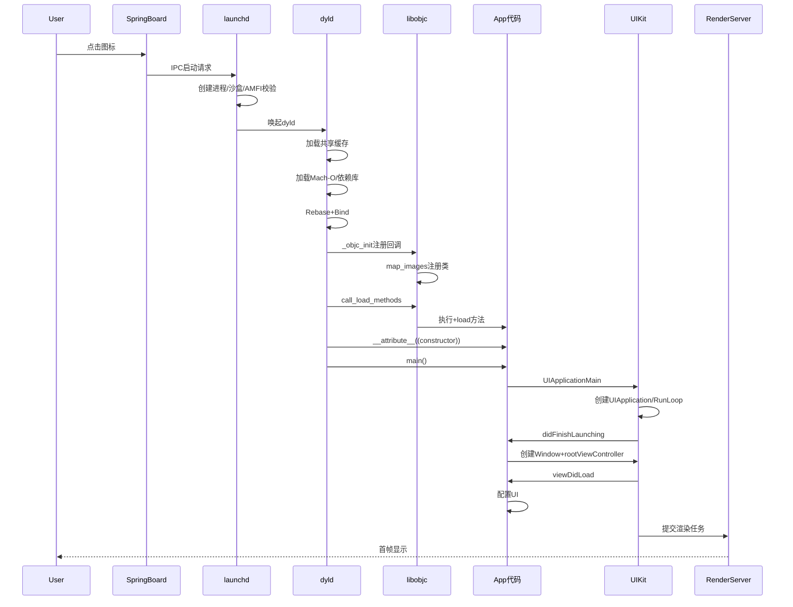

# iOS App启动全流程解析：从内核到首帧

> 从用户指尖触碰到图标，到首页完全呈现，iOS App的启动是一场由操作系统、底层框架和应用代码精密协作的交响乐。本文将带你深入每个乐章。

## 一、启动计时器：冷启动与热启动

性能优化首先要明确测量对象。iOS应用的启动分为两种状态：

*   **冷启动**：App进程尚不存在，系统需要从零开始创建进程、加载可执行文件。这是优化攻坚的主战场。
*   **热启动**：App进程存活于后台，只需从挂起状态恢复，代价小得多。

苹果建议App的首屏加载时间不宜超过**400毫秒**。优化启动时间，就是在与这400毫秒赛跑。

## 二、启动全流程图

```mermaid
flowchart TD
    A[用户点击图标] --> B[SpringBoard接收点击事件]
    B --> C[SpringBoard通过IPC通知launchd]
    C --> D[launchd创建新进程]
    D --> E[AMFI内核级签名校验]
    E --> F[系统分配PID并创建沙盒环境]
    F --> G[launchd唤起dyld动态链接器]
    
    subgraph dyld[dyld加载与链接阶段 - pre-main]
        G --> H1[dyld初始化自身]
        H1 --> H2[加载共享缓存库<br/>UIKit/Foundation等]
        H2 --> H3[解析App的Mach-O文件]
        H3 --> H4[递归加载所有依赖动态库]
        H4 --> H5[Rebase重定位<br/>_dyld_process_rebuild]
        H5 --> H6[Bind符号绑定<br/>_dyld_process_bind]
        H6 --> H7[ObjC Runtime初始化<br/>libobjc: _objc_init]
        H7 --> H8[执行+load方法<br/>call_load_methods]
        H8 --> H9[执行C++静态构造<br/>__attribute__constructor]
        H9 --> H10[dyld调用main()入口]
    end
    
    H10 --> I[进入main函数]
    I --> J[UIApplicationMain]
    
    subgraph UIKit[UIKit初始化阶段 - post-main]
        J --> K1[创建UIApplication单例<br/>+ [UIApplication sharedApplication]]
        K1 --> K2[创建AppDelegate并设置代理]
        K2 --> K3[开启主线程RunLoop<br/>CFRunLoopRun]
        K3 --> K4[调用AppDelegate回调]
    end
    
    K4 --> L1[application:willFinishLaunchingWithOptions:]
    L1 --> L2[application:didFinishLaunchingWithOptions:]
    L2 --> L3{是否使用SceneDelegate?}
    
    L3 -->|iOS 13+ Scene| M1[配置UIWindowScene]
    L3 -->|传统方式| M2[创建UIWindow并设置rootViewController]
    
    M1 --> N1[scene:willConnectToSession:options:]
    N1 --> N2[配置UIWindow并设置rootViewController]
    
    M2 --> O[首屏视图加载]
    N2 --> O
    
    subgraph Render[首屏渲染阶段]
        O --> P1[rootViewController.view加载]
        P1 --> P2[viewDidLoad执行]
        P2 --> P3[viewWillAppear执行]
        P3 --> P4[AutoLayout约束计算<br/>_updateConstraints]
        P4 --> P5[视图绘制drawRect]
        P5 --> P6[图层打包提交到GPU]
        P6 --> P7[viewDidAppear执行]
        P7 --> P8[首帧渲染完成]
    end
    
    P8 --> Q[用户可交互]
```

## 三、pre-main阶段：系统级的精密编排

从用户点击图标，到`main()`函数执行之前，这一阶段完全由操作系统和动态链接器主导。其核心是**dyld**（动态链接器）的工作。

### 1. 内核与SpringBoard：启动第一环

用户点击图标，`SpringBoard`（桌面进程）接收事件，通过IPC通知`launchd`进程。`launchd`是iOS的进程总管，它负责校验App签名（**AMFI**机制）、创建沙盒环境、分配PID，为App的诞生铺平道路。

```objective-c
// SpringBoard收到点击事件 -> 通过FBSSystemService发送启动请求
[FBSSystemService sendLaunchRequest:request];

// launchd收到请求后，调用execve()创建进程
execve(path, argv, envp);

// AMFI内核扩展校验签名
// 内核调用: amfi_memory_entry_check()
// 校验Mach-O的LC_CODE_SIGNATURE load command
```

### 2. dyld加载与共享缓存

`launchd`随后唤起`dyld`。`dyld`首先会加载系统预先优化的**动态库共享缓存**（UIKit、Foundation等），避免重复加载系统库，大幅提速。接着，它开始解析App的Mach-O可执行文件，并递归加载所有依赖的自定义动态库。

```objective-c
// dyld的入口函数（源码简化）
extern "C" void dyldbootstrap::start(...) {
    // 1. 设置运行环境
    setContext(mainExecutableMH, argc, argv, envp);
    
    // 2. 初始化自身
    _dyld_initializer();
    
    // 3. 加载共享缓存
    loadSharedCache();
    
    // 4. 实例化主程序
    instantiateFromLoadedImage(mainExecutableMH);
    
    // 5. 加载所有依赖库
    for (each dependency) {
        load(dependency);
        // 递归加载子依赖
    }
    ...
}
```

> **痛点：动态库数量**
> `dyld`加载的动态库越多，耗时越长。苹果建议自定义动态库不超过6个。过多的动态库是pre-main阶段的首要敌人。

### 3. Rebase与Bind：修正地址

由于**ASLR**（地址空间布局随机化）安全机制，Mach-O文件中的指针地址是"错的"。`dyld`必须在启动时根据随机偏移量**Rebase**（重定位）这些指针，并**Bind**（绑定）符号（将外部符号引用指向其真实内存地址）。

```objective-c
// Rebase: 修正ASLR偏移
_dyld_process_rebuild();
// 遍历所有Image，修正__DATA段的指针
for (each image) {
    rebaseImage(image, slide);
}

// Bind: 绑定符号
_dyld_process_bind();
// 查找符号地址并填入指针
for (each undefined symbol) {
    resolveSymbol(symbol);
}
```

> **痛点：ObjC元数据膨胀**
> 每个Swift类、@objc方法和属性都会生成ObjC元数据，这意味着更多需要Rebase的指针。抖音等大型App的Rebase操作可高达**200多万次**，贡献了数百毫秒的耗时。

### 4. ObjC Runtime初始化

`dyld`会调用`libobjc`，完成Runtime的全局初始化：注册所有类和分类、处理协议、进行Selector唯一性检查等。

```objective-c
// libobjc: _objc_init
void _objc_init(void) {
    // 注册dyld回调
    _dyld_objc_notify_register(&map_2_images, load_images, unmap_image);
}

// map_2_images: 注册所有类、分类、协议
void map_images(unsigned count, const char * const paths[]) {
    // 读取Mach-O的__objc_classlist段
    // 注册所有类到class_hash
    // 处理分类: 将方法添加到主类
    // SEL唯一化: _objc_registerSelectors
}
```

### 5. 执行初始化器

这是pre-main阶段的最后一步，也是开发者**唯一能直接影响**的环节。系统会按顺序执行：
- 每个ObjC类和分类的`+load`方法。
- 标记为`__attribute__((constructor))`的C/C++函数。
- C++静态对象的构造函数。

```objective-c
// load_images: 执行+load
void load_images(const char *path __unused, const struct mach_header *mh) {
    // 收集所有+load方法
    load_callers = getLoadMethods(mh);
    // 按继承顺序调用
    call_load_methods(load_callers);
}

// call_load_methods 内部
void call_load_methods(void) {
    // 先调用超类的+load，再调用子类的
    // 所有+load方法在主线程同步执行
    for (Class cls in loadable_classes) {
        (*cls->load)(cls, SEL_load);
    }
}
```

> **痛点：+load方法**
> `+load`在类被加载时**同步、阻塞**执行。如果在这里做网络请求、文件IO或复杂计算，会严重拖慢启动。**应尽量将逻辑迁移到`+initialize`或`application:didFinishLaunchingWithOptions:`中异步执行**。

### 6. iOS 15+ 预预热机制

从iOS 15开始，系统会在条件允许时**预预热**（Prewarming）App——即执行完上述所有pre-main步骤，但在调用`main()`前暂停。

> **重要陷阱**
> 预预热在设备**锁屏状态**下也可能发生。**切勿在`+load`等pre-main阶段代码中访问依赖解锁状态的服务（如Keychain）**，否则可能会失败。请使用MetricKit而非手动打点来准确测量用户真实感知的启动时间。

---

当`dyld`完成上述所有工作，它会跳转到Mach-O的入口点，执行`main()`函数，标志着应用代码正式接管控制权。

## 四、main()之后：UIKit初始化与首屏渲染

从`main()`到首页完全呈现，这一阶段由应用代码主导，也是优化的主战场。

### 1. UIApplicationMain与AppDelegate

`main()`函数调用`UIApplicationMain`，这完成了几个核心工作：
1.  创建`UIApplication`单例。
2.  创建`AppDelegate`实例并设置为其代理。
3.  开启主线程的**RunLoop**，开始监听事件。
4.  依次调用AppDelegate的生命周期方法：
    - `application(_:willFinishLaunchingWithOptions:)`
    - `application(_:didFinishLaunchingWithOptions:)` —— **优化核心入口**

```objective-c
// main.m
int main(int argc, char * argv[]) {
    @autoreleasepool {
        // 关键: 第三个参数为nil时使用UIApplication
        // 第四个参数为NSStringFromClass([AppDelegate class])
        return UIApplicationMain(argc, argv, nil, 
                                 NSStringFromClass([AppDelegate class]));
    }
}

// UIApplicationMain 内部实现（简化）
int UIApplicationMain(int argc, char *argv[], 
                      NSString *principalClassName, 
                      NSString *delegateClassName) {
    // 1. 创建UIApplication实例
    UIApplication *application = [principalClassName sharedApplication];
    
    // 2. 创建AppDelegate
    id<UIApplicationDelegate> delegate = [[delegateClassName alloc] init];
    application.delegate = delegate;
    
    // 3. 注册RunLoop的source/observer
    CFRunLoopRef mainRunLoop = CFRunLoopGetMain();
    CFRunLoopAddSource(mainRunLoop, applicationSource, kCFRunLoopDefaultMode);
    
    // 4. 通知代理即将启动
    [delegate application:application willFinishLaunchingWithOptions:nil];
    
    // 5. 通知代理完成启动
    if ([delegate application:application didFinishLaunchingWithOptions:nil]) {
        // 6. 启动事件循环
        CFRunLoopRun();  // 主线程卡在这里，持续处理事件
    }
    
    return 0;
}
```

### 2. 首屏视图层级构建与渲染

`didFinishLaunchingWithOptions`方法返回后，UIKit开始构建并渲染首屏视图：
1.  根据`Info.plist`或`SceneDelegate`配置，创建`UIWindow`并设置`rootViewController`。
2.  对`rootViewController`的视图（以及其所有子视图）进行**加载**（若使用Storyboard/XIB则解析XML）、**布局**（AutoLayout约束计算）和**绘制**。
3.  将最终渲染的像素数据提交给GPU，完成首帧显示。

```objective-c
// AppDelegate.m
- (BOOL)application:(UIApplication *)application 
    didFinishLaunchingWithOptions:(NSDictionary *)launchOptions {
    
    // 创建Window
    self.window = [[UIWindow alloc] initWithFrame:[UIScreen mainScreen].bounds];
    
    // 设置根控制器 - 此时视图尚未加载
    self.window.rootViewController = [[HomeViewController alloc] init];
    
    // 调用makeKeyAndVisible，触发视图加载
    [self.window makeKeyAndVisible];
    
    return YES;
}

// UIWindow的makeKeyAndVisible内部
- (void)makeKeyAndVisible {
    [self becomeKeyWindow];
    // 关键: 调用rootViewController.view，触发loadView
    [self.rootViewController view];
    // 内部调用链:
    // - [self loadView] -> 从XIB/Storyboard加载或调用loadView方法
    // - [self viewDidLoad]
    // - [self viewWillAppear:]
    // - 布局: [self.view setNeedsLayout] -> layoutSubviews
    // - 渲染: [self.view.layer display] -> 提交到渲染服务
    [self setHidden:NO];
}

// 视图渲染的调用栈（从CALayer到GPU）
- (void)_updateLayer {
    // 1. 递归布局
    [self layoutSublayersOfLayer:self.layer];
    
    // 2. 递归绘制
    [self drawLayer:self.layer inContext:UIGraphicsGetCurrentContext()];
    
    // 3. 打包成Bitmap
    CGImageRef image = CGBitmapContextCreateImage(context);
    
    // 4. 提交到Render Server
    CA::Render::Context::submit_layer(layer);
    // 最终通过GPU驱动渲染到屏幕
}

// 关键生命周期调用顺序
viewDidLoad -> viewWillAppear -> (约束计算) -> viewWillLayoutSubviews -> 
(视图绘制) -> viewDidLayoutSubviews -> viewDidAppear -> 首帧呈现
```

> **痛点：主线程阻塞**
> `didFinishLaunchingWithOptions`和`viewDidLoad`中的耗时任务（如同步网络请求、大量数据解析、复杂布局计算）会直接阻塞主线程，导致**用户已看到启动图，但界面"卡死"无法交互**。

## 五、时序图：完整的调用链路



## 六、排查工具与优化策略速查表

科学的优化离不开精准的测量。以下是核心工具与对应策略：

### 工具矩阵

| 工具                             | 用途                                   | 关键指标/命令                              |
| :------------------------------- | :------------------------------------- | :----------------------------------------- |
| **Instruments (App Launch模板)** | 分析pre-main和main()后各阶段精确耗时   | `DYLD_PRINT_STATISTICS=1` 输出pre-main详情 |
| **Xcode Organizer / MetricKit**  | 收集线上真实用户（非模拟器）的启动指标 | 冷/热启动分布、挂起率                      |
| **os_signpost**                  | 自定义性能打点，精细化监控关键业务路径 | 监控核心SDK初始化完成时间                  |
| **Time Profiler**                | 分析main()之后主线程CPU耗时            | 定位耗时函数调用栈                         |
| **System Trace**                 | 分析系统级调度、I/O、锁竞争            | 发现I/O瓶颈、线程阻塞                      |

### 性能瓶颈对照表

| 阶段      | 关键耗时点                 | 影响             | 优化策略                        |
| :-------- | :------------------------- | :--------------- | :------------------------------ |
| dyld阶段  | 依赖库加载数量             | pre-main耗时增加 | 合并/减少动态库，尽量使用静态库 |
| dyld阶段  | Rebase/Bind次数            | 指针修正耗时     | 减少ObjC元数据（@objc、类数量） |
| dyld阶段  | +load方法耗时              | 阻塞主线程       | 迁移到+initialize或异步         |
| dyld阶段  | C++静态构造                | 启动阻塞         | 延迟初始化或使用懒加载          |
| UIKit阶段 | didFinishLaunching同步任务 | 主线程阻塞       | 延迟/异步非核心SDK              |
| UIKit阶段 | 首屏视图层级深度           | 渲染耗时         | 减少嵌套、扁平化布局            |
| UIKit阶段 | AutoLayout复杂约束         | 布局计算耗时     | 预计算尺寸、使用Frame           |
| UIKit阶段 | 首屏大图解码               | 主线程卡顿       | 后台线程解码、预解码            |
| UIKit阶段 | 数据库/文件IO              | 主线程阻塞       | 异步读写、预热缓存              |

### 优化配置示例

```objective-c
// 1. 设置DYLD环境变量分析pre-main耗时
// Scheme -> Run -> Arguments -> Environment Variables
// DYLD_PRINT_STATISTICS = 1
// DYLD_PRINT_STATISTICS_DETAILS = 1

// 2. 延迟初始化非核心SDK
- (BOOL)application:(UIApplication *)application 
    didFinishLaunchingWithOptions:(NSDictionary *)launchOptions {
    
    // 核心：必须立即初始化的SDK
    [self initCoreSDKs];
    
    // 非核心：异步/延迟加载
    dispatch_async(dispatch_get_global_queue(0, 0), ^{
        [self initThirdPartySDKs];
    });
    
    return YES;
}

// 3. 使用os_signpost精细化打点
- (void)initCoreSDKs {
    os_signpost_id_t signpostID = os_signpost_id_generate(log);
    os_signpost_interval_begin(log, signpostID, "InitCore");
    
    // 核心SDK初始化代码...
    
    os_signpost_interval_end(log, signpostID, "InitCore");
}
```

## 七、常见问题与排查方案

### 问题1：启动卡死在启动图

**现象**：用户看到启动图后，界面长时间无响应。

**排查方案**：
1. 使用Time Profiler分析`didFinishLaunchingWithOptions`和`viewDidLoad`的耗时
2. 检查是否有主线程同步网络请求
3. 检查是否有大量数据反序列化操作
4. 使用os_signpost埋点，精确追踪每个阶段

### 问题2：冷启动明显慢于热启动

**现象**：冷启动耗时远超热启动。

**排查方案**：
1. 使用`DYLD_PRINT_STATISTICS`查看pre-main各阶段耗时
2. 检查动态库数量和大小
3. 检查+load方法中是否有耗时操作
4. 检查C++全局对象构造

### 问题3：线上启动耗时远超本地测试

**现象**：Xcode Organizer数据显示线上启动耗时远高于本地测试。

**排查方案**：
1. 检查启动图是否有变化（系统在启动图移除后才计时）
2. 检查是否有AB实验或Feature Flag影响
3. 使用MetricKit收集真实用户数据
4. 注意iOS 15+预预热的影响

### 问题4：特定设备型号启动慢

**现象**：低端设备启动明显慢于高端设备。

**排查方案**：
1. 检查是否在低端设备上做了更多的降级兼容逻辑
2. 检查是否有型号相关的条件分支
3. 使用Instruments在真实低端设备上测试
4. 优化内存占用，减少Page Fault

## 结语

App启动优化是一场没有终点的旅程。唯有深入理解从`dyld`的Rebase到RunLoop的首帧绘制，这一条完整链路中的每一个环节，方能透过Instruments的数据表象，精准定位并解决真正的瓶颈，为用户带来"秒开"的畅快体验。

## 附录：关键代码调用链速查

```
用户点击 → SpringBoard → launchd → execve() → AMFI校验
    ↓
dyldbootstrap::start() → loadSharedCache() → load()依赖库
    ↓
_dyld_process_rebuild() → _dyld_process_bind() → _objc_init()
    ↓
map_2_images() → load_images() → call_load_methods() → +load
    ↓
main() → UIApplicationMain() → UIApplication单例 → AppDelegate
    ↓
willFinishLaunching → didFinishLaunching → makeKeyAndVisible
    ↓
rootViewController.view → loadView → viewDidLoad → viewWillAppear
    ↓
layoutSubviews → drawRect → CALayer提交 → RenderServer → GPU → 首帧
```