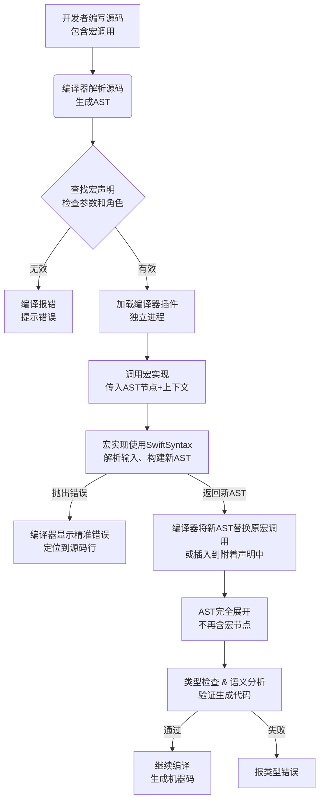
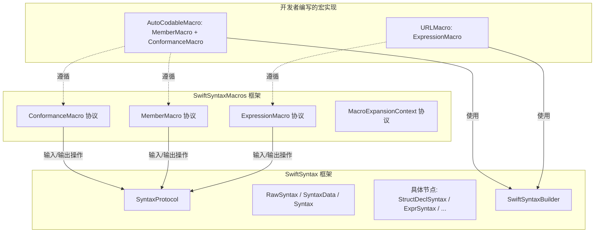
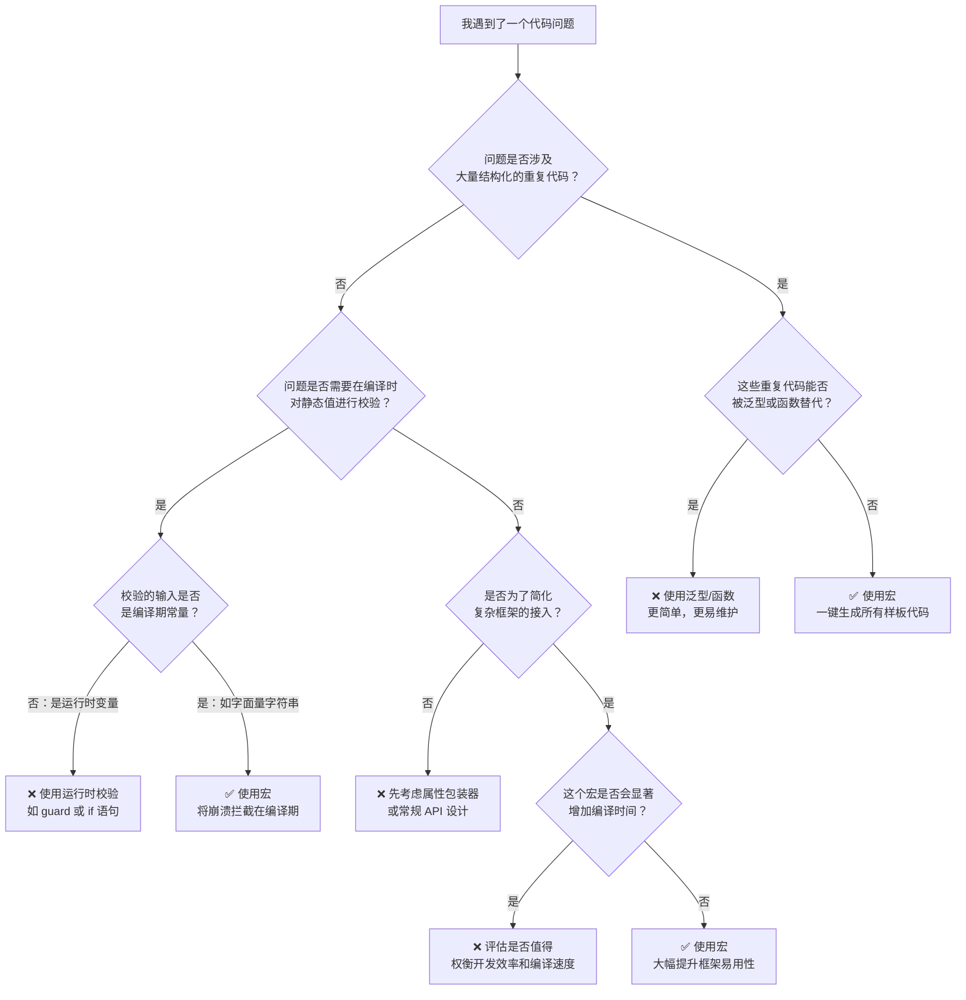
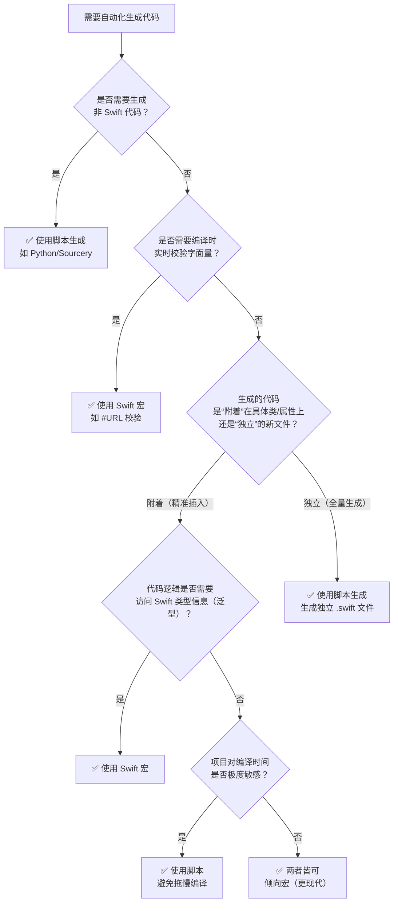

# Swift 宏完全指南

## 1. 为什么需要 Swift 宏？

Swift 宏是 Swift 5.9 引入的**编译时代码生成**机制，它允许开发者在编译阶段对代码进行**校验、转换或生成新的代码**，从而减少样板代码，提高开发效率。

在没有宏之前，很多代码模式要么必须手动编写，要么只能等 Apple 将其变成语言内置功能。Swift 宏解决的典型问题包括：

- **消灭样板代码**：如为 `struct` 自动生成成员初始化方法。
- **让复杂功能更易用**：如 `@Observable` 宏自动添加观察者模式实现。
- **库作者的新武器**：将宏打包分发，让用户轻松采用复杂功能。

简而言之，Swift 需要的是一个**安全、强大、可调试、与语言融为一体的现代化元编程工具**，而不是一个充满风险的文本替换器。

---

## 2. Swift 宏的四大设计目标

| 目标                 | 说明                                                                          |
| :------------------- | :---------------------------------------------------------------------------- |
| **使用位置清晰可辨** | 独立宏（`#`）和附着宏（`@`）从语法上明确区分。                                |
| **完整类型检查**     | 宏的输入和输出都经过编译器类型检查，实现有 bug 会产生编译错误而非运行时崩溃。 |
| **可预测的插入方式** | 宏遵循“仅做加法”原则，只添加代码，不修改或删除现有代码。                      |
| **宏不是魔法**       | 可在 Xcode 中通过“Expand Macro”查看展开后的代码，甚至设置断点调试。           |

---

## 3. 宏 vs. 属性 vs. 编译器指令

三者都作用于编译时，但作用对象和目的不同：

| 概念                        | 前缀       | 作用对象                         | 核心功能                                    |
| :-------------------------- | :--------- | :------------------------------- | :------------------------------------------ |
| **属性 (Attributes)**       | `@`        | 附着在声明上（类、函数、属性等） | 添加**元数据**，指导编译器如何处理          |
| **宏 (Macros)**             | `#` 或 `@` | 独立出现或附着在声明上           | **生成代码**，在编译时展开为 Swift 代码     |
| **编译器指令 (Directives)** | `#`        | 作用于代码块或全局上下文         | 控制**编译流程**（条件编译、触发警告/错误） |

> **如何快速区分：** 凡是能在 Xcode 中右键选择 **“Expand Macro”** 展开的，一定是宏。不能展开的，`@` 开头是属性，`#` 开头是指令或字面量。


## 4. 宏的分类

### 4.1 独立宏（Freestanding Macros）

| 特征         | 说明                                                        |
| :----------- | :---------------------------------------------------------- |
| **语法**     | 以 `#` 开头                                                 |
| **使用位置** | 独立出现在代码的任何位置（表达式或声明）                    |
| **声明标记** | `@freestanding(expression)` 或 `@freestanding(declaration)` |
| **实现协议** | `ExpressionMacro` 或 `DeclarationMacro`                     |
| **示例**     | `#URL("...")`、`#warning("...")`、`#file`、`#Preview`       |

### 4.2 附着宏（Attached Macros）

| 特征         | 说明                                                                                                 |
| :----------- | :--------------------------------------------------------------------------------------------------- |
| **语法**     | 以 `@` 开头                                                                                          |
| **使用位置** | 必须附着在 `class`、`struct`、`var`、`func` 等声明上                                                 |
| **声明标记** | `@attached(role, names: ...)`                                                                        |
| **实现协议** | `PeerMacro`, `AccessorMacro`, `MemberMacro`, `ConformanceMacro`, `MemberAttributeMacro`, `BodyMacro` |
| **示例**     | `@Observable`、`@State`、`@AutoCodable`                                                              |

### 4.3 附着宏的角色（Roles）

| 角色              | 实现协议               | 作用                                          |
| :---------------- | :--------------------- | :-------------------------------------------- |
| `peer`            | `PeerMacro`            | 为附着声明添加新声明（如添加方法）            |
| `accessor`        | `AccessorMacro`        | 为属性添加 getter/setter 等                   |
| `memberAttribute` | `MemberAttributeMacro` | 为类型内的已有成员添加属性（如 `@Published`） |
| `member`          | `MemberMacro`          | 为类型添加新成员（方法、嵌套类型等）          |
| `conformance`     | `ConformanceMacro`     | 为类型添加协议遵循                            |
| `body`            | `BodyMacro`            | 为函数提供实现体                              |

---

## 5. Swift 宏 vs. Objective-C 宏

| 特性维度         | Objective-C 宏 (预处理器)      | Swift 宏                             |
| :--------------- | :----------------------------- | :----------------------------------- |
| **本质**         | 文本级的查找与替换             | 在语法树（AST）上生成代码            |
| **处理阶段**     | 预编译阶段（早于编译器）       | 编译阶段（编译器工作流的一部分）     |
| **类型安全**     | 不安全，纯文本操作容易导致错误 | 完全类型安全，输入输出都经过类型检查 |
| **调试体验**     | 差，错误信息晦涩难懂           | 透明，可查看宏展开、设置断点         |
| **作用与副作用** | 可改可删，不可预测             | 仅做加法（Additive），只添加不修改   |
| **设计哲学**     | 功能强大但危险                 | 安全且强大                           |

---

## 6. 声明与实现分离

### 6.1 两个 Target 的职责

| Target                               | 内容                                           | 运行时机                      | 发布形式            |
| :----------------------------------- | :--------------------------------------------- | :---------------------------- | :------------------ |
| **声明 Target**（如 `MyMacros`）     | 仅包含 `public macro` 声明                     | 编译到用户 App 时参与符号解析 | 源码形式            |
| **实现 Target**（如 `MyMacrosImpl`） | 包含遵守协议的宏实现结构体，依赖 `SwiftSyntax` | 作为编译器插件独立进程运行    | `.macro` 二进制插件 |

### 6.2 为什么要强制分离？

- **性能**：实现 Target 依赖庞大的 `SwiftSyntax` 库，分离后不会打进 App，避免增大体积。
- **安全**：宏实现在独立子进程中运行，即使崩溃也不会导致主编译器崩溃。
- **编译顺序**：宏展开发生在类型检查之前，插件必须优先编译，分离后可精确控制编译顺序。
- **二进制分发**：库作者可只公开声明，将实现以预编译插件分发，缩短用户编译时间。

---

## 7. 宏的工作流程

### 7.1 完整流程图



### 7.2 详细步骤拆解

1. **源码解析**：编译器生成抽象语法树（AST），宏调用作为特殊节点保留。
2. **宏查找与解析**：
   - 编译器根据作用域找到宏的声明。
   - 验证参数类型、宏角色是否匹配使用上下文。
   - 读取 `#externalMacro(module:type:)` 确定实现位置。
3. **加载编译器插件**：主编译器在独立子进程中加载宏实现二进制。
4. **调用宏实现**：
   - 独立宏：调用 `ExpressionMacro.expansion(of:in:)`，传入调用节点。
   - 附着宏：根据角色调用不同方法（如 `MemberMacro.expansion(...)`），传入被附着的完整声明节点。
5. **替换/插入**：
   - 独立宏：用新表达式 AST 替换原宏调用节点。
   - 附着宏：将新声明 AST 插入到附着声明内部或头部（如添加协议遵循）。
6. **类型检查与验证**：编译器对展开后的完整 AST 进行类型检查。
7. **后续编译**：经过 SIL 优化、LLVM IR 生成，最终生成机器码。

---

## 8. 关键概念与 API

### 8.1 SwiftSyntax

- 独立的 Swift 库，提供对 AST 节点的强类型封装（如 `ExprSyntax`、`DeclSyntax`）。
- 宏的输入和输出都依赖它，宏实现通过它提取参数、构建新代码节点。

### 8.2 宏实现协议

**独立宏：**
- `ExpressionMacro`：生成表达式（如 `#URL`）。
- `DeclarationMacro`：生成声明（如 `#warning`）。

**附着宏：**
- `PeerMacro`、`AccessorMacro`、`MemberMacro`、`ConformanceMacro`、`MemberAttributeMacro`、`BodyMacro`

### 8.3 MacroExpansionContext

- 提供宏所在的源代码位置、模块名、文件名等信息。
- 可用于生成唯一符号名（如 `context.makeUniqueName()`）避免命名冲突。

---

## 9. 如何创建自定义宏

### 9.1 步骤

1. **创建 Package**（使用 SPM 或 Xcode 的宏模板）。
2. **定义宏声明**（在声明 Target 中）：
   ```swift
   @freestanding(expression)
   public macro URL(_ stringLiteral: String) -> URL = #externalMacro(module: "MyMacrosImpl", type: "URLMacro")
   ```
3. **实现宏逻辑**（在实现 Target 中）：
   ```swift
   import SwiftSyntax
   import SwiftSyntaxMacros
   
   public struct URLMacro: ExpressionMacro {
       public static func expansion(...) throws -> ExprSyntax {
           // 提取参数、校验、生成新 AST
       }
   }
   ```
4. **配置 Package.swift**：添加 `.macro` 类型的目标，并依赖 `SwiftSyntax`。
5. **导入并使用**：在使用宏的模块中 `import MyMacros`，然后调用。

### 9.2 示例：`@AutoCodable` 附着宏

**声明：**
```swift
@attached(member, names: named(CodingKeys), named(init(from:)), named(encode(to:)))
@attached(conformance)
public macro AutoCodable() = #externalMacro(module: "MyMacrosImpl", type: "AutoCodableMacro")
```

**使用：**
```swift
@AutoCodable
struct User {
    let id: Int
    var name: String
}
```

**展开后：**
```swift
struct User {
    let id: Int
    var name: String
    enum CodingKeys: String, CodingKey { case id, name }
    init(from decoder: Decoder) throws { ... }
    func encode(to encoder: Encoder) throws { ... }
}
extension User: Codable {}
```

---

## 10. 使用注意事项

### 10.1 增量操作
宏只能**添加**新代码，不能删除或修改已有代码，保证行为可预测。

### 10.2 编译时错误处理
宏实现中可抛出任何错误，错误信息会精准显示在宏调用位置。

### 10.3 调试技巧
- 在 Xcode 中右键点击宏调用，选择 **“Expand Macro”** 查看展开后的代码。
- 可在展开后的代码上设置断点进行运行时调试。

### 10.4 命名冲突
- 声明 `@attached(member, names: ...)` 时必须列出所有生成的名称，以便编译器检查冲突。
- 如果生成的名称是动态的，可使用 `arbitrary`。

### 10.5 性能考量
- 宏在编译时执行，不影响运行时性能。
- 但宏实现本身应尽量高效，避免在编译阶段进行高耗时操作。

---

## 11. SwiftSyntax 框架详解

### 11.1 概述

`SwiftSyntax` 是一组用于**解析、检查、生成和转换** Swift 源代码的库。它是构建 Swift 宏、格式化工具 `swift-format` 和 Swift 解析器的基础。

`SwiftSyntax` 最初基于 `libSyntax` 库开发，于 2017 年 8 月从 Swift 语言主仓库中分离出来。

### 11.2 三大核心设计原则

SwiftSyntax 的语法树围绕三个核心原则设计：

#### 11.2.1 不可变性（Immutability）

语法树是**完全不可变的持久化数据结构（persistent data structure）**：

- 一旦创建，语法树**永不改变**。
- 任何修改都会创建一棵**新的语法树**，通过**结构共享（structural sharing）** 仅复制发生变更的最小结构，未变更的部分在新旧树之间共享。
- 这种设计带来两大好处：
  - **内存高效**：大幅减少复制大型数据结构的内存开销。
  - **无畏并发（Fearless Concurrency）**：多线程操作语法树是安全的，无需锁或互斥量。

#### 11.2.2 源码保真（Source Fidelity）

语法树不仅表示代码的语法结构，还精确保留了**空格、注释、编译器指令**以及 Unicode 字节顺序标记等“不可见”信息。这些非语法实体统称为 **“琐碎内容（Trivia）”**。

语法树持有源代码的**每一个字节**，可以**完全精确地**将原始文档渲染回来。

#### 11.2.3 弹性（Resilience）

为实现源码保真，语法树必须能够同时表示**格式正确**和**格式错误**的源代码。语法树可以表示两类错误：

- **缺失语法（Missing Syntax）**：表示解析器预期存在但源码中缺失的语法元素，以 `SourcePresence.missing` 标记。
- **意外语法（Unexpected Syntax）**：表示源码中存在但解析器未预期的语法元素。

这使得 SwiftSyntax 可以用于**代码补全、静态分析、增量编译**等需要处理不完整代码的场景。

### 11.3 核心架构

```
┌─────────────────────────────────────────────────────────────────┐
│                     用户层 (User Layer)                        │
│  ┌─────────────┐  ┌─────────────┐  ┌─────────────────────────┐│
│  │  SwiftParser │  │ swift-format │  │     Swift 宏插件        ││
│  └─────────────┘  └─────────────┘  └─────────────────────────┘│
├─────────────────────────────────────────────────────────────────┤
│              SwiftSyntax 框架 (Framework Layer)                │
│  ┌──────────────────────────────────────────────────────────┐  │
│  │  SyntaxProtocol (协议)                                   │  │
│  │  ┌──────────────┐  ┌──────────────┐  ┌──────────────┐  │  │
│  │  │   RawSyntax  │  │  SyntaxData  │  │    Syntax    │  │  │
│  │  │  (底层存储)   │  │  (存储容器)   │  │  (公共接口)   │  │  │
│  │  └──────────────┘  └──────────────┘  └──────────────┘  │  │
│  └──────────────────────────────────────────────────────────┘  │
│  ┌──────────────────────────────────────────────────────────┐  │
│  │  具体节点层：StructDeclSyntax / ClassDeclSyntax / ...   │  │
│  │  ExprSyntax / StmtSyntax / TypeSyntax / PatternSyntax   │  │
│  └──────────────────────────────────────────────────────────┘  │
│  ┌──────────────────────────────────────────────────────────┐  │
│  │  遍历与重写层：SyntaxVisitor / SyntaxRewriter            │  │
│  └──────────────────────────────────────────────────────────┘  │
│  ┌──────────────────────────────────────────────────────────┐  │
│  │  辅助工具：Trivia / TokenSyntax / SwiftSyntaxBuilder     │  │
│  └──────────────────────────────────────────────────────────┘  │
├─────────────────────────────────────────────────────────────────┤
│              依赖库 (Dependent Libraries)                      │
│  ┌────────────┐ ┌────────────┐ ┌────────────┐ ┌────────────┐  │
│  │SwiftParser │ │SwiftOperators│ │SwiftDiagnostics│ │SwiftBuilder│  │
│  └────────────┘ └────────────┘ └────────────┘ └────────────┘  │
└─────────────────────────────────────────────────────────────────┘
```

### 11.4 核心类与协议

#### 11.4.1 核心存储层

| 类型              | 说明                                                                                                                     |
| :---------------- | :----------------------------------------------------------------------------------------------------------------------- |
| **`RawSyntax`**   | 语法树的**底层原始存储**，是不可变的值类型。包含节点类型（`kind`）、子节点布局（`layout`）和源码存在状态（`presence`）。 |
| **`SyntaxData`**  | **`Syntax` 的底层存储容器**，是引用类型。持有 `RawSyntax`、父节点索引和弱引用的父节点，实现父子关系的链接。              |
| **`SyntaxArena`** | **内存分配器**，负责管理 `RawSyntax` 节点的内存生命周期，对开发者通常透明。                                              |

#### 11.4.2 公共接口层

| 类型                     | 说明                                                                          |
| :----------------------- | :---------------------------------------------------------------------------- |
| **`SyntaxProtocol`**     | 所有语法节点的基础协议，提供 `raw`、`parent`、`root`、`children` 等核心能力。 |
| **`Syntax`**             | 所有语法节点的**公共包装类型**，是面向用户的主要类型。                        |
| **`TokenSyntax`**        | **叶子节点**，代表源代码中的一个 Token（标识符、关键字、运算符、字面量等）。  |
| **`Trivia`**             | **词法细节集合**，代表空格、注释等非语法内容。                                |
| **`TokenKind`**          | Token 类型枚举。                                                              |
| **`SourcePresence`**     | 节点存在状态：`.present` 或 `.missing`。                                      |
| **`SyntaxTreeViewMode`** | 遍历模式，控制如何处理 `missing` 和 `unexpected` 节点。                       |

#### 11.4.3 具体节点层

SwiftSyntax 为 Swift 语法中的每一种结构都定义了对应的节点类型：

**声明节点（Declarations）：**
- `StructDeclSyntax`：`struct` 声明
- `ClassDeclSyntax`：`class` 声明
- `ProtocolDeclSyntax`：`protocol` 声明
- `ExtensionDeclSyntax`：`extension` 声明
- `FunctionDeclSyntax`：`func` 声明
- `VariableDeclSyntax`：`var`/`let` 声明
- `EnumDeclSyntax`：`enum` 声明
- `InitializerDeclSyntax`：`init` 声明
- `MacroExpansionDeclSyntax`：独立宏在声明位置的展开
- `MissingDeclSyntax`：缺失声明的占位节点

**表达式节点（Expressions）：**
- `ArrayExprSyntax`：数组字面量
- `BinaryOperatorExprSyntax`：二元运算符
- `MissingExprSyntax`：缺失表达式的占位节点

#### 11.4.4 遍历与重写层

| 类型                            | 说明                                                                                           |
| :------------------------------ | :--------------------------------------------------------------------------------------------- |
| **`SyntaxVisitor`**             | **只读遍历器**，采用访问者模式（Visitor Pattern）。子类可重写 `visit` 方法对特定节点执行操作。 |
| **`SyntaxRewriter`**            | **读写重写器**，在遍历的同时可替换或修改节点。                                                 |
| **`SyntaxVisitorContinueKind`** | 控制是否继续遍历子节点。                                                                       |

### 11.5 相关子模块

SwiftSyntax 不是一个单一库，而是一组库的集合：

| 模块                      | 说明                                       |
| :------------------------ | :----------------------------------------- |
| **`SwiftParser`**         | Swift 源代码解析器，将源码文本解析为语法树 |
| **`SwiftSyntaxBuilder`**  | 通过 `@resultBuilder` 声明式生成代码       |
| **`SwiftOperators`**      | 处理 Swift 运算符的优先级和结合性          |
| **`SwiftDiagnostics`**    | 诊断信息处理                               |
| **`SwiftBasicFormat`**    | 代码格式化基础能力                         |
| **`SwiftCompilerPlugin`** | 编译器插件支持                             |

---

## 12. SwiftSyntaxMacros 框架详解

### 12.1 概述

`SwiftSyntaxMacros` 是一个**提供宏支持**的实验性库。它定义了一系列**协议（Protocols）**，开发者通过实现这些协议来创建自定义宏。它是连接**开发者逻辑**和 **`SwiftSyntax` 底层能力**的桥梁。

### 12.2 核心宏协议

新的宏可以通过创建遵循各种 `*Macro` 协议的新类型来引入。

#### 12.2.1 独立宏协议（Freestanding Macros）

| 协议                   | 说明                   |
| :--------------------- | :--------------------- |
| **`ExpressionMacro`**  | 生成**表达式**的独立宏 |
| **`DeclarationMacro`** | 生成**声明**的独立宏   |

#### 12.2.2 附着宏协议（Attached Macros）

附着宏必须与已有的类型或声明关联使用，以 `@` 开头。每个宏可以有**一个或多个角色**，这些角色在宏声明的开始部分以属性的形式定义。每个角色需要遵循不同的协议：

| 角色                         | 协议                       | 描述                                    |
| :--------------------------- | :------------------------- | :-------------------------------------- |
| `@attached(peer)`            | **`PeerMacro`**            | 为关联的声明添加一段新的同级声明        |
| `@attached(accessor)`        | **`AccessorMacro`**        | 为关联的属性添加存取代码（get、set 等） |
| `@attached(memberAttribute)` | **`MemberAttributeMacro`** | 为关联的类型或扩展中的成员添加新特性    |
| `@attached(member)`          | **`MemberMacro`**          | 为关联的类型或扩展添加新的成员声明      |
| `@attached(conformance)`     | **`ConformanceMacro`**     | 为关联的类型或扩展添加新的协议遵循      |
| `@attached(body)`            | **`BodyMacro`**            | 为函数提供实现体                        |

### 12.3 上下文与辅助类型

| 类型                               | 说明                                                                   |
| :--------------------------------- | :--------------------------------------------------------------------- |
| **`MacroExpansionContext`**        | 提供宏运行时的环境信息（文件名、模块名等），并提供生成唯一符号名的方法 |
| **`BasicMacroExpansionContext`**   | `MacroExpansionContext` 的实现，适用于测试                             |
| **`MacroRole`**                    | 宏角色枚举                                                             |
| **`MacroExpansionErrorMessage`**   | 宏展开时的错误信息                                                     |
| **`MacroExpansionWarningMessage`** | 宏展开时的警告信息                                                     |

---

## 13. SwiftSyntax 与 SwiftSyntaxMacros 的关系



- **`SwiftSyntax`** 是**底层基石**，提供了操作 Swift 源代码的语法树能力。
- **`SwiftSyntaxMacros`** 是**上层规范**，定义了宏开发必须遵循的协议和上下文接口。
- 宏实现代码通过遵循 `SwiftSyntaxMacros` 中的协议，利用 `SwiftSyntax` 提供的 API 来解析输入和生成输出。

---

## 14. 设计模式总结

SwiftSyntax 和 SwiftSyntaxMacros 采用了多种经典设计模式：

| 设计模式                                       | 应用场景                                                                          |
| :--------------------------------------------- | :-------------------------------------------------------------------------------- |
| **访问者模式（Visitor Pattern）**              | `SyntaxVisitor` 用于遍历语法树，对不同类型的节点执行不同操作。                    |
| **建造者模式（Builder Pattern）**              | `SwiftSyntaxBuilder` 通过 `@resultBuilder` 提供声明式的语法树构建方式。           |
| **协议导向设计（Protocol-Oriented Design）**   | `SwiftSyntaxMacros` 通过协议（`ExpressionMacro`、`MemberMacro` 等）定义宏的行为。 |
| **不可变对象模式（Immutable Object Pattern）** | 语法树是完全不可变的持久化数据结构。                                              |
| **策略模式（Strategy Pattern）**               | `SyntaxTreeViewMode` 控制遍历时的不同策略。                                       |
| **工厂模式（Factory Pattern）**                | `SwiftParser` 解析源码并生成语法树。                                              |

---

## 15. 宏的应用场景与推荐使用指南

宏是一个强大的工具，但它并不是万能的。理解何时该用宏、何时不该用宏，是掌握这门技术的精髓。

### 15.1 宏的核心能力定位

| 核心能力           | 说明                                       | 典型产物                         |
| :----------------- | :----------------------------------------- | :------------------------------- |
| **编译时校验**     | 在编译阶段检查值的有效性，提前拦截错误     | `#URL` 校验字符串是否为合法 URL  |
| **编译时代码生成** | 根据已有声明，自动生成重复的、结构化的代码 | `@Observable` 生成观察者模式代码 |

其他所有场景，都可以归结为这两种能力的组合。

### 15.2 ✅ 推荐使用宏的场景

#### 15.2.1 消灭大量重复的样板代码（Boilerplate Reduction）

| 场景                            | 宏示例                     | 手写代码量                                          | 生成后效果                                 |
| :------------------------------ | :------------------------- | :-------------------------------------------------- | :----------------------------------------- |
| 自动遵循 `Codable`              | `@AutoCodable`             | 每次手写 `CodingKeys`、`init(from:)`、`encode(to:)` | 一键展开，自动适配所有属性                 |
| 自动生成 `Mock` 类              | `@AutoMockable`            | 为每个协议手写 Mock 实现                            | 在测试中自动生成完整的 Mock 类             |
| 自动生成初始化器                | `@Init` / `@DefaultInit`   | 手动写多个 `init` 重载                              | 自动根据属性生成对应的初始化方法           |
| 自动实现 `Equatable`/`Hashable` | `@Equatable` / `@Hashable` | 手写 `==` 函数和 `hash(into:)`                      | 宏自动展开实现（尤其适用于属性众多的类型） |

#### 15.2.2 编译时的安全校验（Compile-time Validation）

| 场景             | 宏示例              | 安全问题                                     | 宏解决方案                                      |
| :--------------- | :------------------ | :------------------------------------------- | :---------------------------------------------- |
| URL 校验         | `#URL("...")`       | 运行时因 URL 格式错误导致 `nil` 强制解包崩溃 | 编译时校验字符串格式，无效则编译报错            |
| 本地化字符串校验 | `#Localized("key")` | 使用了不存在的本地化 key，运行时显示乱码     | 编译时校验 `Localizable.strings` 是否包含该 key |
| 正则表达式校验   | `#Regex("[a-z]+")`  | 运行时正则语法错误导致崩溃                   | 编译时校验正则语法，无效则编译报错              |
| 资源文件校验     | `#Image("icon")`    | 引用了不存在的图片资源，运行时显示空白       | 编译时校验 Asset Catalog 是否存在该图片         |

#### 15.2.3 简化和封装复杂框架的接入（Framework Convenience）

| 场景               | 宏示例                   | 用户视角              | 宏内部做了什么                                      |
| :----------------- | :----------------------- | :-------------------- | :-------------------------------------------------- |
| SwiftData 数据模型 | `@Model`                 | 用户仅需标记 `@Model` | 自动生成持久化存储、CRUD 操作、关系映射等数百行代码 |
| SwiftUI 状态管理   | `@Observable` / `@State` | 用户仅需标记属性      | 自动生成观察者注册、值变化通知、视图重绘调度等代码  |
| 依赖注入容器       | `@Inject`                | 用户仅需声明属性      | 自动生成服务注册、查找、生命周期管理等代码          |
| API 请求封装       | `@GET("/users/{id}")`    | 用户仅声明端点路径    | 自动生成网络请求、参数绑定、响应解析代码            |

#### 15.2.4 声明式 DSL 的构建（Declarative DSL）

| 场景           | 宏示例                        | 说明                                                  |
| :------------- | :---------------------------- | :---------------------------------------------------- |
| 自动路由生成   | `@Route`                      | 根据函数名和方法参数自动生成 URL 路由解析器           |
| 自动化 UI 快照 | `#Snapshot`                   | 在测试中一键生成多个设备的快照测试代码                |
| SQL 查询构建   | `#SQL("SELECT * FROM users")` | 编译时校验 SQL 语法，并自动生成类型安全的查询结果映射 |

### 15.3 ❌ 不推荐使用宏的场景（宏的局限性与陷阱）

#### 15.3.1 需要运行时动态信息的逻辑

| 不适用场景                                | 原因                                             |
| :---------------------------------------- | :----------------------------------------------- |
| 依赖用户输入（如 `#URL(TextField.text)`） | 用户输入在编译时未知，宏无法校验                 |
| 依赖网络请求返回的数据                    | 数据在运行时才到达，宏无法处理动态值             |
| 依赖当前设备环境（如时区、语言）          | 这些是运行时环境的属性                           |
| 复杂的业务逻辑（如折扣计算、权限判断）    | 这些逻辑变化频繁，应写在普通函数中以便修改和测试 |

#### 15.3.2 已有更好语言特性的场景

| 已有特性                            | 更优的原因                                             | 何时用它而非宏                                            |
| :---------------------------------- | :----------------------------------------------------- | :-------------------------------------------------------- |
| **泛型（Generics）**                | 泛型是类型安全的编译时多态，不生成新代码，只做类型约束 | 需要类型参数化的容器、算法和功能扩展                      |
| **属性包装器（Property Wrappers）** | 包装器在运行时封装属性的存储和访问逻辑，可依赖外部状态 | 需要封装属性的读写逻辑，如 UserDefaults、文件存储         |
| **结果构建器（Result Builders）**   | 构建器本身就是用于声明式构造复杂数据结构的语言特性     | 构建声明式 UI（如 SwiftUI）、格式化输出（如 HTML 构建器） |
| **函数/闭包（Closures）**           | 函数式编程可以高效复用行为                             | 需要传入行为逻辑的场景（如排序、回调）                    |
| **扩展（Extensions）**              | 扩展可以很好地为类型添加方法                           | 需要为现有类型添加功能，且逻辑不依赖于外部元数据          |

#### 15.3.3 导致编译时间显著增加的宏

| 症状                               | 建议                                    |
| :--------------------------------- | :-------------------------------------- |
| 宏展开耗时超过 500ms               | 尝试优化宏内部逻辑，减少 AST 的遍历次数 |
| 宏在大型项目中使用超过 10 次       | 考虑使用泛型或属性包装器替代            |
| 宏内部执行了 IO 操作（如读取文件） | 避免在宏中执行 IO，这会拖慢整个编译     |

#### 15.3.4 对调试和理解有极高要求的代码

| 场景                     | 建议                                 |
| :----------------------- | :----------------------------------- |
| 核心业务逻辑模块         | 使用普通函数和类，确保代码透明可读   |
| 新加入团队的成员较多     | 优先使用常规语言特性，逐步引入宏     |
| 代码需要被频繁修改和审查 | 宏生成的代码难以在 PR 中展示变更内容 |

---

## 16. 决策指南：何时使用宏？



---

## 17. 宏的适用场景速查表

| 场景分类                 | 推荐度     | 推荐理由                             | 典型示例                |
| :----------------------- | :--------- | :----------------------------------- | :---------------------- |
| 模型层自动遵循 `Codable` | ✅ 强烈推荐 | 每个模型都需要，手工枯燥且易错       | `@AutoCodable`          |
| 编译时校验常量值         | ✅ 强烈推荐 | 将运行时崩溃左移到编译时             | `#URL`、`#Localized`    |
| 自动生成 Mock 测试类     | ✅ 推荐     | 测试代码本身不重要，但需要完整实现   | `@AutoMockable`         |
| 简化 SwiftUI 数据绑定    | ✅ 强烈推荐 | 框架的官方推荐方式                   | `@Observable`、`@Model` |
| 自动生成初始化器         | ⚠️ 视情况   | 属性过多时有用，但可被默认初始化替代 | `@Init`                 |
| 运行时依赖用户输入       | ❌ 不推荐   | 宏无法获得运行时动态值               | -                       |
| 复杂业务逻辑             | ❌ 不推荐   | 应使用可测试的普通函数               | -                       |
| 经常变动的 UI 布局代码   | ❌ 不推荐   | 布局变动频繁，宏展开不便于调试       | -                       |
| 接入复杂第三方 SDK       | ✅ 推荐     | 极大降低库的学习成本                 | `@Inject`、`@API`       |

**一句话总结：当你在写 “if this, then that” 但模式高度固定时，用宏生成代码；当你在写 “what to do with this value” 时，用普通函数处理运行时逻辑。**

---

## 18. 宏的使用陷阱与 Objective-C 混编项目中的问题

### 18.1 Swift 宏的常见陷阱

#### 18.1.1 编译性能与依赖管理

| 问题                 | 说明                                                                                                  | 建议                                            |
| :------------------- | :---------------------------------------------------------------------------------------------------- | :---------------------------------------------- |
| **编译时间显著增加** | 宏会生成并编译新代码，拖慢整体编译速度。一个简单的宏在 M2 MacBook Air 上首次编译可能就需要约 3 分钟。 | 评估宏的必要性，避免在大型项目中滥用。          |
| **依赖地狱**         | 宏通常依赖 `SwiftSyntax`，该库的 API 尚不稳定。项目依赖多个不兼容版本的宏时，SPM 可能无法解析依赖。   | 宏维护者应尽量放宽对 `SwiftSyntax` 的版本要求。 |

#### 18.1.2 名称查找与类型解析

| 问题                                 | 说明                                                                                                                               | 解决方法                                       |
| :----------------------------------- | :--------------------------------------------------------------------------------------------------------------------------------- | :--------------------------------------------- |
| **`@_exported import` 导致类型歧义** | 通过 `@_exported import` 间接引入类型时，宏展开的代码可能因存在“直接引用”和“间接引用”两个路径而报“ambiguous for type lookup”错误。 | 为该类型手动创建 `typealias` 明确指定来源。    |
| **宏展开的声明对其他宏不可见**       | 由宏生成的声明（如函数 `foo()`）无法被同一作用域内的其他宏作为参数使用。                                                           | 避免宏之间的直接依赖，或使用其他代码生成方式。 |

#### 18.1.3 枚举（Enum）的副作用

| 问题               | 说明                                                                                                                                    |
| :----------------- | :-------------------------------------------------------------------------------------------------------------------------------------- |
| **可选值判断失效** | 在不同模块中为 `enum` 添加新 case 后，一个初始化为 `nil` 的可选值，运行时可能被错误地判定为新添加的 case。                              |
| **破坏现有 case**  | 为带有关联值的 `enum` 添加新 case，可能在运行时改变其他已有 case 的值（如手动定义的 `case foo` 被“翻译”为宏生成的 `case bar(false)`）。 |
| **根本原因**       | 宏在生成代码时错误地**替换**了整体语法树，而非进行正确的**重写（rewrite）**。                                                           |

#### 18.1.4 闭包中的 `self` 捕获警告

| 问题                     | 说明                                                                                                            |
| :----------------------- | :-------------------------------------------------------------------------------------------------------------- |
| **误报 `self` 捕获警告** | 把一个捕获了 `self` 的闭包作为参数传给宏时，即使捕获是安全的，编译器也可能错误地弹出警告，要求显式使用 `self`。 |

#### 18.1.5 `let` 与属性包装器/宏的冲突

从 Xcode 16 Beta 3 开始，`@Attribute`（来自 SwiftData）这类展开为**计算属性**的宏，**不能**用于 `let` 常量，只能用于 `var` 变量。

| 问题                              | 说明                                                       |
| :-------------------------------- | :--------------------------------------------------------- |
| **宏展开为计算属性与 `let` 冲突** | 展开为计算属性的宏（如 `@Attribute`）不能用于 `let` 常量。 |

### 18.2 Objective-C 混编项目中的特定问题

#### 18.2.1 OC 的 `#define` 宏对 Swift 宏不可见

Swift 代码（包括宏）**完全无法访问** OC 的 `#define` 宏。

| 问题            | 说明                                                  | 解决方法                                      |
| :-------------- | :---------------------------------------------------- | :-------------------------------------------- |
| **OC 宏不可见** | Swift 宏无法使用 OC 中 `#define` 定义的常量或表达式。 | 将关键的 OC 宏改写为 Swift 的全局常量或函数。 |

#### 18.2.2 桥接 Header 的局限性

Swift 宏的展开过程**不会**自动导入项目的 `Bridging-Header.h`。

| 问题              | 说明                                                   | 示例                                                                                                                    |
| :---------------- | :----------------------------------------------------- | :---------------------------------------------------------------------------------------------------------------------- |
| **OC 类型不可见** | 宏生成的代码中引用 OC 类型时，编译器可能找不到该类型。 | 有 OC 类 `MyOCClass` 并在桥接头文件中引入，但宏展开时不会读取桥接头文件，报错 `Cannot find type 'MyOCClass' in scope`。 |

#### 18.2.3 `@objc` 与宏展开的可见性

宏在编译时展开并生成新的 Swift 代码。宏生成的**新方法或属性**对 OC 代码**不可见**，除非显式标记。

| 问题                       | 说明                                | 解决方法                                |
| :------------------------- | :---------------------------------- | :-------------------------------------- |
| **生成的代码对 OC 不可见** | 宏生成的方法或属性默认不暴露给 OC。 | 在宏生成的代码中显式添加 `@objc` 标记。 |

#### 18.2.4 宏的递归应用风险

| 风险链 | 说明                                          |
| :----- | :-------------------------------------------- |
| 1      | Swift 宏生成标记为 `@objc` 的 Swift 类        |
| 2      | 该类在 OC 代码中被使用                        |
| 3      | 该 OC 代码通过桥接头文件暴露给另一个 Swift 宏 |
| →      | 形成复杂依赖链，可能导致编译失败或循环依赖    |

### 18.3 混编项目中使用 Swift 宏的最佳实践

| 实践                             | 说明                                                                                        |
| :------------------------------- | :------------------------------------------------------------------------------------------ |
| **隔离宏的作用域**               | 尽量将 Swift 宏限制在**纯 Swift 模块**内使用，通过标记了 `@objc` 的类或方法与 OC 代码交互。 |
| **避免依赖 OC 宏**               | 不在 Swift 宏中依赖任何来自 OC 的 `#define`。                                               |
| **为 OC 暴露的代码添加 `@objc`** | 如果宏生成的代码需要对 OC 可见，确保生成时添加了 `@objc` 标记。                             |
| **谨慎应对枚举宏**               | 尽量避免使用宏来修改 `enum`，尤其是在跨模块的场景下。                                       |
| **监控编译性能**                 | 持续关注宏对项目编译时间的影响，必要时优化宏的实现。                                        |

---

## 19. 宏与脚本代码生成的取舍

在 iOS/macOS 开发中，**宏（Macros）** 和 **脚本生成代码（如 Sourcery、gyb、自定义 Python/Ruby 脚本）** 确实存在重叠的应用场景。两者最本质的区别在于：**宏是“与编译器深度融合的编译时工具”，而脚本是“独立于编译器的文件生成器”**。

### 19.1 Swift 宏 vs. 脚本代码生成：全面对比

| 对比维度             | **Swift 宏**                                                                                | **脚本代码生成**（如 Sourcery, gyb）                                                                    |
| :------------------- | :------------------------------------------------------------------------------------------ | :------------------------------------------------------------------------------------------------------ |
| **执行时机**         | **编译时**（集成在 `swift-frontend` 中）                                                    | **构建前**（在调用 `swiftc` 之前独立运行）                                                              |
| **输入来源**         | **Swift 语法树（AST）**：直接读取源码结构                                                   | **源文件文本** 或 **Stencil/YAML 模板**（通常解析为 JSON/字典）                                         |
| **输出产物**         | 直接修改**内存中的 AST**，生成最终的 Swift 代码                                             | 在磁盘上生成 `.swift` 文件（需要显式写入项目目录）                                                      |
| **类型安全**         | **完全类型安全**。输入是强类型的 `ExprSyntax`，输出必须通过编译器类型检查                   | **部分安全**。脚本语言（如 Python）是动态的，逻辑错误会直接导致脚本崩溃或生成错误代码，需在编译后才发现 |
| **调试体验**         | Xcode 支持 **“Expand Macro”** 查看展开，但无法断点调试宏内部的 Swift 逻辑（需运行单元测试） | 生成的文件直接写在磁盘上，可以**单步调试**脚本（Python/Ruby 调试器），且生成的代码可见、可打断点        |
| **与编译器深度集成** | 可利用 `MacroExpansionContext` 获取文件名、行号、模块名等上下文信息                         | 获取上下文需手动解析路径或读取环境变量，对 AST 无感知                                                   |
| **跨语言支持**       | **仅限 Swift**。无法生成 OC/C++/JSON/Info.plist 等文件                                      | **极强**。可以生成 Swift、Objective-C、C++、Proto 文件、配置文件等任意文本                              |
| **依赖与版本**       | 依赖 `SwiftSyntax`（API 未稳定），宏必须随 Swift 版本更新而调整                             | 依赖脚本解释器（Python/Ruby）或工具（Sourcery），与 Swift 版本解耦，升级维护成本低                      |
| **引入成本**         | 高。需创建编译器插件 Target，编写 `SwiftSyntax` 逻辑，集成复杂                              | 中低。编写 Stencil 模板或 Python 脚本，用脚本遍历文件即可                                               |
| **CI/CD 影响**       | 直接占用**编译时间**（宏展开耗时累加进总编译时间）                                          | 占用**构建前时间**，但可通过缓存优化（只在源码变更时运行）                                              |
| **可读性与透明度**   | 需要“脑内展开”，新人需了解宏机制                                                            | 生成的文件明确可见，直接在项目文件夹中找到，透明易查                                                    |

### 19.2 核心取舍逻辑

#### ✅ 优先选择 Swift 宏的场景（宏的优势区）

1. **“原地”替换或微调（精准手术）**
   - 针对单个类型或属性，需要**保持上下文**（如所在的类名、泛型参数、模块名）来生成代码。
   - **示例**：为特定的 `struct` 添加 `Codable` 遵循，或为特定的 `var` 添加观察者逻辑。

2. **编译时强校验（把崩溃扼杀在摇篮里）**
   - 需要对**字面量值**（如 URL 字符串、正则表达式、颜色值）进行校验，无效则直接卡住编译。
   - **示例**：`#URL("https://")` 宏在字符串非法时直接报错。

3. **深度依赖 Swift 语法特性（如泛型、关联类型）**
   - 宏能读取和保留复杂 Swift 类型信息，这是脚本（通常只能解析字符串）难以做到的。

#### ✅ 优先选择脚本代码生成的场景（脚本的优势区）

1. **需要生成非 Swift 代码（或混合语言项目）**
   - 若需要同步生成 Swift 模型 + OC 桥接头文件 + 数据库迁移脚本 + 网络请求 YAML，脚本是唯一选择。

2. **跨文件、跨模块的大规模“全量”生成**
   - 需要扫描整个项目中的几十个文件，并统一生成**独立的外部文件**（如路由表、依赖注入容器）。

3. **对编译时间极度敏感的大型项目**
   - 宏的展开时间直接累加到总编译时间中，而脚本可以在 CI 上独立缓存运行，不拖慢本地日常编译。

4. **需要“人工审查”或“版本追踪”生成的代码**
   - 脚本生成的文件可直接提交到 Git 仓库，清晰看到代码差异；宏的代码只在编译时存在。

### 19.3 决策流程图



### 19.4 高级策略：混合使用（最佳实践）

不要“二选一”，而是**按层级分工**：

1. **底层基础能力（校验、小范围插入）** → 使用 **Swift 宏**。
   - 如：`@Codable`、`#URL`、`@Published`（新版为宏）。这些是语言层面的“原子操作”。

2. **顶层应用架构（模块生成、跨语言映射）** → 使用 **脚本**。
   - 如：Sourcery 生成整个 VIPER 模块文件、自动生成路由常量、根据 OpenAPI 生成网络层代码。

**举例**：通过脚本读取 `.yaml` 文件生成所有网络请求的 Swift 基础类，然后在基础类内部使用 `@API` 宏来校验每个端点 URL 是否合法。**各司其职，互不冲突。**

### 19.5 总结一句话

> **当需要“手术刀式”精准修改当前 Swift 代码上下文时，用宏；当需要“电锯式”批量产出独立文件或跨语言内容时，用脚本。** 不要把宏当作全能的代码生成器，也不要把脚本塞进编译器的核心环节。根据场景选择工具，才是高效工程实践的体现。

---

## 20. 宏的实战案例

### 20.1 案例：`#URL` 独立宏

#### 声明

```swift
@freestanding(expression)
public macro URL(_ stringLiteral: String) -> URL = #externalMacro(module: "MyMacrosImpl", type: "URLMacro")
```

#### 实现

```swift
import SwiftSyntax
import SwiftSyntaxMacros

public struct URLMacro: ExpressionMacro {
    public static func expansion(
        of node: some FreestandingMacroExpansionSyntax,
        in context: some MacroExpansionContext
    ) throws -> ExprSyntax {
        guard let argument = node.arguments.first?.expression,
              let literal = argument.as(StringLiteralExprSyntax.self),
              let segment = literal.segments.first?.as(StringSegmentSyntax.self) else {
            throw MacroError.requiresStringLiteral
        }

        let urlString = segment.content.text

        guard let _ = URL(string: urlString) else {
            throw MacroError.invalidURL(urlString)
        }

        return "URL(string: \(literal))!"
    }
}

enum MacroError: Error, CustomStringConvertible {
    case requiresStringLiteral
    case invalidURL(String)
    var description: String {
        switch self {
        case .requiresStringLiteral:
            return "#URL requires a string literal"
        case .invalidURL(let string):
            return "Invalid URL string: \(string)"
        }
    }
}
```

#### 使用

```swift
let validURL = #URL("https://apple.com")   // ✅ 编译通过
let invalidURL = #URL("not a url")         // ❌ 编译报错：Invalid URL string: not a url
```

### 20.2 案例：`@AutoCodable` 附着宏

#### 声明

```swift
@attached(member, names: named(CodingKeys), named(init(from:)), named(encode(to:)))
@attached(conformance)
public macro AutoCodable() = #externalMacro(module: "MyMacrosImpl", type: "AutoCodableMacro")
```

#### 实现（核心逻辑）

```swift
public struct AutoCodableMacro: MemberMacro, ConformanceMacro {
    public static func expansion(
        of node: AttributeSyntax,
        providingConformancesOf declaration: some DeclGroupSyntax,
        in context: some MacroExpansionContext
    ) throws -> [(TypeSyntax, GenericWhereClauseSyntax?)] {
        return [("Codable", nil)]
    }
    
    public static func expansion(
        of node: AttributeSyntax,
        providingMembersOf declaration: some DeclGroupSyntax,
        conformingTo protocols: [TypeSyntax],
        in context: some MacroExpansionContext
    ) throws -> [DeclSyntax] {
        guard let structDecl = declaration.as(StructDeclSyntax.self) else {
            throw MacroError.onlyApplicableToStruct
        }
        
        let members = structDecl.memberBlock.members
        let variableDecls = members.compactMap { $0.decl.as(VariableDeclSyntax.self) }
            .filter { $0.modifiers.contains { $0.name.text == "var" || $0.name.text == "let" } }
        
        let codingKeysEnum: DeclSyntax = 
            """
            enum CodingKeys: String, CodingKey {
                \(raw: variableDecls.map { "case \($0.bindings.first?.pattern ?? "")" }.joined(separator: "\n    "))
            }
            """
        
        // ... init(from:) 和 encode(to:) 的生成代码
        return [codingKeysEnum, initDecoder, encodeFunc]
    }
}
```

#### 使用

```swift
@AutoCodable
struct User {
    let id: Int
    var name: String
    var email: String?
}
```

---

## 21. 总结

| 维度                  | 说明                                                               |
| :-------------------- | :----------------------------------------------------------------- |
| **独立宏**（`#`）     | 用于表达式或声明位置的代码生成                                     |
| **附着宏**（`@`）     | 用于声明级别的代码注入（添加成员、协议等）                         |
| **声明与实现分离**    | 保证 App 体积、编译器稳定性和编译性能                              |
| **工作流程**          | 从源码解析到 AST 展开，无缝集成在编译器中                          |
| **SwiftSyntax**       | 提供源码保真的语法树操作能力                                       |
| **SwiftSyntaxMacros** | 定义宏开发必须遵循的协议和上下文接口                               |
| **适用场景**          | 消灭样板代码、编译时校验、简化框架接入、构建 DSL                   |
| **不适用场景**        | 依赖运行时动态信息、复杂业务逻辑、已有更好语言特性替代             |
| **混编项目注意事项**  | OC 的 `#define` 不可见、桥接 Header 不自动导入、需显式添加 `@objc` |
| **vs 脚本代码生成**   | 宏是“手术刀”（精准修改上下文），脚本是“电锯”（批量产出独立文件）   |

Swift 宏是一个强大且安全的元编程工具，它将代码生成从“文本替换”升级为“AST 操作”，彻底解决了传统宏的类型安全、调试困难、不可预测等痛点。掌握 Swift 宏，能让你写出更简洁、更安全、更可维护的代码。

## 参考

以下是当前社区中一些热门、实用的 Swift 宏第三方库，按功能分类整理。

---

### 🧩 SwiftUI 相关

| 库名                                                                | 提供的宏                                  | 功能说明                                                             |
| :------------------------------------------------------------------ | :---------------------------------------- | :------------------------------------------------------------------- |
| **[SwiftUI-Macros](https://github.com/Wouter01/SwiftUI-Macros)**    | `@EnvironmentValues`, `@EnvironmentValue` | 自动生成 `EnvironmentKey` 和 `EnvironmentValues` 的样板代码          |
| **[Prototype](https://github.com/neothXT/Prototype)**               | `@Form`, `@View` 等                       | 为数据结构和类自动生成 SwiftUI 表单和视图，与 SwiftData 模型无缝配合 |
| **[SFSymbolsMacro](https://github.com/lukepistrol/SFSymbolsMacro)** | `#SFSymbol`                               | 提供**类型安全**的 SF Symbols 访问，避免硬编码字符串                 |

---

### 📦 Codable 与数据解析

| 库名                                                        | 提供的宏                              | 功能说明                                                        |
| :---------------------------------------------------------- | :------------------------------------ | :-------------------------------------------------------------- |
| **[MetaCodable](https://github.com/SwiftyLab/MetaCodable)** | `@Codable`, `@CodedAt`, `@Default` 等 | 通过宏元编程大幅简化 `Codable` 实现，支持默认值、嵌套路径映射等 |
| **[CodableKit](https://github.com/WendellXY/CodableKit)**   | `@Codable` 等                         | 简化 `Codable` 的使用，轻松集成默认值，减少辅助代码             |
| **[Ananda](https://github.com/nixzhu/Ananda)**              | 基于宏的 JSON 解析                    | 基于 yyjson 的 JSON 模型解码库                                  |
| **SnakeCase 自动转换**                                      | `@SnakeCaseCodingKeys`                | 自动生成 `CodingKeys`，将 snake_case 自动转换为 lowerCamelCase  |

---

### 🧪 测试与 Mock

| 库名                                                                          | 提供的宏        | 功能说明                                                           |
| :---------------------------------------------------------------------------- | :-------------- | :----------------------------------------------------------------- |
| **[swift-spyable](https://github.com/Matejkob/swift-spyable)**                | `@Spyable`      | 简化和自动化创建测试用的 Spy（间谍）对象                           |
| **[swift-mocking](https://github.com/fetch-rewards/swift-mocking)**           | `@Mock` 等      | 用于生成 Mock 对象的 Swift 宏                                      |
| **[swift-macro-testing](https://github.com/pointfreeco/swift-macro-testing)** | `assertMacro`   | Point-Free 出品的宏测试工具，提供比 Apple 原生工具更强大的测试能力 |
| **[AutoMockable](https://github.com/krzysztofzablocki/Sourcery)**             | `@AutoMockable` | 原为 Sourcery 模板，现可用宏实现，自动为协议生成 Mock 实现         |

---

### 💉 依赖注入

| 库名                                                                         | 提供的宏                  | 功能说明                                                           |
| :--------------------------------------------------------------------------- | :------------------------ | :----------------------------------------------------------------- |
| **[swift-blade](https://github.com/leonardo0811/swift-blade)**               | `@Inject`, `@Provider` 等 | 基于宏的依赖注入框架                                               |
| **[SafeDI](https://github.com/pointfreeco/swift-dependencies)**              | 编译时安全的 DI 宏        | 通过代码生成实现编译时安全的依赖注入                               |
| **[Stitch](https://github.com/stitch/stitch)**                               | 轻量级 DI 宏              | 受 SwiftUI 启发的编译时安全依赖注入库，与 SwiftUI 生命周期完美集成 |
| **[SwiftEnvironment](https://github.com/SwiftEnvironment/SwiftEnvironment)** | 全局依赖定位宏            | 基于 SwiftUI Environment 的全局依赖定位框架                        |

---

### 🔗 路由与深链接

| 库名                                                               | 提供的宏       | 功能说明                                            |
| :----------------------------------------------------------------- | :------------- | :-------------------------------------------------- |
| **[swift-deeplink](https://github.com/stackotter/swift-deeplink)** | `@DeepLink` 等 | 使用 Swift 宏创建**类型安全**的深链接（Deep Links） |

---

### 🧰 通用工具宏

| 宏名称                                | 功能说明                                             |
| :------------------------------------ | :--------------------------------------------------- |
| **`@Alias` / `AliasMacro`**           | 为类型、函数、变量等定义别名                         |
| **`@Copyable` / `ModifiedCopyMacro`** | 为 struct/class 生成类似 Kotlin `copy()` 的方法      |
| **`@MemberwiseInit`**                 | 自动生成成员初始化器（Memberwise Initializer）       |
| **`@EnumIdentifiable`**               | 为枚举 case 生成唯一 ID                              |
| **`@RawRepresentable`**               | 自动生成 `String` 类型的 `RawRepresentable` 协议实现 |
| **`#memoize`**                        | 实现函数的记忆化（Memoization）                      |
| **`@Builder`**                        | 提供灵活的 Builder 模式语法                          |

---

### ⚙️ 宏开发工具库

| 库名                                                                          | 功能说明                                                           |
| :---------------------------------------------------------------------------- | :----------------------------------------------------------------- |
| **[MacroToolKit](https://github.com/stackotter/swift-macro-toolkit)**         | 用于创建简洁且富有表现力的 Swift 宏的强大工具包                    |
| **[swift-macro-testing](https://github.com/pointfreeco/swift-macro-testing)** | Point-Free 出品的宏测试魔法工具，提供 `assertMacro` 等增强测试能力 |

---

### 📚 资源汇总

以下两个 GitHub 仓库维护了社区 Swift 宏的精选列表，是发现更多宏的重要参考：

- **[SwiftyLab/Swift-Macros](https://github.com/SwiftyLab/Swift-Macros)**：社区驱动的 Swift 宏精选列表
- **[krzysztofzablocki/Swift-Macros](https://github.com/krzysztofzablocki/Swift-Macros)**：另一份精选列表，由 Sourcery 作者维护

> 需要注意的是，Swift 宏生态仍在快速发展中，上述列表会不断更新。更多新宏可以通过 [Swift Package Index](https://swiftpackageindex.com) 搜索 `macro` 关键字来发现。

https://swiftpackageindex.com/swiftlang/swift-syntax/601.0.1/documentation/swiftsyntax/#app-main

## Support

https://deepwiki.com/swiftlang/swift/11.1-macros