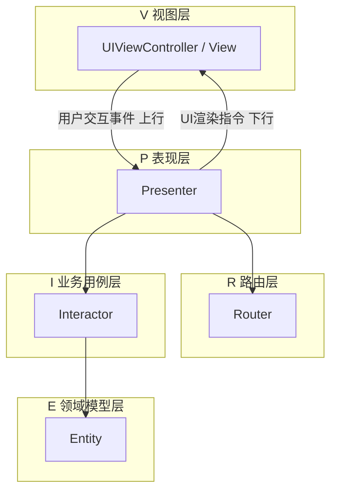
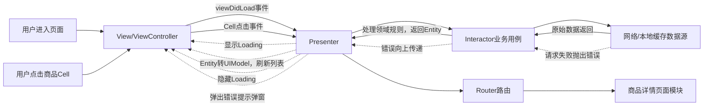

# VIPER简介

## 目录
1. VIPER 五层定义与职责
2. VIPER 分层**拥有关系图**（Mermaid）
3. 【修复版】VIPER 单向依赖架构图（解决渲染/逻辑错误）
4. VIPER 完整数据流转图（Mermaid）
5. 标准完整文字业务流转（正常/异常/跳转）
6. Presenter & Interactor 核心区分（解决重复疑问）
7. MVC / MVP / MVVM / VIPER 四架构横向对比
8. 架构选型决策表 + 适用/不适用场景
9. VIPER 优缺点
10. VIPER 强制设计铁律

---

# 1. VIPER 五层定义与职责
| 分层 | 全称                               | 核心职责                                                                                                                                                                                                                                | 约束限制                                               |
| ---- | ---------------------------------- | --------------------------------------------------------------------------------------------------------------------------------------------------------------------------------------------------------------------------------------- | ------------------------------------------------------ |
| V    | View 视图(UIViewController/UIView) | 1.渲染页面UI，接收用户点击、页面生命周期<br>2.仅向上转发用户事件，无任何业务、数据逻辑<br>3.被动接收Presenter下发UI指令渲染页面                                                                                                         | 不认识Interactor、Router、Entity；仅与Presenter通信    |
| P    | Presenter 表现器（页面调度中心）   | 1.接收View上传的所有用户操作事件<br>2.统一管理页面UI状态：Loading/空页面/错误弹窗<br>3.调用Interactor获取原始业务Entity数据<br>4.核心独有逻辑：通用Entity → 当前页面专属UIModel转换<br>5.捕获数据请求异常、埋点、调用Router完成页面跳转 | 不处理网络、缓存、数据库；不持有UI控件，无页面渲染代码 |
| I    | Interactor 用例交互器（业务层）    | 1.调度网络、本地缓存、数据库等数据源拉取原始数据<br>2.执行**无UI关联的领域业务规则**：数据过滤、数值计算、权限校验<br>3.封装处理后的数据为Entity返回给Presenter                                                                         | 完全无UI概念，不感知View、Presenter；可跨多个页面复用  |
| E    | Entity 领域实体                    | 纯数据结构体，存储原始业务字段，仅做数据载体                                                                                                                                                                                            | 无业务逻辑、无UI逻辑、无网络逻辑                       |
| R    | Router 路由                        | 1.页面跳转、模块间通信<br>2.全局VIPER模块初始化、依赖注入组装                                                                                                                                                                           | 不处理数据、不执行业务、不操作UI                       |

## Presenter vs Interactor 核心区分（解决“重复”疑问）
1. Interactor：面向**通用业务领域**，规则全局通用，可多页面复用，完全脱离UI；
2. Presenter：面向**当前页面UI展示**，页面专属流程与视图适配，无法复用；
3. 表层仅方法转发是视觉错觉，底层职责完全隔离，不可合并。

---

# 2. VIPER 分层拥有关系图（Mermaid）
## 拥有关系规则
- `-- owns -->`：强持有，实例注入，长期引用
- `-. weak owns .->`：弱引用，防止循环内存泄漏
- Entity 仅临时参数传递，无长期持有
```mermaid
flowchart TD
    R[Router] -- owns --> V[View/VC]
    R -- owns --> P[Presenter]
    R -- owns --> I[Interactor]

    P -- owns --> I
    P -- owns --> R

    V -. weak owns .-> P
    P -. weak owns .-> V

    I -.临时返回参数-> E[Entity]
```
### 文字说明拥有关系
1. Router 是模块组装工厂，强持有 View、Presenter、Interactor；
2. Presenter 强持有 Interactor、Router，弱持有 View；
3. View 弱持有 Presenter，避免循环引用；
4. Interactor 不持有上层组件，仅临时产出 Entity；
5. Entity 纯临时数据模型，不作为任何类的成员变量。

---

# 3. 【修复版】VIPER 分层单向依赖架构图（Mermaid）
## 原图错误点修复说明
1. 移除易混淆双向箭头，严格单向调用；
2. 分层分组清晰，消除层级交叉渲染异常；
3. 区分「事件上行」和「UI指令下行」两种流向；
4. 明确 Entity 仅作为 Interactor 输出模型，无反向依赖。

### 依赖逻辑文字说明
1. View 只能把用户操作传给 Presenter，不能主动拿数据；
2. Presenter 下发指令驱动 View 刷新UI；
3. Presenter 调用 Interactor 获取业务数据，调用 Router 执行页面跳转；
4. Interactor 仅依赖 Entity，用于封装业务原始数据；
5. 底层组件绝不反向依赖上层组件，无跨层直接通信。

---

# 4. VIPER 完整数据流转图（Mermaid，商品列表加载流程）

### 图形符号规范
1. 实线 `-->`：主动发起调用、正向业务流程
2. 虚线 `-.->`：Presenter 下发给 View 的 UI 渲染指令
3. 全链路单向流转，无双向反向依赖

---

# 5. 标准完整文字业务流转
## 5.1 正常加载流程（用户打开商品列表页面）
1. 用户打开页面，View(VC)触发页面生命周期；
2. View 仅转发 `viewDidLoad` 事件上行至 Presenter；
3. Presenter 下发UI指令，通知 View 展示 Loading 加载动画；
4. Presenter 发起调用 Interactor 的业务拉取方法；
5. Interactor 内部访问网络/本地缓存数据源，获取原始接口数据；
6. Interactor 执行领域业务规则（过滤下架商品、数据校验），封装处理后数据为 Entity；
7. Interactor 将 Entity 回传给 Presenter；
8. Presenter 执行页面专属逻辑：通用 Entity 转换为当前页面专用 UIModel（价格格式化、文本拼接等UI展示逻辑）；
9. Presenter 下发UI指令，携带UIModel通知View刷新列表；
10. 页面渲染完成后，Presenter 下发指令让 View 隐藏 Loading。

## 5.2 异常失败流程（网络请求失败）
1. 网络/缓存数据源请求失败，抛出Error异常；
2. 异常逐层向上传递：数据源 → Interactor → Presenter；
3. Presenter 捕获异常，下发弹窗UI指令给 View；
4. View 渲染错误弹窗提示用户。

## 5.3 页面跳转流程（用户点击商品Cell）
1. 用户点击列表商品条目，View 接收点击交互；
2. View 仅转发Cell点击事件上行至 Presenter；
3. Presenter 仅携带跳转参数（商品ID）调用 Router；
4. Router 负责创建目标商品详情完整VIPER模块，执行Push/Present页面跳转。

---

# 6. MVC / MVP / MVVM / VIPER 四大架构完整对比
## 6.1 核心分层与职责对比
| 架构    | 分层                                            | 核心特点                                                                                    | 数据流向                                                            |
| ------- | ----------------------------------------------- | ------------------------------------------------------------------------------------------- | ------------------------------------------------------------------- |
| MVC     | Model / View / Controller                       | Controller 充当中间层，大量业务逻辑堆积在Controller；View可直接访问Model                    | View ↔ Controller ↔ Model；View可直读Model                          |
| 标准MVP | Model / View / Presenter                        | View 与 Model 完全隔离；View 持有 Presenter，Presenter 持有 View；所有业务逻辑放入Presenter | View → Presenter → Model；Presenter回调View刷新UI                   |
| MVVM    | Model / View / ViewModel                        | 双向数据绑定；ViewModel无View引用，通过响应式数据流驱动UI；视图状态完全收敛到ViewModel      | View ←(绑定) ViewModel ← Model                                      |
| VIPER   | View / Interactor / Presenter / Entity / Router | 极致单一职责；业务层与UI层彻底拆分；路由单独抽离；可复用业务用例(Interactor)                | View→Presenter→Interactor→Entity；Presenter驱动View，Router负责跳转 |

## 6.2 优缺点对比
### MVC
✅ 优点：结构最简单，上手零成本，代码量最少
❌ 缺点：Controller 巨臃肿（Massive View Controller），View、Controller、Model高度耦合，单元测试极难，无法复用业务逻辑

### MVP
✅ 优点：View与Model解耦，业务逻辑迁移到Presenter，可对Presenter做单元测试
❌ 缺点：Presenter容易膨胀，无独立业务层，页面跳转逻辑散落各处，业务规则无法跨页面复用

### MVVM
✅ 优点：数据绑定减少大量UI刷新样板代码，响应式编程；ViewModel无强依赖View，可高度复用视图状态逻辑
❌ 缺点：双向绑定容易造成数据流追踪困难；复杂业务无独立用例层，大量领域逻辑堆积ViewModel；调试绑定BUG成本高

### VIPER
✅ 优点：职责极致拆分，业务层与UI完全隔离；Interactor全局复用；分层清晰易单元测试；路由统一管理页面跳转；完美解决巨型Presenter问题
❌ 缺点：模板代码爆炸，分层文件极多；上手学习成本高；简单页面过度设计，开发效率低

---

# 7. 四大架构适用场景 + 选型决策标准
## 7.1 各架构适用场景
### MVC 适用场景
1. 小型静态页面、弹窗、简单详情页；
2. 工具类简单页面，单接口、无复杂筛选/联动；
3. 快速原型、Demo、简单工具类App；
❌ 不适用：复杂表单、多接口联动、长列表、企业级复杂业务页面

### MVP 适用场景
1. 中小型业务页面，2~5个接口、简单交互；
2. 需要单元测试、但业务复杂度中等的App；
3. 老旧MVC项目重构过渡方案；
❌ 不适用：大型复杂流程页面、多页面复用同一套业务规则的场景

### MVVM 适用场景
1. 富交互页面：复杂表单、筛选面板、实时联动UI；
2. 跨平台（Flutter/Android Compose/SwiftUI）响应式UI项目；
3. 页面状态复杂（加载、空、错误、编辑态），希望通过绑定简化UI刷新；
❌ 不适用：多页面共享复杂领域业务规则、强需求分层单元测试、大型企业级业务系统

### VIPER 适用场景
1. 大型企业级App、电商、金融、支付、复杂业务流程页面；
2. 多页面复用同一套业务逻辑（商品查询、订单校验、权限判断等）；
3. 高可测性要求、完善单元测试覆盖、长期迭代维护的项目；
4. 团队分工明确（UI层开发、业务逻辑开发、路由模块开发分开维护）；
❌ 不适用：简单静态页面、小型Demo、快速迭代轻量化工具App

## 7.2 架构选型决策树（直接套用）
1. 页面极简、仅展示静态内容 / 单接口简单展示 → **MVC**
2. 页面中等复杂度，需要单元测试，无大量共享业务规则，无SwiftUI/Compose响应式UI → **MVP**
3. 页面交互复杂、多状态联动，使用SwiftUI/Compose/Flutter响应式框架，无大量跨页面复用业务逻辑 → **MVVM**
4. 大型复杂业务页面、多页面共享领域业务规则、长期迭代、高单元测试覆盖率、多人协作大型项目 → **VIPER**

---

# 8. VIPER 架构优缺点
## 优点
1. 职责极致单一，分层边界清晰，彻底解决MVP中Presenter臃肿问题；
2. Interactor、Entity 高度可复用，支持多页面共用同一套业务规则；
3. 单元测试友好，分层完全解耦，可Mock依赖，单独测试Presenter、Interactor；
4. 易维护扩展：UI改动仅修改View/Presenter；业务规则改动仅修改Interactor；
5. 路由统一收拢，所有页面跳转逻辑集中在Router，便于统一管理、埋点跳转监控。

## 缺点
1. 模板代码量大，协议、模型、分层类文件多，小型页面开发效率低；
2. 上手门槛高，分层多、依赖注入逻辑复杂，新手易写出无意义透传方法；
3. 存在过度分层风险，简单静态页面强行使用VIPER属于过度设计，增加维护成本。

---

# 9. VIPER 强制设计铁律
1. **单向依赖原则**：上层不可反向依赖下层，禁止跨层直接通信（View不能直接调用Interactor/Router）；
2. **接口隔离原则**：分层之间全部通过Protocol协议通信，实现依赖倒置，方便单元测试Mock；
3. **UI与业务彻底隔离**：所有页面展示、UI状态逻辑收拢至Presenter；Interactor禁止出现任何UI相关代码；
4. **依赖注入原则**：所有模块依赖由Router统一组装注入，禁止分层内部直接初始化依赖类；
5. **循环引用规避**：View与Presenter互相弱引用，避免内存泄漏。