# GoF 23 种设计模式完全解析

> 设计模式是软件工程的“内功心法”。本文将用 Swift 语言彻底重构 GoF 全部 23 种模式

---

## 一、创建型模式 (Creational Patterns) —— 对象的诞生

### 1. 单例模式 (Singleton)
- **意图**：确保类有且仅有一个实例，并提供一个全局访问点。
- **适用场景**：`UIApplication` 共享实例、网络管理器、日志管理器。
- **Mermaid 类图**：
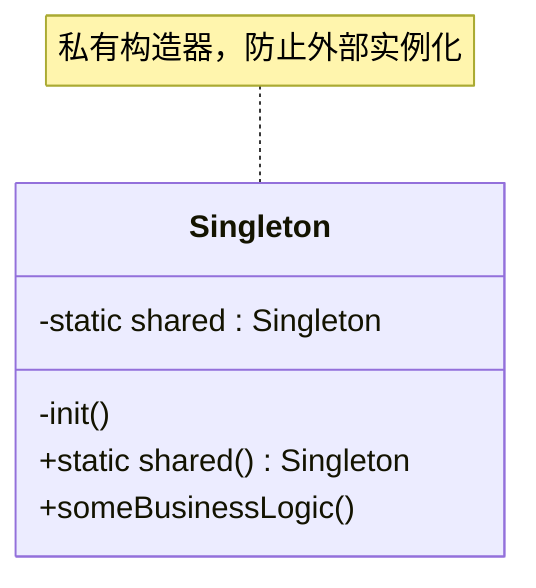
```mermaid
classDiagram
    class Singleton {
        -static shared : Singleton
        -init()
        +static shared() Singleton
        +someBusinessLogic()
    }
    note for Singleton "私有构造器，防止外部实例化"
```
- **Swift 源码**（线程安全，懒加载）：
```swift
class Singleton {
    // 静态常量，Swift 自动保证线程安全且懒加载
    static let shared = Singleton()
    
    // 私有化构造器，禁止外部创建新实例
    private init() {
        print("Singleton 已初始化")
    }
    
    func doSomething() {
        print("执行单例业务逻辑")
    }
}

// 使用
Singleton.shared.doSomething()
```
- **易混淆区分**：与**类静态属性（静态类）**的区别。单例可以遵从协议、可以被依赖注入替换（便于单元测试），而纯静态类只能当作命名空间使用。

---

### 2. 工厂方法模式 (Factory Method)
- **意图**：定义创建对象的接口，但由子类决定实例化哪个具体类（**延迟实例化**）。
- **适用场景**：不同的日志记录器（文件日志/数据库日志）、不同地图SDK的初始化。
- **Mermaid 类图**：
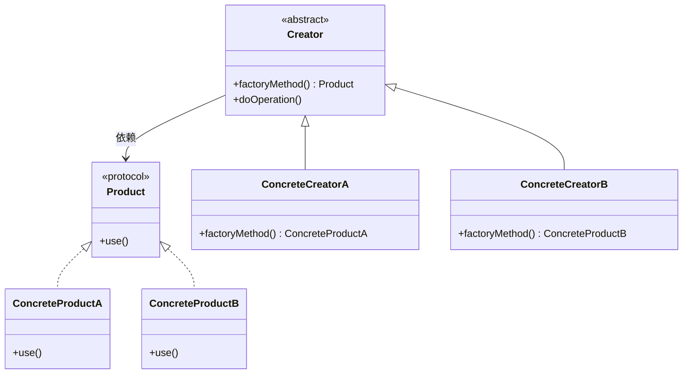
```mermaid
classDiagram
    class Product {
        <<protocol>>
        +use()
    }
    class ConcreteProductA {
        +use()
    }
    class ConcreteProductB {
        +use()
    }
    class Creator {
        <<abstract>>
        +factoryMethod() Product
        +doOperation()
    }
    class ConcreteCreatorA {
        +factoryMethod() ConcreteProductA
    }
    class ConcreteCreatorB {
        +factoryMethod() ConcreteProductB
    }
    Creator <|-- ConcreteCreatorA
    Creator <|-- ConcreteCreatorB
    Product <|.. ConcreteProductA
    Product <|.. ConcreteProductB
    Creator --> Product : 依赖
```
- **Swift 源码**：
```swift
// 产品协议
protocol Product {
    func use()
}

class FileLogger: Product {
    func use() { print("写入文件日志") }
}
class DatabaseLogger: Product {
    func use() { print("写入数据库日志") }
}

// 抽象创建者
class Creator {
    // 工厂方法：交由子类重写
    func factoryMethod() -> Product {
        fatalError("子类必须重写 factoryMethod")
    }
    // 通用的业务逻辑
    func doOperation() {
        let product = factoryMethod()
        product.use()
    }
}

class FileLoggerCreator: Creator {
    override func factoryMethod() -> Product {
        return FileLogger()
    }
}

class DatabaseLoggerCreator: Creator {
    override func factoryMethod() -> Product {
        return DatabaseLogger()
    }
}

// 使用
let creator = FileLoggerCreator()
creator.doOperation() // 输出：写入文件日志
```
- **易混淆区分**：与**简单工厂**的区别。简单工厂用 `if-else` 或 `switch` 创建，新增类型需修改工厂类（违反开闭原则）；工厂方法用子类继承，新增类型只需新增子类（符合开闭原则）。

---

### 3. 抽象工厂模式 (Abstract Factory)
- **意图**：创建一系列**相关或相互依赖**的对象族（产品族），无需指定具体类。
- **适用场景**：跨平台 UI 组件（iOS / Android 风格按钮、对话框）、不同数据库的连接器和命令集。
- **Mermaid 类图**：
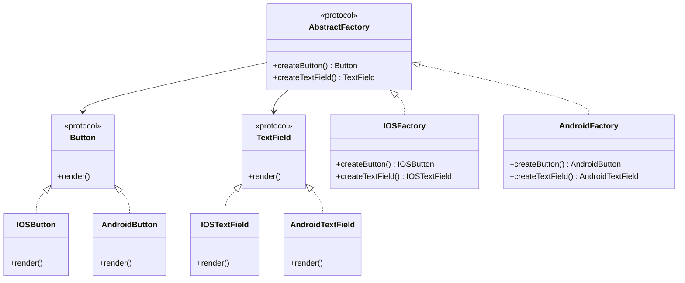
```mermaid
classDiagram
    class Button {
        <<protocol>>
        +render()
    }
    class TextField {
        <<protocol>>
        +render()
    }
    class IOSButton {
        +render()
    }
    class AndroidButton {
        +render()
    }
    class IOSTextField {
        +render()
    }
    class AndroidTextField {
        +render()
    }
    class AbstractFactory {
        <<protocol>>
        +createButton() Button
        +createTextField() TextField
    }
    class IOSFactory {
        +createButton() IOSButton
        +createTextField() IOSTextField
    }
    class AndroidFactory {
        +createButton() AndroidButton
        +createTextField() AndroidTextField
    }
    AbstractFactory <|.. IOSFactory
    AbstractFactory <|.. AndroidFactory
    Button <|.. IOSButton
    Button <|.. AndroidButton
    TextField <|.. IOSTextField
    TextField <|.. AndroidTextField
    AbstractFactory --> Button
    AbstractFactory --> TextField
```
- **Swift 源码**：
```swift
protocol Button { func render() }
protocol TextField { func render() }

struct IOSButton: Button { func render() { print("渲染 iOS 风格按钮") } }
struct AndroidButton: Button { func render() { print("渲染 Android 风格按钮") } }
struct IOSTextField: TextField { func render() { print("渲染 iOS 风格输入框") } }
struct AndroidTextField: TextField { func render() { print("渲染 Android 风格输入框") } }

protocol GUIFactory {
    func createButton() -> Button
    func createTextField() -> TextField
}

struct IOSFactory: GUIFactory {
    func createButton() -> Button { IOSButton() }
    func createTextField() -> TextField { IOSTextField() }
}

struct AndroidFactory: GUIFactory {
    func createButton() -> Button { AndroidButton() }
    func createTextField() -> TextField { AndroidTextField() }
}

// 使用
let factory: GUIFactory = IOSFactory()
let btn = factory.createButton()
btn.render() // 渲染 iOS 风格按钮
```
- **易混淆区分**：与**工厂方法**的核心区别。工厂方法只生产**单一产品**（一个等级结构）；抽象工厂生产**多个产品族**（如 Button + TextField）。工厂方法使用继承，抽象工厂使用组合（持有工厂实例）。

---

### 4. 建造者模式 (Builder)
- **意图**：将一个**复杂对象**的构建与其表示分离，同样的构建过程可以创建不同的表示（链式调用）。
- **适用场景**：构造含有大量可选参数的不可变对象（如网络请求配置）、组装电脑、制作披萨。
- **Mermaid 类图**：
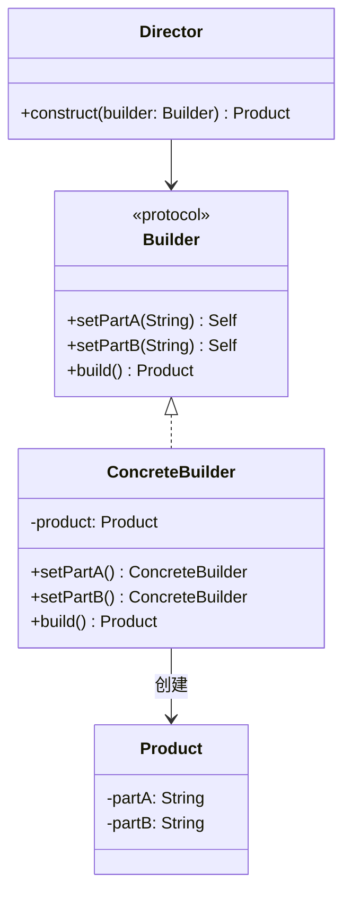
```mermaid
classDiagram
    class Product {
        -partA: String
        -partB: String
    }
    class Builder {
        <<protocol>>
        +setPartA(String) Self
        +setPartB(String) Self
        +build() Product
    }
    class ConcreteBuilder {
        -product: Product
        +setPartA() ConcreteBuilder
        +setPartB() ConcreteBuilder
        +build() Product
    }
    class Director {
        +construct(builder: Builder) Product
    }
    Director --> Builder
    Builder <|.. ConcreteBuilder
    ConcreteBuilder --> Product : 创建
```
- **Swift 源码**（链式调用+不可变产品）：
```swift
// 最终产品（不可变）
struct Computer {
    let cpu: String
    let ram: String
    let storage: String
}

// 建造者
class ComputerBuilder {
    private var cpu: String = "默认 CPU"
    private var ram: String = "8GB"
    private var storage: String = "256GB"
    
    func setCPU(_ cpu: String) -> Self {
        self.cpu = cpu
        return self
    }
    func setRAM(_ ram: String) -> Self {
        self.ram = ram
        return self
    }
    func setStorage(_ storage: String) -> Self {
        self.storage = storage
        return self
    }
    func build() -> Computer {
        return Computer(cpu: cpu, ram: ram, storage: storage)
    }
}

// 使用（无需 Director，直接由 Client 调用）
let computer = ComputerBuilder()
    .setCPU("M2 Max")
    .setRAM("32GB")
    .setStorage("1TB")
    .build()
print(computer) // Computer(cpu: "M2 Max", ram: "32GB", storage: "1TB")
```
- **易混淆区分**：与**抽象工厂**的区别。抽象工厂**一步到位**返回完整产品，不关心构建步骤；建造者**分步构建**，允许对中间过程进行精细控制（如参数校验）。建造者通常用于创建**同一个**复杂对象的不同变体。

---

### 5. 原型模式 (Prototype)
- **意图**：通过**拷贝**（克隆）一个现有实例来创建新对象，而不是通过 `init` 构造。
- **适用场景**：对象初始化成本极高（需要大量数据库查询）、状态快照（拷贝一份以隔离修改）、避免子类爆炸。
- **Mermaid 类图**：
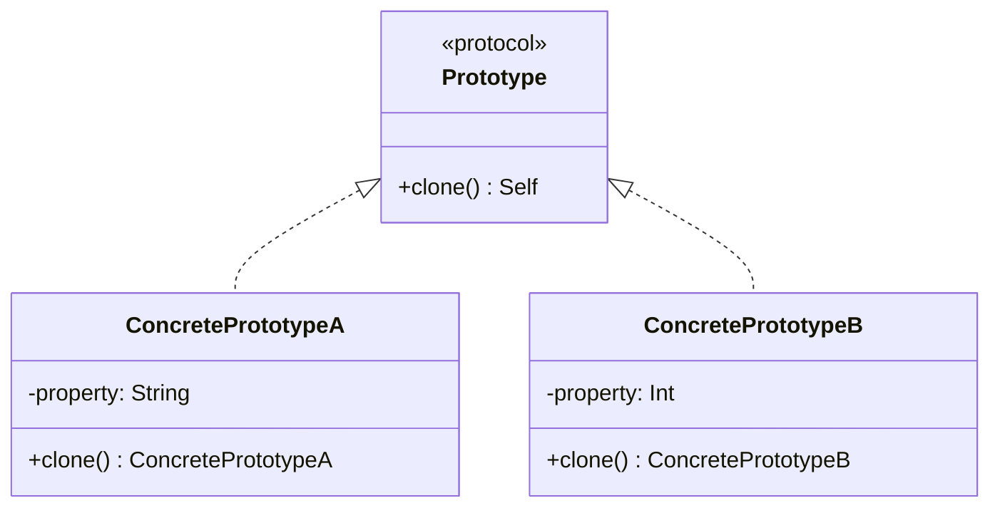
```mermaid
classDiagram
    class Prototype {
        <<protocol>>
        +clone() Self
    }
    class ConcretePrototypeA {
        -property: String
        +clone() ConcretePrototypeA
    }
    class ConcretePrototypeB {
        -property: Int
        +clone() ConcretePrototypeB
    }
    Prototype <|.. ConcretePrototypeA
    Prototype <|.. ConcretePrototypeB
```
- **Swift 源码**（遵循 `NSCopying` 或自定义协议，这里用 `Copyable`）：
```swift
protocol Copyable {
    associatedtype T
    func clone() -> T
}

// 引用类型类，实现深拷贝
class UserProfile: Copyable {
    var name: String
    var age: Int
    
    init(name: String, age: Int) {
        self.name = name
        self.age = age
    }
    
    func clone() -> UserProfile {
        return UserProfile(name: self.name, age: self.age) // 深拷贝
    }
}

// 使用
let original = UserProfile(name: "Alice", age: 30)
let copy = original.clone()
copy.name = "Bob"
print(original.name) // 输出 "Alice"（互不影响）
```
- **易混淆区分**：与**工厂方法**的区别。原型模式基于**内存二进制拷贝**，不会执行构造函数（Swift 中 `init` 不会触发）；工厂方法每次都执行 `init`，属于全新构造。原型模式特别适合 Swift 中的 `struct`（值类型天然拷贝），但这里演示的是 `class` 的深拷贝场景。

---

## 二、结构型模式 (Structural Patterns) —— 类的骨骼与布局

### 6. 适配器模式 (Adapter)
- **意图**：**接口转换**，使原本不兼容的类能协同工作（如同电源转接头）。
- **适用场景**：封装旧 SDK、兼容第三方库、让 `Data` 和 `String` 统一输出。
- **Mermaid 类图**：
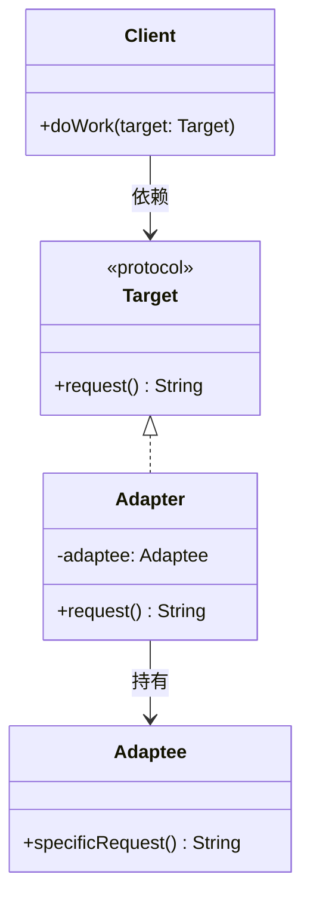
```mermaid
classDiagram
    class Target {
        <<protocol>>
        +request() String
    }
    class Adaptee {
        +specificRequest() String
    }
    class Adapter {
        -adaptee: Adaptee
        +request() String
    }
    class Client {
        +doWork(target: Target)
    }
    Target <|.. Adapter
    Adapter --> Adaptee : 持有
    Client --> Target : 依赖
```
- **Swift 源码**（对象适配器）：
```swift
// 目标接口（客户端期望的）
protocol Target {
    func request() -> String
}

// 被适配者（第三方旧类，不兼容）
class Adaptee {
    func specificRequest() -> String {
        return "特定格式的数据: 12345"
    }
}

// 适配器（实现目标接口，内部包装 Adaptee）
class Adapter: Target {
    private let adaptee: Adaptee
    
    init(_ adaptee: Adaptee) {
        self.adaptee = adaptee
    }
    
    func request() -> String {
        let raw = adaptee.specificRequest()
        // 进行转换，例如提取数字
        return "适配后结果: \(raw.filter { $0.isNumber })"
    }
}

// 客户端
class Client {
    static func execute(target: Target) {
        print(target.request())
    }
}

// 使用
let adaptee = Adaptee()
let adapter = Adapter(adaptee)
Client.execute(target: adapter) // 输出：适配后结果: 12345
```
- **易混淆区分**：与**外观模式**的区别。适配器是为**接口转换**（让双方匹配），不改变功能；外观是为**简化接口**（提供一个更易用的高层入口）。适配器解决“不兼容”问题，外观解决“复杂难用”问题。

---

### 7. 桥接模式 (Bridge)
- **意图**：将**抽象部分**与**实现部分**分离，使它们能独立变化（**组合优于继承**）。
- **适用场景**：跨平台渲染（形状+颜色）、不同消息发送方式（普通/加密 + 邮件/短信）。
- **Mermaid 类图**：
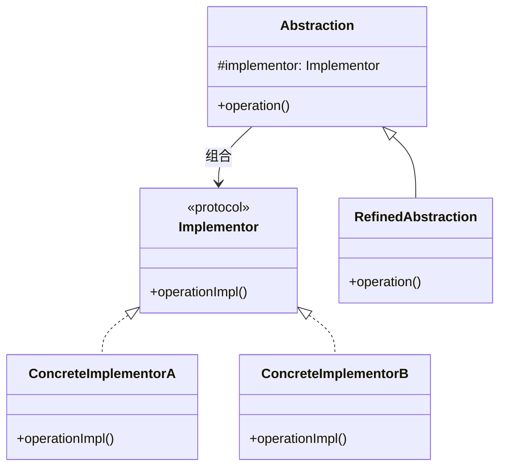
```mermaid
classDiagram
    class Implementor {
        <<protocol>>
        +operationImpl()
    }
    class ConcreteImplementorA {
        +operationImpl()
    }
    class ConcreteImplementorB {
        +operationImpl()
    }
    class Abstraction {
        #implementor: Implementor
        +operation()
    }
    class RefinedAbstraction {
        +operation()
    }
    Abstraction --> Implementor : 组合
    Implementor <|.. ConcreteImplementorA
    Implementor <|.. ConcreteImplementorB
    Abstraction <|-- RefinedAbstraction
```
- **Swift 源码**：
```swift
// 实现部分（颜色）
protocol Color {
    func fill() -> String
}

class Red: Color {
    func fill() -> String { return "红色" }
}
class Blue: Color {
    func fill() -> String { return "蓝色" }
}

// 抽象部分（形状）
class Shape {
    protected let color: Color
    
    init(color: Color) {
        self.color = color
    }
    
    func draw() -> String {
        return "绘制\(color.fill())形状"
    }
}

// 扩展抽象部分（圆形、方形）
class Circle: Shape {
    override func draw() -> String {
        return "绘制\(color.fill())圆形"
    }
}

class Square: Shape {
    override func draw() -> String {
        return "绘制\(color.fill())方形"
    }
}

// 使用
let circleRed = Circle(color: Red())
print(circleRed.draw()) // 绘制红色圆形
```
- **易混淆区分**：与**适配器**的区别。适配器是**事后补救**（解决已存在的问题）；桥接是**事先设计**（在架构初期就分离抽象与实现，以便各自扩展）。适配器改变接口，桥接保持接口但解耦。

---

### 8. 组合模式 (Composite)
- **意图**：将对象组合成**树形结构**以表示“部分-整体”层次结构，使客户端对单个对象和组合对象的使用具有一致性。
- **适用场景**：文件系统目录树、UI 视图层级（View 嵌套 View）、菜单结构。
- **Mermaid 类图**：
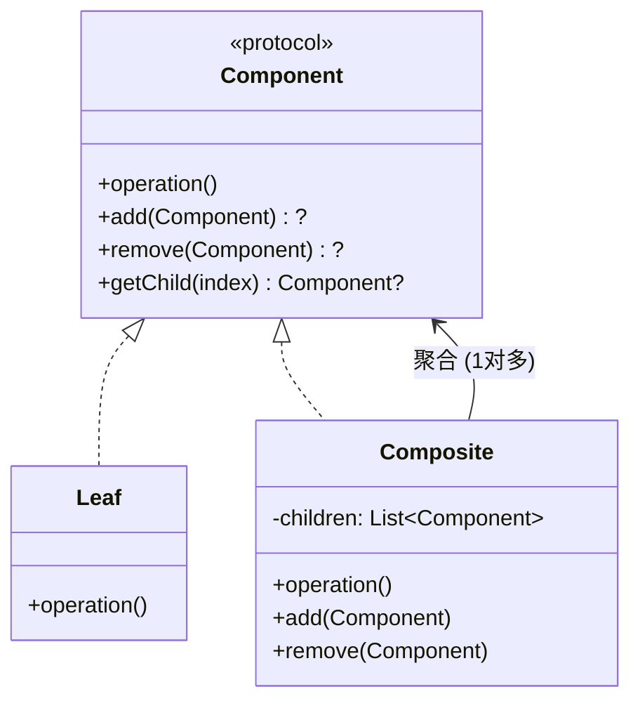
```mermaid
classDiagram
    class Component {
        <<protocol>>
        +operation()
        +add(Component)? 
        +remove(Component)?
        +getChild(index) Component?
    }
    class Leaf {
        +operation()
    }
    class Composite {
        -children: List~Component~
        +operation()
        +add(Component)
        +remove(Component)
    }
    Component <|.. Leaf
    Component <|.. Composite
    Composite --> Component : 聚合 (1对多)
```
- **Swift 源码**：
```swift
protocol FileSystemItem {
    var name: String { get }
    func display(indent: String)
}

// 叶子节点（文件）
class File: FileSystemItem {
    var name: String
    init(name: String) { self.name = name }
    func display(indent: String) {
        print("\(indent)📄 \(name)")
    }
}

// 组合节点（文件夹）
class Folder: FileSystemItem {
    var name: String
    private var children: [FileSystemItem] = []
    
    init(name: String) { self.name = name }
    
    func add(_ item: FileSystemItem) {
        children.append(item)
    }
    
    func display(indent: String) {
        print("\(indent)📁 \(name)")
        let nextIndent = indent + "  "
        children.forEach { $0.display(indent: nextIndent) }
    }
}

// 使用
let root = Folder(name: "root")
let subFolder = Folder(name: "Documents")
subFolder.add(File(name: "resume.pdf"))
root.add(subFolder)
root.add(File(name: "notes.txt"))
root.display(indent: "")
// 输出树形结构
```
- **易混淆区分**：与**装饰器**的区别。组合强调**层级包容**（父子关系），对象生命周期一致；装饰器强调**横向扩展**（平级包装），不改变对象身份，仅增强功能。

---

### 9. 装饰器模式 (Decorator)
- **意图**：**动态**地为对象添加额外职责，比继承更灵活（开闭原则）。
- **适用场景**：Swift 中 `URLSession` 的 `dataTask` 添加日志、缓存功能；奶茶加料（珍珠、椰果）。
- **Mermaid 类图**：
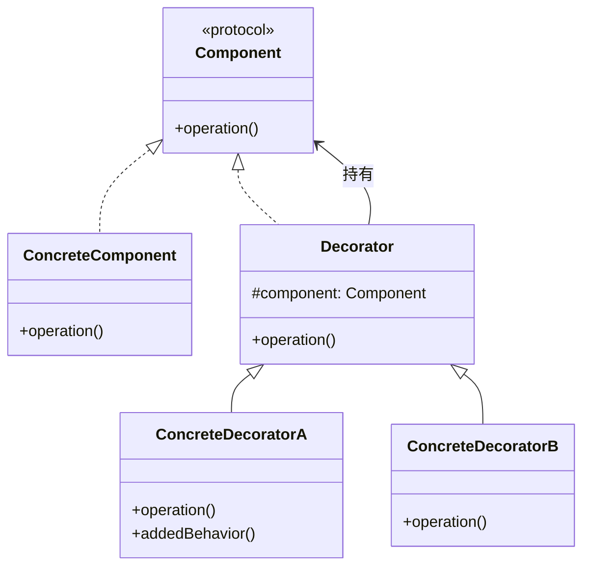
```mermaid
classDiagram
    class Component {
        <<protocol>>
        +operation()
    }
    class ConcreteComponent {
        +operation()
    }
    class Decorator {
        #component: Component
        +operation()
    }
    class ConcreteDecoratorA {
        +operation()
        +addedBehavior()
    }
    class ConcreteDecoratorB {
        +operation()
    }
    Component <|.. ConcreteComponent
    Component <|.. Decorator
    Decorator --> Component : 持有
    Decorator <|-- ConcreteDecoratorA
    Decorator <|-- ConcreteDecoratorB
```
- **Swift 源码**：
```swift
// 抽象组件
protocol Coffee {
    func cost() -> Double
    func description() -> String
}

// 具体组件
class SimpleCoffee: Coffee {
    func cost() -> Double { return 5.0 }
    func description() -> String { return "美式咖啡" }
}

// 装饰器基类（也遵循 Coffee 协议）
class CoffeeDecorator: Coffee {
    protected let decoratedCoffee: Coffee
    init(coffee: Coffee) {
        self.decoratedCoffee = coffee
    }
    func cost() -> Double { return decoratedCoffee.cost() }
    func description() -> String { return decoratedCoffee.description() }
}

// 具体装饰器 A - 加牛奶
class MilkDecorator: CoffeeDecorator {
    override func cost() -> Double {
        return super.cost() + 2.0
    }
    override func description() -> String {
        return super.description() + " + 牛奶"
    }
}

// 具体装饰器 B - 加糖
class SugarDecorator: CoffeeDecorator {
    override func cost() -> Double {
        return super.cost() + 0.5
    }
    override func description() -> String {
        return super.description() + " + 糖"
    }
}

// 使用（动态嵌套）
var coffee: Coffee = SimpleCoffee()
coffee = MilkDecorator(coffee: coffee)
coffee = SugarDecorator(coffee: coffee)
print(coffee.description()) // 美式咖啡 + 牛奶 + 糖
print(coffee.cost())        // 7.5
```
- **易混淆区分**：与**代理模式**的区别。装饰器关注**增强功能**（叠加行为），代理关注**控制访问**（权限校验、延迟加载）。装饰器通常由客户端主动组装，代理对客户端透明。

---

### 10. 外观模式 (Facade)
- **意图**：为复杂子系统提供**统一简化接口**，降低客户端使用门槛。
- **适用场景**：iOS 中 `UIApplication.shared` 封装了深层 API；复杂支付 SDK 门面。
- **Mermaid 类图**：
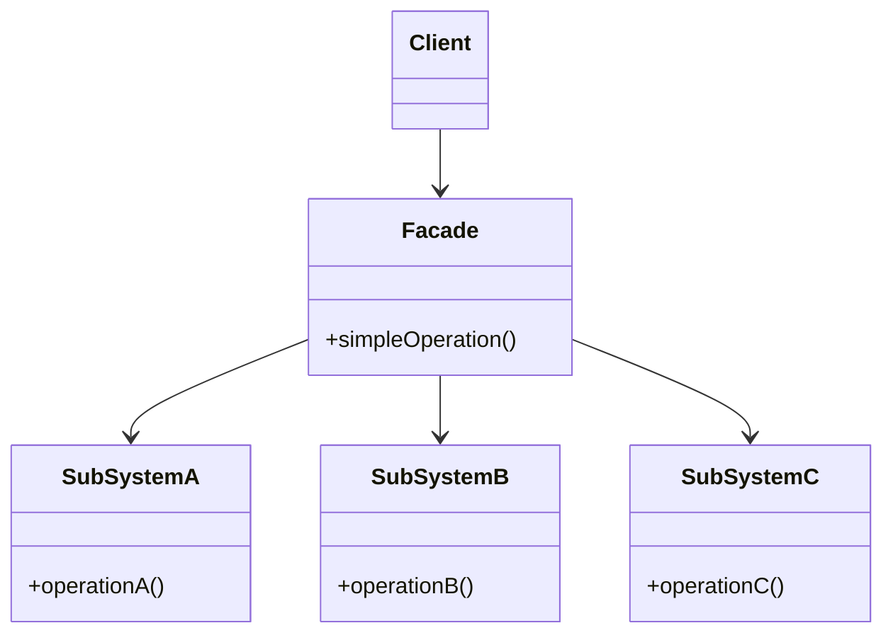
```mermaid
classDiagram
    class Facade {
        +simpleOperation()
    }
    class SubSystemA {
        +operationA()
    }
    class SubSystemB {
        +operationB()
    }
    class SubSystemC {
        +operationC()
    }
    Facade --> SubSystemA
    Facade --> SubSystemB
    Facade --> SubSystemC
    Client --> Facade
```
- **Swift 源码**：
```swift
// 复杂的子系统
class AudioPlayer {
    func loadFile() { print("加载音频文件") }
    func play() { print("播放音频") }
    func pause() { print("暂停音频") }
}
class Equalizer {
    func setBass(_ level: Float) { print("设置低音: \(level)") }
    func setTreble(_ level: Float) { print("设置高音: \(level)") }
}
class Visualizer {
    func enable() { print("开启可视化动效") }
}

// 外观类
class MusicPlayerFacade {
    private let player = AudioPlayer()
    private let equalizer = Equalizer()
    private let visualizer = Visualizer()
    
    func playMusic(file: String) {
        player.loadFile()
        equalizer.setBass(0.8)
        equalizer.setTreble(0.5)
        visualizer.enable()
        player.play()
    }
    
    func pauseMusic() {
        player.pause()
    }
}

// 客户端使用（完全不需要知道内部细节）
let facade = MusicPlayerFacade()
facade.playMusic(file: "song.mp3")
```
- **易混淆区分**：与**中介者模式**的区别。外观是**单向**门面（客户端 -> 子系统，子系统之间不通过门面通信）；中介者是**多向**交互（同事对象之间通过中介者相互通信，封装交互逻辑）。

---

### 11. 享元模式 (Flyweight)
- **意图**：运用**共享**技术有效支持大量细粒度对象复用，减少内存消耗（内部状态共享，外部状态传入）。
- **适用场景**：字符串常量池、表格 Cell 复用池、游戏渲染中的子弹/树木纹理。
- **Mermaid 类图**：
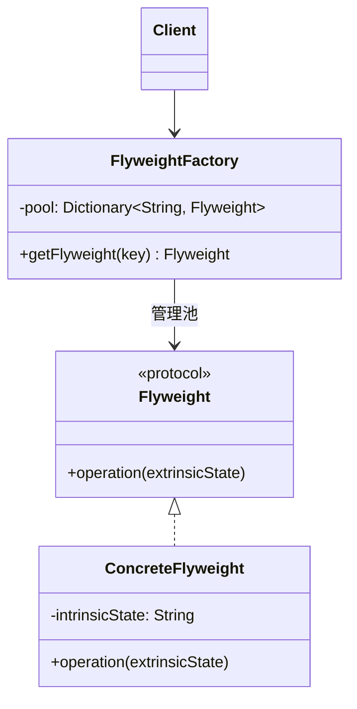
```mermaid
classDiagram
    class Flyweight {
        <<protocol>>
        +operation(extrinsicState)
    }
    class ConcreteFlyweight {
        -intrinsicState: String
        +operation(extrinsicState)
    }
    class FlyweightFactory {
        -pool: Dictionary~String, Flyweight~
        +getFlyweight(key) Flyweight
    }
    FlyweightFactory --> Flyweight : 管理池
    Client --> FlyweightFactory
    Flyweight <|.. ConcreteFlyweight
```
- **Swift 源码**：
```swift
// 享元接口
protocol CharacterFlyweight {
    func display(font: String, size: Int) // 外部状态：字体、字号
}

// 具体享元：共享内部状态（字符本身）
class ConcreteCharacter: CharacterFlyweight {
    private let symbol: Character // 内部状态（不可变）
    
    init(_ symbol: Character) {
        self.symbol = symbol
        print("创建字符享元: \(symbol)")
    }
    
    func display(font: String, size: Int) {
        print("字符 '\(symbol)' 使用字体 \(font), 大小 \(size)")
    }
}

// 工厂（管理池）
class CharacterFactory {
    private var pool: [Character: ConcreteCharacter] = [:]
    
    func getCharacter(_ symbol: Character) -> ConcreteCharacter {
        if let cached = pool[symbol] {
            return cached
        }
        let newChar = ConcreteCharacter(symbol)
        pool[symbol] = newChar
        return newChar
    }
}

// 使用
let factory = CharacterFactory()
let charA1 = factory.getCharacter("A")
let charA2 = factory.getCharacter("A") // 复用，不再创建
charA1.display(font: "Helvetica", size: 16)
charA2.display(font: "Arial", size: 20) // 传入不同的外部状态
print(charA1 === charA2) // true
```
- **易混淆区分**：与**单例**的区别。单例限制**类型**全局只有一个实例；享元限制**具有相同内部状态的对象**只有一个实例（工厂中可以有多种状态的对象，如 'A' 和 'B' 各只有一个）。

---

### 12. 代理模式 (Proxy)
- **意图**：为其他对象提供一种代理以**控制**对该对象的访问（延迟加载、权限、远程）。
- **适用场景**：`weak` 引用代理（Delegate）、大图懒加载、网络请求缓存代理。
- **Mermaid 类图**：
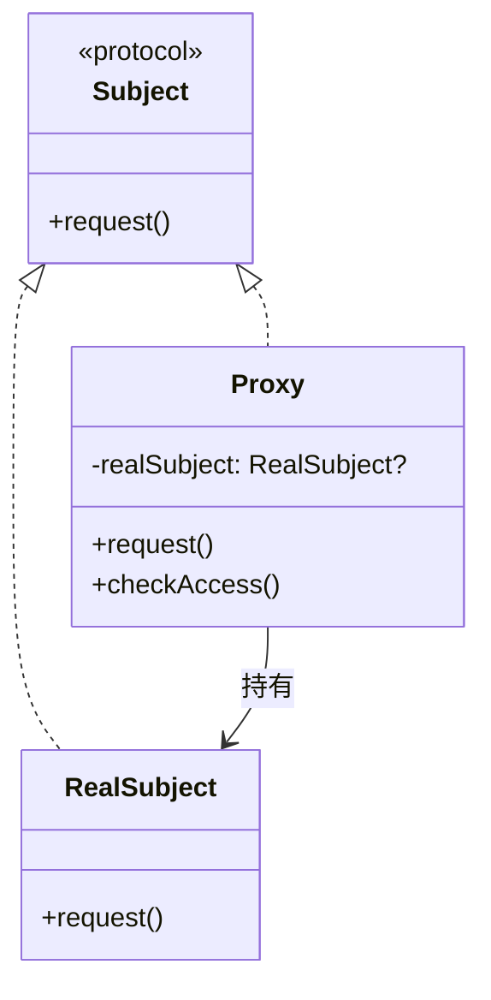
```mermaid
classDiagram
    class Subject {
        <<protocol>>
        +request()
    }
    class RealSubject {
        +request()
    }
    class Proxy {
        -realSubject: RealSubject?
        +request()
        +checkAccess()
    }
    Subject <|.. RealSubject
    Subject <|.. Proxy
    Proxy --> RealSubject : 持有
```
- **Swift 源码**（虚拟代理：延迟加载大图）：
```swift
protocol Image {
    func show()
}

// 真实对象（加载成本高）
class HighResolutionImage: Image {
    private let filename: String
    
    init(filename: String) {
        self.filename = filename
        print("从磁盘加载大图 \(filename)，耗时 5s...")
    }
    
    func show() {
        print("显示图片 \(filename)")
    }
}

// 代理（控制访问，延迟加载）
class ImageProxy: Image {
    private let filename: String
    private var realImage: HighResolutionImage?
    
    init(filename: String) {
        self.filename = filename
    }
    
    func show() {
        if realImage == nil {
            realImage = HighResolutionImage(filename: filename) // 首次访问时才加载
        }
        realImage?.show()
    }
}

// 使用
let proxy = ImageProxy(filename: "photo.jpg")
print("代理已创建，但图片尚未加载")
proxy.show() // 此时才真正加载
proxy.show() // 后续复用缓存
```
- **易混淆区分**：与**装饰器**的区别。代理控制访问（是否加载、是否有权限），不增加核心业务功能；装饰器增强功能（加调料、加日志），不控制访问。代理的 `RealSubject` 由代理创建或管理，装饰器的 `Component` 由客户端传入。

---

## 三、行为型模式 (Behavioral Patterns) —— 对象间的通信与协作

### 13. 责任链模式 (Chain of Responsibility)
- **意图**：为请求创建一条处理者链，沿着链传递请求，直到某个处理者处理它。
- **适用场景**：iOS 响应者链 (`UIResponder`)、层层审批流程、日志等级处理。
- **Mermaid 类图**：
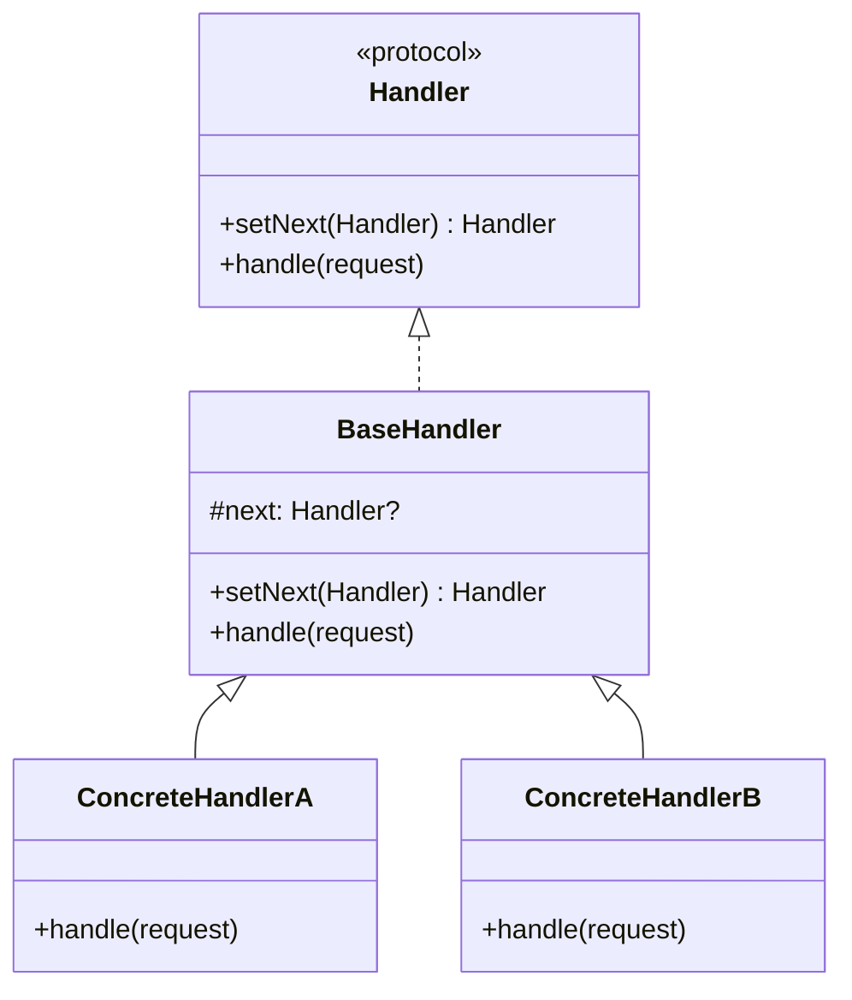
```mermaid
classDiagram
    class Handler {
        <<protocol>>
        +setNext(Handler) Handler
        +handle(request)
    }
    class BaseHandler {
        #next: Handler?
        +setNext(Handler) Handler
        +handle(request)
    }
    class ConcreteHandlerA {
        +handle(request)
    }
    class ConcreteHandlerB {
        +handle(request)
    }
    Handler <|.. BaseHandler
    BaseHandler <|-- ConcreteHandlerA
    BaseHandler <|-- ConcreteHandlerB
```
- **Swift 源码**：
```swift
// 请求对象
struct SupportRequest {
    let id: Int
    let level: Int // 1: 简单, 2: 中等, 3: 复杂
}

// 处理者协议
protocol Handler: AnyObject {
    var next: Handler? { get set }
    func handle(request: SupportRequest)
}

extension Handler {
    func setNext(_ handler: Handler) -> Handler {
        self.next = handler
        return handler
    }
}

// 具体处理者 A - 处理等级 1
class Level1Support: Handler {
    weak var next: Handler?
    func handle(request: SupportRequest) {
        if request.level <= 1 {
            print("Level1 处理了请求 \(request.id)")
        } else {
            print("Level1 无法处理，转交上级")
            next?.handle(request: request)
        }
    }
}

// 具体处理者 B - 处理等级 2
class Level2Support: Handler {
    weak var next: Handler?
    func handle(request: SupportRequest) {
        if request.level == 2 {
            print("Level2 处理了请求 \(request.id)")
        } else {
            print("Level2 无法处理，转交上级")
            next?.handle(request: request)
        }
    }
}

// 使用
let l1 = Level1Support()
let l2 = Level2Support()
l1.setNext(l2)
let request = SupportRequest(id: 100, level: 2)
l1.handle(request: request) 
// Level1 无法处理，转交上级
// Level2 处理了请求 100
```
- **易混淆区分**：与**命令模式**的区别。责任链**不保证**请求一定被处理（可能到达链尾无人处理），发送者不知道谁会处理；命令模式将请求**绑定**到特定接收者，明确执行。

---

### 14. 命令模式 (Command)
- **意图**：将请求封装为对象，从而支持参数化、队列化、日志化和撤销操作。
- **适用场景**：NSUndoManager、UIButton 的 Target-Action、游戏手柄按键映射。
- **Mermaid 类图**：
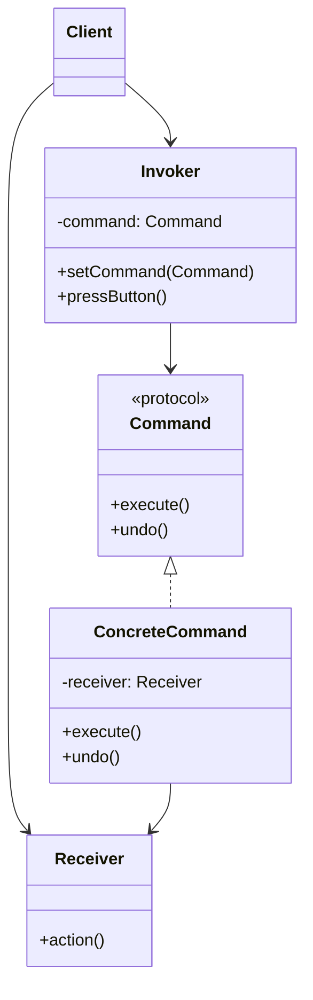
```mermaid
classDiagram
    class Command {
        <<protocol>>
        +execute()
        +undo()
    }
    class ConcreteCommand {
        -receiver: Receiver
        +execute()
        +undo()
    }
    class Receiver {
        +action()
    }
    class Invoker {
        -command: Command
        +setCommand(Command)
        +pressButton()
    }
    Client --> Invoker
    Client --> Receiver
    Command <|.. ConcreteCommand
    ConcreteCommand --> Receiver
    Invoker --> Command
```
- **Swift 源码**：
```swift
// 接收者（实际干活的对象）
class Light {
    func turnOn() { print("灯亮了") }
    func turnOff() { print("灯灭了") }
}

// 命令协议
protocol Command {
    func execute()
    func undo()
}

// 具体命令 - 开灯
class LightOnCommand: Command {
    private let light: Light
    init(light: Light) { self.light = light }
    func execute() { light.turnOn() }
    func undo() { light.turnOff() }
}

// 调用者（按钮）
class Button {
    private var command: Command?
    func setCommand(_ command: Command) { self.command = command }
    func press() { command?.execute() }
}

// 使用
let light = Light()
let onCmd = LightOnCommand(light: light)
let button = Button()
button.setCommand(onCmd)
button.press() // 灯亮了
onCmd.undo()  // 灯灭了
```
- **易混淆区分**：与**策略模式**的区别。命令封装**动作**（包含执行者 Receiver，支持撤销），策略封装**算法**（仅关注输入输出，无状态）。命令用于“做什么”，策略用于“怎么做”。

---

### 15. 解释器模式 (Interpreter)
- **意图**：定义语言的文法，并解释语言中的句子。
- **适用场景**：SQL 解析、正则表达式、数学公式计算器（如 `(a+b)*c`）。
- **Mermaid 类图**：
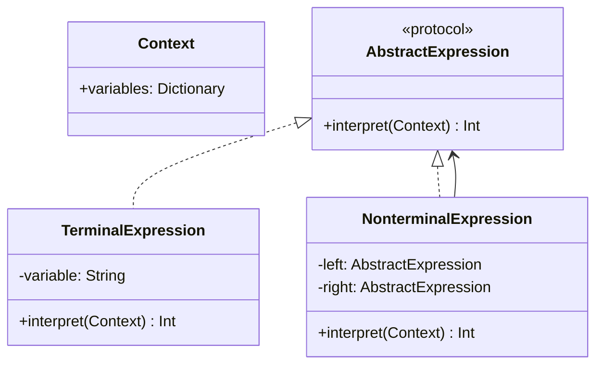
```mermaid
classDiagram
    class Context {
        +variables: Dictionary
    }
    class AbstractExpression {
        <<protocol>>
        +interpret(Context) Int
    }
    class TerminalExpression {
        -variable: String
        +interpret(Context) Int
    }
    class NonterminalExpression {
        -left: AbstractExpression
        -right: AbstractExpression
        +interpret(Context) Int
    }
    AbstractExpression <|.. TerminalExpression
    AbstractExpression <|.. NonterminalExpression
    NonterminalExpression --> AbstractExpression
```
- **Swift 源码**（简易加减法解释器）：
```swift
// 上下文（存储变量值）
class Context {
    private var variables: [String: Int] = [:]
    func setValue(_ value: Int, for key: String) { variables[key] = value }
    func getValue(for key: String) -> Int { return variables[key] ?? 0 }
}

// 抽象表达式
protocol Expression {
    func interpret(context: Context) -> Int
}

// 终结符表达式（变量）
class VariableExpression: Expression {
    private let name: String
    init(name: String) { self.name = name }
    func interpret(context: Context) -> Int {
        return context.getValue(for: name)
    }
}

// 终结符表达式（数字）
class NumberExpression: Expression {
    private let value: Int
    init(value: Int) { self.value = value }
    func interpret(context: Context) -> Int { return value }
}

// 非终结符表达式（加法）
class AddExpression: Expression {
    private let left: Expression
    private let right: Expression
    init(left: Expression, right: Expression) {
        self.left = left
        self.right = right
    }
    func interpret(context: Context) -> Int {
        return left.interpret(context: context) + right.interpret(context: context)
    }
}

// 使用 (解析 a + 3)
let context = Context()
context.setValue(10, for: "a")
let varA = VariableExpression(name: "a")
let num3 = NumberExpression(value: 3)
let add = AddExpression(left: varA, right: num3)
print(add.interpret(context: context)) // 输出 13
```
- **易混淆区分**：与**访问者模式**有结构相似（都涉及遍历）。但解释器处理**文法规则**（语法树），访问者处理**稳定数据结构上的频繁变动操作**。

---

### 16. 迭代器模式 (Iterator)
- **意图**：提供一种方法顺序访问聚合对象中的元素，而不暴露其内部表示。
- **适用场景**：Swift 中的 `Sequence` & `IteratorProtocol`、数据库游标。
- **Mermaid 类图**：
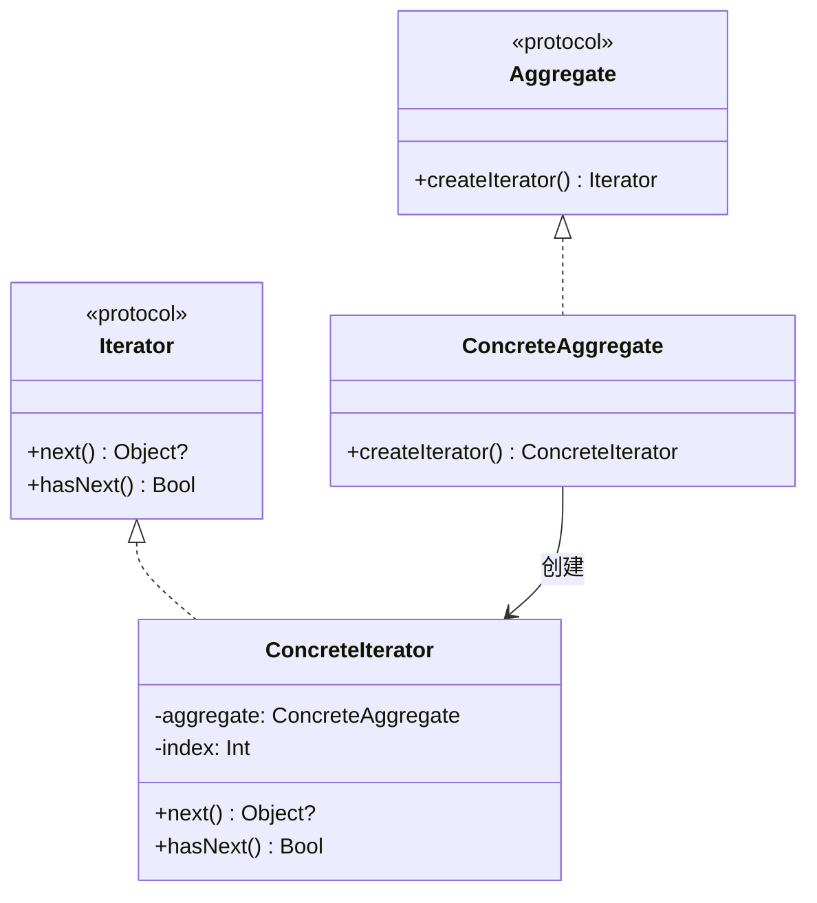
```mermaid
classDiagram
    class Aggregate {
        <<protocol>>
        +createIterator() Iterator
    }
    class ConcreteAggregate {
        +createIterator() ConcreteIterator
    }
    class Iterator {
        <<protocol>>
        +next() Object?
        +hasNext() Bool
    }
    class ConcreteIterator {
        -aggregate: ConcreteAggregate
        -index: Int
        +next() Object?
        +hasNext() Bool
    }
    Aggregate <|.. ConcreteAggregate
    Iterator <|.. ConcreteIterator
    ConcreteAggregate --> ConcreteIterator : 创建
```
- **Swift 源码**（Swift 原生支持，此处手动实现以展示模式）：
```swift
// 自定义迭代器
class MyIterator<T>: IteratorProtocol {
    private var currentIndex = 0
    private let items: [T]
    
    init(items: [T]) {
        self.items = items
    }
    
    func next() -> T? {
        guard currentIndex < items.count else { return nil }
        let item = items[currentIndex]
        currentIndex += 1
        return item
    }
}

// 自定义集合
class MyCollection<T>: Sequence {
    private var items: [T] = []
    func add(_ item: T) { items.append(item) }
    func makeIterator() -> MyIterator<T> {
        return MyIterator(items: items)
    }
}

// 使用
let collection = MyCollection<String>()
collection.add("A")
collection.add("B")
for item in collection {
    print(item) // 输出 A, B
}
```
- **易混淆区分**：与**枚举**的区别。迭代器是设计模式，Swift 的 `IteratorProtocol` 是实现；枚举 (`enumerated()`) 是迭代时附带索引的一种具体用法。

---

### 17. 中介者模式 (Mediator)
- **意图**：封装一组对象的交互，使对象间不再显式相互引用（**多对多** 降为 **一对多**）。
- **适用场景**：MVC 中的 Controller、聊天室、机场塔台调度。
- **Mermaid 类图**：
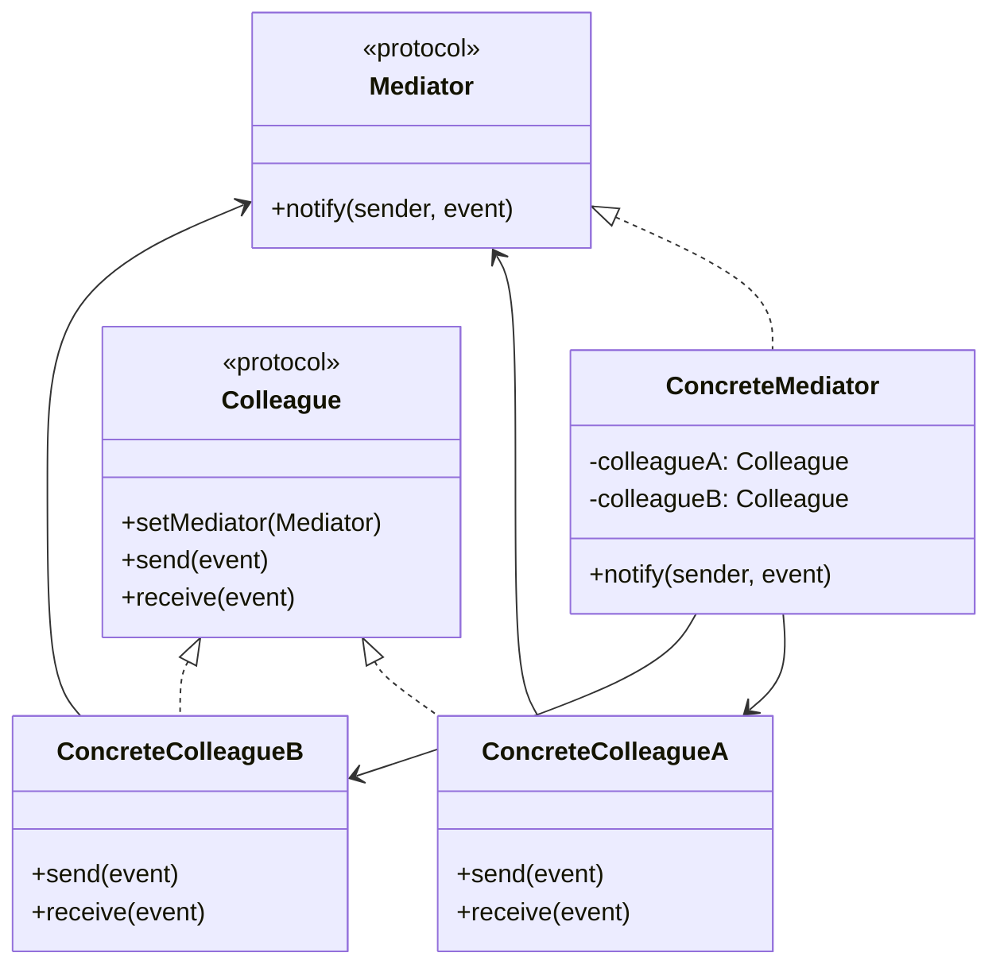
```mermaid
classDiagram
    class Mediator {
        <<protocol>>
        +notify(sender, event)
    }
    class ConcreteMediator {
        -colleagueA: Colleague
        -colleagueB: Colleague
        +notify(sender, event)
    }
    class Colleague {
        <<protocol>>
        +setMediator(Mediator)
        +send(event)
        +receive(event)
    }
    class ConcreteColleagueA {
        +send(event)
        +receive(event)
    }
    class ConcreteColleagueB {
        +send(event)
        +receive(event)
    }
    Mediator <|.. ConcreteMediator
    Colleague <|.. ConcreteColleagueA
    Colleague <|.. ConcreteColleagueB
    ConcreteMediator --> ConcreteColleagueA
    ConcreteMediator --> ConcreteColleagueB
    ConcreteColleagueA --> Mediator
    ConcreteColleagueB --> Mediator
```
- **Swift 源码**（聊天室示例）：
```swift
protocol Mediator {
    func send(message: String, from user: User)
}

class ChatRoom: Mediator {
    private var users: [User] = []
    func addUser(_ user: User) {
        users.append(user)
        user.mediator = self
    }
    func send(message: String, from user: User) {
        users.filter { $0 !== user }.forEach {
            $0.receive(message: message, from: user)
        }
    }
}

class User {
    var name: String
    weak var mediator: Mediator?
    
    init(name: String) { self.name = name }
    
    func send(message: String) {
        mediator?.send(message: message, from: self)
    }
    
    func receive(message: String, from sender: User) {
        print("\(name) 收到来自 \(sender.name) 的消息: \(message)")
    }
}

// 使用
let room = ChatRoom()
let alice = User(name: "Alice")
let bob = User(name: "Bob")
room.addUser(alice)
room.addUser(bob)
alice.send(message: "你好！") // Bob 收到消息
```
- **易混淆区分**：与**观察者模式**的区别。中介者**封装交互逻辑**（知道所有同事，负责路由），同事之间通过中介者交流；观察者是**发布-订阅**（发布者不知道订阅者）。与**外观模式**的区别见外观部分。

---

### 18. 备忘录模式 (Memento)
- **意图**：在不破坏封装的前提下，捕获并外部化对象内部状态，以便后续恢复（快照）。
- **适用场景**：游戏存档、Ctrl+Z 撤销、`Codable` 序列化保存状态。
- **Mermaid 类图**：
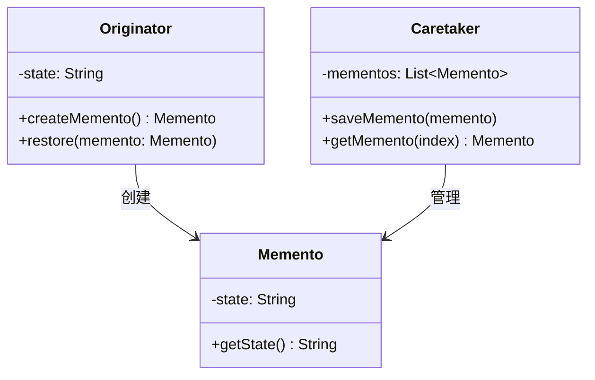
```mermaid
classDiagram
    class Originator {
        -state: String
        +createMemento() Memento
        +restore(memento: Memento)
    }
    class Memento {
        -state: String
        +getState() String
    }
    class Caretaker {
        -mementos: List~Memento~
        +saveMemento(memento)
        +getMemento(index) Memento
    }
    Originator --> Memento : 创建
    Caretaker --> Memento : 管理
```
- **Swift 源码**：
```swift
// 备忘录（存储状态）
struct Memento {
    private let state: String
    init(state: String) { self.state = state }
    func getState() -> String { return state }
}

// 原发器（需要保存/恢复状态的对象）
class Editor {
    private var content: String = ""
    
    func write(text: String) {
        content += text
    }
    func showContent() {
        print("当前内容: \(content)")
    }
    func createMemento() -> Memento {
        return Memento(state: content)
    }
    func restore(from memento: Memento) {
        self.content = memento.getState()
    }
}

// 管理者（负责保存历史）
class History {
    private var states: [Memento] = []
    func push(_ memento: Memento) { states.append(memento) }
    func pop() -> Memento? { return states.popLast() }
}

// 使用
let editor = Editor()
let history = History()
editor.write(text: "Hello ")
history.push(editor.createMemento()) // 保存快照
editor.write(text: "World")
print(editor.showContent()) // Hello World
editor.restore(from: history.pop()!)
print(editor.showContent()) // Hello (恢复成功)
```
- **易混淆区分**：与**命令模式**的区别。命令模式通过**记录操作**（执行了什么动作）来实现撤销（反向执行）；备忘录通过**记录状态快照**（对象长什么样）来实现撤销。备忘录更消耗内存，但恢复更直接。

---

### 19. 观察者模式 (Observer)
- **意图**：定义一对多的依赖关系，当被观察者状态改变时，所有观察者自动收到通知。
- **适用场景**：`NotificationCenter`、`KVO`、SwiftUI 的 `@Published`。
- **Mermaid 类图**：
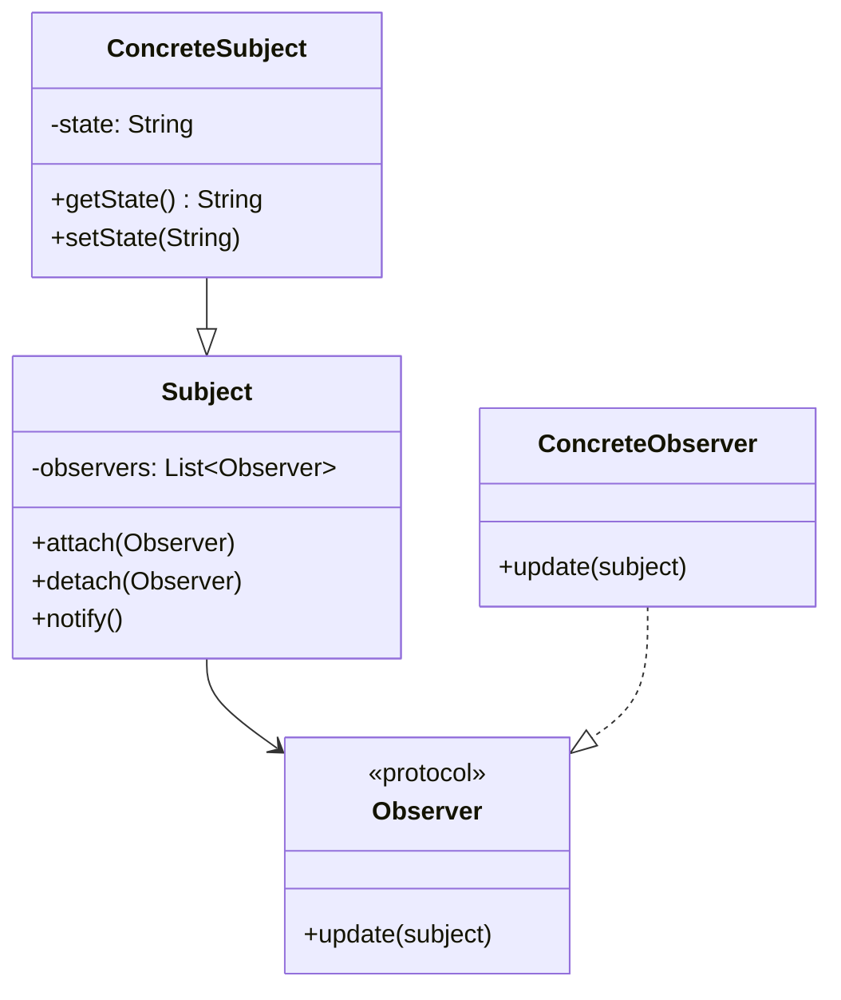
```mermaid
classDiagram
    class Subject {
        -observers: List~Observer~
        +attach(Observer)
        +detach(Observer)
        +notify()
    }
    class ConcreteSubject {
        -state: String
        +getState() String
        +setState(String)
    }
    class Observer {
        <<protocol>>
        +update(subject)
    }
    class ConcreteObserver {
        +update(subject)
    }
    Subject --> Observer
    ConcreteSubject --|> Subject
    ConcreteObserver ..|> Observer
```
- **Swift 源码**（手动实现，非 Combine）：
```swift
// 观察者协议
protocol Observer: AnyObject {
    func update(subject: Subject)
}

// 主题（被观察者）
class Subject {
    private var observers: [Observer] = []
    private var state: String = "" {
        didSet {
            notify()
        }
    }
    
    func attach(_ observer: Observer) {
        observers.append(observer)
    }
    func detach(_ observer: Observer) {
        observers.removeAll { $0 === observer }
    }
    func setState(_ state: String) {
        self.state = state
    }
    func getState() -> String {
        return state
    }
    private func notify() {
        observers.forEach { $0.update(subject: self) }
    }
}

// 具体观察者
class Display: Observer {
    func update(subject: Subject) {
        print("显示更新: \(subject.getState())")
    }
}

// 使用
let subject = Subject()
let display = Display()
subject.attach(display)
subject.setState("新数据") // 输出：显示更新: 新数据
```
- **易混淆区分**：与**发布-订阅 (Pub-Sub)** 的区别。观察者模式是**同步**且**松耦合**（主题维护观察者列表，观察者必须显式注册）；发布-订阅通常通过**消息代理（Broker）** 异步通信，发布者和订阅者完全隔离，互不知晓。

---

### 20. 状态模式 (State)
- **意图**：允许对象在内部状态改变时改变其行为，看起来像换了类。
- **适用场景**：订单状态机、电梯运行状态、`UIControl` 的 `isEnabled`/`isHighlighted` 状态组合。
- **Mermaid 类图**：
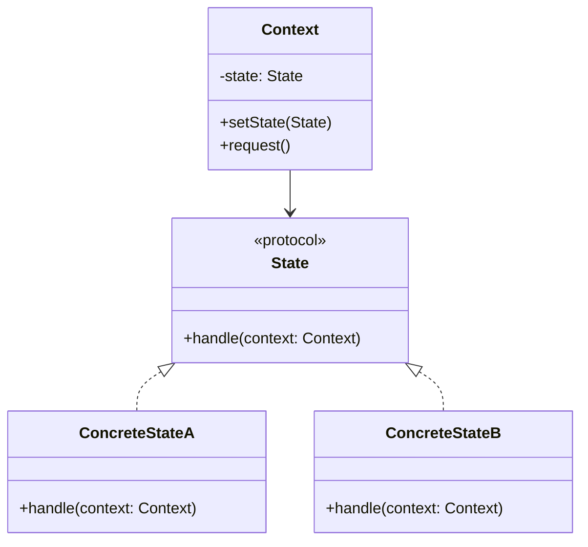
```mermaid
classDiagram
    class Context {
        -state: State
        +setState(State)
        +request()
    }
    class State {
        <<protocol>>
        +handle(context: Context)
    }
    class ConcreteStateA {
        +handle(context: Context)
    }
    class ConcreteStateB {
        +handle(context: Context)
    }
    Context --> State
    State <|.. ConcreteStateA
    State <|.. ConcreteStateB
```
- **Swift 源码**（网络请求状态）：
```swift
class NetworkContext {
    private var state: NetworkState
    init() {
        self.state = IdleState() // 初始状态
    }
    func setState(_ state: NetworkState) {
        self.state = state
    }
    func request() {
        state.handle(context: self)
    }
}

protocol NetworkState {
    func handle(context: NetworkContext)
}

struct IdleState: NetworkState {
    func handle(context: NetworkContext) {
        print("空闲状态 -> 发起连接")
        context.setState(ConnectingState())
    }
}

struct ConnectingState: NetworkState {
    func handle(context: NetworkContext) {
        print("连接中 -> 连接成功")
        context.setState(ConnectedState())
    }
}

struct ConnectedState: NetworkState {
    func handle(context: NetworkContext) {
        print("已连接 -> 发送数据")
        // 保持状态或超时切回 Idle
    }
}

// 使用
let context = NetworkContext()
context.request() // 空闲 -> 发起连接
context.request() // 连接中 -> 连接成功
context.request() // 已连接 -> 发送数据
```
- **易混淆区分**：与**策略模式**的核心区别（经典难点）：
    - **状态模式**：行为改变是**内在的、自动的**。当前状态决定下一个状态（如 `IdleState` 主动将 Context 设为 `ConnectingState`），客户端无需干涉。
    - **策略模式**：行为改变是**外在的、由客户端指定**。客户端主动调用 `context.setStrategy()` 切换算法，算法之间互相不知道也不关心。

---

### 21. 策略模式 (Strategy)
- **意图**：定义一组算法，封装起来，使它们可以相互替换（**算法族**）。
- **适用场景**：排序算法切换、支付方式选择、导航路线规划（最短/最快/避开高速）。
- **Mermaid 类图**：
```mermaid
classDiagram
    class Context {
        -strategy: Strategy
        +setStrategy(Strategy)
        +executeStrategy() Int
    }
    class Strategy {
        <<protocol>>
        +doAlgorithm(a, b) Int
    }
    class ConcreteStrategyAdd {
        +doAlgorithm(a, b) Int
    }
    class ConcreteStrategySubtract {
        +doAlgorithm(a, b) Int
    }
    Context --> Strategy
    Strategy <|.. ConcreteStrategyAdd
    Strategy <|.. ConcreteStrategySubtract
```
- **Swift 源码**：
```swift
protocol PaymentStrategy {
    func pay(amount: Double)
}

// 具体策略 - 微信支付
class WeChatPay: PaymentStrategy {
    func pay(amount: Double) {
        print("使用微信支付 \(amount) 元")
    }
}

// 具体策略 - 支付宝
class Alipay: PaymentStrategy {
    func pay(amount: Double) {
        print("使用支付宝支付 \(amount) 元")
    }
}

// 上下文（订单）
class Order {
    private var strategy: PaymentStrategy?
    func setStrategy(_ strategy: PaymentStrategy) {
        self.strategy = strategy
    }
    func checkout(amount: Double) {
        strategy?.pay(amount: amount)
    }
}

// 使用
let order = Order()
order.setStrategy(WeChatPay())
order.checkout(amount: 99.9) // 使用微信支付 99.9 元
order.setStrategy(Alipay())
order.checkout(amount: 100) // 使用支付宝支付 100 元
```
- **易混淆区分**：与**状态模式**的区分如上。与**命令模式**区分：策略封装“如何计算/执行”，命令封装“要做什么动作（包含撤销）”。

---

### 22. 模板方法模式 (Template Method)
- **意图**：定义算法的**骨架**，将某些步骤延迟到子类实现，子类不改变算法结构。
- **适用场景**：`UIViewController` 生命周期（`viewDidLoad` 等钩子方法）、制作饮品步骤固定（烧水、冲泡、加料）。
- **Mermaid 类图**：
```mermaid
classDiagram
    class AbstractClass {
        +templateMethod()
        #baseOperation()
        #requiredOperation()* 
        #hookOperation() 
    }
    class ConcreteClass {
        #requiredOperation()
        #hookOperation()
    }
    AbstractClass <|-- ConcreteClass
```
- **Swift 源码**：
```swift
// 抽象基类（定义骨架）
class BeverageMaker {
    // 模板方法（final，防止子类修改整体流程）
    final func makeBeverage() {
        boilWater()
        brew()
        pourInCup()
        if customerWantsCondiments() {
            addCondiments()
        }
    }
    
    private func boilWater() { print("烧开水") }
    private func pourInCup() { print("倒入杯中") }
    
    // 抽象步骤（必须由子类实现）
    func brew() {
        fatalError("子类必须实现 brew")
    }
    func addCondiments() {
        fatalError("子类必须实现 addCondiments")
    }
    
    // 钩子方法（子类可选重写，默认为 true）
    func customerWantsCondiments() -> Bool { return true }
}

// 子类 - 制作咖啡
class CoffeeMaker: BeverageMaker {
    override func brew() { print("冲泡咖啡粉") }
    override func addCondiments() { print("加糖和牛奶") }
    override func customerWantsCondiments() -> Bool { return false } // 不加调料
}

// 使用
let coffee = CoffeeMaker()
coffee.makeBeverage()
// 输出：烧开水 -> 冲泡咖啡粉 -> 倒入杯中 （跳过加调料）
```
- **易混淆区分**：与**工厂方法**的区别。模板方法定义**流程骨架**（包含多个步骤），工厂方法是模板方法中的一个**子步骤**（专门用于创建对象）。模板方法关注算法流程，工厂方法关注创建对象。

---

### 23. 访问者模式 (Visitor)
- **意图**：表示一个作用于对象结构中各元素的操作，在不改变元素类的前提下，增加作用于这些元素的**新操作**（双分派）。
- **适用场景**：编译器 AST 遍历、复杂对象结构的序列化/导出（XML/JSON）、收银台折扣系统。
- **Mermaid 类图**：
```mermaid
classDiagram
    class Visitor {
        <<protocol>>
        +visitConcreteElementA(Element)
        +visitConcreteElementB(Element)
    }
    class ConcreteVisitor1 {
        +visitConcreteElementA(Element)
        +visitConcreteElementB(Element)
    }
    class ConcreteVisitor2 {
        +visitConcreteElementA(Element)
        +visitConcreteElementB(Element)
    }
    class Element {
        <<protocol>>
        +accept(Visitor)
    }
    class ConcreteElementA {
        +accept(Visitor)
        +operationA()
    }
    class ConcreteElementB {
        +accept(Visitor)
        +operationB()
    }
    Visitor <|.. ConcreteVisitor1
    Visitor <|.. ConcreteVisitor2
    Element <|.. ConcreteElementA
    Element <|.. ConcreteElementB
    ConcreteElementA --> Visitor : accept
    ConcreteElementB --> Visitor : accept
```
- **Swift 源码**（不同形状导出为不同格式）：
```swift
// 访问者协议
protocol ShapeVisitor {
    func visit(circle: Circle)
    func visit(rect: Rectangle)
}

// 元素协议
protocol Shape {
    func accept(visitor: ShapeVisitor)
}

// 具体元素 A - 圆形
class Circle: Shape {
    let radius: Double
    init(radius: Double) { self.radius = radius }
    func accept(visitor: ShapeVisitor) {
        visitor.visit(circle: self) // 双分派
    }
}

// 具体元素 B - 矩形
class Rectangle: Shape {
    let width: Double, height: Double
    init(width: Double, height: Double) { self.width = width; self.height = height }
    func accept(visitor: ShapeVisitor) {
        visitor.visit(rect: self)
    }
}

// 具体访问者 1 - 计算面积
class AreaVisitor: ShapeVisitor {
    func visit(circle: Circle) {
        let area = Double.pi * circle.radius * circle.radius
        print("圆形面积: \(area)")
    }
    func visit(rect: Rectangle) {
        let area = rect.width * rect.height
        print("矩形面积: \(area)")
    }
}

// 具体访问者 2 - 计算周长
class PerimeterVisitor: ShapeVisitor {
    func visit(circle: Circle) {
        let perimeter = 2 * Double.pi * circle.radius
        print("圆形周长: \(perimeter)")
    }
    func visit(rect: Rectangle) {
        let perimeter = 2 * (rect.width + rect.height)
        print("矩形周长: \(perimeter)")
    }
}

// 使用
let shapes: [Shape] = [Circle(radius: 5), Rectangle(width: 4, height: 6)]
let areaVisitor = AreaVisitor()
let perimeterVisitor = PerimeterVisitor()

shapes.forEach { $0.accept(visitor: areaVisitor) }    // 输出面积
shapes.forEach { $0.accept(visitor: perimeterVisitor) } // 输出周长
// 完全无需修改 Shape 类，即可新增“面积”和“周长”两种操作！
```
- **易混淆区分**：与**迭代器**的区别。迭代器遍历元素执行**固有操作**（如打印元素）；访问者遍历元素执行**外部注入的新操作**（如面积计算）。访问者解决了“操作频繁变动”问题，但增加新元素类（如三角形）时，所有访问者都要修改。

---

## 总结：23 种模式速查矩阵

| 类别       | 模式名称         | 一句话核心            | 最易混淆组合      | 区分核心                       |
| :--------- | :--------------- | :-------------------- | :---------------- | :----------------------------- |
| **创建型** | Singleton        | 全局唯一实例          | vs 静态类         | 静态类无法继承/协议，单例可    |
|            | Factory Method   | 子类决定创建单产品    | vs 抽象工厂       | 单等级 vs 多产品族             |
|            | Abstract Factory | 创建产品族            | vs Builder        | 一步到位 vs 分步构建           |
|            | Builder          | 分步构建复杂对象      | vs 抽象工厂       | 构建过程控制 vs 直接组装       |
|            | Prototype        | 克隆自身              | vs Factory Method | 不执行构造器 vs 执行构造器     |
| **结构型** | Adapter          | 接口转换（转接头）    | vs Facade         | 转换接口 vs 简化接口           |
|            | Bridge           | 抽象与实现分离        | vs Adapter        | 设计前解耦 vs 设计后适配       |
|            | Composite        | 树形结构（部分-整体） | vs Decorator      | 层级包含 vs 平级增强           |
|            | Decorator        | 动态增强功能          | vs Proxy          | 增强功能 vs 控制访问           |
|            | Facade           | 统一简化接口          | vs Mediator       | 单向门面 vs 多向交互           |
|            | Flyweight        | 共享复用（池）        | vs Singleton      | 多状态可共享 vs 类型唯一       |
|            | Proxy            | 控制访问（延迟/权限） | vs Decorator      | 控制访问 vs 增强功能           |
| **行为型** | Chain of Resp.   | 传递处理者链          | vs Command        | 不确定谁处理 vs 绑定接收者     |
|            | Command          | 封装动作（可撤销）    | vs Strategy       | 封装动作(含接收者) vs 封装算法 |
|            | Interpreter      | 解释文法              | vs Visitor        | 解释语法树 vs 访问结构增加操作 |
|            | Iterator         | 顺序访问不暴露        | vs 原生枚举       | 设计模式 vs 具体 API           |
|            | Mediator         | 多对象交互仲裁        | vs Observer       | 交互逻辑封装 vs 发布-订阅通知  |
|            | Memento          | 状态快照（存档）      | vs Command        | 存状态 vs 存操作               |
|            | Observer         | 一对多通知            | vs Pub-Sub        | 同步/知悉列表 vs 异步/完全解耦 |
|            | State            | 状态驱动行为变化      | vs Strategy       | 内部自动切换 vs 外部指定切换   |
|            | Strategy         | 算法族可替换          | vs State          | 外部指定算法 vs 内部状态流转   |
|            | Template Method  | 流程骨架固定          | vs Factory Method | 流程骨架 vs 创建步骤           |
|            | Visitor          | 新增操作（双分派）    | vs Iterator       | 执行注入操作 vs 执行固有操作   |

> 掌握这 23 种模式，你将在设计应用架构时游刃有余。记住，模式不是“银弹”，而是“工具箱”，根据具体场景灵活组合使用。

# iOS 核心框架设计模式深度剖析（可渲染类图 + 工作流程）

---

## 1. UIKit — 事件驱动、视图层级与 MVC

### 核心类图（Mermaid 安全语法）

```mermaid
classDiagram
    class UIApplication {
        +shared: UIApplication
        +delegate: UIApplicationDelegate
        +sendEvent(event: UIEvent)
        -eventQueue: [UIEvent]
    }
    class UIApplicationDelegate {
        <<protocol>>
        +applicationDidFinishLaunching()
        +applicationWillResignActive()
    }
    class UIWindow {
        +rootViewController: UIViewController
        +sendEvent(event: UIEvent)
        -hitTest(point:withEvent:) -> UIView?
    }
    class UIViewController {
        +view: UIView
        +parent: UIViewController?
        +children: [UIViewController]
        +viewDidLoad()
        +viewWillAppear()
    }
    class "UIView" {
        +superview: UIView?
        +subviews: [UIView]
        +gestureRecognizers: [UIGestureRecognizer]
        +touchesBegan(touches:withEvent:)
        +addSubview(view: UIView)
    }
    class "UIResponder" {
        +next: UIResponder?
        +touchesBegan(touches:withEvent:)
        +touchesMoved(touches:withEvent:)
        +touchesEnded(touches:withEvent:)
    }
    class "UIControl" {
        +target: Any?
        +action: Selector?
        +addTarget(target:action:forControlEvents:)
        +sendAction(action:to:forEvent:)
    }
    "UIApplication" --> "UIApplicationDelegate" : delegate
    "UIApplication" --> "UIWindow" : holds
    "UIWindow" --> "UIViewController" : rootViewController
    "UIViewController" --> "UIView" : view
    "UIView" --|> "UIResponder" : inherits
    "UIControl" --|> "UIView" : inherits
    "UIResponder" --> "UIResponder" : next (response chain)
    "UIWindow" ..> "UIResponder" : event delivery
```

### 工作流程：触摸事件响应链

1. **系统捕获触摸** → 生成 `UIEvent`，放入 `UIApplication` 的事件队列。
2. **UIApplication** 从队列取出事件，调用 `sendEvent(_:)` 传递给当前 `UIWindow`。
3. **UIWindow** 执行 `hitTest(_:with:)`，从最上层子视图开始递归，找到最合适的 `UIView` 作为第一响应者。
4. 事件沿**响应者链**（通过 `next` 指针）向上传递：`UIView` → `UIViewController` → `UIWindow` → `UIApplication` → `UIApplicationDelegate`。
5. 若该 `UIView` 是 `UIControl`（如按钮），则通过 **Target-Action** 机制调用绑定的方法；否则调用 `touchesBegan` 等触摸方法。

### 设计模式应用

- **MVC（Model-View-Controller）**：`UIViewController` 作为协调器，连接 Model 与 View。
- **委托（Delegate）**：`UIApplicationDelegate`、`UITableViewDelegate` 等，将事件处理权移交给外部对象，实现“开放-封闭”。
- **观察者（Observer）**：`NotificationCenter` 提供全局广播，任意对象可监听。
- **响应链（Chain of Responsibility）**：触摸事件沿链传递，直到被处理。
- **单例（Singleton）**：`UIApplication.shared` 全局唯一访问点。
- **目标-动作（Target-Action）**：`UIControl` 将用户操作与特定方法绑定，解耦发送者与接收者。

---

## 2. SwiftUI — 声明式 UI + 响应式数据流

### 核心类图（安全语法）

```mermaid
classDiagram
    class View {
        <<protocol>>
        +body: View
        +modifier(modifier: ViewModifier) -> View
    }
    class App {
        <<protocol>>
        +body: Scene
        +main()
    }
    class Scene {
        <<protocol>>
        +body: Scene
    }
    class ViewModifier {
        <<protocol>>
        +body(content: Content) -> View
    }
    class Environment {
        <<struct>>
        +environment(keyPath: KeyPath, value: Value) -> View
    }
    class State {
        <<propertyWrapper>>
        +wrappedValue: Value
        +projectedValue: Binding~Value~
    }
    class Binding {
        <<propertyWrapper>>
        +get: () -> Value
        +set: (Value) -> Void
    }
    class ObservableObject {
        <<protocol>>
        +objectWillChange: ObservableObjectPublisher
    }
    class CustomView {
    }
    View <|.. CustomView
    View --> ViewModifier : uses via modifier
    App --> Scene : contains
    Scene --> View : contains
    State ..> View : stored state
    Binding ..> View : two-way binding
    ObservableObject ..> View : as @ObservedObject
```

### 工作流程：状态驱动 UI 更新

1. 用户**修改** `@State` 变量（如点击按钮改变 `count`）。
2. `@State` 触发**视图无效化**，标记该视图需要重新计算 `body`。
3. SwiftUI 渲染系统在下一个运行循环周期，重新执行 `body` 计算属性，生成新的视图描述树。
4. 系统对比新旧描述树，计算最小变动集合（**增量更新**），提交给底层 `UIView`（iOS）或 `NSView`（macOS）进行实际渲染。
5. 若使用 `@ObservedObject`，则 `ObservableObject` 在属性变化前发送 `objectWillChange` 通知，订阅的视图自动刷新。

### 设计模式应用

- **组合模式（Composite）**：`View` 协议通过 `body` 嵌套子视图，形成树形结构。
- **装饰器模式（Decorator/Modifier）**：`.font()`, `.foregroundColor()` 等修饰器包装视图，返回新视图。
- **观察者模式（Observer）**：`@Published` 和 `ObservableObject` 实现发布-订阅。
- **MVVM 变体**：`View` 扮演 View，`ObservableObject` 扮演 ViewModel，数据绑定由框架自动完成。
- **建造者模式（Builder）**：通过链式修饰符逐步构建最终视图。

---

## 3. 异步与并发框架

### 3.1 Grand Central Dispatch (GCD)

```mermaid
classDiagram
    class DispatchQueue {
        +main: DispatchQueue
        +global(qos: QoS) -> DispatchQueue
        +async(block: @escaping () -> Void)
        +sync(block: () -> Void)
        +after(deadline: DispatchTime, block: () -> Void)
    }
    class DispatchWorkItem {
        +init(block: () -> Void)
        +perform()
        +cancel()
        +wait()
    }
    class DispatchGroup {
        +enter()
        +leave()
        +notify(qos:queue:execute:)
        +wait()
    }
    DispatchQueue --> DispatchWorkItem : executes
    DispatchGroup --> DispatchQueue : monitors tasks
```

**工作流程**：
- 开发者调用 `queue.async { ... }`，闭包被封装为 `DispatchWorkItem`（命令对象）。
- 任务被**入队**到指定 `DispatchQueue`（串行或并发）。
- 系统全局线程池从队列取出任务，分配给空闲线程执行。
- 可使用 `DispatchGroup` 跟踪多个任务完成，实现同步等待或组合通知。

**设计模式**：
- **命令模式（Command）**：闭包作为命令封装操作。
- **生产者-消费者**：队列是缓冲区，系统线程是消费者。

### 3.2 Combine

```mermaid
classDiagram
    class Publisher {
        <<protocol>>
        +subscribe(subscriber: Subscriber)
        +map(transform: @escaping (Output) -> T) -> Publishers.Map
        +filter(predicate: @escaping (Output) -> Bool) -> Publishers.Filter
        +sink(receiveValue: @escaping (Output) -> Void) -> AnyCancellable
    }
    class Subscriber {
        <<protocol>>
        +receive(subscription: Subscription)
        +receive(input: Input) -> Demand
        +receive(completion: Subscribers.Completion)
    }
    class Subscription {
        <<protocol>>
        +request(demand: Demand)
        +cancel()
    }
    class Subject {
        <<protocol>>
        +send(value: Output)
        +send(completion: Completion)
    }
    class PassthroughSubject {
        +send(value: Output)
    }
    class CurrentValueSubject {
        +value: Output
        +send(value: Output)
    }
    Publisher <|.. PassthroughSubject : implements
    Publisher <|.. CurrentValueSubject : implements
    Publisher --> Subscriber : subscribes
    Subscriber --> Subscription : holds
    Subject --|> Publisher
```

**工作流程**：
1. 创建 `PassthroughSubject<Int, Never>()` 作为发布者。
2. 调用 `.sink` 或 `.assign` 创建订阅者，系统调用 `receive(subscription:)` 并返回 `AnyCancellable`。
3. 发布者通过 `send(value:)` 发射新值，值经过操作符链（如 `map`, `filter`）处理，最终到达订阅者的 `receive(input:)`。
4. 订阅者可调用 `cancel()` 终止订阅，或通过 `Subscribers.Demand` 控制接收数量。

**设计模式**：
- **观察者模式（Observer）** 的响应式变体（推模式）。
- **迭代器模式（Iterator）**：数据流可被逐项处理。
- **组合模式（Composite）**：操作符组合成管道。

### 3.3 Swift Concurrency (async/await, Actor)

```mermaid
classDiagram
    class Task {
        +priority: TaskPriority
        +value: Success
        +cancel()
        +sleep(nanoseconds: UInt64)
        +detached(priority: TaskPriority, operation: () -> Success): Task
    }
    class Actor {
        <<protocol>>
        +isolatedExecutor: UnownedExecutor
    }
    class MainActor {
        +run(operation: () -> Void)
        +shared: MainActor
    }
    class AsyncSequence {
        <<protocol>>
        +makeAsyncIterator(): AsyncIterator
    }
    Task --> Actor : runs on actor's isolation
    Actor --> MainActor : global main actor
```

**工作流程**：
- 用 `async` 标记异步函数，调用时使用 `await` 挂起当前任务，不阻塞线程。
- `Task` 表示并发单元，可被取消，并可设置优先级。
- `Actor` 保护共享可变状态，编译器强制所有对该状态的访问都通过 `actor` 的隔离域，自动串行化。
- `MainActor` 确保 UI 操作在主线程执行。

**设计模式**：
- **命令模式**：`Task` 封装异步操作。
- **代理/中介者**：`Actor` 作为数据访问中介，序列化访问。
- **迭代器模式**：`AsyncSequence` 支持异步迭代。

---

## 4. ARKit — 增强现实会话与渲染桥接

### 核心类图

```mermaid
classDiagram
    class ARSession {
        +delegate: ARSessionDelegate
        +run(configuration, options)
        +pause()
        +currentFrame: ARFrame
        +add(anchor)
        +remove(anchor)
    }
    class ARConfiguration {
        <<abstract>>
        +worldAlignment: ARWorldAlignment
        +isLightEstimationEnabled: Bool
    }
    class ARWorldTrackingConfiguration {
        +planeDetection: ARPlaneDetection
        +environmentTexturing: AREnvironmentTexturing
    }
    class ARFaceTrackingConfiguration {
        +isLightEstimationEnabled: Bool
    }
    class ARFrame {
        +timestamp: TimeInterval
        +capturedImage: CVPixelBuffer
        +anchors: List
        +camera: ARCamera
    }
    class ARAnchor {
        +identifier: UUID
        +transform: Matrix4x4
    }
    class ARSCNView {
        +session: ARSession
        +scene: SCNScene
        +pointOfView: SCNNode
        +renderer
    }
    class ARSessionDelegate {
        <<protocol>>
        +sessionDidUpdate
        +sessionDidAdd
        +sessionDidRemove
        +sessionWasInterrupted
    }
    ARSession --> ARConfiguration : uses
    ARSession --> ARFrame : produces
    ARSession --> ARAnchor : manages
    ARSCNView --> ARSession : holds
    ARSCNView --> SCNScene : renders
    ARSession ..> ARSessionDelegate : notifies
    ARWorldTrackingConfiguration --|> ARConfiguration : inherits
    ARFaceTrackingConfiguration --|> ARConfiguration : inherits
```

### 工作流程：启动 AR 会话

1. 创建 `ARWorldTrackingConfiguration`，配置平面检测、环境纹理等。
2. 调用 `session.run(configuration)`，启动底层传感器和追踪算法。
3. 每一帧，`ARSession` 将相机图像、设备运动等数据融合，计算设备位置（6DoF），生成 `ARFrame` 对象。
4. `ARFrame` 包含当前帧图片、检测到的 `ARAnchor`（如平面、人脸）等。
5. 若实现 `ARSessionDelegate`，会收到 `session(_:didUpdate:)` 等回调，可获取更新后的帧数据。
6. `ARSCNView` 作为 `ARSession` 的**委托**，自动将 `ARAnchor` 同步到 SceneKit 场景中（如添加平面节点）。
7. 开发者可查询 `session.currentFrame` 进行**拉取**，或在代理方法中**推送**处理。

### 设计模式应用

- **策略模式（Strategy）**：通过不同 `ARConfiguration` 子类切换 AR 体验（世界追踪 vs 人脸追踪）。
- **观察者/委托（Observer/Delegate）**：`ARSessionDelegate` 接收帧更新。
- **拉取与推送（Pull/Push）**：主动获取 `currentFrame` 与被动回调并存。
- **桥接模式（Bridge）**：`ARSCNView` 将 ARKit 数据桥接到 SceneKit 渲染引擎。

---

## 5. AVFoundation — 音视频捕获管道

### 核心类图

```mermaid
classDiagram
    class "AVCaptureSession" {
        +beginConfiguration()
        +commitConfiguration()
        +startRunning()
        +stopRunning()
        +canAddInput(input: AVCaptureInput) -> Bool
        +canAddOutput(output: AVCaptureOutput) -> Bool
        +addInput(input: AVCaptureInput)
        +addOutput(output: AVCaptureOutput)
    }
    class "AVCaptureDevice" {
        +device(for mediaType: AVMediaType) -> AVCaptureDevice?
        +uniqueID: String
        +activeFormat: AVCaptureDeviceFormat
        +lockForConfiguration() throws
        +unlockForConfiguration()
    }
    class "AVCaptureDeviceInput" {
        +init(device: AVCaptureDevice) throws
        +device: AVCaptureDevice
    }
    class "AVCaptureOutput" {
        <<abstract>>
        +connection(with mediaType: AVMediaType) -> AVCaptureConnection?
    }
    class "AVCaptureVideoDataOutput" {
        +setSampleBufferDelegate(delegate:queue:)
        +alwaysDiscardsLateVideoFrames: Bool
    }
    class "AVCaptureVideoPreviewLayer" {
        +init(session: AVCaptureSession)
        +videoGravity: AVLayerVideoGravity
    }
    class "AVCaptureConnection" {
        +isEnabled: Bool
        +videoOrientation: AVCaptureVideoOrientation
    }
    "AVCaptureSession" --> "AVCaptureDeviceInput" : contains
    "AVCaptureSession" --> "AVCaptureOutput" : contains
    "AVCaptureDeviceInput" --> "AVCaptureDevice" : uses
    "AVCaptureVideoDataOutput" --|> "AVCaptureOutput"
    "AVCaptureVideoPreviewLayer" --> "AVCaptureSession" : references
```

### 工作流程：搭建摄像头预览并捕获视频数据

1. **获取设备**：`AVCaptureDevice.default(for: .video)`。
2. **创建输入**：`AVCaptureDeviceInput(device: camera)`。
3. **创建输出**：`AVCaptureVideoDataOutput`，并设置代理队列和回调。
4. **会话配置**：调用 `session.beginConfiguration()`，然后 `addInput()` 和 `addOutput()`，最后 `commitConfiguration()`。
5. **启动会话**：`session.startRunning()` 异步开启硬件流。
6. **预览**：创建 `AVCaptureVideoPreviewLayer(session: session)` 添加到视图层。
7. **数据回调**：代理方法 `captureOutput(_:didOutput:from:)` 接收原始 `CMSampleBuffer`，可进行自定义处理。

### 设计模式应用

- **中介者模式（Mediator）**：`AVCaptureSession` 作为协调者，管理输入、输出之间数据流。
- **策略模式（Strategy）**：可通过设置 `sessionPreset` 改变捕获质量（高清/标清）。
- **委托模式（Delegate）**：`AVCaptureVideoDataOutput` 通过委托回调传递数据。
- **命令模式（Command）**：`startRunning()` / `stopRunning()` 控制数据流开关。

---

## 6. Core ML — 机器学习模型统一入口

### 核心类图

```mermaid
classDiagram
    class MLModel {
        +init(contentsOf: URL)
        +prediction(from: MLFeatureProvider, options: MLPredictionOptions): MLFeatureProvider
        +configuration: MLModelConfiguration
    }
    class MLModelConfiguration {
        +computeUnits: MLComputeUnits
        +allowLowPrecisionAccumulation: Bool
    }
    class MLFeatureProvider {
        <<protocol>>
        +featureValue(for: String): MLFeatureValue
        +featureNames: Set~String~
    }
    class MLMultiArray {
        +init(shape: NSNumber[], dataType: MLMultiArrayDataType)
        +dataPointer: UnsafeMutableRawPointer
        +shape: NSNumber[]
    }
    class MLPredictionOptions {
        +usesCPUOnly: Bool
    }
    class MLFeatureValue {
        +value(for: MLFeatureType)
        +multiArrayValue: MLMultiArray
        +imageBufferValue: CVPixelBuffer
    }
    class MyModel {
        +prediction(image: CVPixelBuffer): MyModelOutput
    }
    MLModel <|-- MyModel : generated subclass
    MLModel --> MLModelConfiguration : uses
    MLModel --> MLFeatureProvider : input/output
    MLModel --> MLPredictionOptions : for prediction
    MLFeatureProvider --> MLFeatureValue : contains
```

### 工作流程：运行模型预测

1. Xcode 将 `.mlmodel` 编译为 Swift 类（如 `MyModel`）。
2. 开发者实例化 `MyModel(configuration: ...)`。
3. 构造输入数据（如 `CVPixelBuffer` 图像），调用类型安全的预测方法，或手动构造 `MLMultiArray`。
4. 框架内部进行硬件加速（GPU/Neural Engine）计算。
5. 返回输出对象，包含分类标签、置信度等。

### 设计模式应用

- **外观模式（Facade）**：`MLModel` 提供极简预测接口，隐藏模型加载、内存管理、硬件调度等复杂细节。
- **策略模式（Strategy）**：通过 `MLModelConfiguration` 切换计算单元（CPU/GPU/Neural Engine）和精度策略。
- **工厂方法（Factory Method）**：Xcode 编译时生成具体模型子类，提供类型安全的初始化。

---

## 7. 数据持久化框架

### 7.1 UserDefaults — 轻量级 KV 存储

- **设计模式**：**单例（Singleton）** — `UserDefaults.standard` 全局访问点。
- **工作流程**：`set(_:forKey:)` 将值写入 plist 文件，`synchronize()` 强制写入磁盘（默认自动）。

### 7.2 FileManager + Codable — 对象归档

- **设计模式**：**序列化模式（Serialization）** — `Codable` 协议定义编码/解码逻辑。
- **工作流程**：
  1. 对象遵循 `Codable`。
  2. `JSONEncoder().encode(object)` 转为 `Data`。
  3. `FileManager.default.createFile(...)` 写入磁盘。
  4. 读取时 `Data(contentsOf: url)`，`JSONDecoder().decode(Model.self, from: data)` 还原。

### 7.3 Core Data — 对象图管理与持久化

```mermaid
classDiagram
    class "NSPersistentContainer" {
        +viewContext: NSManagedObjectContext
        +loadPersistentStores(completion:)
        +newBackgroundContext() -> NSManagedObjectContext
    }
    class "NSManagedObjectContext" {
        +parent: NSManagedObjectContext?
        +mergePolicy: AnyObject
        +save() throws
        +fetch(request: NSFetchRequest) throws -> [NSManagedObject]
        +insert(object: NSManagedObject)
        +delete(object: NSManagedObject)
        +undoManager: UndoManager?
    }
    class "NSManagedObject" {
        +entity: NSEntityDescription
        +managedObjectContext: NSManagedObjectContext?
        +willChangeValue(forKey:)
        +didChangeValue(forKey:)
        +primitiveValue(forKey:)
    }
    class "NSEntityDescription" {
        +entity(forEntityName:in:) -> NSEntityDescription
        +properties: [NSPropertyDescription]
    }
    class "NSFetchRequest" {
        +entity: NSEntityDescription?
        +predicate: NSPredicate?
        +sortDescriptors: [NSSortDescriptor]
    }
    "NSPersistentContainer" --> "NSManagedObjectContext" : holds
    "NSManagedObjectContext" --> "NSManagedObject" : manages
    "NSManagedObject" --> "NSEntityDescription" : references
    "NSManagedObjectContext" --> "NSFetchRequest" : executes
    "NSManagedObjectContext" --> "UndoManager" : integrates
```

**工作流程**：
1. 创建 `NSPersistentContainer`，指定 `momd` 模型文件，调用 `loadPersistentStores` 加载数据库。
2. 使用 `viewContext`（主队列）或 `newBackgroundContext()`（后台队列）进行数据操作。
3. 创建或修改 `NSManagedObject` 子类对象，插入到上下文。
4. 调用 `save()` 将变更提交到持久化存储（SQLite）。
5. 通过 `NSFetchRequest` 查询数据，支持谓词、排序。
6. 上下文的 `undoManager` 支持撤销操作。

**设计模式应用**：
- **中介者模式（Mediator）**：`NSManagedObjectContext` 协调 Model 对象与持久化存储。
- **观察者模式（Observer）**：上下文发送 `NSManagedObjectContextObjectsDidChange` 通知。
- **备忘录模式（Memento）**：`UndoManager` 记录对象状态快照。
- **工厂模式（Factory）**：`NSEntityDescription` 创建 `NSManagedObject` 实例。

---

## 8. 框架设计理念总结

| 框架              | 核心设计理念         | 主导模式               | 架构风格            |
| ----------------- | -------------------- | ---------------------- | ------------------- |
| UIKit             | 事件驱动，命令式 UI  | MVC、委托、响应链      | 面向对象            |
| SwiftUI           | 声明式，状态驱动     | 组合、观察者、MVVM     | 声明式 + 函数式     |
| GCD / Operation   | 任务队列，异步执行   | 命令、生产者-消费者    | 并发模型            |
| Combine           | 响应式数据流         | 观察者、迭代器         | 响应式              |
| Swift Concurrency | 结构化并发，数据隔离 | 任务、Actor            | 现代并发            |
| ARKit             | 会话管理，渲染桥接   | 策略、委托、桥接       | 管道 + 桥接         |
| AVFoundation      | 音视频捕获管道       | 中介者、策略、委托     | 管道架构            |
| Core ML           | 统一模型接口         | 外观、策略             | 门面模式            |
| Core Data         | 对象图管理           | 中介者、观察者、备忘录 | 活动记录 + 数据映射 |

### 设计理念演进脉络

1. **从命令式到声明式**：UIKit → SwiftUI，开发者从“指挥每一步”变为“描述最终状态”。
2. **从面向对象到面向协议/函数式**：从 Delegate、Target-Action，到 Combine 的响应式、SwiftUI 的组合式，更强调**组合优于继承**。
3. **从不安全到安全**：从手动内存管理、线程加锁，到 ARC、Actor 模型，编译器承担更多安全工作。
4. **从复杂到简洁**：外观模式（Facade）是 Core ML、AVFoundation 等框架的共同选择，旨在将内部复杂性封装，为开发者提供简洁易用的 API。

# iOS 核心框架设计模式深度剖析（可渲染类图 + 工作流程）

> **注**：所有 Mermaid 类图均已修正语法，类名不加多余引号，确保在标准 Mermaid 解析器中正确渲染。

---

## 1. UIKit — 事件驱动、视图层级与 MVC

### 核心类图（Mermaid 安全语法）

```mermaid
classDiagram
    class UIApplication {
        +shared: UIApplication
        +delegate: UIApplicationDelegate
        +sendEvent(event: UIEvent)
        -eventQueue: [UIEvent]
    }
    class UIApplicationDelegate {
        <<protocol>>
        +applicationDidFinishLaunching()
        +applicationWillResignActive()
    }
    class UIWindow {
        +rootViewController: UIViewController
        +sendEvent(event: UIEvent)
        -hitTest(point:withEvent:) -> UIView?
    }
    class UIViewController {
        +view: UIView
        +parent: UIViewController?
        +children: [UIViewController]
        +viewDidLoad()
        +viewWillAppear()
    }
    class UIView {
        +superview: UIView?
        +subviews: [UIView]
        +gestureRecognizers: [UIGestureRecognizer]
        +touchesBegan(touches:withEvent:)
        +addSubview(view: UIView)
    }
    class UIResponder {
        +next: UIResponder?
        +touchesBegan(touches:withEvent:)
        +touchesMoved(touches:withEvent:)
        +touchesEnded(touches:withEvent:)
    }
    class UIControl {
        +target: Any?
        +action: Selector?
        +addTarget(target:action:forControlEvents:)
        +sendAction(action:to:forEvent:)
    }
    UIApplication --> UIApplicationDelegate : delegate
    UIApplication --> UIWindow : holds
    UIWindow --> UIViewController : rootViewController
    UIViewController --> UIView : view
    UIView --|> UIResponder : inherits
    UIControl --|> UIView : inherits
    UIResponder --> UIResponder : next (response chain)
    UIWindow ..> UIResponder : event delivery
```

### 工作流程：触摸事件响应链

1. **系统捕获触摸** → 生成 `UIEvent`，放入 `UIApplication` 的事件队列。
2. **UIApplication** 从队列取出事件，调用 `sendEvent(_:)` 传递给当前 `UIWindow`。
3. **UIWindow** 执行 `hitTest(_:with:)`，从最上层子视图开始递归，找到最合适的 `UIView` 作为第一响应者。
4. 事件沿**响应者链**（通过 `next` 指针）向上传递：`UIView` → `UIViewController` → `UIWindow` → `UIApplication` → `UIApplicationDelegate`。
5. 若该 `UIView` 是 `UIControl`（如按钮），则通过 **Target-Action** 机制调用绑定的方法；否则调用 `touchesBegan` 等触摸方法。

### 设计模式应用

- **MVC（Model-View-Controller）**：`UIViewController` 作为协调器，连接 Model 与 View。
- **委托（Delegate）**：`UIApplicationDelegate`、`UITableViewDelegate` 等，将事件处理权移交给外部对象，实现“开放-封闭”。
- **观察者（Observer）**：`NotificationCenter` 提供全局广播，任意对象可监听。
- **响应链（Chain of Responsibility）**：触摸事件沿链传递，直到被处理。
- **单例（Singleton）**：`UIApplication.shared` 全局唯一访问点。
- **目标-动作（Target-Action）**：`UIControl` 将用户操作与特定方法绑定，解耦发送者与接收者。

---

## 2. SwiftUI — 声明式 UI + 响应式数据流

### 核心类图（安全语法）

```mermaid
classDiagram
    class View {
        <<protocol>>
        +body: some View { get }
        +modifier(modifier: some ViewModifier) -> some View
    }
    class App {
        <<protocol>>
        +body: some Scene { get }
        +main()
    }
    class Scene {
        <<protocol>>
        +body: some Scene { get }
    }
    class ViewModifier {
        <<protocol>>
        +body(content: Content) -> some View
    }
    class Environment {
        <<struct>>
        +environment(keyPath: KeyPath, value: Value) -> some View
    }
    class State {
        <<@propertyWrapper>>
        +wrappedValue: Value
        +projectedValue: Binding~Value~
    }
    class Binding {
        <<@propertyWrapper>>
        +get: () -> Value
        +set: (Value) -> Void
    }
    class ObservableObject {
        <<protocol>>
        +objectWillChange: ObservableObjectPublisher
    }
    View <|.. 自定义View
    View --> ViewModifier : uses via modifier
    App --> Scene : contains
    Scene --> View : contains
    State ..> View : stored state
    Binding ..> View : two-way binding
    ObservableObject ..> View : as @ObservedObject
```

### 工作流程：状态驱动 UI 更新

1. 用户**修改** `@State` 变量（如点击按钮改变 `count`）。
2. `@State` 触发**视图无效化**，标记该视图需要重新计算 `body`。
3. SwiftUI 渲染系统在下一个运行循环周期，重新执行 `body` 计算属性，生成新的视图描述树。
4. 系统对比新旧描述树，计算最小变动集合（**增量更新**），提交给底层 `UIView`（iOS）或 `NSView`（macOS）进行实际渲染。
5. 若使用 `@ObservedObject`，则 `ObservableObject` 在属性变化前发送 `objectWillChange` 通知，订阅的视图自动刷新。

### 设计模式应用

- **组合模式（Composite）**：`View` 协议通过 `body` 嵌套子视图，形成树形结构。
- **装饰器模式（Decorator/Modifier）**：`.font()`, `.foregroundColor()` 等修饰器包装视图，返回新视图。
- **观察者模式（Observer）**：`@Published` 和 `ObservableObject` 实现发布-订阅。
- **MVVM 变体**：`View` 扮演 View，`ObservableObject` 扮演 ViewModel，数据绑定由框架自动完成。
- **建造者模式（Builder）**：通过链式修饰符逐步构建最终视图。

---

## 3. 异步与并发框架

### 3.1 Grand Central Dispatch (GCD)

```mermaid
classDiagram
    class DispatchQueue {
        +main: DispatchQueue
        +global(qos: QoS) -> DispatchQueue
        +async(block: @escaping () -> Void)
        +sync(block: () -> Void)
        +after(deadline: DispatchTime, block: () -> Void)
    }
    class DispatchWorkItem {
        +init(block: () -> Void)
        +perform()
        +cancel()
        +wait()
    }
    class DispatchGroup {
        +enter()
        +leave()
        +notify(qos:queue:execute:)
        +wait()
    }
    DispatchQueue --> DispatchWorkItem : executes
    DispatchGroup --> DispatchQueue : monitors tasks
```

**工作流程**：
- 开发者调用 `queue.async { ... }`，闭包被封装为 `DispatchWorkItem`（命令对象）。
- 任务被**入队**到指定 `DispatchQueue`（串行或并发）。
- 系统全局线程池从队列取出任务，分配给空闲线程执行。
- 可使用 `DispatchGroup` 跟踪多个任务完成，实现同步等待或组合通知。

**设计模式**：
- **命令模式（Command）**：闭包作为命令封装操作。
- **生产者-消费者**：队列是缓冲区，系统线程是消费者。

### 3.2 Combine

```mermaid
classDiagram
    class Publisher {
        <<protocol>>
        +subscribe(subscriber: Subscriber)
        +map(transform: @escaping (Output) -> T) -> Publishers.Map
        +filter(predicate: @escaping (Output) -> Bool) -> Publishers.Filter
        +sink(receiveValue: @escaping (Output) -> Void) -> AnyCancellable
    }
    class Subscriber {
        <<protocol>>
        +receive(subscription: Subscription)
        +receive(input: Input) -> Demand
        +receive(completion: Subscribers.Completion)
    }
    class Subscription {
        <<protocol>>
        +request(demand: Demand)
        +cancel()
    }
    class Subject {
        <<protocol>>
        +send(value: Output)
        +send(completion: Completion)
    }
    class PassthroughSubject {
        +send(value: Output)
    }
    class CurrentValueSubject {
        +value: Output
        +send(value: Output)
    }
    Publisher <|.. PassthroughSubject : implements
    Publisher <|.. CurrentValueSubject : implements
    Publisher --> Subscriber : subscribes
    Subscriber --> Subscription : holds
    Subject --|> Publisher
```

**工作流程**：
1. 创建 `PassthroughSubject<Int, Never>()` 作为发布者。
2. 调用 `.sink` 或 `.assign` 创建订阅者，系统调用 `receive(subscription:)` 并返回 `AnyCancellable`。
3. 发布者通过 `send(value:)` 发射新值，值经过操作符链（如 `map`, `filter`）处理，最终到达订阅者的 `receive(input:)`。
4. 订阅者可调用 `cancel()` 终止订阅，或通过 `Subscribers.Demand` 控制接收数量。

**设计模式**：
- **观察者模式（Observer）** 的响应式变体（推模式）。
- **迭代器模式（Iterator）**：数据流可被逐项处理。
- **组合模式（Composite）**：操作符组合成管道。

### 3.3 Swift Concurrency (async/await, Actor)

```mermaid
classDiagram
    class Task {
        +priority: TaskPriority
        +value: Success { get async throws }
        +cancel()
        +sleep(nanoseconds: UInt64) async
        +detached(priority: TaskPriority, operation: @escaping () async -> Success) -> Task
    }
    class Actor {
        <<protocol>>
        +isolatedExecutor: UnownedExecutor
    }
    class MainActor {
        +run(operation: () -> Void)
        +shared: MainActor
    }
    class AsyncSequence {
        <<protocol>>
        +makeAsyncIterator() -> AsyncIterator
    }
    Task --> Actor : runs on actor's isolation
    Actor --> MainActor : global main actor
```

**工作流程**：
- 用 `async` 标记异步函数，调用时使用 `await` 挂起当前任务，不阻塞线程。
- `Task` 表示并发单元，可被取消，并可设置优先级。
- `Actor` 保护共享可变状态，编译器强制所有对该状态的访问都通过 `actor` 的隔离域，自动串行化。
- `MainActor` 确保 UI 操作在主线程执行。

**设计模式**：
- **命令模式**：`Task` 封装异步操作。
- **代理/中介者**：`Actor` 作为数据访问中介，序列化访问。
- **迭代器模式**：`AsyncSequence` 支持异步迭代。

---

## 4. ARKit — 增强现实会话与渲染桥接

### 核心类图

```mermaid
classDiagram
    class ARSession {
        +delegate: ARSessionDelegate?
        +run(configuration: ARConfiguration, options: ARSession.RunOptions)
        +pause()
        +currentFrame: ARFrame? { get }
        +add(anchor: ARAnchor)
        +remove(anchor: ARAnchor)
    }
    class ARConfiguration {
        <<abstract>>
        +worldAlignment: ARWorldAlignment
        +isLightEstimationEnabled: Bool
    }
    class ARWorldTrackingConfiguration {
        +planeDetection: ARPlaneDetection
        +environmentTexturing: AREnvironmentTexturing
    }
    class ARFaceTrackingConfiguration {
        +isLightEstimationEnabled: Bool
    }
    class ARFrame {
        +timestamp: TimeInterval
        +capturedImage: CVPixelBuffer
        +anchors: [ARAnchor]
        +camera: ARCamera
    }
    class ARAnchor {
        +identifier: UUID
        +transform: simd_float4x4
    }
    class ARSCNView {
        +session: ARSession
        +scene: SCNScene
        +pointOfView: SCNNode?
        +renderer(_:didAdd:for:)
    }
    class ARSessionDelegate {
        <<protocol>>
        +session(_:didUpdate:)
        +session(_:didAdd:)
        +session(_:didRemove:)
        +sessionWasInterrupted(_:)
    }
    ARSession --> ARConfiguration : uses
    ARSession --> ARFrame : produces
    ARSession --> ARAnchor : manages
    ARSCNView --> ARSession : holds
    ARSCNView --> SCNScene : renders
    ARSession ..> ARSessionDelegate : notifies
    ARWorldTrackingConfiguration --|> ARConfiguration : inherits
    ARFaceTrackingConfiguration --|> ARConfiguration : inherits
```

### 工作流程：启动 AR 会话

1. 创建 `ARWorldTrackingConfiguration`，配置平面检测、环境纹理等。
2. 调用 `session.run(configuration)`，启动底层传感器和追踪算法。
3. 每一帧，`ARSession` 将相机图像、设备运动等数据融合，计算设备位置（6DoF），生成 `ARFrame` 对象。
4. `ARFrame` 包含当前帧图片、检测到的 `ARAnchor`（如平面、人脸）等。
5. 若实现 `ARSessionDelegate`，会收到 `session(_:didUpdate:)` 等回调，可获取更新后的帧数据。
6. `ARSCNView` 作为 `ARSession` 的**委托**，自动将 `ARAnchor` 同步到 SceneKit 场景中（如添加平面节点）。
7. 开发者可查询 `session.currentFrame` 进行**拉取**，或在代理方法中**推送**处理。

### 设计模式应用

- **策略模式（Strategy）**：通过不同 `ARConfiguration` 子类切换 AR 体验（世界追踪 vs 人脸追踪）。
- **观察者/委托（Observer/Delegate）**：`ARSessionDelegate` 接收帧更新。
- **拉取与推送（Pull/Push）**：主动获取 `currentFrame` 与被动回调并存。
- **桥接模式（Bridge）**：`ARSCNView` 将 ARKit 数据桥接到 SceneKit 渲染引擎。

---

## 5. AVFoundation — 音视频捕获管道

### 核心类图

```mermaid
classDiagram
    class AVCaptureSession {
        +beginConfiguration()
        +commitConfiguration()
        +startRunning()
        +stopRunning()
        +canAddInput(input: AVCaptureInput) -> Bool
        +canAddOutput(output: AVCaptureOutput) -> Bool
        +addInput(input: AVCaptureInput)
        +addOutput(output: AVCaptureOutput)
    }
    class AVCaptureDevice {
        +device(for mediaType: AVMediaType) -> AVCaptureDevice?
        +uniqueID: String
        +activeFormat: AVCaptureDeviceFormat
        +lockForConfiguration() throws
        +unlockForConfiguration()
    }
    class AVCaptureDeviceInput {
        +init(device: AVCaptureDevice) throws
        +device: AVCaptureDevice
    }
    class AVCaptureOutput {
        <<abstract>>
        +connection(with mediaType: AVMediaType) -> AVCaptureConnection?
    }
    class AVCaptureVideoDataOutput {
        +setSampleBufferDelegate(delegate:queue:)
        +alwaysDiscardsLateVideoFrames: Bool
    }
    class AVCaptureVideoPreviewLayer {
        +init(session: AVCaptureSession)
        +videoGravity: AVLayerVideoGravity
    }
    class AVCaptureConnection {
        +isEnabled: Bool
        +videoOrientation: AVCaptureVideoOrientation
    }
    AVCaptureSession --> AVCaptureDeviceInput : contains
    AVCaptureSession --> AVCaptureOutput : contains
    AVCaptureDeviceInput --> AVCaptureDevice : uses
    AVCaptureVideoDataOutput --|> AVCaptureOutput
    AVCaptureVideoPreviewLayer --> AVCaptureSession : references
```

### 工作流程：搭建摄像头预览并捕获视频数据

1. **获取设备**：`AVCaptureDevice.default(for: .video)`。
2. **创建输入**：`AVCaptureDeviceInput(device: camera)`。
3. **创建输出**：`AVCaptureVideoDataOutput`，并设置代理队列和回调。
4. **会话配置**：调用 `session.beginConfiguration()`，然后 `addInput()` 和 `addOutput()`，最后 `commitConfiguration()`。
5. **启动会话**：`session.startRunning()` 异步开启硬件流。
6. **预览**：创建 `AVCaptureVideoPreviewLayer(session: session)` 添加到视图层。
7. **数据回调**：代理方法 `captureOutput(_:didOutput:from:)` 接收原始 `CMSampleBuffer`，可进行自定义处理。

### 设计模式应用

- **中介者模式（Mediator）**：`AVCaptureSession` 作为协调者，管理输入、输出之间数据流。
- **策略模式（Strategy）**：可通过设置 `sessionPreset` 改变捕获质量（高清/标清）。
- **委托模式（Delegate）**：`AVCaptureVideoDataOutput` 通过委托回调传递数据。
- **命令模式（Command）**：`startRunning()` / `stopRunning()` 控制数据流开关。

---

## 6. Core ML — 机器学习模型统一入口

### 核心类图

```mermaid
classDiagram
    class MLModel {
        +init(contentsOf url: URL) throws
        +prediction(from input: MLFeatureProvider, options: MLPredictionOptions) throws -> MLFeatureProvider
        +configuration: MLModelConfiguration
    }
    class MLModelConfiguration {
        +computeUnits: MLComputeUnits
        +allowLowPrecisionAccumulation: Bool
    }
    class MLFeatureProvider {
        <<protocol>>
        +featureValue(for featureName: String) -> MLFeatureValue?
        +featureNames: Set~String~
    }
    class MLMultiArray {
        +init(shape: [NSNumber], dataType: MLMultiArrayDataType)
        +dataPointer: UnsafeMutableRawPointer
        +shape: [NSNumber]
    }
    class MLPredictionOptions {
        +usesCPUOnly: Bool
    }
    class MLFeatureValue {
        +value(for type: MLFeatureType)
        +multiArrayValue: MLMultiArray?
        +imageBufferValue: CVPixelBuffer?
    }
    class MyModel {
        // 由 Xcode 自动生成子类
        +prediction(image: CVPixelBuffer) -> MyModelOutput?
    }
    MLModel <|-- MyModel : generated subclass
    MLModel --> MLModelConfiguration : uses
    MLModel --> MLFeatureProvider : input/output
    MLModel --> MLPredictionOptions : for prediction
    MLFeatureProvider --> MLFeatureValue : contains
```

### 工作流程：运行模型预测

1. Xcode 将 `.mlmodel` 编译为 Swift 类（如 `MyModel`）。
2. 开发者实例化 `MyModel(configuration: ...)`。
3. 构造输入数据（如 `CVPixelBuffer` 图像），调用类型安全的预测方法，或手动构造 `MLMultiArray`。
4. 框架内部进行硬件加速（GPU/Neural Engine）计算。
5. 返回输出对象，包含分类标签、置信度等。

### 设计模式应用

- **外观模式（Facade）**：`MLModel` 提供极简预测接口，隐藏模型加载、内存管理、硬件调度等复杂细节。
- **策略模式（Strategy）**：通过 `MLModelConfiguration` 切换计算单元（CPU/GPU/Neural Engine）和精度策略。
- **工厂方法（Factory Method）**：Xcode 编译时生成具体模型子类，提供类型安全的初始化。

---

## 7. 数据持久化框架

### 7.1 UserDefaults — 轻量级 KV 存储

- **设计模式**：**单例（Singleton）** — `UserDefaults.standard` 全局访问点。
- **工作流程**：`set(_:forKey:)` 将值写入 plist 文件，`synchronize()` 强制写入磁盘（默认自动）。

### 7.2 FileManager + Codable — 对象归档

- **设计模式**：**序列化模式（Serialization）** — `Codable` 协议定义编码/解码逻辑。
- **工作流程**：
  1. 对象遵循 `Codable`。
  2. `JSONEncoder().encode(object)` 转为 `Data`。
  3. `FileManager.default.createFile(...)` 写入磁盘。
  4. 读取时 `Data(contentsOf: url)`，`JSONDecoder().decode(Model.self, from: data)` 还原。

### 7.3 Core Data — 对象图管理与持久化

```mermaid
classDiagram
    class NSPersistentContainer {
        +viewContext: NSManagedObjectContext
        +loadPersistentStores(completion:)
        +newBackgroundContext() -> NSManagedObjectContext
    }
    class NSManagedObjectContext {
        +parent: NSManagedObjectContext?
        +mergePolicy: AnyObject
        +save() throws
        +fetch(request: NSFetchRequest) throws -> [NSManagedObject]
        +insert(object: NSManagedObject)
        +delete(object: NSManagedObject)
        +undoManager: UndoManager?
    }
    class NSManagedObject {
        +entity: NSEntityDescription
        +managedObjectContext: NSManagedObjectContext?
        +willChangeValue(forKey:)
        +didChangeValue(forKey:)
        +primitiveValue(forKey:)
    }
    class NSEntityDescription {
        +entity(forEntityName:in:) -> NSEntityDescription
        +properties: [NSPropertyDescription]
    }
    class NSFetchRequest {
        +entity: NSEntityDescription?
        +predicate: NSPredicate?
        +sortDescriptors: [NSSortDescriptor]
    }
    NSPersistentContainer --> NSManagedObjectContext : holds
    NSManagedObjectContext --> NSManagedObject : manages
    NSManagedObject --> NSEntityDescription : references
    NSManagedObjectContext --> NSFetchRequest : executes
    NSManagedObjectContext --> UndoManager : integrates
```

**工作流程**：
1. 创建 `NSPersistentContainer`，指定 `momd` 模型文件，调用 `loadPersistentStores` 加载数据库。
2. 使用 `viewContext`（主队列）或 `newBackgroundContext()`（后台队列）进行数据操作。
3. 创建或修改 `NSManagedObject` 子类对象，插入到上下文。
4. 调用 `save()` 将变更提交到持久化存储（SQLite）。
5. 通过 `NSFetchRequest` 查询数据，支持谓词、排序。
6. 上下文的 `undoManager` 支持撤销操作。

**设计模式应用**：
- **中介者模式（Mediator）**：`NSManagedObjectContext` 协调 Model 对象与持久化存储。
- **观察者模式（Observer）**：上下文发送 `NSManagedObjectContextObjectsDidChange` 通知。
- **备忘录模式（Memento）**：`UndoManager` 记录对象状态快照。
- **工厂模式（Factory）**：`NSEntityDescription` 创建 `NSManagedObject` 实例。

---

## 8. 框架设计理念总结

| 框架              | 核心设计理念         | 主导模式               | 架构风格            |
| ----------------- | -------------------- | ---------------------- | ------------------- |
| UIKit             | 事件驱动，命令式 UI  | MVC、委托、响应链      | 面向对象            |
| SwiftUI           | 声明式，状态驱动     | 组合、观察者、MVVM     | 声明式 + 函数式     |
| GCD / Operation   | 任务队列，异步执行   | 命令、生产者-消费者    | 并发模型            |
| Combine           | 响应式数据流         | 观察者、迭代器         | 响应式              |
| Swift Concurrency | 结构化并发，数据隔离 | 任务、Actor            | 现代并发            |
| ARKit             | 会话管理，渲染桥接   | 策略、委托、桥接       | 管道 + 桥接         |
| AVFoundation      | 音视频捕获管道       | 中介者、策略、委托     | 管道架构            |
| Core ML           | 统一模型接口         | 外观、策略             | 门面模式            |
| Core Data         | 对象图管理           | 中介者、观察者、备忘录 | 活动记录 + 数据映射 |

### 设计理念演进脉络

1. **从命令式到声明式**：UIKit → SwiftUI，开发者从“指挥每一步”变为“描述最终状态”。
2. **从面向对象到面向协议/函数式**：从 Delegate、Target-Action，到 Combine 的响应式、SwiftUI 的组合式，更强调**组合优于继承**。
3. **从不安全到安全**：从手动内存管理、线程加锁，到 ARC、Actor 模型，编译器承担更多安全工作。
4. **从复杂到简洁**：外观模式（Facade）是 Core ML、AVFoundation 等框架的共同选择，旨在将内部复杂性封装，为开发者提供简洁易用的 API。