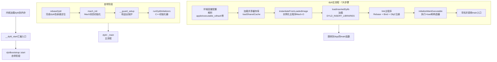

# dyld（动态链接器）完全解析

## 一、什么是dyld：原理与架构

dyld（the dynamic link editor）是苹果的动态链接器，是iOS/macOS系统中最重要的底层组件之一。它在系统内核完成程序的基础加载后接管控制权，负责将可执行文件及其依赖的动态库加载进内存并完成链接。

### 1. 为什么需要dyld？

在静态链接时代，所有库代码在编译时就被打包进可执行文件，导致：
- 每个程序都包含标准库的副本，浪费磁盘和内存空间
- 系统库更新需要重新编译所有依赖它的程序
- 插件机制难以实现

动态链接将链接过程推迟到运行时，由dyld完成，带来了三大好处：
1. **共享内存**：系统库（如UIKit、Foundation）在内存中只有一份副本，所有进程共享
2. **按需更新**：系统升级只需替换动态库文件，程序下次启动自动使用新版本
3. **插件机制**：运行时动态加载bundle，实现可扩展架构

### 2. dyld的特殊性：自举问题

dyld本身也是一个Mach-O动态库，但它面临一个"鸡生蛋"问题：普通动态库的重定位由dyld完成，那谁来完成dyld自身的重定位？

解决方案包含两条核心原则：
- **零依赖**：dyld不依赖任何其他共享对象
- **自举（Bootstrap）**：dyld启动时有一段特殊代码，不依赖全局变量和函数调用，仅凭自身完成重定位

```objective-c
// dyld的自举入口（汇编代码，arm64架构简化）
// 内核跳转到__dyld_start，这是dyld的第一行代码
__dyld_start:
    // 保存栈指针，准备调用dyldbootstrap::start
    mov x8, sp
    // ... 参数准备
    bl  dyldbootstrap::start  // 进入自举阶段
    // 自举完成后跳转到App的main函数
    br  x0
```

当`dyldbootstrap::start`执行完毕后，dyld才"站稳脚跟"，可以正常使用全局变量和调用函数，随后调用`dyld::_main`进入主流程。

### 3. dyld版本演进

| 版本             | 主要特性                                                                                    |
| :--------------- | :------------------------------------------------------------------------------------------ |
| dyld2            | 传统版本，每次启动需解析所有依赖图，加载较慢                                                |
| dyld3（iOS 13+） | 引入闭包（closure）缓存，将解析结果预计算并缓存，大幅提升启动速度；支持预预热（Prewarming） |

dyld3在启动时优先检查是否存在预计算的闭包缓存，若命中则跳过大量解析工作，直接进入链接阶段。

---

## 二、Mach-O文件格式：dyld的操作对象

要理解dyld，必须先了解它操作的文件格式——Mach-O。Mach-O是iOS/macOS上所有可执行文件、动态库、目标文件的格式。

### 1. Mach-O三大部分

```
+-------------------+
|     Mach-O Head   |  ← 文件类型、CPU架构、Load Command数量
+-------------------+
|  Load Commands    |  ← 描述内存布局、依赖库、入口地址
+-------------------+
|      Data         |  ← 实际代码和数据（__TEXT、__DATA等段）
+-------------------+
```

**Header**：包含魔数（magic）、CPU类型、文件类型（MH_EXECUTE可执行/MH_DYLIB动态库/MH_OBJECT目标文件）、Load Command数量等。

**Load Commands**：一张"目录表"，告诉dyld如何将文件加载到内存。关键命令包括：
- `LC_LOAD_DYLINKER`：指定由谁加载此文件（通常是`/usr/lib/dyld`）
- `LC_LOAD_DYLIB`：声明依赖的动态库路径
- `LC_LOAD_WEAK_DYLIB`：弱引用，找不到时设为NULL而非崩溃
- `LC_SEGMENT_64`：描述一个段（Segment）如何映射到内存
- `LC_MAIN`：程序入口函数地址

**Data**：实际的代码和数据，按段（Segment）组织。最常见的是：
- `__TEXT`：只读可执行代码和常量
- `__DATA`：可读写数据（全局变量、静态变量）
- `__LINKEDIT`：链接信息（符号表、重定位表）

### 2. 一个关键变量：__dso_handle

dyld源码中有一个神秘的变量`__dso_handle`，它在整个dyld代码库里只有声明没有定义：

```objective-c
// dyld/dyldMain.cpp
static const MachOAnalyzer* getDyldMH() {
    extern const MachOAnalyzer __dso_handle;
    return &__dso_handle;  // 返回dyld自身的Mach-O头
}
```

`__dso_handle`由静态链接器ld在链接时合成，指向dyld自身的Mach-O头，是C++ ABI规范的一部分，用于`__cxa_atexit`进行静态对象的析构管理。

---

## 三、dyld主流程：从_start到main

### 1. 完整流程图



### 2. 源码关键步骤解析

#### 2.1 汇编入口：__dyld_start

dyld的入口是汇编编写的`__dyld_start`函数，不同架构有不同实现，最终都调用`dyldbootstrap::start`：

```assembly
// arm64架构下的dyld入口（源码简化）
__dyld_start:
    // 保存栈指针
    mov x8, sp
    // 准备参数：app的mach_header, argc, argv等
    // 调用dyldbootstrap::start
    bl  __ZN13dyldbootstrap5startEPKN5dyld311MachOLoadedEiPPKcS3_Pm
    // start返回的是App的main函数地址，跳转过去
    br  x0
```

#### 2.2 自举：dyldbootstrap::start

这是dyld"自己加载自己"的阶段：

```cpp
uintptr_t start(const macho_header* appsMachHeader, int argc, const char* argv[],
                intptr_t slide, const macho_header* dyldsMachHeader,
                uintptr_t* startGlue) {
    // 1. 对dyld自身进行Rebase，修正ASLR偏移
    //    这一步之后dyld才能安全使用全局变量
    rebaseDyld(dyldsMachHeader, slide);
    
    // 2. Mach消息初始化，使dyld能与其他进程通信
    mach_init();
    
    // 3. 栈溢出保护初始化
    __guard_setup(apple);
    
    // 4. 运行dyld内部的C++静态构造器
    runDyldInitializers(argc, argv, envp, apple);
    
    // 5. 进入dyld的主流程
    return dyld::_main(appsMachHeader, appsSlide, argc, argv, 
                       envp, apple, startGlue);
}
```

#### 2.3 dyld::_main：核心加载流程

`dyld::_main`是dyld的核心函数，源码约500行，以下提炼主要步骤：

```cpp
uintptr_t _main(const macho_header* mainExecutableMH, uintptr_t mainExecutableSlide, 
                int argc, const char* argv[], const char* envp[], 
                const char* apple[], uintptr_t* startGlue) {
    
    // Step 1: 设置运行环境，解析apple数组中的关键信息
    // - executable_path: App可执行文件路径
    // - executable_cdhash: 代码签名哈希
    setContext(mainExecutableMH, argc, argv, envp, apple);
    sExecPath = _simple_getenv(apple, "executable_path");
    
    // Step 2: 加载共享缓存库
    // iOS将所有系统库预合成一个缓存文件，位于:
    // /System/Library/Caches/com.apple.dyld/
    // 包含UIKit、Foundation等，极大减少加载时间
    loadSharedCache();
    
    // Step 3: 实例化主程序 - 解析Mach-O并创建ImageLoader对象
    // 主程序永远是sAllImages列表的第一个
    sMainExecutable = instantiateFromLoadedImage(mainExecutableMH, 
                                                   mainExecutableSlide, 
                                                   sExecPath);
    addImage(sMainExecutable);
    
    // Step 4: 加载DYLD_INSERT_LIBRARIES中指定的插入库（用于调试/注入）
    loadInsertedDylibs();
    
    // Step 5: 链接主程序
    // - Rebase: 修正ASLR偏移
    // - Bind: 解析符号引用，填入真实地址
    // - 注册ObjC类、协议、方法到Runtime
    link(sMainExecutable, true, true, false);
    
    // Step 6: 初始化主程序
    // - 执行所有+load方法
    // - 执行__attribute__((constructor))函数
    // - 执行C++静态构造器
    initializeMainExecutable();
    
    // Step 7: 寻找并返回main函数地址
    // dyld返回后，汇编代码跳转到main执行
    result = sMainExecutable->getEntryFromLC_MAIN();
    return result;
}
```

#### 2.4 与ObjC Runtime的关联

dyld和ObjC Runtime的协作是启动的关键环节：

1. **dyld加载过程中**，调用`_dyld_objc_notify_register`注册三个回调函数：
   - `map_images`：当镜像（image）被加载时，Runtime注册其中的类、协议、分类
   - `load_images`：调用所有+load方法
   - `unmap_image`：镜像被卸载时的清理

2. **`_objc_init`** 在libSystem初始化过程中被调用，执行以下操作：
```cpp
void _objc_init(void) {
    environ_init();      // 读取环境变量
    tls_init();          // 线程局部存储初始化
    static_init();       // C++静态构造器
    runtime_init();      // Runtime核心数据结构初始化
    exception_init();    // 异常处理初始化
    cache_t::init();     // 方法缓存初始化
    
    // 注册dyld回调 - 这是关键的桥接点
    _dyld_objc_notify_register(&map_images, &load_images, &unmap_image);
}
```

3. **`map_images` → `_read_images`**：这是ObjC加载类的核心函数，负责：
   - 修复SEL（Selector）的唯一性
   - 读取所有类并注册到类表
   - 读取协议并注册
   - 读取分类（Category）并附加到主类
   - 处理非懒加载类（实现了+load的类）：调用`realizeClassWithoutSwift`实现类

---

## 四、类图与设计模式

### 1. 核心类图

```mermaid
classDiagram
    class ImageLoader {
        <<abstract>>
        +const mach_header* mh
        +uintptr_t slide
        +link(LinkContext)
        +doRebase(LinkContext)
        +doBind(LinkContext)
        +doInit(LinkContext)
        +instantiateMainExecutable()
    }
    
    class ImageLoaderMachO {
        +parseMachO()
        +rebase()
        +bind()
        +getEntryFromLC_MAIN()
        +getDependentLibraries()
    }
    
    class ImageLoaderMachOCompressed {
        +optimized binding
        +compressed dyld_info
    }
    
    class ImageLoaderMachOClassic {
        +traditional binding
        +symbol table based
    }
    
    class LinkContext {
        +sAllImages[]
        +sEnvVars[]
        +notifyMap()
        +notifyLoad()
    }
    
    ImageLoader <|-- ImageLoaderMachO
    ImageLoaderMachO <|-- ImageLoaderMachOCompressed
    ImageLoaderMachO <|-- ImageLoaderMachOClassic
    LinkContext --> ImageLoader : manages
    
    class dyld3::Closure {
        +precomputed binding info
        +cached symbol tables
        +launch cache
    }
    
    class dyld3::Loader {
        +load()
        +applyFixups()
    }
    
    dyld3::Closure --> dyld3::Loader
```

### 2. 关键设计模式

| 设计模式       | 应用场景                   | 说明                                                |
| :------------- | :------------------------- | :-------------------------------------------------- |
| **抽象工厂**   | ImageLoader的实例化        | 根据Mach-O格式版本（压缩/经典）创建不同的Loader子类 |
| **策略模式**   | Rebase/Bind实现            | 不同Mach-O格式（arm64/x86_64）使用不同的重定位策略  |
| **观察者模式** | _dyld_objc_notify_register | dyld加载镜像时通知ObjC Runtime处理类信息            |
| **单例模式**   | sAllImages全局列表         | 管理所有已加载镜像的全局状态                        |
| **责任链模式** | 依赖库递归加载             | 每个ImageLoader处理完自身后，递归处理依赖库         |

---

## 五、设计模式深度解析：关键环节的源码实现

### 1. 观察者模式：dyld与ObjC的桥接

`_dyld_objc_notify_register`是dyld对外提供的关键API，允许ObjC Runtime注册回调，在dyld加载镜像的关键时机被通知：

```cpp
// dyld中的实现（简化）
void _dyld_objc_notify_register(_dyld_objc_notify_mapped mapped,
                                _dyld_objc_notify_init init,
                                _dyld_objc_notify_unmapped unmapped) {
    // 保存回调函数指针
    gObjCMappedCallback = mapped;   // map_images
    gObjCInitCallback = init;       // load_images
    gObjCUnmappedCallback = unmapped; // unmap_image
    
    // 立即对已加载的镜像调用map回调
    for (auto image : sAllImages) {
        if (image->hasObjCInfo()) {
            gObjCMappedCallback(image->getMH(), image->getPath());
        }
    }
}
```

在ObjC Runtime端：

```cpp
// objc4源码中的_objc_init
void _objc_init(void) {
    // ... 初始化Runtime内部结构 ...
    
    // 注册三个回调给dyld
    _dyld_objc_notify_register(&map_images, &load_images, &unmap_image);
    
    // 此调用会触发dyld立即对所有已加载镜像调用map_images
    // 从而完成类的注册
}
```

这个设计巧妙地将"镜像加载"和"类注册"解耦，dyld不关心ObjC的具体实现，只负责在正确的时机通知。

### 2. 策略模式：Rebase与Bind

不同架构（arm64 vs x86_64）的Mach-O使用不同的重定位格式。dyld通过策略模式抽象差异：

```cpp
// 根据Mach-O格式选择不同的rebase/bind策略
void ImageLoaderMachO::rebase(const LinkContext& context) {
    if (usingDyldInfo()) {
        // 新格式：使用压缩的dyld_info命令
        // 包含rebase/bind/weak_bind/lazy_bind四合一信息
        rebaseWithDyldInfo(context);
    } else {
        // 旧格式：使用传统的LC_DYLD_INFO_ONLY
        rebaseWithClassic(context);
    }
}

// arm64使用更高效的压缩格式
void ImageLoaderMachOCompressed::rebase(const LinkContext& context) {
    // 直接操作dyld_info的字节流，逐一修正指针
    for (auto entry : rebaseChains) {
        uintptr_t* location = entry.location + context.slide;
        *location += context.slide;  // 加上ASLR偏移
    }
}
```

---

## 六、常见问题与排查方案

### 1. dyld: Library not loaded

这是最常见的dyld错误，意味着运行时找不到某个动态库。

**典型场景**：
```
dyld: Library not loaded: @rpath/Alamofire.framework/Alamofire
  Referenced from: /var/containers/Bundle/Application/.../MyApp.app/MyApp
  Reason: image not found
```

**根因**：动态库未正确嵌入App Bundle，或路径配置错误。

**解决方案**：
1. 在`General → Frameworks, Libraries, and Embedded Content`中将framework设为`Embed & Sign`
2. 检查`@rpath`配置是否正确
3. 清理DerivedData重试

### 2. 8badf00d（Watchdog超时）

当dyld阶段耗时超过系统允许的时间（约20秒），系统会杀死进程，异常码`8badf00d`（读作"ate bad food"）。

**排查**：设置环境变量`DYLD_PRINT_STATISTICS=1`，查看pre-main各阶段耗时：

```
Total pre-main time: 450.2 milliseconds (100.0%)
         dylib loading:  68.3 milliseconds (15.2%)
        rebase/binding: 102.8 milliseconds (22.8%)
            ObjC setup:  45.6 milliseconds (10.1%)
       initializers:   233.5 milliseconds (51.9%)
```

如果`initializers`占比过高，检查+load方法和C++构造器。

### 3. 0xdead10cc（死锁）

当App在挂起时持有文件锁或SQLite锁，系统会用`0xdead10cc`杀死进程。

**场景**：退后台时数据库事务未提交。

**解决**：在`applicationDidEnterBackground`中提交或回滚所有事务。

### 4. dyld自身崩溃：main_executable_path_missing

iOS 18上曾出现的系统级Bug，dyld在加载初期未能获取主程序路径。**临时的恢复手段是重启设备**。

### 5. 预预热（Prewarming）陷阱

iOS 15+的预预热机制可能在锁屏状态下执行pre-main代码。若`+load`或`__attribute__((constructor))`中访问了需要解锁的Keychain服务，会失败。

**解决**：将这类操作移到`application:didFinishLaunchingWithOptions:`中，因为预预热不会执行到此阶段。

---

## 七、优化方向与最佳实践

### 1. 减少动态库数量

苹果建议自定义动态库不超过6个。每个动态库增加dyld的加载和链接开销。**优先使用静态库**，或将多个动态库合并为一个。

```ruby
# Podfile优化示例
# 不推荐：多个动态framework
pod 'Alamofire'     # 动态库
pod 'SnapKit'       # 动态库
pod 'Kingfisher'    # 动态库

# 推荐：使用静态库（use_frameworks! :linkage => :static）
use_frameworks! :linkage => :static
```

### 2. 优化+load方法

`+load`在dyld阶段同步执行，是启动的大户。**将非关键逻辑迁移到`+initialize`或`didFinishLaunching`**：

```objective-c
// ❌ 不推荐：+load中做耗时操作
+ (void)load {
    [self initSDK];  // 阻塞启动
}

// ✅ 推荐：延迟到首次使用时
+ (void)initialize {
    static dispatch_once_t onceToken;
    dispatch_once(&onceToken, ^{
        [self initSDK];
    });
}
```

### 3. 二进制重排（Order File）

通过Clang插桩收集启动阶段的函数调用顺序，生成`.order`文件，让高频函数在二进制中连续排列，减少Page Fault。

**实施步骤**：
1. 使用`-order_file`编译选项指定顺序文件
2. 通过`otool`和`objdump`分析启动符号
3. 在`Build Settings → Order File`中配置

### 4. 精简main()到首屏

`application:didFinishLaunchingWithOptions:`中只做必须的初始化，非核心SDK延迟加载：

```objective-c
- (BOOL)application:(UIApplication *)app 
    didFinishLaunchingWithOptions:(NSDictionary *)opts {
    
    // 核心：必须立即执行的
    [self initCoreServices];
    
    // 非核心：异步延迟
    dispatch_async(dispatch_get_global_queue(0, 0), ^{
        [self initAnalytics];
        [self initAds];
    });
    
    return YES;
}
```

### 5. 使用dyld环境变量调试

在Xcode Scheme中添加环境变量定位问题：

| 环境变量                          | 作用                     |
| :-------------------------------- | :----------------------- |
| `DYLD_PRINT_STATISTICS=1`         | 输出pre-main各阶段耗时   |
| `DYLD_PRINT_STATISTICS_DETAILS=1` | 输出更详细的时序信息     |
| `DYLD_PRINT_LIBRARIES=1`          | 打印加载的每个动态库路径 |
| `DYLD_PRINT_APIS=1`               | 打印dyld API调用日志     |

---

## 总结

dyld作为iOS启动的"总指挥"，从自举、加载共享缓存、实例化主程序，到链接符号、执行初始化器，最后跳转到main函数，每一步都是精密设计的。理解dyld的原理和源码，不仅能帮助排查启动问题，更是做启动优化的基本功。优化的核心原则始终是：**减少加载量、延迟非必要工作、让主线程尽快进入首屏渲染**。