# iOS打包发布自动化终极指南：从Fastlane标准方案到Vault+Consul企业级证书管理（含全链路原理解析）

> 本文整合了从基础原理到企业级实践的完整知识体系，涵盖手动痛点、主流工具对比、标准CI/CD流程、xcodebuild底层编译链路，以及基于Shell+Vault+Consul Template的进阶证书管理方案。

---

## 目录

1. [为什么需要自动化打包发布（含统计学分析与时序图）](#一为什么需要自动化打包发布含统计学分析与时序图)
2. [主流自动化方案对比（含底层原理与技术栈拆解）](#二主流自动化方案对比含底层原理与技术栈拆解)
3. [自动化打包发布全流程解析（含编译链路与上传协议详解）](#三自动化打包发布全流程解析含编译链路与上传协议详解)
4. [CI/CD集成深度剖析（Runner执行模型与调度原理）](#四cicd集成深度剖析runner执行模型与调度原理)
5. [企业级进阶：Shell+Vault+Consul Template证书管理方案](#五企业级进阶级shellvaultconsul-template证书管理方案)
6. [多方案横向终极对比与选型决策树](#六多方案横向终极对比与选型决策树)
7. [总结与核心技术栈汇总](#七总结与核心技术栈汇总)

---

## 一、为什么需要自动化打包发布（含统计学分析与时序图）

### 1.1 手动流程痛点

传统的iOS手动打包发布流程通常包含：拉取最新代码 → 修改Build Number → 配置证书与描述文件 → 执行Xcode Archive → 导出IPA文件 → 上传TestFlight/App Store Connect → 通知测试团队。整个过程至少需要15-30分钟，且容易因证书配置错误（38%）、构建版本号冲突（24%）、环境参数设置错误（19%）等人为因素导致失败。

自动化打包发布的核心价值在于：**标准化流程、消除人为错误、提升效率、增强可追溯性**。

### 1.2 手动流程痛点时序图

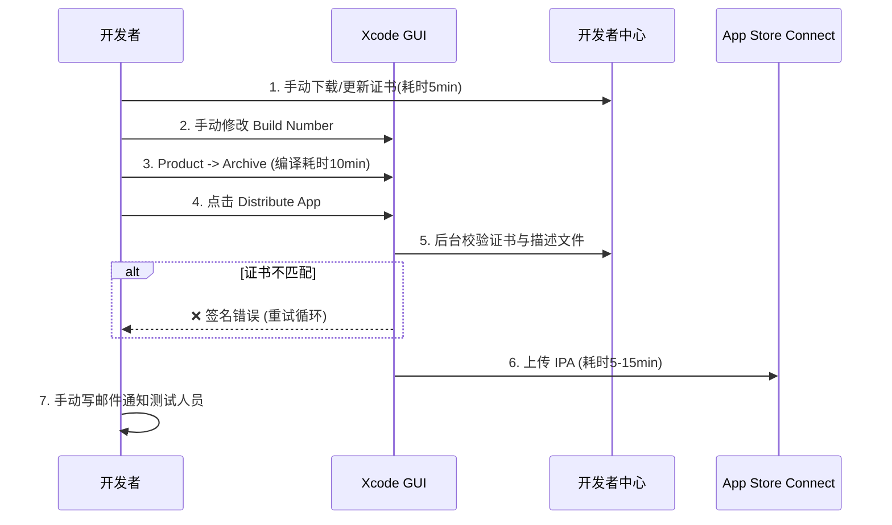

### 1.3 核心实现原理与技术

**原理（人为因素统计学）** ：手动操作依赖视觉校验和肌肉记忆。证书配置错误（38%）源于Xcode中`Code Signing Identity`与`Provisioning Profile`的匹配逻辑是隐式的（依赖UUID匹配），人类无法快速比对SHA-1哈希值。

**应用技术**：Apple的`codesign`底层工具链基于`/usr/bin/codesign`，它在验证时检查`_CodeSignature/CodeResources`中的散列值。自动化规避了人眼比对这一步。

---

## 二、主流自动化方案对比（含底层原理与技术栈拆解）

### 2.1 各工具底层机制流程图

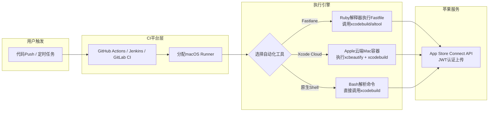

### 2.2 方案一：Fastlane（移动端自动化的事实标准）

Fastlane是iOS和Android自动化构建、签名、测试、截图、上传到应用商店的事实标准工具。它通过`Fastfile`定义自动化流程，包含构建、上传、测试等核心Action。

**核心组件**：
- `gym`：负责构建IPA
- `match`：管理证书和描述文件，确保团队使用统一证书
- `snapshot`：跨设备尺寸截图
- `pilot`：TestFlight分发
- `deliver`：App Store元数据管理

**特点**：
- 400+内置Action，1000+社区插件
- 与GitHub Actions、CircleCI、Jenkins等CI服务无缝集成
- 需在macOS环境运行（依赖Xcode）

### 2.3 方案二：Xcode Cloud（Apple原生方案）

Xcode Cloud是Apple内置在Xcode中的持续集成和交付服务，可在云端构建和测试应用，并分发到TestFlight或App Store。

**特点**：
- Apple原生，与Xcode深度集成
- 每月25小时免费计算时间
- 仅支持Apple生态，不支持Android
- 可通过Webhook扩展工作流

### 2.4 方案三：GitHub Actions

GitHub Actions提供灵活的CI能力，可通过调用`xcodebuild`完成自动化构建。

**特点**：
- 与GitHub仓库深度集成
- 灵活但需要手动配置签名和上传步骤
- iOS构建必须在macOS Runner上执行

### 2.5 方案四：Jenkins

老牌CI/CD工具，可通过Pipeline调用Fastlane或xcodebuild实现iOS自动化构建。

**特点**：
- 成熟稳定，插件生态丰富
- 可自托管，适合企业级场景
- 学习曲线较陡

### 2.6 其他CI平台

| 平台      | 特点                                              |
| --------- | ------------------------------------------------- |
| Bitrise   | 移动端专用CI/CD，GUI配置，云端托管                |
| GitLab CI | 与GitLab深度集成，支持Apple App Store Connect集成 |
| CircleCI  | 轻量灵活，支持macOS Runner                        |
| Codemagic | Flutter专用CI/CD                                  |

### 2.7 各方案底层原理与技术栈汇总表

| 方案               | 底层实现原理                                                                                                                                                                                    | 应用的核心技术/框架                                                                           |
| :----------------- | :---------------------------------------------------------------------------------------------------------------------------------------------------------------------------------------------- | :-------------------------------------------------------------------------------------------- |
| **Fastlane**       | 基于Ruby的DSL（领域特定语言）。运行时解析`Fastfile`生成抽象语法树(AST)，调用封装好的`action`（如`gym`、`pilot`）。`gym`本质是对`xcodebuild`的包装，`pilot`是对`Transporter`（Java进程）的封装。 | Ruby、`xcodebuild`、`altool`、`spaceship`（与苹果API交互的Ruby库）、JWT（JSON Web Token）     |
| **Xcode Cloud**    | 苹果托管的Mac mini集群。通过`ci.xcodeproj`定义工作流，底层使用`xcodebuild`的`-showBuildTimingSummary`和`-enableCodeCoverage`等增强参数。构建环境预装了所有Apple SDK。                           | Swift、Xcode Build System、CloudKit同步、Webhook (HTTP/2)                                     |
| **GitHub Actions** | 基于虚拟化（macOS Runner使用Apple虚拟化框架或VMware）。`actions/checkout`拉取代码，`ruby/setup-ruby`安装依赖。核心构建依然依赖宿主机的`xcodebuild`命令。                                        | YAML解析器、`runner`程序（Go语言编写）、容器化（虽然macOS不支持Docker，但支持Orka等虚拟化层） |
| **Jenkins**        | 基于Java的Servlet容器。通过插件机制（如`Xcode Plugin`）将用户界面配置转换为`xcodebuild` shell命令在Slave节点执行。Pipeline基于Groovy脚本。                                                      | Java、Groovy、Remoting协议（主从通信）                                                        |

---

## 三、自动化打包发布全流程解析（含编译链路与上传协议详解）

### 阶段一：前置准备——证书与描述文件

#### 3.1.1 证书类型

- **开发证书（iOS Development）** ：用于应用调试阶段的代码签名
- **发布证书（iOS Distribution）** ：用于App Store上架或企业内部分发
- **企业证书（Enterprise Certificate）** ：用于企业内部应用分发

#### 3.1.2 证书签名原理流程图

```mermaid
flowchart TB
    subgraph 密钥对生成
        A[OpenSSL生成RSA密钥对] --> B[CSR证书签名请求<br>包含公钥+开发者信息]
        B --> C[上传至Apple Developer Portal]
        C --> D[Apple根证书签发<br>返回 .cer 证书]
    end

    subgraph 本地签名过程
        D --> E[将 .cer + 私钥 导出为 .p12]
        E --> F[导入本地钥匙串<br>security import]
        F --> G[Xcode构建时<br>codesign -s "证书指纹" app.app]
        G --> H[生成 _CodeSignature 文件夹<br>包含所有文件的散列值]
    end

    subgraph 描述文件验证
        I[创建 App ID + 设备UDID列表] --> J[生成 .mobileprovision]
        J --> K[嵌入 app 包内<br>embedded.mobileprovision]
        K --> L[App启动时系统验证<br>证书链 + 设备白名单]
    end
```

#### 3.1.3 自动化证书管理方案

**方案一：Fastlane Match（推荐团队使用）**

Match将加密的签名证书和描述文件存储在私有Git仓库中，确保每个团队成员和CI机器使用相同的凭证。执行`fastlane match development`可自动同步证书，将新成员环境配置时间从4小时缩短至15分钟。

```ruby
# Matchfile配置示例
git_url("git@github.com:team/certificates.git")
storage_mode("git")
type("appstore")
app_identifier(["com.example.myapp"])
```

**原理实现**：
1. 利用`openssl aes-256-cbc`加密证书文件。
2. 存于Git仓库。`match`运行时解密到临时目录，调用`security import`导入钥匙串。
3. **关键技术**：环境变量`MATCH_PASSWORD`用于对称加密，`GIT_URL`指定存储库。

**方案二：CI Secrets存储**

将证书导出为P12格式，Base64编码后存储在CI平台的Secrets中。适用于个人项目或小型团队。

**原理**：将二进制`.p12`通过`base64`转码为ASCII字符串，存于CI平台的K/V存储中（如GitHub的`encrypted secrets`）。构建时`echo $BASE64_P12 | base64 -d > cert.p12`还原。**关键技术**：AES-256-GCM（CI平台静态加密）、Base64编码。

**方案三：AppUploader（跨平台方案）**

在Windows、Linux乃至macOS上直接创建开发证书与发布证书，生成可复用的P12文件。

### 阶段二：构建与打包

#### 3.2.1 Xcode工程配置

构建App Store分发版本需使用Release Scheme：

1. Product → Scheme → Edit Scheme
2. 选择Run tab，将Build Configuration设为Release

#### 3.2.2 构建编译链路流程图

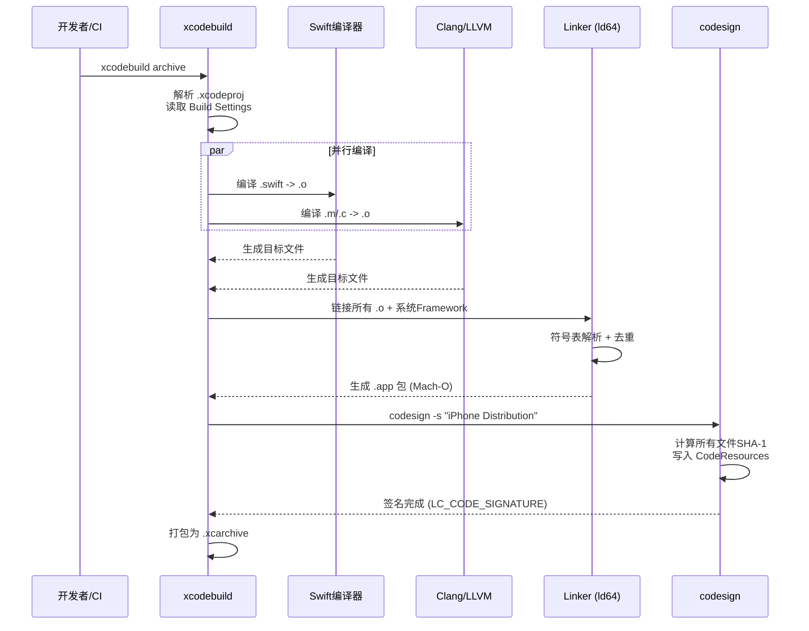

#### 3.2.3 命令行构建（自动化基础）

```bash
# Archive构建
xcodebuild -workspace YourApp.xcworkspace \
  -scheme YourApp \
  -configuration Release \
  -archivePath build/YourApp.xcarchive \
  archive

# 导出IPA
xcodebuild -exportArchive \
  -archivePath build/YourApp.xcarchive \
  -exportOptionsPlist ExportOptions.plist \
  -exportPath build/IPA
```

其中`ExportOptions.plist`需配置导出方式（`method`）、团队ID等。

#### 3.2.4 关键技术参数解释

- **`-configuration Release`**：启用`SWIFT_OPTIMIZATION_LEVEL = -O`（全模块优化），并预置`-DNDEBUG`宏。
- **`-archivePath`**：将生成的`.app`、`.dSYM`符号表、`Info.plist`打包成`.xcarchive`（本质是一个文件夹结构）。
- **导出IPA (`-exportArchive`)**：读取`ExportOptions.plist`中的`method`（app-store/ad-hoc/development），调用`/usr/bin/xcodebuild -exportArchive`，内部调用`/Applications/Xcode.app/Contents/SharedFrameworks/ContentDeliveryServices.framework`（Transporter组件）压缩为`.ipa`（本质是Zip压缩包，Payload目录下存放.app）。

#### 3.2.5 Fastlane构建配置

```ruby
# Fastfile示例
platform :ios do
  lane :build_dev do
    increment_build_number(
      build_number: latest_testflight_build_number + 1
    )
    build_app(
      scheme: "MyApp_Dev",
      export_method: "development",
      output_directory: "./builds/dev"
    )
    upload_to_testflight
  end

  lane :release_prod do
    match(type: "appstore")
    build_app(
      scheme: "MyApp_Prod",
      export_method: "app-store"
    )
    upload_to_app_store(force: true, submit_for_review: false)
  end
end
```

### 阶段三：分发与发布

#### 3.3.1 App Store Connect 上传协议图

```mermaid
flowchart TB
    A[生成 IPA] --> B[选择上传工具]
    B --> C[Fastlane pilot / deliver]
    B --> D[asc CLI (官方)]
    B --> E[Xcode Transporter]
    
    subgraph 传输核心逻辑
        C --> F[生成 JWT Token<br>使用 App Store Connect API Key]
        D --> F
        E --> G[使用 Apple ID 账号密码<br>+ 双重验证 Session]
    end
    
    F --> H[REST API over HTTPS<br>multipart/form-data 分片上传]
    G --> H
    
    H --> I[Apple 服务端预处理]
    I --> J{验签 & 资产检查}
    J -->|成功| K[TestFlight 构建队列]
    J -->|失败| L[返回 JSON 错误码<br>如 ITMS-90078]
```

#### 3.3.2 TestFlight Beta分发

TestFlight是Apple官方Beta测试平台，支持内部和外部测试员分发。

**自动化方式**：

1. **Fastlane pilot**：`upload_to_testflight`一键上传
2. **App Store Connect API**：通过REST API实现构建上传和测试员管理
3. **asc CLI**：`asc publish testflight --app APP_ID --ipa app.ipa`

#### 3.3.3 App Store正式发布

**Fastlane方式**：
```ruby
upload_to_app_store(
  force: true,
  submit_for_review: true,
  skip_metadata: false,
  skip_screenshots: false
)
```

**asc CLI方式**：
```bash
asc publish appstore --app "123456789" --ipa "/path/to/MyApp.ipa" --version "1.2.3" --submit --confirm
```

#### 3.3.4 企业内部分发（Ad Hoc/In-house）

通过Ad Hoc或Enterprise证书打包，生成IPA后可通过OTA（Over-The-Air）方式分发。

#### 3.3.5 关键技术细节

- **App Store Connect API Key 认证原理**：采用**JWT (JSON Web Token)** + **Elliptic Curve (ES256)** 签名。私钥由Apple Developer Portal生成，公钥存于Apple服务器。每次请求Header中带`Authorization: Bearer [JWT]`。
- **asc CLI 原理**：是用Swift编写的开源命令行工具，直接调用Apple的`/Applications/Xcode.app/Contents/SharedFrameworks/ContentDeliveryServices.framework`的私有API，比`xcodebuild`更轻量。
- **分片上传（Chunked Upload）**：大IPA被分割为2MB-5MB的碎片，使用`Content-Range`头实现断点续传，抗网络波动。

### 阶段四：元数据与审核

#### 3.4.1 元数据提交原理

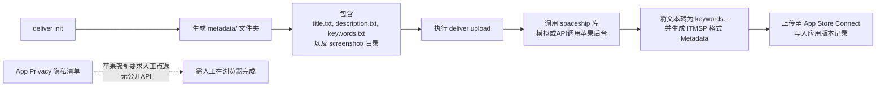

App Store Connect元数据（应用名称、描述、关键词、截图、定价、内容评级等）可通过Fastlane的`deliver`或`asc` CLI实现自动化管理。

需要注意的是，App Privacy数据使用声明目前不在公开API中，需人工在浏览器中完成。

#### 3.4.2 技术限制说明

- **ITMSP (iTunes Transporter Metadata Package)**：本质是一个`.itmsp`文件夹，包含`metadata.xml`和资产文件。Apple官方推荐的`iTMSTransporter`工具已逐渐弃用，现主流是Fastlane通过`spaceship`库直接调用GraphQL风格的内部API。
- **隐私清单（Privacy Manifest）**：目前必须在App Store Connect网页端手动点选，未开放REST API，这也是全自动化“最后100米”的绊脚石。

---

## 四、CI/CD集成深度剖析（Runner执行模型与调度原理）

### 4.1 CI 触发与执行链路图

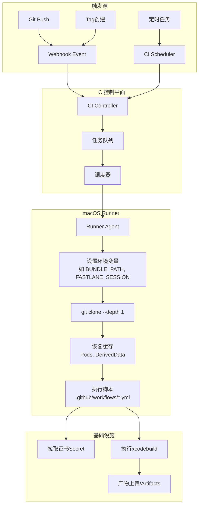

### 4.2 GitHub Actions + Fastlane

```yaml
# .github/workflows/deploy.yml
name: Deploy to TestFlight
on:
  push:
    tags:
      - '*'
jobs:
  deploy:
    runs-on: macos-latest
    steps:
      - uses: actions/checkout@v3
      - name: Setup Ruby
        uses: ruby/setup-ruby@v1
        with: { ruby-version: '3.0' }
      - name: Install Fastlane
        run: bundle install
      - name: Deploy to TestFlight
        env:
          APP_STORE_CONNECT_API_KEY: ${{ secrets.APP_STORE_CONNECT_API_KEY }}
          APP_STORE_CONNECT_API_KEY_ID: ${{ secrets.APP_STORE_CONNECT_API_KEY_ID }}
          APP_STORE_CONNECT_ISSUER_ID: ${{ secrets.APP_STORE_CONNECT_ISSUER_ID }}
        run: bundle exec fastlane ios beta
```

**底层技术实现**：`runs-on: macos-latest`指定Apple Silicon虚拟机。Runner进程（`actions/runner`）监听GitHub的`api.github.com`轮询或WebSocket，拉取作业，在隔离的环境中执行YAML步骤。每个步骤是独立的子进程，环境变量通过`GITHUB_ENV`文件持久化。

### 4.3 GitLab CI + Fastlane

iOS作业必须运行在macOS Runner上。GitLab Mobile DevOps提供了构建、签名和分发iOS应用的完整流水线模板。

**底层技术实现**：使用`gitlab-runner`（Go语言实现）。注册时关联`token`，执行器（Executor）选择`macos`时，利用`shell`执行器直接在宿主机运行。支持`environment: testflight`部署策略，用于回滚。

### 4.4 Jenkins Pipeline

```groovy
// Jenkinsfile
pipeline {
  agent { label 'macos' }
  stages {
    stage('Build') {
      steps {
        sh 'bundle exec fastlane ios build'
      }
    }
    stage('Deploy') {
      steps {
        sh 'bundle exec fastlane ios deploy'
      }
    }
  }
}
```

**底层技术实现**：主节点(Master)将`Jenkinsfile`声明式语法转换为Groovy CPS（Continuation Passing Style）字节码，分发至Agent节点。Agent节点通过Remoting协议（基于Netty）接收命令流，通过`ProcessBuilder`在操作系统层启动Shell进程。

---

## 五、企业级进阶：Shell+Vault+Consul Template证书管理方案

> 本部分基于前序讨论的高级方案展开，实现“管理员通过Shell脚本将证书Base64存入Vault，团队通过Consul Template动态注入环境变量”的完整体系。

### 5.1 方案概述与架构原理

#### 5.1.1 核心设计理念
- **集中化存储**：所有证书（.p12）和描述文件（.mobileprovision）不落地存储，统一保存在HashiCorp Vault中。
- **动态注入**：构建时通过Consul Template将证书从Vault拉取并渲染为环境变量，而非静态写入文件。
- **权限隔离**：利用Vault Policy实现开发、测试、生产环境的精细化权限控制。
- **极简模板**：Consul Template模板保持简洁（仅需几行逻辑），复杂路由通过环境变量或路径约定实现。

#### 5.1.2 整体架构流程图

```mermaid
flowchart TB
    subgraph Admin[管理员操作区]
        A1[生成 .p12 证书<br>与 .mobileprovision]
        A2[执行上传脚本<br>upload_cert.sh]
        A3[Base64编码二进制文件]
        A4[Vault CLI 写入 KV 存储]
    end

    subgraph Vault[HashiCorp Vault 服务端]
        V1[(KV Secrets Engine<br>路径: secret/ios/certs/<br>{project}/{flavor}/)]
        V2[访问控制策略<br>Policy ACLs]
        V3[审计日志<br>Audit Logs]
    end

    subgraph Client[团队人员 / CI 构建环境]
        C1[Vault Login 认证<br>LDAP/Token/AppRole]
        C2[启动 Consul Template<br>consul-template -config]
        C3[模板读取 Vault Secret<br>动态渲染 export 命令]
        C4[解码 Base64 还原文件<br>或直接使用环境变量]
        C5[Xcode 构建系统<br>钥匙串导入 / Archive]
    end

    A2 --> A3 --> A4 --> V1
    V1 <--> V2
    V1 --> V3
    
    C1 -->|获取临时 Token| C2
    C2 -->|查询| V1
    V1 -->|返回 Base64 数据| C3
    C3 --> C4 --> C5
    
    style A1 fill:#f9f,stroke:#333,stroke-width:2px
    style V1 fill:#bbf,stroke:#333,stroke-width:2px
    style C5 fill:#bfb,stroke:#333,stroke-width:2px
```

#### 5.1.3 关键技术原理解释

| 技术组件            | 在此方案中的作用                                                                                                           | 核心原理                                                          |
| :------------------ | :------------------------------------------------------------------------------------------------------------------------- | :---------------------------------------------------------------- |
| **Base64 编码**     | 将二进制的 `.p12` 和 `.mobileprovision` 转换为纯文本字符串，便于在 JSON/环境变量中安全传输，避免二进制破坏终端或YAML解析。 | `openssl base64 -A` 生成单行无换行字符串。                        |
| **Vault KV v2**     | 存储证书的键值对，支持版本管理（每次覆盖生成新版本），便于证书轮换和回滚。                                                 | `/secret/data/` 路径下实际存储 metadata 和 data 字段。            |
| **Consul Template** | 守护进程或一次性任务，周期性或按需从 Vault 拉取机密，渲染 Go Template 文件，并执行回调命令（如 `source`）。                | 通过 Token 鉴权，模板中使用 `{{ with secret "path" }}` 获取数据。 |
| **环境变量注入**    | Xcode 构建时从 `$DISTRIBUTION_P12_BASE64` 等变量读取证书，无需在代码仓库中保存任何敏感文件。                               | Shell 脚本中 `export`，子进程（xcodebuild）继承。                 |

### 5.2 详细实施步骤与流程图

#### 步骤 1：管理员上传证书到 Vault

管理员负责原始证书的生成与上传。此步骤保证证书二进制内容被转码并安全存入中央保险库。

**1.1 流程图**

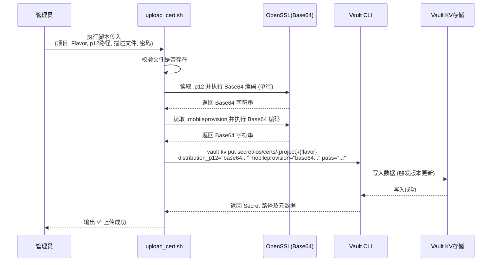

**1.2 核心脚本与原理说明**

```bash
#!/bin/bash
# upload_cert.sh - 管理员上传证书到Vault
# 用法: ./upload_cert.sh <project> <flavor> <p12_path> <mobileprovision_path> <p12_password>

set -e

PROJECT="$1"
FLAVOR="$2"
P12_PATH="$3"
MOBILEPROVISION_PATH="$4"
P12_PASS="$5"

# Vault配置
VAULT_ADDR="${VAULT_ADDR:-https://vault.example.com:8200}"
VAULT_TOKEN="${VAULT_TOKEN:-}"  # 管理员token，建议从环境变量读取
SECRET_PATH="secret/ios/certs/${PROJECT}/${FLAVOR}"

# 检查依赖
command -v vault >/dev/null 2>&1 || { echo "错误: vault命令未找到"; exit 1; }
command -v openssl >/dev/null 2>&1 || { echo "错误: openssl命令未找到"; exit 1; }

# 检查文件是否存在
[ -f "$P12_PATH" ] || { echo "错误: 证书文件不存在: $P12_PATH"; exit 1; }
[ -f "$MOBILEPROVISION_PATH" ] || { echo "错误: 描述文件不存在: $MOBILEPROVISION_PATH"; exit 1; }

echo "正在上传证书到Vault: $SECRET_PATH"

# 将p12二进制文件Base64编码后写入Vault
# 使用 $(openssl base64 -A -in) 生成单行Base64字符串
vault kv put "$SECRET_PATH" \
    distribution_p12="$(openssl base64 -A -in "$P12_PATH")" \
    distribution_p12_pass="$P12_PASS" \
    mobileprovision="$(openssl base64 -A -in "$MOBILEPROVISION_PATH")" \
    updated_at="$(date -u +"%Y-%m-%dT%H:%M:%SZ")" \
    uploaded_by="${USER:-admin}"

echo "✅ 证书上传成功！"
echo "路径: $SECRET_PATH"
```

**使用示例**：

```bash
# 上传生产环境证书
export VAULT_ADDR="https://vault.company.com:8200"
export VAULT_TOKEN="hvs.xxxxx"  # 管理员token

./upload_cert.sh MyApp production \
    ./certs/distribution.p12 \
    ./certs/appstore.mobileprovision \
    "MyPassword123"
```

#### 步骤 2：Vault 权限策略配置（最小权限原则）

为了保证多环境隔离（如 dev 人员不能碰 production 证书），需要配置细粒度的 ACL 策略。

**2.1 流程图**

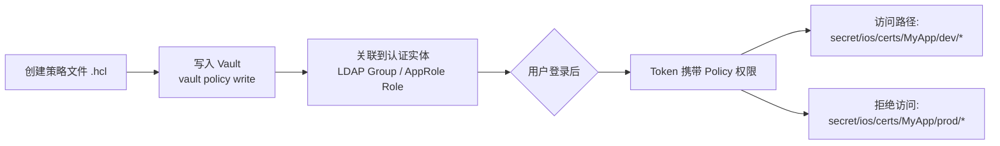

**2.2 策略示例与原理**

**策略文件 `ios_dev_policy.hcl`**：
```hcl
# 开发人员只能读取 dev 和 staging，不能读写 production
path "secret/ios/certs/MyApp/development/*" {
  capabilities = ["read", "list"]
}
path "secret/ios/certs/MyApp/staging/*" {
  capabilities = ["read", "list"]
}
path "secret/ios/certs/MyApp/production/*" {
  capabilities = ["deny"]  # 显式拒绝，安全兜底
}
```

**原理**：Vault 在 Token 生成时会合并所有关联策略，执行**白名单+黑名单**逻辑，最终决定是否允许 `list` 或 `read` 操作。

#### 步骤 3：团队人员获取证书（Consul Template 本地注入）

开发者或 CI Runner 不应该直接调用 Vault API 写复杂的解析逻辑，而是通过 Consul Template 一键拉取并 `source`。

**3.1 交互流程图**

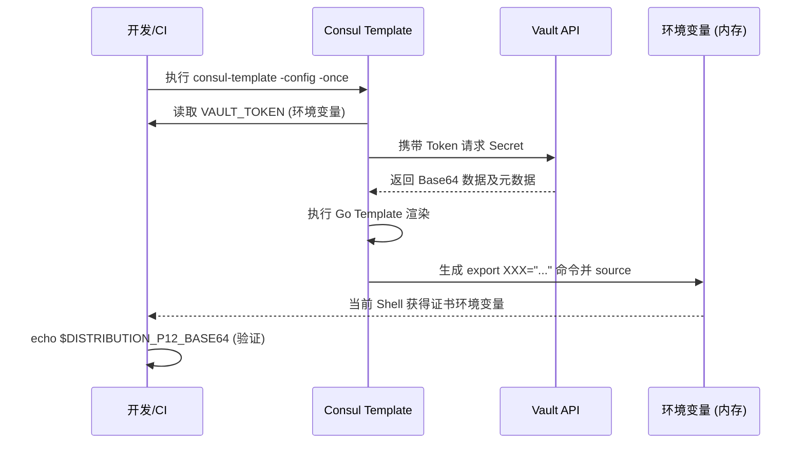

**3.2 极简 Consul Template 配置（`config.hcl`）**

```hcl
# config.hcl - Consul Template配置
vault {
  address = "https://vault.company.com:8200"
  # token从环境变量 VAULT_TOKEN 读取，不硬编码
  renew_token = true
}

template {
  # 模板文件路径
  source = "/path/to/cert_env.ctmpl"
  # 渲染后的输出文件（包含export命令）
  destination = "/tmp/cert_env.sh"
  # 渲染后执行的命令：source环境变量
  command = "bash -c 'source /tmp/cert_env.sh && echo \"✅ 证书环境变量已加载\"'"
  # 命令超时
  command_timeout = "30s"
}
```

**3.3 核心模板 `cert_env.ctmpl`（极其简洁）**

```gotemplate
{{- /* 动态构建路径，支持多项目多Flavor */ -}}
{{- $flavor := env "CERT_FLAVOR" | default "development" -}}
{{- $path := printf "secret/ios/certs/MyApp/%s" $flavor -}}

{{- with secret $path -}}
export DISTRIBUTION_P12_BASE64="{{ .Data.data.distribution_p12 }}"
export DISTRIBUTION_P12_PASS="{{ .Data.data.distribution_p12_pass }}"
export MOBILEPROVISION_BASE64="{{ .Data.data.mobileprovision }}"
export CURRENT_FLAVOR="{{ $flavor }}"
export CERT_LOADED_AT="{{ now | date "2006-01-02T15:04:05Z" }}"
{{- else -}}
echo "⚠️  错误：未找到路径 {{ $path }} 的证书" >&2
exit 1
{{- end -}}
```

**原理**：`env "CERT_FLAVOR"` 读取外部环境变量，实现动态路由。整个模板无复杂逻辑，仅 10 行左右，符合“模板简洁”的需求。

**3.4 团队人员使用流程**

```bash
# 1. 认证Vault（方式一：LDAP/用户名密码）
vault login -method=ldap username=zhangsan

# 2. 设置Vault Token环境变量（Consul Template会自动读取）
export VAULT_TOKEN=$(vault print token)

# 3. 启动Consul Template拉取证书
consul-template -config config.hcl -once

# 4. 此时证书已作为环境变量加载，可用于Xcode构建
# 如果需要p12文件，可解码还原：
echo "$DISTRIBUTION_P12_BASE64" | base64 -d > /tmp/cert.p12
```

**3.5 一键脚本：团队人员获取证书**

```bash
#!/bin/bash
# fetch_cert.sh - 团队成员获取证书
# 用法: ./fetch_cert.sh <project> <flavor>

set -e

PROJECT="${1:-MyApp}"
FLAVOR="${2:-development}"
VAULT_ADDR="${VAULT_ADDR:-https://vault.company.com:8200}"
VAULT_TOKEN="${VAULT_TOKEN:-}"

# 检查认证
if [ -z "$VAULT_TOKEN" ]; then
    echo "请先执行 vault login 获取token"
    exit 1
fi

# 创建临时Consul Template配置
cat > /tmp/consul_template_config.hcl <<EOF
vault {
  address = "$VAULT_ADDR"
  renew_token = true
}

template {
  source = "/tmp/cert_env.ctmpl"
  destination = "/tmp/cert_env.sh"
  command = "bash -c 'source /tmp/cert_env.sh && echo \"✅ 证书已加载\"'"
  command_timeout = "30s"
}
EOF

# 生成动态模板
cat > /tmp/cert_env.ctmpl <<EOF
{{- with secret "secret/ios/certs/${PROJECT}/${FLAVOR}" -}}
export DISTRIBUTION_P12_BASE64="{{ .Data.data.distribution_p12 }}"
export DISTRIBUTION_P12_PASS="{{ .Data.data.distribution_p12_pass }}"
export MOBILEPROVISION_BASE64="{{ .Data.data.mobileprovision }}"
export CERT_FLAVOR="${FLAVOR}"
export CERT_PROJECT="${PROJECT}"
export CERT_LOADED_AT="{{ now | date "2006-01-02T15:04:05Z" }}"
{{- end -}}
EOF

# 执行渲染
consul-template -config /tmp/consul_template_config.hcl -once

# 清理
rm -f /tmp/consul_template_config.hcl /tmp/cert_env.ctmpl

echo "✅ 证书环境变量已就绪"
echo "   FLAVOR: $CERT_FLAVOR"
echo "   证书密码: $DISTRIBUTION_P12_PASS"
```

### 5.3 多 Flavor 支持：Consul 插件动态路由

#### 5.3.1 路径约定

```
secret/ios/certs/{PROJECT}/{FLAVOR}/
```

其中`FLAVOR`可以是：`development`、`staging`、`production`、`enterprise`等。

#### 5.3.2 多Flavor动态路由原理图

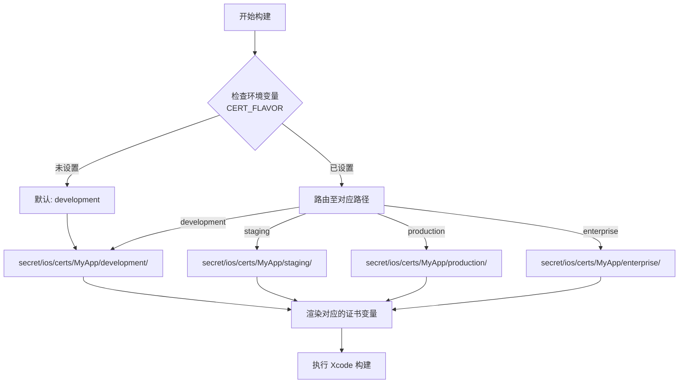

#### 5.3.3 多Flavor使用示例

```bash
# 开发环境
export CERT_FLAVOR=development
consul-template -config config.hcl -once

# 生产环境（仅发布管理员有权限）
export CERT_FLAVOR=production
export VAULT_TOKEN=$(vault login -method=ldap -token-only)
consul-template -config config.hcl -once
```

### 5.4 Xcode 构建集成（钥匙串与签名）

拿到 Base64 环境变量后，构建脚本需将其还原为二进制文件并导入钥匙串，供 `xcodebuild` 使用。

#### 5.4.1 构建阶段详细流程图

```mermaid
flowchart TB
    subgraph Prepare[准备阶段]
        P1[consul-template -once<br>获取 Base64 环境变量]
        P2[echo Base64 | base64 -d > /tmp/cert.p12]
        P3[echo Base64 | base64 -d > /tmp/profile.mobileprovision]
    end

    subgraph Keychain[钥匙串配置]
        K1[security create-keychain -p temp<br>/tmp/build.keychain]
        K2[security import /tmp/cert.p12<br>-k keychain -P "$PASS" -A]
        K3[security default-keychain -s<br>/tmp/build.keychain]
        K4[security unlock-keychain -p temp<br>/tmp/build.keychain]
    end

    subgraph Build[构建与导出]
        B1[xcodebuild archive<br>-scheme App_${FLAVOR}]
        B2[xcodebuild -exportArchive<br>-exportOptionsPlist Export_${FLAVOR}.plist]
        B3[生成 IPA]
    end

    subgraph Clean[清理]
        C1[security delete-keychain<br>/tmp/build.keychain]
        C2[rm -f /tmp/cert.p12<br>/tmp/profile.mobileprovision]
    end

    P1 --> P2 --> P3
    P3 --> K1 --> K2 --> K3 --> K4
    K4 --> B1 --> B2 --> B3
    B3 --> C1 --> C2
```

#### 5.4.2 构建脚本中使用环境变量

```bash
#!/bin/bash
# build.sh - 使用Vault证书进行iOS构建

set -e

# 1. 加载证书环境变量
export VAULT_ADDR="${VAULT_ADDR:-https://vault.company.com:8200}"
export CERT_FLAVOR="${BUILD_FLAVOR:-development}"

# 2. 通过Consul Template获取证书
consul-template -config /path/to/config.hcl -once

# 3. 解码证书为临时文件
echo "$DISTRIBUTION_P12_BASE64" | base64 -d > /tmp/cert.p12
echo "$MOBILEPROVISION_BASE64" | base64 -d > /tmp/profile.mobileprovision

# 4. 导入到钥匙串（CI环境）
security create-keychain -p temp_keychain /tmp/build.keychain
security import /tmp/cert.p12 -k /tmp/build.keychain -P "$DISTRIBUTION_P12_PASS" -A
security default-keychain -s /tmp/build.keychain

# 5. 执行Xcode构建
xcodebuild -workspace MyApp.xcworkspace \
    -scheme "MyApp_${CERT_FLAVOR}" \
    -configuration Release \
    -archivePath build/MyApp.xcarchive \
    archive

# 6. 导出IPA
xcodebuild -exportArchive \
    -archivePath build/MyApp.xcarchive \
    -exportOptionsPlist "ExportOptions_${CERT_FLAVOR}.plist" \
    -exportPath build/IPA

echo "✅ 构建完成: build/IPA/MyApp.ipa"
```

#### 5.4.3 关键原理解释
- **临时钥匙串隔离**：CI 环境不应污染系统默认钥匙串（Login.keychain）。创建临时钥匙串并在构建后销毁，保证安全。
- **`-A` 参数**：允许所有应用程序访问该证书（在 CI 无交互环境下必需）。
- **ExportOptions.plist 动态化**：可根据 `$CERT_FLAVOR` 动态生成，包含对应的 Bundle ID 和 Provisioning Profile 名称。

#### 5.4.4 Fastlane集成（可选）

如果团队已使用Fastlane，可通过环境变量传递证书：

```ruby
# Fastfile
lane :build do |options|
  flavor = options[:flavor] || "development"
  
  # 从环境变量读取证书
  p12_base64 = ENV["DISTRIBUTION_P12_BASE64"]
  p12_pass = ENV["DISTRIBUTION_P12_PASS"]
  mobileprovision_base64 = ENV["MOBILEPROVISION_BASE64"]
  
  # 解码证书
  File.write("/tmp/cert.p12", Base64.decode64(p12_base64))
  File.write("/tmp/profile.mobileprovision", Base64.decode64(mobileprovision_base64))
  
  # 使用证书构建
  gym(
    scheme: "MyApp_#{flavor}",
    export_method: flavor == "production" ? "app-store" : "development",
    export_options: {
      provisioningProfiles: {
        "com.example.myapp" => "MyApp_#{flavor}_profile"
      }
    }
  )
end
```

### 5.5 安全与运维建议

#### 5.5.1 Vault安全配置

| 配置项    | 建议                                                 |
| --------- | ---------------------------------------------------- |
| 认证方式  | 生产环境使用LDAP/OIDC集成企业SSO，CI使用AppRole      |
| Token TTL | 设置合理的Token有效期，CI Token建议短时效（如1小时） |
| 审计日志  | 开启Vault Audit Device，记录所有证书访问             |
| 传输加密  | 强制使用TLS，配置`VAULT_CACERT`                      |

#### 5.5.2 Consul Template最佳实践

| 实践                | 说明                                     |
| ------------------- | ---------------------------------------- |
| Token从环境变量读取 | 不在配置文件中硬编码token                |
| 使用`-once`模式     | CI环境一次性拉取，避免常驻进程           |
| 模板错误处理        | 使用`{{- else -}}`处理Secret不存在的情况 |
| 敏感信息不落盘      | 证书解码后直接使用内存或临时钥匙串       |

#### 5.5.3 证书轮换流程

```bash
# 1. 管理员生成新证书
# 2. 上传到Vault（覆盖同一路径，KV v2会生成新版本）
./upload_cert.sh MyApp production ./new_cert.p12 ./new_profile.mobileprovision "NewPass"

# 3. 团队成员/CI下次拉取自动获得新证书
consul-template -config config.hcl -once
```

#### 5.5.4 故障排查

```bash
# 验证Vault中证书是否存在
vault kv get secret/ios/certs/MyApp/development

# 查看特定字段（Base64格式）
vault kv get -field=distribution_p12 secret/ios/certs/MyApp/development

# 手动解码验证
vault kv get -field=distribution_p12 secret/ios/certs/MyApp/development | base64 -d > /tmp/test.p12
file /tmp/test.p12  # 应显示 "PKCS#12 data"
```

---

## 六、多方案横向终极对比与选型决策树

为了全面评估本方案（Vault + Consul Template）与业界常见的其他6种iOS证书管理/发布方案，下表进行全方位对比。

### 6.1 综合对比矩阵

| 对比维度             | **本方案 (Vault+Consul Template)**                            | **Fastlane Match**                                     | **CI 内置 Secret (GitHub/Azure)**                    | **Xcode Cloud**                             | **手动管理 (Xcode GUI)**             | **Jenkins Credentials**                 |
| :------------------- | :------------------------------------------------------------ | :----------------------------------------------------- | :--------------------------------------------------- | :------------------------------------------ | :----------------------------------- | :-------------------------------------- |
| **核心机制**         | Shell Base64编码 + Vault存储 + Consul动态注入环境变量         | 加密证书存于Git仓库，通过Fastlane同步                  | 证书Base64字符串存于CI平台的Secrets变量中            | Apple云端构建，自动处理签名（需要上传证书） | 开发者本地双击安装，Xcode自动匹配    | 插件存储证书文件或P12，构建时下发到节点 |
| **证书存储位置**     | **Vault KV（企业级加密存储）**                                | 私有Git仓库（AES加密）                                 | CI平台数据库（通常加密存储）                         | Apple 云端（Apple 管理）                    | 开发者本地钥匙串                     | Jenkins Master 文件系统/数据库          |
| **权限控制粒度**     | **极细**（可控制到 **路径级别**，如 dev/prod，甚至单文件）    | **粗**（仓库权限，全有或全无；只能通过Git分支隔离）    | **中**（仓库/组织级别的变量访问控制）                | **中**（Apple Developer 团队角色）          | **无**（谁拿到文件谁用）             | **中**（基于Jenkins用户/项目矩阵）      |
| **多 Flavor 支持**   | **极简**（通过环境变量动态路由，一套模板适配所有环境）        | **中**（通过多个 `match` 分支或不同 `app_identifier`） | **弱**（需为每个Flavor定义多组变量名，维护繁琐）     | **中**（通过多个Scheme/Product）            | **手动**（需手动切换证书）           | **中**（需定义多个Credential ID）       |
| **证书轮换难度**     | **低**（管理员直接覆盖Vault路径，所有CI下次构建自动获取新版） | **低**（重新执行 match nuke 或 renew，重新提交Git）    | **高**（需手动登录CI平台更新所有Flavor的Secret值）   | **中**（需在Apple开发者后台更新并重新上传） | **极高**（需通知所有人重新下载安装） | **中**（需管理员更新插件配置）          |
| **审计追踪**         | **强**（Vault自带详细审计日志，谁、何时、从哪个IP读取了证书） | **弱**（依赖Git日志，但无法区分谁解码了证书）          | **弱**（部分平台有访问日志，但不记录具体Secret内容） | **弱**（仅记录构建触发者）                  | **无**                               | **中**（Jenkins构建日志可追溯）         |
| **CI/CD 兼容性**     | **极强**（与任何支持Shell的Runner兼容，包括macOS/Linux）      | **强**（依赖Ruby环境，macOS/Linux均可）                | **强**（深度集成自家平台，但迁移困难）               | **极弱**（仅限Apple生态，无法用于Android）  | **极弱**（仅限本地）                 | **中**（依赖Jenkins Agent环境）         |
| **学习曲线**         | **较高**（需理解 Vault、Consul Template、HCL 语法）           | **中**（需理解 Ruby、Match 加密机制）                  | **低**（只需配置平台UI）                             | **低**（Xcode内置界面）                     | **低**（但不具备自动化基础）         | **中**（需理解Jenkins Pipeline）        |
| **维护成本**         | **中**（需维护Vault集群，但证书管理自动化程度极高）           | **低**（仅维护Git仓库，无额外服务）                    | **低**（无基础设施维护）                             | **极低**（全托管）                          | **极高**（人员流动时证书丢失频发）   | **高**（Jenkins本身维护成本高）         |
| **是否支持动态密钥** | ✅ **是**（Token TTL到期自动续，证书可热更新）                 | ❌ 否（静态文件）                                       | ❌ 否（静态变量）                                     | ❌ 否                                        | ❌ 否                                 | ❌ 否                                    |
| **适用场景**         | **中大型企业、多项目、多环境、严格合规（金融/医疗）团队**     | 中小团队、纯iOS团队、已使用Fastlane生态                | 小型项目、SaaS CI重度用户、不想自建服务              | Apple生态封闭项目、个人开发者               | 单体项目、初学者                     | 传统企业自建CI、已有Jenkins投资         |

### 6.2 自动化程度分级（L1-L4）的架构演进

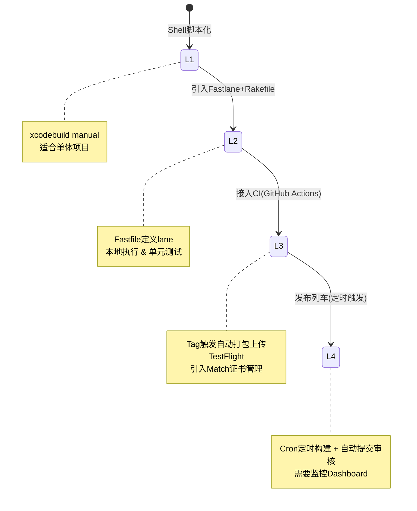

| 级别 | 描述                       | 适用场景          |
| ---- | -------------------------- | ----------------- |
| L1   | 命令行脚本打包             | 个人项目/小团队   |
| L2   | Fastlane自动化             | 中型团队          |
| L3   | CI/CD流水线（按需触发）    | 标准团队          |
| L4   | 全自动发布列车（定时触发） | 大型团队/成熟产品 |

Slipway项目展示了L4级别的“发布列车”模式：每周二自动提交新版本审核，周五自动发布已审核版本。

### 6.3 方案选型决策树

为了帮助您根据团队现状做出最佳选择，请参考以下决策逻辑：

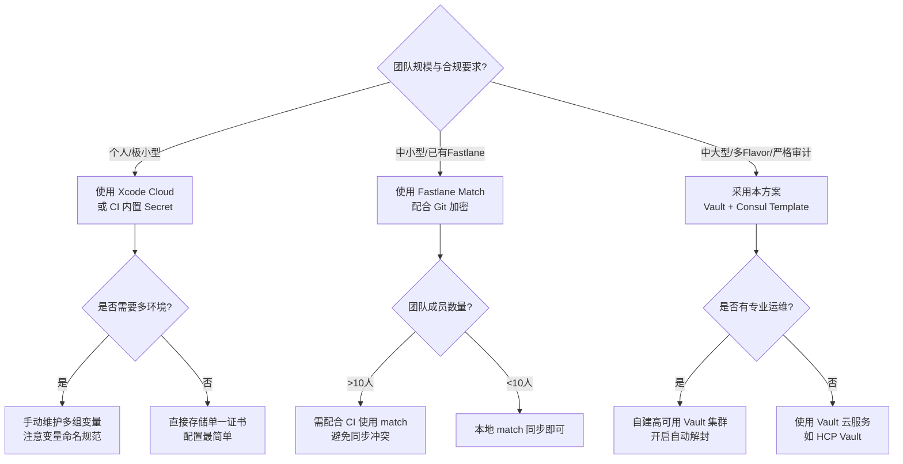

---

## 七、总结与核心技术栈汇总

iOS打包发布自动化已成为现代iOS开发的标配实践。

### 7.1 标准方案推荐组合

- **核心工具**：Fastlane（构建、签名、上传、元数据管理）
- **CI平台**：根据团队规模和偏好选择GitHub Actions、GitLab CI或Jenkins
- **证书管理**：团队使用Fastlane Match，个人项目使用CI Secrets
- **发布渠道**：TestFlight用于Beta测试，App Store用于正式发布
- **进阶方案**：Xcode Cloud作为Apple原生CI/CD选项

### 7.2 核心技术栈汇总表

| 流程环节     | 关键原理/动作                           | 应用的核心技术/工具                                 |
| :----------- | :-------------------------------------- | :-------------------------------------------------- |
| **代码签名** | RSA公私钥体系 + SHA-1文件散列           | `security`、`codesign`、OpenSSL、Apple Root CA      |
| **证书同步** | 对称加密（AES-256） + Git版本控制       | Fastlane `match`、`openssl enc`                     |
| **项目编译** | 增量编译 + 依赖分析（Dependency Graph） | `xcodebuild`、`Swift Package Manager`、`CocoaPods`  |
| **打包压缩** | .app -> Payload -> .ipa (ZIP Deflate)   | `ditto`、`zip`、`Transporter`框架                   |
| **API认证**  | JWT (ES256签名) 或 Session Cookie       | `App Store Connect API`、`spaceship`                |
| **文件上传** | HTTPS Multipart分片 + 断点续传          | `altool`（已弃用）、`asc`、`Fastlane pilot`         |
| **CI调度**   | Webhook事件驱动 / 定时轮询              | `actions/runner`、`gitlab-runner`、Jenkins Remoting |
| **凭证管理** | Vault动态注入 / Base64环境变量          | `Vault Agent`、Consul Template、GitHub Secrets      |

### 7.3 最终建议

从手动操作到全自动“发布列车”，自动化程度可根据团队规模和业务需求逐步演进。关键是在保证流程可靠性和安全性的前提下，最大化减少人工干预，提升发布效率。

所有自动化都必须基于对`xcodebuild`和`codesign`底层机制的透彻理解。无论选型Fastlane还是原生Shell，其本质都是将上述流程图中的**苹果私有闭源工具链**通过命令行参数进行标准化封装。对于企业级应用，务必结合**Vault+Consul Template**方案解决证书分发痛点，并与**App Store Connect API**对接实现无人值守发布。

**进阶实践建议**：建议先在小范围（如 Staging 环境）跑通 Vault+Consul Template 方案的 POC（概念验证），验证 Consul Template 的渲染效率和 Vault 的网络延迟，随后逐步推广至 Production 构建流水线，并将 Vault 审计日志接入公司 SIEM 系统，实现全链路可观测。