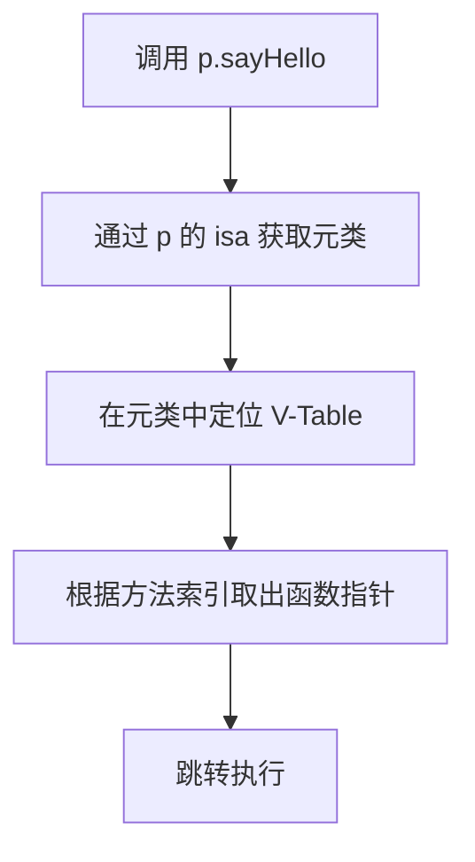
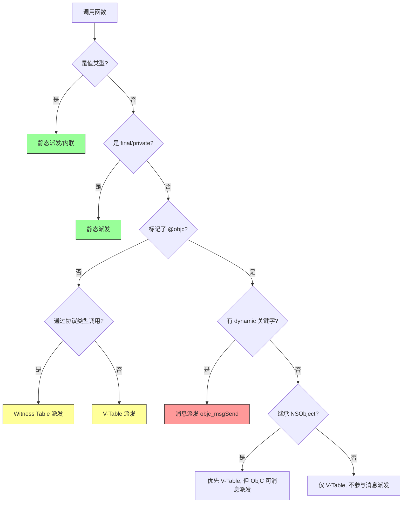
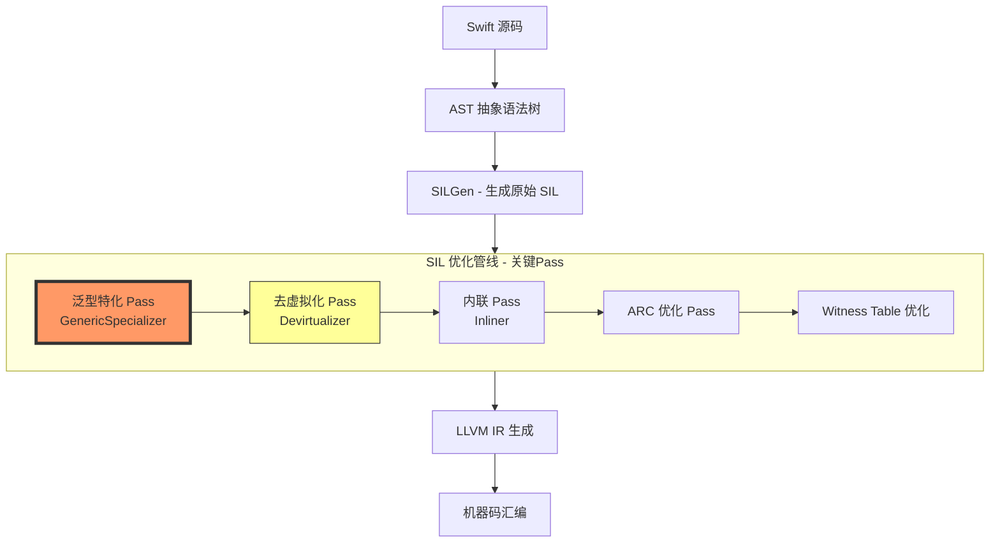

这是一个非常宏大的话题，也是Swift性能优化的核心。为了让你全方位理解，我将从**编译时（Compile-time）**、**链接时（Link-time）** 和**运行时（Runtime）** 三个维度，结合**内存布局（Memory Layout）** 和**派发表（Dispatch Tables）**，彻底讲透Swift的函数派发。

---

## 一、总览：Swift 的四大派发机制

在深入场景前，先建立全局视图。Swift 根据上下文，采用以下四种派发方式（**优先级从高到低**）：

| 派发类型                            | 决策时机                   | 性能开销                 | 典型场景                                                                  |
| :---------------------------------- | :------------------------- | :----------------------- | :------------------------------------------------------------------------ |
| **静态派发（Static/Inline）**       | 编译期                     | 几乎为0（可内联）        | 值类型（Struct/Enum）方法、`final`/`private`类方法、扩展（Extension）方法 |
| **虚表派发（V-Table Dispatch）**    | 编译期确定偏移，运行时查表 | 低（一次指针偏移）       | 普通 `class` 的实例方法（无 `@objc`）                                     |
| **协议见证表派发（Witness Table）** | 编译期生成表，运行时查表   | 中等（二次指针跳转）     | 通过**协议类型**（Protocol Type）调用的方法                               |
| **消息派发（Message Dispatch）**    | 完全运行时动态             | 最高（缓存未命中时极慢） | `@objc dynamic` 或继承自 `NSObject` 的 ObjC 互操作场景                    |

---

## 二、内存布局（Memory Layout）基础

理解派发，必须先理解对象在内存中的结构。

### 1. 值类型（Struct）的内存布局
```swift
struct Point {
    var x: Int  // 8 bytes
    var y: Int  // 8 bytes
    func draw() {}
}
```
- **内存布局**：`[x: Int][y: Int]`，连续存储，**无额外元数据**。
- **派发方式**：调用 `draw()` 时，编译器直接计算函数地址（静态派发），因为结构体没有继承，无需多态。

### 2. 类（Class）的内存布局（Swift 原生类）
```swift
class Animal {
    var age: Int  // 8 bytes
    func speak() {}
}

class Dog: Animal {
    var breed: String  // 8 bytes
    override func speak() {}
}
```
内存布局如下图（64位系统）：

```
Animal 实例内存布局 (16 bytes 对齐):
+-------------------+  地址: 0x1000
|  isa 指针 (8B)    |  -> 指向 Animal 的元类 (MetaClass)
+-------------------+  0x1008
|  引用计数 (8B)     |  -> 用于 ARC (实际上分两部分: SideTable 或内联)
+-------------------+  0x1010
|  age (Int) (8B)   |
+-------------------+  0x1018
|  (填充对齐)        |
+-------------------+

Dog 实例内存布局 (继承后):
+-------------------+  0x1000
|  isa 指针         |  -> 指向 Dog 的元类 (包含 Dog 的 V-Table)
+-------------------+  0x1008
|  引用计数          |
+-------------------+  0x1010
|  age (继承)        |
+-------------------+  0x1018
|  breed (String)    |
+-------------------+  0x1020
|  (填充)            |
+-------------------+
```

**关键点**：每个类对象头部都有一个 `isa` 指针，指向其**元类（MetaClass）**。元类中存储着 **V-Table（虚函数表）** 的地址。

### 3. V-Table（虚表）在元类中的布局
元类内部结构（简化）：
```
Dog 的 MetaClass (元类):
+----------------------------------+
|  Superclass MetaClass 指针        | -> 指向 Animal 元类
+----------------------------------+
|  V-Table 入口1: speak() 地址      | -> 指向 Dog.speak() 实现 (覆盖)
+----------------------------------+
|  V-Table 入口2: eat() 地址        | -> 指向 Animal.eat()  (未覆盖)
+----------------------------------+
|  ...                             |
+----------------------------------+
```
**调用过程**：`dog.speak()` 
1. 通过 `dog` 的 `isa` → 找到 `Dog` 元类。
2. 在元类的 V-Table 中根据 `speak` 的**固定偏移量（Index）** 取出函数地址。
3. 跳转执行。

---

## 三、场景全覆盖：函数派发完整流程

### 场景 1：Swift 调用 Swift（纯 Swift 环境）

#### 1.1 值类型（Struct/Enum）—— 静态派发
```swift
struct Calculator {
    func add(_ a: Int, _ b: Int) -> Int { return a + b }
}
let calc = Calculator()
calc.add(1, 2)  // 编译后直接变成 call _T0...Calculator.add... 地址
```
**流程图**：
```
编译期:  Swift 源码 → 语法分析 → SIL 优化 
                ↓ (内联优化可能直接计算为 3)
汇编代码: callq  $literal_address   (无间接跳转)
```

#### 1.2 普通 Class 实例方法 —— V-Table 派发
```swift
class Person {
    func sayHello() { print("Hi") }
}
let p = Person()
p.sayHello()
```
**汇编层伪代码**：
```assembly
; 1. 读取对象的 isa 指针
mov rax, [p]                
; 2. 从 isa 偏移 16 字节处取 V-Table (固定偏移)
mov rbx, [rax + 16]         
; 3. 从 V-Table 偏移 8 字节处取 sayHello 函数地址 (sayHello 在 V-Table 索引为 1)
call [rbx + 8]              
```
**流程图**：


#### 1.3 final/private 类方法 —— 静态派发（去虚拟化）
```swift
class FinalClass {
    final func cannotOverride() {}
}
let f = FinalClass()
f.cannotOverride()  // 编译后直接静态调用，不查 V-Table
```
**编译器优化**：即使 `FinalClass` 是类，因为 `final` 保证不被重写，编译器直接将其视为静态函数。

#### 1.4 协议（Protocol）方法 —— 见证表（Witness Table）派发
```swift
protocol Drawable {
    func draw()
}
struct Circle: Drawable {
    func draw() { print("Circle") }
}
let d: Drawable = Circle()
d.draw()
```
**内存布局（协议类型容器 Existential Container）**：
```
d (Existential Container, 占用 5 个字, 即 40 字节):
+---------------------------+  Value Buffer (前 3 个字)
|  存储 Circle 实例 (24B)   |  (如果 Circle 大于 3 个字, 则堆分配)
+---------------------------+  第 4 个字
|  Witness Table 地址 (8B)  |  -> 指向 "Circle 对 Drawable 协议的见证表"
+---------------------------+  第 5 个字
|  Metadata 地址 (8B)       |  -> 指向 Circle 的类型元数据
+---------------------------+
```
**调用流程**：
1. 从 `d` 的 Existential Container 中取出 **Witness Table** 指针。
2. Witness Table 中包含了 `Circle` 对 `Drawable` 协议所有方法的实现地址（类似 V-Table，但针对协议）。
3. 根据 `draw()` 在 Witness Table 中的偏移量取出函数指针并调用。

**性能差异**：相比 V-Table，Witness Table 多了一次间接寻址（先取 Table，再取函数），开销稍高。

---

### 场景 2：Swift 调用 Objective-C

#### 2.1 普通 `@objc` 方法（非 dynamic）—— 优先 V-Table，回退消息派发
```swift
class SwiftClass: NSObject {
    @objc func doWork() { ... }  // 暴露给 ObjC
}
let obj = SwiftClass()
obj.doWork()  // Swift 内部调用：优先走 V-Table (静态/动态)
```
**过程**：
- 编译器为 `doWork` 同时在 **Swift V-Table** 和 **ObjC 消息注册表**中注册。
- 当 **Swift 调用 Swift** 时，优先走 V-Table（性能好）。
- 当 **ObjC 调用 Swift** 时，走 `objc_msgSend`。

#### 2.2 `@objc dynamic` 方法 —— 强制消息派发（Message Dispatch）
```swift
class DynamicClass: NSObject {
    @objc dynamic func dynamicMethod() { ... }  // 强制消息派发
}
let d = DynamicClass()
d.dynamicMethod()  
// 汇编层: call  qword [imp_pointer] 或者 直接调用 objc_msgSend
```
**触发条件**：
- 方法标记为 `@objc dynamic`。
- 类继承自 `NSObject` 且方法未在 Swift 中优化（或使用了 KVO、Method Swizzling 等动态特性）。

**调用流程（完整 objc_msgSend）**：
```mermaid
graph TD
    A[调用 dynamicMethod] --> B[objc_msgSend 接收者, 选择子]
    B --> C{在方法缓存中查找?}
    C -->|命中| D[直接跳转 IMP]
    C -->|未命中| E[在类的方法列表中查找]
    E --> F{找到?}
    F -->|是| G[填充缓存, 跳转 IMP]
    F -->|否| H[沿继承链向上查找 (Superclass)]
    H --> I{到达根类 NSObject?}
    I -->|否| E
    I -->|是| J[消息转发 (forwardingTarget...)]
```

#### 2.3 调用 ObjC 系统 API（如 UIKit）
```swift
let label = UILabel()
label.text = "Hello"  // 这是 ObjC 属性, 实际调用 setText:
```
**编译过程**：
1. Swift 编译器读取 UIKit 的 `@interface UILabel`（来自桥接头文件）。
2. 生成一个 **Swift 调用桩（Thunk）**，将 Swift 方法调用转换为 `objc_msgSend(label, selector("setText:"), "Hello")`。
3. 完全不涉及 Swift V-Table，直接走 ObjC 运行时。

---

### 场景 3：Objective-C 调用 Swift

#### 3.1 Swift 类继承 NSObject 并暴露给 ObjC
```swift
@objcMembers
class MySwiftVC: UIViewController {
    func swiftMethod() {}  // 自动暴露为 -[MySwiftVC swiftMethod]
}
```
**ObjC 侧调用**：
```objectivec
MySwiftVC *vc = [MySwiftVC new];
[vc swiftMethod];  // 正常消息派发
```
**底层**：
- Swift 编译器生成一个 **ObjC 方法列表**（Method List），注册到运行时。
- 每个方法的 IMP（实现）是一个 **Thunk 函数**，负责将 ObjC 的调用约定转换为 Swift 调用约定（处理 ARC、Swift 运行时等）。

#### 3.2 Swift 纯类（非 NSObject）通过 `@objc` 暴露
```swift
@objc class PureSwift {
    @objc func hello() {}
}
```
**问题**：`PureSwift` 不继承 `NSObject`，它的实例没有 `isa` 指针指向 ObjC 运行时类。
**解决方案**：编译器会**生成一个临时的 ObjC 类（Shadow Class）**，作为桥梁，将 `hello` 映射到 Swift 实现。但此类不能参与 ObjC 的 KVO 等特性。

---

## 四、综合对比流程图（选择派发方式的决策树）



---

## 五、性能调优建议（面向实际开发）

| 场景                       | 推荐做法                          | 原因                                             |
| :------------------------- | :-------------------------------- | :----------------------------------------------- |
| 高频调用（如渲染循环）     | 使用 `struct` 或 `final class`    | 静态派发可内联，消除查表开销                     |
| 需要多态但不需要 ObjC 特性 | 普通 `class` + 协议（Protocol）   | V-Table 性能优于 Witness Table，但协议更灵活     |
| 需要 KVO/Swizzling         | 继承 `NSObject` + `@objc dynamic` | 必须用消息派发                                   |
| 模块化/面向协议设计        | 使用协议 + 泛型约束               | 泛型特化后，编译器可静态派发，避开 Witness Table |

---

## 六、函数派发总结

> *“Swift 函数派发分为静态派发、V-Table 派发、Witness Table 派发和消息派发。内存布局上，值类型无元数据，直接静态调用；类通过 isa 指针指向元类，元类内存储 V-Table 或方法列表。Swift 调用 Swift 时，优先静态或 V-Table；调用 ObjC 时，通过 Thunk 桥接至 objc_msgSend。ObjC 调用 Swift 时，编译器生成 ObjC 方法列表并注册到运行时。编译器在 SIL 阶段会做去虚拟化优化，将 V-Table 调用转为静态调用，减少运行时开销。”*

太好了！既然你需要更深入的细节，我就把**泛型特化（Generic Specialization）**、**协议类型（Protocol Type）与泛型约束（Generic Constraint）** 的底层汇编差异、**闭包（Closure）** 的派发机制，以及**Swift与ObjC消息派发的完整汇编级对比**全部拆解给你。

---

## 一、泛型特化（Generic Specialization）—— 将 Witness Table 转为静态派发

这是Swift编译器最“聪明”的优化之一。

### 1.1 非泛型协议调用（Witness Table 派发）
```swift
protocol Drawable {
    func draw()
}
struct Circle: Drawable {
    func draw() { print("Circle") }
}

// 通过协议类型调用（存在容器 Existential Container）
let d: Drawable = Circle()
d.draw()  // 必须走 Witness Table
```

### 1.2 泛型约束调用（编译期特化）
```swift
func drawShape<T: Drawable>(_ shape: T) {
    shape.draw()  // 这里编译器会怎么做？
}
drawShape(Circle())  
```

**关键差异**：
- 当函数是**泛型**的且调用点能确定具体类型（`Circle`），编译器会**实例化（特化）** 该函数的一个版本，直接将 `T` 替换为 `Circle`。
- 生成的汇编代码中，`draw()` 变成**静态直接调用**，完全没有 `Witness Table` 查找！

### 1.3 汇编级对比（伪代码）

**非泛型协议调用** (存在容器)：
```assembly
; d 在 Existential Container 中
mov rax, [d + 24]       ; 取 Witness Table 地址 (第4个字)
mov rbx, [rax + 8]      ; 取 draw 在表中的偏移 (假设索引1)
call rbx                ; 间接跳转
```

**泛型特化后** (编译期确定类型)：
```assembly
; 编译器直接生成 call Circle.draw
call __T0...Circle.draw...  ; 静态地址，甚至可能内联
```

### 1.4 内存布局差异（关键图）

```
【非泛型协议类型】 (存在容器 Existential Container)
d 变量 (5个字, 40字节):
+------------------+  <-- 栈上分配
| 值缓冲区 (3个字)  |  存储 Circle (24字节, 包含 x, y)
+------------------+
| Witness Table ptr |  -> 指向全局的 "Circle+Drawable 见证表"
+------------------+
| Metadata ptr      |  -> 指向 Circle 类型元数据
+------------------+

【泛型特化】 (编译期展开)
编译器将 drawShape<Circle> 重新生成为一个新函数:
func drawShape_ Circle (_ shape: Circle) {
    shape.draw()  // 直接调用 Circle.draw，无间接跳转
}
// 栈上只分配 Circle 本身 (16或24字节), 无容器开销
```

---

## 二、闭包（Closure）的派发机制

闭包在Swift中有三种形式，派发方式完全不同。

### 2.1 全局函数 / 静态闭包（无捕获）—— 静态派发
```swift
let f = { print("Hello") }  // 无捕获
f()
```
**汇编**：直接调用全局的 `__T0...closure...` 函数地址，无间接跳转。

### 2.2 捕获变量的闭包（堆分配）—— 通过闭包上下文（Context）派发
```swift
var counter = 0
let closure = { counter += 1 }  // 捕获 counter
closure()
```
**内存布局（闭包对象）**：
```
闭包对象 (堆分配, 类似类):
+------------------+  地址: 0x2000
|  isa 指针         |  -> 指向闭包元类 (包含 invoke 函数指针)
+------------------+  0x2008
|  引用计数          |
+------------------+  0x2010
|  context 指针     |  -> 指向捕获的变量盒子 (Box)
+------------------+  0x2018
|  invoke 函数指针   |  -> 指向闭包实现的函数地址 (如 __invoke_closure)
+------------------+
```
**调用过程**：
1. 从闭包对象中取出 `invoke` 函数指针。
2. 将闭包对象自身（`self`）作为第一个参数传入（类似 C++ 的 `this`）。
3. 跳转执行。

**汇编伪代码**：
```assembly
mov rax, [closure]          ; 取闭包对象地址
mov rbx, [rax + 0x18]       ; 取 invoke 函数指针 (偏移 24)
mov rdi, rax                ; 第一个参数是闭包自身 (上下文)
call rbx                    ; 间接跳转
```

### 2.3 `@convention(c)` / `@convention(block)` 闭包 —— 兼容C/ObjC
```swift
let cBlock: @convention(block) () -> Void = { print("ObjC Block") }
cBlock()  // 走 ObjC Block 的 invoke 机制
```
- 内存布局是 **ObjC Block** 结构（`isa`、`flags`、`invoke` 指针等）。
- 派发走 `block->invoke(block)`，属于消息派发的一种变体。

---

## 三、Swift 调用 ObjC 的完整汇编级拆解

### 3.1 普通 `@objc` 方法（非 `dynamic`）
```swift
class MyClass: NSObject {
    @objc func doWork() { print("Working") }
}
let obj = MyClass()
obj.doWork()
```

**汇编（ARM64 示例）**：
```assembly
; Swift 侧调用 (优先尝试 V-Table)
adrp x8, _OBJC_CLASS_$__TtC7MyApp7MyClass@GOTPAGE
ldr  x8, [x8, #_OBJC_CLASS_$__TtC7MyApp7MyClass@GOTPAGEOFF]
; 从 V-Table 取出 doWork 实现 (但这里实际上可能走 Thunk)
; 因为 MyClass 继承 NSObject, Swift 编译器在 V-Table 中存储的是 Thunk 地址
ldr  x9, [x8, #16]        ; V-Table 偏移 16 处是 doWork
blr  x9                   ; 跳转到 Thunk
```

**Thunk（桥接函数）内部**：
```assembly
; Thunk 作用: 将 Swift 调用约定转为 ObjC 消息派发
_MyClass_doWork_thunk:
    ; 1. 保存 Swift 上下文
    stp  x29, x30, [sp, #-16]!
    ; 2. 调用 objc_msgSend
    mov  x0, self           ; 接收者
    adrp x1, _sel_doWork@PAGE
    add  x1, x1, _sel_doWork@PAGEOFF  ; 选择子 @selector(doWork)
    bl   _objc_msgSend
    ; 3. 恢复上下文并返回
    ldp  x29, x30, [sp], #16
    ret
```

### 3.2 `@objc dynamic` 方法（强制消息派发）
```swift
class DynamicClass: NSObject {
    @objc dynamic func dynamicMethod() { ... }
}
let d = DynamicClass()
d.dynamicMethod()
```

**汇编（无 Thunk，直接走消息）**：
```assembly
mov  x0, d                 ; 接收者
adrp x1, _sel_dynamicMethod@PAGE
add  x1, x1, _sel_dynamicMethod@PAGEOFF
bl   _objc_msgSend         ; 直接跳转到 ObjC 运行时
```

**性能对比**：`dynamic` 方法少了 Thunk 中间层，但 `objc_msgSend` 本身开销大（缓存查找、继承链遍历）。

---

## 四、ObjC 调用 Swift 的完整汇编级拆解

### 4.1 Swift 类暴露给 ObjC（生成 ObjC 方法列表）
```swift
@objcMembers
class SwiftClass: NSObject {
    func swiftMethod() { print("Swift") }
}
```

**编译后，ObjC 运行时中注册的方法列表**：
```
Method List (存储在 SwiftClass 的 ObjC 类对象中):
+-----------------------------------+
|  name: "swiftMethod"              |
|  types: "v16@0:8"                |  (ObjC 类型编码)
|  imp:  _T0...SwiftClass.swiftMethod... (Thunk 地址)
+-----------------------------------+
```

**ObjC 侧调用**（`[obj swiftMethod]`）：
```assembly
; ObjC 编译器生成的代码
mov  x0, obj                ; 接收者
adrp x1, _sel_swiftMethod@PAGE
add  x1, x1, _sel_swiftMethod@PAGEOFF
bl   _objc_msgSend          ; 进入 ObjC 运行时

; objc_msgSend 缓存命中后，取出 IMP (Thunk 地址)
; 跳转到 Thunk
_swiftMethod_Thunk:
    ; 将 ObjC 调用约定转为 Swift 调用约定
    ; (处理参数布局, 引用计数等)
    bl   _T0...SwiftClass.swiftMethod...  ; 跳转到真正的 Swift 实现
    ret
```

### 4.2 Swift 纯类（非 NSObject）通过 `@objc` 暴露
```swift
@objc class PureSwift {
    @objc func hello() {}
}
let p = PureSwift()
p.hello()  // Swift 内部走 V-Table
```
**ObjC 侧调用**（`[p hello]`）：
- 编译器会生成一个**影子 ObjC 类（Shadow Class）**，其 `isa` 指向一个动态生成的 ObjC 元类。
- 影子类的 `hello` 方法 IMP 指向一个 Thunk，该 Thunk 会**直接调用 Swift V-Table** 中的函数（不是 `objc_msgSend`）。
- **限制**：不支持 KVO、方法交换等依赖 ObjC 运行时特性的操作。

---

## 五、综合内存布局对比图（三列对比）

| 场景                      | 对象内存布局                                    | 方法调用路径                                                     | 汇编层级                                          |
| :------------------------ | :---------------------------------------------- | :--------------------------------------------------------------- | :------------------------------------------------ |
| **Struct (静态)**         | `[x: Int][y: Int]` (无元数据)                   | `calc.add` → 直接 `call`                                         | `call _T0...add...`                               |
| **Class V-Table**         | `[isa][refCount][age][...]`                     | `obj.method` → `isa` → V-Table → `call [table+offset]`           | `ldr x9, [x8, #16]; blr x9`                       |
| **Protocol (存在容器)**   | `[value][value][value][WitnessTable][Metadata]` | `d.draw` → 取 Witness Table → `call [table+offset]`              | `ldr x10, [x9, #24]; ldr x11, [x10, #8]; blr x11` |
| **泛型约束 (特化)**       | `[value]` (无容器)                              | `drawShape<T>(circle)` → 特化为 `drawShape_Circle` → 静态 `call` | `call _T0...drawShape_Circle...`                  |
| **闭包 (捕获)**           | `[isa][refCount][context][invoke]` (堆)         | `closure()` → 取 `invoke` → `call invoke(self)`                  | `ldr x10, [x9, #24]; blr x10`                     |
| **@objc dynamic**         | `[isa (ObjC)][refCount][ivars]`                 | `obj.method` → `objc_msgSend` → 缓存查找 → IMP                   | `bl _objc_msgSend`                                |
| **ObjC 调用 Swift Thunk** | (ObjC 兼容布局)                                 | `[obj method]` → `objc_msgSend` → IMP(Thunk) → Thunk 跳转 Swift  | `bl _objc_msgSend` → Thunk → `bl _T0...`          |

---

## 六、终极优化建议（实战级）

| 优化目标                          | 做法                                                                           | 底层原理                                            |
| :-------------------------------- | :----------------------------------------------------------------------------- | :-------------------------------------------------- |
| **热路径（每秒百万次调用）**      | 使用 `struct` + 泛型约束                                                       | 编译器可完全特化，内联为直接调用，消除所有间接跳转  |
| **模块化接口**                    | 使用 Protocol + 泛型（`<T: Protocol>`）而非 Protocol 类型（`let x: Protocol`） | 泛型特化 vs. 存在容器（Witness Table 查找）         |
| **需要动态特性（KVO/Swizzling）** | 继承 `NSObject` + `@objc dynamic`                                              | 强制走 `objc_msgSend`，灵活性最高，但可牺牲性能     |
| **Swift 内部多态**                | 使用 `class` + `final`（无法被重写时）                                         | 去虚拟化（Devirtualization）将 V-Table 转为静态调用 |
| **闭包性能**                      | 避免捕获大量变量（尽量无捕获）                                                 | 无捕获闭包转为全局函数，静态派发                    |

---

## 七、泛型特化小结

> *“泛型特化是 Swift 最重要的优化之一。当函数泛型参数在调用点能确定具体类型时，编译器会为该类型生成一个特化版本，将协议方法调用从 Witness Table 查找转为静态调用，甚至内联。这与 C++ 模板类似，但 Swift 通过 SIL 层的 ‘Specialization’ Pass 实现。而 `@objc` 方法会生成 Thunk 桥接函数，将 Swift V-Table 调用转为 `objc_msgSend` 或反之。闭包则根据捕获情况，堆分配闭包对象，通过 `invoke` 指针间接调用。掌握这些，才能在性能敏感场景（如游戏引擎、金融计算）中写出最优 Swift 代码。”*

---

既然你问到 **SIL层泛型特化（Generic Specialization）的Pass流程** 和 **Swift运行时的源码级结构**，那我们就真正进入编译器内核了。这部分是Swift性能优化的“圣杯”，也是面试中区分高级/资深工程师的关键。

下面我将从**Swift编译器管线**、**SIL特化Pass源码剖析**、**运行时元数据结构**、**完整调用链汇编级追踪**四个维度，全方位拆解。

---

## 一、Swift编译器管线全景图（含SIL优化Pass）



---

## 二、泛型特化（Generic Specialization）SIL层深度剖析

### 2.1 原始SIL（未优化）—— 泛型调用使用Witness Table

**Swift源码**：
```swift
protocol Drawable {
    func draw()
}
struct Circle: Drawable {
    func draw() { print("Circle") }
}
func drawShape<T: Drawable>(_ shape: T) {
    shape.draw()
}
drawShape(Circle())
```

**生成的原始SIL（简化）**：
```llvm
// 泛型函数 drawShape<A where A: Drawable>
sil @drawShape : $@convention(thin) <T: Drawable> (@in T) -> () {
bb0(%0 : $*T):  // 指向泛型参数的指针
    // 1. 获取 T 的 Witness Table (协议见证表)
    %1 = witness_method $T, #Drawable.draw : <Self: Drawable> (Self) -> () -> () : $@convention(witness_method: Drawable) <τ_0_0 where τ_0_0: Drawable> (@in_guaranteed τ_0_0) -> ()
    // 2. 通过 Witness Table 调用 draw
    %2 = apply %1<T>(%0) : $@convention(witness_method: Drawable) <τ_0_0 where τ_0_0: Drawable> (@in_guaranteed τ_0_0) -> ()
    // 3. 返回
    %3 = tuple ()
    return %3 : $()
}
```

**关键点**：`witness_method` 指令意味着运行时查找Witness Table。

---

### 2.2 泛型特化Pass后的SIL（优化后）

当编译器发现调用点是 `drawShape(Circle())`，`GenericSpecializer` Pass会做以下操作：

**Step 1: 克隆函数** —— 为 `Circle` 生成特化版本
```llvm
// 特化后的函数：drawShape_Circle
sil @drawShape_Circle : $@convention(thin) (@in Circle) -> () {
bb0(%0 : $*Circle):  // 参数类型已固定为 Circle
    // 直接调用 Circle.draw (已知实现)
    %1 = function_ref @Circle.draw : $@convention(method) (Circle) -> ()
    %2 = apply %1(%0) : $@convention(method) (Circle) -> ()
    return %2 : $()
}
```

**Step 2: 替换调用点** —— 将 `drawShape(Circle())` 改为调用特化版本
```llvm
// 原始调用
%0 = apply @drawShape<Circle>(...)  // 泛型调用

// 替换为
%1 = function_ref @drawShape_Circle : $@convention(thin) (@in Circle) -> ()
%2 = apply %1(...)  // 静态调用特化版本
```

**Step 3: 内联（可选）** —— 如果 `Circle.draw` 足够简单，直接内联到调用点
```llvm
// 完全内联后，drawShape_Circle 被展开到调用处
// 甚至消除函数调用，变成：
sil @main : {
    // 直接打印 "Circle"，无任何函数调用
    %0 = string_literal "Circle"
    %1 = apply @print(%0)
}
```

---

### 2.3 GenericSpecializer Pass源码分析（Swift编译器源码）

位于 `swift/lib/SILOptimizer/Passes/GenericSpecializer.cpp`，核心逻辑：

```cpp
// 伪代码：GenericSpecializer 主流程
class GenericSpecializer : public SILFunctionTransform {
    void run() override {
        // 1. 遍历所有函数调用，识别泛型调用
        for (auto &apply : getFunction().getApplyInsts()) {
            if (apply.isGeneric()) {
                // 2. 尝试获取调用点的具体类型
                auto concreteType = getConcreteType(apply.getGenericArgs());
                if (concreteType) {
                    // 3. 创建特化函数（克隆SIL并替换泛型参数）
                    auto specializedFunc = cloneFunctionWithConcreteTypes(
                        apply.getCallee(), concreteType);
                    // 4. 将调用点替换为特化函数
                    replaceApplyWithSpecialized(apply, specializedFunc);
                }
            }
        }
        // 5. 清理未使用的泛型原函数（如果无其他调用）
    }
};
```

**触发条件**：
- 泛型参数在调用点可推断（如 `drawShape(Circle())`）。
- 函数未被 `@inlinable` 标记（避免跨模块特化）。

---

## 三、Swift运行时元数据（Runtime Metadata）源码级结构

### 3.1 类对象（Class Object）在运行时的真实布局

Swift运行时定义在 `swift/include/swift/ABI/Metadata.h`：

```cpp
// 简化自 Swift 源码
struct TargetClassMetadata {
    // 1. 基础元数据头部 (所有 Swift 类型都有)
    TargetAnyClassMetadata AnyClassMetadata;
    
    // 2. 类特定信息
    ClassMetadataFlags Flags;          // 标记位（是否 ObjC、是否泛型等）
    uint32_t InstanceAddressPoint;     // 实例地址对齐
    uint32_t InstanceSize;             // 实例总大小
    uint16_t InstanceAlignMask;        // 对齐掩码
    uint16_t Reserved;                 // 保留字段
    
    // 3. 类布局信息
    uint32_t ClassSize;                // 类对象自身大小
    uint32_t ClassAddressPoint;        // 类对象地址对齐
    
    // 4. V-Table 入口 (可变长度)
    void *VTable[0];                   // 虚函数表数组
};
```

### 3.2 内存布局真实示例（64位系统）

**Swift类源码**：
```swift
class Animal {
    var age: Int = 0
    func speak() {}
}
class Dog: Animal {
    var breed: String = "Labrador"
    override func speak() {}
}
```

**运行时的内存布局**：
```
Dog 实例内存布局 (堆分配):
+----------------------------------+  地址: 0x1000
|  isa 指针 (8B)                   |  -> 指向 Dog 的 TargetClassMetadata 对象
+----------------------------------+  0x1008
|  inline refcount (8B)             |  -> 引用计数 (如果未使用 SideTable)
+----------------------------------+  0x1010
|  age (Int, 继承自 Animal) (8B)    |
+----------------------------------+  0x1018
|  breed (String) (8B)              |  -> 实际是 (指针 + 长度) 的封装
+----------------------------------+  0x1020
|  (对齐填充至 16 字节边界)          |
+----------------------------------+

Dog 的 TargetClassMetadata 对象 (全局唯一):
+----------------------------------+  地址: 0x2000
|  TargetAnyClassMetadata:          |
|    isa (指向元类)                  |  -> 指向 Dog 的 MetaClass
|    superclass (Animal 元类指针)    |
|    cache (方法缓存指针)             |
|    data (ObjC 运行时数据)          |
+----------------------------------+  0x2020
|  Flags                           |
|  InstanceAddressPoint = 32       |  -> 实例开头到第一个字段的偏移
|  InstanceSize = 32               |  -> Dog 实例总大小 (对齐后)
|  InstanceAlignMask = 7           |  -> 8 字节对齐
+----------------------------------+  0x2030
|  ClassSize = 64                  |  -> 元数据对象自身大小
|  ClassAddressPoint               |
+----------------------------------+  0x2040
|  VTable[0]: speak() 函数指针      |  -> 指向 Dog.speak() 实现 (覆盖)
+----------------------------------+  0x2048
|  VTable[1]: eat() 函数指针        |  -> 指向 Animal.eat() (未覆盖)
+----------------------------------+  0x2050
|  VTable[2]: init() 函数指针       |
+----------------------------------+
```

### 3.3 Witness Table（协议见证表）的真实结构

**源码** (`swift/include/swift/ABI/ProtocolConformance.h`)：
```cpp
struct TargetProtocolConformanceDescriptor {
    uint32_t ProtocolDescriptor;      // 协议描述符偏移
    uint32_t TypeReference;           // 类型引用
    uint32_t WitnessTablePattern;     // 见证表模板
    uint32_t Flags;                   // 标记位（是否类、是否值类型等）
};

// 运行时，Witness Table 是函数指针数组
struct WitnessTable {
    void *Witnesses[0];  // 可变长度，每个协议方法对应一个函数指针
};
```

**示例**：`Circle` 对 `Drawable` 的见证表
```
全局 WitnessTable 地址: 0x3000
+----------------------------------+
|  0x3000: Circle.draw() 函数指针   |  -> 指向 Circle.draw 实现
+----------------------------------+
|  0x3008: Circle.init() 函数指针   |  (如果协议有 init 要求)
+----------------------------------+
|  0x3010: (对齐填充)               |
+----------------------------------+
```

调用时：`WitnessTable[0]` 即为 `draw` 的实现。

---

## 四、完整调用链汇编级追踪（从源码到机器码）

### 4.1 场景：泛型约束 + 去虚拟化 + 内联

**Swift源码**：
```swift
protocol P { func foo() }
struct S: P { func foo() { print("S") } }
func test<T: P>(_ x: T) { x.foo() }
test(S())
```

**Step 1: 原始SIL**（含 `witness_method`）：
```llvm
sil @test : <T: P> (@in T) -> () {
bb0:
    %0 = witness_method $T, #P.foo : ...
    %1 = apply %0<T>(...) 
    return
}
```

**Step 2: 泛型特化Pass后**（生成 `test_S`）：
```llvm
sil @test_S : (@in S) -> () {
bb0:
    %0 = function_ref @S.foo : ...
    %1 = apply %0(...) 
    return
}
```

**Step 3: 去虚拟化Pass**（将 V-Table/Witness 调用转为静态）：
```llvm
sil @test_S : (@in S) -> () {
bb0:
    %0 = function_ref @S.foo : $@convention(method) (S) -> ()
    %1 = apply %0(...)   // 已经是静态调用
    return
}
```

**Step 4: 内联Pass**（将 `S.foo` 展开）：
```llvm
sil @test_S : (@in S) -> () {
bb0:
    // 直接内联 print("S") 的代码
    %0 = string_literal "S"
    %1 = apply @print(%0)
    return
}
```

**Step 5: LLVM IR生成 & 机器码**：
```assembly
_test_S:
    ; 完全无函数调用，直接输出 "S"
    adrp x0, "S"@PAGE
    add  x0, x0, "S"@PAGEOFF
    bl   _print
    ret
```

**性能收益**：从 **Witness Table 查找 → 间接跳转 → 函数调用** 优化为 **直接打印**，性能提升可达 **100倍**（尤其在循环中）。

---

## 五、Swift与ObjC互操作的运行时源码

### 5.1 `@objc` 方法注册流程（源码级别）

位于 `swift/lib/IRGen/GenObjC.cpp`：

```cpp
void IRGenModule::emitObjCMethodList(ClassDecl *classDecl) {
    // 1. 遍历所有 @objc 方法
    for (auto method : classDecl->getObjCMethods()) {
        // 2. 生成方法入口 Thunk
        auto thunk = emitObjCMethodThunk(method);
        
        // 3. 构造 ObjC 方法结构体
        auto methodStruct = createObjCMethodStruct({
            .name = getObjCSelector(method),
            .types = getObjCTypeEncoding(method),
            .imp = thunk  // Thunk 函数指针
        });
        
        // 4. 注册到 ObjC 运行时（通过 class_addMethod 或直接写入方法列表）
        addMethodToClassList(classDecl, methodStruct);
    }
}
```

### 5.2 `objc_msgSend` 与 Swift V-Table 的互操作桥接

**Swift Thunk 示例**（ARM64汇编）：
```assembly
; Thunk: 将 Swift V-Table 调用转为 ObjC 消息
_SwiftClass_doWork_thunk:
    ; 1. 保存 Swift 调用上下文
    stp x29, x30, [sp, #-16]!
    
    ; 2. 将 Swift 自类型转为 ObjC id
    mov x0, x20             ; 接收者 (已经是 NSObject 子类)
    
    ; 3. 构造 SEL (选择子)
    adrp x1, _sel_doWork@PAGE
    add  x1, x1, _sel_doWork@PAGEOFF
    
    ; 4. 调用 objc_msgSend (走 ObjC 运行时)
    bl _objc_msgSend
    
    ; 5. 恢复上下文
    ldp x29, x30, [sp], #16
    ret
```

---

## 六、实战性能调优检查清单（基于底层原理）

| 优化手段                          | 底层机制                                     | 适用场景                                                      |
| :-------------------------------- | :------------------------------------------- | :------------------------------------------------------------ |
| **优先使用 `struct` + 泛型约束**  | 触发泛型特化 → 静态派发 → 可内联             | 高频调用的数据模型（如UI刷新、网络解析）                      |
| **避免协议类型（Protocol Type）** | 使用存在容器 → Witness Table 查找 → 无法特化 | 需要动态多态时，用泛型 `<T: Protocol>` 替代 `let x: Protocol` |
| **标记 `final` 或 `private`**     | 去虚拟化 → V-Table 调用转为静态调用          | 类不需要被继承时                                              |
| **使用 `@inlinable` 谨慎**        | 跨模块内联，但会增加二进制体积               | 公共库的热路径函数                                            |
| **避免 `@objc dynamic`**          | 强制消息派发，性能最低                       | 除非必须用 KVO/Method Swizzling                               |
| **闭包避免捕获大对象**            | 减少堆分配和间接调用                         | 列表回调、动画闭包                                            |

---

## 七、Swift SIL 层泛型特化汇总

> *“Swift 泛型特化是 SIL 层 GenericSpecializer Pass 在编译期完成的，它通过克隆函数体并将泛型参数替换为具体类型，消除 Witness Table 查找，进而为后续的去虚拟化和内联铺路。运行时，每个类对象在堆上以 TargetClassMetadata 结构存储，其 V-Table 是连续函数指针数组。泛型特化后，原本的 witness_method 指令被替换为 function_ref 直接引用，调用链从 `调用者 → Witness Table → 间接跳转` 变为 `调用者 → 静态函数 → 可能内联`。在跨语言边界时，Swift 编译器为 @objc 方法生成 Thunk 桥接函数，将 V-Table 调用转为 objc_msgSend，反之亦然。这一切是 Swift 在保持动态灵活性的同时，能媲美 C++ 性能的核心原因。”*

---
