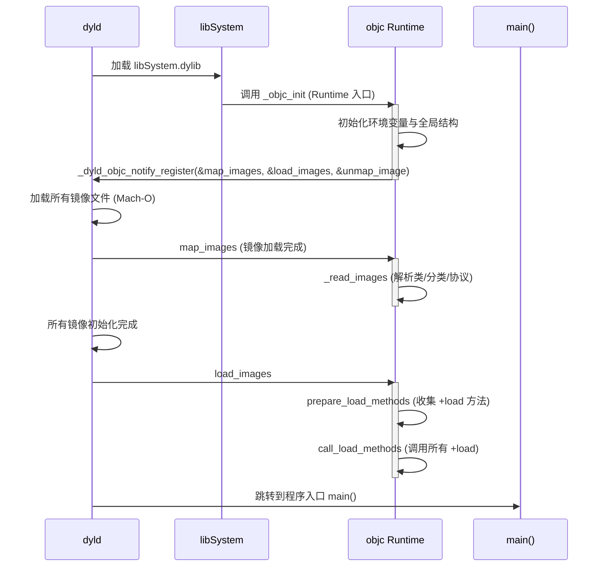
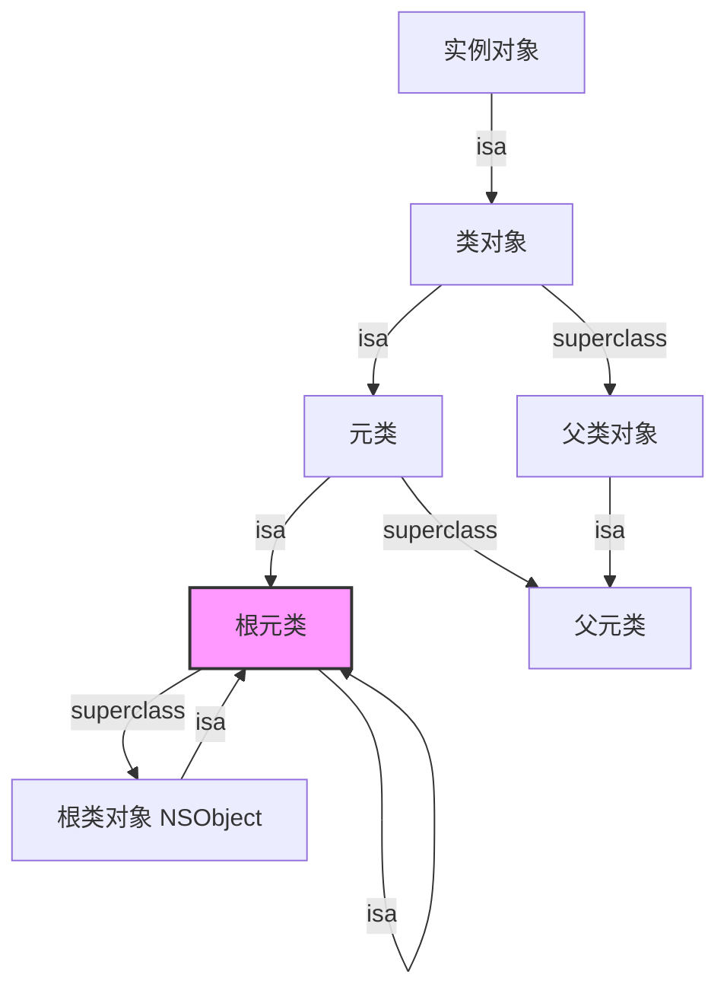
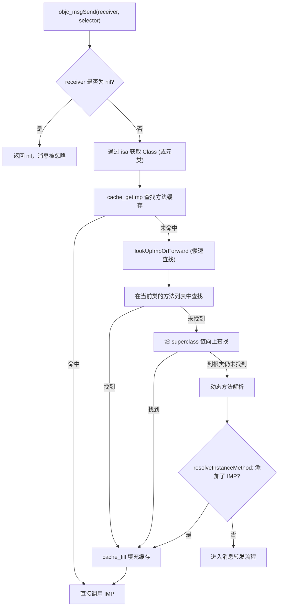
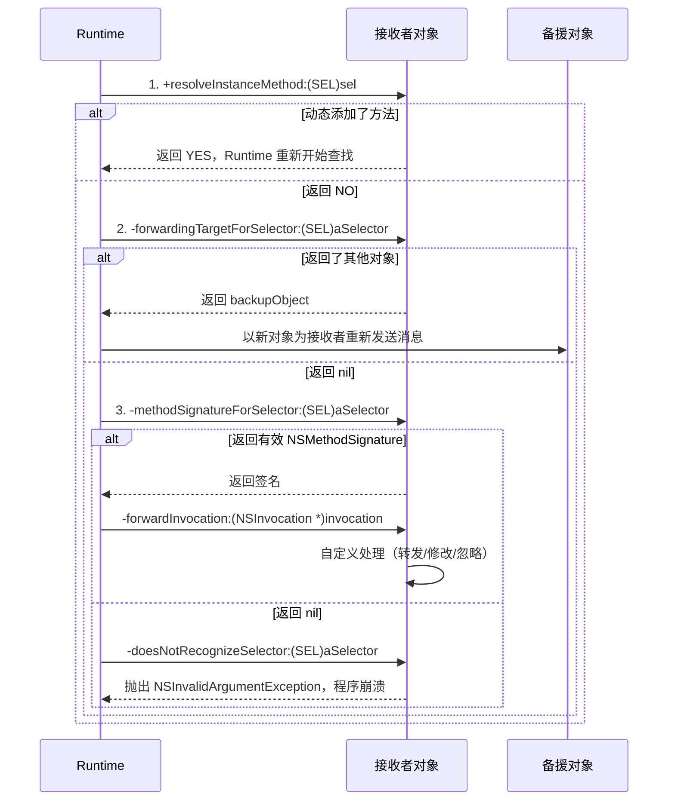
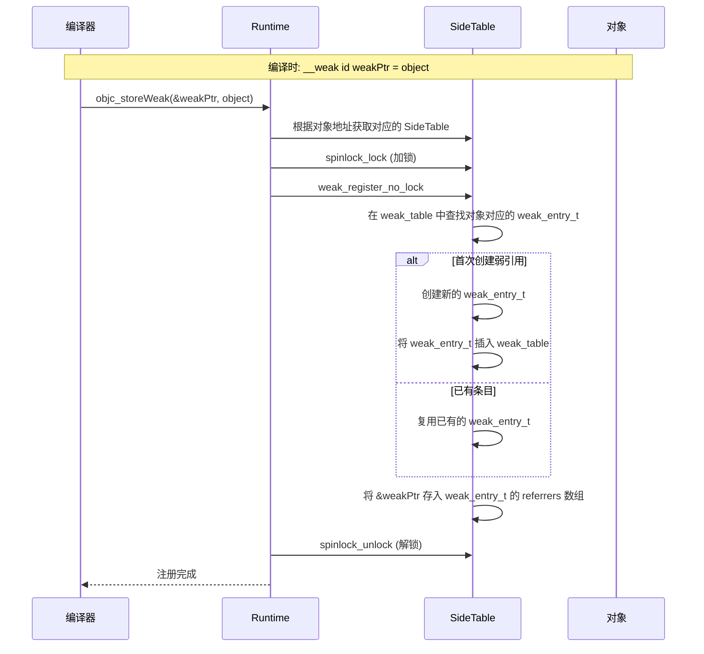
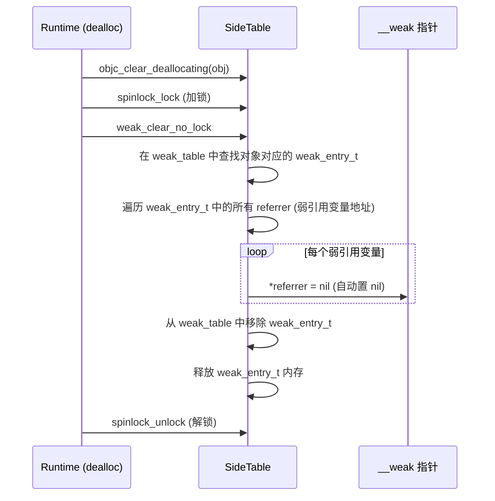
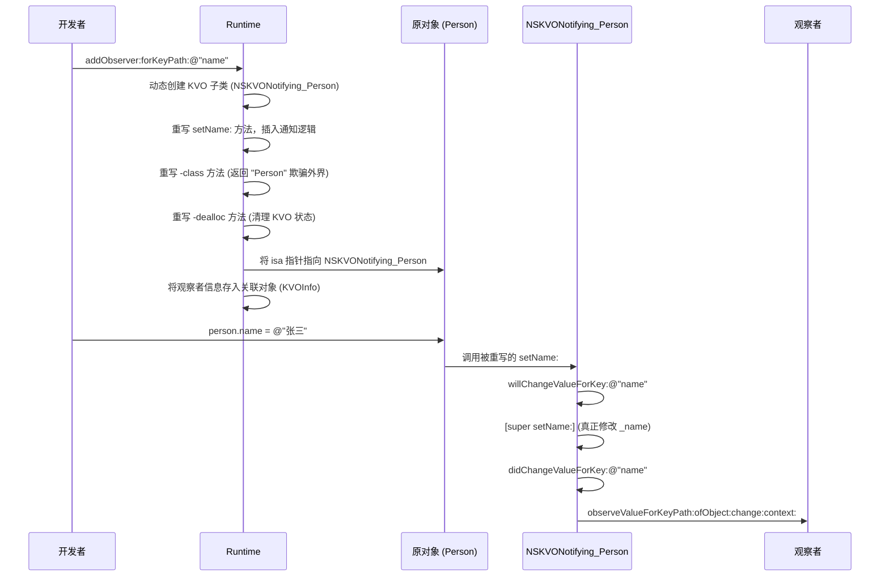

# Objective-C Runtime 完全解析手册（完整文字版）

> 本文档是 Objective-C Runtime 底层原理的系统性总结，涵盖从启动流程到内存管理、从消息发送到动态特性的完整链路。每部分均配有流程图、调用链和文字说明，力求理论与实践并重。

---

## 第一部分：Runtime 基础架构与启动流程

### 1.1 Runtime 初始化与 dyld 协作

Objective-C Runtime 并非一个独立启动的进程，而是作为 `libobjc.dylib` 动态库，在应用程序启动时由 `dyld`（动态链接器）负责加载和初始化。整个启动流程是理解 Runtime 生命周期的起点。

**核心入口函数：`_objc_init`**

当 `dyld` 加载 `libobjc` 时，会调用 `_objc_init` 函数。这个函数的工作非常关键，它的主要职责是向 `dyld` 注册几个在未来特定时机会被调用的回调函数。它本身并不执行类加载，而是为后续流程做准备。

**`_objc_init` 内部做了三件事：**
1. **初始化环境变量**：读取 `OBJC_PRINT_OPTIONS` 等环境变量，用于开启 Runtime 的调试日志输出。
2. **初始化全局数据结构**：为 `SideTables`（全局引用计数和弱引用表管理器）、`AutoreleasePool` 等准备内存空间。
3. **向 `dyld` 注册回调**：通过 `_dyld_objc_notify_register` 注册 `map_images`、`load_images` 和 `unmap_image` 三个核心回调。

**`dyld` 驱动的加载时序图**



**三个回调函数的详细职责：**

| 回调函数          | 触发时机                                                 | 核心职责                                                                                                                                                       |
| :---------------- | :------------------------------------------------------- | :------------------------------------------------------------------------------------------------------------------------------------------------------------- |
| **`map_images`**  | 每当一个新的镜像文件（可执行文件或动态库）被加载到内存时 | 调用 `_read_images`，解析 Mach-O 文件中的 `__objc_classlist`、`__objc_catlist`、`__objc_protolist` 等段，将类、分类、协议等元数据注册到 Runtime 的内存结构中。 |
| **`load_images`** | 当 `dyld` 完成所有镜像文件的初始化（包括所有依赖库）后   | 收集所有实现了 `+load` 方法的类和分类，按照“父类优先、类优先于分类、编译顺序决定分类顺序”的规则，依次调用它们。                                                |
| **`unmap_image`** | 当镜像文件被动态移除时（极少发生）                       | 清理该镜像文件在 Runtime 中注册的类、分类、协议等数据，释放相关内存。                                                                                          |

> **文字说明**：`map_images` 是整个 Runtime 加载类的核心时机。它保证了在 `+load` 方法被调用之前，所有类的结构（方法列表、属性、协议）都已经在内存中建立完成。`load_images` 则是在应用启动过程中，开发者可以介入的第一个时机点，因此常被用于 Method Swizzling 等需要在类加载时执行的初始化操作。

---

## 第二部分：对象模型与内存布局

### 2.1 对象与类的底层数据结构

在 Objective-C 中，对象、类和元类在底层都有对应的 C/C++ 结构体定义。这些结构体是 Runtime 操作一切对象的基础。

**`objc_object`：所有对象的根基**
```cpp
struct objc_object {
    isa_t isa;  // 在64位下是一个联合体，包含指针和位域信息
};
```
- 每个 Objective-C 对象的内存布局的第一个字段就是 `isa` 指针（在 64 位下是 `isa_t` 联合体）。
- `isa` 指针指向该对象所属的类对象（对于实例对象）或元类（对于类对象）。

**`objc_class`：类的结构定义**
```cpp
struct objc_class : objc_object {
    Class superclass;           // 指向父类的指针
    cache_t cache;              // 方法缓存，用于加速消息发送
    class_data_bits_t bits;     // 包含方法列表、属性列表、协议列表等
};
```
- `objc_class` 本身也是一个对象，因为它的第一个字段是 `isa`（继承自 `objc_object`）。
- `superclass` 指针构成了继承链。
- `bits` 字段包含了类的所有元数据，通过 `class_rw_t` 和 `class_ro_t` 的读写锁分离设计，支持在运行时动态添加方法。

**`isa` 指针的优化（64 位）**

在 64 位架构下，`isa` 不再是一个纯粹的指针，而是一个联合体：
```cpp
union isa_t {
    Class cls;                  // 直接指向类对象的指针
    uintptr_t bits;             // 位域，包含引用计数、标志位等
    struct {
        uintptr_t nonpointer : 1;   // 1: 启用优化
        uintptr_t has_assoc : 1;    // 是否有关联对象
        uintptr_t has_cxx_dtor : 1; // 是否有 C++ 析构函数
        uintptr_t shiftcls : 33;    // 类指针（位移存储）
        uintptr_t magic : 6;        // 用于调试的魔数
        uintptr_t weakly_referenced : 1; // 是否有弱引用
        uintptr_t deallocating : 1;  // 是否正在释放
        uintptr_t has_sidetable_rc : 1; // 引用计数是否溢出到 SideTable
        uintptr_t extra_rc : 19;    // 额外的引用计数（retain 次数减 1）
    };
};
```
- 这种设计使得 `isa` 同时承担了**类指针**和**引用计数**的双重职责，节省了内存并提高了访问速度。
- `extra_rc` 区域可以存储额外的 `retain` 次数（实际引用计数 = `extra_rc + 1`），大多数对象的引用计数都能被容纳。

### 2.2 元类闭环

元类（Meta Class）是 Runtime 中一个重要的设计，它解决了**类方法如何通过消息发送机制调用**的问题。类方法本质上也是消息，需要有一个接收者对象——这个接收者就是元类。

**完整的类关系链：**



**文字说明**：
1. **实例对象的 `isa`** 指向其**类对象**。
2. **类对象的 `isa`** 指向其**元类**。
3. **元类的 `isa`** 指向**根元类**（所有元类的顶端）。
4. **根元类的 `isa`** 指向**它自己**，形成闭环。

**为什么要设计这个闭环？**

因为类方法（如 `[MyClass classMethod]`）的调用，实际上是对元类发送消息。如果没有这个闭环，根元类的类方法（如 `+load`、`+initialize`）就无法被正确查找。这个设计保证了：
- 类方法的查找逻辑与实例方法完全一致（都通过 `isa` → 方法列表 → `superclass` 链）。
- 根元类的类方法最终可以由它自己响应，或者通过 `superclass` 链回退到 `NSObject`。

---

## 第三部分：消息发送与转发机制

### 3.1 消息发送核心流程

消息发送是 Runtime 最核心的功能。当编译器看到 `[receiver method]` 时，它会将其转换为 `objc_msgSend(receiver, @selector(method))` 函数调用。`objc_msgSend` 是用汇编语言实现的，以保证极致性能。

**`objc_msgSend` 的执行流程图：**



**文字说明：**
1. **快速路径**：`objc_msgSend` 首先通过 `isa` 获取对象的类，然后在类的 `cache_t`（方法缓存）中查找 `SEL`。这是一个哈希查找，速度极快（仅需几条汇编指令）。如果命中，直接跳转到 `IMP` 执行。
2. **慢速路径**：如果缓存未命中，调用 `lookUpImpOrForward` 函数。这个函数会：
   - 在当前类的方法列表（`method_list_t`）中查找，如果找到，填充缓存并返回 `IMP`。
   - 如果未找到，沿着 `superclass` 链向上遍历，在每个父类的方法列表中查找。
   - 如果直到根类（`NSObject`）仍未找到，进入动态方法解析阶段。
3. **性能优化**：缓存命中时，整个消息发送过程仅需 10-20 条汇编指令；而慢速路径可能涉及多次 C++ 函数调用和内存访问。因此，缓存是消息发送性能的关键。

### 3.2 消息转发三阶段

当 `lookUpImpOrForward` 在所有继承链中都找不到 `IMP` 时，Runtime 会进入消息转发流程。这是一个“三次机会”的容错机制。

**调用顺序与优先级（从高到低）：**



**文字说明：**

| 阶段                | 方法                                                   | 作用                                               | 适用场景                                                             | 性能开销 |
| :------------------ | :----------------------------------------------------- | :------------------------------------------------- | :------------------------------------------------------------------- | :------- |
| **1. 动态方法解析** | `+resolveInstanceMethod:`                              | 允许动态添加方法实现，处理后可重新走消息发送流程。 | 实现 `@dynamic` 属性（如 Core Data），或为不同设备版本提供不同实现。 | 最低     |
| **2. 快速转发**     | `-forwardingTargetForSelector:`                        | 将消息直接转发给另一个对象，简单高效。             | 对象组合、代理模式，有明确的备用接收者。                             | 较低     |
| **3. 完整转发**     | `-methodSignatureForSelector:` + `-forwardInvocation:` | 完全接管消息，可修改参数、返回值，甚至忽略消息。   | AOP 拦截、分布式消息处理、模拟多重继承。                             | 最高     |

### 3.3 `cache_t` 哈希表结构详解

方法缓存是消息发送性能的关键，其内部结构经过精心设计以实现极快的查找速度。

**数据结构定义：**
```cpp
struct cache_t {
    bucket_t *_buckets;  // 指向桶数组的指针
    mask_t _mask;        // 掩码值，等于 容量 - 1
    uint16_t _flags;     // 标志位
    uint16_t _occupied;  // 当前已占用的桶数量
};

struct bucket_t {
    SEL _sel;   // 方法选择器 (Key)
    IMP _imp;   // 函数实现指针 (Value)
};
```

**核心算法原理：**

1. **哈希索引计算**：使用位运算 `index = (uintptr_t)sel & _mask` 计算桶索引。由于 `_mask = 容量 - 1` 且容量始终是 2 的幂，`&` 运算等价于取模（`% 容量`），但速度快得多。

2. **冲突解决**：采用**开放寻址法**中的**线性探测**策略。当计算的索引位置已被占用时，依次检查下一个位置（`index = (index + 1) & _mask`），直到找到空位或探测完所有桶。

3. **扩容策略**：
   - **触发条件**：当 `_occupied` 占总容量的比例超过 **75%**（负载因子）时触发扩容。
   - **扩容过程**：新容量为旧容量的 **2 倍**，分配新桶数组，然后遍历旧桶数组，对每个有效条目（`_sel != NULL`）使用**新掩码**重新计算哈希索引并插入新桶。这个过程称为**重哈希（Rehashing）**。
   - **内存管理**：旧桶数组在迁移完成后被释放。

4. **查找流程（汇编伪代码）**：
```assembly
    mov     r11, [receiver]          ; 获取 receiver
    mov     r11, [r11 + isa_offset]  ; 获取 isa (类对象)
    mov     r10, [r11 + cache_offset]; 获取 _buckets 指针
    mov     r9, [r11 + mask_offset]  ; 获取 _mask
    and     r9, selector             ; index = selector & _mask
cache_search:
    mov     r8, [r10 + r9 * 8]       ; 获取 bucket 中的 SEL
    cmp     r8, selector             ; 比较 SEL 是否相等
    je      cache_hit                ; 命中则直接返回 IMP
    add     r9, #1                   ; 线性探测，索引+1
    and     r9, _mask                ; 确保不越界
    cmp     r9, _occupied            ; 检查是否探测完一圈
    jne     cache_search             ; 未找到则继续
cache_hit:
    mov     rax, [r10 + r9 * 8 + 8]  ; 获取对应的 IMP
    jmp     rax                      ; 直接跳转执行
```

---

## 第四部分：内存管理底层原理

### 4.1 引用计数存储方案

Objective-C 的引用计数存储采用了“内联优先，溢出转储”的两级策略，以平衡内存占用和效率。

**存储路径：**

1. **内联存储（fast path）**：对于绝大多数对象，引用计数存储在 `isa` 指针的 `extra_rc` 位域中（通常为 19 位）。`extra_rc` 存储的是**额外引用计数**，即实际引用计数减 1（因为对象创建时默认有一个引用）。所以如果 `extra_rc = 0`，实际引用计数为 1。

2. **溢出存储（slow path）**：当 `retain` 操作使引用计数超出 `extra_rc` 能表示的范围时，Runtime 会将对象的引用计数转移到 `SideTable` 的引用计数表中，并设置 `isa` 的 `has_sidetable_rc` 标志位为 1。此时 `extra_rc` 区域可能仍然存储一部分计数，但主体计数已移至 `SideTable`。

**为什么引用计数不单独存储在对象内存头部？**

- **内存节省**：为每个对象额外分配一个 4/8 字节的计数器，对于大量小对象（如 `NSString`、`NSNumber`）会造成巨大的内存浪费。将计数嵌入 `isa` 利用了已有的内存空间。
- **缓存友好**：`isa` 是对象访问的第一个字段，读取 `isa` 时计数也一并被加载到 CPU 缓存中，无需额外的内存访问。
- **性能优化**：普通的 `retain`/`release` 操作只需操作 `isa` 的位域，速度极快，只有溢出时才需要查找 `SideTable`。

### 4.2 `SideTable` 结构详解

`SideTable` 是 Runtime 管理引用计数和弱引用的全局数据结构。为了减少锁竞争，Runtime 会创建多个 `SideTable` 实例（通常为 8 个），根据对象地址哈希分配到不同的 `SideTable` 中。

**数据结构定义：**
```cpp
struct SideTable {
    spinlock_t slock;           // 自旋锁，保护当前 SideTable 的所有操作
    RefcountMap refcnts;        // 引用计数哈希表 (对象地址 -> 引用计数)
    weak_table_t weak_table;    // 弱引用哈希表 (对象地址 -> weak_entry_t)
};
```

**各组成部分的作用：**

| 组件             | 类型   | 作用                                                                        | 关键操作                                       |
| :--------------- | :----- | :-------------------------------------------------------------------------- | :--------------------------------------------- |
| **`slock`**      | 自旋锁 | 保护 `refcnts` 和 `weak_table` 的并发访问安全，确保多线程环境下数据一致性。 | `spinlock_lock` / `spinlock_unlock`            |
| **`refcnts`**    | 哈希表 | 存储引用计数溢出的对象的额外引用计数。键为对象地址，值为引用计数。          | `refcnts.find(obj)` / `refcnts[obj]++`         |
| **`weak_table`** | 哈希表 | 存储对象的所有弱引用信息。键为对象地址，值为 `weak_entry_t`。               | `weak_register_no_lock` / `weak_clear_no_lock` |

**为什么弱引用表操作需要加锁？**

1. **数据结构完整性**：`weak_table_t` 是一个全局哈希表，多线程同时插入或删除条目会破坏其内部链表/数组结构，导致内存损坏或死循环。
2. **对象销毁并发**：当一个对象的 `dealloc` 正在清理弱引用表时，另一个线程可能正在尝试向该对象注册新的弱引用。加锁保证“销毁”和“注册”过程的串行化，避免访问野指针。

### 4.3 弱引用 (`__weak`) 完整流程

`__weak` 是 Objective-C 中用于打破循环引用的关键机制。它的实现依赖 Runtime 的 `SideTable.weak_table`。

**注册弱引用（`objc_storeWeak`）流程：**



**对象销毁时清理弱引用（`weak_clear_no_lock`）流程：**



**文字说明：**
- **注册阶段**：编译器将 `__weak` 变量的赋值转换为 `objc_storeWeak` 调用，该函数在 `SideTable` 中记录弱引用变量的**地址**（而非值）。
- **置零阶段**：当对象引用计数归零，`dealloc` 触发 `weak_clear_no_lock`，遍历所有记录的弱引用变量地址，将它们指向的内容置为 `nil`，然后移除条目。
- **线程安全**：整个注册和清理过程都在 `SideTable` 的自旋锁保护下进行，保证多线程环境下的安全性。

### 4.4 对象销毁 (`dealloc`) 完整清理顺序

当对象的引用计数降至 0 时，Runtime 会调用 `dealloc` 方法进行销毁。这个过程遵循严格的顺序，确保所有资源都被正确释放。

**清理顺序（`objc_destructInstance` 内部）：**

```mermaid
flowchart TD
    A[release 使引用计数归零] --> B[调用 dealloc]
    B --> C[objc_destructInstance]
    C --> D[objc_clear_deallocating]
    D --> D1[weak_clear_no_lock: 所有 __weak 指针置 nil]
    D --> D2[引用计数从 SideTable 移除]
    C --> E[_object_remove_assocations]
    E --> E1[遍历并释放所有关联对象]
    C --> F[调用 C++ 析构函数]
    F --> F1[释放 C++ 实例变量]
    C --> G[调用 -dealloc 方法]
    G --> G1[开发者自定义清理代码]
    C --> H[free(obj)]
    H --> I[内存被回收]
```

**文字说明：**

| 顺序 | 操作                  | 说明                                                                                        |
| :--- | :-------------------- | :------------------------------------------------------------------------------------------ |
| 1    | **清除弱引用**        | `objc_clear_deallocating` 将所有 `__weak` 指针置 `nil`，并从 `SideTable` 中移除弱引用条目。 |
| 2    | **释放关联对象**      | `_object_remove_assocations` 销毁所有通过 `objc_setAssociatedObject` 关联到该对象上的对象。 |
| 3    | **调用 C++ 析构函数** | 如果对象有 C++ 实例变量（`__cxx_destruct`），调用其析构函数。                               |
| 4    | **调用 `-dealloc`**   | 执行开发者重写的 `-dealloc` 方法中的自定义清理代码。                                        |
| 5    | **释放内存**          | `free(obj)` 将对象内存归还给系统。                                                          |

---

## 第五部分：KVO 与 KVC 实现原理

### 5.1 KVO 底层完整流程

KVO（Key-Value Observing）是建立在 Runtime 动态子类化之上的机制。当调用 `addObserver:forKeyPath:options:context:` 时，Runtime 会通过 `isa-swizzling` 技术改变对象的类。

**KVO 完整流程图：**



**文字说明：**

1. **动态子类化**：`addObserver` 触发时，Runtime 会创建一个名为 `NSKVONotifying_OriginalClassName` 的新类，该类继承自原类。
2. **方法重写**：
   - **`setter` 方法**：在 setter 中插入 `willChangeValueForKey:` 和 `didChangeValueForKey:` 调用，并在前后发送通知。
   - **`-class` 方法**：重写使其返回原类名，对外部隐藏子类的存在。
   - **`-dealloc` 方法**：在对象销毁时自动清理 KVO 状态。
3. **`isa` 交换**：将对象的 `isa` 指针从原类指向新创建的子类，使对象“变成”子类的实例。
4. **触发通知**：当属性通过 `setter` 修改时，重写的 `setter` 会在修改前后调用 `willChange` 和 `didChange`，从而触发 `observeValueForKeyPath:` 回调。

**手动实现 KVO 需要重写的方法：**
- `+ (BOOL)automaticallyNotifiesObserversForKey:(NSString *)key`：返回 `NO` 关闭自动通知。
- `- (void)willChangeValueForKey:(NSString *)key`
- `- (void)didChangeValueForKey:(NSString *)key`

### 5.2 KVC 键值编码查找顺序

KVC 通过字符串键名间接访问属性，其查找逻辑是一套完整的“方法 → 成员变量 → 容错”的瀑布流。

**`setValue:forKey:` 查找顺序：**

1. 查找 **`setProperty:`** 方法 → 找到则调用，流程结束。
2. 查找 **`_setProperty:`** 方法 → 找到则调用，流程结束。
3. 直接访问成员变量（按顺序查找 `_property`、`_isProperty`、`property`、`isProperty`）→ 找到则直接赋值。
4. 调用 **`setValue:forUndefinedKey:`** → 默认抛出 `NSUndefinedKeyException`。

**`valueForKey:` 查找顺序：**

1. 查找 **`getProperty`**、**`property`**、**`isProperty`**、**`_getProperty`** 方法 → 找到则调用并返回值。
2. 如果属性是集合类型，查找 `countOfProperty`、`objectInPropertyAtIndex:` 等集合方法。
3. 直接访问成员变量（按顺序查找 `_property`、`_isProperty`、`property`、`isProperty`）→ 找到则直接返回值。
4. 调用 **`valueForUndefinedKey:`** → 默认抛出 `NSUndefinedKeyException`。

**容错方法：**

| 方法                        | 触发条件                                         | 默认行为                          | 应用场景                                    |
| :-------------------------- | :----------------------------------------------- | :-------------------------------- | :------------------------------------------ |
| `setValue:forUndefinedKey:` | `setter` 和成员变量都不存在                      | 抛出 `NSUndefinedKeyException`    | JSON 转 Model 时忽略未定义的字段            |
| `valueForUndefinedKey:`     | `getter` 和成员变量都不存在                      | 抛出 `NSUndefinedKeyException`    | 提供默认值或安全返回                        |
| `setNilValueForKey:`        | 对非对象类型（`int`/`float`/`struct`）设置 `nil` | 抛出 `NSInvalidArgumentException` | 为标量属性提供默认值（如 0、`NSZeroPoint`） |

---

## 第六部分：动态特性 API 详解

### 6.1 Method Swizzling 标准实现与风险

Method Swizzling 是 Runtime 最强大的动态能力之一，允许在运行时交换两个方法的实现。但它的强大也伴随着巨大的风险。

**标准实现（支持父类方法交换）：**

```objc
+ (void)load {
    static dispatch_once_t onceToken;
    dispatch_once(&onceToken, ^{
        Class class = [self class];
        SEL originalSel = @selector(originalMethod);
        SEL swizzledSel = @selector(swizzledMethod);
        
        Method originalMethod = class_getInstanceMethod(class, originalSel);
        Method swizzledMethod = class_getInstanceMethod(class, swizzledSel);
        
        // 关键步骤：尝试添加原始方法（处理子类未实现，从父类继承的情况）
        BOOL didAddMethod = class_addMethod(class, originalSel,
                                           method_getImplementation(swizzledMethod),
                                           method_getTypeEncoding(swizzledMethod));
        if (didAddMethod) {
            // 添加成功后，将 Swizzled 方法的 IMP 替换为原始 IMP
            class_replaceMethod(class, swizzledSel,
                               method_getImplementation(originalMethod),
                               method_getTypeEncoding(originalMethod));
        } else {
            // 当前类已实现 originalMethod，直接交换
            method_exchangeImplementations(originalMethod, swizzledMethod);
        }
    });
}

- (void)swizzledMethod {
    // 调用原始实现（注意：方法名是 swizzled，但实际调用的是 original）
    [self swizzledMethod];
    // 额外的自定义逻辑
    NSLog(@"Swizzled method called");
}
```

**为什么 `class_addMethod` 步骤是必要的？**

如果子类没有实现 `originalMethod`，直接 `method_exchangeImplementations` 会交换**父类**的方法，影响所有子类。`class_addMethod` 会先为当前类添加一个方法，然后再交换，将影响范围限制在当前类。

**常见风险与规避：**

| 风险             | 根因                            | 解决方案                                          |
| :--------------- | :------------------------------ | :------------------------------------------------ |
| **系统升级崩溃** | 系统方法名/实现在新版本中变化   | 版本适配、方法存在性检查                          |
| **多次交换混乱** | 不同组件或分类多次交换同一方法  | 使用 `dispatch_once` 保证只执行一次               |
| **父类子类冲突** | 交换父类方法影响所有子类        | 使用 `class_addMethod` 隔离影响                   |
| **调用链断裂**   | Swizzled 方法中忘记调用原始实现 | 确保调用原始 IMP，若忘记会导致原有逻辑丢失        |
| **线程安全**     | 多线程同时执行 Swizzling        | 在 `+load` 中执行（单线程），配合 `dispatch_once` |

### 6.2 动态创建类（`objc_allocateClassPair`）

Runtime 允许在运行时从零构造一个全新的类，这在某些框架级开发（如测试 Mock、动态代理）中非常有用。

**完整流程：**

```objc
// 1. 分配类对 (Class Pair)
Class newClass = objc_allocateClassPair([NSObject class], 
                                        "MyDynamicClass", 
                                        0);

// 2. 添加实例变量 (必须在 objc_registerClassPair 之前)
class_addIvar(newClass, "_myIvar", sizeof(id), 
              log2(sizeof(id)), "@");

// 3. 添加方法 (注册前后均可)
class_addMethod(newClass, @selector(dynamicMethod), 
                (IMP)dynamicMethodIMP, "v@:");

// 4. 注册类，使其可以用于 alloc 创建实例
objc_registerClassPair(newClass);

// 5. 使用
id instance = [[newClass alloc] init];
[instance performSelector:@selector(dynamicMethod)];

// 6. 销毁类 (需确保无存活实例)
objc_disposeClassPair(newClass);
```

**文字说明：**

- `objc_allocateClassPair` 分配类所需的内存，建立类的基础结构（`isa`、`superclass`、方法列表等）。
- `class_addIvar` 必须在 `objc_registerClassPair` **之前**调用，因为类的实例大小在注册时就已固定。
- `objc_registerClassPair` 将类注册到全局类表中，此后该类才能正常使用（`alloc`、消息发送等）。
- `objc_disposeClassPair` 销毁类，前提是没有任何该类的实例存活，否则会导致崩溃。

---

## 第七部分：ARC 编译器与 Runtime 协作

ARC（Automatic Reference Counting）是编译器与 Runtime 协作的典范。它不是单纯由编译器或 Runtime 完成，而是两者各司其职，共同实现自动内存管理。

### 7.1 编译器 (Clang) 的职责

编译器在编译期进行静态分析和代码插桩：

1. **分析对象生命周期**：根据变量修饰符（`__strong`、`__weak`、`__autoreleasing`）和代码作用域，确定 `retain`/`release`/`autorelease` 的插入位置。
2. **插入 Runtime 函数调用**：
   - `__strong` 变量赋值 → 调用 `objc_storeStrong`
   - `__weak` 变量赋值 → 调用 `objc_storeWeak`
   - `autorelease` 对象 → 调用 `objc_autorelease`
3. **处理 `return` 返回值**：根据方法命名规则（`alloc`/`new`/`copy`/`mutableCopy`）决定是否自动 `autorelease`。

### 7.2 Runtime 的职责

Runtime 提供底层函数的具体实现：

1. **`objc_retain`**：调用对象的 `retain` 方法，增加引用计数。
2. **`objc_release`**：调用对象的 `release` 方法，减少引用计数，归零时触发 `dealloc`。
3. **`objc_autorelease`**：将对象加入当前 `AutoreleasePool`。
4. **`objc_storeStrong`**：管理 `__strong` 变量的赋值，先 `retain` 新值，再 `release` 旧值。
5. **`objc_storeWeak`**：管理 `__weak` 变量的赋值，注册到 `SideTable.weak_table`。

```cpp
// objc_storeStrong 伪代码
void objc_storeStrong(id *location, id obj) {
    id prev = *location;
    if (obj == prev) return;
    objc_retain(obj);
    *location = obj;
    objc_release(prev);
}
```

---

## 第八部分：Runtime 实用场景与风险总结

### 8.1 业务落地场景

| 场景                  | 实现方式                                         | 核心 Runtime API                                    |
| :-------------------- | :----------------------------------------------- | :-------------------------------------------------- |
| **无埋点统计**        | Swizzle `UIViewController` 的 `viewDidAppear:`   | `method_exchangeImplementations`                    |
| **统一异常捕获**      | Swizzle `NSObject` 的 `forwardInvocation:`       | `method_exchangeImplementations`                    |
| **UI 按钮防重复点击** | Swizzle `UIControl` 的 `sendAction:to:forEvent:` | `method_exchangeImplementations`                    |
| **字典转模型**        | 遍历类属性列表，使用 KVC 赋值                    | `class_copyPropertyList`、`setValue:forKey:`        |
| **JSBridge 参数校验** | 使用 `NSProxy` 代理拦截所有方法调用              | `forwardInvocation:`、`methodSignatureForSelector:` |
| **动态 Mock 测试**    | 动态创建类并添加方法                             | `objc_allocateClassPair`、`class_addMethod`         |

### 8.2 常见风险与规避

| 风险                       | 根因                                   | 解决方案                                      |
| :------------------------- | :------------------------------------- | :-------------------------------------------- |
| **系统升级崩溃**           | 系统方法名/实现变更                    | 版本适配、防御性检查、减少 Swizzling          |
| **关联对象内存泄漏**       | `OBJC_ASSOCIATION_RETAIN` 导致循环引用 | 使用弱引用包装类（`WeakObjectContainer`）     |
| **KVO 野指针崩溃**         | 观察者未在 `dealloc` 中移除            | 在 `dealloc` 中确保调用 `removeObserver`      |
| **分类 `weak` 关联野指针** | 关联对象不支持 `weak` 策略             | 使用弱引用容器包装后关联                      |
| **字典转模型卡顿**         | 大量 KVC 动态调用                      | 缓存 `IMP`、使用 `objc_msgSend` 直接调用      |
| **多 Swizzling 冲突**      | 多个组件交换同一方法                   | 统一管理 Swizzling 逻辑，使用 `dispatch_once` |
| **动态类内存泄漏**         | 未调用 `objc_disposeClassPair`         | 确保在类无存活实例时销毁                      |

### 8.3 Runtime 使用黄金法则

1. **优先选择编译期安全方案**（继承、组合、协议），将 Runtime 动态方案作为**最后手段**。
2. **理解底层原理**：在操作 `isa`、方法列表、关联对象之前，必须清楚知晓其内存管理和线程安全模型。
3. **封装与隔离**：将所有 Runtime 操作封装在独立的工具类或组件中，并提供清晰的接口和文档。
4. **防御式编程**：对系统版本、方法存在性、类型转换等进行充分校验。
5. **测试与监控**：涉及 Runtime 的代码，必须有完整的单元测试和线上监控，以便及时发现兼容性或性能回归问题。

---

> **结语**：Objective-C Runtime 是这门语言动态能力的基石。它赋予了开发者在运行时查询、修改甚至重构对象行为的能力，同时也要求开发者具备更深的系统理解和更强的责任意识。希望这份文档能帮助您更安全、更高效地运用 Runtime 的力量。