# Objective-C Runtime 完全解析手册（完整文字版）

> 本文档是 Objective-C Runtime 底层原理的系统性总结，涵盖从启动流程到内存管理、从消息发送到动态特性的完整链路。每部分均配有流程图、调用链和文字说明，力求理论与实践并重。

---

## 第一部分：Runtime 基础架构与启动流程

### 1.1 Runtime 初始化与 dyld 协作

Objective-C Runtime 并非一个独立启动的进程，而是作为 `libobjc.dylib` 动态库，在应用程序启动时由 `dyld`（动态链接器）负责加载和初始化。整个启动流程是理解 Runtime 生命周期的起点。

**核心入口函数：`_objc_init`**

当 `dyld` 加载 `libobjc` 时，会调用 `_objc_init` 函数。这个函数的工作非常关键，它的主要职责是向 `dyld` 注册几个在未来特定时机会被调用的回调函数。它本身并不执行类加载，而是为后续流程做准备。

**`_objc_init` 内部做了三件事：**
1. **初始化环境变量**：读取 `OBJC_PRINT_OPTIONS` 等环境变量，用于开启 Runtime 的调试日志输出。
2. **初始化全局数据结构**：为 `SideTables`（全局引用计数和弱引用表管理器）、`AutoreleasePool` 等准备内存空间。
3. **向 `dyld` 注册回调**：通过 `_dyld_objc_notify_register` 注册 `map_images`、`load_images` 和 `unmap_image` 三个核心回调。

**`dyld` 驱动的加载时序图**

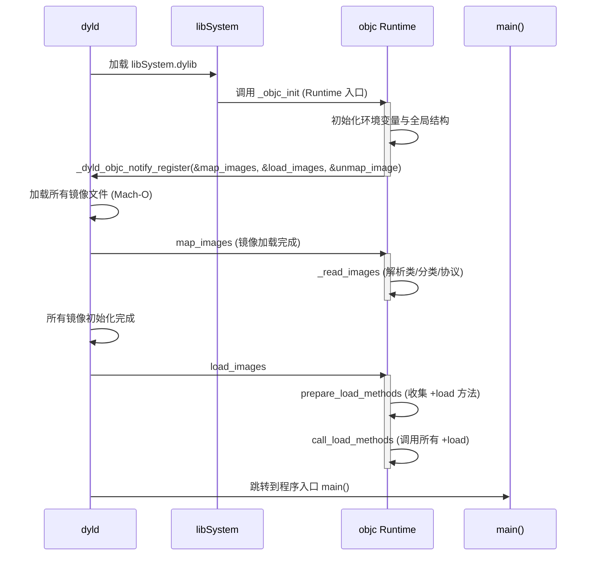
```mermaid
sequenceDiagram
    participant dyld
    participant libSystem
    participant objc as objc Runtime
    participant main as main()

    dyld->>libSystem: 加载 libSystem.dylib
    libSystem->>objc: 调用 _objc_init (Runtime 入口)
    activate objc
    objc->>objc: 初始化环境变量与全局结构
    objc->>dyld: _dyld_objc_notify_register(&map_images, &load_images, &unmap_image)
    deactivate objc
    
    dyld->>dyld: 加载所有镜像文件 (Mach-O)
    dyld->>objc: map_images (镜像加载完成)
    activate objc
    objc->>objc: _read_images (解析类/分类/协议)
    deactivate objc
    
    dyld->>dyld: 所有镜像初始化完成
    dyld->>objc: load_images
    activate objc
    objc->>objc: prepare_load_methods (收集 +load 方法)
    objc->>objc: call_load_methods (调用所有 +load)
    deactivate objc
    
    dyld->>main: 跳转到程序入口 main()
```

**三个回调函数的详细职责：**

| 回调函数          | 触发时机                                                 | 核心职责                                                                                                                                                       |
| :---------------- | :------------------------------------------------------- | :------------------------------------------------------------------------------------------------------------------------------------------------------------- |
| **`map_images`**  | 每当一个新的镜像文件（可执行文件或动态库）被加载到内存时 | 调用 `_read_images`，解析 Mach-O 文件中的 `__objc_classlist`、`__objc_catlist`、`__objc_protolist` 等段，将类、分类、协议等元数据注册到 Runtime 的内存结构中。 |
| **`load_images`** | 当 `dyld` 完成所有镜像文件的初始化（包括所有依赖库）后   | 收集所有实现了 `+load` 方法的类和分类，按照“父类优先、类优先于分类、编译顺序决定分类顺序”的规则，依次调用它们。                                                |
| **`unmap_image`** | 当镜像文件被动态移除时（极少发生）                       | 清理该镜像文件在 Runtime 中注册的类、分类、协议等数据，释放相关内存。                                                                                          |

> **文字说明**：`map_images` 是整个 Runtime 加载类的核心时机。它保证了在 `+load` 方法被调用之前，所有类的结构（方法列表、属性、协议）都已经在内存中建立完成。`load_images` 则是在应用启动过程中，开发者可以介入的第一个时机点，因此常被用于 Method Swizzling 等需要在类加载时执行的初始化操作。

---

## 第二部分：对象模型与内存布局

### 2.1 对象与类的底层数据结构

在 Objective-C 中，对象、类和元类在底层都有对应的 C/C++ 结构体定义。这些结构体是 Runtime 操作一切对象的基础。

**`objc_object`：所有对象的根基**
```cpp
struct objc_object {
    isa_t isa;  // 在64位下是一个联合体，包含指针和位域信息
};
```
- 每个 Objective-C 对象的内存布局的第一个字段就是 `isa` 指针（在 64 位下是 `isa_t` 联合体）。
- `isa` 指针指向该对象所属的类对象（对于实例对象）或元类（对于类对象）。

**`objc_class`：类的结构定义**
```cpp
struct objc_class : objc_object {
    Class superclass;           // 指向父类的指针
    cache_t cache;              // 方法缓存，用于加速消息发送
    class_data_bits_t bits;     // 包含方法列表、属性列表、协议列表等
};
```
- `objc_class` 本身也是一个对象，因为它的第一个字段是 `isa`（继承自 `objc_object`）。
- `superclass` 指针构成了继承链。
- `bits` 字段包含了类的所有元数据，通过 `class_rw_t` 和 `class_ro_t` 的读写锁分离设计，支持在运行时动态添加方法。

**`isa` 指针的优化（64 位）**

在 64 位架构下，`isa` 不再是一个纯粹的指针，而是一个联合体：
```cpp
union isa_t {
    Class cls;                  // 直接指向类对象的指针
    uintptr_t bits;             // 位域，包含引用计数、标志位等
    struct {
        uintptr_t nonpointer : 1;   // 1: 启用优化
        uintptr_t has_assoc : 1;    // 是否有关联对象
        uintptr_t has_cxx_dtor : 1; // 是否有 C++ 析构函数
        uintptr_t shiftcls : 33;    // 类指针（位移存储）
        uintptr_t magic : 6;        // 用于调试的魔数
        uintptr_t weakly_referenced : 1; // 是否有弱引用
        uintptr_t deallocating : 1;  // 是否正在释放
        uintptr_t has_sidetable_rc : 1; // 引用计数是否溢出到 SideTable
        uintptr_t extra_rc : 19;    // 额外的引用计数（retain 次数减 1）
    };
};
```
- 这种设计使得 `isa` 同时承担了**类指针**和**引用计数**的双重职责，节省了内存并提高了访问速度。
- `extra_rc` 区域可以存储额外的 `retain` 次数（实际引用计数 = `extra_rc + 1`），大多数对象的引用计数都能被容纳。

### 2.2 元类闭环

元类（Meta Class）是 Runtime 中一个重要的设计，它解决了**类方法如何通过消息发送机制调用**的问题。类方法本质上也是消息，需要有一个接收者对象——这个接收者就是元类。

**完整的类关系链：**

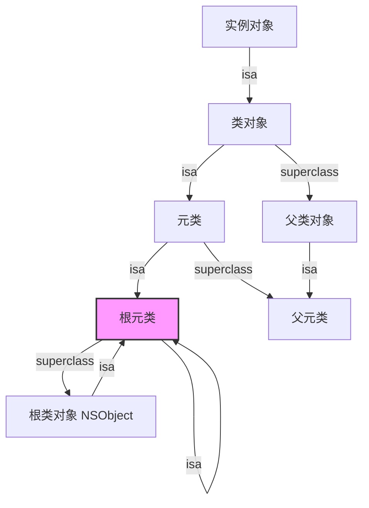
```mermaid
graph TD
    Instance[实例对象] -->|isa| Class[类对象]
    Class -->|isa| MetaClass[元类]
    MetaClass -->|isa| RootMeta[根元类]
    RootMeta -->|isa| RootMeta
    
    Class -->|superclass| SuperClass[父类对象]
    MetaClass -->|superclass| SuperMeta[父元类]
    RootMeta -->|superclass| RootClass[根类对象 NSObject]
    SuperClass -->|isa| SuperMeta
    RootClass -->|isa| RootMeta
    
    style RootMeta fill:#f9f,stroke:#333,stroke-width:2px
```

**文字说明**：
1. **实例对象的 `isa`** 指向其**类对象**。
2. **类对象的 `isa`** 指向其**元类**。
3. **元类的 `isa`** 指向**根元类**（所有元类的顶端）。
4. **根元类的 `isa`** 指向**它自己**，形成闭环。

**为什么要设计这个闭环？**

因为类方法（如 `[MyClass classMethod]`）的调用，实际上是对元类发送消息。如果没有这个闭环，根元类的类方法（如 `+load`、`+initialize`）就无法被正确查找。这个设计保证了：
- 类方法的查找逻辑与实例方法完全一致（都通过 `isa` → 方法列表 → `superclass` 链）。
- 根元类的类方法最终可以由它自己响应，或者通过 `superclass` 链回退到 `NSObject`。

---

## 第三部分：消息发送与转发机制

### 3.1 消息发送核心流程

消息发送是 Runtime 最核心的功能。当编译器看到 `[receiver method]` 时，它会将其转换为 `objc_msgSend(receiver, @selector(method))` 函数调用。`objc_msgSend` 是用汇编语言实现的，以保证极致性能。

**`objc_msgSend` 的执行流程图：**

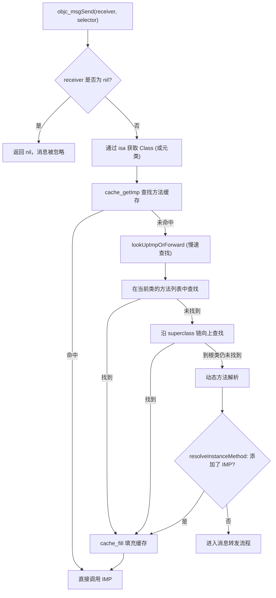
```mermaid
flowchart TD
    A["objc_msgSend(receiver, selector)"] --> B{receiver 是否为 nil?}
    B -->|是| C[返回 nil，消息被忽略]
    B -->|否| D["通过 isa 获取 Class (或元类)"]
    D --> E[cache_getImp 查找方法缓存]
    E -->|命中| F[直接调用 IMP]
    E -->|未命中| G["lookUpImpOrForward (慢速查找)"]
    
    G --> H[在当前类的方法列表中查找]
    H -->|找到| I[cache_fill 填充缓存]
    I --> F
    H -->|未找到| J[沿 superclass 链向上查找]
    J -->|找到| I
    J -->|到根类仍未找到| K[动态方法解析]
    K --> L{"resolveInstanceMethod: 添加了 IMP?"}
    L -->|是| I
    L -->|否| M[进入消息转发流程]
```

**文字说明：**
1. **快速路径**：`objc_msgSend` 首先通过 `isa` 获取对象的类，然后在类的 `cache_t`（方法缓存）中查找 `SEL`。这是一个哈希查找，速度极快（仅需几条汇编指令）。如果命中，直接跳转到 `IMP` 执行。
2. **慢速路径**：如果缓存未命中，调用 `lookUpImpOrForward` 函数。这个函数会：
   - 在当前类的方法列表（`method_list_t`）中查找，如果找到，填充缓存并返回 `IMP`。
   - 如果未找到，沿着 `superclass` 链向上遍历，在每个父类的方法列表中查找。
   - 如果直到根类（`NSObject`）仍未找到，进入动态方法解析阶段。
3. **性能优化**：缓存命中时，整个消息发送过程仅需 10-20 条汇编指令；而慢速路径可能涉及多次 C++ 函数调用和内存访问。因此，缓存是消息发送性能的关键。

### 3.2 消息转发三阶段

当 `lookUpImpOrForward` 在所有继承链中都找不到 `IMP` 时，Runtime 会进入消息转发流程。这是一个“三次机会”的容错机制。

**调用顺序与优先级（从高到低）：**

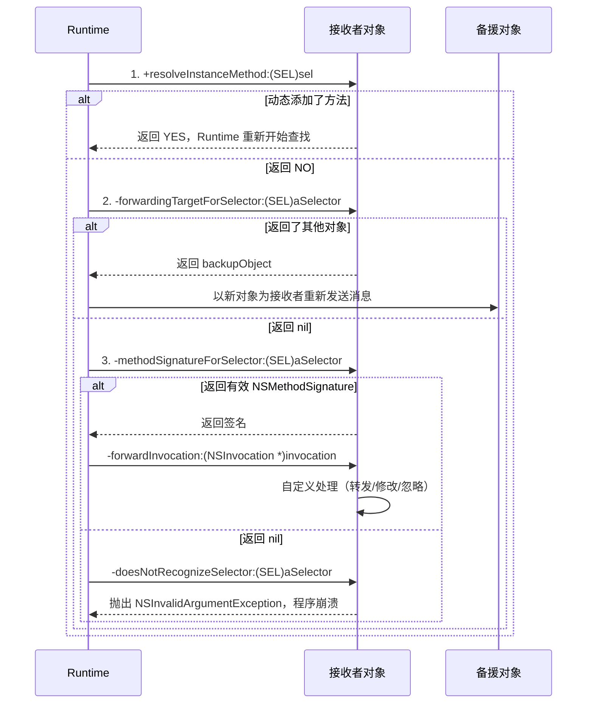
```mermaid
sequenceDiagram
    participant Runtime
    participant Object as 接收者对象
    participant Backup as 备援对象

    Runtime->>Object: 1. +resolveInstanceMethod:(SEL)sel
    alt 动态添加了方法
        Object-->>Runtime: 返回 YES，Runtime 重新开始查找
    else 返回 NO
        Runtime->>Object: 2. -forwardingTargetForSelector:(SEL)aSelector
        alt 返回了其他对象
            Object-->>Runtime: 返回 backupObject
            Runtime->>Backup: 以新对象为接收者重新发送消息
        else 返回 nil
            Runtime->>Object: 3. -methodSignatureForSelector:(SEL)aSelector
            alt 返回有效 NSMethodSignature
                Object-->>Runtime: 返回签名
                Runtime->>Object: -forwardInvocation:(NSInvocation *)invocation
                Object->>Object: 自定义处理（转发/修改/忽略）
            else 返回 nil
                Runtime->>Object: -doesNotRecognizeSelector:(SEL)aSelector
                Object-->>Runtime: 抛出 NSInvalidArgumentException，程序崩溃
            end
        end
    end
```

**文字说明：**

| 阶段                | 方法                                                   | 作用                                               | 适用场景                                                             | 性能开销 |
| :------------------ | :----------------------------------------------------- | :------------------------------------------------- | :------------------------------------------------------------------- | :------- |
| **1. 动态方法解析** | `+resolveInstanceMethod:`                              | 允许动态添加方法实现，处理后可重新走消息发送流程。 | 实现 `@dynamic` 属性（如 Core Data），或为不同设备版本提供不同实现。 | 最低     |
| **2. 快速转发**     | `-forwardingTargetForSelector:`                        | 将消息直接转发给另一个对象，简单高效。             | 对象组合、代理模式，有明确的备用接收者。                             | 较低     |
| **3. 完整转发**     | `-methodSignatureForSelector:` + `-forwardInvocation:` | 完全接管消息，可修改参数、返回值，甚至忽略消息。   | AOP 拦截、分布式消息处理、模拟多重继承。                             | 最高     |

### 3.3 `cache_t` 哈希表结构详解

方法缓存是消息发送性能的关键，其内部结构经过精心设计以实现极快的查找速度。

**数据结构定义：**
```cpp
struct cache_t {
    bucket_t *_buckets;  // 指向桶数组的指针
    mask_t _mask;        // 掩码值，等于 容量 - 1
    uint16_t _flags;     // 标志位
    uint16_t _occupied;  // 当前已占用的桶数量
};

struct bucket_t {
    SEL _sel;   // 方法选择器 (Key)
    IMP _imp;   // 函数实现指针 (Value)
};
```

**核心算法原理：**

1. **哈希索引计算**：使用位运算 `index = (uintptr_t)sel & _mask` 计算桶索引。由于 `_mask = 容量 - 1` 且容量始终是 2 的幂，`&` 运算等价于取模（`% 容量`），但速度快得多。

2. **冲突解决**：采用**开放寻址法**中的**线性探测**策略。当计算的索引位置已被占用时，依次检查下一个位置（`index = (index + 1) & _mask`），直到找到空位或探测完所有桶。

3. **扩容策略**：
   - **触发条件**：当 `_occupied` 占总容量的比例超过 **75%**（负载因子）时触发扩容。
   - **扩容过程**：新容量为旧容量的 **2 倍**，分配新桶数组，然后遍历旧桶数组，对每个有效条目（`_sel != NULL`）使用**新掩码**重新计算哈希索引并插入新桶。这个过程称为**重哈希（Rehashing）**。
   - **内存管理**：旧桶数组在迁移完成后被释放。

4. **查找流程（汇编伪代码）**：
```assembly
    mov     r11, [receiver]          ; 获取 receiver
    mov     r11, [r11 + isa_offset]  ; 获取 isa (类对象)
    mov     r10, [r11 + cache_offset]; 获取 _buckets 指针
    mov     r9, [r11 + mask_offset]  ; 获取 _mask
    and     r9, selector             ; index = selector & _mask
cache_search:
    mov     r8, [r10 + r9 * 8]       ; 获取 bucket 中的 SEL
    cmp     r8, selector             ; 比较 SEL 是否相等
    je      cache_hit                ; 命中则直接返回 IMP
    add     r9, #1                   ; 线性探测，索引+1
    and     r9, _mask                ; 确保不越界
    cmp     r9, _occupied            ; 检查是否探测完一圈
    jne     cache_search             ; 未找到则继续
cache_hit:
    mov     rax, [r10 + r9 * 8 + 8]  ; 获取对应的 IMP
    jmp     rax                      ; 直接跳转执行
```

---

## 第四部分：内存管理底层原理

### 4.1 引用计数存储方案

Objective-C 的引用计数存储采用了“内联优先，溢出转储”的两级策略，以平衡内存占用和效率。

**存储路径：**

1. **内联存储（fast path）**：对于绝大多数对象，引用计数存储在 `isa` 指针的 `extra_rc` 位域中（通常为 19 位）。`extra_rc` 存储的是**额外引用计数**，即实际引用计数减 1（因为对象创建时默认有一个引用）。所以如果 `extra_rc = 0`，实际引用计数为 1。

2. **溢出存储（slow path）**：当 `retain` 操作使引用计数超出 `extra_rc` 能表示的范围时，Runtime 会将对象的引用计数转移到 `SideTable` 的引用计数表中，并设置 `isa` 的 `has_sidetable_rc` 标志位为 1。此时 `extra_rc` 区域可能仍然存储一部分计数，但主体计数已移至 `SideTable`。

**为什么引用计数不单独存储在对象内存头部？**

- **内存节省**：为每个对象额外分配一个 4/8 字节的计数器，对于大量小对象（如 `NSString`、`NSNumber`）会造成巨大的内存浪费。将计数嵌入 `isa` 利用了已有的内存空间。
- **缓存友好**：`isa` 是对象访问的第一个字段，读取 `isa` 时计数也一并被加载到 CPU 缓存中，无需额外的内存访问。
- **性能优化**：普通的 `retain`/`release` 操作只需操作 `isa` 的位域，速度极快，只有溢出时才需要查找 `SideTable`。

### 4.2 `SideTable` 结构详解

`SideTable` 是 Runtime 管理引用计数和弱引用的全局数据结构。为了减少锁竞争，Runtime 会创建多个 `SideTable` 实例（通常为 8 个），根据对象地址哈希分配到不同的 `SideTable` 中。

**数据结构定义：**
```cpp
struct SideTable {
    spinlock_t slock;           // 自旋锁，保护当前 SideTable 的所有操作
    RefcountMap refcnts;        // 引用计数哈希表 (对象地址 -> 引用计数)
    weak_table_t weak_table;    // 弱引用哈希表 (对象地址 -> weak_entry_t)
};
```

**各组成部分的作用：**

| 组件             | 类型   | 作用                                                                        | 关键操作                                       |
| :--------------- | :----- | :-------------------------------------------------------------------------- | :--------------------------------------------- |
| **`slock`**      | 自旋锁 | 保护 `refcnts` 和 `weak_table` 的并发访问安全，确保多线程环境下数据一致性。 | `spinlock_lock` / `spinlock_unlock`            |
| **`refcnts`**    | 哈希表 | 存储引用计数溢出的对象的额外引用计数。键为对象地址，值为引用计数。          | `refcnts.find(obj)` / `refcnts[obj]++`         |
| **`weak_table`** | 哈希表 | 存储对象的所有弱引用信息。键为对象地址，值为 `weak_entry_t`。               | `weak_register_no_lock` / `weak_clear_no_lock` |

**为什么弱引用表操作需要加锁？**

1. **数据结构完整性**：`weak_table_t` 是一个全局哈希表，多线程同时插入或删除条目会破坏其内部链表/数组结构，导致内存损坏或死循环。
2. **对象销毁并发**：当一个对象的 `dealloc` 正在清理弱引用表时，另一个线程可能正在尝试向该对象注册新的弱引用。加锁保证“销毁”和“注册”过程的串行化，避免访问野指针。

### 4.3 弱引用 (`__weak`) 完整流程

`__weak` 是 Objective-C 中用于打破循环引用的关键机制。它的实现依赖 Runtime 的 `SideTable.weak_table`。

**注册弱引用（`objc_storeWeak`）流程：**

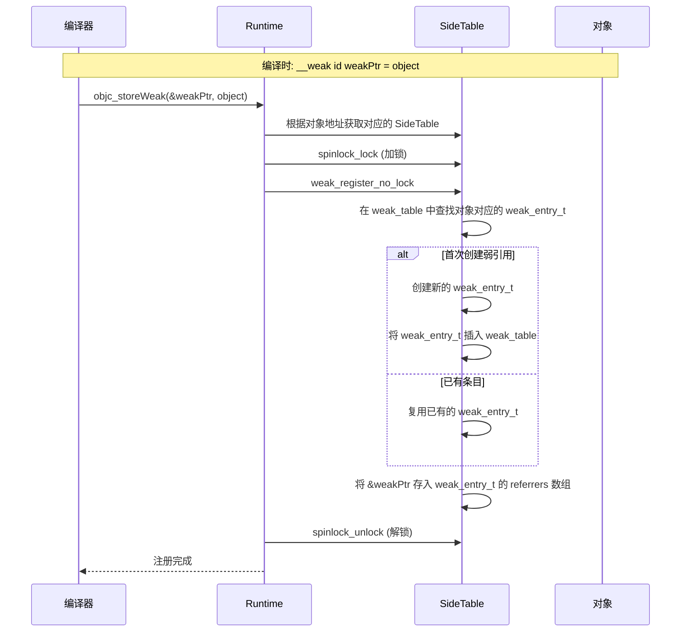
```mermaid
sequenceDiagram
    participant Compiler as 编译器
    participant Runtime as Runtime
    participant SideTable
    participant Object as 对象

    Note over Compiler, Object: 编译时: __weak id weakPtr = object;
    Compiler->>Runtime: objc_storeWeak(&weakPtr, object)
    Runtime->>SideTable: 根据对象地址获取对应的 SideTable
    Runtime->>SideTable: spinlock_lock (加锁)
    Runtime->>SideTable: weak_register_no_lock
    SideTable->>SideTable: 在 weak_table 中查找对象对应的 weak_entry_t
    alt 首次创建弱引用
        SideTable->>SideTable: 创建新的 weak_entry_t
        SideTable->>SideTable: 将 weak_entry_t 插入 weak_table
    else 已有条目
        SideTable->>SideTable: 复用已有的 weak_entry_t
    end
    SideTable->>SideTable: 将 &weakPtr 存入 weak_entry_t 的 referrers 数组
    Runtime->>SideTable: spinlock_unlock (解锁)
    Runtime-->>Compiler: 注册完成
```

**对象销毁时清理弱引用（`weak_clear_no_lock`）流程：**

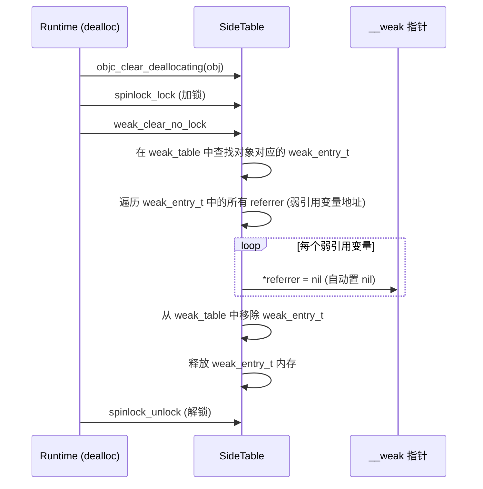
```mermaid
sequenceDiagram
    participant Runtime as Runtime (dealloc)
    participant SideTable
    participant WeakPtr as __weak 指针

    Runtime->>SideTable: objc_clear_deallocating(obj)
    Runtime->>SideTable: spinlock_lock (加锁)
    Runtime->>SideTable: weak_clear_no_lock
    SideTable->>SideTable: 在 weak_table 中查找对象对应的 weak_entry_t
    SideTable->>SideTable: 遍历 weak_entry_t 中的所有 referrer (弱引用变量地址)
    loop 每个弱引用变量
        SideTable->>WeakPtr: *referrer = nil (自动置 nil)
    end
    SideTable->>SideTable: 从 weak_table 中移除 weak_entry_t
    SideTable->>SideTable: 释放 weak_entry_t 内存
    Runtime->>SideTable: spinlock_unlock (解锁)
```

**文字说明：**
- **注册阶段**：编译器将 `__weak` 变量的赋值转换为 `objc_storeWeak` 调用，该函数在 `SideTable` 中记录弱引用变量的**地址**（而非值）。
- **置零阶段**：当对象引用计数归零，`dealloc` 触发 `weak_clear_no_lock`，遍历所有记录的弱引用变量地址，将它们指向的内容置为 `nil`，然后移除条目。
- **线程安全**：整个注册和清理过程都在 `SideTable` 的自旋锁保护下进行，保证多线程环境下的安全性。

### 4.4 对象销毁 (`dealloc`) 完整清理顺序

当对象的引用计数降至 0 时，Runtime 会调用 `dealloc` 方法进行销毁。这个过程遵循严格的顺序，确保所有资源都被正确释放。

**清理顺序（`objc_destructInstance` 内部）：**

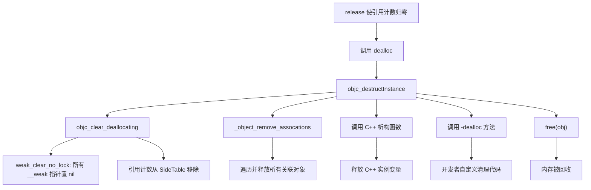
```mermaid
flowchart TD
    A[release 使引用计数归零] --> B[调用 dealloc]
    B --> C[objc_destructInstance]
    C --> D[objc_clear_deallocating]
    D --> D1[weak_clear_no_lock: 所有 __weak 指针置 nil]
    D --> D2[引用计数从 SideTable 移除]
    C --> E[_object_remove_assocations]
    E --> E1[遍历并释放所有关联对象]
    C --> F[调用 C++ 析构函数]
    F --> F1[释放 C++ 实例变量]
    C --> G[调用 -dealloc 方法]
    G --> G1[开发者自定义清理代码]
    C --> H["free(obj)"]
    H --> I[内存被回收]
```

**文字说明：**

| 顺序 | 操作                  | 说明                                                                                        |
| :--- | :-------------------- | :------------------------------------------------------------------------------------------ |
| 1    | **清除弱引用**        | `objc_clear_deallocating` 将所有 `__weak` 指针置 `nil`，并从 `SideTable` 中移除弱引用条目。 |
| 2    | **释放关联对象**      | `_object_remove_assocations` 销毁所有通过 `objc_setAssociatedObject` 关联到该对象上的对象。 |
| 3    | **调用 C++ 析构函数** | 如果对象有 C++ 实例变量（`__cxx_destruct`），调用其析构函数。                               |
| 4    | **调用 `-dealloc`**   | 执行开发者重写的 `-dealloc` 方法中的自定义清理代码。                                        |
| 5    | **释放内存**          | `free(obj)` 将对象内存归还给系统。                                                          |

---

## 第五部分：KVO 与 KVC 实现原理

### 5.1 KVO 底层完整流程

KVO（Key-Value Observing）是建立在 Runtime 动态子类化之上的机制。当调用 `addObserver:forKeyPath:options:context:` 时，Runtime 会通过 `isa-swizzling` 技术改变对象的类。

**KVO 完整流程图：**

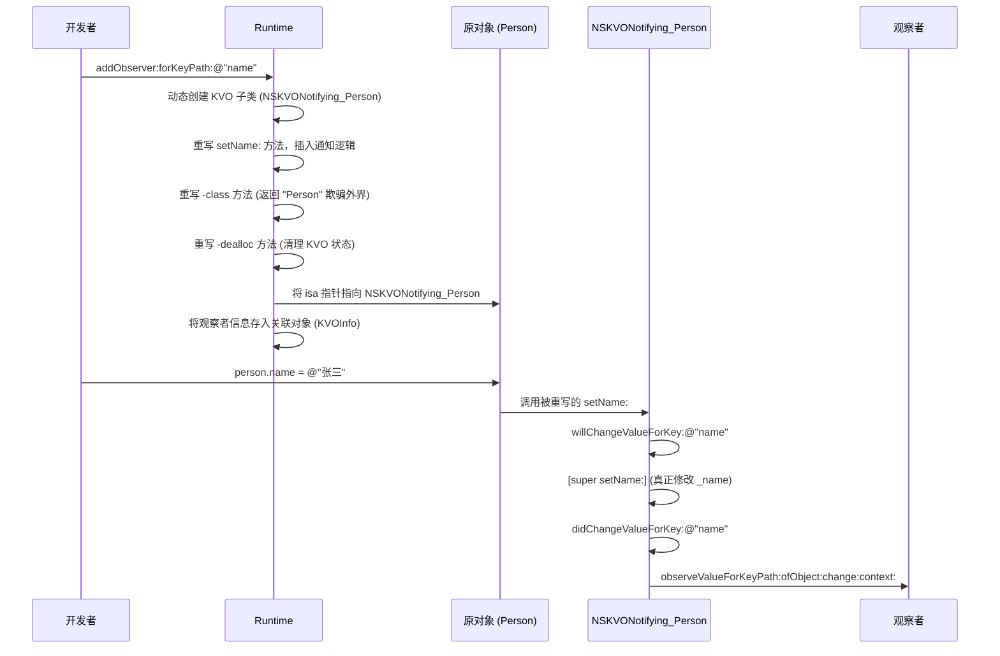
```mermaid
sequenceDiagram
    participant User as 开发者
    participant Runtime
    participant Object as 原对象 (Person)
    participant KVOClass as NSKVONotifying_Person
    participant Observer as 观察者

    User->>Runtime: addObserver:forKeyPath:@"name"
    Runtime->>Runtime: 动态创建 KVO 子类 (NSKVONotifying_Person)
    Runtime->>Runtime: 重写 setName: 方法，插入通知逻辑
    Runtime->>Runtime: 重写 -class 方法 (返回 "Person" 欺骗外界)
    Runtime->>Runtime: 重写 -dealloc 方法 (清理 KVO 状态)
    Runtime->>Object: 将 isa 指针指向 NSKVONotifying_Person
    Runtime->>Runtime: 将观察者信息存入关联对象 (KVOInfo)
    
    User->>Object: person.name = @"张三"
    Object->>KVOClass: 调用被重写的 setName:
    KVOClass->>KVOClass: willChangeValueForKey:@"name"
    KVOClass->>KVOClass: [super setName:] (真正修改 _name)
    KVOClass->>KVOClass: didChangeValueForKey:@"name"
    KVOClass->>Observer: observeValueForKeyPath:ofObject:change:context:
```

**文字说明：**

1. **动态子类化**：`addObserver` 触发时，Runtime 会创建一个名为 `NSKVONotifying_OriginalClassName` 的新类，该类继承自原类。
2. **方法重写**：
   - **`setter` 方法**：在 setter 中插入 `willChangeValueForKey:` 和 `didChangeValueForKey:` 调用，并在前后发送通知。
   - **`-class` 方法**：重写使其返回原类名，对外部隐藏子类的存在。
   - **`-dealloc` 方法**：在对象销毁时自动清理 KVO 状态。
3. **`isa` 交换**：将对象的 `isa` 指针从原类指向新创建的子类，使对象“变成”子类的实例。
4. **触发通知**：当属性通过 `setter` 修改时，重写的 `setter` 会在修改前后调用 `willChange` 和 `didChange`，从而触发 `observeValueForKeyPath:` 回调。

**手动实现 KVO 需要重写的方法：**
- `+ (BOOL)automaticallyNotifiesObserversForKey:(NSString *)key`：返回 `NO` 关闭自动通知。
- `- (void)willChangeValueForKey:(NSString *)key`
- `- (void)didChangeValueForKey:(NSString *)key`

### 5.2 KVC 键值编码查找顺序

KVC 通过字符串键名间接访问属性，其查找逻辑是一套完整的“方法 → 成员变量 → 容错”的瀑布流。

**`setValue:forKey:` 查找顺序：**

1. 查找 **`setProperty:`** 方法 → 找到则调用，流程结束。
2. 查找 **`_setProperty:`** 方法 → 找到则调用，流程结束。
3. 直接访问成员变量（按顺序查找 `_property`、`_isProperty`、`property`、`isProperty`）→ 找到则直接赋值。
4. 调用 **`setValue:forUndefinedKey:`** → 默认抛出 `NSUndefinedKeyException`。

**`valueForKey:` 查找顺序：**

1. 查找 **`getProperty`**、**`property`**、**`isProperty`**、**`_getProperty`** 方法 → 找到则调用并返回值。
2. 如果属性是集合类型，查找 `countOfProperty`、`objectInPropertyAtIndex:` 等集合方法。
3. 直接访问成员变量（按顺序查找 `_property`、`_isProperty`、`property`、`isProperty`）→ 找到则直接返回值。
4. 调用 **`valueForUndefinedKey:`** → 默认抛出 `NSUndefinedKeyException`。

**容错方法：**

| 方法                        | 触发条件                                         | 默认行为                          | 应用场景                                    |
| :-------------------------- | :----------------------------------------------- | :-------------------------------- | :------------------------------------------ |
| `setValue:forUndefinedKey:` | `setter` 和成员变量都不存在                      | 抛出 `NSUndefinedKeyException`    | JSON 转 Model 时忽略未定义的字段            |
| `valueForUndefinedKey:`     | `getter` 和成员变量都不存在                      | 抛出 `NSUndefinedKeyException`    | 提供默认值或安全返回                        |
| `setNilValueForKey:`        | 对非对象类型（`int`/`float`/`struct`）设置 `nil` | 抛出 `NSInvalidArgumentException` | 为标量属性提供默认值（如 0、`NSZeroPoint`） |

---

## 第六部分：动态特性 API 详解

### 6.1 Method Swizzling 标准实现与风险

Method Swizzling 是 Runtime 最强大的动态能力之一，允许在运行时交换两个方法的实现。但它的强大也伴随着巨大的风险。

**标准实现（支持父类方法交换）：**

```objc
+ (void)load {
    static dispatch_once_t onceToken;
    dispatch_once(&onceToken, ^{
        Class class = [self class];
        SEL originalSel = @selector(originalMethod);
        SEL swizzledSel = @selector(swizzledMethod);
        
        Method originalMethod = class_getInstanceMethod(class, originalSel);
        Method swizzledMethod = class_getInstanceMethod(class, swizzledSel);
        
        // 关键步骤：尝试添加原始方法（处理子类未实现，从父类继承的情况）
        BOOL didAddMethod = class_addMethod(class, originalSel,
                                           method_getImplementation(swizzledMethod),
                                           method_getTypeEncoding(swizzledMethod));
        if (didAddMethod) {
            // 添加成功后，将 Swizzled 方法的 IMP 替换为原始 IMP
            class_replaceMethod(class, swizzledSel,
                               method_getImplementation(originalMethod),
                               method_getTypeEncoding(originalMethod));
        } else {
            // 当前类已实现 originalMethod，直接交换
            method_exchangeImplementations(originalMethod, swizzledMethod);
        }
    });
}

- (void)swizzledMethod {
    // 调用原始实现（注意：方法名是 swizzled，但实际调用的是 original）
    [self swizzledMethod];
    // 额外的自定义逻辑
    NSLog(@"Swizzled method called");
}
```

**为什么 `class_addMethod` 步骤是必要的？**

如果子类没有实现 `originalMethod`，直接 `method_exchangeImplementations` 会交换**父类**的方法，影响所有子类。`class_addMethod` 会先为当前类添加一个方法，然后再交换，将影响范围限制在当前类。

**常见风险与规避：**

| 风险             | 根因                            | 解决方案                                          |
| :--------------- | :------------------------------ | :------------------------------------------------ |
| **系统升级崩溃** | 系统方法名/实现在新版本中变化   | 版本适配、方法存在性检查                          |
| **多次交换混乱** | 不同组件或分类多次交换同一方法  | 使用 `dispatch_once` 保证只执行一次               |
| **父类子类冲突** | 交换父类方法影响所有子类        | 使用 `class_addMethod` 隔离影响                   |
| **调用链断裂**   | Swizzled 方法中忘记调用原始实现 | 确保调用原始 IMP，若忘记会导致原有逻辑丢失        |
| **线程安全**     | 多线程同时执行 Swizzling        | 在 `+load` 中执行（单线程），配合 `dispatch_once` |

### 6.2 动态创建类（`objc_allocateClassPair`）

Runtime 允许在运行时从零构造一个全新的类，这在某些框架级开发（如测试 Mock、动态代理）中非常有用。

**完整流程：**

```objc
// 1. 分配类对 (Class Pair)
Class newClass = objc_allocateClassPair([NSObject class], 
                                        "MyDynamicClass", 
                                        0);

// 2. 添加实例变量 (必须在 objc_registerClassPair 之前)
class_addIvar(newClass, "_myIvar", sizeof(id), 
              log2(sizeof(id)), "@");

// 3. 添加方法 (注册前后均可)
class_addMethod(newClass, @selector(dynamicMethod), 
                (IMP)dynamicMethodIMP, "v@:");

// 4. 注册类，使其可以用于 alloc 创建实例
objc_registerClassPair(newClass);

// 5. 使用
id instance = [[newClass alloc] init];
[instance performSelector:@selector(dynamicMethod)];

// 6. 销毁类 (需确保无存活实例)
objc_disposeClassPair(newClass);
```

**文字说明：**

- `objc_allocateClassPair` 分配类所需的内存，建立类的基础结构（`isa`、`superclass`、方法列表等）。
- `class_addIvar` 必须在 `objc_registerClassPair` **之前**调用，因为类的实例大小在注册时就已固定。
- `objc_registerClassPair` 将类注册到全局类表中，此后该类才能正常使用（`alloc`、消息发送等）。
- `objc_disposeClassPair` 销毁类，前提是没有任何该类的实例存活，否则会导致崩溃。

---

## 第七部分：ARC 编译器与 Runtime 协作

ARC（Automatic Reference Counting）是编译器与 Runtime 协作的典范。它不是单纯由编译器或 Runtime 完成，而是两者各司其职，共同实现自动内存管理。

### 7.1 编译器 (Clang) 的职责

编译器在编译期进行静态分析和代码插桩：

1. **分析对象生命周期**：根据变量修饰符（`__strong`、`__weak`、`__autoreleasing`）和代码作用域，确定 `retain`/`release`/`autorelease` 的插入位置。
2. **插入 Runtime 函数调用**：
   - `__strong` 变量赋值 → 调用 `objc_storeStrong`
   - `__weak` 变量赋值 → 调用 `objc_storeWeak`
   - `autorelease` 对象 → 调用 `objc_autorelease`
3. **处理 `return` 返回值**：根据方法命名规则（`alloc`/`new`/`copy`/`mutableCopy`）决定是否自动 `autorelease`。

### 7.2 Runtime 的职责

Runtime 提供底层函数的具体实现：

1. **`objc_retain`**：调用对象的 `retain` 方法，增加引用计数。
2. **`objc_release`**：调用对象的 `release` 方法，减少引用计数，归零时触发 `dealloc`。
3. **`objc_autorelease`**：将对象加入当前 `AutoreleasePool`。
4. **`objc_storeStrong`**：管理 `__strong` 变量的赋值，先 `retain` 新值，再 `release` 旧值。
5. **`objc_storeWeak`**：管理 `__weak` 变量的赋值，注册到 `SideTable.weak_table`。

```cpp
// objc_storeStrong 伪代码
void objc_storeStrong(id *location, id obj) {
    id prev = *location;
    if (obj == prev) return;
    objc_retain(obj);
    *location = obj;
    objc_release(prev);
}
```

---

## 第八部分：Runtime 实用场景与风险总结

### 8.1 业务落地场景

| 场景                  | 实现方式                                         | 核心 Runtime API                                    |
| :-------------------- | :----------------------------------------------- | :-------------------------------------------------- |
| **无埋点统计**        | Swizzle `UIViewController` 的 `viewDidAppear:`   | `method_exchangeImplementations`                    |
| **统一异常捕获**      | Swizzle `NSObject` 的 `forwardInvocation:`       | `method_exchangeImplementations`                    |
| **UI 按钮防重复点击** | Swizzle `UIControl` 的 `sendAction:to:forEvent:` | `method_exchangeImplementations`                    |
| **字典转模型**        | 遍历类属性列表，使用 KVC 赋值                    | `class_copyPropertyList`、`setValue:forKey:`        |
| **JSBridge 参数校验** | 使用 `NSProxy` 代理拦截所有方法调用              | `forwardInvocation:`、`methodSignatureForSelector:` |
| **动态 Mock 测试**    | 动态创建类并添加方法                             | `objc_allocateClassPair`、`class_addMethod`         |

### 8.2 常见风险与规避

| 风险                       | 根因                                   | 解决方案                                      |
| :------------------------- | :------------------------------------- | :-------------------------------------------- |
| **系统升级崩溃**           | 系统方法名/实现变更                    | 版本适配、防御性检查、减少 Swizzling          |
| **关联对象内存泄漏**       | `OBJC_ASSOCIATION_RETAIN` 导致循环引用 | 使用弱引用包装类（`WeakObjectContainer`）     |
| **KVO 野指针崩溃**         | 观察者未在 `dealloc` 中移除            | 在 `dealloc` 中确保调用 `removeObserver`      |
| **分类 `weak` 关联野指针** | 关联对象不支持 `weak` 策略             | 使用弱引用容器包装后关联                      |
| **字典转模型卡顿**         | 大量 KVC 动态调用                      | 缓存 `IMP`、使用 `objc_msgSend` 直接调用      |
| **多 Swizzling 冲突**      | 多个组件交换同一方法                   | 统一管理 Swizzling 逻辑，使用 `dispatch_once` |
| **动态类内存泄漏**         | 未调用 `objc_disposeClassPair`         | 确保在类无存活实例时销毁                      |

### 8.3 Runtime 使用黄金法则

1. **优先选择编译期安全方案**（继承、组合、协议），将 Runtime 动态方案作为**最后手段**。
2. **理解底层原理**：在操作 `isa`、方法列表、关联对象之前，必须清楚知晓其内存管理和线程安全模型。
3. **封装与隔离**：将所有 Runtime 操作封装在独立的工具类或组件中，并提供清晰的接口和文档。
4. **防御式编程**：对系统版本、方法存在性、类型转换等进行充分校验。
5. **测试与监控**：涉及 Runtime 的代码，必须有完整的单元测试和线上监控，以便及时发现兼容性或性能回归问题。

---

> **结语**：Objective-C Runtime 是这门语言动态能力的基石。它赋予了开发者在运行时查询、修改甚至重构对象行为的能力，同时也要求开发者具备更深的系统理解和更强的责任意识。希望这份文档能帮助您更安全、更高效地运用 Runtime 的力量。


## Q1: 弱引用表、自动置 nil 的时机； unsafe_unretained和weak 区别？

要讲清楚 `weak` 的底层实现，核心在于 **SideTable** 结构体中的 **弱引用表（Weak Table）**，以及 **对象生命周期** 与 **Runtime 回调** 的联动。

下面从源码角度（基于 objc4）为你彻底拆解。

### 1. weak 底层核心数据结构

当编译器遇到 `__weak` 修饰符时，Runtime 并不直接操作对象，而是通过全局的 **SideTables** 哈希表来管理。

底层涉及三个核心角色：

-   **SideTables**：全局的哈希表，以 **对象指针** 为 key，value 是 `SideTable`。
-   **SideTable**：包含 **弱引用表（weak_table_t）** 和 **引用计数表（RefcountMap）**。
-   **weak_table_t**：以 **对象指针** 为 key，value 是 `weak_entry_t`。
-   **weak_entry_t**：存储指向该对象的所有 **weak 指针地址** 的数组（或者哈希集合）。

**简化结构关系：**
`对象` -> `SideTables()` -> `SideTable` -> `weak_table_t` -> `weak_entry_t` -> `weak 变量地址的数组`

---

### 2. weak 变量的注册与存储（何时存入）

当你将对象赋值给 weak 变量时（如 `id __weak obj = [NSObject new];`），Runtime 会调用 **`objc_initWeak`** 或 **`objc_storeWeak`** 函数。

底层核心流程分为三步：

1.  **判断对象是否有效**：如果对象为 nil，则将 weak 变量置为 nil，直接返回。
2.  **建立关联**：
    -   通过对象指针，在 `SideTables` 中找到对应的 `SideTable`（加锁保证线程安全）。
    -   在 `SideTable` 的 `weak_table_t` 中查找该对象。
    -   如果没找到，新建 `weak_entry_t`；如果找到了，将 **当前 weak 变量的地址（&obj）** 塞入 `weak_entry_t` 的指针数组中。
3.  **返回对象**：将对象的指针返回给 weak 变量（不增加引用计数）。

---

### 3. 自动置 nil 的时机（最核心的触发点）

这是 `weak` 最强大的功能。**置 nil 不是在对象 dealloc 的最后一刻发生的，而是在 `dealloc` 方法执行的第一步。**

具体的执行流程在 `objc_object::clearDeallocating()` 或 `objc_destructInstance` 中：

1.  **对象开始 dealloc**：系统调用 `dealloc`。
2.  **清除弱引用**：Runtime 调用 `objc_clear_deallocating`。
3.  **查找弱引用表**：根据对象指针，在 `SideTables` 中找到对应的 `weak_entry_t`。
4.  **遍历并置 nil**：
    -   遍历 `weak_entry_t` 中存储的所有 **weak 指针的地址**。
    -   对每一个地址，执行 `*addr = nil`（将指针指向的内存内容设为 0）。
5.  **移除记录**：从 `weak_table_t` 中移除该对象的 `weak_entry_t`。
6.  **继续释放**：完成上述操作后，才去释放对象的引用计数表和内存空间。

**关键结论**：`weak` 变量置 nil 发生在 **`dealloc` 方法内部（`[super dealloc]` 之前）**。因此，如果你在 `dealloc` 方法中访问 weak 属性，此时它已经是 nil 了。

---

### 4. unsafe_unretained 和 weak 的区别

这是两者最本质的区别，直接关系到应用的稳定性。

| 特性           | `__weak`                                                | `__unsafe_unretained`                                                                          |
| :------------- | :------------------------------------------------------ | :--------------------------------------------------------------------------------------------- |
| **核心机制**   | **自动置 nil**                                          | **不会自动置 nil（悬垂指针）**                                                                 |
| **底层行为**   | 对象 dealloc 时，Runtime 遍历弱引用表将该变量置为 nil。 | 对象 dealloc 时，完全不关心该变量，变量地址上存的是原始内存地址。                              |
| **内存安全**   | **安全**。向 nil 发送消息不会崩溃。                     | **极不安全**。对象释放后，内存可能已被覆写，访问该变量会触发 **野指针崩溃 (EXC_BAD_ACCESS)**。 |
| **性能开销**   | 有开销（需要操作 SideTable、加锁、遍历数组）。          | **无额外开销**。仅仅是单纯的指针赋值，不涉及 Runtime 介入。                                    |
| **所有权修饰** | 持有对象，但不增加引用计数（表示一种“非拥有”关系）。    | 持有对象，但不增加引用计数（表示“不安全的非拥有”关系）。                                       |
| **使用场景**   | 现代 iOS 开发中的首选（避免循环引用，如 Delegate）。    | 几乎只在 **兼容 MRC（手动引用计数）** 或极少数对性能有极致要求的底层 C/C++ 混编场景中使用。    |

---

### 5. 高频追问：为什么 `weak` 线程安全？为什么需要 `SideTable` 锁？

`SideTable` 中的锁（`spinlock_t`）是为了解决 **多线程竞态条件**。

**场景**：线程 A 正在释放对象（准备置 nil），线程 B 正在给 weak 变量赋值（准备存入弱引用表）。

-   如果没有锁，线程 B 可能拿到一个即将被销毁对象的指针，导致内存污染。
-   **加锁机制**：在操作对象的弱引用表或引用计数时，必须锁定对应的 `SideTable`。这使得 `objc_storeWeak` 和 `clearDeallocating` 在修改同一对象时是 **串行化** 的。

**重要补充**：在 `dealloc` 中自动置 nil 的动作，是在 **主线程** 还是 **任意线程** 执行的？  
答案：**在对象所在线程（即调用 `release` 导致引用计数归零的那个线程）** 执行，而不是固定在主线程。因此，如果多线程环境下访问 weak 变量，Runtime 的锁保证了底层指针的读写安全，但业务逻辑仍需开发者自行保证。

---

### 总结

> **“weak 底层通过全局的 SideTables 中的弱引用表来存储所有 weak 指针的地址。当对象引用计数归零开始 dealloc 时，Runtime 会在释放内存之前，先遍历这个对象的弱引用表，把所有 weak 变量置为 nil，然后再移除表项。而 unsafe_unretained 虽然也不增加引用计数，但它不会做这个置 nil 操作，对象销毁后它指向的是野指针，访问就会崩溃。”**

## Q2: strong的底层实现

问得非常好！既然聊完了 `weak`，自然要对比它的“死对头” **`strong`**。

`strong` 是 Objective-C 中最常用（也是默认）的修饰符，其底层核心就是 **引用计数（Retain Count）** 的操作。它不像 `weak` 需要维护复杂的弱引用表，但也绝非简单的“赋值”。

从源码（objc4）层面来看，`strong` 的底层实现主要围绕两个核心函数：**`objc_storeStrong`** 和 **`objc_retain`**。

---

### 1. strong 的底层核心函数：`objc_storeStrong`

当你编写 `self.obj = newObj;`（属性是 strong）或直接赋值 `id __strong a = b;` 时，编译器会将其转换为对 `objc_storeStrong` 函数的调用。

这个函数的伪代码如下（源码精简版）：

```objectivec
void objc_storeStrong(id *location, id obj) {
    id prev = *location;   // 1. 取出旧值
    if (obj == prev) {     // 2. 如果新值和旧值是同一个对象，直接返回（优化）
        return;
    }
    objc_retain(obj);      // 3. 对新值进行 +1 引用计数（先 retain）
    *location = obj;       // 4. 指针赋值
    objc_release(prev);    // 5. 对旧值进行 -1 引用计数（后 release）
}
```

**关键点：为什么是“先 retain 新值，再 release 旧值”？**

-   **防止对象被提前释放**：如果新值和旧值指向的是**同一个对象**（虽然外层判断了 `prev == obj`，但在多线程或复杂 KVO 场景下可能不准），先 release 旧值会导致引用计数归零，对象被销毁，再 retain 新值就操作了野指针。
-   **防止循环引用链断裂**：确保在指针切换的瞬间，新值至少有一个持有者，保证赋值的原子性安全性。

---

### 2. 引用计数的存储与操作

`objc_retain` 和 `objc_release` 底层是如何修改引用计数的？并不是直接操作一个简单的 int 变量。

在 ARM 64 架构（现在的 iPhone）下，引用计数分为两种情况存储：

#### A. 优化前的存储（Tagged Pointer 不适用）
-   **isa 指针的“非指针优化”**：对象的 `isa` 指针中有一部分位域（`isa` 中的 `extra_rc` 字段）专门用来存储**部分**引用计数。
-   **SideTables 辅助**：当 `extra_rc` 溢出（超过 2^19 左右）时，多余的引用计数会存储到前面提到的 `SideTable` 中的 **引用计数表（RefcountMap）** 里。

#### B. 核心操作流程（以 `objc_retain` 为例）
1.  检查对象是否为 `nil`，如果是则直接返回。
2.  检查是否为 **Tagged Pointer**（小对象，如 NSNumber 字面量），如果是则直接返回（Tagged Pointer 不参与引用计数管理）。
3.  尝试在 `isa` 的 `extra_rc` 字段进行 **`+1` 操作**（汇编级别的原子操作）。
    -   如果成功（未溢出），结束。
    -   如果溢出，则执行 `SideTable` 的 `add` 操作，将计数值存储到哈希表中。

---

### 3. `__strong` 修饰的局部变量（栈上）

对于方法内部定义的局部变量：`id __strong obj = [[NSObject alloc] init];`

-   **编译后**：编译器会自动在作用域开始时插入 `objc_retain`，在作用域结束（变量被销毁）时插入 `objc_release`。
-   **ARC 下的优化**：如果调用的是 `alloc`、`new`、`copy`、`mutableCopy`（以这些开头的方法），返回的对象本身已经 `+1`（即**持有**），编译器**不会**额外再插入 `objc_retain`，避免冗余操作。

---

### 4. strong 与 weak 的底层区别对照表

回到你之前的问题，我们把 `strong` 和 `weak` 放在一起对比：

| 特性               | `__strong`（默认）                                                       | `__weak`                                                           |
| :----------------- | :----------------------------------------------------------------------- | :----------------------------------------------------------------- |
| **底层核心函数**   | `objc_storeStrong`（内含 retain + release）                              | `objc_storeWeak`                                                   |
| **引用计数变化**   | **Retain +1**。赋值时新值加 1，旧值减 1。                                | **不变**。既不增加也不减少。                                       |
| **数据结构交互**   | 操作 `isa.extra_rc` 和 `SideTable` 的引用计数表。                        | 操作 `SideTable` 的弱引用表（存储指针地址）。                      |
| **对象销毁时行为** | 什么也不做。对象销毁意味着引用计数归零，此时没有任何 strong 指针指向它。 | 自动置 nil。Runtime 会遍历弱引用表，将指向该对象的 weak 指针清零。 |
| **崩溃风险**       | 安全（保证了对象存活）。                                                 | 安全（因为置 nil）。                                               |
| **性能开销**       | 较高（需要修改引用计数，可能涉及哈希表查找和原子操作）。                 | 更高（除了引用计数表，还要维护弱引用表的增删改查和锁）。           |

---

### 5. 进阶扩展：`__strong` 的“副作用”

很多人以为 `strong` 只是增加计数值，但它还隐含了一层语义：**“我保证这个对象在我使用期间不会死”**。

但是，如果在一个循环中频繁操作 `strong` 指针，会导致频繁的 `retain` 和 `release` 调用，这会消耗 CPU 性能。因此，苹果在底层做了 **“Autorelease 池优化”** 和 **“返回值优化（RVO）”**。

**常见问题：**
> **问：** 为什么在 `for` 循环中大量临时对象会消耗性能？
> **答：** 因为每次循环结束，`__strong` 修饰的局部变量会被 `release`，下次循环又被 `retain`，导致引用计数频繁加减。解决办法是使用 `@autoreleasepool` 包裹循环体，或者手动在循环内置入池子。

---

### 总结

> **“`strong` 的底层通过 `objc_storeStrong` 实现。赋值时，它会先对新对象执行 `objc_retain`（操作 isa 中的 extra_rc 或 SideTable 引用计数表，使其 +1），然后赋值指针，最后对旧对象执行 `objc_release`（-1）。这种‘先 retain 后 release’的顺序保证了赋值的线程安全，防止对象在指针切换时被提前销毁。当对象的引用计数归零时，dealloc 被触发，与 weak 不同的是，strong 不需要主动把指针置 nil，因为此时已经没有 strong 指针指向它了。”**

## Q3: 苹果在底层做了 “Autorelease 池优化” 和 “返回值优化（RVO）” 它是怎么优化的，怎么避免频繁 频繁的 retain 和 release，retain和release调用链条又是怎样的，它和sideTable之间又有什么联系

你这个问题直接触及了 ARC 底层最精巧的优化和最核心的数据流转。我会从**返回值优化 (RVO)**、**retain/release 调用链**，以及它们与 **SideTable** 的关系这几个维度来展开。

### 🚀 Autorelease 池优化：返回值优化 (RVO)

你提到的“Autorelease 池优化”核心是 **返回值优化 (RVO，Return Value Optimization)**。它主要解决工厂方法返回一个已注册到自动释放池的对象，然后调用方又立即将其 `retain` 时，产生多余 `autorelease` 和 `retain` 调用的问题。

它的运作机制可以看作一个巧妙的“暗号”传递过程：

1.  **在返回方 (Callee)**：编译器会将 `return obj;` 替换为 `objc_autoreleaseReturnValue(obj)`。
2.  **“偷看”调用方**：`objc_autoreleaseReturnValue` 会通过 `__builtin_return_address(0)` 等底层方法，检查紧接着自己的那行代码，是不是在调用 `objc_retainAutoreleasedReturnValue`。
3.  **传递“免单”暗号**：如果是，它**不会**将 `obj` 注册到自动释放池，而是在**线程局部存储 (TLS, Thread Local Storage)** 中设置一个标志位，然后直接返回 `obj`。
4.  **在接收方 (Caller)**：调用方代码会被替换为 `objc_retainAutoreleasedReturnValue(obj)`。
5.  **接收“暗号”，直接通过**：该函数会去 TLS 中检查标志位。如果发现标志被设置，说明对象已经“免于”注册自动释放池，它**不会**执行 `retain`，而是清除标志并直接返回对象。

**优化结果**：在整个调用过程中，**省去了一次 `autorelease` 和一次 `retain` 调用**。这在大量临时对象产生的循环中，能显著降低内存峰值和 CPU 开销。

### 🔗 retain/release 调用链

我们来看看 `retain` 和 `release` 这两个核心操作在底层是如何一步步执行的。

#### `retain` 的调用链

当执行 `[obj retain]` 或 ARC 下的 `objc_retain(obj)` 时，调用链如下：

1.  **入口：`objc_retain`**
    *   这是运行时提供的入口函数。
2.  **核心：`objc_object::rootRetain`**
    *   `objc_retain` 最终会调用这个 C++ 方法，它包含了引用计数增减的核心逻辑。
3.  **优先操作：`isa` 中的 `extra_rc`**
    *   `rootRetain` 首先会尝试对对象 `isa` 指针中的 `extra_rc` 位域进行**原子性**的自增操作 (`addc(newisa.bits, RC_ONE, 0, &carry)`)。
4.  **溢出处理：SideTable**
    *   如果 `extra_rc` 发生**溢出** (`carry` 为真)，`rootRetain` 会将 `extra_rc` 的值减半 (`RC_HALF`)，并将另一半“转移”到 **SideTable** 的引用计数表中去存储 (`sidetable_addExtraRC_nolock(RC_HALF)`)。

**关键点**：整个操作通过**原子操作**和**自旋锁** (`sidetable_lock` / `unlock`) 来保证线程安全。

#### `release` 的调用链

`release` 的逻辑是 `retain` 的逆过程，但多了个“是否要销毁对象”的判断：

1.  **入口：`objc_release`**，最终调用 `objc_object::rootRelease`。
2.  **递减计数**：优先操作 `isa.extra_rc` 进行原子性自减。
3.  **处理下溢**：如果 `extra_rc` 下溢（表示 `extra_rc` 已为零，但对象可能在 SideTable 中还有计数），会从 SideTable 的引用计数表中“借”一部分计数到 `extra_rc` 中，继续完成递减操作。
4.  **触发销毁**：当整个对象的引用计数（`extra_rc` + SideTable 计数）归零时，`rootRelease` 会调用 `performDealloc`，最终触发对象的 `dealloc` 方法。

### 🗂️ 与 SideTable 的联系

在你之前关于 `weak` 和 `strong` 的讨论中，已经提到了 `SideTable`，它就像一个“对象数据中心”，负责管理对象的**引用计数**和**弱引用表**。

*   **`retain`/`release` 的“溢出缓冲区”**：`isa` 中的 `extra_rc` 是“高速缓存”，而 **SideTable 中的 `RefcountMap`** 就是“大仓库”。当 `extra_rc` 存不下时，引用计数就会存储在这里。
*   **`dealloc` 的“调度中心”**：当引用计数归零，进入 `dealloc` 流程时，Runtime 会通过 **SideTable** 来执行两项关键操作：
    1.  遍历**弱引用表 (`weak_table_t`)**，将指向该对象的所有 `weak` 指针置为 `nil`。
    2.  清理**引用计数表 (`refcnts`)**，移除该对象的相关记录。

无论是 `weak` 的自动置 nil，还是 `strong` 的计数管理，它们对对象数据的最终操作都需要通过 `SideTable` 来完成。

### ⚡️ 其他底层优化：寄存器调用优化

除了返回值优化，Runtime 在 ARM64 架构下还有一个更底层的优化：`objc_retain_x19` / `objc_release_x19` 这类函数。

**原理**：常规函数调用约定要求对象必须放在 `x0` 寄存器。如果对象原本在 `x19` 寄存器，就需要一条 `mov x0, x19` 指令。而优化后的函数将寄存器编号编码在函数名中，可以直接使用 `x19` 寄存器调用，省去了一次 `mov` 指令，虽然微小，但在高频操作中积少成多。

### 💎 总结

**“Autorelease 池优化”** 通过 `objc_autoreleaseReturnValue` 和 `objc_retainAutoreleasedReturnValue` 这对函数，利用 TLS 传递标志位，省去了工厂方法返回对象时多余的 `autorelease` 和 `retain` 调用。

**`retain`/`release` 调用链** 则是从 `objc_retain` 入口出发，最终在 `rootRetain` 中实现。它会优先操作 `isa` 中的 `extra_rc`，仅在溢出时才与 `SideTable` 交互，这是一种典型的“缓存优先”设计。

这一切都围绕着 **`SideTable`** 展开，它作为核心的数据中心，支撑了引用计数表、弱引用表的存储，以及对象销毁时自动置 `nil` 的关键流程。

## Q4: objc runtime中主要类图结构

这是一个非常庞大的请求，因为 Objective-C Runtime 的类体系涉及对象、类、元类、协议、方法、属性、缓存等数十个核心数据结构。我会分层绘制，从最顶层的 **对象模型** 到 **方法缓存**，再到 **SideTable** 体系，帮你构建完整的 Runtime 类图。

---

## 🏗️ 第一层：对象与类的核心模型（最基础）

这一层是所有 Runtime 的基础，定义了对象、类、元类的三层结构。

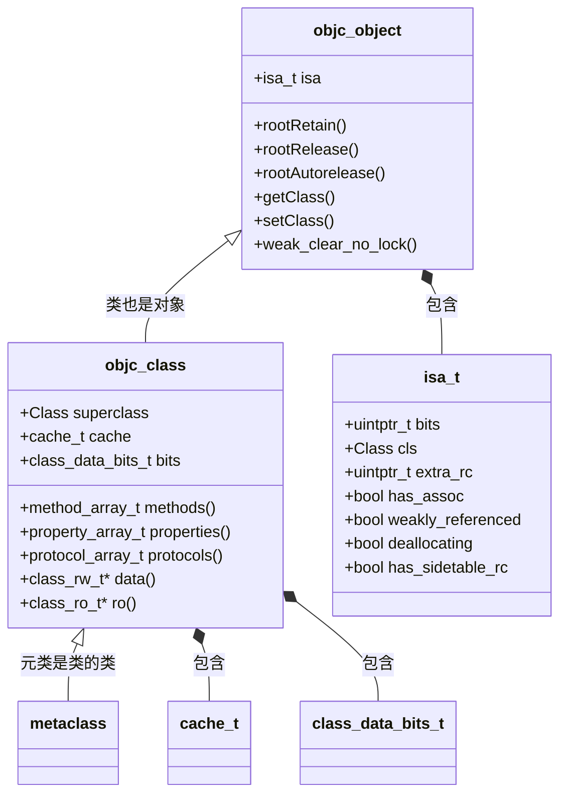
```mermaid
classDiagram
    class objc_object {
        +isa_t isa
        +rootRetain()
        +rootRelease()
        +rootAutorelease()
        +getClass()
        +setClass()
        +weak_clear_no_lock()
    }
    
    class objc_class {
        +Class superclass
        +cache_t cache
        +class_data_bits_t bits
        +method_array_t methods()
        +property_array_t properties()
        +protocol_array_t protocols()
        +class_rw_t* data()
        +class_ro_t* ro()
    }
    
    class isa_t {
        +uintptr_t bits
        +Class cls
        +uintptr_t extra_rc
        +bool has_assoc
        +bool weakly_referenced
        +bool deallocating
        +bool has_sidetable_rc
    }
    
    objc_object <|-- objc_class : 类也是对象
    objc_class <|-- metaclass : 元类是类的类
    
    objc_object *-- isa_t : 包含
    objc_class *-- cache_t : 包含
    objc_class *-- class_data_bits_t : 包含
```

**关键点**：
- **`objc_object`**：所有对象的基类，包含 `isa` 指针。
- **`objc_class`**：继承自 `objc_object`，所以**类也是对象**（类是 `objc_class` 的实例，元类是 `objc_class` 的实例的类）。
- **`isa_t`**：是一个联合体（union），可以解释为指针或位域。在 ARM64 下使用**非指针 isa**，将引用计数、标志位等信息直接编码在 `isa` 中，避免频繁操作 SideTable。
- **`class_data_bits_t`**：包含指向 `class_rw_t` 和 `class_ro_t` 的指针。

---

## 📦 第二层：类的数据布局（rw 与 ro）

`objc_class` 中的 `bits` 字段指向 `class_rw_t`，而 `class_rw_t` 又包含 `class_ro_t`，它们共同描述了类的完整信息。

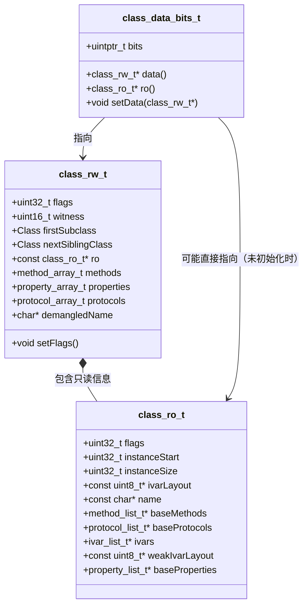
```mermaid
classDiagram
    class class_data_bits_t {
        +uintptr_t bits
        +class_rw_t* data()
        +class_ro_t* ro()
        +void setData(class_rw_t*)
    }
    
    class class_rw_t {
        +uint32_t flags
        +uint16_t witness
        +Class firstSubclass
        +Class nextSiblingClass
        +const class_ro_t* ro
        +method_array_t methods
        +property_array_t properties
        +protocol_array_t protocols
        +char* demangledName
        +void setFlags()
    }
    
    class class_ro_t {
        +uint32_t flags
        +uint32_t instanceStart
        +uint32_t instanceSize
        +const uint8_t* ivarLayout
        +const char* name
        +method_list_t* baseMethods
        +protocol_list_t* baseProtocols
        +ivar_list_t* ivars
        +const uint8_t* weakIvarLayout
        +property_list_t* baseProperties
    }
    
    class_rw_t *-- class_ro_t : 包含只读信息
    class_data_bits_t --> class_rw_t : 指向
    class_data_bits_t --> class_ro_t : 可能直接指向（未初始化时）
```

**关键点**：
- **`class_ro_t`（只读）**：存储编译期就确定的类信息，如类名、ivar 布局、Base 方法列表等。它是在编译时生成的，存放在 __DATA,__objc_const 段。
- **`class_rw_t`（读写）**：存储运行时可能修改的信息，如 Category 添加的方法、动态添加的属性、协议等。它会在类第一次被使用时（`realizeClass`）被创建，将 `class_ro_t` 的内容拷贝一份过来。
- **`class_data_bits_t`**：是一个指针的包装，在类未初始化时直接指向 `class_ro_t`，在类初始化后通过 `data()` 方法返回 `class_rw_t*`。

---

## 🗂️ 第三层：方法、属性、协议、Ivar

这些是 `class_rw_t` 和 `class_ro_t` 内部包含的具体数据结构。

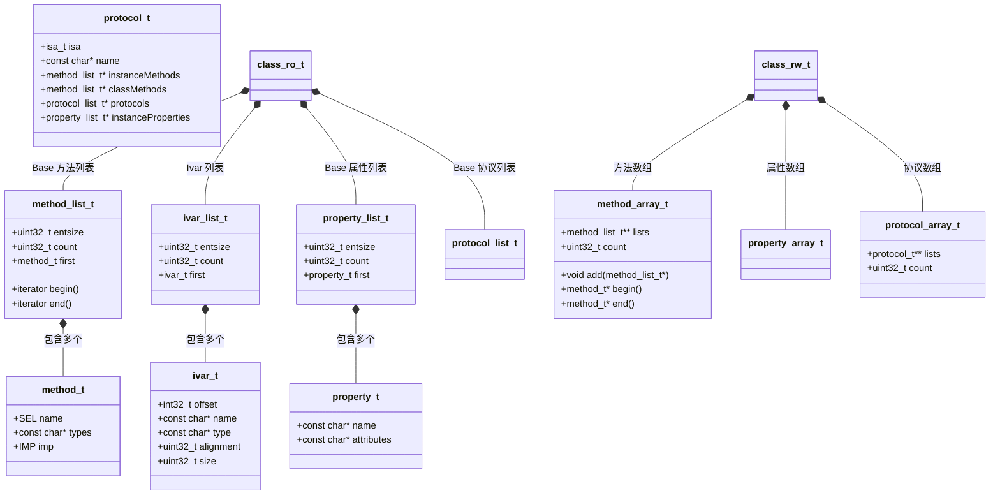
```mermaid
classDiagram
    class method_t {
        +SEL name
        +const char* types
        +IMP imp
    }
    
    class method_list_t {
        +uint32_t entsize
        +uint32_t count
        +method_t first
        +iterator begin()
        +iterator end()
    }
    
    class method_array_t {
        +method_list_t** lists
        +uint32_t count
        +void add(method_list_t*)
        +method_t* begin()
        +method_t* end()
    }
    
    class ivar_t {
        +int32_t offset
        +const char* name
        +const char* type
        +uint32_t alignment
        +uint32_t size
    }
    
    class ivar_list_t {
        +uint32_t entsize
        +uint32_t count
        +ivar_t first
    }
    
    class property_t {
        +const char* name
        +const char* attributes
    }
    
    class property_list_t {
        +uint32_t entsize
        +uint32_t count
        +property_t first
    }
    
    class protocol_t {
        +isa_t isa
        +const char* name
        +method_list_t* instanceMethods
        +method_list_t* classMethods
        +protocol_list_t* protocols
        +property_list_t* instanceProperties
    }
    
    class protocol_array_t {
        +protocol_t** lists
        +uint32_t count
    }
    
    method_list_t *-- method_t : 包含多个
    ivar_list_t *-- ivar_t : 包含多个
    property_list_t *-- property_t : 包含多个
    
    class_rw_t *-- method_array_t : 方法数组
    class_rw_t *-- property_array_t : 属性数组
    class_rw_t *-- protocol_array_t : 协议数组
    
    class_ro_t *-- method_list_t : Base 方法列表
    class_ro_t *-- ivar_list_t : Ivar 列表
    class_ro_t *-- property_list_t : Base 属性列表
    class_ro_t *-- protocol_list_t : Base 协议列表
```

**关键点**：
- **`method_t`**：包含方法名（`SEL`）、类型编码（`types`，如 `"v@:"`）和实现（`IMP`，即函数指针）。
- **`method_list_t` vs `method_array_t`**：`list` 是连续存储的数组（编译期生成），`array` 是动态数组（运行时可追加，用于 Category）。
- **`protocol_t`**：和类一样，也有 `isa` 指针，所以协议也是对象（`Protocol` 类）。

---

## ⚡️ 第四层：方法缓存（Cache）

这是 Runtime 性能优化的关键，通过缓存最近调用的方法，避免每次都遍历方法列表。

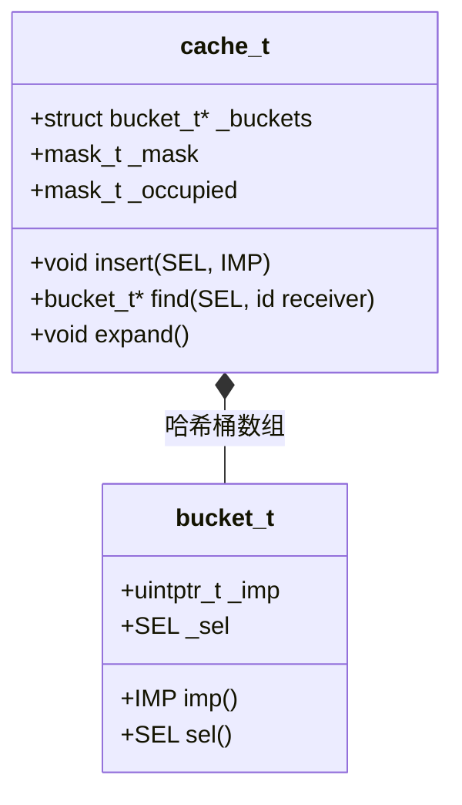
```mermaid
classDiagram
    class cache_t {
        +struct bucket_t* _buckets
        +mask_t _mask
        +mask_t _occupied
        +void insert(SEL, IMP)
        +bucket_t* find(SEL, id receiver)
        +void expand()
    }
    
    class bucket_t {
        +uintptr_t _imp
        +SEL _sel
        +IMP imp()
        +SEL sel()
    }
    
    cache_t *-- bucket_t : 哈希桶数组
```

**关键点**：
- **`bucket_t`**：存储一个 `SEL -> IMP` 的映射。
- **开放地址法**：`cache_t` 是一个哈希表，使用开放地址法（线性探测）解决冲突。
- **自动扩容**：当 `_occupied` 超过 `_mask` 的 3/4 时，`expand()` 会将容量翻倍，并重新哈希所有缓存。
- **查找流程**：`find()` 方法通过 `SEL` 计算出哈希值，在 `_buckets` 数组中查找，如果找不到则线性探测下一个槽位。

---

## 🔒 第五层：SideTable 体系（引用计数 & 弱引用）

这是你之前关注的 `RefcountMap` 和 `weak_table_t` 的完整类图。

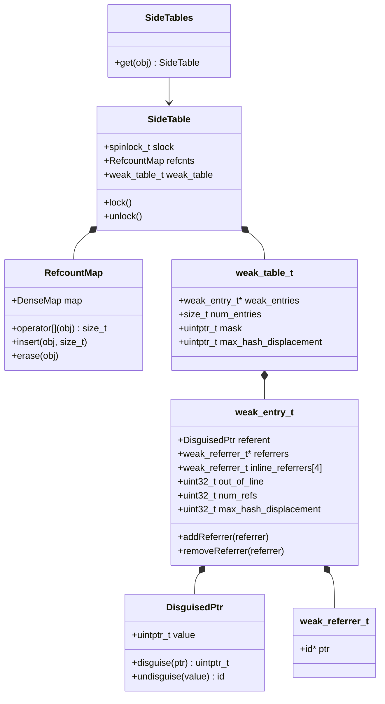
```mermaid
classDiagram
    class SideTables {
        +get(obj) SideTable
    }
    
    class SideTable {
        +spinlock_t slock
        +RefcountMap refcnts
        +weak_table_t weak_table
        +lock()
        +unlock()
    }
    
    class RefcountMap {
        +DenseMap map
        +operator[](obj) size_t
        +insert(obj, size_t)
        +erase(obj)
    }
    
    class weak_table_t {
        +weak_entry_t* weak_entries
        +size_t num_entries
        +uintptr_t mask
        +uintptr_t max_hash_displacement
    }
    
    class weak_entry_t {
        +DisguisedPtr referent
        +weak_referrer_t* referrers
        +weak_referrer_t inline_referrers[4]
        +uint32_t out_of_line
        +uint32_t num_refs
        +uint32_t max_hash_displacement
        +addReferrer(referrer)
        +removeReferrer(referrer)
    }
    
    class DisguisedPtr {
        +uintptr_t value
        +disguise(ptr) uintptr_t
        +undisguise(value) id
    }
    
    class weak_referrer_t {
        +id* ptr
    }
    
    SideTables --> SideTable
    SideTable *-- RefcountMap
    SideTable *-- weak_table_t
    weak_table_t *-- weak_entry_t
    weak_entry_t *-- DisguisedPtr
    weak_entry_t *-- weak_referrer_t
```

**关键点**：
- **`SideTables`**：全局单例，是一个 `StripedMap`（分段哈希表），通过对象指针计算出 index，获取对应的 `SideTable`。这种设计实现了**分离锁**，多个对象可以并行操作各自不同的 `SideTable`，提高并发性能。
- **`RefcountMap`**：就是我们之前讨论的 `DenseMap<DisguisedPtr<objc_object>, size_t>`，存储引用计数（位域编码）。
- **`weak_table_t`**：以对象指针为 key 的哈希表，value 是 `weak_entry_t`。
- **`weak_entry_t` 的小对象优化**：如果一个对象只有 4 个或更少的 weak 指针指向它，`referrers` 直接使用内联数组（`inline_referrers[4]`），无需动态分配内存，减少开销。

---

## 🌐 第六层：AutoReleasePool（自动释放池）

虽然不是严格意义上的 Runtime 类体系，但它是内存管理的重要一环。

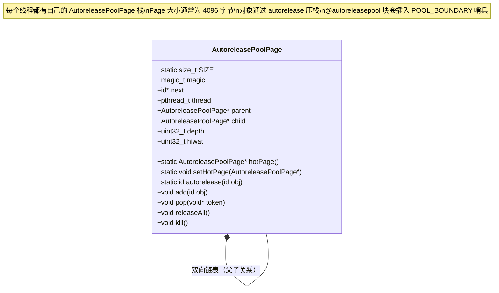
```mermaid
classDiagram
    class AutoreleasePoolPage {
        +static size_t SIZE
        +magic_t magic
        +id* next
        +pthread_t thread
        +AutoreleasePoolPage* parent
        +AutoreleasePoolPage* child
        +uint32_t depth
        +uint32_t hiwat
        +static AutoreleasePoolPage* hotPage()
        +static void setHotPage(AutoreleasePoolPage*)
        +static id autorelease(id obj)
        +void add(id obj)
        +void pop(void* token)
        +void releaseAll()
        +void kill()
    }
    
    AutoreleasePoolPage *-- AutoreleasePoolPage : 双向链表（父子关系）
    
    note for AutoreleasePoolPage "每个线程都有自己的 AutoreleasePoolPage 栈\nPage 大小通常为 4096 字节\n对象通过 autorelease 压栈\n@autoreleasepool 块会插入 POOL_BOUNDARY 哨兵"
```

**关键点**：
- **线程私有**：每个线程通过 TLS（Thread Local Storage）维护自己的 `hotPage`（当前活跃的 Page）。
- **双向链表**：当一个 Page 满了，会创建新的 child Page，形成双向链表。
- **哨兵机制**：每次 `@autoreleasepool` 入栈时，会压入一个 `POOL_BOUNDARY`（`nil`）作为标记。`pop` 时一直释放到最近的哨兵为止。

---

## 🧩 第七层：其他辅助结构

这些是 Runtime 中不太显眼但同样重要的类。

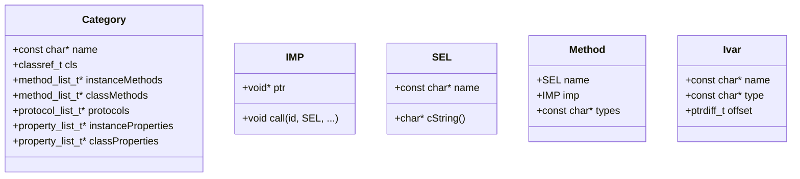
```mermaid
classDiagram
    class Category {
        +const char* name
        +classref_t cls
        +method_list_t* instanceMethods
        +method_list_t* classMethods
        +protocol_list_t* protocols
        +property_list_t* instanceProperties
        +property_list_t* classProperties
    }
    
    class IMP {
        +void* ptr
        +void call(id, SEL, ...)
    }
    
    class SEL {
        +const char* name
        +char* cString()
    }
    
    class Method {
        +SEL name
        +IMP imp
        +const char* types
    }
    
    class Ivar {
        +const char* name
        +const char* type
        +ptrdiff_t offset
    }
```

**关键点**：
- **`Category`**：分类在编译时生成，运行时通过 `objc_allocateClassPair` 等函数附加到类上。分类的方法被加入 `class_rw_t` 的 `methods` 数组**前面**，所以分类方法会覆盖原类方法。
- **`IMP`**：本质上是一个函数指针，指向方法的实现地址。
- **`SEL`**：方法选择器，在编译时由 `@selector()` 或 `sel_registerName()` 生成，全局唯一，通过字符串比较来判断方法名。

---

## 📊 总结：完整的关系图谱

把所有层串起来，最终的全景类图如下：

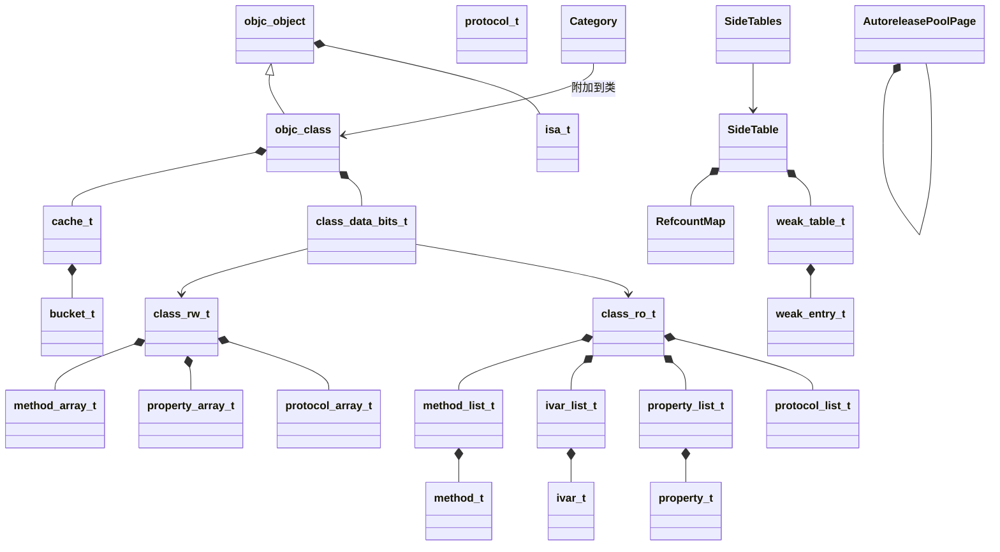
```mermaid
classDiagram
    class objc_object
    class objc_class
    class isa_t
    class cache_t
    class class_data_bits_t
    class class_rw_t
    class class_ro_t
    class method_list_t
    class method_t
    class ivar_list_t
    class ivar_t
    class property_list_t
    class property_t
    class protocol_t
    class bucket_t
    class SideTables
    class SideTable
    class RefcountMap
    class weak_table_t
    class weak_entry_t
    class AutoreleasePoolPage
    class Category
    
    objc_object <|-- objc_class
    objc_object *-- isa_t
    objc_class *-- cache_t
    objc_class *-- class_data_bits_t
    class_data_bits_t --> class_rw_t
    class_data_bits_t --> class_ro_t
    class_rw_t *-- method_array_t
    class_rw_t *-- property_array_t
    class_rw_t *-- protocol_array_t
    class_ro_t *-- method_list_t
    class_ro_t *-- ivar_list_t
    class_ro_t *-- property_list_t
    class_ro_t *-- protocol_list_t
    method_list_t *-- method_t
    ivar_list_t *-- ivar_t
    property_list_t *-- property_t
    cache_t *-- bucket_t
    
    SideTables --> SideTable
    SideTable *-- RefcountMap
    SideTable *-- weak_table_t
    weak_table_t *-- weak_entry_t
    
    AutoreleasePoolPage *-- AutoreleasePoolPage
    
    Category --> objc_class : 附加到类
```

---

## 🎯 关键设计哲学总结

1. **三层 isa 链**：对象 -> 类 -> 元类，所有信息都可以通过 `isa` 层层追溯。
2. **读写分离（rw/ro）**：编译期确定的信息存在 `ro`，运行时动态添加的存在 `rw`，通过 `class_data_bits_t` 统一管理。
3. **多级缓存**：`cache_t` 缓存方法查找结果，`extra_rc` 缓存引用计数，减少对全局 SideTable 的访问。
4. **分离锁（StripedMap）**：多个 SideTable 并发处理不同对象，减少锁竞争。
5. **小对象优化**：`weak_entry_t` 内联 4 个指针，`AutoreleasePoolPage` 栈式内存，避免频繁堆分配。
6. **位域压缩**：`isa_t` 和 `RefcountMap` 的值都使用位域编码，在一个字长（64 bit）内存储多种信息。
