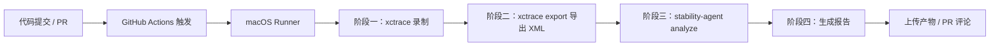

# iOS 内存监控体系完全指南：从线下工具到线上自建 OOM 与泄漏监控

> **特别声明**：本文所有方案均基于 App 沙盒内自监控，**无需申请任何系统级隐私权限**（如相机、位置、蓝牙、相册等）。涉及的 `task_info`、`malloc_logger` 等接口均为 iOS 合法公开 API，不涉及私有 API 调用，可安全过审。


## 目录

- [iOS 内存监控体系完全指南：从线下工具到线上自建 OOM 与泄漏监控](#ios-内存监控体系完全指南从线下工具到线上自建-oom-与泄漏监控)
  - [目录](#目录)
  - [1. 引言：内存问题的本质](#1-引言内存问题的本质)
  - [2. 线下诊断：Instruments 与命令行工具集](#2-线下诊断instruments-与命令行工具集)
    - [2.1 Allocations 与 Leaks 图形化工具](#21-allocations-与-leaks-图形化工具)
    - [2.2 四大命令行工具精讲](#22-四大命令行工具精讲)
      - [(1) `leaks` —— 检测不可达内存](#1-leaks--检测不可达内存)
      - [(2) `heap` —— 分析堆内存构成](#2-heap--分析堆内存构成)
      - [(3) `vmmap` —— 查看虚拟内存映射](#3-vmmap--查看虚拟内存映射)
      - [(4) `malloc_history` —— 追溯分配堆栈](#4-malloc_history--追溯分配堆栈)
  - [3. 自动化性能采集基石：xctrace 全面解析](#3-自动化性能采集基石xctrace-全面解析)
    - [3.1 概述与背景](#31-概述与背景)
    - [3.2 核心命令总览](#32-核心命令总览)
    - [3.3 录制（record）与导出（export）](#33-录制record与导出export)
      - [基本录制语法](#基本录制语法)
      - [关键参数详解](#关键参数详解)
      - [导出数据（export）](#导出数据export)
      - [⚠️ Xcode 26+ 重要变更](#️-xcode-26-重要变更)
      - [符号化（symbolicate）](#符号化symbolicate)
  - [4. 智能化根因分析：stability-analysis-agent 全面解析](#4-智能化根因分析stability-analysis-agent-全面解析)
    - [4.1 概述与设计哲学](#41-概述与设计哲学)
      - [为什么需要专用 Agent？](#为什么需要专用-agent)
    - [4.2 安装方式](#42-安装方式)
    - [4.3 核心工作流程](#43-核心工作流程)
    - [4.4 三种执行模式](#44-三种执行模式)
    - [4.5 命令行接口（CLI）](#45-命令行接口cli)
      - [基本用法](#基本用法)
      - [CLI 选项](#cli-选项)
      - [--scope 执行范围](#--scope-执行范围)
    - [4.6 Daemon 模式与 Python API](#46-daemon-模式与-python-api)
    - [4.7 RAG 知识库：数据飞轮](#47-rag-知识库数据飞轮)
  - [5. AI 驱动自动化与 CI/CD 流水线](#5-ai-驱动自动化与-cicd-流水线)
    - [5.1 MCP 生态下的智能交互诊断](#51-mcp-生态下的智能交互诊断)
    - [5.2 GitHub Actions 集成实战](#52-github-actions-集成实战)
    - [5.3 端到端无人值守流水线架构](#53-端到端无人值守流水线架构)
  - [6. 线上生产环境自建监控体系](#6-线上生产环境自建监控体系)
    - [6.1 MetricKit 的局限](#61-metrickit-的局限)
    - [6.2 自建 OOM 监控（启发式推断 + 水位预警）](#62-自建-oom-监控启发式推断--水位预警)
    - [6.3 大对象监控（`malloc_logger` 无侵入方案）](#63-大对象监控malloc_logger-无侵入方案)
    - [6.4 内存泄漏监控（延迟验证 + 循环引用检测）](#64-内存泄漏监控延迟验证--循环引用检测)
    - [6.5 事件流上下文记录（辅助定位“案发现场”）](#65-事件流上下文记录辅助定位案发现场)
  - [7. 设备权限与隐私合规说明](#7-设备权限与隐私合规说明)
  - [8. 方案对比与落地选型建议](#8-方案对比与落地选型建议)


## 1. 引言：内存问题的本质

iOS 采用**虚拟内存**与**内存页**机制，应用进程的 **Memory Footprint** 仅统计 **Dirty Pages** + **Swapped Pages**。内存问题通常分三类：

| 类型                  | 描述                             | 典型场景                          |
| --------------------- | -------------------------------- | --------------------------------- |
| **OOM (Jetsam 强杀)** | 内存占用触顶，被内核直接 SIGKILL | 图片缓存爆炸、大对象频繁创建      |
| **内存泄漏 (Leak)**   | 无引用不可达的内存块             | 循环引用、C 层 `malloc` 未 `free` |
| **大对象瞬态增长**    | 单次分配过大导致内存尖峰         | 解码超大图片、加载巨型 JSON       |

线下有 Instruments 神器，线上则需自建轻量级监控体系。


## 2. 线下诊断：Instruments 与命令行工具集

### 2.1 Allocations 与 Leaks 图形化工具

- **Allocations**：记录所有 `malloc`/`free` 事件，利用 **Generation 分析**对比操作前后新增对象，定位持久增长。
- **Leaks**：定期扫描堆内存，找出**不可达**的内存块，需开启 `MallocStackLogging` 获取堆栈。

### 2.2 四大命令行工具精讲

在 Xcode 导出 `.memgraph` 文件后，或直接在终端 attach 进程，可使用以下命令：

#### (1) `leaks` —— 检测不可达内存
```bash
# 检测运行中的进程
leaks 1234

# 分析 memgraph 文件
leaks App.memgraph

# 追踪特定地址的泄漏堆栈
leaks --traceTree 0x146a4c000 App.memgraph
```

#### (2) `heap` —— 分析堆内存构成
```bash
# 按大小排序，找出最占内存的对象类型
heap App.memgraph --sortBySize

# 查找特定类的所有实例地址
heap App.memgraph --addresses UIImage

# 对比两个时间点的堆差异（定位新增对象）
heap new.memgraph --diffFrom old.memgraph -s
```

#### (3) `vmmap` —— 查看虚拟内存映射
```bash
# 查看内存摘要（重点关注 Dirty Size + Swapped Size）
vmmap --summary App.memgraph

# 过滤特定类型（如 MALLOC 区域）
vmmap App.memgraph | grep MALLOC
```

#### (4) `malloc_history` —— 追溯分配堆栈
```bash
# 查看特定地址的完整分配历史
malloc_history App.memgraph --fullStack 0x146a4c000

# 以调用树形式展示（更清晰）
malloc_history App.memgraph --callTree 0x146a4c000
```
> **注意**：该命令依赖启动时启用 `MallocStackLogging`。


## 3. 自动化性能采集基石：xctrace 全面解析

### 3.1 概述与背景

`xctrace` 是 Instruments.app 背后的命令行工具，支持在无图形界面的环境中完成性能数据的录制、导入、导出和符号化。它的核心价值在于：

- **CI/CD 自动化性能分析**：无需打开 Instruments GUI 即可完成 profiling
- **无头（Headless）数据采集**：适合在服务器或自动化环境中运行
- **程序化数据分析**：通过 XML 导出实现数据的二次处理

**环境要求**：Xcode 12+（本文档参考 Xcode 26.2 测试）。

### 3.2 核心命令总览

| 命令          | 用途                                    |
| ------------- | --------------------------------------- |
| `record`      | 执行新的性能录制，生成 `.trace` 文件    |
| `export`      | 将 `.trace` 文件导出为 XML 等可解析格式 |
| `import`      | 将支持格式的文件转换为 `.trace` 文件    |
| `symbolicate` | 使用 dSYM 对 trace 文件进行符号化       |
| `list`        | 列出可用设备、模板或 Instruments        |

### 3.3 录制（record）与导出（export）

#### 基本录制语法
```bash
xcrun xctrace record \
    --instrument 'CPU Profiler' \
    --attach 'MyApp' \
    --time-limit 10s \
    --output profile.trace
```

#### 关键参数详解

**目标选择**：

| 参数                        | 说明                                   | 示例                             |
| --------------------------- | -------------------------------------- | -------------------------------- |
| `--attach <name\|pid>`      | 附加到正在运行的进程（按进程名或 PID） | `--attach 'MyApp'`               |
| `--launch -- <path> [args]` | 启动并分析指定应用                     | `--launch -- /path/to/MyApp.app` |
| `--all-processes`           | 分析所有进程                           | `--all-processes`                |
| `--device <name\|UDID>`     | 指定目标设备（模拟器或真机）           | `--device 'iPhone 17 Pro'`       |

**录制选项**：

| 参数                  | 说明                                |
| --------------------- | ----------------------------------- |
| `--output <path>`     | 输出 `.trace` 文件路径              |
| `--time-limit <time>` | 录制时长（如 `10s`、`1m`、`500ms`） |
| `--no-prompt`         | 跳过隐私警告（自动化场景使用）      |
| `--append-run`        | 将新录制追加到已有 trace 文件       |

**常用 Instrument 选择**：
```bash
# 列出所有可用 Instruments
xcrun xctrace list instruments

# 常用 Instrument
--instrument 'CPU Profiler'      # CPU 采样
--instrument 'Allocations'       # 内存分配追踪
--instrument 'Leaks'             # 内存泄漏检测
--instrument 'Time Profiler'     # 时间分析
```

#### 导出数据（export）
```bash
# 查看目录结构（TOC）
xcrun xctrace export --input trace.trace --toc

# 导出特定数据表
xcrun xctrace export \
    --input trace.trace \
    --xpath '/trace-toc/run[@number="1"]/data/table[@schema="cpu-profile"]' \
    > trace_data.xml
```

#### ⚠️ Xcode 26+ 重要变更

在 Xcode 26+ 中，**推荐使用 `--instrument` 替代 `--template`**。使用 `--template` 导出的 trace 文件可能在 export 时出现 “Document Missing Template Error”。

```bash
# ✅ 推荐（Xcode 26+）
xcrun xctrace record --instrument 'CPU Profiler' --attach 'MyApp' --time-limit 10s

# ❌ 可能失败（Xcode 26+）
xcrun xctrace record --template 'Time Profiler' --attach 'MyApp' --time-limit 10s
```

#### 符号化（symbolicate）
`xctrace` 支持直接使用 dSYM 文件对 trace 进行符号化：
```bash
xcrun xctrace symbolicate \
    --input trace.trace \
    --output symbolicated.trace \
    --dsym /path/to/app.dSYM
```

> **注意**：`xctrace list devices` 的输出通过 stderr 返回，需使用 `2>&1` 重定向。


## 4. 智能化根因分析：stability-analysis-agent 全面解析

### 4.1 概述与设计哲学

**Stability Analysis Agent** 是一个开源的 AI Agent 框架，专为 App 稳定性分析设计，覆盖 **Crash（闪退）、ANR（应用无响应）、OOM（内存溢出）和 Freeze/Watchdog** 等场景。

它的核心价值在于：**从稳定性日志到根因分析与修复建议，一键完成**。

#### 为什么需要专用 Agent？

通用 AI 编程工具（Cursor、Copilot 等）在稳定性分析场景中存在三大局限：

| 问题           | 通用 AI 工具                                     | Stability Analysis Agent                                     |
| -------------- | ------------------------------------------------ | ------------------------------------------------------------ |
| **地址符号化** | 无法运行 `atos`/`addr2line`，看到的是 `0x1a2b3c` | 内置符号化工具链，解析为 `MyClass::process() at main.cpp:42` |
| **日志解析**   | 原始文本含数百个系统帧，噪声大                   | 结构化解析，提取信号、线程、关键帧                           |
| **知识积累**   | 每次对话从零开始                                 | RAG 知识库（规则表 + 向量数据库），越用越智能                |

### 4.2 安装方式

```bash
# Pip 安装
pip install stability-analysis-agent

# 或使用预编译二进制（无需 Python 环境）
# 从 GitHub Releases 下载对应平台的二进制文件
```

源码安装：
```bash
git clone https://github.com/baidu-maps/stability-analysis-agent.git
cd stability-analysis-agent
pip install -e .
```

### 4.3 核心工作流程

Agent 将传统需要数小时的专家排查工作压缩为自动化流程：

```
┌─────────────┐    ┌─────────────┐    ┌─────────────┐    ┌─────────────┐
│  日志解析   │ → │  地址符号化  │ → │ 代码上下文  │ → │ AI 推理分析 │
│  (Parser)   │    │ (Symbolizer) │    │  (Provider) │    │  (Agent)    │
└─────────────┘    └─────────────┘    └─────────────┘    └─────────────┘
                                                                   │
                                                                   ▼
┌─────────────┐    ┌─────────────┐    ┌─────────────┐    ┌─────────────┐
│   RAG 检索  │ ← │  根因结论   │ ← │  修复建议   │ ← │  生成报告   │
│  (知识库)   │    │             │    │             │    │             │
└─────────────┘    └─────────────┘    └─────────────┘    └─────────────┘
```

**各阶段详解**：

1. **日志解析（Crash Log Parser）**：自动识别 iOS/Android/macOS/Linux/Windows 平台，分类 Crash/ANR/OOM/Freeze，提取信号、线程、关键堆栈帧
2. **地址符号化（Address Symbolizer）**：通过 `atos`（iOS/macOS）或 `addr2line`（Android/Linux）将内存地址解析为函数名和行号
3. **代码上下文提取（Code Content Provider）**：提取崩溃点附近的源代码片段
4. **AI 推理层**：结合 RAG 知识库（规则表快速匹配 + 向量相似检索）与 LLM 进行多轮推理

### 4.4 三种执行模式

| 模式          | 引擎             | 适用场景                                           |
| ------------- | ---------------- | -------------------------------------------------- |
| **Direct**    | 单次提示词组装   | 快速分析，无框架依赖                               |
| **LangChain** | LangChain Agent  | 链式工具调用，标准分析                             |
| **LangGraph** | LangGraph 状态机 | 多轮推理，Agent 可主动请求更多上下文并重新调用工具 |

通过 `--engine direct|langchain|langgraph` 选择。

> **注意**：核心工具链（解析 + 符号化 + 代码提取）**不需要 LLM API Key** 即可运行。接入 OpenAI 兼容模型（GPT、DeepSeek、ERNIE、GLM 等）后才启用 AI 分析能力。

### 4.5 命令行接口（CLI）

#### 基本用法
```bash
sa-agent \
    --crash-log /path/to/crash.log \
    --library-dir /path/to/symbols \
    --code-root /path/to/source \
    --engine langgraph \
    --output report.md
```

#### CLI 选项

| 参数             | 是否必须 | 说明                                              |
| ---------------- | -------- | ------------------------------------------------- |
| `--crash-log`    | **是**   | 崩溃日志文件路径                                  |
| `--library-dir`  | 是*      | 包含库文件（.dylib/.so）和调试符号（.dSYM）的目录 |
| `--code-root`    | 否       | 源代码根目录，用于提取代码上下文                  |
| `--scope`        | 否       | 执行范围（见下表），默认 `full`                   |
| `--daemon <url>` | 否       | 委托给运行中的 daemon 实例                        |

*`--library-dir` 在使用 `--scope parse_log_only` 时不需要。

#### --scope 执行范围

| 值               | 行为                                                  |
| ---------------- | ----------------------------------------------------- |
| `full`（默认）   | 解析 + 符号化 + 代码提取 + LLM 分析                   |
| `prompt_only`    | 执行完整工具链但跳过 LLM 调用，生成可复用的提示词文件 |
| `parse_only`     | 仅执行解析 + 符号化（不需要 `--code-root`）           |
| `parse_log_only` | 仅解析日志（不需要 `--library-dir` 和 `--code-root`） |

### 4.6 Daemon 模式与 Python API

**Daemon 模式**提供流式输出（SSE）、进程复用（无冷启动）和任务取消能力，适合 IDE 集成和高频分析场景：
```bash
# 启动 daemon
sa-agent --daemon-server --host 127.0.0.1 --port 8765

# 通过 daemon 分析
sa-agent --daemon http://127.0.0.1:8765 \
    --crash-log crash.log \
    --library-dir ./lib \
    --code-root ./code
```

**Python API**（可将分析能力嵌入到自己应用中）：
```python
from tool_system import ToolAndWorkflowRegistry, SystemConfig, ConfigDrivenExecutor
registry = ToolAndWorkflowRegistry()
# ... 注册工具与执行工作流
result = executor.execute_workflow("crash_analysis", {
    "crash_log": open("crash.crash").read(),
    "library_dir": "./lib",
    "code_root": "./code"
})
```

### 4.7 RAG 知识库：数据飞轮

Agent 的核心差异化能力在于**持续进化的知识体系**：

1. **采集（Capture）**：每次分析沉淀结构化证据（崩溃特征、调用链、修复策略、采纳/拒绝反馈）
2. **检索（Retrieve）**：新问题先命中规则高置信路径，再做向量相似检索，快速复用历史经验
3. **反馈（Feedback）**：研发对建议的采用/拒绝回写 Pattern 反馈，持续修正策略质量
4. **治理（Governance）**：通过衰减与 GC 机制清理低质量模式，保持知识库新鲜且可信
5. **收益（Compounding）**：同类问题越处理越快、建议命中率越高、新人上手门槛越低


## 5. AI 驱动自动化与 CI/CD 流水线

### 5.1 MCP 生态下的智能交互诊断

传统人工点按 Instruments 效率低下，现可通过 MCP (Model Context Protocol) 将 AI 与工具链打通：

- **memorydetective**：MCP 服务器，可直接读取 `.memgraph` 文件，自动分类循环引用泄漏，并**生成一行修复代码**。
- **@xctrace-analyzer/mcp-server**：让 AI 执行 `xctrace` 录制并符号化 `.trace` 文件。

### 5.2 GitHub Actions 集成实战

将 `xctrace` 与 `stability-analysis-agent` 串联为完整的自动化流水线：

```yaml
name: Stability Analysis

on:
  push:
    branches: [ main, develop ]
  pull_request:
    branches: [ main ]
  workflow_dispatch:

jobs:
  stability-analysis:
    runs-on: macos-latest  # xctrace 需要 macOS 环境
    timeout-minutes: 30

    steps:
      - name: Checkout repository
        uses: actions/checkout@v4

      - name: Set up Python
        uses: actions/setup-python@v5
        with:
          python-version: '3.11'

      - name: Install stability-analysis-agent
        run: pip install stability-analysis-agent

      - name: Build App
        run: |
          xcodebuild -workspace YourApp.xcworkspace \
            -scheme YourApp \
            -configuration Debug \
            -derivedDataPath ./build \
            CODE_SIGN_IDENTITY="" CODE_SIGNING_REQUIRED=NO

      # 阶段一：xctrace 录制
      - name: Record trace with xctrace
        run: |
          xcrun xctrace record \
            --instrument 'Allocations' \
            --launch -- ./build/Build/Products/Debug/YourApp.app \
            --time-limit 30s \
            --output ./trace.trace

      # 阶段二：导出为 XML
      - name: Export trace data
        run: |
          xcrun xctrace export \
            --input ./trace.trace \
            --xpath '/trace-toc/run[@number="1"]/data/table[@schema="allocation"]' \
            > ./trace_data.xml

      # 阶段三：stability-analysis-agent 根因分析
      - name: Run stability analysis
        env:
          OPENAI_API_KEY: ${{ secrets.OPENAI_API_KEY }}
        run: |
          sa-agent analyze \
            --input ./trace_data.xml \
            --platform ios \
            --dsym ./build/Build/Products/Debug/YourApp.app.dSYM \
            --engine langgraph \
            --output ./analysis_report.md

      # 阶段四：上传报告
      - name: Upload analysis report
        uses: actions/upload-artifact@v4
        with:
          name: stability-analysis-report
          path: ./analysis_report.md

      # 可选：PR 评论
      - name: Comment PR
        if: github.event_name == 'pull_request'
        uses: actions/github-script@v7
        with:
          script: |
            const fs = require('fs');
            const report = fs.readFileSync('./analysis_report.md', 'utf8');
            github.rest.issues.createComment({
              issue_number: context.issue.number,
              owner: context.repo.owner,
              repo: context.repo.repo,
              body: `## 🤖 Stability Analysis Report\n\n${report}`
            });
```

### 5.3 端到端无人值守流水线架构



**关键注意事项**：

| 事项            | 说明                                                                       |
| --------------- | -------------------------------------------------------------------------- |
| **运行环境**    | `xctrace` 依赖 macOS，必须使用 `macos-latest` 或 `macos-14` runner         |
| **Xcode 版本**  | Xcode 26+ 推荐使用 `--instrument` 替代 `--template`                        |
| **dSYM 文件**   | 构建时必须生成并保存 `.dSYM`，否则地址无法符号化                           |
| **LLM API Key** | 核心工具链不需要 API Key；AI 分析需在 GitHub Secrets 配置 `OPENAI_API_KEY` |
| **超时控制**    | `xctrace record` 建议设置 `--time-limit`，避免 CI 任务卡死                 |


## 6. 线上生产环境自建监控体系

### 6.1 MetricKit 的局限

Apple 的 MetricKit 只能提供摘要级别的 `MXMemoryDiagnostic`，缺乏对象级别的分配堆栈，无法定位具体代码行。因此，大厂普遍采用自研方案（如 Matrix、OOMDetector）。

### 6.2 自建 OOM 监控（启发式推断 + 水位预警）

**原理**：OOM 是系统级 SIGKILL，App 内无法捕获回调。采用**“启动标记法”**：

1. **启动时**写入标记 `kAppIsRunning = YES`
2. **正常退出**（`applicationWillTerminate`）置为 `NO`
3. **下次启动**检测：若标记仍为 `YES` 且无崩溃日志，则推断为 OOM

**核心源码**：
```objective-c
// AppDelegate.m
- (BOOL)application:(UIApplication *)app didFinishLaunchingWithOptions:(NSDictionary *)launchOptions {
    // 1. 检查上次运行状态
    if ([[NSUserDefaults standardUserDefaults] boolForKey:@"kAppIsRunning"]) {
        if (![self hasCrashLogLastSession]) {
            [self reportOOMWithContext]; // 上报
        }
    }
    // 2. 设置本次运行标记
    [[NSUserDefaults standardUserDefaults] setBool:YES forKey:@"kAppIsRunning"];
    return YES;
}

- (void)applicationWillTerminate:(UIApplication *)application {
    [[NSUserDefaults standardUserDefaults] setBool:NO forKey:@"kAppIsRunning"];
}
```

**内存水位监控**（Matrix 方案）：定时获取 `task_info` 的 `resident_size`，当接近设备阈值（如 6s 设备 300MB，6s 以上 800MB）时，主动 dump 当前堆分配详情，为上报提供证据。

### 6.3 大对象监控（`malloc_logger` 无侵入方案）

**原理**：通过替换 `malloc_logger` 函数指针，拦截每一次 `malloc` 调用，在独立子线程记录分配大小及堆栈地址（不实时符号化，降低性能损耗）。

**核心源码**：
```objective-c
#include <malloc/malloc.h>

static malloc_logger_t *original_logger = NULL;

void my_malloc_logger(uint32_t type, uintptr_t zone_ptr, 
                      uintptr_t arg1, uintptr_t arg2, uint32_t flags, ...) {
    if (type == 0) { // 分配事件: arg1=size
        size_t size = (size_t)arg1;
        if (size >= 30 * 1024 * 1024) { // 阈值 30MB
            void *callstack[128];
            int frames = backtrace(callstack, 128);
            [self storeLargeAlloc:size addresses:callstack count:frames];
        }
    }
    if (original_logger) original_logger(type, zone_ptr, arg1, arg2, flags);
}

- (void)setupMallocHook {
    original_logger = malloc_logger;
    malloc_logger = my_malloc_logger;
}
```
> **优势**：无侵入，无需修改 `mach-o`，性能损耗极小（仅比对大小和记录地址）。

### 6.4 内存泄漏监控（延迟验证 + 循环引用检测）

参考 **MLeaksFinder**（微信读书）思路。核心是 AOP Hook 控制器的生命周期：

1. 当 `ViewController` 被 `pop` 或 `dismiss` 时，触发检测
2. 延迟 2~3 秒后，若对象未被释放（`weak` 指针依然有效），则判定为泄漏
3. 结合 **FBRetainCycleDetector** 扫描引用环，输出泄漏链路

**核心源码**：
```objective-c
- (BOOL)willDealloc {
    __weak id weakSelf = self;
    dispatch_after(dispatch_time(DISPATCH_TIME_NOW, 2 * NSEC_PER_SEC), dispatch_get_main_queue(), ^{
        __strong id strongSelf = weakSelf;
        if (strongSelf) {
            [strongSelf assertNotDealloc];
            #ifdef RETAIN_CYCLE_ENABLED
            FBRetainCycleDetector *detector = [FBRetainCycleDetector new];
            [detector addCandidate:strongSelf];
            [[detector findRetainCycles] enumerateObjectsUsingBlock:^(id cycle, ...) {
                // 上报循环引用链
            }];
            #endif
        }
    });
    return YES;
}
```

### 6.5 事件流上下文记录（辅助定位“案发现场”）

> **术语说明**：此处的“事件流”指**用户操作事件流（Event Stream）**，即记录用户的操作路径（VC 跳转、点击、网络请求等）。在 OOM 发生时用于还原现场，采用**环形缓冲区**轻量级记录，内存占用固定（如 50KB），随 App 生命周期自清理。**无需任何额外权限**。

**实现思路**：
```objective-c
#define MAX_EVENTS 100
void logUserEvent(NSString *event) {
    static NSMutableArray *eventQueue;
    static dispatch_once_t once;
    dispatch_once(&once, ^{ eventQueue = [NSMutableArray array]; });
    @synchronized (eventQueue) {
        [eventQueue addObject:event];
        if (eventQueue.count > MAX_EVENTS) {
            [eventQueue removeObjectAtIndex:0];
        }
    }
}
// 在 OOM 或崩溃发生时，将队列持久化到沙盒，下次启动上报
```


## 7. 设备权限与隐私合规说明

很多开发者担心内存监控会触发 iOS 隐私弹窗，这里明确澄清：

| 监控模块                   | 调用的 API / 资源               | 是否需要用户授权       |
| -------------------------- | ------------------------------- | ---------------------- |
| OOM 标记法                 | `NSUserDefaults` / 沙盒文件读写 | **否**（应用自有容器） |
| `malloc_logger` 大对象监控 | `libsystem_malloc` 公开函数指针 | **否**（纯内存内操作） |
| 内存水位监控               | `task_info` / `host_statistics` | **否**（进程自查询）   |
| 泄漏检测                   | 运行时 `objc` 遍历              | **否**                 |
| 事件流记录                 | 应用内 VC 生命周期回调          | **否**                 |

**无需添加任何 `Info.plist` 权限描述**（如相机、位置、蓝牙等）。所有数据仅存储在 App 沙盒 `Documents` 或 `Caches` 目录下，属于应用自有数据，不涉及跨进程读取或用户隐私采集。

> **合规红线**：上报服务器时，切勿上传 `IDFA`、`IDFV` 等可定位用户的标识符，仅上传设备型号、系统版本、堆栈地址（纯内存信息），以符合 GDPR / 国内隐私法要求。


## 8. 方案对比与落地选型建议

| 需求场景           | 推荐方案                                      | 成本/难度                |
| ------------------ | --------------------------------------------- | ------------------------ |
| **日常开发调试**   | Xcode Instruments + 命令行工具                | 零成本                   |
| **CI 自动化检测**  | `xctrace` + `stability-analysis-agent` 流水线 | 中（需维护脚本）         |
| **线上 OOM 统计**  | 自建启发式标记法 + 内存水位 dump              | 低                       |
| **线上大对象监控** | `malloc_logger` 方案（参考 OOMDetector）      | 中（需处理性能损耗）     |
| **线上泄漏检测**   | 参考 MLeaksFinder，**仅灰度/内测包开启**      | 低（延迟检测慎用主线程） |
| **全维度一体化**   | 接入腾讯 Matrix 或 Bugly 专业版               | 高 / 直接接入第三方      |

**避坑指南**：
1. **泄漏检测 `executeLeakCheck`** 会挂起所有子线程，耗时可达 1s+，线上务必**限频**（如仅限冷启动检测一次）或仅在灰度包开启
2. 大对象监控的 `malloc_logger` 回调在**分配线程**执行，统计逻辑需**极轻量**（只存地址不符号化），符号化延后到子线程或上报时处理
3. 线上采集的数据务必**采样上报**（如 5% 用户），避免海量日志影响业务接口


**结语**：iOS 内存监控是一个从**线下精准定位**到**线上粗糙还原**的博弈过程。线下用 Instruments 查明“能不能修”，线上用自建方案监控“有没有发生”。两者结合，辅以 AI 自动化分析（`xctrace` + `stability-analysis-agent`），才能构建起全面的内存质量体系。