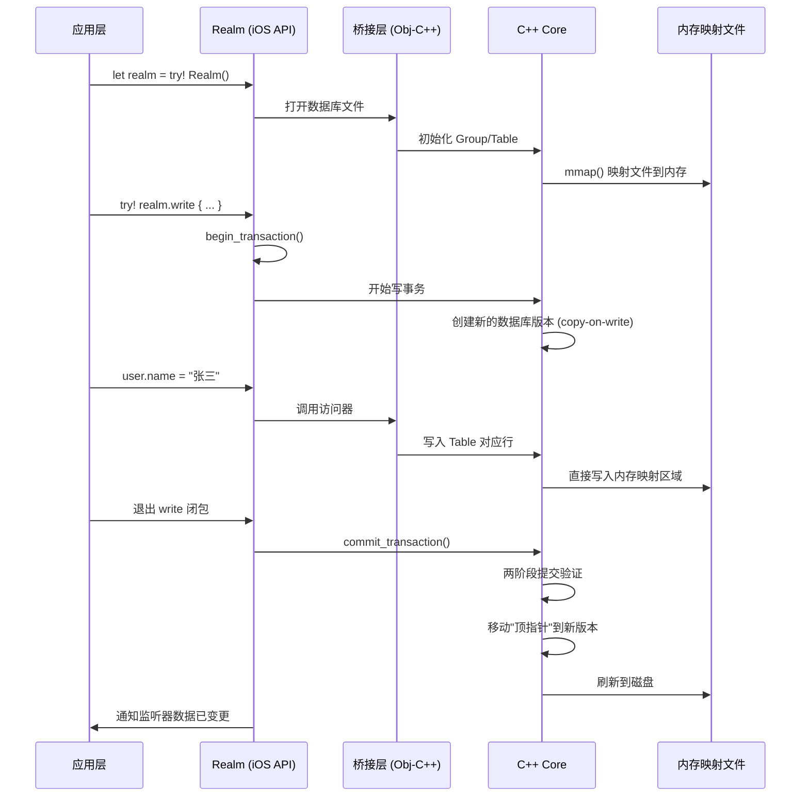
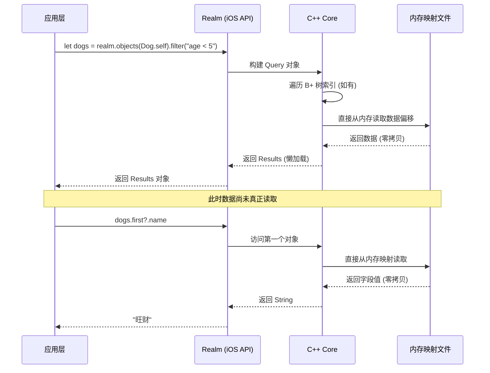

# Realm 源码深度解析：架构、设计模式与 iOS 实战

## 一、写在前面

在移动端数据持久化领域，Realm 是一个绕不开的名字。它由 Realm 公司（现已被 MongoDB 收购）开发，是一个专为移动设备设计的对象数据库。与 SQLite、Core Data 这些传统方案不同，Realm **不是对 SQLite 的封装**，而是**完全从零开始用 C++ 构建了自己的存储引擎**。

在 iOS 开发中，`let realm = try! Realm()` 和 `try! realm.write { ... }` 这些调用几乎成了对象数据库操作的标准写法。但这一行行代码背后到底发生了什么？对象是怎么映射到存储层的？MVCC 是如何实现的？零拷贝架构又是怎样做到的？为什么 Realm 对象不能跨线程传递？

本文将从 **架构设计、底层原理、类图、设计模式、工作流程、关键源码解析、常见用法、优缺点、常见踩坑** 九个维度，以 iOS 平台为主，深入剖析 Realm 的技术内幕。


## 二、架构设计

### 2.1 整体分层架构

Realm 采用**多层桥接架构**，各层各司其职：

```
┌─────────────────────────────────────────────────────────────────────┐
│                       【应用层 / 业务代码】                           │
│              开发者通过 Realm API 进行 CRUD 操作                     │
└─────────────────────────────┬───────────────────────────────────────┘
                              │
┌─────────────────────────────▼───────────────────────────────────────┐
│                    【iOS API 层 (Swift / Obj-C)】                    │
│  ┌──────────────┐ ┌──────────────┐ ┌──────────────┐                │
│  │   Realm      │ │   Object     │ │   Results    │                │
│  │ (数据库实例)  │ │ (模型基类)   │ │ (查询结果集)  │                │
│  └──────────────┘ └──────────────┘ └──────────────┘                │
│  ┌──────────────┐ ┌──────────────┐                                 │
│  │   List       │ │  Migration   │                                 │
│  │ (对多关系)    │ │ (数据迁移)    │                                 │
│  └──────────────┘ └──────────────┘                                 │
└─────────────────────────────┬───────────────────────────────────────┘
                              │ Objective-C++ / Swift 桥接
┌─────────────────────────────▼───────────────────────────────────────┐
│                      【JNI / 桥接层】                                │
│            Objective-C++ 封装，连接 iOS API 与 C++ Core             │
│         负责：对象生命周期管理、异常转换、内存管理                    │
└─────────────────────────────┬───────────────────────────────────────┘
                              │
┌─────────────────────────────▼───────────────────────────────────────┐
│                    【C++ Core 存储引擎】                             │
│  ┌──────────────┐ ┌──────────────┐ ┌──────────────┐                │
│  │   Group      │ │   Table      │ │   Query      │                │
│  │ (数据库容器)  │ │ (数据表)     │ │ (查询引擎)   │                │
│  └──────────────┘ └──────────────┘ └──────────────┘                │
│  ┌──────────────┐ ┌──────────────┐ ┌──────────────┐                │
│  │  MVCC 引擎   │ │  B+ 树索引   │ │  加密模块    │                │
│  └──────────────┘ └──────────────┘ └──────────────┘                │
└─────────────────────────────┬───────────────────────────────────────┘
                              │ mmap (内存映射)
┌─────────────────────────────▼───────────────────────────────────────┐
│                      【文件系统 .realm】                             │
│              单文件存储，支持 AES-256 加密               │
└─────────────────────────────────────────────────────────────────────┘
```

### 2.2 核心设计原则

Realm 最核心的设计理念就是**对象驱动（Object-Driven）** 。这个原则决定了 Realm 从头搭建自己的存储引擎，而不是采用现有的关系模型。与 SQLite、Core Data 等基于关系模型的方案不同，Realm 的数据模型直接对应应用中的对象模型——**类对应表，属性对应列，对象对应行**，开发者操作的是活生生的对象，而不是 SQL 语句或 NSManagedObject 的上下文。

### 2.3 与 Core Data / SQLite 的本质差异

Realm 与 Core Data 的底层架构完全不同：

| 特性 | **Core Data** | **Realm** |
| :--- | :--- | :--- |
| 底层引擎 | 封装 SQLite | 自研 C++ 数据库引擎 |
| 数据读取机制 | 序列化/反序列化、双层缓存 | 零拷贝内存映射，无序列化开销 |
| 并发模型 | 上下文隔离，线程严格隔离 | MVCC 读写并发 |
| 文件结构 | db+wal+shm 多文件碎片 | 单文件紧凑存储 |
| 层级开销 | 多层封装，开销大 | 原生底层，开销极小 |

Realm 不基于 SQLite、不基于任何第三方数据库，是完全自研的 C++ 跨平台数据库引擎。这也是 Realm 能实现极致性能的根本原因。


## 三、底层实现原理

### 3.1 零拷贝（Zero-Copy）架构

传统数据库的查询流程是这样的：磁盘 → 文件系统缓存 → 数据库引擎缓存 → ORM 映射 → 应用对象。每一次数据访问都涉及多次数据复制和序列化/反序列化。

而 Realm 完全不同。Realm 的数据库文件通过 **memory-mapped（内存映射）** 方式加载。数据库文件本身直接映射到应用的内存地址空间（虚拟内存），Realm 访问文件偏移就好比文件已经在内存中一样。

这意味着：
- **查询时不需要反序列化**：数据直接从内存读取
- **更新时不需要序列化**：修改直接写入内存映射区域
- **几乎无内存开销**：每个 Realm 对象通过一个本地长指针直接指向底层数据库

在 iPhone 12 上的测试显示，10 万条记录的批量插入耗时仅 **0.8 秒**，较 SQLite 快 3 倍。在超过 1000 条记录的写入场景下，Realm 比 SwiftData 快约 **3-6 倍**。

### 3.2 MVCC（多版本并发控制）

Realm 是一个**类 MVCC 数据库**。每个连接的线程在特定的时刻都有一个数据库的快照。

MVCC 在设计上采用了和 **Git 一样的版本管理算法**：
- 每个连接线程就好比在一个**分支**（数据库的快照）上工作
- 但并没有得到一个完整的数据库拷贝
- 写操作在**新的数据库版本**上进行（类似于 Git 的 commit）
- 提交时采用 **copy-on-write** 机制——重新创建树的分支，在不改变现有数据的情况下完成写操作

**Realm 与真正的 MVCC 数据库（如 PostgreSQL）的关键区别**：Realm 在某个时刻**只能有一个写操作**，且总是操作**最新的数据版本**，不能在老版本操作。这意味着 Realm 的写事务是**串行化**的，避免了复杂的冲突检测。

MVCC 解决了重要的并发问题：当有人正在写数据库的时候，有人又想读取数据库了。读操作**完全不需要加锁**，因为每个线程看到的是自己的一致性快照。

### 3.3 事务的两阶段提交

Realm 采用**两阶段提交**来验证写操作：
1. **验证阶段**：先验证所有写入内容的合法性
2. **提交阶段**：只有验证通过后才移动“顶指针”，将新版本标记为官方版本

如果在写事务过程中发生了错误，原始数据不受影响，顶指针依旧指向没有被损坏的数据。

### 3.4 加密机制

Realm 支持使用 **AES-256 + SHA2** 加密整个数据库文件。创建 Realm 数据库时使用 64 位密钥进行加密，硬盘上的数据通过 AES-256 加密，并通过 SHA-2 HMAC 进行完整性校验。


## 四、核心类图

Realm Cocoa 的 API 被设计得极为精简——**只有 4 个核心类和 1 个工具类**：

```
┌─────────────────────────────────────────────────────────────────────┐
│                      【Realm 核心类图】                             │
├─────────────────────────────────────────────────────────────────────┤
│                                                                     │
│  ┌─────────────────────────────────────────────────────────────┐    │
│  │                      Realm                                 │    │
│  │  - configuration: Realm.Configuration                      │    │
│  │  - schema: Realm.Schema                                    │    │
│  │  + init(configuration:) throws                            │    │
│  │  + write(_:) throws                                       │    │
│  │  + objects<T: Object>(_:) -> Results<T>                   │    │
│  │  + create<T: Object>(_:value:update:) -> T               │    │
│  │  + delete(_:)                                             │    │
│  │  + refresh()                                              │    │
│  └───────────────────────────┬─────────────────────────────────┘    │
│                              │ 持有                                 │
│                              ▼                                     │
│  ┌─────────────────────────────────────────────────────────────┐    │
│  │                   Object (基类)                             │    │
│  │  + isInvalidated: Bool                                     │    │
│  │  + isFrozen: Bool                                          │    │
│  │  + freeze() -> Self                                        │    │
│  │  + thaw() -> Self?                                         │    │
│  └───────────────┬─────────────────────────────────────────────┘    │
│                  │ 继承                                            │
│                  ▼                                                 │
│  ┌─────────────────────────────────────────────────────────────┐    │
│  │                    User: Object                             │    │
│  │  @Persisted(primaryKey: true) var id: String               │    │
│  │  @Persisted var name: String                               │    │
│  │  @Persisted var dogs: List<Dog>                            │    │
│  └─────────────────────────────────────────────────────────────┘    │
│                                                                     │
│  ┌─────────────────────────────────────────────────────────────┐    │
│  │                    Results<T: Object>                       │    │
│  │  + count: Int                                              │    │
│  │  + first(where:) -> T?                                     │    │
│  │  + filter(_:) -> Results<T>                                │    │
│  │  + sorted(by:) -> Results<T>                               │    │
│  │  + observe(_:) -> NotificationToken                        │    │
│  └─────────────────────────────────────────────────────────────┘    │
│                                                                     │
│  ┌─────────────────────────────────────────────────────────────┐    │
│  │                    List<T: Object>                          │    │
│  │  + append(_:)                                              │    │
│  │  + insert(_:at:)                                           │    │
│  │  + remove(at:)                                             │    │
│  │  + move(from:to:)                                          │    │
│  └─────────────────────────────────────────────────────────────┘    │
└─────────────────────────────────────────────────────────────────────┘
```

### 核心类职责说明

| 类名 | 职责 |
| :--- | :--- |
| `Realm` | 数据库实例的入口，管理事务、查询、模式迁移等 |
| `Object` | 所有数据模型的基类，开发者定义的模型继承自它 |
| `Results` | 查询结果集，支持懒加载和自动更新 |
| `List` | 对多关系的容器，类似数组但类型固定 |
| `Migration` | 数据迁移工具类 |

### @Persisted 属性包装器

Swift 版本中，使用 `@Persisted` 标记需要持久化的属性：

```swift
class User: Object {
    @Persisted(primaryKey: true) var id: ObjectId
    @Persisted var name: String = ""
    @Persisted var email: String?
    @Persisted var dogs: List<Dog>
}
```

Realm Swift 支持的基本类型包括：`Bool`、`Int`、`Int8`、`Int16`、`Int32`、`Int64`、`Float`、`Double`、`String`、`Date`、`Data`，以及可选类型和 `List<T>` 关系。


## 五、设计模式解析

Realm 的架构背后运用了多种经典的设计模式。

### 5.1 桥接模式（Bridge Pattern）

Realm 最核心的设计模式是**桥接模式**。iOS API 层的 `Realm`、`Object` 等类是“抽象部分”，而 C++ Core 的 `Group`、`Table`、`Query` 等类是“实现部分”。两者通过 Objective-C++ 桥接层连接。

这种设计让**抽象和实现可以独立变化**——iOS API 可以演进而不需要改动 C++ 引擎，C++ 引擎也可以优化而不影响上层 API。

### 5.2 模板方法模式（Template Method Pattern）

`Realm` 的事务管理体现了模板方法模式：

```swift
try! realm.write {
    // 业务逻辑——可变部分
}
```

事务的“开始-执行-提交/回滚”流程是固定的，而具体的业务逻辑由开发者在 `write` 闭包中实现。

### 5.3 建造者模式（Builder Pattern）

`Realm.Configuration` 使用了建造者模式：

```swift
let config = Realm.Configuration(
    fileURL: fileURL,
    schemaVersion: 2,
    migrationBlock: { ... },
    encryptionKey: key
)
```

### 5.4 观察者模式（Observer Pattern）

Realm 的通知机制是典型的观察者模式：

```swift
let token = results.observe { changes in
    // 数据变化时自动收到通知
}
```

### 5.5 工厂模式（Factory Pattern）

`Realm` 的 `objects(_:)` 方法充当了工厂的角色，根据传入的 `Object` 类型创建对应的 `Results` 查询结果集。


## 六、工作流程

### 6.1 完整写入流程（泳道图）



### 6.2 完整查询流程



### 6.3 关键流程说明

**第一步：获取 Realm 实例**。`try! Realm()` 通过配置打开或创建数据库文件，底层调用 `mmap()` 将文件映射到内存。

**第二步：开始写事务**。`realm.write { ... }` 内部调用 `begin_transaction()`，在 MVCC 机制下创建一个新的数据库版本。

**第三步：修改对象**。通过 `@Persisted` 属性包装器生成的访问器，将修改写入 C++ Core 的 Table 中，直接更新内存映射区域。

**第四步：提交事务**。退出 `write` 闭包后调用 `commit_transaction()`，采用两阶段提交验证并移动“顶指针”。

**第五步：通知观察者**。事务提交后，所有注册的 `NotificationToken` 收到数据变更通知。


## 七、iOS 常见用法

### 7.1 安装配置

**CocoaPods（推荐）**：

```ruby
platform :ios, '12.0'
target 'YourApp' do
  use_frameworks!
  pod 'RealmSwift'   # Swift 项目
  # pod 'Realm'      # Objective-C 项目
end
```

Realm 的库文件大小约为 **1MB 左右**。

### 7.2 模型定义

```swift
import RealmSwift

class Dog: Object {
    @Persisted(primaryKey: true) var id: String
    @Persisted var name: String
    @Persisted var age: Int
    @Persisted var owner: Person?  // 对一关系
}

class Person: Object {
    @Persisted(primaryKey: true) var id: String
    @Persisted var name: String
    @Persisted var dogs: List<Dog>  // 对多关系
    
    // 为常用查询字段添加索引
    override static func indexedProperties() -> [String] {
        return ["name"]
    }
}
```

### 7.3 CRUD 操作

```swift
let realm = try! Realm()

// Create - 必须在写事务中执行
try! realm.write {
    let person = Person()
    person.id = "p001"
    person.name = "张三"
    realm.add(person)
}

// Read - 懒加载，数据真正访问时才读取
let dogs = realm.objects(Dog.self)
let youngDogs = dogs.filter("age < 5")
let sorted = youngDogs.sorted(byKeyPath: "name", ascending: true)

// Update
try! realm.write {
    if let dog = realm.object(ofType: Dog.self, forPrimaryKey: "d001") {
        dog.name = "小黄"
    }
}

// Delete
try! realm.write {
    let oldDogs = realm.objects(Dog.self).filter("age > 15")
    realm.delete(oldDogs)
}
```

### 7.4 数据迁移

当数据模型发生变化时，需要配置迁移逻辑：

```swift
let config = Realm.Configuration(
    schemaVersion: 2,
    migrationBlock: { migration, oldSchemaVersion in
        if oldSchemaVersion < 1 {
            // 版本 0 → 1 的迁移
        }
        if oldSchemaVersion < 2 {
            // 版本 1 → 2 的迁移
            migration.enumerateObjects(ofType: Person.className()) { oldObj, newObj in
                newObj?["createdAt"] = Date()
            }
        }
    }
)
Realm.Configuration.defaultConfiguration = config
```

**注意**：模型结构变更时需显式定义迁移逻辑，否则会抛出异常。

### 7.5 通知与自动更新

Realm 对象是 **"Live Objects"**——对象直接指向内存映射区域，数据变化时对象自动更新。

```swift
let token = realm.objects(Dog.self).observe { changes in
    switch changes {
    case .initial:
        break
    case .update(_, let deletions, let insertions, let modifications):
        // 自动收到增删改通知
        break
    case .error(let error):
        print(error)
    }
}
// 在 deinit 或适当时机释放
token.invalidate()
```

**通知监听未正确释放是常见的内存泄漏原因**。

### 7.6 SwiftUI 集成

```swift
import RealmSwift

struct DogListView: View {
    @ObservedResults(Dog.self) var dogs
    
    var body: some View {
        List(dogs) { dog in
            Text(dog.name)
        }
    }
}
```


## 八、线程模型（最大踩坑点）

### 8.1 核心规则

Realm 对象**只能在其被创建的线程上访问**。跨线程访问会抛出 `"Realm accessed from incorrect thread"` 异常。

这是因为 Realm 的零拷贝架构让对象直接指向内存映射区域，而内存映射区域是线程相关的。跨线程传递对象引用会导致数据不一致。

**不要在多个线程之间共享 Realm 对象**。如果要在另外一个线程获取同样的数据，请重新执行查询。

### 8.2 传统 GCD 方式

```swift
DispatchQueue.global().async {
    autoreleasepool {  // 避免内存泄漏
        let realm = try! Realm()
        try! realm.write {
            // 批量写入
        }
    }
}
```

**注意**：不使用 `@autoreleasepool` 包裹可能导致内存泄漏。

### 8.3 Swift Concurrency + Actor（关键）

**在 async/await 环境中，任务可能在 suspension 后恢复到任意线程**。如果持有 Realm 实例，恢复后访问会直接崩溃。

❌ **错误做法**：

```swift
class TaskManager {
    let realm: Realm  // 在线程 A 创建
    
    func fetchTasks() async -> [Task] {
        // 可能在 suspension 后恢复到线程 B
        return Array(realm.objects(Task.self))  // 💥 CRASH!
    }
}
```

✅ **正确做法：每个 actor 方法创建新的 Realm 实例**：

```swift
actor TaskManager {
    func fetchTasks() async throws -> [Task] {
        let realm = try Realm()  // 在 actor 的线程上创建
        return Array(realm.objects(Task.self))
    }
    
    func updateTask(_ id: String, completed: Bool) async throws {
        let realm = try Realm()  // 每次方法调用都创建新实例
        guard let task = realm.object(ofType: Task.self, forPrimaryKey: id) else {
            return
        }
        try realm.write {
            task.isCompleted = completed
        }
    }
}
```

为什么这样能工作：
- Actor 的所有方法在同一个串行队列上执行
- `try Realm()` 每次创建新实例，生命周期仅限于当前方法
- Realm 内部会缓存文件句柄，`try Realm()` 的实际开销很小

### 8.4 Actor-isolated Realm（Realm 10.39.0+）

从 Realm 10.39.0 开始，支持 **actor-isolated Realm**：

```swift
@globalActor actor BackgroundActor: GlobalActor {
    static var shared = BackgroundActor()
}

@BackgroundActor
func backgroundTask() async throws {
    let realm = try await Realm(actor: BackgroundActor.shared)
    try await realm.write { _ in
        // 异步写入，不阻塞当前线程
        realm.create(MyObject.self)
    }
}
```

Actor-isolated Realm 支持 **异步写入**：`try await realm.write { ... }` 会挂起当前任务，在不阻塞线程的情况下获取写锁，数据在后台线程写入磁盘。

**要求**：Swift 5.8 (Xcode 14.3)。强烈建议启用严格并发检查和运行时 actor 数据竞争检测。


## 九、优缺点分析

### 9.1 优点

**1. 极致性能**
- 零拷贝架构让查询几乎无开销
- 批量插入 10 万条记录仅需 0.8 秒
- 查询速度比 SQLite/Core Data 快 2-3 倍

**2. 线程模型友好**
- MVCC 让读操作不需要加锁
- 相比 Core Data 的上下文隔离，Realm 的线程模型简单得多

**3. API 极简**
- 只有 4 个核心类，上手极快
- 对象即数据，无需 ORM 映射

**4. 跨平台共享**
- 数据库文件可在 iOS 和 Android 间共享

**5. Live Objects**
- 对象自动更新，无需手动刷新
- 配合通知机制，UI 自动响应数据变化

**6. 内置加密**
- AES-256+SHA2 加密

### 9.2 缺点

**1. 线程限制**
- 对象不能跨线程传递
- 在 Swift Concurrency 中需要特别注意

**2. 包体积增加**
- 库文件约 1MB
- 对 Widget、Extension 等内存受限场景不友好

**3. 查询能力有限**
- 不支持复杂的 SQL 查询（如多表 JOIN）
- 谓词语法相比 SQL 表达能力有限

**4. 数据大小限制**
- `NSData` 及 `NSString` 属性不能保存超过 16M 数据

**5. 迁移需要显式处理**
- 模型变更必须写迁移逻辑，否则启动崩溃

**6. 写事务串行**
- 同一时刻只有一个写操作
- 高并发写入场景可能成为瓶颈


## 十、常见问题与踩坑总结

### 10.1 🔥 跨线程访问崩溃

```
*** Terminating app due to uncaught exception 'RLMException', 
reason: 'Realm accessed from incorrect thread'
```

**原因**：Realm 对象是线程绑定的。在 async/await 中持有 Realm 实例，任务恢复后可能切换到其他线程。

**解决方案**：
- 不要跨线程传递 Realm 对象
- 每个线程/actor 方法创建新的 Realm 实例
- 或使用 actor-isolated Realm

### 10.2 🔥 内存泄漏

**原因**：后台线程未使用 `autoreleasepool`。

**解决方案**：
```swift
DispatchQueue.global().async {
    autoreleasepool {
        let realm = try! Realm()
        // 操作...
    }
}
```

### 10.3 🔥 模型迁移崩溃

**原因**：模型结构变更后未配置迁移逻辑。

**解决方案**：每次修改模型时递增 `schemaVersion` 并编写迁移代码。

### 10.4 🔥 通知监听未释放

**原因**：`NotificationToken` 未正确释放。

**解决方案**：在 `deinit` 或适当时机调用 `token.invalidate()`。

### 10.5 ⚠️ 主线程写入卡顿

**原因**：在主线程执行大量写入操作。

**解决方案**：将写入操作移到后台线程执行。

### 10.6 ⚠️ 查询性能下降

**原因**：未为常用查询字段添加索引。

**解决方案**：覆写 `indexedProperties()` 方法为查询字段添加索引。

### 10.7 ⚠️ 数据量过大

**原因**：Realm 不适合存储超大二进制数据（超过 16M）。

**解决方案**：大文件存储在文件系统，Realm 只存路径引用。

### 10.8 ⚠️ Widget/Extension 内存问题

**原因**：Realm 在内存受限环境中可能表现不佳。

**解决方案**：在 Widget 或 Extension 中谨慎使用 Realm，或考虑替代方案。

### 10.9 ⚠️ Xcode 版本兼容性

**原因**：不同 Xcode 版本可能存在构建问题。

**解决方案**：保持 Realm 版本与 Xcode 版本匹配，关注官方 Release Notes。


## 十一、总结

Realm 从 2014 年首次发布至今已有十余年，经历了从独立公司到被 MongoDB 收购的历程。它能在移动数据库领域获得如此广泛的认可——被广泛应用于各类移动应用的生产环境中——靠的并不是对现有技术的封装，而是**从头开始构建一套全新的数据存储方案**。

**零拷贝 + MVCC** 赋予了 Realm 超越 Core Data 和 SQLite 的读写性能；**极简的 API**（4 个核心类）让开发者能快速上手；**Live Objects** 和通知机制让 UI 自动更新成为可能。

对于大多数 iOS 项目来说，Realm 是一个比 Core Data 更高效、更易用的选择。尤其是在需要高性能数据读写、跨平台数据共享的场景下，Realm 的优势更加明显。

但在使用时必须牢记：
1. **Realm 对象不能跨线程传递**
2. **在 async/await 中遵循“每个 actor 方法创建新 Realm 实例”的原则**
3. **模型变更必须写迁移逻辑**
4. **通知监听必须及时释放**

如果说 Core Data 是 Apple 给开发者的一套“官方但复杂”的解决方案，那么 Realm 就是社区给出的一套“优雅且高效”的替代方案。读懂它的源码，就能理解什么叫**为移动端场景从零设计一套高性能存储系统**。