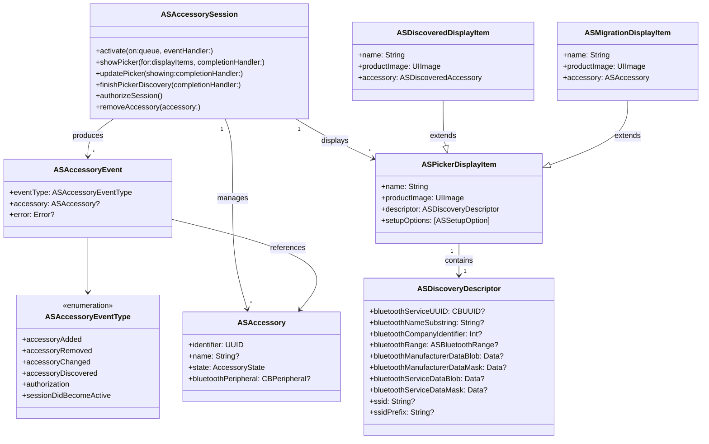
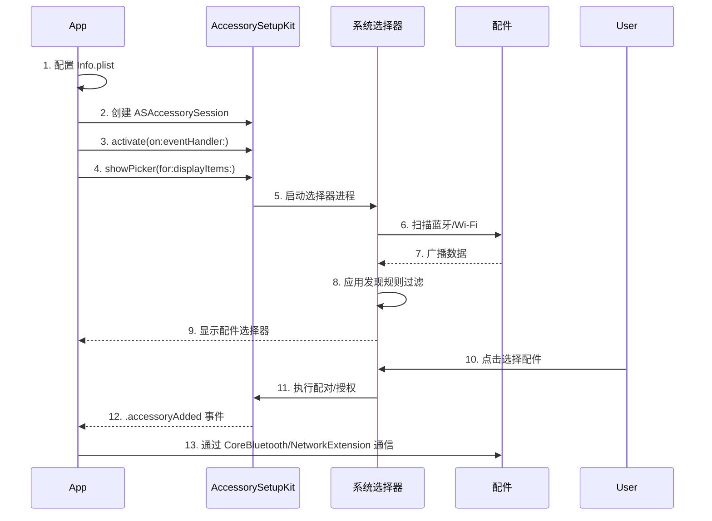

## 一、基本介绍

AccessorySetupKit 是 Apple 在 WWDC 2024 推出的全新框架，支持 iOS 18+ 和 iPadOS 18+。它提供了一种**隐私保护**的方式来发现和配置蓝牙（BLE）及 Wi-Fi 配件。

**核心价值**：取代了过去需要请求"广泛蓝牙使用权限"的流程，改用**系统提供的配件选择器**，用户只需轻点一下即可完成配件授权，无需跳转到"设置"App。App 完成授权后，仍通过 CoreBluetooth 和 NetworkExtension 与配件通信。

**关键特性**：
- 配件选择器显示高保真产品图像和友好名称，帮助用户识别配件真实性
- 支持配件配对移除和重命名
- 配件在系统"隐私与安全性"设置中集中管理

---

## 二、架构设计

### 2.1 整体架构

AccessorySetupKit 采用**进程隔离**的架构设计：

```
┌─────────────────────────────────────────────────────────┐
│                     你的 App                           │
│  ┌─────────────────────────────────────────────────┐   │
│  │  ASAccessorySession (激活/事件处理)             │   │
│  │  ASDiscoveryDescriptor (发现规则)               │   │
│  │  ASPickerDisplayItem (选择器展示项)             │   │
│  └─────────────────┬───────────────────────────────┘   │
│                    │ XPC                              │
└────────────────────┼──────────────────────────────────┘
                     ▼
┌─────────────────────────────────────────────────────────┐
│             系统选择器进程 (独立进程)                    │
│  • 执行蓝牙/Wi-Fi 扫描                                 │
│  • 应用发现规则过滤                                    │
│  • 渲染配件选择器 UI                                   │
│  • 处理用户授权                                        │
└─────────────────────────────────────────────────────────┘
```

配件选择器在**单独的进程**中运行，App 将发现规则和素材发送给选择器进程。这种设计保障了隐私——App 无需获得广泛的蓝牙/Wi-Fi 权限即可发现配件。

### 2.2 核心类与职责

| 类                        | 职责                                                    |
| ------------------------- | ------------------------------------------------------- |
| `ASAccessorySession`      | 会话管理核心，负责激活、事件分发、展示选择器            |
| `ASAccessoryEvent`        | 封装会话中发生的事件（配件添加/移除/授权等）            |
| `ASDiscoveryDescriptor`   | 定义配件发现匹配规则（服务 UUID、名称子串、厂商数据等） |
| `ASAccessory`             | 已发现/已授权的配件对象                                 |
| `ASPickerDisplayItem`     | 选择器中展示的配件项，包含名称、图片和发现描述符        |
| `ASDiscoveredDisplayItem` | 自定义发现后的选择器展示项                              |
| `ASMigrationDisplayItem`  | 用于将已有配件迁移到 AccessorySetupKit 管理             |

---

## 三、底层原理

### 3.1 Info.plist 声明机制

使用 AccessorySetupKit 前，必须在 Info.plist 中声明支持的发现规则：

```xml
NSAccessorySetupSupports = ["Bluetooth"]  // 或 "WiFi"
NSAccessorySetupBluetoothServices = ["12345678-1234-..."]  // 服务 UUID
NSAccessorySetupBluetoothNames = ["MyDevice"]  // 名称或子串
NSAccessorySetupBluetoothCompanyIdentifiers = ["0x004C"]  // 公司 ID
```

**重要约束**：运行时使用的发现规则必须与 Info.plist 中声明的一致，否则 App 会崩溃。

### 3.2 权限模型变更

当 App 声明了 `NSAccessorySetupSupports` 包含 Bluetooth 后，创建 `CBCentralManager` 不再触发系统蓝牙权限弹窗。`CBCentralManager` 的状态只有在 App 至少有一个通过 AccessorySetupKit 配对的配件时才会变为 `poweredOn`。

### 3.3 BLE 配对与绑定

AccessorySetupKit 引入了**程序化控制 BLE 绑定生命周期**的能力。当连接通过 AccessorySetupKit 发现的设备时：
- 配对和绑定在**无系统配对弹窗**的情况下完成
- 绑定后的设备会出现在系统"设置"→"蓝牙"的设备列表中

---

## 四、Mermaid 类图



---

## 五、设计模式

### 5.1 观察者模式 (Observer Pattern)

`ASAccessorySession` 通过 `activate(on:eventHandler:)` 注册事件处理器，采用**回调/闭包**的方式将事件分发给 App。这是典型的观察者模式实现。

### 5.2 建造者模式 (Builder Pattern)

`ASDiscoveryDescriptor` 通过属性赋值的方式逐步构建复杂的发现规则，类似于建造者模式：

```swift
let descriptor = ASDiscoveryDescriptor()
descriptor.bluetoothServiceUUID = CBUUID(string: "12345678-...")
descriptor.bluetoothNameSubstring = "MyDevice"
descriptor.bluetoothRange = .immediate
```

### 5.3 策略模式 (Strategy Pattern)

`ASPickerDisplayItem` 中的 `setupOptions` 允许 App 指定不同的配对策略（如 `.confirmAuthorization`、`.finishInApp`、`.suppressSystemPairingPrompt`），体现了策略模式。

### 5.4 适配器模式 (Adapter Pattern)

`ASMigrationDisplayItem` 将之前通过其他方式配置的配件适配到 AccessorySetupKit 的管理体系中，是适配器模式的典型应用。

---

## 六、工作流程



**详细步骤说明**：

1. **声明**：在 Info.plist 中声明支持的无线技术和发现规则
2. **激活会话**：创建 `ASAccessorySession` 实例并调用 `activate(on:eventHandler:)`
3. **展示选择器**：调用 `showPicker(for:completionHandler:)`，传入 `ASPickerDisplayItem` 数组
4. **系统扫描**：系统选择器进程执行扫描并应用发现规则过滤
5. **用户选择**：用户在系统选择器中点击配件
6. **授权与配对**：系统执行配对/授权，完成后通过事件回调通知 App
7. **App 通信**：App 通过 CoreBluetooth 或 NetworkExtension 与配件通信

---

## 七、具体实现代码

### 7.1 Info.plist 配置

```xml
<key>NSAccessorySetupSupports</key>
<array>
    <string>Bluetooth</string>
</array>
<key>NSAccessorySetupBluetoothServices</key>
<array>
    <string>12345678-1234-1234-1234-123456789ABC</string>
</array>
<key>NSAccessorySetupBluetoothNames</key>
<array>
    <string>MyDevice</string>
</array>
```

### 7.2 发现描述符与选择器展示项

```swift
import AccessorySetupKit
import CoreBluetooth

// 创建发现描述符
let descriptor = ASDiscoveryDescriptor()
descriptor.bluetoothServiceUUID = CBUUID(string: "12345678-1234-1234-1234-123456789ABC")
descriptor.bluetoothNameSubstring = "MyDevice"
descriptor.bluetoothRange = .immediate  // 仅限附近设备

// 创建选择器展示项
let displayItem = ASPickerDisplayItem(
    name: "我的配件",
    productImage: UIImage(named: "accessory_image")!,
    descriptor: descriptor
)
// 对于 Passkey Entry 配对，需要设置确认授权选项
displayItem.setupOptions = [.confirmAuthorization, .finishInApp]
```

### 7.3 会话激活与事件处理

```swift
class AccessoryManager {
    private var accessorySession: ASAccessorySession
    
    init() {
        accessorySession = ASAccessorySession()
        accessorySession.activate(on: DispatchQueue.main) { [weak self] event in
            self?.handleSessionEvent(event)
        }
    }
    
    func startDiscovery() {
        accessorySession.showPicker(for: [displayItem]) { error in
            if let error = error {
                print("Failed to show picker: \(error.localizedDescription)")
            }
        }
    }
    
    private func handleSessionEvent(_ event: ASAccessoryEvent) {
        switch event.eventType {
        case .accessoryAdded:
            // 配件已授权，可以开始通信
            if let accessory = event.accessory,
               let peripheral = accessory.bluetoothPeripheral {
                // 使用 CoreBluetooth 连接并通信
            }
        case .authorization:
            // 关键：显式确认授权，避免配对卡死
            accessorySession.authorizeSession()
        case .sessionDidBecomeActive:
            print("Pairing completed")
        default:
            break
        }
    }
}
```

### 7.4 Wi-Fi 配件发现

```swift
var descriptor = ASDiscoveryDescriptor()
descriptor.ssidPrefix = "MyAccessory"  // SSID 前缀匹配
```

---

## 八、应用业务场景

| 场景                | 说明                                                      |
| ------------------- | --------------------------------------------------------- |
| **BLE 外设配对**    | 健身追踪器、智能手表、传感器等蓝牙设备的一键配对          |
| **Wi-Fi 配件配置**  | 智能家居设备（灯泡、插座、摄像头）的 Wi-Fi 网络配置       |
| **双模配件**        | 同时支持蓝牙和 Wi-Fi 的配件，一次设置获得两种通信权限     |
| **配件迁移**        | 将之前通过其他方式配置的配件迁移到 AccessorySetupKit 管理 |
| **多 App 共享配件** | 多个 App 可通过系统设置管理同一配件的访问权限             |

---

## 九、优缺点

### 9.1 优点

| 优点               | 说明                                             |
| ------------------ | ------------------------------------------------ |
| **隐私保护**       | 无需请求广泛的蓝牙/Wi-Fi 权限，用户可逐配件授权  |
| **用户体验优秀**   | 系统级选择器显示产品图片和名称，无需跳转设置     |
| **简化开发**       | 无需实现自定义设备选择 UI 和权限处理逻辑         |
| **统一管理**       | 配件在系统设置中集中管理，用户可随时移除或重命名 |
| **程序化绑定控制** | App 可编程控制 BLE 绑定生命周期                  |

### 9.2 缺点

| 缺点               | 说明                                                  |
| ------------------ | ----------------------------------------------------- |
| **仅限 iOS 18+**   | 无法向下兼容，需为旧系统保留 CoreBluetooth 回退方案   |
| **声明约束严格**   | 运行时发现规则必须与 Info.plist 完全匹配，否则崩溃    |
| **调试困难**       | 选择器在独立进程运行，调试和日志查看较为复杂          |
| **模拟器不支持**   | 必须在真机上测试                                      |
| **部分场景不成熟** | 如 RRA 地址旋转、工厂重置后重新发现等场景存在已知问题 |

---

## 十、常见坑与解决方案

### 坑 1：配对卡在 "Connecting" 状态

**现象**：使用 Passkey Entry 配对时，输入 PIN 码后 iPhone 卡在 Connecting 状态，对端显示已配对但 iOS 超时失败。

**原因**：未正确处理 `.authorization` 事件，或 `.confirmAuthorization` 与系统流程冲突。

**解决方案**：
```swift
case .authorization:
    accessorySession.authorizeSession()  // 显式确认授权
```
同时添加 `.suppressSystemPairingPrompt` 选项：
```swift
displayItem.setupOptions = [.confirmAuthorization, .suppressSystemPairingPrompt]
```

### 坑 2：Info.plist 声明不匹配导致崩溃

**现象**：运行时使用的 `ASDiscoveryDescriptor` 规则与 Info.plist 不一致时 App 崩溃。

**解决方案**：确保 Info.plist 中的 `NSAccessorySetupBluetoothServices`、`NSAccessorySetupBluetoothNames`、`NSAccessorySetupBluetoothCompanyIdentifiers` 与代码中的描述符完全一致。

### 坑 3：BLE RRA 地址旋转导致重复条目

**现象**：支持 RRA（Resolvable Random Address）的 BLE 设备在地址变化后，选择器中出现重复条目。

**解决方案**：使用 `bluetoothManufacturerDataBlob` + `bluetoothManufacturerDataMask` 或 `bluetoothServiceDataBlob` + `bluetoothServiceDataMask` 进行精确匹配，确保只发现处于配对模式的设备。

### 坑 4：工厂重置后配件不再出现

**现象**：配件工厂重置后，选择器中不再显示该配件。

**原因**：系统可能缓存了之前的配对状态。

**解决方案**：在 App 中主动调用 `removeAccessory(accessory:)` 移除旧配对记录，或引导用户进入配对模式后再重新发现。

### 坑 5：用户点击关闭按钮导致错误

**现象**：用户点击选择器的关闭（×）按钮后，`showPicker` 回调返回错误（`ASErrorDomain`，code 700）。

**解决方案**：在错误处理中区分用户取消和真正的错误：
```swift
accessorySession.showPicker(for: [displayItem]) { error in
    if let error = error as? ASError, error.code == .userCancelled {
        // 用户主动取消，无需特殊处理
        return
    }
    // 处理其他错误
}
```

### 坑 6：模拟器不支持

**现象**：AccessorySetupKit 在模拟器上无法工作。

**解决方案**：始终在真机上开发和测试 AccessorySetupKit 相关功能。

### 坑 7：配件在部分 iPhone 上无法发现

**现象**：同一配件在某些 iPhone 上无法被发现，但在其他设备上正常。

**可能原因**：系统级缓存或状态不一致。

**解决方案**：尝试重启 iPhone、在系统设置中移除配件记录、确保配件处于正确的配对模式。

AccessorySetupKit **不仅仅只做蓝牙配对**，它是一个为**蓝牙（BLE）和 Wi-Fi 配件**提供统一、隐私友好型发现与配置的框架。

它在 iOS 18 中引入，核心价值在于**取代了App过去需要获取的宽泛的蓝牙、Wi-Fi或本地网络权限，改为由系统提供一个选择器（Picker），让用户以逐个配件为单位进行精准授权**。

对于Wi-Fi配置，AccessorySetupKit支持两种不同的技术路径：

### 🔹 路径一：Wi-Fi Aware（直接设备到设备）

这是一种**不依赖路由器或热点**的直接设备到设备（Peer-to-Peer）通信技术。

*   **工作方式**：配件和iPhone通过Wi-Fi Aware直接发现并建立安全、加密的连接。
*   **优势**：带宽更高、延迟更低。配件在设置过程中无需先连接到一个现有的Wi-Fi网络。
*   **支持情况**：在`ASDiscoveryDescriptor`中指定Wi-Fi Aware属性即可使用。WWDC25 的“Supercharge device connectivity with Wi-Fi Aware”专题详细介绍了其与`AccessorySetupKit`的集成。

### 🔹 路径二：Wi-Fi Infrastructure（通过蓝牙分享Wi-Fi凭证）

这是当前智能家居产品更常见的做法：**利用蓝牙连接作为“带外”通道，安全地将Wi-Fi网络的SSID和密码传输给配件**。

*   **工作方式**：
    1.  App使用`AccessorySetupKit`发现并配对蓝牙配件。
    2.  配对成功后，App通过已建立的**安全蓝牙连接**，将手机当前连接的Wi-Fi网络凭证发送给配件。
    3.  配件收到凭证后，自行连接至该Wi-Fi网络。
*   **框架支持**：这通常需要结合**Wi-Fi Infrastructure**框架使用。Apple官方提供了一个名为“Sharing Wi-Fi network credentials”的示例代码来演示此流程。

### 🏠 在智能家居中的应用

在智能家居场景中，`AccessorySetupKit`完美地解决了“**头几次设置复杂**”的痛点：

1.  **简化发现**：用户打开App，系统选择器会直接显示附近待配置的智能灯、插座等配件图像和名称。
2.  **一键授权**：用户点击选择，即完成了对该配件的**蓝牙和Wi-Fi权限的一次性授权**。
3.  **自动配网**：对于Wi-Fi配件，App随后可通过蓝牙将家庭Wi-Fi密码安全地发送给配件，完成配网。
4.  **后续管理**：用户可在系统的“设置”->“隐私与安全性”->“配件”中，集中管理所有已授权配件的访问权限。

### 💎 总结

`AccessorySetupKit`是一个**统一的入口**。它不仅能处理蓝牙配对，也能通过 **Wi-Fi Aware** 或 **Wi-Fi Infrastructure** 两种方式处理Wi-Fi配件的发现、授权和配置。它解决了“权限”和“发现”的问题，而具体的Wi-Fi连接建立或数据传输，则交由`CoreBluetooth`、`Network`或`Wi-Fi Infrastructure`等底层框架去执行。