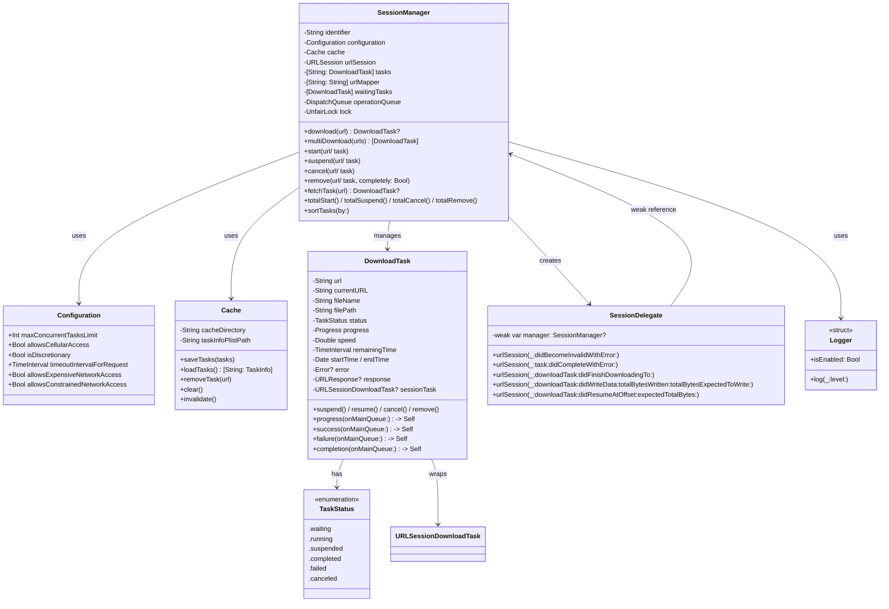

# Tiercel 下载框架深度解析

## 一、背景

### 1.1 项目起源

Tiercel 的作者在开发过程中面临一个核心问题：**如何并发下载一堆文件，并且全部下载完成后还能执行后续操作？** 当时虽然下载框架众多，但权威、流行且用 Swift 写的框架几乎没有。于是作者决定自己造一个轮子。

### 1.2 演进历程

- **Tiercel 1.x**：采用 `URLSessionDataTask` 实现，能满足基本需求，但并非原生支持后台下载。
- **Tiercel 2.0**：基于 `URLSessionDownloadTask` 全新实现，**完美支持原生级别后台下载**，App 被 Kill 后依然可以恢复下载。
- **Tiercel 3.0**：进行了大量代码重构，大幅提高性能，拥有更完善的错误处理，提供了更多方便的 API。改用 `os_unfair_lock` 进行线程同步，改用字典匹配任务提升 `fetchTask` 性能。
- **Tiercel 3.2.x**：进一步优化批量操作性能，支持上万任务批量操作。

### 1.3 当前版本

当前最新稳定版本为 **`3.2.6`**（可通过 GitHub Releases 或 CocoaPods 查询），支持 iOS 12.0+、Swift 5.0+、Xcode 15.0+，在 GitHub 上拥有 **2.9k+ Star**。

---

## 二、架构设计

### 2.1 核心组件

| 组件               | 职责                                                             |
| ------------------ | ---------------------------------------------------------------- |
| **SessionManager** | 核心协调器，提供应用的主要接口，负责任务创建、批量操作和配置管理 |
| **DownloadTask**   | 代表单个下载操作，维护状态、进度信息，提供控制下载生命周期的方法 |
| **Cache**          | 管理已下载文件和任务持久化，确保 App 终止后仍可恢复下载          |
| **Configuration**  | 提供下载行为的自定义选项，包括并发限制、网络设置等               |

### 2.2 模块划分

```
┌─────────────────────────────────────────────────────────────┐
│                      SessionManager                         │
│  ┌─────────────────────────────────────────────────────┐    │
│  │  对外 API：download / multiDownload / start /       │    │
│  │           suspend / cancel / remove / fetchTask    │    │
│  └─────────────────────────────────────────────────────┘    │
│                            │                                  │
│  ┌───────────┴───────────┐                                  │
│  ▼                       ▼                                  │
│ Cache              URLSession + Delegate                    │
│  │                       │                                  │
│  ▼                       ▼                                  │
│ plist 持久化       系统回调 → 任务状态更新                   │
│                            │                                  │
│                            ▼                                  │
│                      DownloadTask                            │
│            (进度/速度/剩余时间/状态/文件信息)                  │
└─────────────────────────────────────────────────────────────┘
```

### 2.3 关键设计决策

- **弃用单例模式**：App 内可以有多个 `SessionManager`，根据不同业务模块区分下载。
- **线程安全**：所有操作都是线程安全的，支持可靠的并发下载。
- **链式 API**：提供流畅的链式语法，代码更简洁。

---

## 三、底层实现原理

### 3.1 后台下载实现

Tiercel 的后台下载基于 `URLSession` 的 **Background Session** 实现：

```swift
let config = URLSessionConfiguration.background(withIdentifier: "com.Danie1s.Tiercel")
config.isDiscretionary = true
config.sessionSendsLaunchEvents = true
let session = URLSession(configuration: config, delegate: self, delegateQueue: nil)
```

关键要点：
- 必须使用 `background(withIdentifier:)` 创建配置，identifier 必须固定
- 必须在 App 启动时创建 Background Session，生命周期与 App 几乎一致
- 支持 iOS 13 的**低数据模式访问限制**和**昂贵网络访问限制**

### 3.2 断点续传原理（基础）

Tiercel 的断点续传依赖 `URLSessionDownloadTask` 的原生能力：
- 通过 `resumeData` 保存下载进度数据
- App 重启后，从 `Cache` 持久化存储中恢复任务元数据和 `resumeData`
- 调用 `downloadTask(withResumeData:)` 恢复下载

### 3.3 断点续传的恢复机制（含 Crash / 手动 Kill）

**为什么 App Crash 或被手动 Kill 后都能恢复？**

这得益于 `URLSessionDownloadTask` 由系统级的 `NSURLSession` 服务管理，独立于 App 进程。无论 App 因何种原因退出（Crash 或被手动 Kill），系统都会保留下载任务的上下文。当 App 重新启动并创建相同标识符的 `URLSession` 后，系统会通过 `urlSession(_:task:didCompleteWithError:)` 代理方法，将可续传的数据（`resumeData`）交还给 App。因此，只要 App 重启，Tiercel 就能利用这份 `resumeData` 无缝恢复下载。

**`resumeData` 在哪些场景下被保存？**

1. **主动暂停/取消时**：调用 `cancel(byProducingResumeData:)` 方法时，系统会立即生成 `resumeData`。
2. **任务意外中断时**：在代理方法 `urlSession(_:task:didCompleteWithError:)` 中，从 `error` 对象的 `userInfo[NSURLSessionDownloadTaskResumeData]` 中提取。

> **特别注意**：在 iOS 12.0 - 12.2 中，系统生成的 `resumeData` 存在 Bug，可能导致恢复失败。Tiercel 对此进行了专门修复。

**手动 Kill App 时，`resumeData` 能否及时保存？**

这取决于 iOS 版本：

| iOS 版本           | 行为                                                                                                                                                       |
| ------------------ | ---------------------------------------------------------------------------------------------------------------------------------------------------------- |
| **iOS 8**          | 手动 Kill 会**立即**调用 `cancel(byProducingResumeData:)` 方法，能及时保存。                                                                               |
| **iOS 9 ~ iOS 12** | 手动 Kill 会**立即停止**下载，但**不会立即调用**保存方法。`resumeData` 的生成会**延迟到 App 重新启动**，并创建好对应的后台会话（Background Session）之后。 |
| **iOS 13+**        | 行为与 iOS 9~12 类似，但系统对后台任务的管理更严格，`resumeData` 依然在 App 重启后由系统提供。                                                             |

因此，在 iOS 9+ 系统中，手动 Kill 时 `resumeData` **并非“及时”保存**，而是由系统在 App 重启后提供。开发者只需确保 App 启动时正确创建 Session，Tiercel 会处理好后续恢复。

**App 被 Kill 后，系统会自己继续下载吗？**

- **App 进入后台、发生 Crash 或被系统因资源回收而终止**：系统会接管下载任务，让它们**继续保持运行**。即使**重启手机**，未完成的下载任务也会在系统启动后自动继续。
- **用户手动滑动关闭 App（Kill）**：系统会**暂停**所有下载任务。只有当 App 被**重新启动**后，下载才会恢复（通过 `resumeData`）。

这意味着，Tiercel 支持在绝大多数异常退出场景下恢复下载，唯一的“暂停”仅发生在用户主动 Kill 时，且重启后依然可以续传。

### 3.4 下载速度计算原理

Tiercel 的速度计算是一个**时间窗口内的平均值**，核心逻辑如下：

1. **数据采集**：在 `URLSessionDownloadDelegate` 的 `urlSession(_:downloadTask:didWriteData:totalBytesWritten:totalBytesExpectedToWrite:)` 方法中，获取本次回调新写入的字节数（`bytesWritten`）。
2. **计算间隔**：记录本次回调与上次回调的时间间隔（秒）。
3. **瞬时速度**：用 `bytesWritten` 除以时间间隔，得到这一小段时间的“瞬时速度”（字节/秒）。
4. **平滑处理**：为获得更稳定的速度值，Tiercel 会对多个瞬时速度进行**移动平均**（或类似平滑算法），最终展示在 UI 上（如 `speedString` 属性）。
5. **剩余时间估算**：基于当前平均速度和剩余字节数，估算剩余时间（`remainingTime`）。

Tiercel 3.0 还优化了计算间隔的精度，提升了性能。

---

## 四、类图（Mermaid）



---

## 五、设计模式

- **委托模式**：`SessionDelegate` 实现系统协议，将回调转化为内部事件。
- **工厂模式**：`SessionManager` 负责创建 `DownloadTask` 实例。
- **观察者模式**：通过闭包回调通知任务状态变化。
- **策略模式**：`Configuration` 封装不同下载策略。
- **刻意规避单例**：允许多个 Manager 实例，实现模块隔离。

---

## 六、使用场景

| 场景               | 说明                                |
| ------------------ | ----------------------------------- |
| **视频/音频下载**  | 大文件下载，支持后台继续            |
| **离线资源包**     | App 重启后恢复未完成的下载          |
| **批量文件下载**   | 多任务并发控制，批量操作            |
| **多下载模块隔离** | 不同业务线使用独立的 SessionManager |

---

## 七、工作流程

### 7.1 完整下载流程

```
1. 创建 SessionManager
   └── 初始化 URLSession (Background Configuration)
   └── 初始化 Cache（恢复持久化任务）

2. 调用 download(url)
   └── 检查是否已有任务
   └── 创建 DownloadTask
   └── 检查并发数 → 启动或加入等待队列

3. 下载进行中
   └── Delegate 接收进度回调 → 更新任务进度/速度/剩余时间 → 触发 progressHandler

4. 下载完成
   └── Delegate 接收 didFinishDownloadingTo → 移动文件 → 状态 .completed → 触发 successHandler → 启动下一个等待任务

5. 异常处理
   ├── 暂停 → 保存 resumeData，状态 .suspended
   ├── 取消 → 清理任务和缓存文件
   ├── 失败 → 触发 failureHandler，保留错误信息
   └── App 重启 → 从 Cache 恢复任务，系统提供 resumeData
```

### 7.2 任务生命周期

```
.waiting → start → .running → 完成 → .completed
                           → suspend → .suspended → start → .running
                           → cancel → .canceled
                           → 失败 → .failed
```

---

## 八、示例代码

```swift
import Tiercel

let config = Configuration()
config.maxConcurrentTasksLimit = 3
let manager = SessionManager("downloads", configuration: config)

let url = "https://example.com/video.mp4"
let task = manager.download(url)

task?.progress(onMainQueue: true) { task in
    print("进度: \(task.progress.fractionCompleted)")
    print("速度: \(task.speedString ?? "0 KB/s")")
    print("剩余时间: \(task.remainingTimeString ?? "未知")")
}
.success { task in
    print("完成，路径: \(task.filePath ?? "")")
}
.failure { task in
    print("失败: \(task.error?.localizedDescription ?? "")")
}
```

---

## 九、关键源代码分析

（以下为简化伪代码，展示核心逻辑）

### 9.1 SessionManager 核心

```swift
open class SessionManager {
    private let lock = UnfairLock()
    private var tasks: [String: DownloadTask] = [:]
    private var waitingTasks: [DownloadTask] = []
    
    public func download(_ url: String) -> DownloadTask? {
        lock.lock(); defer { lock.unlock() }
        if let existing = tasks[url] { return existing }
        let task = DownloadTask(url: url)
        tasks[url] = task
        tryToStart(task)
        return task
    }
    
    private func tryToStart(_ task: DownloadTask) {
        if runningCount < configuration.maxConcurrentTasksLimit {
            startTask(task)
        } else {
            task.status = .waiting
            waitingTasks.append(task)
        }
    }
    
    private func startNextWaitingTask() {
        guard !waitingTasks.isEmpty else { return }
        let next = waitingTasks.removeFirst()
        startTask(next)
    }
}
```

### 9.2 SessionDelegate 回调

```swift
extension SessionDelegate: URLSessionDownloadDelegate {
    func urlSession(_ session: URLSession, downloadTask: URLSessionDownloadTask, didWriteData bytesWritten: Int64, totalBytesWritten: Int64, totalBytesExpectedToWrite: Int64) {
        guard let task = findTask(by: downloadTask) else { return }
        task.progress.totalUnitCount = totalBytesExpectedToWrite
        task.progress.completedUnitCount = totalBytesWritten
        task.updateSpeed(bytesWritten: bytesWritten)  // 速度计算
        task.progressHandler?(task)
    }
}
```

### 9.3 速度计算（简化）

```swift
class DownloadTask {
    private var lastTime: TimeInterval = 0
    private var lastBytes: Int64 = 0
    private var speedWindow: [Double] = []
    
    func updateSpeed(bytesWritten: Int64) {
        let now = Date().timeIntervalSince1970
        let delta = now - lastTime
        if delta > 0 {
            let instantaneousSpeed = Double(bytesWritten) / delta
            speedWindow.append(instantaneousSpeed)
            if speedWindow.count > 5 { speedWindow.removeFirst() }
            speed = speedWindow.reduce(0, +) / Double(speedWindow.count)  // 移动平均
        }
        lastTime = now
        lastBytes = bytesWritten
    }
}
```

---

## 十、常见问题及解决方案

### 10.1 批量操作性能问题

**问题**：同时下载成千上万的文件导致性能下降。  
**解决方案**：Tiercel 3.2 已优化批量操作，可应付上万任务，但官方建议**将大量文件压缩成一个文件下载**，这是最优做法。

### 10.2 已完成任务无法重新下载

**问题**：任务完成后，再次调用 `download` 不会重新下载。  
**解决方案**：使用 `remove(url, completely: true)` 彻底移除任务后再下载。

### 10.3 URL 变更后任务无法恢复

**问题**：`currentURL` 和原始 `url` 不同时，重启后匹配失败。  
**解决方案**：Tiercel 已修复，在更新 URL 映射后立即同步缓存。

### 10.4 后台下载资源消耗

**问题**：后台下载消耗更多资源。  
**解决方案**：合理设置 `maxConcurrentTasksLimit`，使用 `isDiscretionary = true`，利用 iOS 13 的低数据模式限制。

### 10.5 内存泄漏

**问题**：Cache 可能导致内存泄漏。  
**解决方案**：3.0 增加了 `invalidate()` 方法，在不需要时调用释放资源。

### 10.6 任务状态混淆

**问题**：混淆 `.waiting` 和 `.failure`。  
**解决方案**：`.waiting` 是正常排队状态，`.failure` 是异常状态。

### 10.7 手动 Kill App 时 `resumeData` 能否及时保存？

**问题**：用户手动 Kill 时担心丢失进度。  
**解决方案**：
- iOS 8 可立即保存。
- iOS 9+ 不会立即保存，而是在 App 重启后由系统提供。Tiercel 会在启动时通过代理方法自动获取，无需开发者额外处理。

### 10.8 App 被 Kill 后系统是否继续下载？

**问题**：App 退出后下载是否中断？  
**解决方案**：
- 若为系统终止（Crash/内存回收/后台）→ 系统继续下载。
- 若为用户手动 Kill → 系统暂停下载，App 重启后恢复。

---

## 总结

Tiercel 是一个生产级别的 iOS 下载框架，凭借对 `URLSessionDownloadTask` 的深度封装，实现了：

| 维度               | 特性                                             |
| ------------------ | ------------------------------------------------ |
| **后台下载**       | 原生支持，App 被 Kill 后仍可恢复                 |
| **断点续传**       | 基于 `resumeData`，支持 Crash 和手动 Kill 后恢复 |
| **并发控制**       | FIFO 队列 + 可配置最大并发数                     |
| **多实例隔离**     | 非单例，支持多业务模块                           |
| **线程安全**       | `os_unfair_lock` + 串行队列                      |
| **批量操作**       | 支持上万任务                                     |
| **速度与剩余时间** | 基于滑动平均的实时计算                           |
| **文件校验**       | 支持 MD5、SHA1                                   |

对于需要大文件下载、后台续传、批量任务管理的 iOS 应用，Tiercel 是经过验证的成熟方案。