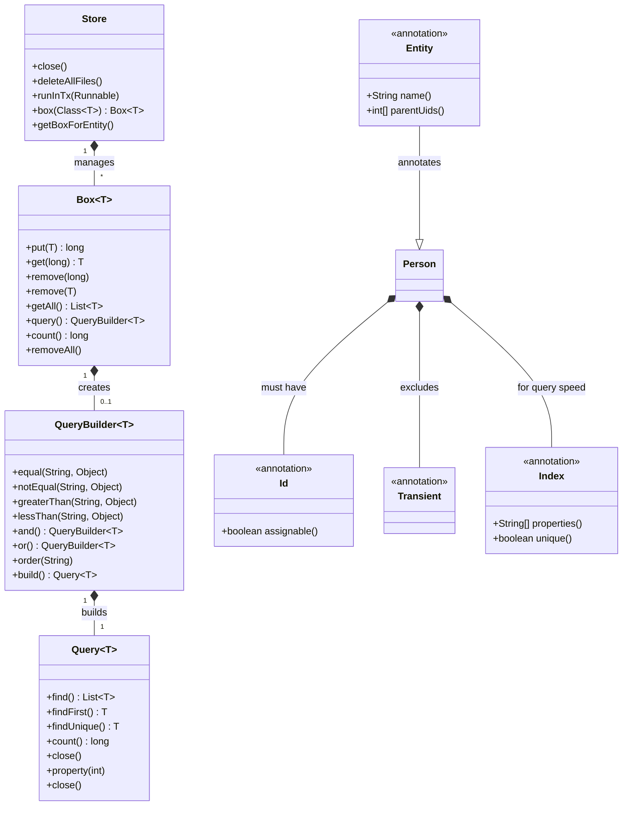
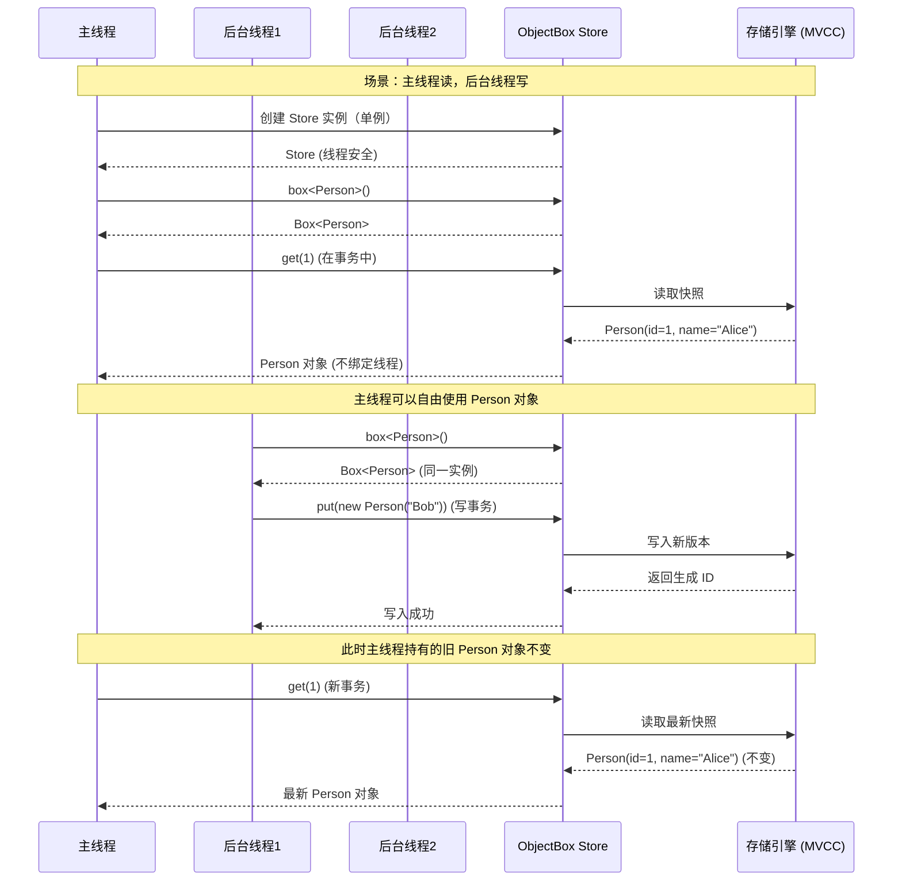
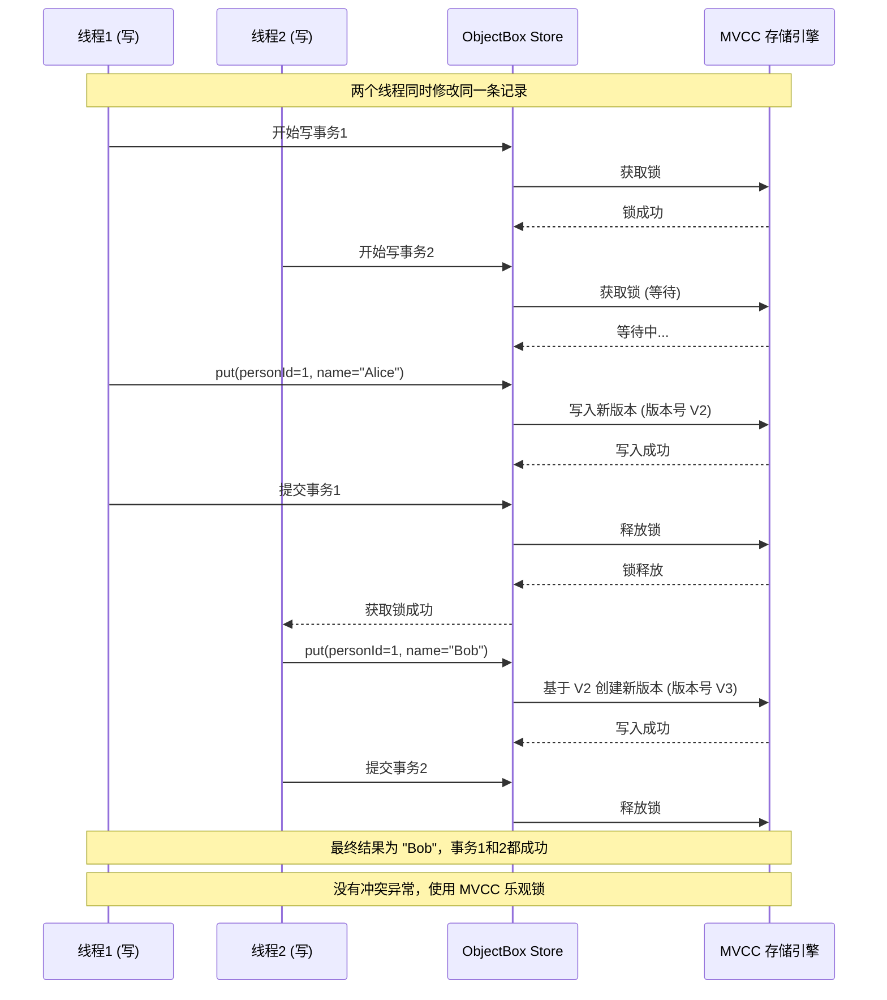
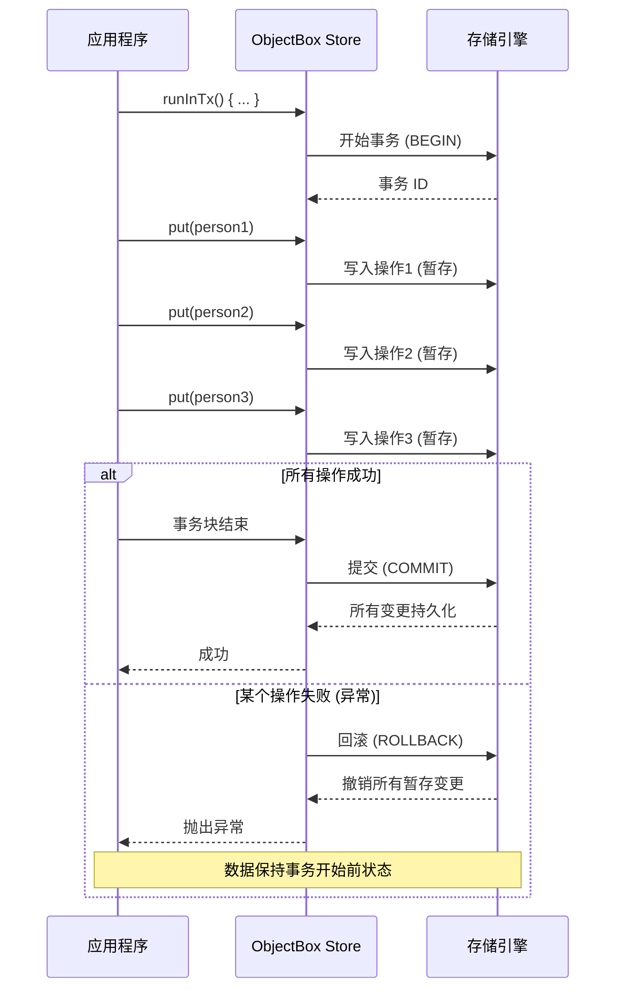

ObjectBox 是一个高性能的 NoSQL 嵌入式对象数据库，它与我们之前讨论的 Drift 在设计哲学上有根本不同——它不是 SQLite 的 ORM 封装，而是从头构建的纯对象存储引擎。

以下是对 ObjectBox 架构、原理、工作流程及常见问题的系统梳理。

---

### 🏗️ 架构设计与实现原理

ObjectBox 的核心设计目标是**极致性能**和**以对象为中心**的存储体验。

1.  **分层架构**：
    *   **语言层 (Language Layer)**：提供面向各语言的 API（Java, Kotlin, Swift, Dart, Go, C, Python 等）。开发者通过注解（如 `@Entity`, `@Id`）定义数据模型，ObjectBox 在编译时生成类型安全的持久化代码。
    *   **核心绑定层 (Core Binding)**：将语言层的 API 调用通过 Dart FFI、JNI 等方式，映射到高效的原生 C/C++ 核心库。
    *   **存储引擎层 (Storage Engine)**：这是 ObjectBox 性能的核心。它不是基于 SQLite，而是使用自己实现的存储引擎，直接在文件系统上管理数据。它使用二进制编码和类似 **B+ 树**的数据结构来组织数据，并实现了多版本并发控制 (MVCC) 和“写时复制”(Copy-on-Write) 机制。

2.  **多平台一致性**：ObjectBox 的核心是 C/C++ 编写的，这使得它能在 Android、iOS、Linux、Windows、macOS 甚至 IoT 设备上提供相同的性能和 API 体验，真正实现了“一次编写，到处运行”。

### 🎨 核心设计模式

*   **数据访问对象模式 (DAO) 的变体**：ObjectBox 使用 `Box` 对象作为特定类型实体的主要操作入口。一个 `Box<Person>` 就负责所有 `Person` 对象的增删改查，比传统 DAO 更加直接。
*   **代码生成模式 (Code Generation)**：这是保证类型安全的核心。你编写带 `@Entity` 的类，ObjectBox 在编译时生成 `Box` 实例、查询构建器等辅助代码，让数据库操作与普通对象操作无异。

---

### 🗺️ 类图关系（Mermaid）



---

### ⚙️ 工作流程

1.  **初始化**：构建唯一的 `Store` 实例（类似于 Drift 的数据库实例），它是整个数据库的门面，负责管理所有 `Box` 和数据库文件。
2.  **定义模型**：编写带有 `@Entity` 注解的普通类，并用 `@Id` 标记一个 `long` 类型字段作为主键。
3.  **获取 Box**：通过 `store.box<Person>()` 获取对应实体的操作对象 `Box<Person>`。
4.  **CRUD 操作**：
    *   **写入 (Put)**：`box.put(person)`。ObjectBox 会自动处理新对象的 ID 分配和已存在对象的更新，操作是 **ACID** 事务性的。
    *   **读取 (Get/Query)**：通过 `id` 直接获取 (`box.get(id)`) 是最快的方式。复杂查询则使用 `QueryBuilder` 构建，并可以利用 `@Index` 标记的属性来加速检索。
5.  **线程模型**：ObjectBox 的对象是普通对象（POJOs），你获取到的对象在内存中**不绑定到特定线程**，可以在线程间自由传递，这提供了极大的灵活性。

---

### ✅ 优缺点分析

**优点**：
*   **极致性能**：专为性能设计的存储引擎，在处理大量对象关系时通常比 SQLite ORM 更快，有“内存数据库级的速度”的评价。
*   **开发体验**：API 极为简洁直观，完全没有 SQL 字符串或 SQL 相关的样板代码，只需操作普通对象。
*   **跨平台**：完美的跨平台支持，让业务逻辑可以在不同设备间无缝复用。
*   **强大的同步能力**：官方提供了 **ObjectBox Sync** 服务，能方便地实现设备与云端的数据同步，这是它相比 Drift 的一个显著优势。

**缺点**：
*   **生态系统与调研成本**：相较于有二十年历史的 SQLite，ObjectBox 的生态系统相对年轻。遇到非常规或边缘问题时，可参考的第三方资料和 Stack Overflow 解决方案可能较少。
*   **复杂查询能力**：对于极其复杂的多表联查或数据分析场景，其灵活性和生态工具（如各种 SQL 分析工具）不如传统的 SQL 数据库。
*   **商业许可考量**：虽然核心数据库引擎是开源的（Apache 2.0），但其 **ObjectBox Sync** 等商业功能是需要付费或联系销售团队的。

---

### 🕳️ 常见“坑”与避坑指南

根据官方文档和社区反馈，以下是比较常见的陷阱：

| 坑点                             | 现象                                                                          | 避坑建议                                                                                                                                                                                                                            |
| :------------------------------- | :---------------------------------------------------------------------------- | :---------------------------------------------------------------------------------------------------------------------------------------------------------------------------------------------------------------------------------- |
| **数据模型变更未处理 UID**       | 运行时抛出 `DbSchemaException`，提示"incoming ID does not match existing UID" | ObjectBox 使用元数据文件 (`objectbox-models/default.json`) 管理模型版本。重命名属性或类时，**必须**在旧模型文件中找到对应的 UID 并在代码中通过 `@Uid(uid)` 注解指定，否则数据库会认为你删除了旧字段并创建了新字段，导致数据丢失。   |
| **数据库文件过大与空间回收陷阱** | 应用体积不断增大，即使删除了大量数据，数据库文件大小未减少                    | ObjectBox 依赖 MVCC 和“写时复制”。删除操作可能暂时**不会释放磁盘空间**，而是标记为空闲以供复用。这是为了性能考虑。若要真正压缩文件，需要`close()`数据库，然后用 `Store.deleteAllFiles()` 删除，再从备份恢复（非常规操作，需谨慎）。 |
| **主线程 IO 操作**               | 在主线程执行大量写入操作可能导致 UI 卡顿                                      | ObjectBox 的读取通常极快，对于单条或少量数据的读取可以视情况在主线程执行。但**所有写入操作 (`put`)** 和复杂查询**强烈建议**在后台线程执行，以避免阻塞 UI。                                                                          |
| **`armeabi` 架构支持缺失**       | 在老旧设备上运行崩溃，报错"Couldn't find libobjectbox.so"                     | ObjectBox 从 Android 5.0 (API 21) 开始支持，并且**不支持已过时的 `armeabi`** ABI。如果你的 Gradle 配置中使用了 `abiFilters "armeabi"`，需要将其移除或改为 `armeabi-v7a` 或 `arm64-v8a`。                                            |
| **APK 大小“不合理”地增大**       | 启用 `minSdkVersion 23` 后，APK 大小增加约 6.1MB                              | 这是 Android 插件的一项优化，它设置了 `extractNativeLibs="false"`，让 Google Play 能更好地压缩下载包，但会让原始 APK 变大。这是**预期行为**，实际用户下载大小会小很多（约0.6-2.3MB）。                                              |

非常抱歉，Mermaid 类图渲染出现错误！我会用更规范的语法重新绘制，并加入完整的线程访问说明、流程图和内存布局。

---

## 📐 修正后的类图（Mermaid）


---

## 🧵 线程访问模型

ObjectBox 的线程访问模型与大多数 ORM 框架有根本不同，这是它的核心设计特点：

### 核心原则

1. **线程无关 (Thread-Agnostic)**：ObjectBox 的对象是普通 POJO，获取到的对象**不绑定到创建它的线程**，可以在任意线程自由传递和使用。这与 Realm 的线程绑定模式形成鲜明对比。

2. **Store 是线程安全的**：一个 `Store` 实例可以被任意多线程并发访问，无需额外同步。

3. **Box 是轻量级引用**：通过 `store.box<T>()` 获取的 `Box` 实例是线程安全的，可以在多个线程共享同一个 `Box` 引用。

4. **事务边界决定线程行为**：每个数据库操作（`put`, `get`, `query`）都在自己独立的事务中执行。如果需要跨多个操作保持一致性，需显式使用 `store.runInTx()`。

### 读取操作（Query / Get）

- **原理**：读取操作在内部事务中执行，返回的对象是**从存储引擎快照中反序列化出来的全新实例**，不持有任何数据库连接或锁。
- **线程安全性**：完全线程安全。从线程 A 读取的对象，可以安全地传递给线程 B 使用。
- **性能**：读取极快，通常可以在主线程执行少量读取操作（但大量读取或复杂查询仍需后台线程）。

### 写入操作（Put / Remove）

- **原理**：每次写入操作（如 `box.put()`）都隐式地开启一个事务。对象被序列化后写入存储引擎，并自动更新索引。
- **线程安全性**：完全线程安全。多个线程可同时写入同一个 `Box`，ObjectBox 内部通过 MVCC 机制保证数据一致性。
- **性能**：写入操作会触发磁盘 I/O 和索引更新，**必须放在后台线程**执行，否则会阻塞 UI。

### 事务管理（Transaction）

- **显式事务**：使用 `store.runInTx(() -> { ... })` 将多个操作包裹在同一个事务中。
- **嵌套事务**：不支持嵌套。但可以通过方法组合实现逻辑上的嵌套。
- **隔离级别**：使用 **读已提交 (Read-Committed)** 级别 + MVCC。读取操作看到的是事务开始时的快照，写入操作在提交后才对其他事务可见。

---

## 📊 多线程访问流程图

### 场景 1：不同线程独立读写（最常见）



### 场景 2：并发写入冲突处理



### 场景 3：显式事务保证原子性



---

## 🧠 内存布局图

### 1. 存储引擎内部结构（文件系统视角）

```
┌──────────────────────────────────────────────────────────┐
│              数据库文件 (.mdb 或 .odb)                    │
├──────────────────────────────────────────────────────────┤
│  Header (256 bytes)                                     │
│  • Magic Number                                        │
│  • 文件格式版本                                         │
│  • 主元数据指针                                         │
│  • 校验和                                              │
├──────────────────────────────────────────────────────────┤
│                    元数据 (Metadata)                     │
│  • 模型模式 (Schema)                                    │
│  • 所有 Entity 定义和 UID                              │
│  • 属性名称 → ID 映射                                  │
│  • 索引定义                                            │
├──────────────────────────────────────────────────────────┤
│  Entity 1 数据区 (如 Person)                            │
│  ├─ 主键索引 (B+Tree)                                  │
│  │   └─ [1] → DataPtr, [2] → DataPtr, ...             │
│  ├─ 数据页 1 (Data Pages)                              │
│  │   └─ [Row1: id=1, name="Alice", age=25]            │
│  ├─ 数据页 2                                           │
│  │   └─ [Row2: id=2, name="Bob", age=30]              │
│  └─ 非主键索引 (如 name 索引)                          │
│      └─ "Alice" → [1], "Bob" → [2]                    │
├──────────────────────────────────────────────────────────┤
│  Entity 2 数据区 (如 Order)                            │
│  ├─ 主键索引 (B+Tree)                                  │
│  ├─ 数据页 1                                           │
│  └─ 非主键索引                                         │
├──────────────────────────────────────────────────────────┤
│  空闲页管理 (Free Space Manager)                        │
│  • 空闲块列表 (如 B+Tree)                              │
│  • 用于复用已删除记录的空间                              │
├──────────────────────────────────────────────────────────┤
│  Write-Ahead Log (WAL)                                 │
│  • 最近的变更记录                                       │
│  • 用于崩溃恢复和 MVCC                                 │
└──────────────────────────────────────────────────────────┘
```

### 2. 运行时内存结构（堆内存视角）

```
┌──────────────────────────────────────────────────────────────┐
│                      App 堆内存                              │
├──────────────────────────────────────────────────────────────┤
│  Store 对象 (全局单例)                                      │
│  ┌───────────────────────────────────────────────────────┐  │
│  │  // 内部 C++ 核心指针                                 │  │
│  │  - nativePtr: long (指向 Native 存储)                │  │
│  │  // 元数据缓存                                       │  │
│  │  - entityMetas: Map<Class, EntityMeta>               │  │
│  │  // Box 缓存 (按需创建)                              │  │
│  │  - boxCache: Map<Class, Box>                         │  │
│  └───────────────────────────────────────────────────────┘  │
│                                                              │
│  Box<Person> 对象 (线程共享)                                │
│  ┌───────────────────────────────────────────────────────┐  │
│  │  - storeRef: Store (弱引用)                          │  │
│  │  - entityMeta: EntityMeta (Person 的元数据)         │  │
│  │  // 没有任何连接或事务状态！                          │  │
│  └───────────────────────────────────────────────────────┘  │
│                                                              │
│  线程1 (主线程)                                              │
│  ┌───────────────────────────────────────────────────────┐  │
│  │  Person 对象 (从 Box.get(1) 获取)                     │  │
│  │  ┌────────────────────────────────────────────────┐   │  │
│  │  │  id: 1                                        │   │  │
│  │  │  name: "Alice" (String 对象)                  │   │  │
│  │  │  age: 25                                      │   │  │
│  │  │  // 不持有数据库引用！完全独立                   │   │  │
│  │  └────────────────────────────────────────────────┘   │  │
│  └───────────────────────────────────────────────────────┘  │
│                                                              │
│  线程2 (后台线程)                                            │
│  ┌───────────────────────────────────────────────────────┐  │
│  │  Person 对象 (从 Box.get(1) 获取)                     │  │
│  │  ┌────────────────────────────────────────────────┐   │  │
│  │  │  id: 1                                        │   │  │
│  │  │  name: "Alice" (不同的 String 实例)            │   │  │
│  │  │  age: 25                                      │   │  │
│  │  │  // 与线程1的 Person 完全独立！                 │   │  │
│  │  └────────────────────────────────────────────────┘   │  │
│  └───────────────────────────────────────────────────────┘  │
│                                                              │
│  查询缓存 (可选，默认关闭)                                   │
│  ┌───────────────────────────────────────────────────────┐  │
│  │  - queryCache: Map<QueryKey, List<T>>               │  │
│  │  // 需要显式启用，谨慎使用                            │  │
│  └───────────────────────────────────────────────────────┘  │
└──────────────────────────────────────────────────────────────┘
```

### 3. MVCC 多版本数据布局（写时复制）

```
时间线: 逐步更新 Person(id=1)

初始状态 (V1)                   写操作 V2                    写操作 V3
┌──────────────────┐          ┌──────────────────┐          ┌──────────────────┐
│ 数据页 1          │          │ 数据页 1          │          │ 数据页 1          │
│ ┌──────────────┐ │          │ ┌──────────────┐ │          │ ┌──────────────┐ │
│ │ Row1:        │ │          │ │ Row1:        │ │          │ │ Row1:        │ │
│ │ id=1         │ │          │ │ id=1         │ │          │ │ id=1         │ │
│ │ name="Alice" │ │          │ │ name="Alice" │ │          │ │ name="Alice" │ │
│ │ age=25       │ │          │ │ age=25       │ │          │ │ age=25       │ │
│ └──────────────┘ │          │ └──────────────┘ │          │ └──────────────┘ │
└──────────────────┘          └──────────────────┘          │ 数据页 2 (新)    │
                                                              │ ┌──────────────┐ │
                              新写入操作:                     │ │ Row1 副本:   │ │
                              put(Person(id=1,              │ │ id=1         │ │
                                name="Alice",               │ │ name="Alice" │ │
                                age=26))                    │ │ age=26       │ │
                                                              │ └──────────────┘ │
                                                              └──────────────────┘
                                                                                   
                              引用指针更新:                    引用指针更新:        
                              主键索引 → 数据页2             主键索引 → 数据页3
                              数据页1 变为旧版本 (V2)        数据页2 变为旧版本 (V3)

                              ⚠️ 注意: 数据页1 在没有任何线程
                              引用其快照后，最终会被回收
```

---

## 🔧 最佳实践建议

### 线程安全策略

```dart
// 1. 全局单例 Store
class Database {
  static final Database _instance = Database._internal();
  factory Database() => _instance;
  
  late final Store store;
  
  Database._internal() {
    store = Store(getObjectBoxModel());
  }
}

// 2. 读写分离 - 读取可在主线程
void readOnMainThread() {
  final box = Database().store.box<Person>();
  final person = box.get(1); // ✅ 安全，极快
  print(person.name);
}

// 3. 写入必须在后台线程
Future<void> writeOnBackground() async {
  await compute((_) {
    final box = Database().store.box<Person>();
    box.put(Person(name: "Bob", age: 30)); // ✅ 在后台线程执行
  }, null);
}

// 4. 批量写入使用事务
Future<void> batchWrite(List<Person> persons) async {
  await compute((list) {
    final store = Database().store;
    store.runInTx(() {
      final box = store.box<Person>();
      for (var p in list) {
        box.put(p);
      }
    });
  }, persons);
}
```

### 常见坑点总结

| 坑点                                 | 表现                                                                | 解决                                               |
| ------------------------------------ | ------------------------------------------------------------------- | -------------------------------------------------- |
| **线程传递对象的修改不会被自动保存** | 从线程 A 读取 Person 对象，在线程 B 修改其属性，未调用 `put()` 保存 | 修改后必须显式调用 `box.put()` 才会持久化          |
| **并发写入导致"丢失更新"**           | 两个线程同时修改同一对象的不同字段，后者覆盖前者                    | 使用 `store.runInTx()` + 读取最新版本再修改        |
| **主线程大量写入导致 ANR**           | UI 卡顿或出现 `Skipped frames`                                      | 所有 `put()` 操作放到后台线程                      |
| **长事务阻塞读取**                   | 一个写事务持锁时间过长，导致其他读取操作等待                        | 尽量保持事务简短，避免在事务中执行网络请求         |
| **数据库文件膨胀**                   | 删除大量数据后，文件大小未减少                                      | 这是预期行为，空间会被复用。如需压缩，需重建数据库 |

### 🗄️ 关于“文件碎片整理”

在ObjectBox里，你不需要像使用传统机械硬盘那样手动进行“磁盘碎片整理”。它的存储引擎通过一种更智能的方式处理空间复用问题，主要依赖两点：

*   **空间自动复用**：当你删除对象后，ObjectBox 默认**不会立即将磁盘空间归还给操作系统**。它会将这些空出来的空间标记为“可复用”。当你后续再写入新数据时，数据库会优先使用这些已标记的空闲空间，而不是直接去文件末尾申请新空间。这本身就是一种持续的、自动的碎片整理过程，极大地减少了文件体积的膨胀和碎片化。
*   **文件体积不会无限增长**：由于空间被高效地循环利用，ObjectBox 的文件大小通常会稳定在一个相对合理的水平，不会因为频繁的增删操作而无限制地增长。只有当数据量持续净增加时，文件体积才会随之增长。你可以在创建 `Store` 实例时通过 `maxDbSizeInKb` 选项设置数据库文件的最大体积（默认上限为 1 GB），以防极端情况下的空间失控。

### 🔄 多线程读写与“数据不及时”问题

你提到的“数据不及时更新”是多线程数据库的经典问题，它的根源通常在于：**线程A开启了一个长事务，而线程B在事务提交前读取数据，看到的是旧版本**。

ObjectBox 通过 **MVCC（多版本并发控制）** 机制来处理这个问题。

#### 工作原理：读写互不阻塞

*   **同时读取**：多个读事务可以同时进行，互不干扰，速度极快。
*   **读写并发**：当一个写事务正在进行时，读事务**不会被阻塞**。相反，它会立即读取在写事务开始前已经提交的、最晚的那个一致性数据快照（旧版本）。这就是你“看到旧数据”的根本原因。
*   **同时写入**：写事务是严格**串行化**的。无论多少线程同时调用 `put` 或 `runInTx`，ObjectBox 内部都会像一个“锁”一样，让它们一个接一个地排队执行，从而确保数据最终的一致性。

#### 如何避免“数据不及时”？

关键在于“用对事务”：

1.  **使用显式事务保证原子性**：如果你需要确保一组操作的数据一致性，必须使用 `store.runInTx { ... }` 或 `runInReadTx { ... }` 将操作包裹起来。这样，所有操作要么全部成功，要么全部失败，不会出现“半完成”的状态。

2.  **核心原则：让写事务“短小精悍”**：这是提升性能和处理时效性的黄金法则。
    *   **避免耗时操作**：不要在写事务内部进行网络请求、复杂计算或文件IO等耗时操作。这些操作应该在进入事务**之前**完成，只把纯粹的数据库 `put` 或 `remove` 操作留在事务里。
    *   **原因**：因为写事务是串行的，一个长事务会阻塞后面所有等待的写操作，导致整体响应变慢，并放大“数据看起来没更新”的窗口期。

3.  **逻辑上的“最新数据”如何处理**：如果业务逻辑要求必须读取“刚写入”的数据，最可靠的方式是确保读取操作与写入操作在**同一个事务**中。或者，你可以设计一种“乐观锁”机制，比如在对象中增加一个版本号字段，在读取后更新前检查版本号是否被更改过。

### 💎 总结

*   **文件碎片**：无需手动整理，ObjectBox 会自动复用删除数据留下的空间，实现自我管理。
*   **多线程数据一致性**：关键在于理解并善用 **MVCC** 机制。短事务是王道。将耗时操作移出写事务，既能保证数据的最终一致性，也能大幅提高应用的并发响应能力。

如果你在使用过程中遇到了因读取旧版本数据而导致的业务逻辑错误，可以具体描述一下场景，我再帮你分析如何调整事务边界来解决。