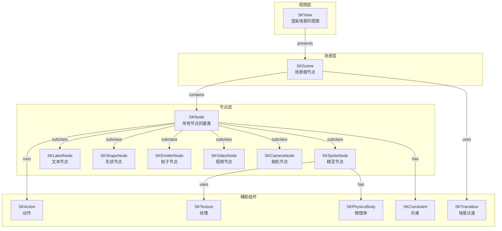
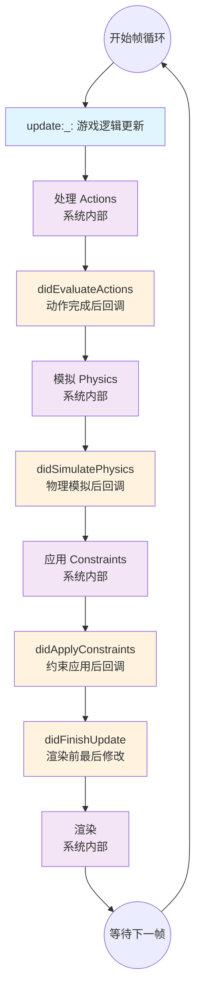
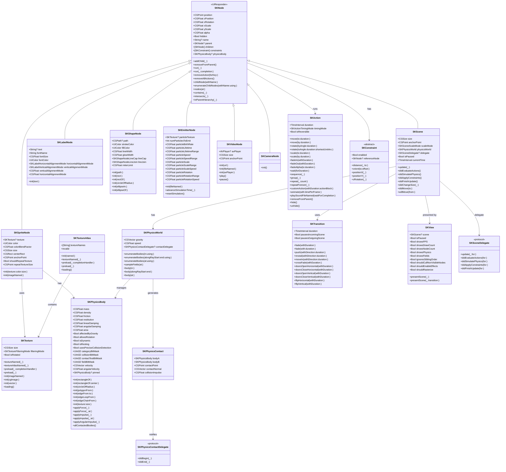

# SpriteKit 全面解析：从入门到精通的 2D 游戏开发框架

## 一、简介

### 1.1 什么是 SpriteKit

SpriteKit 是苹果公司在 iOS 7 和 macOS 10.9（Mavericks）中首次正式推出的 2D 游戏开发框架。它是一个通用框架，用于在二维坐标系中绘制形状、粒子、文本、图像和视频。SpriteKit 利用 Metal（原 OpenGL ES）实现高性能渲染，同时提供简单的编程接口，使创建游戏和其他图形密集型应用程序变得容易。

SpriteKit 并非简单的绘图库，而是一个功能完备、模块化清晰、面向对象的游戏引擎。其核心目标是让开发者无需依赖第三方引擎即可快速构建具备专业级视觉表现与物理交互能力的原生 Apple 平台应用。

### 1.2 核心特性

- **高性能渲染**：基于 Metal（原 OpenGL ES）实现每秒 60 帧甚至 120 帧的稳定动画输出
- **节点层级体系**：基于树形结构的节点组织方式
- **声明式动画系统**：通过 SKAction 实现链式组合动画
- **内置物理引擎**：完整的 2D 物理模拟（重力、碰撞、关节等），使用国际单位制（米-千克-秒系统）
- **纹理图集优化**：自动打包纹理，减少 GPU 绘制调用
- **跨平台支持**：iOS、macOS、tvOS、watchOS 全平台覆盖

### 1.3 平台支持

SpriteKit 支持以下平台：
- iOS 8.0+
- iPadOS 8.0+
- macOS 10.10+
- tvOS 9.0+
- visionOS 1.0+
- watchOS 1.0+

## 二、应用场景

### 2.1 游戏开发

- **平台游戏**：如超级玛丽类型的横版过关游戏
- **休闲游戏**：三消、跑酷、益智类游戏
- **动作游戏**：射击、格斗等需要实时反馈的游戏
- **策略游戏**：塔防、战棋类游戏

### 2.2 非游戏应用

- **交互式 UI**：复杂的交互动画和过渡效果
- **教育应用**：儿童绘画、数学教学等互动内容
- **数据可视化**：动态图表和信息展示
- **AR 应用**：通过 ARSKView 在增强现实中引入 2D 内容

## 三、架构设计与架构图

### 3.1 整体架构层次

SpriteKit 的架构可以分为四个层次：

```
┌─────────────────────────────────────────────────────────┐
│                   应用层 (Application)                   │
│              SKView / SKScene / SKNode                  │
├─────────────────────────────────────────────────────────┤
│                   动画系统 (Animation)                   │
│          SKAction / SKKeyframeSequence                  │
├─────────────────────────────────────────────────────────┤
│                   物理引擎 (Physics)                     │
│     SKPhysicsWorld / SKPhysicsBody / SKPhysicsJoint     │
├─────────────────────────────────────────────────────────┤
│                   渲染引擎 (Rendering)                   │
│           Metal / OpenGL ES 渲染管线                    │
└─────────────────────────────────────────────────────────┘
```

### 3.2 核心组件

**SKView**：渲染 SpriteKit 场景的视图子类。当场景被视图呈现时，它会在运行模拟（动画内容）和渲染内容之间交替进行。

**SKScene**：组织所有活动 SpriteKit 内容的对象。场景是节点树的根节点，承载所有可视与逻辑元素。

**SKNode**：所有可视对象的基类。支持层级化父子关系、坐标变换及事件响应。

**SKSpriteNode**：最常用的节点类型，支持纹理加载、纹理图集自动打包与混合模式设置。

### 3.3 架构图（Mermaid）



## 四、实现原理——SpriteKit 帧循环（核心）

### 4.1 帧循环概述

当场景通过 `SKView.presentScene(_:)` 被呈现时，SpriteKit 会在每一帧调用开发者实现的帧循环函数。如果开发者没有实现任何帧循环函数，SpriteKit 只会在场景内容发生变化时才进行渲染，从而提高能效。

SpriteKit 使用传统的渲染循环，在每一帧被渲染之前帧的内容就已经处理好了。开发者确定帧的内容以及这些内容如何变化。场景和动作处理只在场景被呈现时运行。

### 4.2 完整的九步帧循环管线

SpriteKit 每一帧按以下顺序执行九个步骤：

### 7.2 帧循环详细流程图



### 4.3 第一步：`update(_:)` —— 游戏逻辑的总入口

这是每一帧中**第一个**被调用的方法，也是开发者最主要的“战场”。

**它做了什么？**：以当前模拟经过的时间为参数调用。这是实现游戏内模拟的主要位置，包括输入处理、人工智能、游戏脚本和其他类似的游戏逻辑。开发者通常使用此方法对节点进行更改或对节点运行动作。

**关键设计考量**：它被设计在管线的最开始，是因为**需要在这一刻，基于上一帧的最终状态，去决定“这一帧要发生什么”**。所有由开发者控制的、非自动的逻辑变化，都应该从这里发起。

### 4.4 第二步：处理 Actions —— 自动动画的执行者

这是一个**系统内部**处理的步骤，开发者没有直接的“进入”回调。

**它做了什么？**：场景处理节点树中所有节点上的动作。它查找任何正在运行的动作并将这些更改应用到树中。由于自定义动作的存在，开发者也可以通过动作机制调用自己的代码。

**关键限制**：开发者**无法直接控制**多个动作在同一帧内的处理顺序，也不能让场景跳过某些节点上的动作，除非从这些节点移除动作或从树中移除节点。

### 4.5 第三步：`didEvaluateActions()` —— 动作后的“修正”时刻

在所有 `SKAction` 处理完毕之后，系统会立即调用这个回调方法。

**它做了什么？**：在场景中节点评估完所有动作之后、物理模拟开始之前被调用。

**关键限制**：在此方法中应用的任何**额外动作**都不会被评估，直到**下一帧**。

**典型用途**：
1. **修正动作结果**：如果一个动作导致节点移动到了非法区域，可以在这里将它拉回来
2. **获取纯动作状态**：知道在这一帧纯粹由动作驱动的最终状态是什么

### 4.6 第四步：模拟 Physics —— 物理世界的运算核心

这是另一个**系统内部**处理的核心步骤。

**它做了什么？**：场景对树中具有物理体的节点进行物理模拟。这些计算包括重力、摩擦力和与其他物体的碰撞。物理模拟的最终结果是树中节点的位置和旋转可能被物理模拟调整。当物理体相互接触时，游戏还可以接收回调。

**物理体类型**：SpriteKit 支持两种物理体——基于体积的物理体（volume-based bodies）和基于边缘的物理体（edge-based bodies）。

### 4.7 第五步：`didSimulatePhysics()` —— 物理后的“收割”时刻

在所有物理模拟完成之后，系统会立即调用这个回调方法。

**它做了什么？**：在所有物理体为本帧模拟完成后被调用。

**关键限制**：在此方法中应用的任何**额外动作**都不会被评估，直到**下一帧**。对物理体的任何更改也不会被模拟，直到**下一帧**。

**典型用途**：
1. **更新相机**：最常用的是让 `SKCameraNode` 跟随玩家，此时玩家的位置已是物理计算后的最新值
2. **执行基于物理状态的逻辑**：检测物体是否掉到了“坑里”等

**⚠️ 警告**：虽然可以在此时修改节点属性，但**强烈不建议**在此处修改物理体的属性（如速度、位置），因为这可能会与物理引擎的结算结果冲突，导致画面抖动或逻辑错误。

### 4.8 第六步：应用 Constraints —— 自动约束的施加者

这是一个**系统内部**处理的步骤。

**它做了什么？**：场景应用与节点关联的任何约束。`SKConstraint` 对象描述了节点位置或方向上的数学约束。例如，可以应用一个约束确保一个节点始终指向另一个节点，无论它如何移动。

**设计哲学**：在动作和物理这两大“动因”之后应用约束，是为了**确保无论前面发生了什么，最终的画面状态都符合设定的规则**。

**典型约束**：
- `SKConstraint.distance(_:to:)`：让一个节点始终与另一个节点保持固定距离
- `SKConstraint.orient(to:offset:)`：让一个节点始终指向另一个节点

### 4.9 第七步：`didApplyConstraints()` —— 约束后的确认时刻

在所有约束应用完成之后，系统会调用这个回调方法。

**它做了什么？**：在所有约束应用完成后被调用。默认情况下，此方法什么也不做。

**典型用途**：验证约束是否按预期工作，或基于约束后的状态执行极轻量级的逻辑。通常情况下，此回调使用频率较低。

### 4.10 第八步：`didFinishUpdate()` —— 渲染前的最后“把关人”

在所有更新逻辑（动作、物理、约束）都完成之后、渲染开始**之前**，系统会调用这个方法。

**它做了什么？**：在所有处理动画所需的步骤完成后被调用。

**关键限制**：这是开发者**在当前帧修改场景状态的最后一次机会**。在此之后：
- 任何额外动作都不会被评估，直到**下一帧**
- 对物理体的任何更改都不会被模拟，直到**下一帧**
- 对约束的任何更改都不会被应用，直到**下一帧**
- **不会对场景应用进一步的更新逻辑**
- 在此对节点设置的任何值都将在本帧渲染时使用

**典型用途**：设置一些与逻辑无关、只与视觉表现相关的属性（如装饰粒子的透明度），确保它们以正确的状态被渲染。

**⚠️ 重要警告**：在此之后，对节点所做的任何修改（包括运行新的 Action、修改物理体、修改约束）都**不会被评估或模拟**，直到**下一帧**才会生效。

### 4.11 第九步：渲染 —— GPU 的绘制时刻

这是由 `SKView` 在后台自动执行的**系统内部**步骤。

**它做了什么？**：`SKView` 收集场景中所有节点的最终状态，将它们编码成 GPU 可以理解的绘制指令，并提交给图形处理器进行绘制。

**设计哲学**：将“逻辑更新”和“图形渲染”明确分开，是现代游戏引擎的标准设计模式。它确保了逻辑的稳定性，并让 GPU 可以高效地、批量地处理绘制工作。

### 4.12 帧循环设计总结

整个 SpriteKit 帧循环的设计，遵循了清晰的**“管道化”与“分阶段”**哲学：

1. **确定性顺序**：`逻辑更新（开发者）` → `动作` → `物理` → `约束` → `渲染`
2. **关注点分离**：将“游戏规则”（`update:`）、“自动动画”（`Actions`）、“真实世界模拟”（`Physics`）和“规则强制”（`Constraints`）放在不同阶段
3. **提供“钩子”（Hooks）**：在每个关键的系统处理步骤之后提供回调方法

## 五、全景类图（Mermaid）

以下是 SpriteKit 核心类的完整 Mermaid 类图：



## 六、设计模式

SpriteKit 框架中运用了多种经典设计模式：

### 6.1 组合模式（Composite Pattern）

节点树结构是组合模式的典型应用。SKNode 作为组件接口，既可以作为叶子节点（如 SKSpriteNode），也可以作为容器节点（包含子节点）。SKScene 是根节点，所有其他节点都添加到此根节点下。

### 6.2 模板方法模式（Template Method Pattern）

SKScene 的渲染循环定义了算法的骨架（update → actions → physics → constraints → render），而将具体步骤的实现延迟到子类。

### 6.3 命令模式（Command Pattern）

SKAction 是命令模式的实现。每个动作对象封装了一个操作（移动、旋转、缩放等），可以存储、传递和执行。动作可以组合成序列或组。

### 6.4 策略模式（Strategy Pattern）

物理引擎中的 SKPhysicsBody 允许开发者选择不同的碰撞形状（矩形、圆形、多边形）和物理属性。

### 6.5 观察者模式（Observer Pattern）

SKPhysicsContactDelegate 允许对象观察物理碰撞事件。当物理体发生接触时，代理方法被调用。

### 6.6 委托模式（Delegate Pattern）

SKSceneDelegate 是委托模式的典型应用。通过实现 SKSceneDelegate 协议，任何类都可以参与 SpriteKit 渲染循环回调。如果委托实现了某个特定方法，该方法将被调用而不是场景对象上的相应方法。使用场景委托可以在多个场景之间共享应用逻辑。

### 6.7 工厂模式（Factory Pattern）

SKTextureAtlas 和 SKTexture 提供了创建纹理对象的工厂方法。

## 七、工作流程

### 7.1 典型开发工作流程

```
1. 项目创建与配置 → 2. 场景设计 → 3. 节点与内容管理 → 
4. 动画与行为 → 5. 物理模拟 → 6. 交互与事件 → 
7. 场景切换 → 8. 性能优化与测试
```

## 八、详细实现代码解释

### 8.1 基础场景设置

```swift
import SpriteKit

class GameScene: SKScene {
    
    override func didMove(to view: SKView) {
        // 设置场景背景色
        self.backgroundColor = .black
        
        // 创建并添加精灵节点
        let sprite = SKSpriteNode(imageNamed: "spaceship")
        sprite.position = CGPoint(x: size.width / 2, y: size.height / 2)
        sprite.setScale(0.5)
        self.addChild(sprite)
        
        // 创建并添加文本标签
        let label = SKLabelNode(text: "Hello SpriteKit!")
        label.fontSize = 30
        label.fontColor = .white
        label.position = CGPoint(x: size.width / 2, y: size.height - 100)
        self.addChild(label)
    }
}
```

### 8.2 使用 SKAction 实现动画

```swift
// 创建移动动作
let moveAction = SKAction.move(to: CGPoint(x: 300, y: 300), duration: 1.0)

// 创建旋转动作
let rotateAction = SKAction.rotate(byAngle: .pi * 2, duration: 2.0)

// 创建缩放动作
let scaleAction = SKAction.scale(to: 2.0, duration: 1.0)

// 组合动作：同时执行
let groupAction = SKAction.group([rotateAction, scaleAction])

// 序列动作
let sequenceAction = SKAction.sequence([moveAction, groupAction])

// 永久重复
let repeatAction = SKAction.repeatForever(sequenceAction)

sprite.run(repeatAction)
```

### 8.3 物理引擎配置

```swift
// 创建物理体
let physicsBody = SKPhysicsBody(rectangleOf: CGSize(width: 50, height: 50))
physicsBody.mass = 1.0
physicsBody.friction = 0.2
physicsBody.restitution = 0.8
physicsBody.linearDamping = 0.1
physicsBody.angularDamping = 0.1
physicsBody.affectedByGravity = true
physicsBody.allowsRotation = true

// 碰撞掩码配置
physicsBody.categoryBitMask = 0x1 << 0      // 第0位：玩家
physicsBody.collisionBitMask = 0x1 << 1     // 第1位：与障碍物碰撞
physicsBody.contactTestBitMask = 0x1 << 2   // 第2位：检测与收集物的接触

sprite.physicsBody = physicsBody

// 设置场景物理世界
self.physicsWorld.gravity = CGVector(dx: 0, dy: -9.8)
self.physicsWorld.speed = 1.0
```

### 8.4 碰撞检测代理

```swift
class GameScene: SKScene, SKPhysicsContactDelegate {
    
    override func didMove(to view: SKView) {
        self.physicsWorld.contactDelegate = self
    }
    
    func didBegin(_ contact: SKPhysicsContact) {
        let bodyA = contact.bodyA
        let bodyB = contact.bodyB
        
        if bodyA.categoryBitMask == 0x1 << 0 && bodyB.categoryBitMask == 0x1 << 2 {
            bodyB.node?.removeFromParent()
        }
    }
    
    func didEnd(_ contact: SKPhysicsContact) {
        // 接触结束处理
    }
}
```

### 8.5 完整帧循环实现

```swift
class GameScene: SKScene {
    
    // 每帧开始时调用 - 游戏逻辑的主入口
    override func update(_ currentTime: TimeInterval) {
        // 处理玩家输入、AI、游戏脚本等
        // 这是修改节点或运行动作的主要位置
    }
    
    // 所有动作处理完成后调用
    override func didEvaluateActions() {
        // 检查或修正由 SKAction 带来的变化
        // 在此方法中应用的任何额外动作都不会被评估直到下一帧
    }
    
    // 所有物理模拟完成后调用
    override func didSimulatePhysics() {
        // 更新相机位置、处理基于物理状态的逻辑
        // 对物理体的任何更改不会在本帧被模拟
    }
    
    // 所有约束应用完成后调用
    override func didApplyConstraints() {
        // 验证约束是否按预期工作
        // 默认情况下此方法什么也不做
    }
    
    // 渲染前最后修改机会
    override func didFinishUpdate() {
        // 设置只与视觉表现相关的属性
        // 在此之后对节点做的任何修改都不会被评估直到下一帧
    }
}
```

### 8.6 使用 SKSceneDelegate 替代子类化

```swift
class GameDelegate: NSObject, SKSceneDelegate {
    
    func update(_ currentTime: TimeInterval, for scene: SKScene) {
        // 游戏逻辑更新
    }
    
    func didEvaluateActions(for scene: SKScene) {
        // 动作完成后处理
    }
    
    func didSimulatePhysics(for scene: SKScene) {
        // 物理模拟后处理
    }
    
    func didApplyConstraints(for scene: SKScene) {
        // 约束应用后处理
    }
    
    func didFinishUpdate(for scene: SKScene) {
        // 渲染前最后处理
    }
}

// 在场景中设置委托
let scene = SKScene(size: CGSize(width: 1024, height: 768))
scene.delegate = GameDelegate()
```

## 九、关键数据参数汇总表格

### 9.1 SKNode 核心属性

| 属性          | 类型           | 说明                        | 默认值 |
| ------------- | -------------- | --------------------------- | ------ |
| `position`    | CGPoint        | 节点在父节点坐标系中的位置  | (0, 0) |
| `zPosition`   | CGFloat        | 节点的 Z 轴高度（绘制顺序） | 0      |
| `zRotation`   | CGFloat        | 绕 Z 轴的欧拉旋转（弧度）   | 0      |
| `xScale`      | CGFloat        | X 轴缩放比例                | 1.0    |
| `yScale`      | CGFloat        | Y 轴缩放比例                | 1.0    |
| `alpha`       | CGFloat        | 透明度（0.0 ~ 1.0）         | 1.0    |
| `hidden`      | Bool           | 是否隐藏                    | false  |
| `name`        | String?        | 节点名称标识                | nil    |
| `constraints` | [SKConstraint] | 节点约束数组                | []     |
| `physicsBody` | SKPhysicsBody? | 节点的物理体                | nil    |

### 9.2 SKPhysicsBody 物理属性

| 属性                            | 类型    | 说明                   | 默认值             |
| ------------------------------- | ------- | ---------------------- | ------------------ |
| `mass`                          | CGFloat | 质量（千克）           | 基于密度和体积计算 |
| `density`                       | CGFloat | 密度                   | 1.0                |
| `friction`                      | CGFloat | 摩擦力（0.0 ~ 1.0）    | 0.2                |
| `restitution`                   | CGFloat | 弹性系数（0.0 ~ 1.0）  | 0.2                |
| `linearDamping`                 | CGFloat | 线性阻尼               | 0.1                |
| `angularDamping`                | CGFloat | 角向阻尼               | 0.1                |
| `affectedByGravity`             | Bool    | 是否受重力影响         | true               |
| `allowsRotation`                | Bool    | 是否允许旋转           | true               |
| `isDynamic`                     | Bool    | 是否动态（受物理影响） | true               |
| `usesPreciseCollisionDetection` | Bool    | 是否使用精确碰撞检测   | false              |
| `categoryBitMask`               | UInt32  | 类别掩码               | 0xFFFFFFFF         |
| `collisionBitMask`              | UInt32  | 碰撞掩码               | 0xFFFFFFFF         |
| `contactTestBitMask`            | UInt32  | 接触检测掩码           | 0x00000000         |
| `fieldBitMask`                  | UInt32  | 场掩码                 | 0xFFFFFFFF         |

### 9.3 SKPhysicsWorld 物理世界属性

| 属性      | 类型     | 说明         | 默认值    |
| --------- | -------- | ------------ | --------- |
| `gravity` | CGVector | 重力向量     | (0, -9.8) |
| `speed`   | CGFloat  | 物理模拟速度 | 1.0       |

### 9.4 SKAction 常用动作

| 动作方法                                    | 参数                   | 说明             |
| ------------------------------------------- | ---------------------- | ---------------- |
| `move(to:duration:)`                        | 目标位置、持续时间     | 移动到指定位置   |
| `move(by:duration:)`                        | X偏移、Y偏移、持续时间 | 相对移动         |
| `rotate(byAngle:duration:)`                 | 角度、持续时间         | 旋转             |
| `rotate(toAngle:duration:shortestUnitArc:)` | 目标角度、持续时间     | 旋转到指定角度   |
| `scale(to:duration:)`                       | 缩放比例、持续时间     | 缩放到指定比例   |
| `scale(by:duration:)`                       | 缩放倍数、持续时间     | 相对缩放         |
| `fadeIn(withDuration:)`                     | 持续时间               | 淡入             |
| `fadeOut(withDuration:)`                    | 持续时间               | 淡出             |
| `fadeAlpha(to:duration:)`                   | 目标透明度、持续时间   | 渐变到指定透明度 |
| `wait(forDuration:)`                        | 等待时间               | 等待             |
| `sequence(_:)`                              | 动作数组               | 顺序执行         |
| `group(_:)`                                 | 动作数组               | 并行执行         |
| `repeat(_:count:)`                          | 动作、重复次数         | 重复执行         |
| `repeatForever(_:)`                         | 动作                   | 永久重复         |
| `customAction(withDuration:actionBlock:)`   | 持续时间、闭包         | 自定义动作       |

### 9.5 帧循环回调方法汇总

| 方法                     | 调用时机                | 关键限制               |
| ------------------------ | ----------------------- | ---------------------- |
| `update(_:)`             | 每帧开始，第一个被调用  | 游戏逻辑主入口         |
| 处理 Actions（系统）     | update 之后             | 无法控制处理顺序       |
| `didEvaluateActions()`   | 所有动作处理后          | 额外动作下一帧才评估   |
| 模拟 Physics（系统）     | didEvaluateActions 之后 | 物理体位置和旋转被调整 |
| `didSimulatePhysics()`   | 物理模拟后              | 物理体更改下一帧才模拟 |
| 应用 Constraints（系统） | didSimulatePhysics 之后 | 约束建立节点间关系     |
| `didApplyConstraints()`  | 约束应用后              | 默认什么也不做         |
| `didFinishUpdate()`      | 渲染前最后机会          | 任何修改下一帧才生效   |
| 渲染（系统）             | didFinishUpdate 之后    | GPU 绘制               |

## 十、常见问题与解决方案

### 10.1 节点未显示

**问题**：添加了节点但屏幕上没有显示。

**解决方案**：
- 确认节点已被正确添加到场景：`self.addChild(node)`
- 检查节点的 `position` 是否在屏幕范围内
- 检查节点的 `alpha` 是否大于 0
- 检查节点的 `hidden` 属性是否为 false

### 10.2 物理碰撞不触发

**问题**：物理体碰撞了但没有触发 `didBegin(_:)` 方法。

**解决方案**：
- 确认已设置 `physicsWorld.contactDelegate = self`
- 确认已实现 `SKPhysicsContactDelegate` 协议
- 检查 `contactTestBitMask` 是否正确设置
- 确认物理体的 `categoryBitMask` 和 `contactTestBitMask` 匹配

### 10.3 性能问题

**问题**：游戏运行卡顿，帧率下降。

**解决方案**：
- 减少场景中的节点数量
- 使用纹理图集减少绘制调用
- 启用 `SKView.shouldCullNonVisibleNodes = true` 剪裁离屏节点
- 避免在 `update(_:)` 中枚举所有节点
- 使用 `SKTexture.preload(_:completionHandler:)` 预加载纹理

### 10.4 场景间数据传递

**问题**：场景切换时无法传递数据。

**解决方案**：
- SpriteKit 没有内置的场景间数据传递机制
- 在创建新场景时通过自定义初始化方法传递数据
- 使用单例或全局状态管理
- 使用 `SKSceneDelegate` 在多个场景间共享逻辑

### 10.5 帧循环中修改不生效

**问题**：在 `didFinishUpdate()` 中修改节点属性后没有立即生效。

**解决方案**：
- `didFinishUpdate()` 是渲染前最后修改机会
- 在此之后对节点做的任何修改（运行 Action、修改物理体、修改约束）都**不会被评估或模拟**，直到**下一帧**
- 需要将逻辑性修改放在 `update(_:)` 或更早的回调中

## 十一、最佳实践

### 11.1 帧循环最佳实践

1. **`update(_:)`**：放置所有游戏逻辑（输入处理、AI、脚本）
2. **`didEvaluateActions()`**：修正动作结果或获取纯动作状态
3. **`didSimulatePhysics()`**：更新相机位置、处理基于物理状态的逻辑
4. **`didApplyConstraints()`**：验证约束结果（使用频率较低）
5. **`didFinishUpdate()`**：仅设置视觉属性，不放置逻辑性修改

### 11.2 性能优化

1. **纹理图集优先**：使用纹理图集打包游戏图片
2. **控制节点数量**：尽量减少场景中的节点总数
3. **启用离屏剪裁**：`SKView.shouldCullNonVisibleNodes = true`
4. **启用忽略兄弟顺序**：`SKView.ignoresSiblingOrder = true`
5. **预加载纹理**：在场景加载时预加载所有纹理
6. **避免在 update 中枚举所有节点**

### 11.3 使用委托模式

- 使用 `SKSceneDelegate` 可以在不子类化 SKScene 的情况下参与渲染循环
- 如果委托实现了某个方法，该方法将被调用而不是场景对象上的对应方法
- 使用场景委托可以在多个场景之间共享应用逻辑

## 十二、参考资源

### 12.1 官方文档

- [Responding to Frame-Cycle Events | Apple Developer Documentation](https://developer.apple.com/documentation/spritekit/responding-to-frame-cycle-events)
- [SKScene | Apple Developer Documentation](https://developer.apple.com/documentation/spritekit/skscene)
- [SKSceneDelegate | Apple Developer Documentation](https://developer.apple.com/documentation/spritekit/skscenedelegate)
- [SKPhysicsBody | Apple Developer Documentation](https://developer.apple.com/documentation/spritekit/skphysicsbody)
- [About Collisions and Contacts | Apple Developer Documentation](https://developer.apple.com/documentation/spritekit/about-collisions-and-contacts)
- [Maximizing Node Drawing Performance | Apple Developer Documentation](https://developer.apple.com/documentation/spritekit/maximizing-node-drawing-performance)
- [Maximizing Texture Performance | Apple Developer Documentation](https://developer.apple.com/documentation/spritekit/maximizing-texture-performance)
- [About Texture Atlases | Apple Developer Documentation](https://developer.apple.com/documentation/spritekit/about-texture-atlases)
- [SKConstraint | Apple Developer Documentation](https://developer.apple.com/documentation/spritekit/skconstraint)

### 12.2 WWDC 相关

- What's New in SpriteKit - WWDC Notes
- WWDC 示例代码包含 SpriteKit 相关示例

### 12.3 知名开源项目

- **AnalogJoystick**：可自定义的 SpriteKit 模拟摇杆控件
- **SKTiled**：用于在 SpriteKit 中使用 Tiled 地图内容的框架
- **SpriteKit-Chinese-Documentation**：SpriteKit 中文文档
