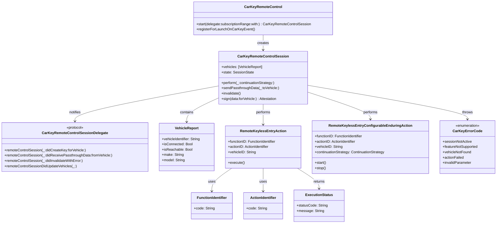

# CarKey 数字车钥匙技术详解

## 一、简介

CarKey 是苹果公司推出的数字车钥匙框架，于 iOS 14 中首次发布。它允许用户将汽车钥匙以数字形式存储在 iPhone 或 Apple Watch 的 Wallet 应用中，通过 NFC、蓝牙低功耗（BLE）和超宽带（UWB）等技术实现车辆的解锁、锁定和启动。

**核心特点**：
- **安全存储**：钥匙安全地存储在设备的 Secure Element（安全元件）中
- **离线可用**：所有信息交换可完全离线工作，无需网络连接
- **远程管理**：支持通过 iCloud 删除钥匙、远程撤销共享钥匙
- **钥匙共享**：可通过 iMessage 与家人朋友分享钥匙，支持设置不同访问级别
- **电量耗尽支持**：即使手机电量低，NFC 仍可正常工作

CarKey 遵循 CCC（Car Connectivity Consortium）数字钥匙标准，目前主要基于 CCC R2（NFC）和 CCC R3（NFC/BLE/UWB）规范。


## 二、架构图

```
┌─────────────────────────────────────────────────────────────────────────────┐
│                         CarKey 数字钥匙系统架构                             │
├─────────────────────────────────────────────────────────────────────────────┤
│                                                                             │
│  ┌─────────────────────┐          ┌─────────────────────────────────────┐  │
│  │    车主设备端        │          │           车辆端                    │  │
│  │  ┌───────────────┐  │          │  ┌─────────────────────────────┐  │  │
│  │  │  Wallet App   │  │          │  │      车端数字钥匙模块         │  │  │
│  │  │  (CarKey 凭证) │  │          │  │  ┌─────────┐ ┌──────────┐ │  │  │
│  │  └───────┬───────┘  │          │  │  │SE安全芯片│ │  NFC天线 │ │  │  │
│  │  ┌───────┴───────┐  │          │  │  └─────────┘ └──────────┘ │  │  │
│  │  │   Secure       │  │          │  │  ┌─────────┐ ┌──────────┐ │  │  │
│  │  │   Element (SE) │  │          │  │  │BLE模块  │ │UWB模块   │ │  │  │
│  │  └───────────────┘  │          │  │  └─────────┘ └──────────┘ │  │  │
│  │  ┌───────────────┐  │          │  │  ┌─────────────────────┐  │  │  │
│  │  │ NFC / BLE /   │  │          │  │  │    车辆 ECU/MCU     │  │  │  │
│  │  │ UWB 芯片      │  │          │  │  └─────────────────────┘  │  │  │
│  │  └───────────────┘  │          │  └─────────────────────────────┘  │  │
│  └──────────┬──────────┘          └──────────────┬──────────────────────┘  │
│             │                                     │                         │
│             │ ① NFC/BLE/UWB 通信                  │                         │
│             ◄────────────────────────────────────►│                         │
│             │                                     │                         │
│  ┌──────────┴──────────┐          ┌──────────────┴──────────────────────┐  │
│  │   设备端云端         │          │          车辆云端                   │  │
│  │  (Apple/手机厂商)   │          │        (车厂 OEM 服务器)           │  │
│  │  - 钥匙生命周期管理  │          │  - 用户账户管理                    │  │
│  │  - 设备管理          │◄─────────│  - ID&V 身份验证                  │  │
│  │  - 证书管理          │  ②      │  - 钥匙注册与追踪                  │  │
│  └─────────────────────┘          └─────────────────────────────────────┘  │
│                                                                             │
│  ┌─────────────────────┐          ┌─────────────────────────────────────┐  │
│  │    好友设备端        │          │          KTS                       │  │
│  │  (共享钥匙接收者)    │          │    (Key Tracking Server)           │  │
│  │  - 接收共享钥匙      │◄─────────│  - 钥匙颁发追踪                    │  │
│  │  - 受限访问          │  ③      │  - 隐私保护                        │  │
│  └─────────────────────┘          └─────────────────────────────────────┘  │
│                                                                             │
└─────────────────────────────────────────────────────────────────────────────┘
```

**架构说明**：

| 层级   | 组件                           | 职责                             |
| ------ | ------------------------------ | -------------------------------- |
| 设备端 | Wallet App + Secure Element    | 存储数字钥匙凭证，执行加密操作   |
| 设备端 | NFC/BLE/UWB 芯片               | 提供与车辆的物理通信通道         |
| 车辆端 | SE安全芯片 + NFC/BLE/UWB模块   | 验证钥匙、执行车控指令           |
| 云端   | 设备服务平台（Apple/手机厂商） | 钥匙生命周期管理、设备管理       |
| 云端   | 车辆服务平台（车厂OEM）        | 用户账户管理、身份验证、钥匙注册 |
| 云端   | KTS（Key Tracking Server）     | 钥匙颁发追踪、隐私保护           |


## 三、底层原理

### 3.1 核心技术栈

CarKey 支持三种无线技术，可独立或协同工作：

| 技术    | 用途                     | 特点                         |
| ------- | ------------------------ | ---------------------------- |
| **NFC** | 近距离解锁、启动（必需） | 手机没电仍可用，近距离接触式 |
| **BLE** | 远程控制、会话参数协商   | 低功耗，中距离通信           |
| **UWB** | 无感进入、精准定位       | 厘米级定位，防中继攻击       |

### 3.2 安全元件（Secure Element）

SE 是 CarKey 安全体系的硬件基础：

- **车规级要求**：读卡器必须内置通过 CC EAL5+ 以上的防篡改安全芯片
- **密钥存储**：存储 CarKey 根证书、私钥及 Apple 授权证书
- **邮箱机制**：SE 内设有专用邮箱（private mailbox 和 confidential mailbox）作为车辆与设备间安全通信的数据缓冲区
- **双向认证**：完成设备与车辆的双向身份验证和数据加密

### 3.3 交易类型

CarKey 支持多种交易类型：

#### Fast Transaction（快速交易）
- **用途**：仅用于 NFC 解锁车辆
- **原理**：iPhone 基于标准交易中预共享的密钥生成 AES-128 加密数据
- **特点**：仅使用对称加密，只需一次 NFC 读卡器与 ECU 之间的传输，性能最优
- **隐私保护**：设备在快速交易中不提供可追踪标识符，车辆需用“先试最常用”策略找到正确的对称密钥

#### Standard Transaction（标准交易）
- **用途**：无快速交易对称密钥时解锁、首次使用共享钥匙（FFT）、**始终用于授权启动引擎**
- **原理**：
  1. 车辆和 iPhone 各自生成临时 ECC 密钥对
  2. 使用 ECKA-DH 密钥协商方法派生共享密钥
  3. 通过 Diffie-Hellman 和 HKDF 密钥派生函数生成快速交易用的对称密钥
  4. 车辆端临时公钥用读卡器长期私钥签名，实现车辆对 iPhone 的认证
- **隐私保护**：协议设计防止将隐私敏感数据泄露给拦截通信或冒充车辆的 adversary

#### BLE/UWB Standard Transaction
- 用于支持 UWB 的车辆
- 结合 BLE 协商 UWB 安全测距会话参数

### 3.4 加密与密钥体系

CarKey 采用**非对称密码技术**进行双向签名认证：

1. **车主配对（Owner Pairing）** ：建立长期密钥对，存储在车辆和设备的 SE 中
2. **会话密钥**：每次交互生成临时会话密钥，有效降低破解风险
3. **URSK（UWB 测距密钥）** ：用于 UWB 安全测距，具有有限生命周期
4. **PKI 体系**：CCC R3 全面采用 PKI 密码技术


## 四、应用场景

### 4.1 主要场景

| 场景                          | 描述                                       | 技术       |
| ----------------------------- | ------------------------------------------ | ---------- |
| **无感进入（Passive Entry）** | 携带设备靠近车辆时自动解锁，离开时自动上锁 | UWB + BLE  |
| **近场解锁（Proximity）**     | 将设备靠近门把手或 NFC 读卡器解锁          | NFC        |
| **远程控制（Remote）**        | 远距离锁定或解锁车辆                       | BLE / 云端 |
| **启动引擎**                  | 将设备放入车内 NFC 读取区域或无线充电座    | NFC        |
| **钥匙共享**                  | 通过 iMessage 分享钥匙给家人朋友           | 云端       |
| **快速模式（Express Mode）**  | 无需 Face ID/Touch ID 验证即可使用         | NFC        |

### 4.2 支持的设备与车型

- **设备**：iPhone（iOS 14+）、Apple Watch（watchOS 7+）
- **车企**：宝马、保时捷（2026 款 Macan EV 和 Cayenne）、雷克萨斯、丰田、大众等


## 五、详细交互流程图

### 5.1 车主配对（Owner Pairing）流程

```
用户          车厂App         车辆NFC        车辆SE        云端服务器
 │               │               │             │              │
 │  ①购车/获取配对码            │             │              │
 │──────────────►│               │             │              │
 │               │               │             │              │
 │  ②打开App，开始配对          │             │              │
 │──────────────►│               │             │              │
 │               │               │             │              │
 │  ③将iPhone放NFC读卡器上      │             │              │
 │──────────────►│──────────────►│             │              │
 │               │               │  ④读取车辆信息           │
 │               │               │────────────►│              │
 │               │               │             │              │
 │               │               │  ⑤返回车辆证书/公钥      │
 │               │               │◄────────────│              │
 │               │               │             │              │
 │  ⑥SE生成密钥对，签名          │             │              │
 │◄──────────────│◄──────────────│             │              │
 │               │               │             │              │
 │  ⑦发送设备公钥+签名           │             │              │
 │──────────────►│──────────────►│             │              │
 │               │               │  ⑧验证签名，存储设备公钥  │
 │               │               │────────────►│              │
 │               │               │             │              │
 │  ⑨配对完成，钥匙出现在Wallet   │             │              │
 │◄──────────────│◄──────────────│             │              │
 │               │               │             │              │
 │  ⑩同步钥匙信息到云端           │             │              │
 │──────────────►│               │             │─────────────►│
 │               │               │             │              │
```

**配对关键点**：
- 车主配对是第一步，在 iPhone 上设置数字车钥匙
- 使用近距离无线电信道（如 NFC）建立安全和特权关联
- 用户必须证明拥有车辆（由车厂定义验证方式）
- 最简单方式：通过车厂 App 启动配对
- 后备方式：从车内开始配对，手动输入配对码

### 5.2 NFC 快速解锁（Fast Transaction）流程

```
用户        iPhone SE      车辆NFC读卡器     车辆ECU
 │              │               │              │
 │  ①靠近车门把手               │              │
 │─────────────►│               │              │
 │              │               │              │
 │  ②NFC场激活，触发快速交易    │              │
 │              │◄──────────────│              │
 │              │               │              │
 │  ③基于预共享密钥生成AES-128  │              │
 │    加密数据(cryptogram)      │              │
 │─────────────►│──────────────►│              │
 │              │               │              │
 │  ④传递cryptogram给ECU       │              │
 │              │               │─────────────►│
 │              │               │              │
 │  ⑤ECU用存储的对称密钥验证   │              │
 │              │               │◄─────────────│
 │              │               │              │
 │  ⑥验证通过，执行解锁         │              │
 │              │               │─────────────►│
 │              │               │              │
 │  ⑦车门解锁成功               │              │
 │◄─────────────│◄──────────────│              │
 │              │               │              │
```

**关键点**：
- 仅使用对称加密，性能最优
- 只需一次 NFC 读卡器与 ECU 之间的传输
- 设备不提供可追踪标识符，保护隐私

### 5.3 标准交易（含SE交互）详细流程

```
iPhone端                     车辆端
  │                            │
  │ ①用户将iPhone靠近NFC读卡器 │
  │───────────────────────────►│
  │                            │
  │ ②车辆生成临时ECC密钥对     │
  │    (ephemeral ECC key)     │
  │◄───────────────────────────│
  │                            │
  │ ③iPhone生成临时ECC密钥对   │
  │    并派生共享密钥          │
  │───────────────────────────►│
  │                            │
  │ ④双方通过ECKA-DH密钥协商   │
  │    建立共享密钥            │
  │◄──────────────────────────►│
  │                            │
  │ ⑤建立GP SCP03安全通道     │
  │    (GlobalPlatform标准)    │
  │───────────────────────────►│
  │                            │
  │ ⑥读取SE中private mailbox   │
  │    获取设备公钥证书        │
  │◄───────────────────────────│
  │                            │
  │ ⑦车辆验证设备签名          │
  │    (使用配对时存储的公钥)  │
  │───────────────────────────►│
  │                            │
  │ ⑧验证通过，授权操作        │
  │    (解锁/启动)             │
  │◄───────────────────────────│
  │                            │
  │ ⑨派生新的对称密钥          │
  │    供后续快速交易使用      │
  │───────────────────────────►│
  │                            │
```

**关键点**：
- 标准交易始终用于授权启动引擎
- 车辆和 iPhone 分别生成临时 ECC 密钥对
- 使用 ECKA-DH 密钥协商方法派生共享密钥
- 通过 GP SCP03 安全通道读取 SE 邮箱内容
- 首次使用共享钥匙时（FFT），车辆需验证 sharer 签名

### 5.4 钥匙共享流程

```
车主         车主设备        车主云端       好友云端       好友设备        车辆
 │              │              │             │             │            │
 │  ①选择要分享的钥匙          │             │             │            │
 │─────────────►│              │             │             │            │
 │              │              │             │             │            │
 │  ②设置访问权限              │             │             │            │
 │    (全功能/限速等)          │             │             │            │
 │─────────────►│              │             │             │            │
 │              │              │             │             │            │
 │  ③通过iMessage发送邀请      │             │             │            │
 │─────────────►│─────────────►│             │             │            │
 │              │              │  ④转发邀请  │             │            │
 │              │              │────────────►│             │            │
 │              │              │             │  ⑤好友接受  │            │
 │              │              │             │◄────────────│            │
 │              │              │             │             │            │
 │              │              │  ⑥颁发共享钥匙证书       │            │
 │              │              │────────────►│────────────►│            │
 │              │              │             │             │            │
 │              │              │             │  ⑦存储到好友SE          │
 │              │              │             │─────────────│            │
 │              │              │             │             │            │
 │              │              │             │  ⑧首次使用  │            │
 │              │              │             │             │───────────►│
 │              │              │             │             │            │
 │              │              │             │  ⑨FFT验证  │            │
 │              │              │             │             │◄───────────│
 │              │              │             │             │            │
```

**关键点**：
- 共享时汽车不需要在线
- 私人信息加密，Apple 不知道分享内容
- 车厂可定义不同访问级别（如限速 65 英里/小时）
- 好友设备可使用分享的钥匙，但不能向他人转发

### 5.5 车云交互完整流程

```
设备端        设备云端        车辆云端        KTS          车辆端
  │              │              │             │             │
  │  ①钥匙状态变更请求          │             │             │
  │─────────────►│              │             │             │
  │              │              │             │             │
  │  ②验证设备身份              │             │             │
  │              │─────────────►│             │             │
  │              │              │             │             │
  │  ③ID&V身份验证              │             │             │
  │              │◄─────────────│             │             │
  │              │              │             │             │
  │  ④更新/删除/暂停/恢复钥匙    │             │             │
  │              │─────────────►│────────────►│             │
  │              │              │             │             │
  │  ⑤同步证书变更              │             │             │
  │◄─────────────│              │             │             │
  │              │              │             │             │
  │  ⑥远程指令（锁车/解锁）     │             │             │
  │─────────────►│─────────────►│────────────►│────────────►│
  │              │              │             │             │
  │  ⑦执行结果返回              │             │             │
  │◄─────────────│◄─────────────│◄────────────│◄────────────│
  │              │              │             │             │
```

**关键点**：
- 车辆通过安全链路连接到车辆云端
- 设备云端负责管理 DK 的生命周期
- 车辆云端负责管理用户账户和 ID&V
- KTS 注册所有已颁发的 DK，保护隐私


## 六、类图（Mermaid）



**类说明**：

| 类/协议                                        | 职责                                   |
| ---------------------------------------------- | -------------------------------------- |
| `CarKeyRemoteControl`                          | 启动新车辆会话的入口对象               |
| `CarKeyRemoteControlSession`                   | 管理与车辆的通信会话                   |
| `CarKeyRemoteControlSessionDelegate`           | 接收会话和车辆信息的回调接口           |
| `VehicleReport`                                | 包含 Wallet 中已配置车辆的信息         |
| `RemoteKeylessEntryAction`                     | 自动结束的车辆操作（如解锁）           |
| `RemoteKeylessEntryConfigurableEnduringAction` | 可配置停止点的持续性操作（如升降顶篷） |
| `FunctionIdentifier`                           | 车辆功能标识码                         |
| `ActionIdentifier`                             | 功能支持的操作标识码                   |
| `CarKeyErrorCode`                              | CarKey 操作错误枚举                    |


## 七、关键实现代码

### 7.1 启动 CarKey 会话

```swift
import CarKey

class VehicleController: NSObject, CarKeyRemoteControlSessionDelegate {
    
    private var session: CarKeyRemoteControlSession?
    private let carKey = CarKeyRemoteControl()
    
    func startSession() {
        // 启动会话，获取可用车辆列表
        session = carKey.start(
            delegate: self,
            subscriptionRange: .all,  // 订阅所有可用车辆
            with: nil                 // 使用默认队列
        )
    }
    
    // MARK: - CarKeyRemoteControlSessionDelegate
    
    func remoteControlSessionDidUpdateVehicles(_ session: CarKeyRemoteControlSession) {
        // 车辆列表更新时调用
        for vehicle in session.vehicles {
            print("发现车辆: \(vehicle.make) \(vehicle.model)")
            print("车辆ID: \(vehicle.vehicleIdentifier)")
            print("是否在线: \(vehicle.isConnected)")
        }
    }
    
    func remoteControlSession(_ session: CarKeyRemoteControlSession, 
                              didInvalidateWithError error: Error?) {
        // 会话失效时处理
        if let error = error {
            print("会话失效: \(error.localizedDescription)")
        }
        self.session = nil
    }
    
    func remoteControlSession(_ session: CarKeyRemoteControlSession,
                              didReceivePassthroughData data: Data,
                              fromVehicle vehicleIdentifier: String) {
        // 接收车辆透传数据（车厂自定义格式）
        // 开发者负责解析车厂定义的专有数据格式
        handleVehicleData(data, from: vehicleIdentifier)
    }
}
```

### 7.2 执行车辆操作

```swift
extension VehicleController {
    
    // 执行自动结束的操作（如解锁车门）
    func unlockVehicle(vehicleID: String) {
        guard let session = session else {
            print("会话未激活")
            return
        }
        
        // 创建操作对象
        let action = RemoteKeylessEntryAction(
            functionID: FunctionIdentifier(code: "door"),      // 功能：车门
            actionID: ActionIdentifier(code: "unlock"),        // 操作：解锁
            vehicleID: vehicleID
        )
        
        do {
            // 执行操作
            try session.perform(action, continuationStrategy: .none)
            print("解锁指令已发送")
        } catch CarKeyErrorCode.sessionNotActive {
            print("错误：会话未激活")
        } catch CarKeyErrorCode.featureNotSupported {
            print("错误：该车辆不支持此功能")
        } catch {
            print("错误：\(error.localizedDescription)")
        }
    }
    
    // 执行可配置停止点的持续性操作（如升降车窗）
    func startRaisingRoof(vehicleID: String) {
        guard let session = session else { return }
        
        let action = RemoteKeylessEntryConfigurableEnduringAction(
            functionID: FunctionIdentifier(code: "roof"),
            actionID: ActionIdentifier(code: "raise"),
            vehicleID: vehicleID
        )
        
        do {
            try session.perform(action, continuationStrategy: .delegate)
            print("开始升起车顶")
        } catch {
            print("操作失败: \(error)")
        }
    }
    
    // 停止持续性操作
    func stopRaisingRoof(vehicleID: String) {
        guard let session = session else { return }
        
        let action = RemoteKeylessEntryConfigurableEnduringAction(
            functionID: FunctionIdentifier(code: "roof"),
            actionID: ActionIdentifier(code: "stop"),
            vehicleID: vehicleID
        )
        
        do {
            try session.perform(action, continuationStrategy: .none)
            print("停止升起车顶")
        } catch {
            print("停止失败: \(error)")
        }
    }
}
```

### 7.3 数据签名（车厂数据认证）

```swift
extension VehicleController {
    
    // 对车厂自定义数据进行签名
    func signVehicleData(_ data: Data, forVehicle vehicleID: String) {
        guard let session = session else { return }
        
        do {
            // 使用车辆标识对应的端点密钥签名数据
            // 遵循 CCC Digital Key Release 3.0 规范的 "OEM App Data Attestation" 部分
            let attestation = try session.sign(data: data, forVehicle: vehicleID)
            print("数据签名成功: \(attestation)")
            
            // 将签名数据发送给车辆
            try session.sendPassthroughData(attestation, toVehicle: vehicleID)
        } catch {
            print("签名失败: \(error)")
        }
    }
}
```

### 7.4 后台唤醒注册

```swift
// 在 AppDelegate 中注册 CarKey 事件的后台唤醒
func application(_ application: UIApplication, 
                 didFinishLaunchingWithOptions launchOptions: [UIApplication.LaunchOptionsKey: Any]?) -> Bool {
    
    // 注册 CarKey 事件后台唤醒
    // 特定条件下系统才会在 CarKey 事件发生时重新启动 App
    CarKeyRemoteControl.registerForLaunchOnCarKeyEvent()
    
    return true
}
```


## 八、注意事项

### 8.1 开发资质与硬件要求

| 要求           | 说明                                                                            |
| -------------- | ------------------------------------------------------------------------------- |
| **MFi 认证**   | 必须是车厂或子车厂，已申请 MFi 并获得 `com.apple.developer.carkey.session` 权限 |
| **硬件环境**   | 需要具备相应的车辆硬件开发环境                                                  |
| **车规 SE**    | 读卡器必须内置 CC EAL5+ 以上的防篡改安全芯片                                    |
| **NFC 读卡器** | 车门把手和仪表盘至少各提供一个 NFC 读卡器                                       |

### 8.2 会话管理

- **单会话限制**：同一时间只能有一个活跃会话
- **必须先启动会话**：在获取车辆信息或发送指令前必须先启动会话
- **会话状态检查**：操作前检查会话是否激活，`SessionNotActive` 是常见错误
- **会话失效处理**：实现 `remoteControlSession(_:didInvalidateWithError:)` 处理会话失效

### 8.3 应用生命周期

- **前台限制**：`sign(data:forVehicle:)` 方法仅在前台可用
- **后台唤醒条件**：注册后台唤醒后，仅在特定条件下系统才会重启 App
- **主动会话管理**：App 被移除内存后，需重新建立会话

### 8.4 数据格式

- **车厂自定义数据**：`remoteControlSession(_:didReceivePassthroughData:fromVehicle:)` 接收的数据格式由车厂定义，开发者需自行解析
- **Function ID 和 Action ID**：由车厂定义，需与车辆功能对应

### 8.5 安全与隐私

- **密钥存储**：所有密钥必须存储在 SE 中，不能存储在应用沙盒
- **快速模式**：默认开启免验证，用户可关闭以增强安全性
- **钥匙撤销**：从设备移除的钥匙立即失效，即使设备离线
- **设备迁移**：新 iPhone 配对后，旧设备钥匙自动移除
- **Apple 不知情**：信息交换不经过 Apple，Apple 不知道用户何时使用车辆

### 8.6 兼容性

- **iOS 版本**：CarKey 框架要求 iOS 16.0+、iPadOS 16.0+、Mac Catalyst 16.0+
- **CCC 标准兼容**：需遵循 CCC Digital Key R2/R3 规范
- **NFC 强制支持**：所有设备必须支持 NFC 作为基础能力

### 8.7 认证周期

- 通过第三方平台（如 Ingeek）接入可将认证周期从 18 个月缩短至 6-9 个月