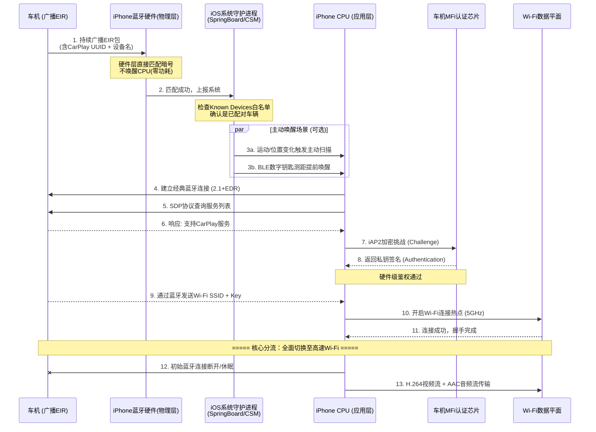
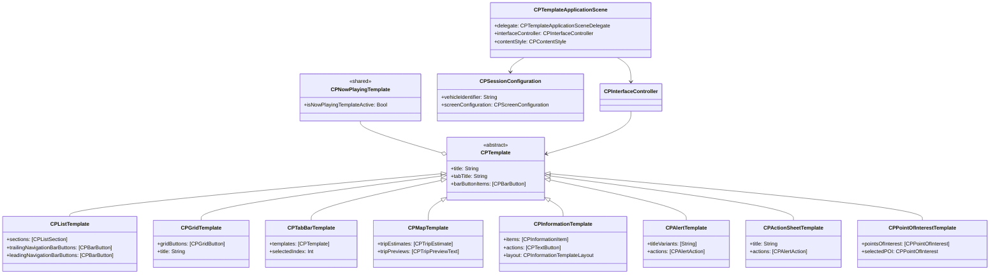

好的，已将您提供的这份极其专业的“无线 CarPlay 双模混合组网与后台扫描机制”深度解析，完整融合到上一版的全面技术文档中。现在这份文档在**无线连接底层原理**和**iOS 系统级后台唤醒机制**部分得到了大幅增强，尤其适合正在处理车机端 Handover 切换失败或连接稳定性问题的开发者参考。

以下是融合了深度系统级原理的**完整升级版 CarPlay 技术全解析**：

---

# CarPlay 全面技术深度解析（双模混合组网增强版）

## 一、CarPlay 简介

CarPlay 是苹果公司推出的车机互联解决方案，核心设计理念是 **“手机作为运算核心，车机作为交互界面”** 。自 iOS 12 起向第三方导航开放，2022 年发布的 **CarPlay Ultra（新一代）** 更进一步，可直接替换车辆仪表盘，显示车速、油量等车辆信息。

在无线连接架构上，CarPlay 采用著名的 **“双模混合组网”** 技术规范：**绝不使用低带宽的蓝牙传输实时导航画面和声音**，蓝牙仅充当“侦察兵”与“联络员”完成发现与握手，连接建立后立即将重负载任务（音视频流）全权移交给高速 Wi-Fi。


## 二、双模混合组网架构设计

### 2.1 整体分层架构

| 层级                    | 说明                                                                                                           |
| ----------------------- | -------------------------------------------------------------------------------------------------------------- |
| **iPhone 端（应用层）** | 运行 iOS App，通过 CarPlay Framework 提供数据。系统守护进程（SpringBoard / CarPlaySessionManager）托管底层连接 |
| **控制平面（蓝牙）**    | 负责设备发现（EIR 广播）、服务查询（SDP）、安全鉴权（iAP2 加密挑战）以及 Wi-Fi 密码交换。**不传输音视频数据**  |
| **数据平面（Wi-Fi）**   | 连接建立后接管所有高吞吐量数据，传输 H.264/H.265 视频流与 PCM/AAC 音频流                                       |
| **车机端（中间件层）**  | Communication Plugin 接收并解码流，内置苹果官方认证协处理器（MFi 芯片）                                        |

### 2.2 无线 CarPlay 特有的“系统级托管”架构

无线 CarPlay 的扫描与连接**并非由某个普通 App 驱动**，而是直接由 iOS 系统的底层服务托管：

- **SpringBoard（系统桌面进程）** 与 **CarPlaySessionManager（系统车机连接守护进程）** 负责监听和决策。
- **蓝牙硬件芯片**在物理层具备独立低功耗运算能力，可在**不唤醒手机 CPU** 的情况下完成广播包的预过滤。


## 三、底层原理（无线增强版）

### 3.1 通信协议栈（双模视角）

| 协议/技术                     | 所属平面     | 核心作用                                                    |
| ----------------------------- | ------------ | ----------------------------------------------------------- |
| **EIR（扩展查询响应）**       | 蓝牙控制平面 | 在广播包中嵌入 CarPlay UUID 与设备名，实现 0.5 秒内精准定位 |
| **SDP（服务发现协议）**       | 蓝牙控制平面 | 查询车机是否具备 CarPlay 服务能力                           |
| **iAP2（iPod 附件协议二代）** | 蓝牙控制平面 | **MFi 硬件级加密鉴权**，验证车机是否内置苹果授权芯片        |
| **BLE（低功耗蓝牙）**         | 蓝牙控制平面 | 用于 CCC 数字钥匙测距，辅助提前唤醒经典蓝牙扫描             |
| **Wi-Fi（5GHz / NCM）**       | 数据平面     | 建立 IPv6 link-local 网络，承载 AirPlay 音视频流            |

### 3.2 无线 CarPlay 完整生命周期（含系统级后台扫描原理）

无线 CarPlay 的连接并非从用户点击开始，而是由 iOS 底层硬件与守护进程协同完成的“无感秒连”过程。其完整生命周期如下：

#### 🕵️‍♂️ 阶段一：后台硬件级 EIR 扫描（零功耗侦听）
- **常驻监听**：只要 iPhone 蓝牙开关开启，蓝牙芯片便在硬件级别周期性地微量通电，接收空气中的无线电波。
- **零功耗过滤**：车机不断向外广播含有**特定 CarPlay UUID（苹果专用服务标识符）** 的 EIR 包。iPhone 蓝牙芯片在收到后，**直接在硬件层完成暗号匹配**（不唤醒 CPU）。只有匹配成功，才会将消息上报给 iOS 核心系统。
- **主动唤醒触发场景**：
  - **场景 A（运动感知）** ：手机加速度计检测到步行或 GPS 发生变动，iOS 瞬间加大蓝牙采样频率。
  - **场景 B（数字钥匙测距）** ：符合 CCC 规范的车钥匙开启 BLE 后台测距，当手机距离车门 10 米内时，BLE 直接发高优先级信号唤醒经典蓝牙定向抓取 EIR。

#### 🔗 阶段二：建立经典蓝牙连接与 SDP 查询
- iPhone 被唤醒后，通过经典蓝牙（2.1 + EDR）与车机建立初步连接。
- 通过 **SDP 协议**读取车机服务列表。若查找到苹果专用的 CarPlay UUID，手机确认“这是支持 CarPlay 的车”，而非普通音响。

#### 🔐 阶段三：MFi 硬件级 iAP2 安全鉴权
- iPhone 通过 **iAP2 协议**向车机发起“加密挑战（Challenge）”。
- 车机内部**苹果官方授权的硬件加密芯片**利用私钥对挑战进行数学签名并返回。
- iPhone 验签通过，确认车机为正版授权设备，才会允许启动 CarPlay。

#### 📶 阶段四：Wi-Fi 密码交换与 Handover（核心分流）
- iAP2 鉴权通过后，车机**通过经典蓝牙通道**将自己的 5GHz Wi-Fi 热点名称（SSID）和加密密码（WPA2/WPA3）秘密发送给 iPhone。
- iPhone 后台自动开启 Wi-Fi 并连接车机热点。
- **一旦 Wi-Fi 连通，导航画面（H.264 视频流）与音频流立即切换到 Wi-Fi 传输，初始的经典蓝牙连接随即进入闲置或断开状态。**

#### 🗂️ 补充机制：iOS 专属设备白名单
- **首次配对**时，iOS 将该车机的蓝牙 MAC 地址与 CarPlay 专属秘钥写入系统安全白名单（Known Devices）。
- 后续后台扫描时，iOS 严格比对白名单。**只有完全匹配的已知车辆才会触发 iAP2 流程，陌生车辆的广播包会被硬件层直接丢弃。**


## 四、应用场景

（此部分保持不变，仍包含导航、音频、通信、电车充电、停车、CarPlay Ultra 车辆控制等场景。）


## 五、连接流程图（Mermaid）- 含系统守护进程与硬件层

以下序列图完整展示了 iOS 系统守护进程、蓝牙硬件芯片、MFi 芯片及 Wi-Fi 数据平面的协同工作流程：




## 六、类图

CarPlay Framework 的核心类层次结构：



### 核心类说明

- **CPTemplate**：所有 CarPlay UI 模板的抽象基类，定义了通用功能
- **CPTemplateApplicationScene**：CarPlay 场景，控制应用的 UI
- **CPSessionConfiguration**：提供车辆属性和 CarPlay 环境配置
- **CPInterfaceController**：管理模板的导航栈（push/pop/present）
- **CPListTemplate**：显示和管理列表项
- **CPGridTemplate**：显示和管理网格项
- **CPMapTemplate**：显示导航地图覆盖层

## 七、关键实现代码

### 7.1 Info.plist 场景配置

应用必须采用 UIScene 才能使用 CarPlay Framework：

```xml
<key>UIApplicationSceneManifest</key>
<dict>
    <key>UISceneConfigurations</key>
    <dict>
        <key>CPTemplateApplicationSceneSessionRoleApplication</key>
        <array>
            <dict>
                <key>UISceneClassName</key>
                <string>CPTemplateApplicationScene</string>
                <key>UISceneConfigurationName</key>
                <string>MyApp-Car</string>
                <key>UISceneDelegateClassName</key>
                <string>MyApp.CarPlaySceneDelegate</string>
            </dict>
        </array>
    </dict>
</dict>
```

### 7.2 CarPlay Scene Delegate（Swift）

```swift
import CarPlay

class CarPlaySceneDelegate: UIResponder, CPTemplateApplicationSceneDelegate {
    
    var interfaceController: CPInterfaceController?
    
    func templateApplicationScene(_ templateApplicationScene: CPTemplateApplicationScene,
                                  didConnect interfaceController: CPInterfaceController) {
        self.interfaceController = interfaceController
        
        // 创建列表模板
        let listItem = CPListItem(text: "欢迎使用 CarPlay", 
                                  detailText: "这是一个示例应用")
        listItem.handler = { [weak self] item, completion in
            // 处理点击事件
            completion()
        }
        
        let section = CPListSection(items: [listItem])
        let template = CPListTemplate(title: "主菜单", sections: [section])
        
        // 设置为根模板
        interfaceController.setRootTemplate(template, animated: true)
    }
    
    func templateApplicationScene(_ templateApplicationScene: CPTemplateApplicationScene,
                                  didDisconnect interfaceController: CPInterfaceController) {
        self.interfaceController = nil
    }
}
```

### 7.3 创建导航模板（CPMapTemplate）

```swift
let mapTemplate = CPMapTemplate()
mapTemplate.tripEstimateStyle = .light

// 添加导航栏按钮
let button = CPBarButton(type: .text) { _ in
    // 处理点击
}
button.title = "导航"
mapTemplate.trailingNavigationBarButtons = [button]

interfaceController?.setRootTemplate(mapTemplate, animated: true)
```

### 7.4 创建信息模板

```swift
let infoItem = CPInformationItem(title: "CarPlay 示例", 
                                 detail: "这是一个展示 CarPlay 功能的示例应用")
let infoTemplate = CPInformationTemplate(title: "信息", 
                                         layout: .twoColumn, 
                                         items: [infoItem],
                                         actions: [
                                            CPTextButton(title: "确定", 
                                                         style: .normal) { _ in
                                                // 处理操作
                                            }
                                         ])
interfaceController?.pushTemplate(infoTemplate, animated: true)
```

### 7.5 创建 Alert 模板

```swift
let alertTemplate = CPAlertTemplate(titleVariants: ["提示", "重要更新"],
                                    actions: [
                                        CPAlertAction(title: "确定", 
                                                      style: .default) { _ in
                                            // 处理确认
                                        },
                                        CPAlertAction(title: "取消", 
                                                      style: .cancel) { _ in
                                            // 处理取消
                                        }
                                    ])
interfaceController?.presentTemplate(alertTemplate, animated: true)
```

### 7.6 React Native 实现示例

```javascript
import { CarPlay, GridTemplate } from 'react-native-carplay';

// 创建模板
const template = new GridTemplate({
  title: 'Hello, World',
});

// 设置根模板
CarPlay.setRootTemplate(template);

// 注册连接事件
CarPlay.registerOnConnect(() => {
  console.log('CarPlay connected');
  CarPlay.setRootTemplate(template);
});
```

## 八、注意事项与开发避坑指南（无线增强版）

### 8.1 MFi 认证与权限
- **MFi 会员**：在车机端集成 CarPlay 需加入 MFi 会员（准入周期 1-2 个月），车机必须内置苹果官方认证协处理器。
- **Entitlement 申请**：需申请对应权限（如 `com.apple.developer.carplay-audio`、`carplay-driving-task` 等）。

### 8.2 无线连接稳定性（Handover 失败排查重点）
- **3 秒硬性要求**：从设备连接建立到 CarPlay 会话启动，必须在 **3 秒内**完成。若 iAP2 鉴权或 Wi-Fi 密码交换超时，系统会拒绝启动。
- **Wi-Fi 频段**：推荐强制使用 **5GHz 频段**（2.4GHz 干扰大且带宽不足），车机热点需支持 WPA2-Personal 加密。
- **深度睡眠导致的“上车不连”**：
  - 若手机在口袋中长期静止（深度睡眠），iOS 后台经典蓝牙扫描间隔会被拉长至数分钟。
  - **解决办法**：用户只需摇动手机或按一下电源键唤醒屏幕，iOS 便会瞬间激活系统主动抓取 EIR 包并触发连接。**这不是 Bug，而是系统省电策略。**

### 8.3 🔥 插件库开发底层红线（极其重要）
- **绝对不要在 App 或插件库中调用 `CoreBluetooth` 去扫描经典蓝牙的 EIR 包**：
  - iOS 的 `CoreBluetooth` 框架**仅允许在应用层扫描 BLE（低功耗蓝牙）广播**。
  - 传统经典蓝牙的 EIR 扫描属于**苹果不对外开放的系统级私有权限**。普通 App 无法直接获取 CarPlay 专用 UUID 的 EIR 包。
- **标准主动触发做法**：若您的插件库需要主动干预连接，合规做法是**先利用 BLE（低功耗蓝牙）去侦测车辆（如 CCC 数字钥匙规范）**。一旦 BLE 确认了车辆存在，再通过内部路由或 `CPSessionConfiguration` 通知 iOS 系统去拉起 CarPlay 的经典蓝牙握手流程，而非自行操盘底层蓝牙扫描。

### 8.4 应用界面限制（CarPlay Ultra 适用）
- **模板深度限制**：第三方 AI 应用严格限制为最多 **3 个模板屏幕**（含主界面），禁止构建深层复杂菜单。
- **音频抢占限制**：语音交互结束必须立即释放音频资源，严禁干扰 FM 广播或其他车载音源。

### 8.5 测试与真机环境
- 无线 CarPlay 调试强烈建议使用支持 **BLE 5.0** 及 **5GHz Wi-Fi 热点**的车机开发板。
- 模拟器可验证 UI 逻辑，但 Handover（蓝牙切 Wi-Fi）及 iAP2 鉴权流程**必须在集成 MFi 芯片的真机环境中验证**。
