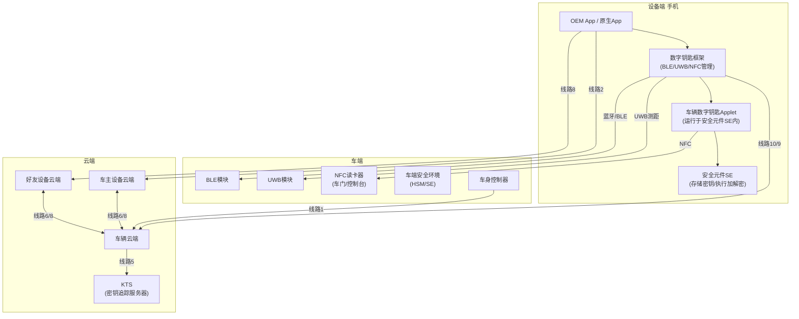
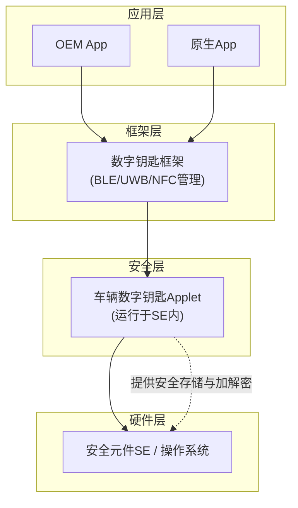
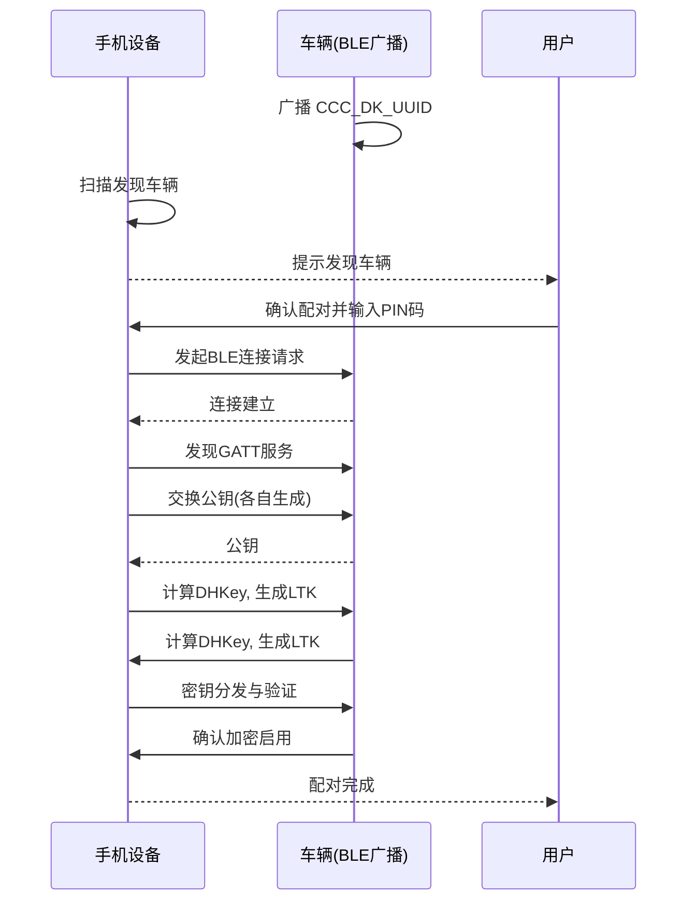
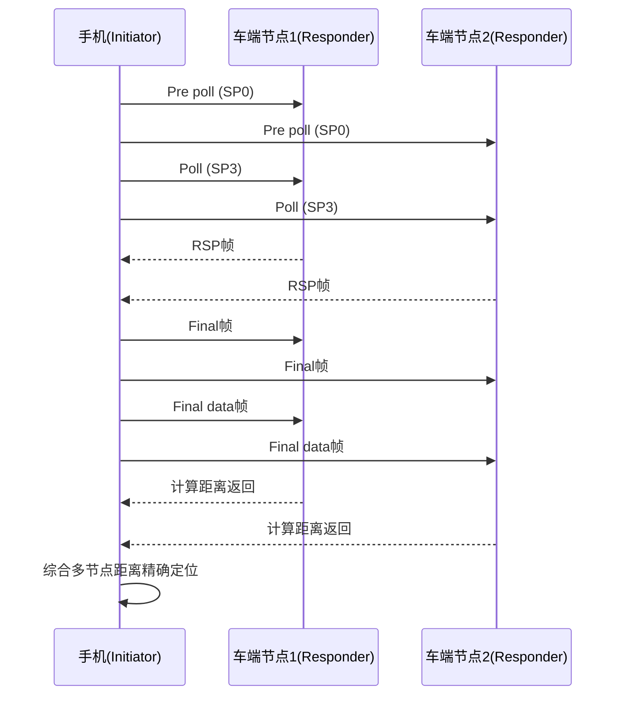
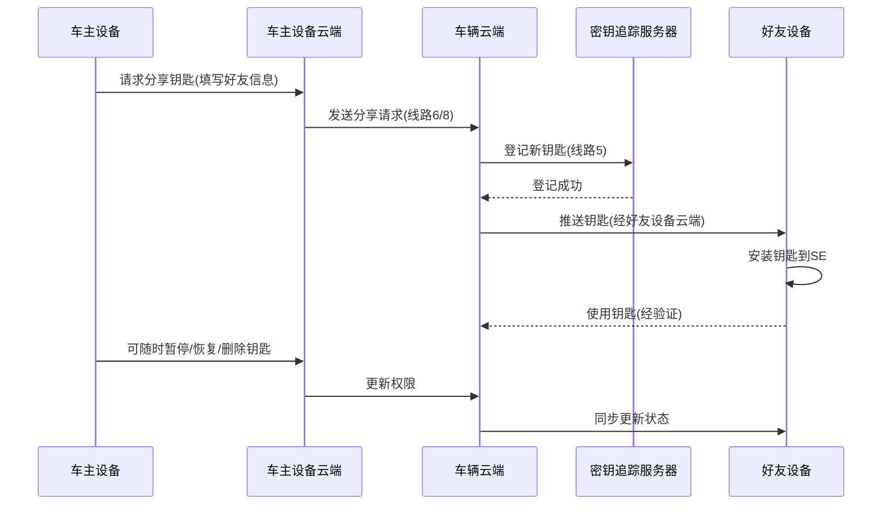

# CCC R3 数字钥匙规范解读

CCC R3（第三代数字钥匙）的技术解读与 Mermaid 流程图、架构图融合，便于系统性理解数字钥匙的端到端架构与核心流程。


## 一、DK系统架构：端到端的协作

CCC R3 数字钥匙系统是一个涉及**车端、设备端（手机）、云端**三方的协作体系。

### 1.1 核心组件一览

| 层级               | 核心组件                                   | 说明                                  |
| ------------------ | ------------------------------------------ | ------------------------------------- |
| **车端**           | BLE模块、UWB模块、NFC读卡器（车门/控制台） | 感知设备、测距定位、执行解锁/启动指令 |
| **设备端（手机）** | 安全元件（SE）、数字钥匙框架、OEM App      | 存储密钥、执行加解密、提供用户交互    |
| **云端**           | 车主设备云端、好友设备云端、车辆云端、KTS  | 管理钥匙生命周期、处理分享、追踪密钥  |

### 1.2 系统架构图（Mermaid）



### 1.3 通信线路说明

| 线路编号     | 通信双方                | 用途                     |
| ------------ | ----------------------- | ------------------------ |
| **线路1**    | 车辆 ↔ 车辆云端         | 安全通信，上报车辆状态   |
| **线路2**    | 车主设备 ↔ 车主设备云端 | 同步钥匙信息             |
| **线路5**    | 车辆云端 ↔ KTS          | 注册所有已颁发的数字钥匙 |
| **线路6/8**  | 设备云端 ↔ 车辆云端     | 钥匙分享、跟踪、终止     |
| **线路10/9** | 设备 ↔ 车辆云端         | 设备与车辆云端直接通信   |


## 二、设备端DK架构：SE是安全核心

手机端数字钥匙框架采用**四层架构**，安全元件（SE）是整个体系的安全根基。

### 2.1 设备端四层架构（Mermaid）



### 2.2 SE为何是安全核心？

1. **硬件级隔离**：密钥存储在 SE 的独立安全域，普通应用无法读取。
2. **防篡改设计**：具备物理防拆、抗侧信道攻击能力。
3. **安全执行环境**：Applet 与操作系统隔离运行。
4. **标准认证**：符合 Common Criteria EAL4+ 等国际安全认证。


## 三、NFC数字钥匙（R1）：基础保障

NFC 在 R3 中**仍是必选功能**，承担两个关键角色：

- **应急备用**：手机没电时，通过 NFC 被动模式仍可解闭锁和启动车辆。
- **带外配对（OOB）** ：首次配对时，NFC 作为安全通道交换初始密钥。

> 设计原则：任何数字钥匙方案都必须包含 NFC 后备方案，确保极端可用性。


## 四、BLE数字钥匙（R2/R3）：连接与配对的基础

R3 中定位已升级为 UWB，但 **安全数据通信仍通过 BLE 进行**。BLE 负责设备发现、连接建立、安全配对、状态同步等。

### 4.1 BLE OOB 配对流程（Mermaid 时序图）




## 五、UWB数字钥匙（R3）：精准定位的核心

UWB 通过**到达时间（ToA）** 测距，实现**厘米级高精度定位**，是无感进入体验的关键。

### 5.1 UWB 物理层帧结构（PPDU）

| 字段     | 全称         | 作用                 |
| -------- | ------------ | -------------------- |
| **SYNC** | 前导码       | 信号检测与同步       |
| **SFD**  | 帧起始分隔符 | 标识帧开始           |
| **STS**  | 安全时间戳   | 防止时间戳篡改       |
| **PHR**  | 物理头       | 包含 PSDU 长度等信息 |
| **PSDU** | 有效数据载荷 | 承载实际数据         |

### 5.2 UWB 测距流程（Mermaid 时序图）




## 六、钥匙分享与生命周期管理

### 6.1 分享与生命周期流程（Mermaid 时序图）



### 6.2 权限控制要点

- **分享权限**：车主可分享钥匙给好友，好友**无法二次分享**。
- **访问配置**：可为好友设置有效期、使用次数、行驶区域等限制。
- **生命周期操作**：车主可通过云端**更新、删除、暂停、恢复**设备证书。


## 七、总结与核心要点

| 技术组件     | 核心职责                | 关键价值                   |
| ------------ | ----------------------- | -------------------------- |
| **NFC**      | 应急备用 + OOB 配对     | 没电也能用，确保底线可用性 |
| **BLE**      | 连接建立 + 安全通信     | 日常数据交换通道           |
| **UWB**      | 高精度测距定位          | 无感进入体验（厘米级精度） |
| **SE**       | 密钥存储 + 安全运算     | 硬件级安全根基             |
| **云端+KTS** | 钥匙管理 + 生命周期追踪 | 支持分享、撤销、审计       |

### 未来扩展场景
UWB 技术在车联网中尚处初期，但可拓展至：
- 自动泊车（车辆自主寻找车位）
- 车辆共享（临时授权）
- 汽车支付（车内无感支付）
- 车内活体检测（儿童存在检测）


# CCC(Car Connectivity Consortium)

>CCC（Car Connectivity Consortium，车联网联盟）标准架构是全球汽车与消费电子行业共同制定的一套跨平台、高安全性的数字钥匙（Digital Key）标准化生态系统。它旨在打破手机品牌与汽车品牌之间的壁垒，确保车主仅通过智能手机或可穿戴设备，就能实现无缝且安全的无钥匙进入、解锁、启动及钥匙分享功能。

## CCC 标准架构

CCC 标准架构并非单一的技术，而是一个由四大核心实体、三大无线通信层、以及高强度安全芯片（SE）与公钥基础设施（PKI）共同构成的端到端信任链

### 四大核心实体

```
+-------------------------+                   +-------------------------+

|   Vehicle OEM Server    | <== 标准化接口 => |   Device OEM Server     |
|      (汽车厂商云端)      |                   |     (手机厂商云端)      |
+-------------------------+                   +-------------------------+
             ^                                             ^

             | 专有/标准化接口                             | 专有/标准化接口
             v                                             v
+-------------------------+                   +-------------------------+

|        Vehicle          | <== 三层无线通信 => |      Mobile Device      |
|         (车辆)          |   (UWB / BLE / NFC) |   (手机 / 安全芯片 SE)  |
+-------------------------+                   +-------------------------+
```

**移动设备 (Mobile Device)**：车主使用的智能手机或手表。其内部核心是安全元件（Secure Element, SE），用于安全地创建、存储和处理数字钥匙相关凭证，与操作系统隔离，防止软件和硬件攻击。

**车辆 (Vehicle)**：集成了 NFC 读卡器、蓝牙（BLE）和超宽带（UWB）天线的汽车。车辆内部存储有对应信任链的公钥。

**车辆厂商服务器 (Vehicle OEM Server)**：管理车辆生命周期、车主配对状态及高级钥匙分发策略的云端。

**设备厂商服务器 (Device OEM Server)**：如 Apple、Samsung 等手机厂商的云端，负责与手机 SE 安全芯片对接，协助将数字钥匙安全地下发到手机

### 三层无线通信技术架构

最新的 CCC Release 3 / 4 规范中，车辆与手机之间的近场交互采用了由远及近的“三层防御与感知”架构： 

**BLE（低功耗蓝牙）**—— 远程唤醒与身份验证：当手机靠近车辆（约数十米）时，BLE 首先建立连接，完成设备身份的初步认证并唤醒车辆系统。
**UWB（超宽带）**—— 精准定位与迎宾（无感进入）：当距离进一步缩短，UWB 利用其厘米级的定位精度进行安全测距。它能精准判断车主是在车外还是车内，并在防范“中继攻击（Relay Attack）”的同时，实现自动解锁、亮起迎宾灯等无感体验。
**NFC（近场通信）**—— 触碰解锁与低电量备用：用于刷车把手解锁或放置在车内无线充电板上启动车辆。其最大优势是支持低电量模式，即使手机因没电关机，依然可以通过 NFC 芯片的残存电量刷卡开门和发动汽车。

### 安全与信任机制（PKI 架构）
CCC 架构之所以能达到金融级的安全，依赖于其底层的公钥基础设施（PKI）和非对称加密算法：

**端到端信任链**：数字钥匙在手机的 SE 芯片中生成，其私钥绝不离设备。车辆仅存储相应的公钥。
**相互签名认证**：每次解锁时，车辆和手机通过非对称密码技术进行双向签名校验，只有当签名计算完全吻合，车辆才会执行解闭锁或启动发动机指令。
**安全合规**：CCC 数字钥匙的 Applet（小应用）通过了高等级的通用准则（Common Criteria, CC）安全评估，确保能有效抵御存储入侵和硬件克隆。

### 核心业务场景流程

**车主配对（Owner Pairing）**：车主通过交付中心拿到的机密凭证，在车内将自己的手机与汽车绑定。手机云端与车企云端握手，将数字钥匙安全地写入手机 SE 中。

**钥匙分享（Key Sharing）**：车主无需物理交付，可以直接通过 IM 软件（如微信、iMessage）向好友发送一个加密分享链接。在云端校验证书链后，“朋友设备”也能安全地获得一个受限的数字钥匙（可自定义使用时限或功能权限）。

## Questions

“CCC 架构采用增量黑名单（CRL/CRL_Timestamp）与有效期（Validity Period）机制。首先，手机证书（Cert_M）在生成时就有很短的有效期。其次，当车辆偶尔连接上 4G/5G 网络（通过车端 T-Box 联网）或车主用 App 进行远程控制（Remote Control）时，汽车云会把最新的‘废弃钥匙黑名单’同步推送到车机 SE 中。在近场离线验签时，车机会先核对该证书是否在本地黑名单内，从而完美解决了离线状态下的安全挂失问题。”

## 核心关联纽带(SPMS/TSM架构)

设备厂商服务器内部集成了 SPMS（Secure Provisioning Management System，安全配置管理系统） 或传统的 TSM（Trusted Service Manager，可信服务管理器） 功能。

**唯一性绑定**：手机在出厂时，其内置的 eSE（嵌入式安全芯片）就已经烧录了由设备厂商生成的、全球唯一的芯片根证书和密钥对（如公钥/私钥）。

**云端建档**：Device OEM Server 的数据库中记录了该设备 SE 的唯一样本标识（如 00A1... 序列号）。当手机激活并绑定账号后，云端服务器便在逻辑上将“云端账号-手机系统-硬件 SE”三者强关联在一起

## 数据的安全传输通路：端到端加密

当汽车厂商云端（Vehicle OEM Server）通过标准接口，把生成的数字钥匙凭证（Credential）同步给 Device OEM Server 后，两者的通信路线如下

```
[Device OEM Server]
        │ 
        │ (1) 通过 TLS 建立互联网安全连接
        ▼
[Mobile Phone OS / Wallet App] (手机主系统 / 钱包应用)
        │
        │ (2) 使用专有 APDU 指令透传
        ▼
[Secure Element (SE)] ──► [Digital Key Applet] (数字钥匙小应用)
```
**云端至手机（网络层）**：Device OEM Server 与手机的操作系统（如 iOS / Android）建立高强度的 TLS 加密网络连接，将数据下发给系统自带的“钱包（Wallet）”或核心系统服务。
**手机内部至 SE（硬件层）**：主系统（AP，应用处理器）通过手机内部的总线接口（如 SPI / I2C），使用标准的 APDU（应用协议数据单元）指令，将云端数据包原封不动地“透传（Pass-through）”给 SE 芯片。

>>注意：手机主系统（Android/iOS）在整个过程中只是一个“搬运工”，它无法解密和窥探这个数据包的内容，从而防止了手机因越狱、root 或中恶意软件而导致鑰匙泄露。 

>>步骤1: 系统级接管：你的 App 调用手机系统的数字钥匙 SDK（例如 iOS 的 PassKit 框架，或 Android 的 Google Wallet API / 华为 Identity Kit）。
建立安全连接：操作系统（而非你的 App）在后台自动与对应的手机厂商服务器（如苹果的 Apple Pay 服务器，华为、小米的钱包服务器）建立专有的、双向认证的 TLS 1.3 / 密评安全通道。
身份凭证校验：手机厂商服务器通过该 TLS 通道下发配置指令，验证当前手机的设备证书（Device Certificate），确保这台手机是合法的、非仿冒的设备。


## 钥匙在 SE 内部的落地：SCP 加密安全通道

当数据包到达 SE 内部后，SE 会使用 SCP（Secure Channel Protocol，安全通道协议，通常为 SCP03/SCP11 规范） 与 Device OEM Server 进行最终的硬件级身份核验。

**解密与验签**：数据包使用只有 Device OEM Server 和该 SE 芯片知道的专有对称密钥（Session Key）进行了加密。SE 内部的硬件加密引擎会对数据进行解密，并验证 Device OEM Server 的数字签名。

**写入 Applet**：确认数据来源合法且未被篡改后，SE 会将数字钥匙写入专用的 Digital Key Applet（数字钥匙小应用） 存储区中。至此，数字钥匙正式在手机硬件底层“安家”

## App需要做的事情

1. 向汽车厂商云端请求钥匙数据包（Opaque Token / Payload）
你的 App 不能直接生成钥匙。当用户点击“激活车钥匙”时，你的 App 必须通过 API 向你们自己的汽车厂商服务器（Vehicle OEM Server）发起请求，申请一个加密的、未初始化的数字钥匙数据包（通常称为凭证令牌 Token 或 Payload）。

2. 调用手机操作系统提供的数字钥匙原生 SDK
获取到汽车云端的数据包后，你的 App 需要调用手机厂商官方的 SDK 接口。
iOS (Swift / Objective-C)：使用 PassKit 框架，构建一个 PKAddPassButton，并准备好 PKSecureElementPass 的数据，调用系统的添加卡片界面。
Android (Java / Kotlin)：调用 Google Wallet SDK 中的 savePasses 方法，或国内手机厂商（如华为、小米）提供的专有车钥匙服务 SDK。


```
[你开发的汽车 App] ──(1. 请求钥匙数据)──► [汽车厂商云端 (Vehicle OEM Server)]
       │                                                   │
       │                                        (2. 云对云下发标准凭证)
       ▼                                                   ▼
[调用手机系统 SDK]                                [设备厂商云端 (Device OEM Server)]
       │                                                   │
       │ (3. 系统接管: 建立 TLS)                            │
       └─────────────────────────► [手机系统钱包] ◄─────────┘
```

3. 将控制权完全移交给手机系统
一旦你调用了系统 SDK，你的 App 必须交出控制权。此时，手机屏幕上会弹出一个由系统控制的、无法被篡改的“钱包添加车钥匙”原生界面（例如苹果的经典添加卡片弹窗）。在这个界面弹窗期间，所有的 TLS 通信、安全加密、SE 芯片写入，都由系统在后台独立完成，你的 App 无法干预，也无法读取任何传输中的数据。

4. 监听回调并刷新 App 界面状态
系统钱包处理完 TLS 连接并成功将钥匙写入 SE 芯片后，系统 SDK 会给你的 App 返回一个结果回调（Callback）：
如果成功（Success）：你的 App 需要更新 UI（例如从“未激活”变为“已激活”），允许用户在 App 内看到钥匙状态，并引导用户如何使用（如：将手机靠近车把手刷卡）。
如果失败（Failure）：你的 App 需要捕获错误码（如网络超时、SE 空间不足、用户取消等），并向用户展示友好的错误提示。

### 云端下发到设备的凭证

**小程序代码（Digital Key Applet Code）**
它是什么：这是一段符合 Java Card 规范的编译好的字节码（Bytecode） [1, 2]。
它的作用：它规定了车钥匙在硬件底层该如何运行。比如，当汽车通过 NFC 或蓝牙发来一段指令时，这个小程序会控制 SE 芯片去执行对应的非对称加密算法，计算并返回结果。

**设备专属密钥对（Device Key Pair）**
它是什么：这是在安全芯片（SE）内部原生生成或安全注入的一对非对称加密密钥（包含一个私钥 Private Key 和一个公钥 Public Key）。
它的作用：私钥绝对不会离开 SE 芯片，任何人（包括手机厂商和你的 App）都读不出来 [1, 2]。每次你靠近汽车解锁时，Applet 小程序就会调用这个私钥去对汽车发来的随机数进行数字签名。

在 CCC 架构中，实际上存在两个不同层级的证书共同工作：


| 属性         | 1. 设备认证/证明证书 (Device Attestation Cert)                                    | 2. 车企签名证书 (Vehicle OEM Signature Cert)                                      |
| :----------- | :-------------------------------------------------------------------------------- | :-------------------------------------------------------------------------------- |
| **写入时间** | 手机生产、出厂时（工厂流水线烧录）                                                | 车主激活、添加车钥匙时（App 触发通过云端下载）                                    |
| **存放位置** | 安全芯片（SE）的系统区（COS 掌控）                                                | 安全芯片（SE）内新下载的 Digital Key Applet 存储区                                |
| **它的作用** | 证明“这台手机是苹果/华为生产的正品，安全芯片没有被黑客篡改”（相当于**身份证**）。 | 证明“这台手机已经被宝马/比亚迪官方授权，允许开某一辆车”（相当于**出入通行证**）。 |
| **唯一性**   | 全球每台手机独一无二。                                                            | 针对某一辆具体车架号（VIN）和车主账号。                                           |

>出厂阶段（静态）：手机厂商在 SE 芯片里烧录了设备根证书和一对私钥。此时，它只是一张合法的“空白身份证”。

>激活车钥匙阶段（动态）：你买了新车，点击汽车 App 发起车钥匙申请
汽车厂商服务器（Vehicle OEM Server）收到请求，知道你要开 VIN 码为 WBAxxx 的车。
汽车云端会为这把钥匙生成特定的权限（ACL），并用车企自己的私钥对这段数据进行数字签名。
为了让汽车（车端）在没有网络的情况下也能验证这个签名，汽车云端就必须把自家的“车企签名证书”（包含车企的公钥）连同凭证一起打包，通过 Device OEM Server 动态下发，最终写入到手机的 Digital Key Applet 中