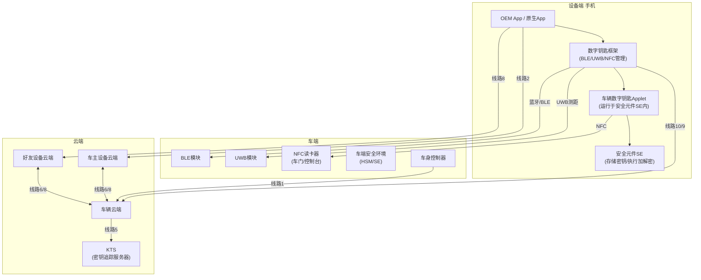
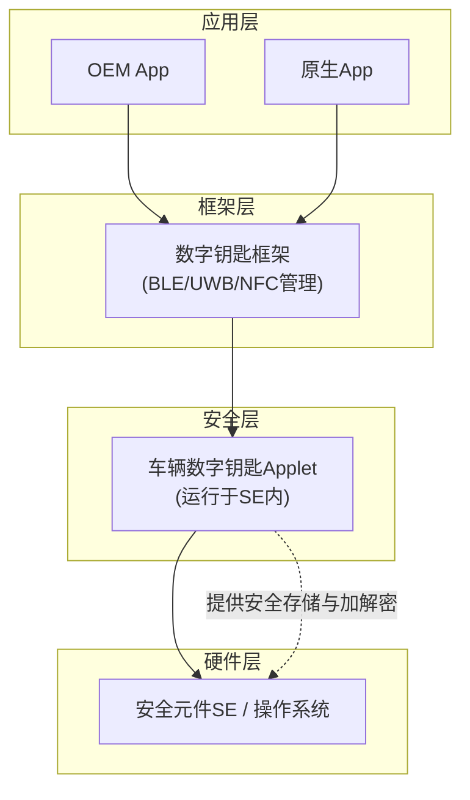
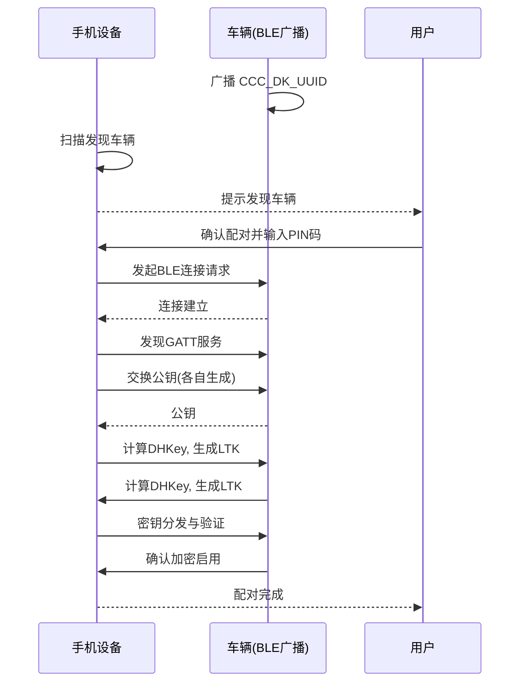
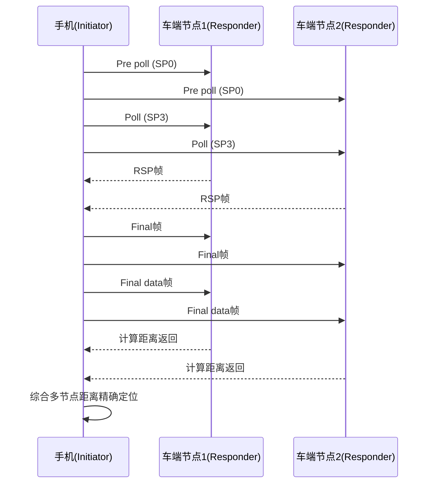
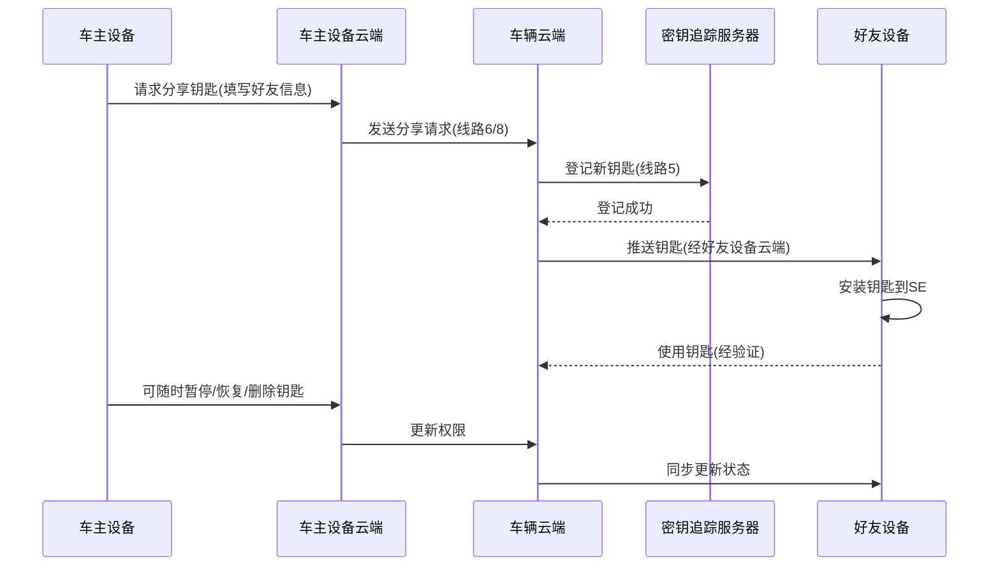

# CCC R3 数字钥匙规范解读

CCC R3（第三代数字钥匙）的技术解读与 Mermaid 流程图、架构图融合，便于系统性理解数字钥匙的端到端架构与核心流程。

## 一、DK系统架构：端到端的协作

CCC R3 数字钥匙系统是一个涉及**车端、设备端（手机）、云端**三方的协作体系。

### 1.1 核心组件一览

| 层级               | 核心组件                                   | 说明                                  |
| ------------------ | ------------------------------------------ | ------------------------------------- |
| **车端**           | BLE模块、UWB模块、NFC读卡器（车门/控制台） | 感知设备、测距定位、执行解锁/启动指令 |
| **设备端（手机）** | 安全元件（SE）、数字钥匙框架、OEM App      | 存储密钥、执行加解密、提供用户交互    |
| **云端**           | 车主设备云端、好友设备云端、车辆云端、KTS  | 管理钥匙生命周期、处理分享、追踪密钥  |

### 1.2 系统架构图（Mermaid）

### 1.3 通信线路说明

| 线路编号     | 通信双方                | 用途                     |
| ------------ | ----------------------- | ------------------------ |
| **线路1**    | 车辆 ↔ 车辆云端         | 安全通信，上报车辆状态   |
| **线路2**    | 车主设备 ↔ 车主设备云端 | 同步钥匙信息             |
| **线路5**    | 车辆云端 ↔ KTS          | 注册所有已颁发的数字钥匙 |
| **线路6/8**  | 设备云端 ↔ 车辆云端     | 钥匙分享、跟踪、终止     |
| **线路10/9** | 设备 ↔ 车辆云端         | 设备与车辆云端直接通信   |

## 二、设备端DK架构：SE是安全核心

手机端数字钥匙框架采用**四层架构**，安全元件（SE）是整个体系的安全根基。

### 2.1 设备端四层架构（Mermaid）

### 2.2 SE为何是安全核心？

1. **硬件级隔离**：密钥存储在 SE 的独立安全域，普通应用无法读取。
2. **防篡改设计**：具备物理防拆、抗侧信道攻击能力。
3. **安全执行环境**：Applet 与操作系统隔离运行。
4. **标准认证**：符合 Common Criteria EAL4+ 等国际安全认证。

## 三、NFC数字钥匙（R1）：基础保障

NFC 在 R3 中**仍是必选功能**，承担两个关键角色：

- **应急备用**：手机没电时，通过 NFC 被动模式仍可解闭锁和启动车辆。
- **带外配对（OOB）** ：首次配对时，NFC 作为安全通道交换初始密钥。

> 设计原则：任何数字钥匙方案都必须包含 NFC 后备方案，确保极端可用性。

## 四、BLE数字钥匙（R2/R3）：连接与配对的基础

R3 中定位已升级为 UWB，但 **安全数据通信仍通过 BLE 进行**。BLE 负责设备发现、连接建立、安全配对、状态同步等。

### 4.1 BLE OOB 配对流程（Mermaid 时序图）

## 五、UWB数字钥匙（R3）：精准定位的核心

UWB 通过**到达时间（ToA）** 测距，实现**厘米级高精度定位**，是无感进入体验的关键。

### 5.1 UWB 物理层帧结构（PPDU）

| 字段     | 全称         | 作用                 |
| -------- | ------------ | -------------------- |
| **SYNC** | 前导码       | 信号检测与同步       |
| **SFD**  | 帧起始分隔符 | 标识帧开始           |
| **STS**  | 安全时间戳   | 防止时间戳篡改       |
| **PHR**  | 物理头       | 包含 PSDU 长度等信息 |
| **PSDU** | 有效数据载荷 | 承载实际数据         |

### 5.2 UWB 测距流程（Mermaid 时序图）

## 六、钥匙分享与生命周期管理

### 6.1 分享与生命周期流程（Mermaid 时序图）

### 6.2 权限控制要点

- **分享权限**：车主可分享钥匙给好友，好友**无法二次分享**。
- **访问配置**：可为好友设置有效期、使用次数、行驶区域等限制。
- **生命周期操作**：车主可通过云端**更新、删除、暂停、恢复**设备证书。

## 七、总结与核心要点

| 技术组件     | 核心职责                | 关键价值                   |
| ------------ | ----------------------- | -------------------------- |
| **NFC**      | 应急备用 + OOB 配对     | 没电也能用，确保底线可用性 |
| **BLE**      | 连接建立 + 安全通信     | 日常数据交换通道           |
| **UWB**      | 高精度测距定位          | 无感进入体验（厘米级精度） |
| **SE**       | 密钥存储 + 安全运算     | 硬件级安全根基             |
| **云端+KTS** | 钥匙管理 + 生命周期追踪 | 支持分享、撤销、审计       |

### 未来扩展场景
UWB 技术在车联网中尚处初期，但可拓展至：
- 自动泊车（车辆自主寻找车位）
- 车辆共享（临时授权）
- 汽车支付（车内无感支付）
- 车内活体检测（儿童存在检测）
