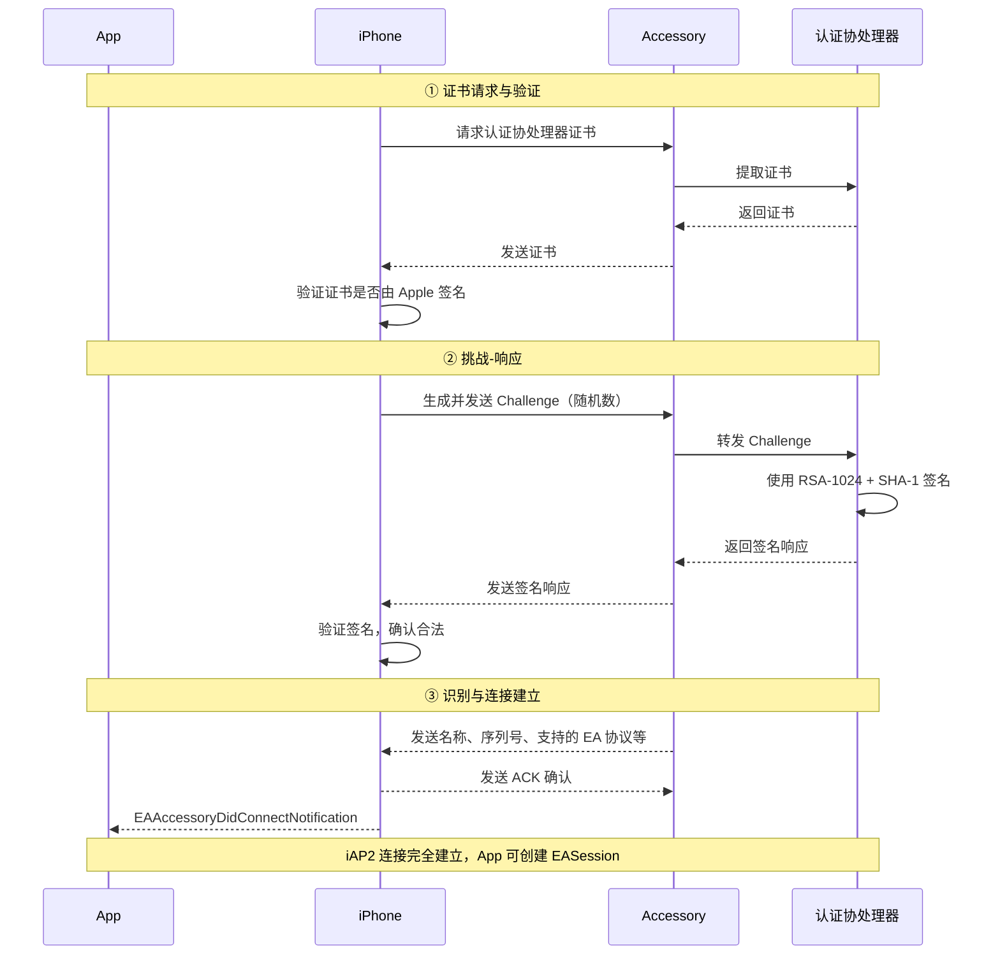

# ExternalAccessory

> **作者声明**：本文从苹果网络通信领域资深专家的视角，系统性地整合了 EA 框架的应用层开发规范与 iAP2 协议的底层通信原理，旨在为 MFi 外设开发者提供一份从物理层到应用层的完整知识图谱。

## 第一部分：iAP2 协议——EA 框架的基石

### 一、协议概述

**iAP2（iPod Accessory Protocol 2）** 是苹果 MFi 计划中专用于 iOS 设备与 MFi 认证配件进行通信的专属协议栈。它的设计哲学体现了苹果对生态的强控制力：

1. **硬件绑定**：所有 MFi 配件必须内嵌苹果独家供应的 **认证协处理器（Authentication Coprocessor）**。
2. **授权费机制**：苹果通过芯片独家供应，实现对每个售出配件的授权费收取。
3. **NDA 保护**：协议规范受 NDA 保护，细节不对外公开。

### 二、四大物理传输层（Transport）

iAP2 可运行在四种物理传输层之上，**Wi-Fi 不在其中**：

| 传输层                           | 核心特征             | 技术细节                                                                                                                  |
| :------------------------------- | :------------------- | :------------------------------------------------------------------------------------------------------------------------ |
| **经典蓝牙 (Bluetooth Classic)** | 无线场景首选         | 基于 **RFCOMM** 模拟 RS232 串口。使用 **SDP** 动态查找通道 ID，依赖两个固定 UUID 的服务。**不支持 BLE**。                 |
| **USB 从机模式 (Device Mode)**   | iPhone 作为 USB 设备 | iPhone 切换至 **Configuration 2**，暴露 **USB HID** 端点。数据通过 **HID Reports** 传输。                                 |
| **USB 主机模式 (Host Mode)**     | **官方推荐方案**     | 配件提供 **Bulk-in / Bulk-out** 端点。需执行 **USB 角色切换（Role Switch）**。EA 数据流可直接走 Bulk 端点，**速率最高**。 |
| **UART / 串口**                  | 简单低速配件         | 速率低（典型 57600bps），极少用于现代 App。                                                                               |

### 三、链路层（Link Layer）：类 TCP 的可靠传输

链路层的核心职责是**确保数据可靠传输并正确路由至上层的会话（Session）**：

- **参数协商**：连接建立后，双方协商会话 ID、重传超时、最大数据包大小。
- **滑动窗口协议**：类似 TCP，但 **seq/ack 基于消息数量而非字节数**。
- **多路复用**：将接收到的数据包路由到上层正确的会话中。

### 四、会话层（Session）：三大独立通道

iAP2 将上层服务划分为三个独立的会话类型：

| 会话类型                                 | 核心职责                          | 关键特征                                                                                                         |
| :--------------------------------------- | :-------------------------------- | :--------------------------------------------------------------------------------------------------------------- |
| **控制会话 (Control Session)**           | 认证、识别、系统信息访问          | 消息编码为 **16 位 TLV** 格式；承载 MFi 认证流程；可获取媒体库、电话状态等                                       |
| **文件传输会话 (File Transfer Session)** | 传输专辑封面等文件                | iPhone → 配件方向                                                                                                |
| **外部附件会话 (EA Session)**            | **第三方 App 与配件交换业务数据** | 配件在识别阶段上报 **协议字符串列表**；App 通过 `ExternalAccessory` 框架访问；**支持单链路多路复用多个 EA 连接** |

## 第二部分：EA 框架——开发者的官方门户

### 一、框架本质定位

`ExternalAccessory` 是 iOS 系统为 MFi 配件提供的**官方应用层通信框架**。它向上层开发者屏蔽了 iAP2 协议的复杂性，提供统一的 Objective-C/Swift API。

### 二、核心类与职责

| 核心类                   | 角色定位   | 核心职责                                                                                                                  |
| :----------------------- | :--------- | :------------------------------------------------------------------------------------------------------------------------ |
| **`EAAccessoryManager`** | 系统级管家 | 发现已连接配件（`connectedAccessories`），广播连接/断开通知                                                               |
| **`EAAccessory`**        | 配件代言人 | 代表物理配件，包含名称、制造商、`connectionID` 等属性                                                                     |
| **`EASession`**          | 通信管道   | 管理 App 与特定配件间的数据会话。**关键规则**：独占粒度 = 外设 + 单一协议字符串，同设备多协议字符串可并行建立多个 Session |

### 三、数据流模型：基于 NSStream 的字节流

App 通过 `EASession` 提供的 `NSInputStream` 和 `NSOutputStream` 进行数据传输：

- **`NSInputStream`（输入流）**：数据从**配件流向 App**，App 调用 `read:maxLength:` 读取。
- **`NSOutputStream`（输出流）**：数据从 **App 流向配件**，App 调用 `write:maxLength:` 发送。

**关键原则**：流的 Input/Output 命名是**相对于 App 的内存空间**而言的。EA 仅提供原始字节流，**无帧边界**，应用层必须自行处理粘包/半包。

### 四、应用隔离与声明机制

App 必须在 `Info.plist` 中声明 `UISupportedExternalAccessoryProtocols`，列出其支持的协议字符串。系统以此为“钥匙”，只允许 App 与声明了相同协议字符串的配件通信。

### 五、协议字符串的"三方绑定"机制

协议字符串必须在以下三个层面**严格对齐**，否则 EA 会话无法建立：

| 绑定层面     | 具体位置                                                     | 失败后果                                   |
| :----------- | :----------------------------------------------------------- | :----------------------------------------- |
| **固件端**   | 配件 iAP2 协议栈识别阶段（Identification Phase）硬编码       | 无法向 iOS 声明支持的协议                  |
| **App 端**   | `Info.plist` 的 `UISupportedExternalAccessoryProtocols` 数组 | `EASession` 初始化返回 `nil`，**静默失败** |
| **苹果后台** | MFi Portal 产品设计说明书（Product Plan）备案                | MFi 证书验签阶段被判定为非法设备           |

## 第三部分：MFi 认证流程——挑战-响应（Challenge-Response）

这是 MFi 生态的**核心安全机制**，确保只有合法配件才能与 iOS 设备通信：

**关键点**：认证协处理器内置的**私钥**与证书中的公钥匹配，且**只有该芯片知道私钥**。验证成功后，配件发送识别信息，iPhone 回复 ACK 后 iAP2 连接完全建立，此时 App 才会收到连接通知。

## 第四部分：EA 与蓝牙、Wi-Fi、Bonjour、CarPlay 的协同工作

### 一、与蓝牙的关系：物理承载

- **EA 为“魂”，蓝牙为“体”**：经典蓝牙的 **RFCOMM** 是承载 iAP2 协议的主要无线物理通道。App 通过 `EASession` 收发数据，完全无需关心底层是蓝牙还是 USB。
- **关键限制**：EA **不支持 BLE**，BLE 设备需使用 `CoreBluetooth`。

### 二、与 Wi-Fi 的关系：从控制到数据的“升级”

在无线 CarPlay 场景中：

1. **EA（iAP2）负责认证与协商**：通过蓝牙建立 iAP2 连接，完成 MFi 认证。
2. **iAP2 负责凭证交换**：认证通过后，通过 iAP2 安全地交换车机 Wi-Fi 热点的 SSID 和密码。
3. **Wi-Fi 负责高速传输**：iOS 连接车机 Wi-Fi 后，**音视频数据通过 AirPlay 传输**，控制指令可能继续通过 iAP2 over Wi-Fi 传输。

### 三、与 Bonjour 的关系：服务发现

Bonjour 是苹果的**零配置网络服务发现协议**（基于 mDNS/DNS-SD）。当 Wi-Fi 连接建立后，设备通过 Bonjour 在 IP 网络层面**互相发现对方提供的服务**。在无线 CarPlay 中，**EA/iAP2 是“入场券”（认证），Bonjour 是“门牌号”（服务定位）**。

### 四、与 CarPlay 的关系：基石与高楼

CarPlay 完全建立在 EA 框架和 iAP2 协议之上，**没有 EA 提供的认证和安全通道，CarPlay 无法工作**。

**无线 CarPlay 完整工作流**：

1. **蓝牙配对**：用户手动将 iPhone 与车机蓝牙配对。
2. **建立 EA 连接**：系统通过蓝牙 RFCOMM 通道建立 iAP2 连接。
3. **MFi 认证**：通过 iAP2 进行硬件级质询-响应认证。
4. **凭证交换**：认证通过后，通过 iAP2 交换车机 Wi-Fi 热点的 SSID 和密码。
5. **Wi-Fi 连接**：iPhone 连接到车机的 Wi-Fi AP。
6. **Bonjour 发现**：在 Wi-Fi 网络上通过 Bonjour 发现 CarPlay 服务。
7. **CarPlay 会话启动**：启动投屏会话，**音视频流通过 Wi-Fi 的 AirPlay 传输**，控制指令可能继续通过 iAP2 over Wi-Fi 传输。
8. **蓝牙断开**：会话建立后，蓝牙连接通常自动断开以节省功耗。

**关键结论**：Wi-Fi 不是 iAP2 的标准物理传输层。无线 CarPlay 中，Wi-Fi 承载的是 **AirPlay 会话**，而 iAP2 控制信令在认证完成后通过 **AirPlay 隧道（tunnelled through AirPlay）** 传输。

## 第五部分：工程落地核心规范

> **前置铁律**：本框架**仅**适用于 MFi 认证硬件。普通 BLE 设备请使用 `CoreBluetooth`，两者底层协议栈完全不同，严禁混用。

### 一、项目配置层

| 操作         | 规范要求                                                                                                     |
| :----------- | :----------------------------------------------------------------------------------------------------------- |
| **协议声明** | `Info.plist` 中 `UISupportedExternalAccessoryProtocols` 使用反向域名格式，**大小写严格一致**，定义为全局常量 |
| **权限文案** | 蓝牙 MFi 场景必须配置 `NSBluetoothAlwaysUsageDescription`                                                    |
| **后台模式** | 需后台通信时，开启 `Background Modes` → `External accessory communication`                                   |
| **弱依赖**   | `ExternalAccessory.framework` 设置为 `Optional`，防止非 MFi 设备上启动崩溃                                   |
| **模拟器**   | iOS 模拟器**完全不支持 EA**，所有通信逻辑必须在真机验证                                                      |

**致命坑**：协议字符串漏配/错配时，`EASession` 初始化返回 `nil` 且**系统无任何错误日志**。

### 二、生命周期管理

- **单例模式**：全局单一 `EADeviceManager` 持有所有 Session，**严禁** ViewController 独立创建。
- **通知驱动**：监听 `EAAccessoryDidConnectNotification` / `EAAccessoryDidDisconnectNotification`，废弃 `EAAccessoryDelegate`。
- **设备指纹**：使用 `connectionID` 作为唯一索引，禁止以 `name` 为 Key。
- **多路隔离**：按业务维度拆分多个协议字符串（如 `control`、`log`、`bulk`），同设备多协议可并行建立多个 Session。

### 三、线程模型与 RunLoop（最高优先级红线）

> 生产环境中 90% 的 Watchdog 超时崩溃与 Stream 挂载主线程 RunLoop 直接相关。

| 规范              | 说明                                                                                        |
| :---------------- | :------------------------------------------------------------------------------------------ |
| **禁止主线程 IO** | **绝对禁止**将 `NSStream` 挂载至主线程 RunLoop                                              |
| **专用 IO 线程**  | 封装常驻 `NSThread`，在 `main` 中捕获 `NSRunLoop.current`，添加 `NSPort` 保活               |
| **任务投递**      | 所有 `schedule`/`remove`/`read`/`write` 必须通过 `performSelector:onThread:` 投递至 IO 线程 |
| **回调归约**      | `NSStreamDelegate` 回调在 IO 线程执行；UI 刷新强制切主线程                                  |

**致命坑**：子线程 RunLoop 未添加 `NSPort` 导致早夭，流回调消失；跨线程直接操作 Stream 引发 `EXC_BAD_ACCESS`。

### 四、数据流收发规范

| 规范         | 说明                                                                 |
| :----------- | :------------------------------------------------------------------- |
| **粘包处理** | 接收端必须实现缓冲区（`NSMutableData`），基于**长度域**处理粘包/半包 |
| **MTU 限制** | 蓝牙 MFi 单包**严禁超过 672 字节**；有线 USB 建议 ≤ 1024 字节        |
| **背压控制** | 利用 `hasSpaceAvailable` 检测发送缓冲区，配合发送队列做流量控制      |
| **缓冲区**   | 建议设置 1024~2048 字节的临时 Buffer                                 |
| **错误监听** | 必须监听 `NSStreamEventErrorOccurred`，异常后停止读写                |

**致命坑**：忽略 MTU 限制发送超大包导致链路断开；不做缓存直接解码导致 CRC 失败。

### 五、多 App 抢占机制

> **机制原理**：系统守护进程 `accessoryd` 仲裁。**同一外设 + 同一协议字符串**，全局**仅允许一个 App 持有 Session**。

**抢占信号**：App A 占用协议 P，App B 创建同一协议 Session 成功后，App A 的流被隐式关闭，收到 `EAAccessoryDidDisconnectNotification`。

| 规范           | 说明                                                                                                     |
| :------------- | :------------------------------------------------------------------------------------------------------- |
| **差异化判定** | 收到断开通知时，检查本地剩余有效 Session：仍有其他协议 Session = **协议被抢占**；全部销毁 = **物理拔出** |
| **交互反馈**   | 抢占场景弹窗提示“该设备通道已被其他应用占用，请关闭后重试”                                               |
| **冷却机制**   | 断连后设置 **3 秒冷却期**，禁止无限极速重连                                                              |

### 六、资源释放标准顺序（防止内核句柄泄漏）

**顺序不可颠倒**，否则内核句柄泄漏严重时**必须重启手机**才能重新识别外设：

1. 清空发送队列，拒绝新数据写入
2. 在 IO 线程中执行 `removeFromRunLoop:`
3. 执行 `[session closeStreams]`
4. 将 `session` 置为 `nil`，释放流对象
5. 从 Manager 映射表中移除 Handler
6. App 销毁时注销通知，终止 IO 线程

### 七、后台保活

- 开启后台外设通信模式，配套**心跳机制**（300~500ms 周期）。
- 闲置 **5 分钟** 无数据主动释放会话，避免系统强杀。
- App 从后台唤醒后主动检查会话状态，断连后启动**退避重连**（1s, 2s, 4s... 上限 30s）。

### 八、调试手段

| 手段            | 说明                                                                                                     |
| :-------------- | :------------------------------------------------------------------------------------------------------- |
| **日志规范**    | 强制输出十六进制原始日志（`NSData` 转 HEX），标记时间戳与流向（Rx/Tx）                                   |
| **Sysdiagnose** | 抓取系统诊断日志，检索 `accessoryd`，关注 `MFi auth failed`（认证失败）、`session revoked`（会话被回收） |
| **双 App 测试** | 安装两个 App 复现外设抢占场景                                                                            |
| **硬件抓包**    | 在 iAP2 链路上抓取物理层数据，与 App 日志比对                                                            |

## 总结：知识全景图

| 层级           | 技术组件                        | 核心职责                                       |
| :------------- | :------------------------------ | :--------------------------------------------- |
| **物理传输层** | 蓝牙 RFCOMM、USB HID/Bulk、UART | 提供物理数据管道。**Wi-Fi 非 iAP2 标准传输层** |
| **链路层**     | iAP2 Link Layer                 | 可靠传输、滑动窗口（基于消息计数）、多路复用   |
| **会话层**     | 控制会话、文件传输会话、EA 会话 | 认证识别、文件同步、App 业务数据               |
| **应用框架层** | `ExternalAccessory.framework`   | 统一 API、`EASession`/`NSStream`、应用隔离     |
| **高层应用**   | CarPlay                         | iAP2 引导认证 + AirPlay 数据传输               |

**最终心法**：

> **EA/iAP2 是“战略指挥中心”**，负责安全认证与所有控制信令；**蓝牙和 USB 是“战术运输线”**，负责物理传输；**Bonjour 是“侦察兵”**，在 IP 网络中发现服务；**Wi-Fi 和 AirPlay 是“主力部队”**，承担大数据投屏任务。四者协同，方能构建完整的 MFi 外设通信生态。