# CoreNFC 全面解析

## 一、CoreNFC 简介

CoreNFC 是苹果在 iOS 11 中引入的框架，允许应用程序与 iPhone 的 NFC（近场通信）芯片进行交互。通过 CoreNFC，应用可以读取和写入包含 NFC 数据交换格式（NDEF）数据的类型 1 到 5 的 NFC 标签。

**核心能力演进：**
- **iOS 11**：首次引入，支持 NDEF 标签读取
- **iOS 12**：支持后台标签扫描
- **iOS 13**：新增 NDEF 标签写入和原生标签协议访问（ISO 7816、ISO 15693、FeliCa、MIFARE）
- **iOS 14+**：支持从 iPhone 创建 NFC 标签

**支持的设备**：iPhone 7 及更新机型（iPhone 6/6 Plus 虽支持 Apple Pay 但不支持 CoreNFC）。CoreNFC 不支持在 App Extension 中使用。


## 二、架构图

```
┌─────────────────────────────────────────────────────────────────────┐
│                         应用层 (App Layer)                          │
│  ┌─────────────┐  ┌─────────────┐  ┌─────────────────────────┐   │
│  │  ViewController │  │  Business  │  │  NFCReaderViewController│   │
│  │  (UI)        │  │  Logic      │  │  (Delegate 实现)        │   │
│  └─────────────┘  └─────────────┘  └─────────────────────────┘   │
└─────────────────────────────────────────────────────────────────────┘
                                    │
                                    ▼
┌─────────────────────────────────────────────────────────────────────┐
│                       CoreNFC 框架层                                │
│  ┌─────────────────────────────────────────────────────────────┐   │
│  │                    NFCReaderSession (抽象基类)              │   │
│  └─────────────────────────────────────────────────────────────┘   │
│         ┌──────────────┐  ┌──────────────┐  ┌──────────────────┐  │
│         │NFCNDEFReader │  │NFCTagReader  │  │NFCPaymentTag     │  │
│         │Session       │  │Session       │  │ReaderSession     │  │
│         │(NDEF读写)    │  │(原生协议)    │  │(支付标签)        │  │
│         └──────────────┘  └──────────────┘  └──────────────────┘  │
│  ┌─────────────────────────────────────────────────────────────┐   │
│  │                     NFC Tag 接口层                          │   │
│  │  NFCTag  │ NFCNDEFTag │ NFCISO7816Tag │ NFCFeliCaTag       │   │
│  │  NFCISO15693Tag │ NFCMiFareTag                            │   │
│  └─────────────────────────────────────────────────────────────┘   │
└─────────────────────────────────────────────────────────────────────┘
                                    │
                                    ▼
┌─────────────────────────────────────────────────────────────────────┐
│                        系统底层 (iOS Kernel)                        │
│  ┌─────────────────────────────────────────────────────────────┐   │
│  │                    NFC 驱动 / NCI 协议栈                    │   │
│  └─────────────────────────────────────────────────────────────┘   │
│  ┌──────────────────────────┐  ┌──────────────────────────────┐   │
│  │     NFC 控制器 (NFCC)     │  │      Secure Element (SE)     │   │
│  │  - RF 轮询与通信          │  │  - 安全密钥存储              │   │
│  │  - 协议解析              │  │  - 卡模拟 (Card Emulation)    │   │
│  │  - 路由配置              │  │  - 交易认证                  │   │
│  └──────────────────────────┘  └──────────────────────────────┘   │
└─────────────────────────────────────────────────────────────────────┘
                                    │
                                    ▼
                          ┌───────────────────┐
                          │   NFC 天线 (硬件)  │
                          └───────────────────┘
                                    │
                                    ▼
                          ┌───────────────────┐
                          │   NFC 标签 / 读卡器 │
                          └───────────────────┘
```


## 三、底层原理

### 3.1 NFC 通信基础

近场通信（NFC）是一种短距离高频无线通信技术，通信距离限制在几厘米内。NFC 是多种传输标准与协议的组合，标签从 Type 1 到 Type 5 对应不同标准，例如 Type 3 基于 FeliCa 标准，Type 4 基于 ISO-14443。

NFC Forum 制定了 **NDEF（NFC Data Exchange Format）** 作为通用的信息交换格式，为不同数据类型进行标准化传输。

### 3.2 CoreNFC 工作模式

CoreNFC 主要工作在 **Reader/Writer 模式**（读写器模式）：

1. **主动轮询**：应用创建 `NFCReaderSession` 后，系统 NFC 控制器开始 RF 轮询，检测附近的 NFC 标签。
2. **标签发现**：当检测到兼容的 NFC 标签时，系统通过委托回调通知应用。
3. **数据交互**：应用通过标签接口进行数据读写操作。
4. **会话管理**：每个阅读器会话最长 60 秒。

### 3.3 后台标签扫描原理

从 iPhone XS/XR 开始支持后台标签读取。当 NFC 标签的 NDEF 消息包含通用链接（Universal Link）时，用户可以在屏幕亮起的状态下扫描标签，系统会自动拉起对应的 App。后台标签扫描要求标签为 NDEF 格式且为只读。

### 3.4 Secure Element（安全元件）交互

Secure Element（SE）是独立的安全硬件芯片，用于存储敏感信息（如主账号 PAN、Token、加密密钥等）并执行安全交易。在 iOS 中，NFC & SE Platform 整合了 Secure Element、Secure Enclave 和 Apple 服务器，为 NFC 交易提供安全保障。

**SE 与 CoreNFC 的协作关系**：

```
┌─────────────────────────────────────────────────────────────────┐
│                     CoreNFC (应用层读写)                        │
│         读取标签数据、写入NDEF、与标签协议交互                    │
└─────────────────────────────────────────────────────────────────┘
                              │
                              ▼
┌─────────────────────────────────────────────────────────────────┐
│                    NFC 控制器 (NFCC)                           │
│              RF 通信、协议转换、路由分发                         │
└─────────────────────────────────────────────────────────────────┘
                    │                       │
                    ▼                       ▼
          ┌─────────────────┐   ┌─────────────────────────────┐
          │  NFC 标签/读卡器 │   │    Secure Element (SE)       │
          │  (外部设备)     │   │  - Apple Pay 交易            │
          │                 │   │  - 数字车钥匙存储             │
          │                 │   │  - 门禁卡模拟                │
          │                 │   │  - 卡模拟 (Card Emulation)   │
          └─────────────────┘   └─────────────────────────────┘
```

Secure Element 的典型工作流程：
1. 应用通过 CoreNFC 与外部 NFC 读卡器通信
2. 需要安全认证时，NFCC 将请求路由到 SE
3. SE 独立执行认证/交易，不涉及应用层
4. 交易完成后，应用可查询 SE 获取交易状态

### 3.5 会话限制

- 应用必须**前台运行且界面可见**才能启动 NFC 会话，转入后台会话自动终止
- 单次会话**最长 60 秒**
- 支持读取单个标签（完成后自动终止）或多个标签（持续活动直到用户终止或超时）


## 四、应用场景

### 4.1 典型应用场景

| 场景                | 说明                             | 技术要求       |
| ------------------- | -------------------------------- | -------------- |
| **产品信息查询**    | 扫描商品标签获取详情、价格、评价 | NDEF 读取      |
| **博物馆导览**      | 扫描展品标签获取图文介绍         | NDEF 读取      |
| **智能家居配网**    | 碰一碰智能设备完成配网           | NDEF 读写      |
| **活动签到**        | 扫描入场券完成签到               | NDEF 读取      |
| **交通卡/门禁卡**   | 读取公交卡、门禁卡信息           | 原生协议访问   |
| **数字车钥匙**      | iPhone 解锁、启动车辆            | NFC + UWB + SE |
| **智能海报**        | 扫描海报获取优惠券、活动链接     | NDEF 读取      |
| **停车缴费/充电桩** | 扫描设备完成支付                 | NDEF 读取      |

### 4.2 数字车钥匙（CarKey）详细流程

数字车钥匙是 CoreNFC 的重要应用场景，从 iOS 14 开始支持。

```
┌─────────────────────────────────────────────────────────────────────┐
│                    数字车钥匙完整交互流程                           │
└─────────────────────────────────────────────────────────────────────┘

【阶段一：车主配对 (Owner Pairing)】
┌──────────┐    ┌──────────┐    ┌──────────┐    ┌──────────┐
│ 车主App   │───▶│ 车厂云端  │───▶│  车辆    │───▶│  iPhone  │
│ (发起申请)│    │ (验证身份)│    │ (验证配对)│    │ (钱包存储)│
└──────────┘    └──────────┘    └──────────┘    └──────────┘
                                                       │
                                                       ▼
                                              ┌──────────────┐
                                              │ Secure       │
                                              │ Element      │
                                              │ (存储密钥)   │
                                              └──────────────┘

【阶段二：日常使用 - 解锁/启动】
┌──────────┐    NFC感应    ┌──────────┐    ┌──────────┐    ┌──────────┐
│  iPhone  │◀────────────▶│  车辆    │───▶│ Secure   │───▶│ 解锁/启动 │
│ (钱包)   │    (几厘米内) │  NFC读卡器│    │ Element  │    │  车辆    │
└──────────┘              └──────────┘    └──────────┘    └──────────┘
      │
      ▼
┌─────────────────────────────────────────────────────────────────────┐
│ 技术细节：                                                         │
│ 1. iPhone 靠近车辆 NFC 感应区（通常位于门把手或中控台）    │
│ 2. 车辆 NFC 读取 iPhone 中的数字钥匙信息                   │
│ 3. 车辆验证数字钥匙的真实性                               │
│ 4. 若验证通过，完成认证，执行解锁/启动                     │
│ 5. 密钥安全存储在 iPhone 的 Secure Element 中       │
└─────────────────────────────────────────────────────────────────────┘
```

**数字车钥匙的技术特点**：
- 密钥安全存储在 Secure Element 中
- 支持 NFC 和 UWB 双安全通信技术
- 即使 iPhone 电量低，仍可使用（备用电源模式）
- 可通过 iCloud 在多个设备间同步
- 支持分享给家庭成员


## 五、详细交互流程图

### 5.1 NDEF 标签读取完整流程

```
┌─────────────────────────────────────────────────────────────────────┐
│                    NDEF 标签读取交互流程图                          │
└─────────────────────────────────────────────────────────────────────┘

  用户           App (ViewController)      CoreNFC框架       系统底层(NFCC)      NFC标签
   │                    │                      │                  │                │
   │  ①点击扫描按钮     │                      │                  │                │
   │───────────────────▶│                      │                  │                │
   │                    │  ②创建Session        │                  │                │
   │                    │  NFCNDEFReaderSession│                  │                │
   │                    │─────────────────────▶│                  │                │
   │                    │                      │  ③begin()        │                │
   │                    │                      │─────────────────▶│                │
   │                    │                      │                  │  ④RF轮询      │
   │                    │                      │                  │───────────────▶│
   │                    │                      │                  │                │
   │  ⑤系统UI弹窗       │                      │                  │  ⑥检测到标签   │
   │  "请将iPhone靠近   │                      │                  │◀───────────────│
   │   NFC标签"         │                      │                  │                │
   │◀───────────────────│                      │                  │                │
   │                    │                      │  ⑦didDetect     │                │
   │                    │                      │  (NDEFs)        │                │
   │                    │  ⑧委托回调           │                  │                │
   │                    │◀─────────────────────│                  │                │
   │                    │  ⑨解析NDEF数据       │                  │                │
   │                    │  (URL/Text/MIME)     │                  │                │
   │                    │                      │                  │                │
   │  ⑩展示扫描结果     │  ⑪invalidate()      │                  │                │
   │◀───────────────────│─────────────────────▶│                  │                │
   │                    │                      │  ⑫终止会话       │                │
   │                    │                      │─────────────────▶│                │
   │                    │                      │                  │  ⑬停止轮询    │
   │                    │                      │                  │───────────────▶│
   │                    │                      │                  │                │
```

### 5.2 原生标签协议访问流程（NFCTagReaderSession）

```
┌─────────────────────────────────────────────────────────────────────┐
│              原生标签协议访问 (ISO 7816/15693) 流程                 │
└─────────────────────────────────────────────────────────────────────┘

  用户           App                    CoreNFC框架        系统底层        智能卡/标签
   │              │                         │                │              │
   │  ①扫描智能卡 │                         │                │              │
   │─────────────▶│                         │                │              │
   │              │  ②创建NFCTagReaderSession│                │              │
   │              │  (pollingOption)        │                │              │
   │              │────────────────────────▶│                │              │
   │              │                         │  ③begin()     │              │
   │              │                         │───────────────▶│              │
   │              │                         │                │  ④轮询      │
   │              │                         │                │─────────────▶│
   │              │                         │  ⑤didDetectTags│              │
   │              │◀────────────────────────│                │              │
   │              │  ⑥connect(to:)         │                │              │
   │              │────────────────────────▶│                │              │
   │              │                         │  ⑦连接标签     │              │
   │              │                         │───────────────▶│              │
   │              │                         │                │  ⑧交换数据  │
   │              │                         │                │◀────────────▶│
   │              │  ⑨sendAPDU/readBlock   │                │              │
   │              │────────────────────────▶│                │              │
   │              │                         │  ⑩APDU命令    │              │
   │              │                         │───────────────▶│              │
   │              │                         │                │  ⑪响应      │
   │              │                         │◀───────────────│              │
   │              │  ⑫响应数据             │                │              │
   │              │◀────────────────────────│                │              │
   │  ⑬展示结果   │                         │                │              │
   │◀─────────────│                         │                │              │
   │              │  ⑭invalidate()          │                │              │
   │              │────────────────────────▶│                │              │
```

### 5.3 Secure Element 参与的安全交易流程

```
┌─────────────────────────────────────────────────────────────────────┐
│              Secure Element 参与的安全交易流程（如Apple Pay）       │
└─────────────────────────────────────────────────────────────────────┘

  App              CoreNFC            NFC控制器(NFCC)      Secure Element(SE)      POS终端
   │                  │                     │                    │                   │
   │  ①发起支付      │                     │                    │                   │
   │─────────────────▶│                     │                    │                   │
   │                  │  ②begin()           │                    │                   │
   │                  │────────────────────▶│                    │                   │
   │                  │                     │  ③RF轮询          │                   │
   │                  │                     │───────────────────────────────────────▶│
   │                  │                     │  ④检测到POS       │                   │
   │                  │                     │◀───────────────────────────────────────│
   │                  │  ⑤检测到读卡器     │                    │                   │
   │                  │◀────────────────────│                    │                   │
   │                  │  ⑥路由到SE         │                    │                   │
   │                  │────────────────────▶│                    │                   │
   │                  │                     │  ⑦转发交易请求    │                   │
   │                  │                     │───────────────────▶│                   │
   │                  │                     │                    │  ⑧SE独立处理交易  │
   │                  │                     │                    │  (加密/认证)      │
   │                  │                     │  ⑨交易结果        │                   │
   │                  │                     │◀───────────────────│                   │
   │                  │  ⑩交易完成通知     │                    │                   │
   │                  │◀────────────────────│                    │                   │
   │  ⑪查询交易状态   │                     │                    │                   │
   │─────────────────▶│                     │                    │                   │
   │                  │  ⑫查询SE状态       │                    │                   │
   │                  │─────────────────────────────────────────▶│                   │
   │                  │  ⑬返回结果         │                    │                   │
   │                  │◀─────────────────────────────────────────│                   │
   │  ⑭更新UI        │                     │                    │                   │
   │◀─────────────────│                     │                    │                   │
```


## 六、类图 (Mermaid)

```mermaid
classDiagram
    %% 核心会话类
    class NFCReaderSession {
        <<abstract>>
        +alertMessage: String?
        +begin()
        +invalidate()
        +restartPolling()
    }
    
    class NFCNDEFReaderSession {
        +init(delegate:queue:invalidateAfterFirstRead:)
        +readingAvailable: Bool
    }
    
    class NFCTagReaderSession {
        +init(pollingOption:delegate:queue:)
        +connect(to:completionHandler:)
    }
    
    class NFCPaymentTagReaderSession {
        +init(delegate:queue:)
    }
    
    class NFCVASReaderSession {
        +init(delegate:queue:)
    }
    
    %% 委托协议
    class NFCNDEFReaderSessionDelegate {
        <<protocol>>
        +readerSession(_:didDetectNDEFs:)
        +readerSession(_:didInvalidateWithError:)
        +readerSessionDidBecomeActive(_:)
    }
    
    class NFCTagReaderSessionDelegate {
        <<protocol>>
        +tagReaderSession(_:didDetectTags:)
        +tagReaderSession(_:didInvalidateWithError:)
        +tagReaderSessionDidBecomeActive(_:)
    }
    
    %% NFC标签接口
    class NFCTag {
        <<protocol>>
        +identifier: Data
        +type: NFCTagType
    }
    
    class NFCNDEFTag {
        <<protocol>>
        +readNDEF(completionHandler:)
        +writeNDEF(:completionHandler:)
        +queryNDEFStatus(completionHandler:)
    }
    
    class NFCISO7816Tag {
        <<protocol>>
        +sendCommand(apdu:completionHandler:)
        +historicalBytes: Data?
        +initialSelectedAID: Data?
        +identifier: Data
    }
    
    class NFCISO15693Tag {
        <<protocol>>
        +readMultipleBlocks(:completionHandler:)
        +writeMultipleBlocks(:completionHandler:)
        +lockBlock(:completionHandler:)
        +customCommand(:completionHandler:)
    }
    
    class NFCFeliCaTag {
        <<protocol>>
        +polling(:completionHandler:)
        +send(:completionHandler:)
    }
    
    class NFCMiFareTag {
        <<protocol>>
        +sendMiFareCommand(:completionHandler:)
    }
    
    %% NDEF数据类
    class NFCNDEFMessage {
        +records: [NFCNDEFPayload]
        +length: Int
    }
    
    class NFCNDEFPayload {
        +typeNameFormat: NFCTypeNameFormat
        +type: Data
        +identifier: Data
        +payload: Data
    }
    
    %% 继承关系
    NFCReaderSession <|-- NFCNDEFReaderSession
    NFCReaderSession <|-- NFCTagReaderSession
    NFCReaderSession <|-- NFCPaymentTagReaderSession
    NFCReaderSession <|-- NFCVASReaderSession
    
    %% 关联关系
    NFCNDEFReaderSession --> NFCNDEFReaderSessionDelegate
    NFCTagReaderSession --> NFCTagReaderSessionDelegate
    
    NFCTag <|.. NFCNDEFTag
    NFCTag <|.. NFCISO7816Tag
    NFCTag <|.. NFCISO15693Tag
    NFCTag <|.. NFCFeliCaTag
    NFCTag <|.. NFCMiFareTag
    
    NFCNDEFMessage --> NFCNDEFPayload
```



**类图说明**：

| 类/协议                        | 说明                            |
| ------------------------------ | ------------------------------- |
| `NFCReaderSession`             | 抽象基类，表示 NFC 阅读器会话   |
| `NFCNDEFReaderSession`         | NDEF 标签读写会话               |
| `NFCTagReaderSession`          | 原生协议标签访问会话（iOS 13+） |
| `NFCNDEFReaderSessionDelegate` | NDEF 会话委托回调               |
| `NFCTagReaderSessionDelegate`  | 原生标签会话委托回调            |
| `NFCTag`                       | NFC/RFID 标签属性集合           |
| `NFCNDEFMessage`               | NDEF 消息，由记录数组组成       |
| `NFCNDEFPayload`               | NDEF 消息中的有效载荷记录       |


## 七、关键实现代码

### 7.1 项目配置

**Step 1: Info.plist 配置**

```xml
<!-- 添加 NFC 使用描述 -->
<key>NFCReaderUsageDescription</key>
<string>此功能需要访问NFC以读取标签信息</string>

<!-- 声明设备需要 NFC 能力 -->
<key>UIRequiredDeviceCapabilities</key>
<array>
    <string>nfc</string>
</array>
```

**Step 2: Entitlements 配置**

```xml
<!-- .entitlements 文件 -->
<key>com.apple.developer.nfc.readersession.formats</key>
<array>
    <string>NDEF</string>
    <!-- 如需支持特定格式，可添加 -->
    <!-- <string>ISO7816</string> -->
    <!-- <string>ISO15693</string> -->
    <!-- <string>FeliCa</string> -->
    <!-- <string>MIFARE</string> -->
</array>
```

**Step 3: Xcode Capabilities**
在 Xcode 的 Signing & Capabilities 中开启 **Near Field Communication Tag Reading** 能力。

### 7.2 NDEF 标签读取（基础场景）

```swift
import UIKit
import CoreNFC

class NFCReaderViewController: UIViewController, NFCNDEFReaderSessionDelegate {
    
    private var nfcSession: NFCNDEFReaderSession?
    
    override func viewDidLoad() {
        super.viewDidLoad()
    }
    
    @IBAction func startScanning(_ sender: UIButton) {
        // 1. 检查设备是否支持 NFC 读取
        guard NFCNDEFReaderSession.readingAvailable else {
            showAlert("设备不支持 NFC 读取")
            return
        }
        
        // 2. 创建会话
        nfcSession = NFCNDEFReaderSession(
            delegate: self,
            queue: DispatchQueue.main,
            invalidateAfterFirstRead: true  // 读取一个标签后自动终止
        )
        
        // 3. 设置提示信息（显示在系统 UI 上）
        nfcSession?.alertMessage = "请将 iPhone 靠近 NFC 标签"
        
        // 4. 开始会话
        nfcSession?.begin()
    }
    
    // MARK: - NFCNDEFReaderSessionDelegate
    
    // 检测到 NDEF 标签
    func readerSession(_ session: NFCNDEFReaderSession, didDetectNDEFs messages: [NFCNDEFMessage]) {
        guard let message = messages.first else {
            print("未检测到 NDEF 消息")
            return
        }
        
        for record in message.records {
            // 解析不同类型的数据
            switch record.typeNameFormat {
            case .nfcWellKnown:
                if let type = String(data: record.type, encoding: .utf8) {
                    if type == "U" {  // URI
                        let payload = record.payload
                        // URI 记录的第一个字节是 URI 前缀标识符
                        let uriString = decodeURI(payload: payload)
                        print("URI: \(uriString)")
                    } else if type == "T" {  // Text
                        let text = String(data: record.payload, encoding: .utf8)
                        print("Text: \(text ?? "")")
                    }
                }
            case .absoluteURI:
                let uri = String(data: record.payload, encoding: .utf8)
                print("Absolute URI: \(uri ?? "")")
            case .mime:
                print("MIME Data: \(record.payload)")
            default:
                print("Other format: \(record.typeNameFormat)")
            }
        }
        
        DispatchQueue.main.async {
            self.showAlert("扫描成功！")
        }
    }
    
    // 会话失效（完成或出错）
    func readerSession(_ session: NFCNDEFReaderSession, didInvalidateWithError error: Error) {
        print("NFC 会话失效: \(error.localizedDescription)")
        
        // 用户取消扫描不算错误，无需特殊处理
        if let readerError = error as? NFCReaderError {
            if readerError.code == .readerSessionInvalidationErrorUserCanceled {
                return
            }
        }
        
        DispatchQueue.main.async {
            self.showAlert("扫描失败: \(error.localizedDescription)")
        }
    }
    
    // 会话激活
    func readerSessionDidBecomeActive(_ session: NFCNDEFReaderSession) {
        print("NFC 会话已激活")
    }
    
    // MARK: - Helper Methods
    
    private func decodeURI(payload: Data) -> String {
        // URI 前缀表
        let prefixes = [
            "", "http://www.", "https://www.", "http://", "https://", "tel:", 
            "mailto:", "ftp://anonymous:anonymous@", "ftp://ftp.", "ftps://", 
            "sftp://", "smb://", "nfs://", "ftp://", "dav://", "news:", 
            "telnet://", "imap:", "rtsp://", "urn:", "pop:", "sip:", "sips:", 
            "tftp:", "btspp://", "btl2cap://", "btgoep://", "tcpobex://", 
            "irdaobex://", "file://", "urn:epc:id:", "urn:epc:tag:", 
            "urn:epc:pat:", "urn:epc:raw:", "urn:epc:", "urn:nfc:"
        ]
        
        guard payload.count > 0 else { return "" }
        let prefixIndex = Int(payload[0])
        let prefix = prefixIndex < prefixes.count ? prefixes[prefixIndex] : ""
        let remaining = payload.dropFirst()
        return prefix + String(data: remaining, encoding: .utf8)!
    }
    
    private func showAlert(_ message: String) {
        let alert = UIAlertController(title: "NFC", message: message, preferredStyle: .alert)
        alert.addAction(UIAlertAction(title: "确定", style: .default))
        present(alert, animated: true)
    }
}
```

### 7.3 NDEF 标签写入（iOS 13+）

```swift
import CoreNFC

class NFCWriterViewController: UIViewController, NFCNDEFReaderSessionDelegate {
    
    private var nfcSession: NFCNDEFReaderSession?
    private var dataToWrite: NFCNDEFMessage?
    
    func writeTag(message: NFCNDEFMessage) {
        guard NFCNDEFReaderSession.readingAvailable else {
            print("设备不支持 NFC")
            return
        }
        
        self.dataToWrite = message
        nfcSession = NFCNDEFReaderSession(
            delegate: self,
            queue: DispatchQueue.main,
            invalidateAfterFirstRead: false  // 保持会话用于写入
        )
        nfcSession?.alertMessage = "请将 iPhone 靠近要写入的标签"
        nfcSession?.begin()
    }
    
    // iOS 13+ 新版委托方法
    func readerSession(_ session: NFCNDEFReaderSession, didDetect tags: [NFCNDEFTag]) {
        guard let tag = tags.first else { return }
        
        // 连接到标签
        session.connect(to: tag) { [weak self] error in
            if let error = error {
                session.invalidate(errorMessage: "连接失败: \(error.localizedDescription)")
                return
            }
            
            // 查询标签状态
            tag.queryNDEFStatus { status, capacity, error in
                if let error = error {
                    session.invalidate(errorMessage: "查询状态失败: \(error.localizedDescription)")
                    return
                }
                
                guard status == .readWrite else {
                    session.invalidate(errorMessage: "标签不可写入")
                    return
                }
                
                guard let message = self?.dataToWrite else {
                    session.invalidate(errorMessage: "没有可写入的数据")
                    return
                }
                
                // 写入 NDEF 消息
                tag.writeNDEF(message) { error in
                    if let error = error {
                        session.invalidate(errorMessage: "写入失败: \(error.localizedDescription)")
                    } else {
                        session.alertMessage = "写入成功！"
                        session.invalidate()
                    }
                }
            }
        }
    }
    
    // 兼容旧版 NDEF 检测方法（iOS 11-12）
    func readerSession(_ session: NFCNDEFReaderSession, didDetectNDEFs messages: [NFCNDEFMessage]) {
        // 仅用于兼容，实际写入使用 didDetect tags
    }
    
    func readerSession(_ session: NFCNDEFReaderSession, didInvalidateWithError error: Error) {
        print("会话失效: \(error.localizedDescription)")
    }
    
    // 创建 NDEF 消息（例如：写入 URL）
    func createURLMessage(url: String) -> NFCNDEFMessage? {
        guard let urlData = url.data(using: .utf8) else { return nil }
        
        // URI 记录：类型 "U"，payload 包含 URI 前缀标识符 + URL
        let prefixByte: UInt8 = 0x01  // "http://www."
        var payload = Data([prefixByte])
        payload.append(urlData)
        
        let record = NFCNDEFPayload(
            format: .nfcWellKnown,
            type: "U".data(using: .utf8)!,
            identifier: Data(),
            payload: payload
        )
        
        return NFCNDEFMessage(records: [record])
    }
}
```

### 7.4 原生标签协议访问（NFCTagReaderSession）

```swift
import CoreNFC

class NativeTagReaderViewController: UIViewController, NFCTagReaderSessionDelegate {
    
    private var tagSession: NFCTagReaderSession?
    
    @IBAction func startScanning(_ sender: UIButton) {
        // 检查设备支持
        guard NFCTagReaderSession.readingAvailable else {
            print("设备不支持")
            return
        }
        
        // 创建会话，指定轮询选项（可组合）
        tagSession = NFCTagReaderSession(
            pollingOption: [.iso14443, .iso15693],  // 轮询 ISO 14443 和 ISO 15693 标签
            delegate: self,
            queue: DispatchQueue.main
        )
        
        tagSession?.alertMessage = "请将 iPhone 靠近 NFC 标签"
        tagSession?.begin()
    }
    
    // MARK: - NFCTagReaderSessionDelegate
    
    func tagReaderSession(_ session: NFCTagReaderSession, didDetect tags: [NFCTag]) {
        guard let tag = tags.first else {
            session.invalidate(errorMessage: "未检测到标签")
            return
        }
        
        // 连接标签
        session.connect(to: tag) { [weak self] error in
            if let error = error {
                session.invalidate(errorMessage: "连接失败: \(error.localizedDescription)")
                return
            }
            
            // 根据标签类型处理
            switch tag {
            case let .iso7816(tag):
                self?.handleISO7816Tag(session: session, tag: tag)
            case let .iso15693(tag):
                self?.handleISO15693Tag(session: session, tag: tag)
            case let .feliCa(tag):
                self?.handleFeliCaTag(session: session, tag: tag)
            case let .miFare(tag):
                self?.handleMiFareTag(session: session, tag: tag)
            @unknown default:
                session.invalidate(errorMessage: "不支持的标签类型")
            }
        }
    }
    
    // 处理 ISO 7816 标签（智能卡）
    func handleISO7816Tag(session: NFCTagReaderSession, tag: NFCISO7816Tag) {
        // 发送 APDU 命令
        let apdu = NFCISO7816APDU(
            instructionClass: 0x00,
            instructionCode: 0xA4,  // SELECT
            p1Parameter: 0x04,
            p2Parameter: 0x00,
            data: Data([0x00]),  // 选择应用
            expectedResponseLength: 256
        )
        
        tag.sendCommand(apdu: apdu) { responseData, sw1, sw2, error in
            if let error = error {
                session.invalidate(errorMessage: "APDU 错误: \(error.localizedDescription)")
                return
            }
            
            print("SW1: \(String(format: "%02X", sw1)), SW2: \(String(format: "%02X", sw2))")
            print("Response: \(responseData.map { String(format: "%02X", $0) }.joined())")
            
            session.alertMessage = "读取成功！"
            session.invalidate()
        }
    }
    
    // 处理 ISO 15693 标签
    func handleISO15693Tag(session: NFCTagReaderSession, tag: NFCISO15693Tag) {
        // 读取多个块
        tag.readMultipleBlocks(
            requestFlags: .highDataRate,
            blockNumber: 0,
            numberOfBlocks: 1
        ) { dataBlocks, error in
            if let error = error {
                session.invalidate(errorMessage: "读取失败: \(error.localizedDescription)")
                return
            }
            
            print("Data: \(dataBlocks?.map { $0.map { String(format: "%02X", $0) }.joined() } ?? [])")
            session.alertMessage = "读取成功！"
            session.invalidate()
        }
    }
    
    // 处理 FeliCa 标签
    func handleFeliCaTag(session: NFCTagReaderSession, tag: NFCFeliCaTag) {
        // FeliCa 轮询
        tag.polling(
            systemCode: 0xFFFF,
            requestCode: .noRequest,
            timeSlot: .max1
        ) { systemCode, idm, pmm, error in
            if let error = error {
                session.invalidate(errorMessage: "轮询失败: \(error.localizedDescription)")
                return
            }
            print("IDm: \(idm.map { String(format: "%02X", $0) }.joined())")
            session.alertMessage = "读取成功！"
            session.invalidate()
        }
    }
    
    // 处理 MIFARE 标签
    func handleMiFareTag(session: NFCTagReaderSession, tag: NFCMiFareTag) {
        // 发送 MIFARE 命令
        let command = Data([0x30, 0x00])  // READ 命令
        tag.sendMiFareCommand(command: command) { response, error in
            if let error = error {
                session.invalidate(errorMessage: "命令失败: \(error.localizedDescription)")
                return
            }
            print("Response: \(response.map { String(format: "%02X", $0) }.joined())")
            session.alertMessage = "读取成功！"
            session.invalidate()
        }
    }
    
    func tagReaderSession(_ session: NFCTagReaderSession, didInvalidateWithError error: Error) {
        print("会话失效: \(error.localizedDescription)")
    }
    
    func tagReaderSessionDidBecomeActive(_ session: NFCTagReaderSession) {
        print("会话已激活")
    }
}
```


## 八、注意事项

### 8.1 权限与配置

| 配置项                         | 说明                                                   |
| ------------------------------ | ------------------------------------------------------ |
| `NFCReaderUsageDescription`    | Info.plist 必须添加，否则 App 无法使用 NFC             |
| `UIRequiredDeviceCapabilities` | 添加 `nfc` 键，确保 App 只在支持 NFC 的设备上安装      |
| Entitlements                   | 需配置 `com.apple.developer.nfc.readersession.formats` |
| Provisioning Profile           | 需包含 NFC Tag Reading 能力                            |

### 8.2 设备与系统限制

- **仅 iPhone 支持**：CoreNFC 功能仅在 iPhone 上可用（iPad 不支持）
- **最低系统版本**：iOS 11.0+（写入和原生协议需要 iOS 13.0+）
- **不支持 App Extension**
- **使用前检查**：调用 `NFCNDEFReaderSession.readingAvailable` 检查设备支持

### 8.3 会话限制

- **前台运行**：App 必须在前台且界面可见才能启动 NFC 会话
- **60秒超时**：每次会话最长 60 秒，超时自动失效
- **后台终止**：App 进入后台时会话自动终止
- **单例限制**：同一时间只能有一个 NFC 会话处于活动状态

### 8.4 常见错误与解决

| 错误                           | 原因                          | 解决方案                          |
| ------------------------------ | ----------------------------- | --------------------------------- |
| `Missing required entitlement` | Entitlements 配置缺失或不完整 | 检查 `.entitlements` 文件配置     |
| 读取不到标签                   | 轮询选项不匹配                | 检查 `pollingOption` 是否正确     |
| 写入失败                       | 标签为只读或空间不足          | 先查询 `queryNDEFStatus` 检查状态 |
| 设备不支持                     | 使用不支持的设备              | 检查 `readingAvailable`           |

### 8.5 安全与隐私

- 必须向用户明确说明 NFC 使用目的（`NFCReaderUsageDescription`）
- 敏感数据（支付、车钥匙等）存储在 Secure Element 中
- 应用不能直接访问 Secure Element 中的敏感数据
- 后台标签扫描仅支持包含 Universal Link 的 NDEF 标签

### 8.6 最佳实践

1. **始终检查 `readingAvailable`**：在启动会话前确认设备支持
2. **正确处理用户取消**：`readerSessionInvalidationErrorUserCanceled` 不应视为错误
3. **合理设置 `invalidateAfterFirstRead`**：单次扫描设为 `true`，连续扫描设为 `false`
4. **使用有意义的 `alertMessage`**：提升用户体验
5. **及时释放会话**：使用后调用 `invalidate()` 释放系统资源
6. **做好 NDEF 数据解析**：根据 `typeNameFormat` 和 `type` 正确处理不同类型数据