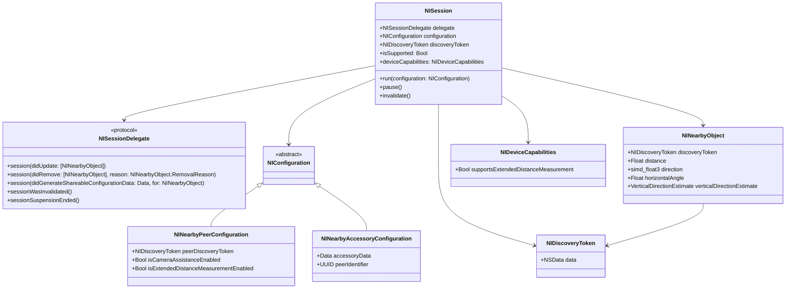

# Nearby Interaction 框架深度解析

## 一、简介

Nearby Interaction 是 Apple 在 iOS 14 中引入的空间感知框架，旨在让搭载 U1 超宽带（Ultra-Wideband, UWB）芯片的 Apple 设备能够感知彼此的距离和相对方向。该框架支持 iOS 14.0+、iPadOS 14.0+、Mac Catalyst 14.0+、macOS 11.0+ 以及 watchOS 8.0+。

### 1.1 核心能力

Nearby Interaction 为应用提供两种主要输出：

- **距离（Distance）** ：设备之间的物理距离，以米为单位
- **相对方向（Relative Direction）** ：从一个设备指向另一个设备的方向向量

这些更新是**双向的**——会话双方同时获知彼此的相对位置。

### 1.2 支持设备

- iPhone 11 及后续机型（搭载 U1 芯片）
- Apple Watch（搭载 UWB 芯片，watchOS 8+）
- 第三方 UWB 配件（通过 Nearby Interaction Accessory Protocol）

**平台差异**：iOS 支持距离和方向，watchOS 仅支持距离。


## 二、底层原理

### 2.1 UWB 超宽带技术

U1 芯片是 Apple 设计的超宽带技术芯片，使用 UWB 通信实现空间感知和精确的短程位置跟踪。UWB 技术能够以**仅几厘米的误差**超高精度获取设备坐标。

**测距原理**：
- UWB 通过**飞行时间（Time of Flight, ToF）** 或**到达时间差（Time Difference of Arrival, TDoA）** 实现高分辨率空间感知
- 不同 UWB 天线具有不同取向（例如两个在一个方向、第三个在另一个方向），使得能够获取距离和角度信息
- 通过**三角测量**确定相对于用户设备到其他目标设备的方向

### 2.2 硬件与软件协同

Nearby Interaction 利用 U1 芯片的高频能力在物理环境中共享设备位置，实现流畅的交互会话。具体来说：

1. **UWB 射频层**：设备间通过 UWB 信号交换测距和测向数据
2. **系统服务层**（NearbyD）：初始化 U1 芯片并将 UWB MAC 地址加入白名单
3. **框架层**（NearbyInteraction.framework）：封装底层硬件能力，提供会话管理 API
4. **应用层**：开发者通过 NISession 和 NISessionDelegate 接收位置更新

### 2.3 ARKit 增强模式

从 iOS 16 开始，Nearby Interaction 可以与 ARKit 深度集成：
- 利用 ARKit 计算的设备轨迹增强 Nearby Interaction
- 采用与 AirTag 的“精确查找”相同的底层技术
- 距离和方向信息比单独使用 Nearby Interaction 更稳定可用，有效拓宽 UWB 视场


## 三、架构设计

### 3.1 核心类（Mermaid 类图）



### 3.2 核心类说明

| 类/协议                            | 说明                                                                                                            |
| ---------------------------------- | --------------------------------------------------------------------------------------------------------------- |
| **NISession**                      | 整个框架的核心，所有会话的生成都需要先实例化 NISession 对象。每个 NISession 对象仅能和一个配对设备发起 UWB 会话 |
| **NISessionDelegate**              | 会话回调协议，接收位置更新、移除通知和配置数据生成事件                                                          |
| **NIConfiguration**                | 配置对象的抽象基类，不能直接实例化                                                                              |
| **NINearbyPeerConfiguration**      | 两个 Apple 设备之间的会话配置                                                                                   |
| **NINearbyAccessoryConfiguration** | 与第三方 UWB 配件的会话配置                                                                                     |
| **NINearbyObject**                 | 包含附近设备的距离、方向等位置信息                                                                              |
| **NIDiscoveryToken**               | 设备的发现令牌，用于隐私保护的设备发现                                                                          |

### 3.3 会话与多设备支持

每个设备可以同时运行**多个会话**，每个会话与一个对端设备交互。如果需要与多个设备发起会话，需要为每个配对设备分别实例化一个 NISession 对象。


## 四、应用场景

### 4.1 多用户 AR 体验

多用户 AR 应用中，可以将虚拟物体放置在参与者的手中，实现共享的增强现实体验。

### 4.2 打车/拼车应用

实时利用对端用户的方向，识别司机和乘客的相对位置。

### 4.3 多人游戏

用户用自己的设备作为控制器，控制对端设备屏幕上的游戏元素（如球拍）。

### 4.4 数字车钥匙

UWB 技术是实现数字车钥匙无感交互的关键：
- 手机靠近车辆时自动解锁
- 入座后自然启动车辆
- 定位精度可达 **10 厘米以内**
- 支持主动迎宾、无感解闭锁、钥匙分享、遥控泊车等功能

### 4.5 智能配件交互

通过 Nearby Interaction Accessory Protocol，第三方配件可与 Apple 设备进行精确的空间交互：
- 智能家居：走进房间自动开灯
- 博物馆导览：引导用户找到展品
- 物品查找：类似 AirTag 的精确查找功能

### 4.6 后台交互（iOS 16+）

使用蓝牙配对的 UWB 配件可以创建后台交互：
- 应用在后台时仍可进行 UWB 测距
- 需通过 Bluetooth LE 配对和连接
- 配合 Live Activity 可实时显示后台测距数据


## 五、详细交互流程图

### 5.1 Apple 设备间交互流程（含系统底层）

```
┌─────────┐                                    ┌─────────┐
│ 设备 A   │                                    │ 设备 B   │
│ (App)    │                                    │ (App)    │
└────┬────┘                                    └────┬────┘
     │                                              │
     │ 1. 创建 NISession                             │
     │ 2. 获取 discoveryToken                        │
     └──────────────────┬───────────────────────────┘
                        │
                        │ 3. 通过 MultipeerConnectivity /
                        │    CoreBluetooth / 自定义服务器
                        │    交换 discoveryToken
                        │
     ┌──────────────────┴───────────────────────────┐
     │                                              │
     ▼                                              ▼
┌─────────┐                                    ┌─────────┐
│ 设备 A   │                                    │ 设备 B   │
└────┬────┘                                    └────┬────┘
     │                                              │
     │ 4. 用户授权弹窗                               │ 4. 用户授权弹窗
     │    (系统权限检查)                             │    (系统权限检查)
     │                                              │
     │ 5. 创建 NINearbyPeerConfiguration            │ 5. 创建 NINearbyPeerConfiguration
     │    (设置 peerDiscoveryToken)                  │    (设置 peerDiscoveryToken)
     │                                              │
     │ 6. session.run(configuration)                │ 6. session.run(configuration)
     │                                              │
     └──────────────────┬───────────────────────────┘
                        │
                        │ 7. 系统层：NearbyD 初始化 U1 芯片
                        │    白名单 UWB MAC 地址
                        │
                        │ 8. UWB 硬件层：双向测距与测向
                        │    - 飞行时间 (ToF) 测量距离
                        │    - 到达角 (AoA) 测量方向
                        │
                        │ 9. 连续流式更新 (每秒多次)
                        │
     ┌──────────────────┴───────────────────────────┐
     │                                              │
     ▼                                              ▼
┌─────────┐                                    ┌─────────┐
│ 设备 A   │◄─── distance & direction ─────────│ 设备 B   │
│         │──────── distance & direction ────►│         │
└─────────┘                                    └─────────┘
     │                                              │
     │ 10. delegate.session(didUpdate:)              │ 10. delegate.session(didUpdate:)
     │     接收 NINearbyObject 更新                   │     接收 NINearbyObject 更新
     │                                              │
     │ 11. 更新 UI / 游戏逻辑 / AR 内容              │ 11. 更新 UI / 游戏逻辑 / AR 内容
     │                                              │
     │ 12. session.invalidate() 结束会话             │ 12. session.invalidate() 结束会话
```

### 5.2 与第三方配件交互流程（含车云）

```
┌─────────┐         ┌─────────┐         ┌─────────┐         ┌─────────┐
│ iPhone   │         │ 配件     │         │ 云端     │         │ 车辆     │
│ (App)    │         │ (UWB)   │         │ 服务器   │         │ (车端)   │
└────┬────┘         └────┬────┘         └────┬────┘         └────┬────┘
     │                   │                   │                   │
     │ 1. 扫描并建立     │                   │                   │
     │    BLE 连接       │                   │                   │
     │──────────────────►│                   │                   │
     │                   │                   │                   │
     │ 2. 请求配件配置   │                   │                   │
     │    数据           │                   │                   │
     │◄──────────────────│                   │                   │
     │                   │                   │                   │
     │ 3. 创建 NINearby  │                   │                   │
     │    Accessory      │                   │                   │
     │    Configuration  │                   │                   │
     │                   │                   │                   │
     │ 4. session.run()  │                   │                   │
     │                   │                   │                   │
     │ 5. 系统生成可共享 │                   │                   │
     │    配置数据       │                   │                   │
     │    (didGenerate   │                   │                   │
     │     Shareable     │                   │                   │
     │     Configuration │                   │                   │
     │     Data)│                   │                   │
     │                   │                   │                   │
     │ 6. 通过 BLE 发送  │                   │                   │
     │    配置数据       │                   │                   │
     │──────────────────►│                   │                   │
     │                   │                   │                   │
     │                   │ 7. UWB 测距开始   │                   │
     │                   │    (双向)         │                   │
     │◄─────────────────►│                   │                   │
     │                   │                   │                   │
     │ 8. 连续位置更新   │                   │                   │
     │    (distance,     │                   │                   │
     │     direction)    │                   │                   │
     │                   │                   │                   │
     │ 9. 位置数据上报   │                   │                   │
     │    至云端         │                   │                   │
     │───────────────────────────────────────►│                   │
     │                   │                   │                   │
     │                   │                   │ 10. 验证数字钥匙  │
     │                   │                   │     权限          │
     │                   │                   │──────────────────►│
     │                   │                   │                   │
     │                   │                   │ 11. 下发解锁指令  │
     │                   │                   │◄──────────────────│
     │                   │                   │                   │
     │ 12. 推送通知      │                   │                   │
     │     车辆已解锁    │                   │                   │
     │◄───────────────────────────────────────│                   │
     │                   │                   │                   │
```

**车云交互关键点**：
- 数字钥匙系统由**车端数字锁芯**和**数字钥匙**组成
- 支持无钥匙进入和启动、远程控制、车辆共享等功能
- 需满足安全要求：钥匙授权、撤销、到期自动失效


## 六、关键实现代码

### 6.1 基础设置与权限

**Info.plist 配置**：
```xml
<key>NSNearbyInteractionAllowOnceUsageDescription</key>
<string>App needs Nearby Interaction to locate nearby devices</string>
```

**添加 Capability**：
在 Xcode 的 Signing & Capabilities 中添加 **Nearby Interaction** capability。

### 6.2 设备间交互完整示例

```swift
import NearbyInteraction
import MultipeerConnectivity

class InteractionManager: NSObject {
    private var session: NISession?
    private let peerID: MCPeerID
    private let multipeerSession: MCSession?
    
    override init() {
        self.session = NISession()
        super.init()
        self.session?.delegate = self
    }
    
    // 1. 获取本机发现令牌
    func getDiscoveryToken() -> NIDiscoveryToken? {
        return session?.discoveryToken
    }
    
    // 2. 接收到对端令牌后启动会话
    func startSession(with peerToken: NIDiscoveryToken) {
        guard let session = session else { return }
        
        // 检查设备是否支持
        guard NISession.isSupported else {
            print("设备不支持 Nearby Interaction")
            return
        }
        
        // 创建配置
        let config = NINearbyPeerConfiguration(peerToken: peerToken)
        
        // 可选：启用 ARKit 辅助（iOS 16+）
        if #available(iOS 16.0, *) {
            config.isCameraAssistanceEnabled = true
        }
        
        // 可选：启用扩展距离测量（第二代 UWB 芯片）
        if #available(iOS 17.0, watchOS 10.0, *) {
            if NISession.deviceCapabilities.supportsExtendedDistanceMeasurement {
                config.isExtendedDistanceMeasurementEnabled = true
            }
        }
        
        session.run(config)
    }
    
    // 暂停会话
    func pauseSession() {
        session?.pause()
    }
    
    // 结束会话
    func invalidateSession() {
        session?.invalidate()
        session = nil
    }
}

// MARK: - NISessionDelegate
extension InteractionManager: NISessionDelegate {
    // 位置更新
    func session(_ session: NISession, didUpdate nearbyObjects: [NINearbyObject]) {
        for object in nearbyObjects {
            if let distance = object.distance {
                print("距离: \(distance) 米")
            }
            if let direction = object.direction {
                print("方向向量: \(direction)")
            }
            // iOS 16+ 水平角度
            if #available(iOS 16.0, *) {
                let horizontalAngle = object.horizontalAngle
                print("水平角度: \(horizontalAngle) 弧度")
            }
        }
    }
    
    // 对象移除
    func session(_ session: NISession, didRemove nearbyObjects: [NINearbyObject], 
                 reason: NINearbyObject.RemovalReason) {
        print("设备已移除: \(reason)")
    }
    
    // 会话失效
    func sessionWasInvalidated(_ session: NISession) {
        print("会话已失效")
        // 清理资源，可能需要重新创建会话
    }
    
    // 会话暂停结束
    func sessionSuspensionEnded(_ session: NISession) {
        print("会话恢复")
        // 重新运行会话
    }
}
```

### 6.3 与第三方配件交互

```swift
class AccessoryInteractionManager: NSObject {
    private var session: NISession?
    
    override init() {
        self.session = NISession()
        super.init()
        self.session?.delegate = self
    }
    
    // 接收到配件配置数据后启动
    func startSession(with accessoryData: Data, peerIdentifier: UUID) {
        guard let session = session else { return }
        
        let config = NINearbyAccessoryConfiguration(
            data: accessoryData,
            peerIdentifier: peerIdentifier
        )
        
        session.run(config)
    }
}

extension AccessoryInteractionManager: NISessionDelegate {
    // 生成可共享配置数据（发送给配件）
    func session(_ session: NISession, 
                 didGenerateShareableConfigurationData configData: Data,
                 for object: NINearbyObject) {
        // 通过 BLE 将 configData 发送给配件
        sendToAccessory(configData)
    }
}
```

### 6.4 发现令牌交换（使用 Multipeer Connectivity）

```swift
// 编码发现令牌发送
func sendDiscoveryToken(to peer: MCPeerID) {
    guard let token = session?.discoveryToken else { return }
    do {
        let encodedData = try NSKeyedArchiver.archivedData(
            withRootObject: token,
            requiringSecureCoding: true
        )
        try multipeerSession?.send(encodedData, toPeers: [peer], with: .reliable)
    } catch {
        print("发送令牌失败: \(error)")
    }
}

// 接收并解码对端令牌
func receiveDiscoveryToken(from data: Data) -> NIDiscoveryToken? {
    do {
        let token = try NSKeyedUnarchiver.unarchivedObject(
            ofClass: NIDiscoveryToken.self,
            from: data
        )
        return token
    } catch {
        print("解码令牌失败: \(error)")
        return nil
    }
}
```


## 七、注意事项与限制

### 7.1 权限与隐私

- 首次运行应用时，系统会向**双方用户**展示权限弹窗
- 权限是**一次性**的，应用退出后失效
- 用户可在“设置”中启用/禁用 Nearby Interaction
- 精确位置关闭时，CoreLocation 的位置更新精度会降至约 3km

### 7.2 设备兼容性

- 使用前需调用 `NISession.isSupported` 检查设备是否支持
- 不同 iOS 版本和 UWB 芯片代次功能不同：
  - 第一代 UWB 芯片：基础距离和方向
  - 第二代 UWB 芯片：支持扩展距离测量（EDM）
- 使用 EDM 前需检查 `NISession.deviceCapabilities.supportsExtendedDistanceMeasurement`

### 7.3 会话生命周期

- 每个 NISession 对象**只能与一个对端设备**交互
- 与多个设备交互需要**多个 NISession 实例**
- 一个设备同时只能有一个活跃会话
- 应用进入后台后，只能与 **BLE 配对并连接**的设备进行 UWB 测距

### 7.4 数据限制

- 距离或方向超出范围时返回 `nil`
- 设备不在视线范围内时，方向信息为 `nil`
- 扩展距离会话数量有限制

### 7.5 开发注意事项

1. **Info.plist 必须包含** `NSNearbyInteractionAllowOnceUsageDescription`
2. **必须添加** Nearby Interaction capability
3. 发现令牌的交换方式完全由开发者决定（Multipeer Connectivity、CoreBluetooth、自定义服务器等）
4. ARKit 增强模式仅适用于**静止设备**的交互
5. Nearby Interaction 与 Find My 是**独立框架**，Find My 需要加入 MFi Program
6. 会话失效后需要重新创建 NISession 实例

### 7.6 错误码参考

| 错误码                                        | 说明                              |
| --------------------------------------------- | --------------------------------- |
| `userDidNotAllow`                             | 用户拒绝了位置共享请求            |
| `unsupportedPlatform`                         | 设备平台不支持 Nearby Interaction |
| `activeExtendedDistanceSessionsLimitExceeded` | 扩展距离会话数量超限              |
| `invalidConfiguration`                        | 配置无效                          |
| `peerNotCompatible`                           | 对端设备不兼容                    |