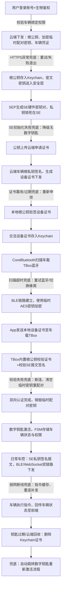

# 数字钥匙创建+BLE配对完整全流程（含异常兜底）
## 一、文字版完整流程（可直接放简历项目描述）
### 阶段1：车主账号鉴权 & 云端信任材料下发
1. 用户登录My App完成账号/生物鉴权，后端校验车辆绑定权限；
2. 云端下发材料：车辆VIN、车辆根公钥凭证、加密后的配对临时AES密钥(分别下发两处App,TBox)、车辆基础凭证；
3. 兜底：HTTPS请求超时/证书篡改 → 重试3次，失败终止流程并上报埋点；
4. 数据处理：密文密钥送入安全层解密，车辆根公钥存入Keychain，全程敏感密钥不长期驻留App内存。

### 阶段2：本地Secure Enclave生成硬件密钥对
1. 调用Security框架，指定`kSecAttrTokenIDSecureEnclave`在SEP生成ECC硬件密钥对；
2. 硬件私钥永久隔离在SE不可导出，仅对外输出公钥；
3. App携带本机公钥上传车企云端申请设备证书；
4. 兜底：SE创建密钥失败（设备不支持SE/无锁屏密码）→ 降级提示，不支持数字钥匙功能。

### 阶段3：云端签发设备证书回写本地
1. 云端使用车辆根私钥对手机公钥签名，生成**设备证书**（包含公钥、钥匙权限、有效期、厂商签名）；
2. HTTPS下发签好名的设备证书；
3. 手机读取本地「车辆根公钥」校验设备证书签名，非法证书直接丢弃；
4. 合法证书存入Keychain，配置`kSecAttrAccessibleWhenUnlockedThisDeviceOnly`硬件绑定；
5. 兜底：证书过期/验签失败 → 重新发起公钥注册，重新申领证书。

### 阶段4：BLE车载配对初始化（双向设备认证）
1. App使用CoreBluetooth扫描TBox车载蓝牙外设；
2. 扫描失败兜底：弱网循环重试、超时提示、切换蜂窝网络重试；
3. 建立BLE链路，携带加密临时配对密钥做初次链路加密；
4. App从Keychain读取**设备证书**发送至车载TBox；
5. 车载校验逻辑：
   - TBox内置车企根公钥校验设备证书真伪；
   - 提取证书内手机SE公钥，校验SE私钥签名的配对报文；
6. 校验通过，双向认证完成，销毁临时配对密钥；
7. 兜底：签名校验失败/证书不匹配 → 断开蓝牙，清除本地临时密钥，重启配对流程。

### 阶段5：数字钥匙激活 & 日常车控长效通信
1. 本地FSM状态机缓存车辆连接信息、钥匙权限、防重放计数器；
2. 日常远程控车区分双链路：近场BLE、远距离WebSocket蜂窝网络；
3. 所有控车报文由SE硬件私钥签名，附加Anti-Replay计数器、HMAC防篡改；
4. 兜底：断线、隧道弱网自动缓存指令，恢复连接批量补发；签名失败阻断控车操作并弹窗提示。

### 阶段6：钥匙共享、过期、回收销毁
1. 钥匙分享：本地SE签名分享请求，云端生成短期临时证书下发；
2. 过期/云端撤回指令：调用Security API清除Keychain对应证书与密钥缓存；
3. 兜底：证书失效自动跳转重新激活数字钥匙流程。

---

# 二、极简层级流程图（文本Mermaid格式，Word/Markdown均可渲染）

## 流程图关键分层说明
1. 信任层：车辆根公钥（手机本地Keychain）、车辆根私钥（云端/TBox固化）
2. 硬件安全层：SEP Secure Enclave、硬件不可导出私钥
3. 凭证存储区分：
   - Keychain：车辆根公钥、设备证书、车辆业务凭证
   - SE隔离区：本机硬件ECC私钥（永不对外输出）
4. 两套证书分工：
   - 车辆根公钥：手机本地校验设备证书合法性
   - 设备证书：蓝牙发送给车辆，车载校验手机设备身份
5. 兜底覆盖：网络请求、SE硬件异常、证书非法过期、蓝牙扫描失败、签名校验失败、弱网断线、钥匙过期全场景异常处理。