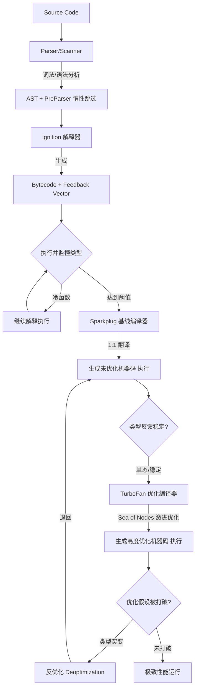

# 深入 JavaScript 引擎：从 Token 流到机器码的极致博弈

> 站在 V8 源码之上，理解每一行 JavaScript 背后的“编译哲学”

作为前端工程师，我们每天与 JavaScript 打交道，但鲜少有人真正关注它如何在底层运行。很多人误以为 JS 引擎只是个“黑盒解释器”，但现代引擎（尤其是 V8）早已演变为一个融合了**编译器、操作系统调度器、性能分析器与并发垃圾回收器**的超级复杂系统。

理解这个“虚拟战场”，你写出的每一行代码才会有真正的“穿透力”。本文将带你从宏观架构到底层实现，彻底解剖 JavaScript 引擎。

---

## 一、先厘清“铁三角”：ECMAScript、JavaScript 与引擎

在深入原理前，必须理清这三个核心概念，这是很多中级开发者都搞混的基石：

1.  **ECMAScript（规范）**：由 ECMA-262 定义的“蓝皮书”抽象文档。它规定了语法、类型、内置对象（如 `Array.prototype.map`）的行为逻辑，但**不关心如何实现**。
2.  **JavaScript（语言）**：ECMAScript 的“方言”实现，包含了宿主环境（浏览器）提供的额外对象（如 `DOM`、`BOM`）。
3.  **JavaScript 引擎（实现者）**：用低级语言（C++/Rust）编写的**二进制程序**。它的核心使命是：**读取源码 → 遵循 ECMAScript 规范定义的算法 → 转化为机器能执行的指令**。

**协同工作流**：引擎内置了遵循 ECMA-262 标准的解析器。当规范更新（如 ES6 引入 `Promise`），引擎就在 C++ 层面新增对应的 `Promise` 构造函数和微任务队列调度逻辑，从而让 JS 代码能调用新 API。

---

## 二、性能战争史：引擎的演进脉络

-   **原始时代（SpiderMonkey, 1995）**：纯解释器。逐行翻译执行，效率极低，但启动快。
-   **JIT 革命（V8, 2008）**：Google 引入 **JIT (即时编译)**。不再逐行解释，而是将热函数直接编译为机器码，JS 速度提升数十倍，催生了 Node.js。
-   **分层编译期（Crankshaft）**：引入优化编译器 + 反优化机制，但存在内存占用高、编译粒度粗糙的问题。
-   **现代化架构（Ignition + TurboFan, 2017）**：彻底重构，引入**字节码解释器** + **顶级优化编译器**，大幅降低移动端内存瓶颈。
-   **极速补强（Sparkplug + Maglev）**：近年来引入基线编译器（Sparkplug）和中层优化器（Maglev），在解释和重编译间取平衡，进一步压缩启动延迟。

---

## 三、宏观架构：现代引擎的“三层楼”

以 V8 为例，引擎内部物理结构分为三层，各司其职：

1.  **前端（Parser/Scanner）**：词法分析生成 Token 流，语法分析生成 AST（抽象语法树）。
2.  **中间层（Interpreter + Baseline Compiler）**：Ignition 将 AST 生成平台无关的字节码并执行；Sparkplug 快速将字节码编译为未优化的机器码以提速。
3.  **后端（Optimizing Compiler + GC）**：TurboFan 基于运行时的类型反馈进行激进优化（内联、循环展开）；Orinoco 负责并行、并发、增量式垃圾回收。

---

## 四、前端解码：Parser/Scanner 的“吝啬”哲学

很多人认为“不就是生成 AST 吗”，但在 V8 中，这层是一场关于**启动速度与内存占用**的顶级博弈。

### 1. 词法分析：从字符串到 Token
扫描器（`scanner.cc`）将源码（UTF-16）转化为 Token 流：

-   **双缓存扫描**：维护 `c0_`（当前）和 `c1_`（前瞻）指针，用**查表法**快速判断字符类型，而非低效的 `if-else`。
-   **关键字识别**：使用**完美哈希（Perfect Hash）**算法。遇到标识符，计算哈希值直接映射表判断是否为 `function`、`const` 等关键字，O(1) 时间复杂度。
-   **模板字符串状态机**：处理 `${}` 嵌套时，扫描器在“模板文本”和“表达式”模式间压栈切换，保证上下文正确。

### 2. 语法分析：构建 AST 的艺术
Parser 采用**手写递归下降**（非 Yacc 生成器），以精准控制错误恢复。

-   **优先级爬升（Pratt Parser）**：对于 `a + b * c`，一次遍历即生成正确优先级的树，无需后续 AST 重写。
-   **悬空 else 处理**：强制规则将 `else` 绑定给最近的 `if`，消除文法歧义。

### 3. 灵魂优化：惰性解析（Lazy Parsing）
这是引擎启动加速的核心。**如果全量解析所有函数体，大型应用启动时间将直接翻倍。**

-   **预解析器（PreParser）**：当遇到 `function foo() {}` 声明时，引擎**默认跳过函数体**，只检查语法正确性并记录函数位置，**不生成 AST 节点**。内存消耗仅为全量解析的 1/5。
-   **全量解析（Full Parser）**：只有当函数被**首次调用**时，才触发重解析，生成完整 AST 交给解释器。这就是“编译懒惰，执行时才暴露成本”的经典模式。

---

## 五、中间层：Ignition + Sparkplug 的“黄金搭档”

这是现代 V8 性能飞升的“承重墙”。Ignition 负责收集情报，Sparkplug 负责快速变现。

### 1. Ignition：不只是慢速解释器
Ignition（`bytecode-generator.cc`）将 AST 转化为**基于累加器的字节码**。

-   **累加器设计**：如 `a + b` 编译为 `LdaSmi [1]; Star r0; LdaSmi [2]; Add r0; Return`。这种设计让字节码更紧凑，贴近真实 CPU 架构。
-   **反馈向量（Feedback Vector）注入**：这是 Ignition 为 TurboFan 埋下的“伏笔”。执行时，引擎会记录操作数的**隐藏类（Map）** 和**类型直方图**（如 `add` 总是整数）。这些情报存储在 `FeedbackVector` 中，随字节码传递。

### 2. Sparkplug：“极速抄袭者”
在 Ignition 和 TurboFan 之间，Sparkplug 插入作为基线编译器。

-   **绝不构建 IR**：它逐条遍历字节码，直接为每个字节码生成对应的 x64/ARM 汇编模板。
-   **硬编码寄存器映射**：复用 Ignition 的栈帧布局，直接将虚拟寄存器映射到物理寄存器。
-   **效果**：编译速度比 TurboFan 快 **10~20 倍**，执行速度比纯解释快 **3~5 倍**。它牺牲了代码质量，换取了极快的编译启动。

---

## 六、后端（上）：TurboFan 的“激进投机主义”

TurboFan 是 V8 的性能巅峰，它基于 Sea of Nodes（节点海）进行全局优化。

### 1. 核心输入与乐观假设
TurboFan 吞入 Ignition 的字节码和反馈向量，做出**乐观假设**：*“未来类型一定和过去一样！”* 随后进行针对性编译。

### 2. 杀手锏优化技术
-   **内联展开（Inlining）**：如果调用点总是调用同一函数，TurboFan 直接将被调函数体复制到调用处，消除 Call/Ret 指令开销。
-   **逃逸分析 + 标量替换**：如果 `new Point(1,2)` 创建的对象不逃逸出函数，TurboFan **不在堆上分配内存**，直接拆解为栈上的 `x` 和 `y` 变量，极大减轻 GC 压力。
-   **循环展开与去虚拟化**：将短循环摊平，并直接将 `obj.toString()` 替换为 `Array.prototype.toString` 的硬编码地址，跳过原型链查找。

### 3. 达摩克利斯之剑：反优化（Deoptimization）
既然是“投机”，就有失败时。当传入类型突变（如 `add` 突然传入字符串），TurboFan 生成的机器码中的**检查点**触发，引擎会**重建栈帧**，退回 Sparkplug 或 Ignition 执行。**反优化是重量级操作，可能耗时毫秒级**，这就是为什么类型稳定是性能的基石。

---

## 七、后端（下）：Orinoco 的“平滑内存管理”

在 TurboFan 拼命分配对象时，Orinoco 必须确保 GC 不卡顿。其核心哲学是：**把 Stop-The-World 的时间压到极限，甚至消灭它。**

### 1. 分代策略
-   **新生代（Young Gen）**：存放临时对象。采用 **Scavenge 复制算法**，多线程并行，极快（毫秒级）。
-   **老生代（Old Gen）**：存活对象。采用 **Mark-Compact（标记紧缩）**。

### 2. Orinoco 的三大利器
-   **并行（Parallel）**：主线程暂停时，多工作线程协同标记根节点，压缩暂停时间。
-   **并发（Concurrent）**：**黑科技所在**。主线程正常运行 JS 时，后台线程进行标记。通过**三色标记法 + 写屏障（Write Barrier）**，确保 JS 修改对象引用时，能同步通知 GC 线程更新状态。
-   **增量（Incremental）**：将一次大 GC 切成无数小任务片段，利用浏览器帧间空闲时间（Idle Time）执行，让用户完全无感知。

---

## 八、全景工作流：一张图看懂执行全链路



---

## 九、基于源码的工程化视角（关键 C++ 入口）

读懂引擎不需要看全部代码，抓住核心路径即可：

-   **解析入口**：`src/parsing/parser.cc` 中的 `Parser::ParseProgram`，递归构建 AST。
-   **字节码生成**：`src/interpreter/interpreter.cc` 中的 `Interpreter::CompileBytecode`，遍历 AST 生成 `BytecodeArray`。
-   **反馈收集**：`src/ic/ic.cc` 中的 `UpdatePolymorphicIC`，负责更新类型反馈向量。
-   **优化编译**：`src/compiler/pipeline.cc` 中的 `OptimizeGraph`，将字节码转化为节点海并生成汇编。
-   **垃圾回收**：`src/heap/concurrent-marking.cc` 实现并发标记逻辑。

---

## 十、应用场景：引擎早已无处不在

-   **Web 浏览器**：Chrome (V8)、Safari (JSCore)、Firefox (SpiderMonkey)。
-   **服务端/CLI**：Node.js、Deno、Bun（均基于 V8 深度定制）。
-   **嵌入式/IoT**：JerryScript（内存仅需 64KB）、QuickJS（智能家居）。
-   **数据库/边缘计算**：MongoDB 的 mapReduce、Cloudflare Workers 的 V8 隔离实例。

---

## 十一、终极拷问：基于原理的代码最佳实践

理解原理后，性能优化不再是“玄学”，而是“确定性”的数学题。

### 1. 保持对象属性初始化顺序（核心：隐藏类）
引擎为相同结构生成相同的 Hidden Class。动态删减属性导致过渡链断裂，产生**多态**，TurboFan 放弃优化。

```javascript
// ❌ 坏实践：动态添加，破坏 Map
function Point(x) { this.x = x; }
const p1 = new Point(1); p1.y = 3; 

// ✅ 最佳实践：构造器内一次性初始化所有属性
function Point(x, y) { this.x = x; this.y = y; } // 引擎固化 Map
```

### 2. 函数参数类型保持单一（核心：内联缓存）
JIT 会缓存 `int + int` 的机器码。传入字符串会触发**反优化**，性能断崖下跌。

### 3. 避免在热函数中使用 `try/catch` 和 `delete`
`try/catch` 破坏 TurboFan 的控制流图，`delete` 强制对象退化为字典模式（慢速属性），优化编译器直接放弃该函数。

### 4. 警惕巨型函数，主动拆分
Sparkplug 对超大字节码函数可能放弃编译，让之永远解释执行。将 1000 行拆为 10 个 100 行函数，能独立享受基线编译加速。

### 5. 主动协助 GC（高级技巧）
如果你知道一个大数组 `let arr = new Array(1000000)` 彻底不用了，主动 `arr = null`。这会让 Orinoco 在并发标记时直接无视这片内存，提前回收，避免深度遍历。

### 6. 预热你的热函数
对于启动时必须高性能的游戏循环函数，可以在初始化时“空跑”几次，强行推动计数器越过 Sparkplug/TurboFan 阈值，提前编译好机器码。

---

## 结语

JavaScript 引擎的本质是 **“投机取巧”的预测学**。它赌你的代码类型是稳定的、结构是固化的、生命周期是可预测的。如果符合预期，它给你 C++ 级别的性能；如果不符合，它立刻“翻脸”退化成慢速解释器。

作为工程师，**“不要过早优化，但要时刻敬畏引擎。”** 先用 `performance.now()` 定位瓶颈，再基于上述原理微调热点函数，往往能获得 30%~50% 的性能提升——这就是底层知识带来的复利。

愿你的代码永远跑在 TurboFan 的快速通道上。


# 附录1

>结合它的运行原理,给出一份最佳实践指南

基于我们之前深入剖析的 V8 引擎原理（惰性解析、内联缓存、TurboFan 的反优化、Orinoco 的 GC 压力），我为你提炼了一份 **《JavaScript 引擎友好型代码最佳实践指南》**。

这份指南不是空洞的“风格规范”，而是**直接针对 V8 源码级行为**的工程调优手册。遵循它，你的代码将更容易进入 TurboFan 的快速通道，并减少 GC 卡顿。

---

# JavaScript 引擎友好型代码最佳实践指南

## 原则一：对象布局固化 —— 善待“隐藏类 (Hidden Classes)”

引擎无法像 C++ 那样在编译期确定对象大小，它通过**隐藏类 (Map)** 来追踪对象形状。**同一形状的对象共用同一 Map，享受单态内联缓存 (Monomorphic IC)。**

### ✅ 最佳实践 1：在构造函数中初始化所有属性
**反模式 (Bad)**：动态添加属性，导致 Map 变迁链变长，甚至退化为字典。
```javascript
// ❌ 差：p1 和 p2 的 Map 不同，破坏内联缓存
class Point {
    constructor(x) {
        this.x = x; // Map 1
    }
}
const p1 = new Point(1);
p1.y = 2; // Map 2 (变迁)

const p2 = new Point(3);
p2.z = 4; // Map 3 (完全不同)
```

**推荐做法**：在构造器内一次性定义所有已知属性（即使初始值为 `null`/`undefined`）。
```javascript
// ✅ 优：所有实例共享同一个 Map
class Point {
    constructor(x, y) {
        this.x = x;
        this.y = y; // 一次性固化为 Map A
    }
}
const p1 = new Point(1, 2);
const p2 = new Point(3, 4); // 完美复用 Map A，单态 IC 触发
```

### ✅ 最佳实践 2：永远不要使用 `delete`
`delete` 会让引擎放弃使用 Map，转而使用极慢的**字典模式 (Dictionary Mode)**。
```javascript
// ❌ 绝对禁止
const obj = { a: 1, b: 2 };
delete obj.a; // 触发了巨大的性能黑洞

// ✅ 如果需要“假删除”，显式设置为 undefined
obj.a = undefined; // 依然保持 Map 结构，只是值变了
```

---

## 原则二：函数参数类型稳定 —— 避免“反优化 (Deoptimization)”

TurboFan 在编译优化代码时，会基于 Ignition 收集的 `Feedback Vector` 做出“参数永远是某类型”的**乐观假设**。一旦类型突变，引擎将付出**毫秒级**的重编译代价。

### ✅ 最佳实践 3：保持函数参数类型的单一性
**反模式**：一个函数处理多种数据类型。
```javascript
// ❌ 差：第一次执行是数字 (int)，引擎编译为 int 加法；
// 第二次传入字符串，触发反优化，速度退回解释执行
function add(a, b) {
    return a + b;
}
add(1, 2);   // 暖机，收集到 int
add('1', 2); // 💥 类型突变！Deoptimization！
```

**推荐做法**：拆分为专门的函数，或使用 TypeScript 类型约束。
```javascript
// ✅ 优：保持单态
function addInt(a, b) { return a + b; }
function addStr(a, b) { return a + b; }
// 或者利用 TS 保证调用处永远传入数字
```

### ✅ 最佳实践 4：警惕“多态 (Polymorphic)”与“超态 (Megamorphic)”
如果同一个调用点调用了 4 个以上不同的函数，内联缓存 (IC) 会退化为哈希查找。
```javascript
// ❌ 差：循环内不断变化函数
const fns = [fn1, fn2, fn3, fn4];
for (let f of fns) f();

// ✅ 优：如果逻辑不同，宁愿写成 switch-case 分支，分支内调用固定函数
// 让引擎对每个分支内的调用做单态缓存
```

---

## 原则三：控制流与异常 —— 给 TurboFan 留出“平坦道路”

TurboFan 的 Sea of Nodes 图在处理 `try/catch` 和 `with` 时，控制流会变得极其复杂，导致大量激进优化（如内联、逃逸分析）被强制禁用。

### ✅ 最佳实践 5：将 `try/catch` 外移到非核心逻辑
**反模式**：在热循环或核心计算函数内部包裹 `try/catch`。
```javascript
// ❌ 差：核心计算失去 TurboFan 优化
function process(arr) {
    try {
        for (let item of arr) { /* 复杂计算 */ }
    } catch (e) { /* ... */ }
}
```

**推荐做法**：将核心计算剥离为纯函数，外部包裹异常处理。
```javascript
// ✅ 优：纯函数享受满血优化，异常处理只负责外围
function _heavyCalc(item) { /* 无 try/catch，可内联 */ }

function process(arr) {
    try {
        for (let item of arr) {
            _heavyCalc(item); // 单态调用，易内联
        }
    } catch (e) { /* 错误降级 */ }
}
```

### ✅ 最佳实践 6：绝对避免 `eval` 和 `with`
它们会迫使解析器放弃惰性解析（Lazy Parsing），强制全量编译，并禁用绝大多数静态作用域优化。

---

## 原则四：内存生命周期管理 —— 与 Orinoco GC 和谐共存

Orinoco 虽然拥有并发/增量 GC，但**写屏障 (Write Barrier)** 和**新生代 Scavenge** 依然会消耗 CPU 资源。我们的目标是：**减少垃圾产生量**，而不仅仅是加快回收速度。

### ✅ 最佳实践 7：热循环中复用对象（对象池）
**反模式**：循环内频繁创建临时对象，导致新生代频繁晋升或 Scavenge 复制。
```javascript
// ❌ 差：10000 次循环产生 10000 个垃圾对象，压垮 GC
for (let i = 0; i < 10000; i++) {
    const obj = { x: i, y: i * 2 };
    process(obj);
}
```

**推荐做法**：在循环外部创建容器，内部只修改属性值（触发写屏障，但避免了内存分配）。
```javascript
// ✅ 优：只分配一次内存，后续复写，GC 压力极小
const obj = { x: 0, y: 0 };
for (let i = 0; i < 10000; i++) {
    obj.x = i;
    obj.y = i * 2;
    process(obj); // 注意：process 内部不能持有该对象引用，否则会导致意外共享
}
```

### ✅ 最佳实践 8：及时解除大引用（协助 GC）
如果一个大数组/大 Map 确定不再使用，主动切断引用能让 Orinoco 的并发标记器**直接跳过这片内存**，避免深度遍历。
```javascript
// ✅ 高级技巧：显式置 null
let hugeCache = new Array(1000000);
// ... 使用完毕 ...
hugeCache = null; // 告诉 GC：这片地可以整块回收，无需遍历元素
```

---

## 原则五：数组操作 —— 避免“空洞 (Holey)”与“类型混乱”

V8 对数组有细粒度的分类（如 `PACKED_SMI_ELEMENTS` -> `PACKED_DOUBLE_ELEMENTS` -> `HOLEY_ELEMENTS`）。**类型越具体、越紧凑，性能越好。**

### ✅ 最佳实践 9：创建密集且同类型数组
```javascript
// ❌ 差：空洞数组 + 混合类型（降级为慢速字典）
const arr = [];
arr[0] = 1;
arr[5] = 2;   // 产生空洞 (HOLEY)
arr[1] = 'a'; // 类型从数字变为混合

// ✅ 优：密集、同构
const arr = [1, 2, 3, 4, 5, 6]; // PACKED_SMI_ELEMENTS (极速)
```

### ✅ 最佳实践 10：使用 `for` / `for-of` 而非 `for-in`
`for-in` 会遍历原型链，触发昂贵的原型查找。`Array.prototype.forEach` 和 `for-of` 针对密集数组有极好的迭代器优化。

---

## 原则六：启动性能 —— 利用“惰性解析”

V8 的 PreParser 默认跳过了函数体内的具体解析，以节省启动时间。

### ✅ 最佳实践 11：按需封装，避免顶级 IIFE
**反模式**：整个脚本包裹在 `(function(){ ... })()` 中，强制引擎在启动时全量解析所有代码。
```javascript
// ❌ 差：启动时必须全量解析整段代码
(function() {
    // 大量业务逻辑
})();
```

**推荐做法**：利用模块系统（ES Modules）和函数声明。让引擎默认惰性解析，仅在 `import` 或调用时按需编译。
```javascript
// ✅ 优：顶层只做引用和轻量初始化，具体逻辑放在函数声明中
export function heavyTask() { /* 只有被调用时才会解析 */ }
```

---

## 终极检查清单（快速记忆版）

| 引擎模块         | 记住这条铁律                                          |
| :--------------- | :---------------------------------------------------- |
| **Parser**       | 不要用 IIFE 包裹全局，善用函数声明让引擎惰性解析。    |
| **Hidden Class** | 构造器内初始化所有属性，属性顺序固定，严禁 `delete`。 |
| **Inline Cache** | 函数参数类型保持单一，调用点尽量调用同一个函数。      |
| **TurboFan**     | 核心计算函数剔除 `try/catch`，保持控制流简单。        |
| **GC (Orinoco)** | 热循环内复用对象，大对象用完即置 `null`。             |
| **Arrays**       | 保持密集且同类型，避免稀疏数组和混合类型。            |

---

### 最后的话

请记住，**“不要过早优化，但要时刻警惕”**。在绝大多数业务场景下，先写出可读的代码，然后使用 Chrome DevTools 的 **Performance** 面板和 **Memory** 面板定位热点。一旦发现性能瓶颈，再对照这份指南进行针对性微调——这种组合拳往往能带来 **30%~50%** 的显著性能提升，这就是底层原理赋予你的降维打击能力。

## 参考文档

https://raw.githubusercontent.com/sujeet-pro/sujeet.pro/refs/heads/main/content/articles/v8-engine-architecture/README.md#1

# 附录2

### 🏛️ ECMA

ECMA 现在的官方名称是 **Ecma International**。

它成立于1961年，原名是 **European Computer Manufacturers Association**（欧洲计算机制造商协会）。随着全球化发展，该组织在1994年更名为 Ecma International，以反映其国际化的性质。

如今，Ecma International 是一个致力于制定计算机硬件、通信和编程语言等方面标准的**非营利性国际会员制组织**。

### 📖 ECMAScript 规范长什么样？

这份规范（ECMA-262）是一份庞大而严谨的技术文档，它不像教程那样易于阅读，而是更像一本给编程语言实现者（如 JavaScript 引擎开发者）看的“实现手册”。

*   **规模与结构**：这是一份非常详细的文档。以 ECMAScript 6 为例，它共有**26章**，如果用A4纸打印，足足有**545页**。其结构严谨，通常包括：
    *   **介绍性章节**：如第1-3章，介绍文档本身。
    *   **总体设计**：如第4章，描述语言的总体设计。
    *   **宏观与核心概念**：如第5-8章，涵盖术语、数据类型、抽象操作等。
    *   **具体语法与算法**：从第9章开始，详细规定每一个具体的语法和函数行为。

*   **内容风格**：规范使用精确的术语和形式化的算法描述来定义每一个语法和函数的行为。例如，对于 `==` 运算符，规范会用 **12步** 的算法来精确描述其比较过程，确保所有实现（如不同浏览器）的行为完全一致。

### 🔗 常用内置对象的规范文档

最权威的 ECMAScript 规范文档可以直接在 Ecma International 的官网找到。最新、最准确的版本会实时更新在 **TC39 的 GitHub 仓库**上。

为了方便查阅，下表列出了部分常用内置对象在 **ECMAScript 2025 (16th Edition)** 规范中对应的章节位置：

| 内置对象          | 在 ECMAScript 2025 规范中的章节                                                                             |
| :---------------- | :---------------------------------------------------------------------------------------------------------- |
| **`Array`**       | [**Indexed Collections**](https://262.ecma-international.org/16.0/#sec-indexed-collections)                 |
| **`ArrayBuffer`** | [**Structured Data**](https://262.ecma-international.org/16.0/#sec-structured-data)                         |
| **`Map` / `Set`** | [**Keyed Collections**](https://262.ecma-international.org/16.0/#sec-keyed-collections)                     |
| **`Object`**      | [**Fundamental Objects**](https://262.ecma-international.org/16.0/#sec-fundamental-objects)                 |
| **`String`**      | [**Text Processing**](https://262.ecma-international.org/16.0/#sec-text-processing)                         |
| **`Number`**      | [**Numbers and Dates**](https://262.ecma-international.org/16.0/#sec-numbers-and-dates)                     |
| **`Promise`**     | [**Control Abstraction Objects**](https://262.ecma-international.org/16.0/#sec-control-abstraction-objects) |

### 💎 总结与资源

*   **ECMA 全称**：Ecma International（原名 European Computer Manufacturers Association）。
*   **规范外观**：一份数百页、严谨细致的技术文档，用形式化的算法定义了语言的每一个细节。
*   **查阅规范**：最权威的规范是 **ECMA-262**，可在官网下载 PDF 版本，或在 [**https://tc39.es/ecma262/**](https://tc39.es/ecma262/) 查看最新的 HTML 版本。