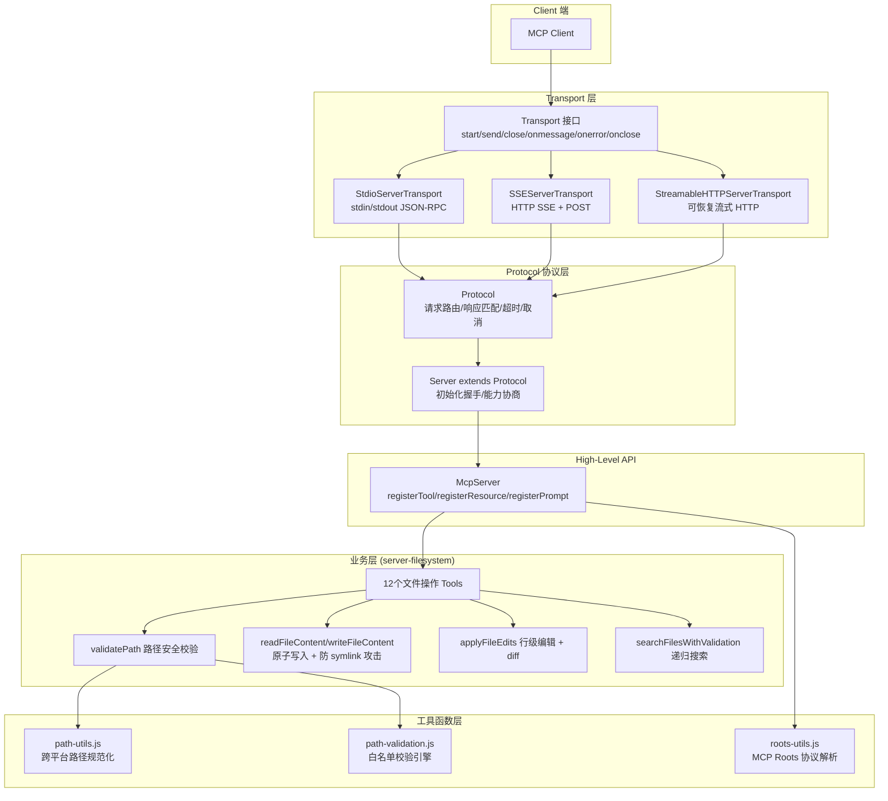
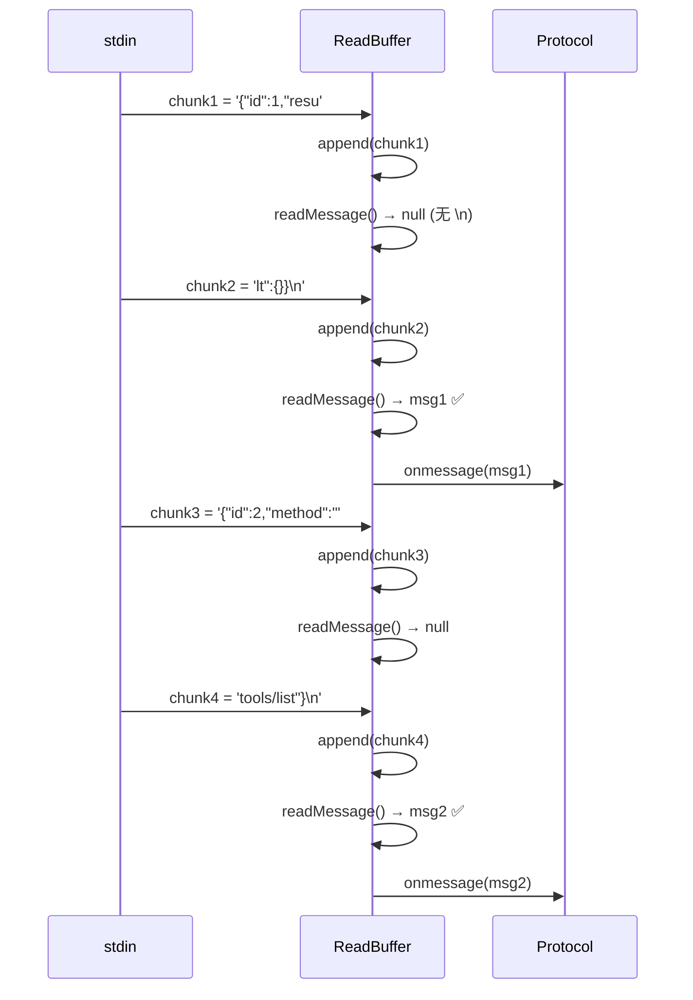
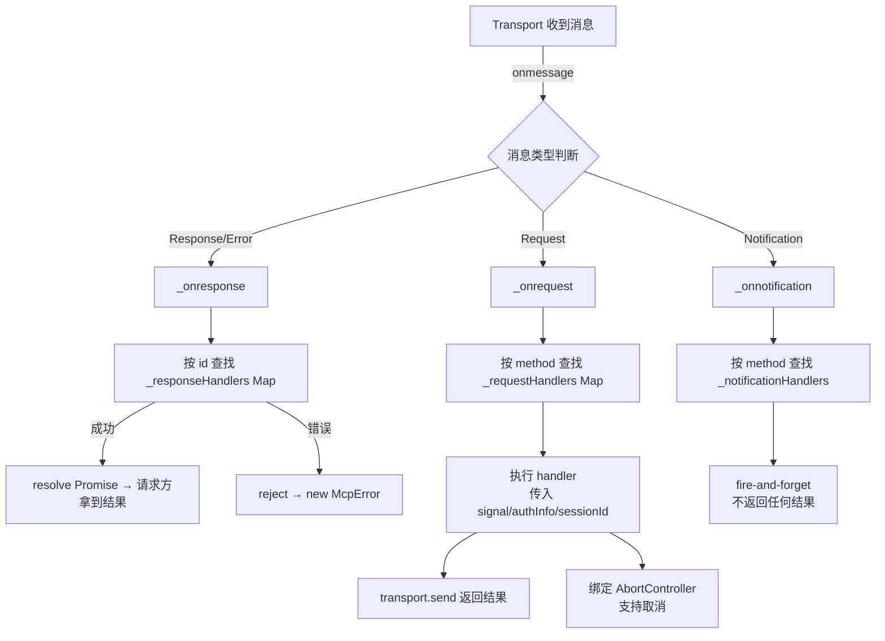
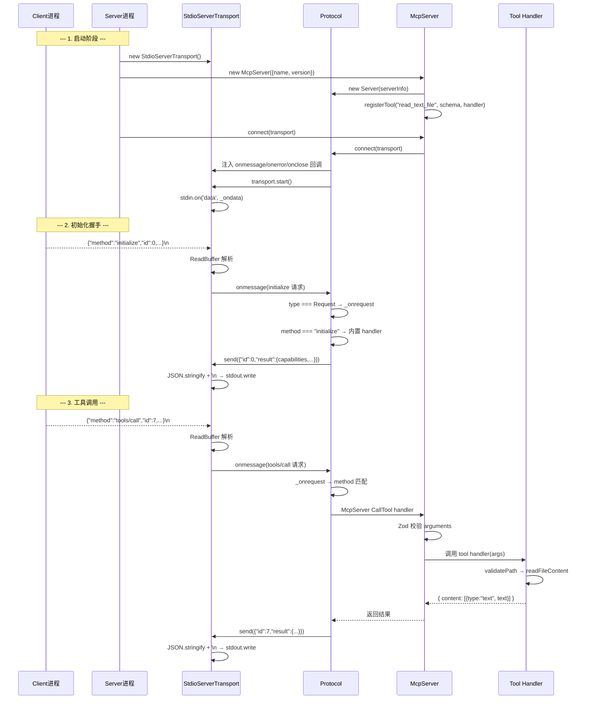

# MCP (Model Context Protocol) 底层实现原理深度剖析

> 基于 `@modelcontextprotocol/server-filesystem` v2026.1.14 源码分析  
> SDK: `@modelcontextprotocol/sdk` v1.25.2

---

## 目录

- [一、整体架构概览](#一整体架构概览)
- [二、核心模块详解](#二核心模块详解)
  - [2.1 index.js — 入口与 Server 编排](#21-indexjs--入口与-server-编排)
  - [2.2 lib.js — 安全核心与文件操作](#22-libjs--安全核心与文件操作)
  - [2.3 path-utils.js — 跨平台路径处理](#23-path-utilsjs--跨平台路径处理)
  - [2.4 path-validation.js — 路径白名单引擎](#24-path-validationjs--路径白名单引擎)
  - [2.5 roots-utils.js — MCP Roots 协议](#25-roots-utilsjs--mcp-roots-协议)
- [三、Transport 传输层底层原理](#三transport-传输层底层原理)
  - [3.1 Transport 接口抽象](#31-transport-接口抽象)
  - [3.2 StdioServerTransport 实现](#32-stdioservertransport-实现)
  - [3.3 ReadBuffer — 字节流到消息的转换引擎](#33-readbuffer--字节流到消息的转换引擎)
  - [3.4 消息序列化格式](#34-消息序列化格式)
  - [3.5 背压处理](#35-背压处理)
- [四、Protocol 协议层实现](#四protocol-协议层实现)
  - [4.1 connect() — 接管 Transport](#41-connect--接管-transport)
  - [4.2 消息路由全链路](#42-消息路由全链路)
  - [4.3 请求/响应匹配机制](#43-请求响应匹配机制)
  - [4.4 超时与取消管理](#44-超时与取消管理)
- [五、完整调用链](#五完整调用链)
- [六、安全模型](#六安全模型)
- [七、设计模式总结](#七设计模式总结)
- [八、其他 Transport 实现对比](#八其他-transport-实现对比)

---

## 一、整体架构概览



---

## 二、核心模块详解

### 2.1 index.js — 入口与 Server 编排

**职责**：整个程序的编排层。

| 职责 | 实现 |
|------|------|
| 命令行解析 | 接收多个 `allowed-directory` 参数，resolve + realpath 后存入全局 `allowedDirectories` |
| Server 初始化 | `new McpServer({ name: "secure-filesystem-server", version: "0.2.0" })` |
| Tool 注册 | 注册 12 个 tools，每个包含 `title`, `description`, `inputSchema`(Zod), `outputSchema`, `annotations`, `handler` |
| Roots 协议 | 监听 `RootsListChangedNotification`，动态更新允许目录 |
| 启动 | `StdioServerTransport` + `server.connect(transport)` |

**注册的 12 个 Tools：**

| Tool | 类型 | 核心能力 |
|------|------|----------|
| `read_text_file` | 读 | 读取文本文件，支持 head/tail |
| `read_media_file` | 读 | 读取图片/音频，返回 base64 + MIME |
| `read_multiple_files` | 读 | 并发读取多个文件 |
| `write_file` | 写 | 创建/覆盖文件（原子写入） |
| `edit_file` | 写 | 行级编辑 + git-style diff |
| `create_directory` | 写 | 递归创建目录 |
| `list_directory` | 读 | 列出目录内容 |
| `list_directory_with_sizes` | 读 | 列出目录含文件大小 |
| `directory_tree` | 读 | 递归树形结构 JSON |
| `move_file` | 写 | 移动/重命名 |
| `search_files` | 读 | glob 模式递归搜索 |
| `get_file_info` | 读 | 文件元数据 |
| `list_allowed_directories` | 读 | 列出允许访问的目录 |

---

### 2.2 lib.js — 安全核心与文件操作

安全核心 + 业务逻辑，采用**多层纵深防御**策略。

**关键函数：**

```javascript
// validatePath - 路径安全校验的入口
export async function validatePath(requestedPath) {
    // Step 1: 展开 ~ 家目录
    const expandedPath = expandHome(requestedPath);
    // Step 2: 转为绝对路径
    const absolute = path.resolve(expandedPath);
    // Step 3: 跨平台路径规范化
    const normalizedRequested = normalizePath(absolute);
    // Step 4: 白名单校验（第一道防线）
    const isAllowed = isPathWithinAllowedDirectories(normalizedRequested, allowedDirectories);
    if (!isAllowed) throw new Error('Access denied');
    // Step 5: 解析符号链接的真实路径（防 symlink 逃逸攻击）
    const realPath = await fs.realpath(absolute);
    // Step 6: 对真实路径再次校验白名单（第二道防线）
    if (!isPathWithinAllowedDirectories(normalizePath(realPath), allowedDirectories)) {
        throw new Error('Access denied - symlink target outside allowed directories');
    }
    return realPath;
}
```

```javascript
// writeFileContent - 原子安全写入
export async function writeFileContent(filePath, content) {
    try {
        // 策略1: 新文件用 'wx' flag（排他创建，防 symlink 覆盖）
        await fs.writeFile(filePath, content, { encoding: "utf-8", flag: 'wx' });
    } catch (error) {
        if (error.code === 'EEXIST') {
            // 策略2: 已存在文件 → 写临时文件 → 原子 rename
            // rename 不跟随 symlink，防止 TOCTOU 竞态
            const tempPath = `${filePath}.${randomBytes(16).hex}.tmp`;
            await fs.writeFile(tempPath, content, 'utf-8');
            await fs.rename(tempPath, filePath);  // 原子替换
        }
    }
}
```

```javascript
// applyFileEdits - 智能行级编辑
export async function applyFileEdits(filePath, edits, dryRun = false) {
    // 1. 精确匹配替换（oldText 完整匹配）
    // 2. 失败时回退到行级宽松匹配（trim 后比较，保留原始缩进）
    // 3. 生成 unified diff（git-style）
    // 4. 非 dryRun 模式：临时文件 + 原子 rename 写入
    // 5. 返回格式化 diff 输出
}
```

---

### 2.3 path-utils.js — 跨平台路径处理

处理 WSL、Unix、Windows 三种环境的路径规范化。

```javascript
// expandHome - 展开 ~ 家目录
export function expandHome(filepath) {
    if (filepath.startsWith('~/') || filepath === '~') {
        return path.join(os.homedir(), filepath.slice(1));
    }
    return filepath;
}

// normalizePath - 跨平台路径规范化
export function normalizePath(p) {
    // 1. 去除引号和空白
    // 2. WSL 路径 (/mnt/c/) → 保留不变（Node.js WSL 原生支持）
    // 3. Unix-style Windows (/c/...) → 在 win32 平台转换为 C:\...
    // 4. 处理 UNC 路径 (\\...)
    // 5. 统一斜杠方向
    // 6. 驱动器号大写
    // 7. path.normalize() 处理 . 和 .. 段
}
```

---

### 2.4 path-validation.js — 路径白名单引擎

```javascript
export function isPathWithinAllowedDirectories(absolutePath, allowedDirectories) {
    // 1. 类型校验 + 空值过滤
    // 2. null byte 检测（路径注入防护）
    // 3. path.resolve + path.normalize 标准化
    // 4. 验证标准化后仍为绝对路径
    // 5. 遍历白名单，逐个检查前缀匹配:
    //    - exact match: normalizedPath === normalizedDir
    //    - subdirectory: normalizedPath.startsWith(normalizedDir + sep)
    //    - 根目录特判: normalizedDir === path.sep
    //    - Windows 驱动器根特判: C:\
}
```

---

### 2.5 roots-utils.js — MCP Roots 协议

MCP 协议允许 Client 在运行时动态下发"允许访问的根目录"。

```javascript
// parseRootUri - 解析 Root URI
async function parseRootUri(rootUri) {
    // 1. 去除 file:// 前缀
    const rawPath = rootUri.startsWith('file://') ? rootUri.slice(7) : rootUri;
    // 2. 展开 ~ 家目录
    const expandedPath = rawPath.startsWith('~/') ? path.join(homedir, rawPath.slice(1)) : rawPath;
    // 3. 解析为绝对路径
    const absolutePath = path.resolve(expandedPath);
    // 4. 解析符号链接（安全）
    const resolvedPath = await fs.realpath(absolutePath);
    // 5. 规范化输出
    return normalizePath(resolvedPath);
}
```

---

## 三、Transport 传输层底层原理

### 3.1 Transport 接口抽象

```typescript
// Transport 的核心接口定义
interface Transport {
    start(): Promise<void>;                          // 启动传输
    send(message: JSONRPCMessage, options?): Promise<void>;  // 发送消息
    close(): Promise<void>;                          // 关闭连接

    // 三大回调 — 由 Protocol 层注入
    onclose?: () => void;                            // 连接关闭
    onerror?: (error: Error) => void;                // 错误处理
    onmessage?: (message, extra?) => void;           // 消息到达

    sessionId?: string;
}
```

设计原则：**Transport 只负责"字节搬运"，不关心消息语义**。所有消息路由、请求/响应匹配、超时管理都在 Protocol 层完成。

---

### 3.2 StdioServerTransport 实现

```javascript
export class StdioServerTransport {
    constructor(_stdin = process.stdin, _stdout = process.stdout) {
        this._readBuffer = new ReadBuffer();
        this._started = false;

        // 箭头函数绑定 this，保持函数引用恒定（便于后续 off 移除）
        this._ondata = (chunk) => {
            this._readBuffer.append(chunk);
            this.processReadBuffer();  // 立即尝试解析
        };
        this._onerror = (error) => {
            this.onerror?.(error);    // 转发给 Protocol 层
        };
    }
}
```

#### `start()` — 开启数据流

```javascript
async start() {
    if (this._started) throw new Error('Already started!');
    this._started = true;
    // 监听 stdin 的 data 事件
    // Node.js 的 process.stdin 默认处于 paused 模式
    // on('data', ...) 会隐式将流切换到 flowing 模式
    this._stdin.on('data', this._ondata);
    this._stdin.on('error', this._onerror);
}
```

#### `send()` — 写入 stdout（含背压处理）

```javascript
send(message) {
    return new Promise(resolve => {
        const json = serializeMessage(message);  // JSON.stringify + '\n'
        if (this._stdout.write(json)) {
            resolve();                           // 缓冲未满，立即完成
        } else {
            this._stdout.once('drain', resolve); // 缓冲已满，等待排空
        }
    });
}
```

背压机制：`stream.write()` 返回 `false` 表示内部缓冲区已满（默认 highWaterMark = 16KB），此时等待 `drain` 事件。

#### `close()` — 优雅关闭

```javascript
async close() {
    this._stdin.off('data', this._ondata);
    this._stdin.off('error', this._onerror);

    // 防御性检查：只有我们是唯一监听者时才 pause stdin
    if (this._stdin.listenerCount('data') === 0) {
        this._stdin.pause();
    }

    this._readBuffer.clear();
    this.onclose?.();
}
```

---

### 3.3 ReadBuffer — 字节流到消息的转换引擎

```javascript
export class ReadBuffer {
    append(chunk) {
        // 累积字节到 buffer 尾部
        this._buffer = this._buffer
            ? Buffer.concat([this._buffer, chunk])
            : chunk;
    }

    readMessage() {
        if (!this._buffer) return null;

        // 查找第一个 \n（帧分隔符）
        const index = this._buffer.indexOf('\n');
        if (index === -1) return null;  // 还没有完整的一行

        // 截取一行（去掉尾部 \r 兼容 Windows）
        const line = this._buffer.toString('utf8', 0, index).replace(/\r$/, '');
        // 保留剩余数据
        this._buffer = this._buffer.subarray(index + 1);

        // JSON 解析 → Zod Schema 校验 → 返回类型安全的消息对象
        return JSONRPCMessageSchema.parse(JSON.parse(line));
    }

    clear() {
        this._buffer = undefined;
    }
}
```

**工作流程图：**



**关键设计：** 不假设 chunk 边界对齐消息边界，支持消息跨多个 chunk 到达。

---

### 3.4 消息序列化格式

```
协议格式 = JSON-RPC 2.0 + 换行(\n) 作为帧分隔符

stdin (Client → Server):
┌──────────────────────────────────────────────────┐
│ {"jsonrpc":"2.0","method":"tools/call",...}\n    │
│ {"jsonrpc":"2.0","method":"tools/list",...}\n    │
└──────────────────────────────────────────────────┘

stdout (Server → Client):
┌──────────────────────────────────────────────────┐
│ {"jsonrpc":"2.0","id":1,"result":{...}}\n        │
│ {"jsonrpc":"2.0","id":2,"result":{...}}\n        │
└──────────────────────────────────────────────────┘
```

序列化/反序列化：

```javascript
export function serializeMessage(message) {
    return JSON.stringify(message) + '\n';
}

export function deserializeMessage(line) {
    return JSONRPCMessageSchema.parse(JSON.parse(line));
}
```

---

### 3.5 背压处理

当 Server 需要快速连续发送大量数据时（如读取大文件）：

```javascript
// send() 中的背压处理
if (this._stdout.write(json)) {
    resolve();  // 数据已写入内核缓冲区
} else {
    // 内核缓冲区已满（超过 16KB highWaterMark）
    // 等待 drain 事件：Client 端消费完数据后触发
    this._stdout.once('drain', resolve);
}
```

这确保：
- 快速连续发送不会撑爆内存
- `await transport.send()` 会阻塞直到对端消费完

---

## 四、Protocol 协议层实现

`Protocol` 是 Transport 和业务逻辑之间的桥梁，负责所有消息的智能处理。

### 4.1 connect() — 接管 Transport

```javascript
async connect(transport) {
    this._transport = transport;

    // 包装三个回调 — 保留原始回调，链式调用
    const _onclose = transport.onclose;
    this._transport.onclose = () => {
        _onclose?.();
        this._onclose();  // Protocol 层清理
    };

    const _onerror = transport.onerror;
    this._transport.onerror = (error) => {
        _onerror?.(error);
        this._onerror(error);  // Protocol 层错误处理
    };

    const _onmessage = transport.onmessage;
    this._transport.onmessage = (message, extra) => {
        _onmessage?.(message, extra);
        // 核心：消息分类路由
        if (isJSONRPCResultResponse(message) || isJSONRPCErrorResponse(message)) {
            this._onresponse(message);       // → 匹配请求ID
        } else if (isJSONRPCRequest(message)) {
            this._onrequest(message, extra); // → 查找 handler 并执行
        } else if (isJSONRPCNotification(message)) {
            this._onnotification(message);   // → fire-and-forget
        }
    };

    await this._transport.start();
}
```

---

### 4.2 消息路由全链路



---

### 4.3 请求/响应匹配机制

```javascript
// Protocol 维护的核心数据结构
this._requestMessageId = 0;                  // 自增请求 ID
this._requestHandlers = new Map();           // method → handler（处理入站请求）
this._notificationHandlers = new Map();      // method → handler（处理通知）
this._responseHandlers = new Map();          // id → {resolve, reject}（匹配出站响应）
this._requestHandlerAbortControllers = new Map();  // id → AbortController（取消）
this._progressHandlers = new Map();          // token → ProgressCallback（进度回调）
this._timeoutInfo = new Map();              // id → TimeoutInfo（超时管理）
```

**匹配过程：**

```
Server 发出请求:
    1. id = ++this._requestMessageId (自增，全局唯一)
    2. this._responseHandlers.set(id, { resolve, reject })
    3. transport.send({ jsonrpc: "2.0", id, method: "...", params: {...} })
    4. return new Promise(...)  // 等待 _onresponse 来 resolve

Server 收到响应:
    1. _onresponse(response) 被调用
    2. handler = this._responseHandlers.get(response.id)
    3. handler.resolve(response.result) 或 handler.reject(error)
    4. this._responseHandlers.delete(response.id)
    5. 清理超时计时器
```

---

### 4.4 超时与取消管理

```typescript
type RequestOptions = {
    timeout?: number;              // 单次超时 (默认 60000ms)
    maxTotalTimeout?: number;      // 最大总超时 (无视进度重置)
    resetTimeoutOnProgress?: boolean;  // 收到进度通知时重置计时器
    signal?: AbortSignal;          // 外部取消信号
};

// 取消机制
_oncancel(notification) {
    const controller = this._requestHandlerAbortControllers.get(requestId);
    controller?.abort(reason);  // 触发 AbortController，handler 中的 signal 变为 aborted
}
```

---

## 五、完整调用链

以 `read_text_file` 为例：



---

## 六、安全模型

采用**4 层纵深防御**策略：

```
Layer 1: 启动时 — 路径白名单初始化
    └─ allowedDirectories = [realpath(dir1), realpath(dir2), ...]

Layer 2: 每次操作前 — validatePath()
    ├─ expandHome → resolve → normalizePath
    ├─ isPathWithinAllowedDirectories()  ← 白名单检查（第一道防线）
    └─ fs.realpath() → 再次 isPathWithinAllowedDirectories()  ← 防 symlink 逃逸（第二道防线）

Layer 3: 写入操作 — 原子写入防竞态
    ├─ 新文件: fs.writeFile(path, content, { flag: 'wx' })
    │   └─ 'wx' 保证排他创建，文件存在则失败（防 symlink 覆盖）
    └─ 已存在文件: 先写临时文件 → fs.rename() 原子替换
        └─ rename 不跟随 symlink，防止 TOCTOU 竞态窗口

Layer 4: 路径规范化 — 消除路径表示歧义
    └─ path-utils.js 处理 WSL/Unix/Windows 差异
```

**TOCTOU (Time-of-check to Time-of-use) 防护：**

```
攻击场景:
    1. validatePath("/allowed/foo") → ✓ 通过
    2. 攻击者: mv /allowed/foo → /allowed/foo_link → /etc/passwd (symlink)
    3. fs.writeFile("/allowed/foo") → 写入了 /etc/passwd ❌

防护措施:
    - validatePath 中使用 fs.realpath() 解析真实路径
    - 'wx' flag 确保不覆盖已存在的 symlink
    - rename() 系统调用不跟随 symlink，原子替换目标
```

---

## 七、设计模式总结

| 模式 | 体现 | 说明 |
|------|------|------|
| **Transport-agnostic Server** | `McpServer` 不关心传输层，通过 `connect(transport)` 注入 | 策略模式 |
| **Tool Registry 模式** | 通过 `server.registerTool()` 注册，每个 tool = `{schema, handler, annotations}` | 命令模式 |
| **Schema-driven** | 所有输入/输出由 Zod schema 定义，自动校验和生成 JSON Schema | 类型驱动 |
| **Annotations 元编程** | `readOnlyHint`, `idempotentHint`, `destructiveHint` 让 Client 做智能决策 | 声明式 |
| **Callback Injection** | Protocol 接管 Transport 的 `onmessage/onerror/onclose` | 控制反转 |
| **Promise Map 匹配** | `Map<id, {resolve, reject}>` 基于自增 ID 精确匹配请求/响应 | 异步关联 |
| **Type-narrowing Router** | `isJSONRPCRequest/Response/Notification` 三分消息 | 类型守卫 |
| **Incremental Parsing** | ReadBuffer 不假设 chunk 边界，支持消息跨 chunk | 流式处理 |
| **Backpressure** | `stream.write()` + `drain` 事件防止内存溢出 | 生产者-消费者 |
| **纵深防御** | 4 层安全防线 | 安全模式 |

---

## 八、其他 Transport 实现对比

SDK 提供了三种 Transport，都遵循同一个 `Transport` 接口：

| Transport | 物理层 | 适用场景 | 特点 |
|---|---|---|---|
| `StdioServerTransport` | stdin/stdout 管道 | 本地进程通信 | 最简单，零网络开销，line-delimited JSON-RPC |
| `SSEServerTransport` | HTTP SSE + POST | HTTP 服务（Web/云端） | 服务端推送 + 客户端 POST，需独立端口 |
| `StreamableHTTPServerTransport` | HTTP Streaming | 需要会话恢复的远程场景 | 支持断线重连（resumption token）、事件持久化 |

三者实现相同的 `start/send/close` + 三个回调，Protocol 层完全无感知底层差异。这是经典的**策略模式**应用。

---

## 附录：关键数据结构

### JSON-RPC 请求消息
```json
{
    "jsonrpc": "2.0",
    "id": 7,
    "method": "tools/call",
    "params": {
        "name": "read_text_file",
        "arguments": {
            "path": "/tmp/example.txt"
        }
    }
}
```

### JSON-RPC 响应消息
```json
{
    "jsonrpc": "2.0",
    "id": 7,
    "result": {
        "content": [
            {
                "type": "text",
                "text": "文件内容..."
            }
        ],
        "structuredContent": {
            "content": "文件内容..."
        }
    }
}
```

### JSON-RPC 通知消息（无 id，无响应）
```json
{
    "jsonrpc": "2.0",
    "method": "notifications/initialized"
}
```

### JSON-RPC 错误响应
```json
{
    "jsonrpc": "2.0",
    "id": 7,
    "error": {
        "code": -32602,
        "message": "Invalid params",
        "data": "..."
    }
}
```

---

> **总结**：MCP 的核心理念是 **极简抽象 + 关注点分离**。Transport 只做字节搬运，Protocol 负责所有智能（路由、匹配、超时、取消），业务层完全不用关心底层是 stdio 还是 HTTP。换行分隔的 JSON-RPC 作为 wire format，既人类可读又流式友好。回调注入模式实现了 Protocol → Transport 的控制反转，使得 Transport 可以被任意替换。
