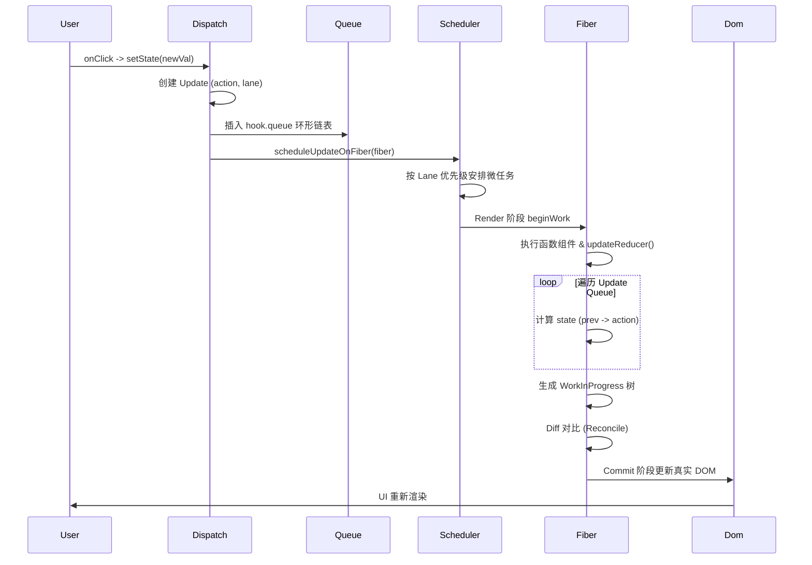
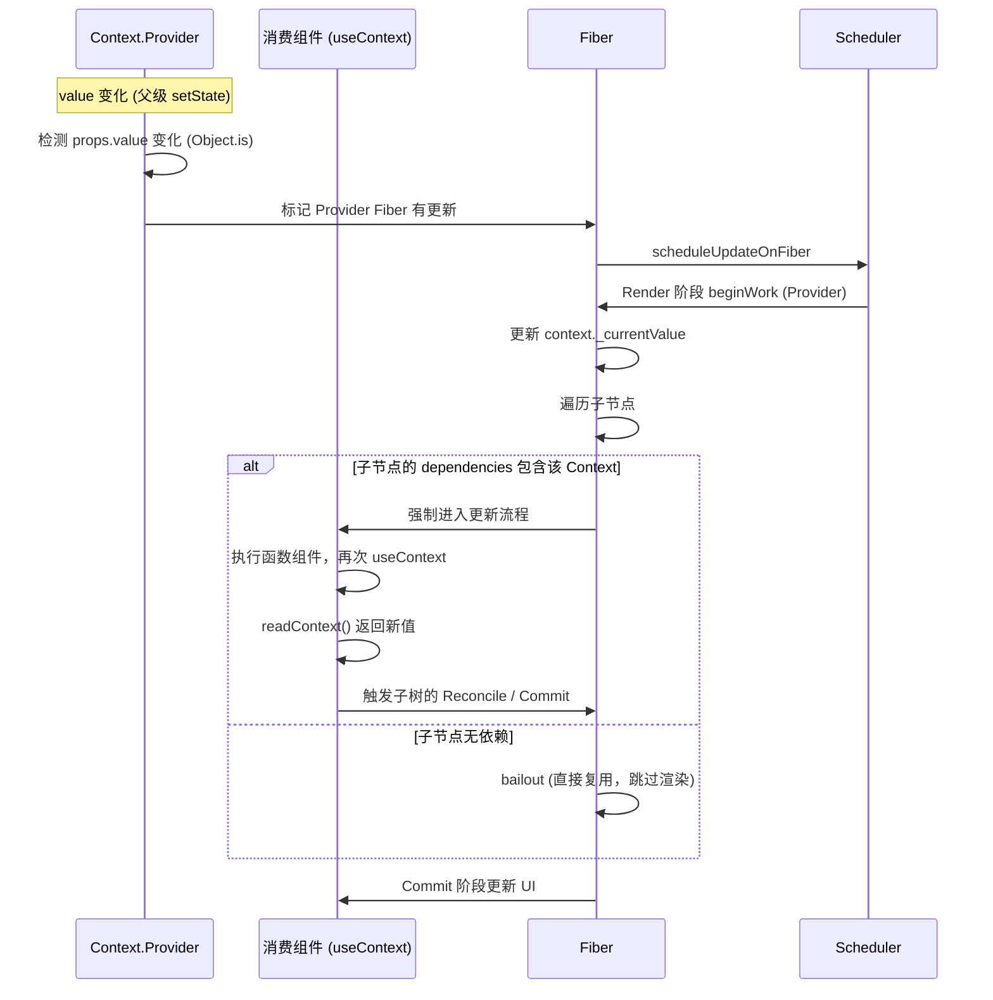

# React 状态管理深度解析

本文档整合了 React 生态中常用状态管理方案的架构设计、底层原理、执行流程及核心 API 调用栈，涵盖内置方案（`useState`/`useReducer`、Context API）与专业库（TanStack Query），旨在提供从基础到进阶的完整认知。

---

## 一、状态管理方案概览

| 方案                        | 适用场景                         | 核心特点                                                                             |
| :-------------------------- | :------------------------------- | :----------------------------------------------------------------------------------- |
| **useState / useReducer**   | 组件内部状态                     | 基于 Fiber 与 Hook 链表，通过 Update 队列实现调度更新，支持优先级与批处理            |
| **Context API**             | 跨组件共享（主题、用户信息等）   | Provider-Consumer 模式，通过依赖链（`fiber.dependencies`）实现精准更新，避免无效渲染 |
| **Zustand / Redux Toolkit** | 复杂全局状态                     | 外部 Store + 不可变更新，Redux 基于 Flux 单向流，Zustand 更轻量，支持选择性订阅      |
| **TanStack Query**          | 服务器数据状态（缓存、请求状态） | 框架无关核心 + 观察者模式，Stale-While-Revalidate 策略，自动去重、重试与垃圾回收     |

---

## 二、React 内置状态管理（useState / useReducer & Context）

### 2.1 useState / useReducer

#### 架构设计：基于 Fiber 的 Hook 链表

- 每个组件实例对应一个 **Fiber 节点**，`fiber.memoizedState` 指向第一个 Hook。
- 同一组件内的多个 Hook 通过 **单向环形链表** 连接，每个 Hook 节点包含：
  - `memoizedState`：当前状态值（`useState` 存值，`useReducer` 存当前 state）。
  - `queue`：更新队列，存放待处理的 Update 对象（环形链表）。
  - `next`：指向下一个 Hook。

```
Fiber Node (组件)
  └─ memoizedState (Hook0)
       ├─ memoizedState: 0
       ├─ queue (Update Ring)
       └─ next ──▶ Hook1 (useEffect)
                     ├─ memoizedState: EffectObject
                     └─ next ──▶ Hook2 (useState)
                                  ├─ memoizedState: 'hello'
                                  └─ next (null)
```

#### 底层原理

1. **双缓冲与调度**  
   `setState` 将 Update 对象入队到 `hook.queue`，然后调用 `scheduleUpdateOnFiber` 触发调度。React 通过 **Lane 模型** 区分更新优先级。

2. **状态计算**  
   渲染阶段执行 `updateReducer`，遍历 Update 队列，通过闭包缓存的 `reducer` 计算最新状态（`useState` 默认使用 `basicStateReducer`）。

3. **批处理**  
   在合成事件中，多个 `setState` 会被合并为一次渲染，通过 `batchedUpdates` 标记批量模式。

4. **闭包陷阱**  
   每次渲染基于 `memoizedState` 生成快照，闭包捕获的是特定帧的值，函数式更新（`setState(prev => prev + 1)`）可避免过期覆盖。

#### 执行流程图



#### 核心 API 调用栈

```
dispatchAction (fiber, queue, action)
  ├─ 创建 Update (lane, action, priority)
  ├─ 插入 queue.pending 环形链表
  ├─ scheduleUpdateOnFiber(fiber, lane)
  │    ├─ markUpdateLaneFromFiberToRoot (标记更新)
  │    ├─ ensureRootIsScheduled(root)
  │    │    ├─ 根据 Lanes 选择调度优先级
  │    │    └─ scheduleCallback (Scheduler)
  │    │         └─ performConcurrentWorkOnRoot
  │    │              └─ workLoop (Render 阶段)
  │    │                   └─ beginWork
  │    │                        └─ updateFunctionComponent
  │    │                             └─ renderWithHooks
  │    │                                  └─ updateReducer
  │    │                                       ├─ 从 queue 取更新
  │    │                                       ├─ 循环执行 action
  │    │                                       └─ 返回最新 state
  │    └─ commitRoot (Commit 阶段)
  │         ├─ commitBeforeMutationEffects
  │         ├─ commitMutationEffects (更新 DOM)
  │         └─ commitLayoutEffects (useEffect 执行)
  └─ 返回新状态
```

---

### 2.2 Context API

#### 架构设计：Provider-Consumer 与 Fiber 依赖链

- **ReactContext 对象**：由 `createContext` 创建，内含 `_currentValue`、`Provider`、`Consumer` 组件。
- **Fiber 依赖**：消费 Context 的组件 Fiber 会在 `fiber.dependencies` 链表上挂载该 Context，用于精准定位更新。
- **值栈（Value Stack）**：渲染时通过 `pushProvider` / `popProvider` 管理嵌套 Context 的值。

```
Context 对象
  ├─ _currentValue: 'light'
  ├─ Provider 组件
  └─ Consumer 组件

Fiber 树
  └─ App
       └─ Context.Provider (value='light')
            └─ DeepChild (fiber.dependencies 包含该 Context)
```

#### 底层原理

1. **值传递**  
   Provider 渲染时调用 `pushProvider` 将新值入栈并赋给 `context._currentValue`，子组件通过 `useContext` 直接读取（利用闭包/全局指针）。

2. **更新传播**  
   Provider 的 `value` 变化时，React **不** 默认重渲染所有子组件。而是：
   - 标记 Provider Fiber 有更新；
   - 在 `beginWork` 中，检查子 Fiber 的 `dependencies` 是否包含该 Context，若包含则强制更新，否则 `bailout` 复用。
   - 通过 `Object.is` 比较新旧值决定是否触发更新。

3. **与 useState 联动**  
   Context 本身仅传递值，实际变化由 `useState`/`useReducer` 驱动，将 setter 挂载到 Provider 的 `value` 中，变化时触发整个链条更新。

#### 执行流程图（值变化 -> 组件刷新）



#### 核心 API 调用栈

```
createContext(defaultValue)
  └─ 返回 ReactContext 对象
       ├─ $$typeof: REACT_CONTEXT_TYPE
       ├─ _currentValue: defaultValue
       ├─ Provider
       └─ Consumer

// Provider 渲染
beginWork (Provider Fiber)
  ├─ pushProvider(workInProgress, context, newValue)
  │    ├─ 旧值入栈 (valueCursor)
  │    └─ context._currentValue = newValue
  ├─ 渲染子节点 (reconcileChildren)
  └─ 离开时 popProvider(context)

// 消费 Context
useContext(Context)
  └─ readContext(Context, observedBits)
       ├─ 读取 context._currentValue
       ├─ 在 fiber.dependencies 中注册该 Context
       └─ 返回当前值

// Provider 更新触发
updateContextProvider(workInProgress, newValue)
  ├─ 对比 oldValue 与 newValue (Object.is)
  ├─ 若不同：
  │    ├─ pushProvider 更新值
  │    ├─ markWorkInProgressReceivedUpdate()
  │    └─ 遍历 fiber.dependencies，标记依赖该 Context 的 Fiber 需更新
  └─ 继续协调子节点
```

---

## 三、TanStack Query (React Query) 深度剖析

### 3.1 架构设计

采用 **框架无关核心 + 框架观察者层** 的分层架构：

```
┌─────────────────────────────────────────────────────────────┐
│              框架集成层 (React/Vue/Solid)                   │
│          useQuery, useMutation, useInfiniteQuery            │
├─────────────────────────────────────────────────────────────┤
│              观察者层 (Observer)                            │
│       QueryObserver / MutationObserver / QueriesObserver     │
├─────────────────────────────────────────────────────────────┤
│              核心管理层 (Core)                              │
│   QueryClient (中央协调器) → QueryCache / MutationCache      │
├─────────────────────────────────────────────────────────────┤
│              基础设施层 (Infrastructure)                     │
│   FocusManager / OnlineManager / NotifyManager / GC          │
└─────────────────────────────────────────────────────────────┘
```

**核心类职责**：

| 类                | 职责                                           |
| :---------------- | :--------------------------------------------- |
| **QueryClient**   | 中央协调器，提供 fetch、预取、失效等命令式 API |
| **QueryCache**    | 以 `queryHash` 为键存储 Query 实例的容器       |
| **Query**         | 单个查询实体，管理状态、请求、重试、垃圾回收   |
| **QueryObserver** | 连接 Query 与 UI，将原始状态转换为可渲染结果   |

**设计原则**：
- **框架无关**：核心逻辑与 UI 解耦。
- **观察者模式**：`QueryObserver` 订阅 `Query`，数据变化自动通知所有订阅组件。
- **状态二维正交**：`status`（pending/success/error）与 `fetchStatus`（idle/fetching/paused）独立。
- **Stale-While-Revalidate**：优先返回缓存，后台异步刷新。

---

### 3.2 实现原理

#### ① Query 状态机（Reducer 模式）

Query 通过 `#dispatch(action)` 更新状态，核心 Action：
- `fetch` → `fetchStatus: 'fetching'`
- `success` → `status: 'success'`, 更新 `data`
- `error` → `status: 'error'`, 存储错误
- `failed` → 递增重试计数

#### ② 缓存机制

- 使用 `Map<string, Query>` 存储，`queryKey` 通过 `hashKey`（对象按 key 排序后序列化）生成唯一 `queryHash`。
- 垃圾回收：Query 无观察者后，启动 `gcTime`（默认 5 分钟）定时器，到期移除。

#### ③ 请求去重

相同 `queryKey` 的并发请求复用同一 Query 实例，避免重复请求。

#### ④ 重试与取消

Retryer 管理重试逻辑，`queryFn` 接收 `AbortSignal`，支持请求取消。

#### ⑤ 结构共享

更新数据时，比较新旧结构，**尽可能复用不变引用**，减少重渲染。

---

### 3.3 工作流程

#### 首次请求流程

```
Component → useBaseQuery → QueryObserver → QueryCache → Query → Retryer → queryFn → 网络请求
                                                                                      ↓
                                                                                  onSuccess
                                                                                      ↓
                                                                          dispatch({ type: 'success' })
                                                                                      ↓
                                                                          遍历 observers 通知 → 组件重渲染
```

#### 缓存命中流程

- 存在缓存 → 直接返回数据。
- 检查是否过期（`staleTime`），未过期则直接使用，否则后台 `refetch`。

#### 失效与重新验证

`queryClient.invalidateQueries({ queryKey })` → 标记 `isInvalidated: true` → 通知观察者 → 后台 refetch。

#### 自动重新获取触发条件

- 窗口聚焦（`refetchOnWindowFocus`）
- 网络重连（`refetchOnReconnect`）
- 定时轮询（`refetchInterval`）
- Query Key 变化

---

### 3.4 关键代码调用栈

#### useQuery 完整调用链

```
useQuery(queryKey, queryFn, options)
  └─ parseQueryArgs()
       └─ useBaseQuery(parsedOptions, QueryObserver)
            ├─ useQueryClient()                   // 获取 client
            ├─ new QueryObserver(client, options)
            ├─ observer.getOptimisticResult()
            │    └─ queryCache.build(client, options)
            │         ├─ hashQueryKeyByOptions() → queryHash
            │         ├─ 从 cache 获取已有 Query 或 new Query()
            │         └─ 返回结果
            └─ useSyncExternalStore(subscribe, getSnapshot)
                 └─ observer.subscribe()
                      └─ onSubscribe()
                           ├─ query.addObserver(observer)
                           └─ 若 stale 或 无数据 → query.fetch()
                                └─ createRetryer({ fn: queryFn })
                                     └─ queryFn() → 请求
                                          └─ onSuccess(data)
                                               └─ query.#dispatch({ type: 'success', data })
                                                    └─ reducer 更新状态
                                                         └─ notifyManager.batch()
                                                              └─ 遍历 observers 通知
                                                                   └─ useSyncExternalStore 触发重渲染
```

#### QueryClient 核心方法

| 方法                | 调用链                                          | 用途         |
| :------------------ | :---------------------------------------------- | :----------- |
| `fetchQuery`        | → `queryCache.build()` → `query.fetch()`        | 命令式获取   |
| `prefetchQuery`     | → `fetchQuery`（不返回结果）                    | 预取         |
| `invalidateQueries` | → `queryCache.findAll()` → 标记 `isInvalidated` | 失效         |
| `refetchQueries`    | → `queryCache.findAll()` → `query.fetch()`      | 手动 refetch |
| `getQueryData`      | → `queryCache.find()` → `query.state.data`      | 获取缓存     |
| `setQueryData`      | → `query.setData()` → `#dispatch`               | 直接更新缓存 |

#### React 集成关键点

`useSyncExternalStore` 保证外部状态与 React 渲染周期同步，避免并发渲染撕裂（tearing），且仅当使用的属性变化时才触发重渲染（属性追踪）。

---

## 四、总结对比

| 特性         | useState / useReducer                 | Context API                        | TanStack Query                    |
| :----------- | :------------------------------------ | :--------------------------------- | :-------------------------------- |
| **数据存储** | Fiber 上的 Hook 链表                  | ReactContext 对象（值栈）          | QueryCache（Map）                 |
| **更新驱动** | 当前组件及其子组件                    | 仅通知 `dependencies` 中注册的组件 | 观察者模式，只通知订阅的 Observer |
| **性能优化** | 手动 `memo` / `shouldComponentUpdate` | 依赖追踪自动跳过无关子树           | 结构共享 + 细粒度订阅             |
| **核心机制** | Update Queue + Lane 优先级            | 值栈 + 依赖链表                    | Stale-While-Revalidate + Retryer  |
| **适用场景** | 组件内局部状态                        | 跨层级静态/低频共享                | 服务器数据状态管理                |

---

*本文档综合了 React 内置状态机制与 TanStack Query 的设计精髓，旨在帮助开发者深入理解状态管理的底层运转，从而做出更优的技术选型与性能调优决策。*