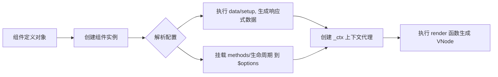

## Vue 组件原理全景图谱

### 一、组件的本质：一个“配置对象”的编译与实例化

无论你写的是 **选项式 API (Options API)** 还是 **组合式 API (Composition API)**，Vue 组件的本质都是一个**包含数据、逻辑、渲染函数的对象**。

| 编写方式              | 源码形态                              | 编译后给运行时的形态                                           |
| :-------------------- | :------------------------------------ | :------------------------------------------------------------- |
| **SFC (`.vue` 文件)** | `<template>` + `<script>` + `<style>` | `template` 被编译成 `render` 函数，`<script>` 导出组件配置对象 |
| **CDN 字符串模板**    | 直接在 HTML 中写模板字符串            | 浏览器运行时将模板字符串编译成 `render` 函数                   |
| **纯 JS / TSX**       | 手写 `render` 或 `h` 函数             | 直接作为组件配置对象的 `render` 属性                           |

---

### 二、组件的“孕育”：从定义到实例（核心阶段）

当 Vue 开始渲染一个组件时，会经历以下严格的实例化过程（结合你之前见过的 `render` 函数参数）：



#### 1. 数据与逻辑的拆分存储（`$data` 与 `$options`）
- **`$data`**：存放响应式状态。执行 `data()` 函数（选项式）或 `setup()` 返回的 `ref/reactive`（组合式），通过 `reactive` 或 `RefImpl` 包装成响应式。
- **`$options`**：存放非响应式的配置。包括 `methods`、`watch`、生命周期钩子、`components`、自定义属性（如你之前问的 `$http`）。

#### 2. 万能代理 `_ctx` 的建立（模板访问的“总闸门”）
`render` 函数接收的第一个参数 `_ctx` 是一个 **Proxy 代理对象**。它的**属性查找优先级**为：
**`$setup` > `$data` > `$props` > `$options`**

这就是为什么你在模板里写 `{{ count }}`，编译器翻译成 `_ctx.count` 后，它能精准地找到 `data` 里的 `count`、`props` 里的 `count` 或 `methods` 里的 `count`。

---

>可以将写好的Vue传入https://template-explorer.vuejs.org/自动生成渲染的模版代码

### 三、组件的“骨架”：Render 函数与 VNode 的生成

你之前贴的编译后代码（`_createElementVNode`、`_withDirectives`）就是这一阶段的具体体现。

1. **模板编译**：`<template>` 被编译为 `render` 函数。这个函数接收 `_ctx, _cache, $props, $setup, $data, $options`。
   - `_cache`：用于缓存静态节点或事件处理函数，是 Vue 3 的性能优化“黑盒”，开发者无需触碰。
2. **执行 `render`**：调用该函数，返回 **VNode (虚拟节点)** 树。
3. **初次挂载 (Mount)**：Vue 运行时将 VNode 树转换为真实 DOM（`patch` 过程），挂载到容器上，然后触发 `mounted` 生命周期。

---

### 四、组件的“生命”：响应式更新机制（灵魂所在）

这是基于你之前深入分析的 `ref` 原理（`track` 和 `trigger`）。

```mermaid
graph TD
    A[用户交互/异步请求] --> B[修改响应式状态<br>例如: count.value = 1]
    B --> C[触发 setter]
    C --> D[执行 triggerRefValue]
    D --> E[遍历 dep 依赖集合]
    E --> F[将更新任务推入异步队列<br>(scheduler)]
    F --> G[下一个 Tick 执行任务]
    G --> H[重新执行组件 Render 函数]
    H --> I[生成新 VNode]
    I --> J[Diff 比较新旧 VNode]
    J --> K[最小化更新真实 DOM]
    K --> L[触发 updated 钩子]
```

**关键点回顾**：
- **依赖收集 (Track)**：发生在 `render` 执行时，读取 `ref.value` 或 `reactive.xxx`，将当前组件的渲染 `effect` 存入 `dep` 集合。
- **派发更新 (Trigger)**：发生在修改值时，遍历 `dep` 中的 `effect`，触发重新渲染。

---

### 五、组件的“通信”：内外数据流转的桥梁

组件不是孤岛，Vue 提供了多层通信机制，它们在底层都离不开我们讲过的 `$options` 和 `provide/inject`。

| 通信方式                         | 底层实现原理                                                                                                               | 关联知识点                       |
| :------------------------------- | :------------------------------------------------------------------------------------------------------------------------- | :------------------------------- |
| **Props / Emits**                | 父组件传参给子组件实例的 `$props`，子组件通过 `emit` 触发父组件事件                                                        | 编译时会被转为 `_ctx.xxx` 的读取 |
| **全局属性 (Global Properties)** | `app.config.globalProperties.$http` 在组件实例化时合并进 `$options`                                                        | 你之前问的 `$http` 来源          |
| **Provide / Inject**             | 通过 `app.provide` 或父组件 `provide` 存入依赖映射表，子组件通过 `inject` 查找（与 `$options` 同级，但在 `_ctx` 查找链中） | 跨层级传递，避免 Props 层层传递  |
| **Vue Router**                   | `app.use(router)` 时，通过 `provide` 注入响应式的 `currentRoute`，`<RouterView>` 消费它动态渲染匹配组件                    | 你问的 `routes` 如何关联到 Vue   |

---

### 六、架构执行流程图（总览）

将以上所有环节连起来，就是 Vue 组件从定义到销毁的完整闭环：

```mermaid
graph TD
    Start[开始: 定义组件] --> Compile[编译阶段:<br>模板 -> render函数<br>样式 -> 注入]
    Compile --> Instance[实例化阶段:<br>创建组件实例]
    Instance --> Init[初始化:<br>执行data/setup<br>生成$data/$setup<br>methods挂载$options]
    Init --> Proxy[建立_ctx代理<br>优先级: setup>data>props>options]
    Proxy --> Mount[挂载阶段:<br>执行render(_ctx) -> VNode<br>patch转换为真实DOM]
    Mount --> Ready[组件就绪<br>触发mounted]
    Ready --> Interaction[交互阶段]
    Interaction --> Change[修改响应式数据]
    Change --> Track[依赖收集 track<br>dep存储当前effect]
    Track --> Trigger[派发更新 trigger<br>执行dep中所有effect]
    Trigger --> ReRender[重新执行render<br>生成新VNode]
    ReRender --> Diff[Diff & Patch<br>更新DOM]
    Diff --> Update[触发updated]
    Update --> Destroy[卸载阶段:<br>清理副作用/事件监听<br>触发unmounted]
```

---

### 七、针对你过往疑问的终极定论表

| 你的疑问                                | 最终答案                                                                                                                            |
| :-------------------------------------- | :---------------------------------------------------------------------------------------------------------------------------------- |
| **`ref` 的依赖怎么加的？**              | 在 `render` 读取 `.value` 时，通过 `trackRefValue` 将当前组件的 `effect` 存入 `ref.dep` (Set) 中。                                  |
| **一个 `.vue` 文件对应几个 `render`？** | 只有一个。无论模板多复杂，最终都编译成一个单一的 `render` 函数。                                                                    |
| **`render` 函数的 6 个参数哪来的？**    | Vue 运行时在实例化组件时注入的。`_ctx` 是代理，`_cache` 是优化缓存，`$` 开头的是数据源（`$props`、`$setup`、`$data`、`$options`）。 |
| **`$http` 为什么在 `$options` 里？**    | 因为 `app.config.globalProperties` 在组件实例化时被合并进了 `$options` 对象。                                                       |
| **`routes` 怎么关联到 Vue 的？**        | `createRouter` 生成匹配器，`app.use(router)` 注入响应式路由到全局，`<RouterView>` 消费并动态渲染匹配组件。                          |

---

### 八、最终心法

Vue 组件的运行，可以归结为一句话：

> **通过 `_ctx` 代理，将响应式数据 (`$data`/`$setup`) 和静态配置 (`$options`) 注入到 `render` 函数中，生成 VNode；当响应式数据变化时，通过 `track` 和 `trigger` 机制重新执行 `render`，由 `Diff` 算法精准更新 DOM。**

掌握这个闭环，你就掌握了 Vue 的底层命脉。后续无论看源码还是排查性能问题，都能做到心中有数。